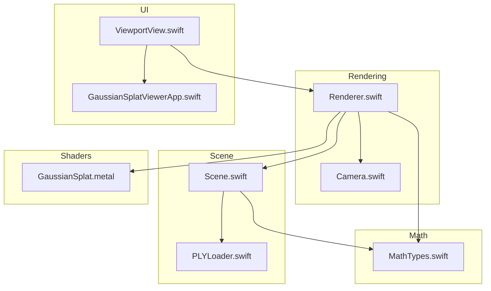
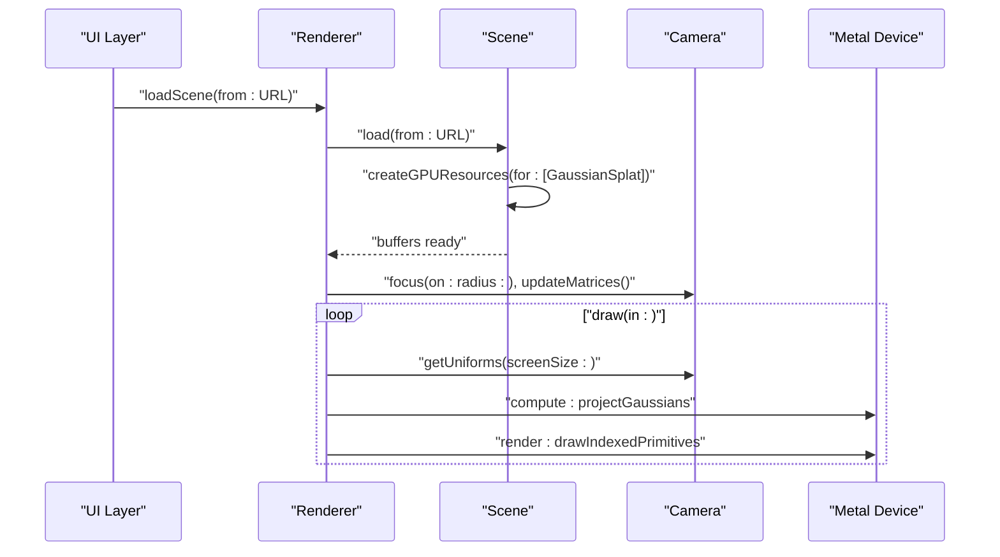
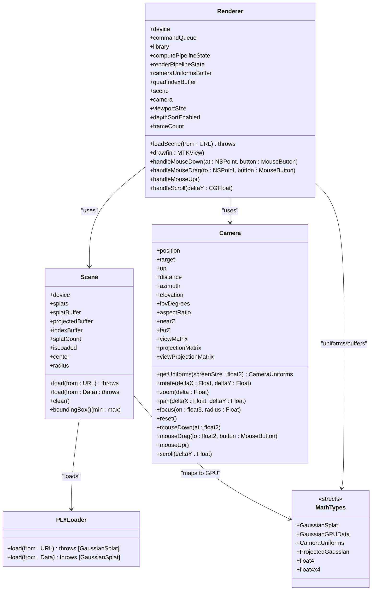

# API Reference

<cite>
**Referenced Files in This Document**
- [MathTypes.swift](file://Math/MathTypes.swift)
- [Renderer.swift](file://Rendering/Renderer.swift)
- [Scene.swift](file://Scene/Scene.swift)
- [Camera.swift](file://Rendering/Camera.swift)
- [PLYLoader.swift](file://Scene/PLYLoader.swift)
- [GaussianSplat.metal](file://Shaders/GaussianSplat.metal)
- [ViewportView.swift](file://UI/ViewportView.swift)
- [GaussianSplatViewerApp.swift](file://GaussianSplatViewer/GaussianSplatViewerApp.swift)
</cite>

## Table of Contents
1. [Introduction](#introduction)
2. [Project Structure](#project-structure)
3. [Core Components](#core-components)
4. [Architecture Overview](#architecture-overview)
5. [Detailed Component Analysis](#detailed-component-analysis)
6. [Dependency Analysis](#dependency-analysis)
7. [Performance Considerations](#performance-considerations)
8. [Troubleshooting Guide](#troubleshooting-guide)
9. [Conclusion](#conclusion)
10. [Appendices](#appendices)

## Introduction
This API reference documents the public interfaces and classes used by the Gaussian Splat Viewer. It covers mathematical data structures for Gaussian splats and GPU uniform buffers, the Renderer class for rendering control, the Scene class for scene management and resource lifecycle, and the Camera class for camera control and transformations. It also includes data structure definitions, memory layout notes, error handling, and integration patterns.

## Project Structure
The viewer is organized into focused modules:
- Math: Mathematical primitives and GPU-compatible structures
- Rendering: Renderer and Camera
- Scene: Scene management and PLY loading
- UI: SwiftUI/Metal integration and input handling
- Shaders: Metal shaders that consume GPU structures

**Diagram sources**
- [Renderer.swift:1-288](file://Rendering/Renderer.swift#L1-L288)
- [Camera.swift:1-184](file://Rendering/Camera.swift#L1-L184)
- [Scene.swift:1-140](file://Scene/Scene.swift#L1-L140)
- [PLYLoader.swift:1-403](file://Scene/PLYLoader.swift#L1-L403)
- [MathTypes.swift:1-189](file://Math/MathTypes.swift#L1-L189)
- [GaussianSplat.metal:1-309](file://Shaders/GaussianSplat.metal#L1-L309)
- [ViewportView.swift:1-185](file://UI/ViewportView.swift#L1-L185)
- [GaussianSplatViewerApp.swift:1-13](file://GaussianSplatViewer/GaussianSplatViewerApp.swift#L1-L13)

**Section sources**
- [Renderer.swift:1-288](file://Rendering/Renderer.swift#L1-L288)
- [Camera.swift:1-184](file://Rendering/Camera.swift#L1-L184)
- [Scene.swift:1-140](file://Scene/Scene.swift#L1-L140)
- [PLYLoader.swift:1-403](file://Scene/PLYLoader.swift#L1-L403)
- [MathTypes.swift:1-189](file://Math/MathTypes.swift#L1-L189)
- [GaussianSplat.metal:1-309](file://Shaders/GaussianSplat.metal#L1-L309)
- [ViewportView.swift:1-185](file://UI/ViewportView.swift#L1-L185)
- [GaussianSplatViewerApp.swift:1-13](file://GaussianSplatViewer/GaussianSplatViewerApp.swift#L1-L13)

## Core Components
This section documents the primary public APIs and data structures.

- MathTypes.swift
  - Public structures and extensions for GPU-compatible data and math utilities
  - Defines Gaussian splat data, GPU uniform buffers, projected per-splat data, and SIMD-backed math helpers
- Renderer.swift
  - Main rendering orchestrator with Metal pipeline creation, compute and render passes, and camera uniform updates
  - Provides scene loading and viewport integration hooks
- Scene.swift
  - Manages CPU and GPU resources for splats, including buffer creation and scene metrics
  - Exposes loading from URL or raw data and resource state
- Camera.swift
  - Orbit camera with spherical coordinates, sensitivity controls, and matrix computation
  - Provides camera uniform generation for GPU
- PLYLoader.swift
  - Loads Gaussian splats from PLY files (ASCII/binary LE/BE), parsing required and optional fields
  - Throws structured errors for malformed or unsupported files
- GaussianSplat.metal
  - Metal shaders consuming the GPU structures and implementing projection, vertex, and fragment stages
- UI/ViewportView.swift
  - SwiftUI wrapper around MTKView with input handling and ViewModel coordination
- GaussianSplatViewerApp.swift
  - Application entry point

**Section sources**
- [MathTypes.swift:1-189](file://Math/MathTypes.swift#L1-L189)
- [Renderer.swift:1-288](file://Rendering/Renderer.swift#L1-L288)
- [Scene.swift:1-140](file://Scene/Scene.swift#L1-L140)
- [Camera.swift:1-184](file://Rendering/Camera.swift#L1-L184)
- [PLYLoader.swift:1-403](file://Scene/PLYLoader.swift#L1-L403)
- [GaussianSplat.metal:1-309](file://Shaders/GaussianSplat.metal#L1-L309)
- [ViewportView.swift:1-185](file://UI/ViewportView.swift#L1-L185)
- [GaussianSplatViewerApp.swift:1-13](file://GaussianSplatViewer/GaussianSplatViewerApp.swift#L1-L13)

## Architecture Overview
The rendering pipeline consists of:
- CPU-side Scene loading and GPU buffer creation
- Camera-driven uniform buffer updates
- Compute pass projecting Gaussians to screen-space
- Optional depth sorting (placeholder)
- Render pass drawing instanced quads per splat

**Diagram sources**
- [Renderer.swift:147-157](file://Rendering/Renderer.swift#L147-L157)
- [Scene.swift:30-55](file://Scene/Scene.swift#L30-L55)
- [Scene.swift:57-95](file://Scene/Scene.swift#L57-L95)
- [Camera.swift:133-147](file://Rendering/Camera.swift#L133-L147)
- [Renderer.swift:166-250](file://Rendering/Renderer.swift#L166-L250)

## Detailed Component Analysis

### MathTypes.swift API
Public structures and extensions used across CPU and GPU.

- Type aliases
  - float2, float3, float4, float4x4 backed by SIMD types
- GaussianSplat
  - Fields: position, scale, rotation, color, opacity
  - Purpose: CPU representation of a Gaussian splat
- GaussianGPUData
  - Fields: position, scale, rotation, color, opacity
  - Padding fields included to align to 256-byte uniform buffer strides on GPU
  - Purpose: GPU buffer payload for each splat
  - Conversion: initializer from GaussianSplat
- CameraUniforms
  - Fields: viewMatrix, projectionMatrix, viewProjectionMatrix, cameraPosition, padding, screenSize, tanHalfFov
  - Purpose: Uniform buffer passed to shaders
- ProjectedGaussian
  - Fields: depth, index, uv, conic, color, opacity, radius
  - Purpose: Output of compute shader for rendering
- Extensions
  - float4: fromAxisAngle, normalized, toRotationMatrix
  - float4x4: identity, perspective, lookAt, translation, scale, position, forward, right, up
  - GaussianSplat: computeCovariance returning upper-triangular covariance elements

Notes on memory layout and alignment:
- CameraUniforms uses a 256-byte stride for triple buffering and CPU/GPU synchronization
- GaussianGPUData includes padding fields to ensure GPU alignment

**Section sources**
- [MathTypes.swift:5-30](file://Math/MathTypes.swift#L5-L30)
- [MathTypes.swift:34-51](file://Math/MathTypes.swift#L34-L51)
- [MathTypes.swift:53-62](file://Math/MathTypes.swift#L53-L62)
- [MathTypes.swift:64-73](file://Math/MathTypes.swift#L64-L73)
- [MathTypes.swift:76-101](file://Math/MathTypes.swift#L76-L101)
- [MathTypes.swift:104-167](file://Math/MathTypes.swift#L104-L167)
- [MathTypes.swift:170-188](file://Math/MathTypes.swift#L170-L188)

### Renderer.swift API
Main rendering controller integrating Metal, Scene, and Camera.

- Initialization
  - Requires a valid MTKView; sets up device, command queue, Metal library, camera, pipelines, buffers, and scene
- Properties and configuration
  - device, commandQueue, library, computePipelineState, renderPipelineState
  - cameraUniformsBuffer, quadIndexBuffer, cameraUniformStride
  - scene, camera, viewportSize
  - depthSortEnabled, lastSortFrame, sortInterval, frameCount
- Methods
  - loadScene(from: URL) throws
    - Validates scene presence, loads via Scene, focuses camera, updates aspect ratio
  - MTKViewDelegate draw(in:)
    - Updates camera uniforms, compute pass to project Gaussians, placeholder for sorting, render pass with instanced quads
  - updateCameraUniforms()
    - Writes CameraUniforms into triple-buffered uniform buffer with stride alignment
  - handleMouseDown(at:button:), handleMouseDrag(to:button:), handleMouseUp(), handleScroll(deltaY:)
    - Delegates input to Camera
- Error handling
  - Throws SceneError.noSplatsLoaded when attempting to load without a Scene instance
  - Prints Metal pipeline creation failures and command buffer errors

Integration notes:
- Uses projectGaussians compute kernel and gaussianVertex/gaussianFragment shaders
- Triple-buffered CameraUniforms for CPU/GPU synchronization

**Section sources**
- [Renderer.swift:38-77](file://Rendering/Renderer.swift#L38-L77)
- [Renderer.swift:19-20](file://Rendering/Renderer.swift#L19-L20)
- [Renderer.swift:147-157](file://Rendering/Renderer.swift#L147-L157)
- [Renderer.swift:166-250](file://Rendering/Renderer.swift#L166-L250)
- [Renderer.swift:252-259](file://Rendering/Renderer.swift#L252-L259)
- [Renderer.swift:270-286](file://Rendering/Renderer.swift#L270-L286)

### Scene.swift API
Manages Gaussian splat data and GPU buffers.

- Initialization
  - Requires MTLDevice
- Properties
  - splats: [GaussianSplat]
  - splatBuffer, projectedBuffer, indexBuffer: MTLBuffer?
  - splatCount: Int
  - isLoaded: Bool (true when buffers are allocated)
- Methods
  - load(from: URL) throws
    - Logs load duration, delegates to PLYLoader, creates GPU resources
  - load(from: Data) throws
    - Same as URL variant but from raw data
  - clear()
    - Resets CPU and GPU state
  - boundingBox() -> (min: float3, max: float3)
  - center: float3
  - radius: Float
- GPU resource creation
  - Creates GaussianGPUData buffer sized for splatCount
  - Creates ProjectedGaussian buffer sized for splatCount
  - Creates index buffer sized for splatCount
  - Throws SceneError.failedToCreateBuffer on allocation failure

**Section sources**
- [Scene.swift:26-28](file://Scene/Scene.swift#L26-L28)
- [Scene.swift:18-24](file://Scene/Scene.swift#L18-L24)
- [Scene.swift:30-55](file://Scene/Scene.swift#L30-L55)
- [Scene.swift:57-95](file://Scene/Scene.swift#L57-L95)
- [Scene.swift:97-103](file://Scene/Scene.swift#L97-L103)
- [Scene.swift:105-133](file://Scene/Scene.swift#L105-L133)

### Camera.swift API
Orbit camera with sensitivity controls and matrix computation.

- Properties
  - position, target, up
  - distance, azimuth, elevation (spherical coordinates)
  - fovDegrees, aspectRatio, nearZ, farZ
  - viewMatrix, projectionMatrix, viewProjectionMatrix
  - isDragging, lastMousePosition
  - rotationSensitivity, zoomSensitivity, panSensitivity
- Initializer
  - Initializes from position/target/up and computes spherical coordinates
- Methods
  - updateMatrices()
    - Recomputes position from spherical coordinates, builds view/projection matrices, and viewProjection
  - rotate(deltaX: Float, deltaY: Float)
  - zoom(delta: Float)
  - pan(deltaX: Float, deltaY: Float)
  - focus(on: float3, radius: Float)
  - reset()
  - getUniforms(screenSize: float2) -> CameraUniforms
  - mouseDown(at: float2), mouseDrag(to: float2, button: MouseButton), mouseUp(), scroll(deltaY: Float)

**Section sources**
- [Camera.swift:36-60](file://Rendering/Camera.swift#L36-L60)
- [Camera.swift:62-84](file://Rendering/Camera.swift#L62-L84)
- [Camera.swift:86-115](file://Rendering/Camera.swift#L86-L115)
- [Camera.swift:117-122](file://Rendering/Camera.swift#L117-L122)
- [Camera.swift:124-131](file://Rendering/Camera.swift#L124-L131)
- [Camera.swift:133-147](file://Rendering/Camera.swift#L133-L147)
- [Camera.swift:149-176](file://Rendering/Camera.swift#L149-L176)

### PLYLoader.swift API
PLY file loader for Gaussian splats.

- Enums
  - Format: ascii, binaryLittleEndian, binaryBigEndian
  - PLYLoaderError: fileNotFound, invalidHeader, unsupportedFormat, parseError(String), missingRequiredProperty(String)
- Static methods
  - load(from: URL) throws -> [GaussianSplat]
  - load(from: Data) throws -> [GaussianSplat]
- Internal parsing
  - parseHeader(Data) throws -> (Header, Int)
  - parseASCIIVertices(Data, headerEnd: Int, element: Element) throws -> [GaussianSplat]
  - parseBinaryVertices(Data, headerEnd: Int, element: Element, bigEndian: Bool) throws -> [GaussianSplat]
  - parseVertex(values: [String], propertyMap: [String: Int]) throws -> GaussianSplat
- Field mapping and defaults
  - Required: x, y, z
  - Optional: scale_0/scale_1/scale_2 (exponential mapping), rot_1..rot_0 (quaternion), f_dc_0..2 or red/green/blue (RGB), opacity (sigmoid)

**Section sources**
- [PLYLoader.swift:3-10](file://Scene/PLYLoader.swift#L3-L10)
- [PLYLoader.swift:41-68](file://Scene/PLYLoader.swift#L41-L68)
- [PLYLoader.swift:72-158](file://Scene/PLYLoader.swift#L72-L158)
- [PLYLoader.swift:162-204](file://Scene/PLYLoader.swift#L162-L204)
- [PLYLoader.swift:208-317](file://Scene/PLYLoader.swift#L208-L317)
- [PLYLoader.swift:321-385](file://Scene/PLYLoader.swift#L321-L385)

### Shaders (GaussianSplat.metal) API
GPU-side structures and kernels used by the renderer.

- Structures
  - GaussianGPUData: position, padding1, scale, padding2, rotation, color, opacity
  - CameraUniforms: matrices, cameraPosition, padding, screenSize, tanHalfFov
  - ProjectedGaussian: depth, index, uv, conic, color, opacity, radius
  - VertexOut: position, uv, conic, color, opacity
- Kernels
  - projectGaussians(device buffer 0: GaussianGPUData[], device buffer 1: ProjectedGaussian[], constant buffer 2: CameraUniforms, constant buffer 3: uint)
  - gaussianVertex(vertexID, instanceID, device ProjectedGaussian[], constant CameraUniforms&)
  - gaussianFragment(VertexOut)
  - bitonicSort(device ProjectedGaussian*, device uint*, constant uint&, constant uint&, constant uint&)

Notes:
- GPU structures mirror CPU counterparts for data transfer
- projectGaussians computes 3D covariance, projects to 2D, computes conic, depth, and radius
- gaussianVertex generates quad vertices and NDC positions
- gaussianFragment evaluates 2D Gaussian and applies premultiplied alpha

**Section sources**
- [GaussianSplat.metal:6-34](file://Shaders/GaussianSplat.metal#L6-L34)
- [GaussianSplat.metal:138-201](file://Shaders/GaussianSplat.metal#L138-L201)
- [GaussianSplat.metal:205-241](file://Shaders/GaussianSplat.metal#L205-L241)
- [GaussianSplat.metal:245-270](file://Shaders/GaussianSplat.metal#L245-L270)
- [GaussianSplat.metal:274-308](file://Shaders/GaussianSplat.metal#L274-L308)

### UI Integration (ViewportView.swift)
SwiftUI integration with Metal and input handling.

- ViewportView: NSViewRepresentable
  - Creates MTKView, initializes Renderer, wires input handler
- Coordinator: ViewportInputHandling
  - Routes mouse and scroll events to Renderer
- InteractiveMTKView
  - Captures input events and forwards to coordinator
- ViewModel
  - Coordinates loading, publishes status, and updates published properties
  - Calls Renderer.loadScene(from: URL) on background queue

**Section sources**
- [ViewportView.swift:6-36](file://UI/ViewportView.swift#L6-L36)
- [ViewportView.swift:38-89](file://UI/ViewportView.swift#L38-L89)
- [ViewportView.swift:102-139](file://UI/ViewportView.swift#L102-L139)
- [ViewportView.swift:142-184](file://UI/ViewportView.swift#L142-L184)

## Dependency Analysis
Key dependencies and relationships:
- Renderer depends on Scene for splat buffers and on Camera for uniforms
- Scene depends on PLYLoader for data ingestion and MathTypes for GPU structures
- UI/ViewportView depends on Renderer and exposes ViewModel for loading
- Shaders depend on MathTypes structures for data layout

**Diagram sources**
- [Renderer.swift:7-288](file://Rendering/Renderer.swift#L7-L288)
- [Scene.swift:6-140](file://Scene/Scene.swift#L6-L140)
- [Camera.swift:5-184](file://Rendering/Camera.swift#L5-L184)
- [PLYLoader.swift:13-403](file://Scene/PLYLoader.swift#L13-L403)
- [MathTypes.swift:11-189](file://Math/MathTypes.swift#L11-L189)

**Section sources**
- [Renderer.swift:7-288](file://Rendering/Renderer.swift#L7-L288)
- [Scene.swift:6-140](file://Scene/Scene.swift#L6-L140)
- [Camera.swift:5-184](file://Rendering/Camera.swift#L5-L184)
- [PLYLoader.swift:13-403](file://Scene/PLYLoader.swift#L13-L403)
- [MathTypes.swift:11-189](file://Math/MathTypes.swift#L11-L189)

## Performance Considerations
- Triple-buffered CameraUniforms: The renderer allocates a uniform buffer sized for three frames to avoid CPU/GPU synchronization stalls. The stride is aligned to 256 bytes.
- Compute dispatch sizing: The compute shader is dispatched with 256 threads per group and sufficient groups to cover all splats.
- Depth sorting: The renderer tracks a sort interval and includes a placeholder for depth sorting; the compute shader includes a bitonic sort kernel for future use.
- GPU buffer sizes: Scene creates buffers sized by splatCount; ensure to clear buffers when clearing the scene to prevent leaks.
- Blending: The render pipeline enables alpha blending for correct splat compositing.

[No sources needed since this section provides general guidance]

## Troubleshooting Guide
Common issues and resolutions:

- Scene loading fails with “no splats loaded”
  - Cause: Attempting to load a scene without a Scene instance attached to the renderer
  - Resolution: Ensure Renderer initialization completes and assigns a Scene instance
  - Related code: [Renderer.swift:147-150](file://Rendering/Renderer.swift#L147-L150), [Renderer.swift:76](file://Rendering/Renderer.swift#L76)

- Failed to create buffer
  - Cause: GPU buffer allocation failure during Scene.createGPUResources
  - Resolution: Verify device capabilities and available memory; reduce scene size or improve memory usage
  - Related code: [Scene.swift:70-84](file://Scene/Scene.swift#L70-L84)

- Metal library load failure
  - Cause: Missing or invalid Metal shader library
  - Resolution: Confirm shader compilation and inclusion in the app bundle
  - Related code: [Renderer.swift:47-53](file://Rendering/Renderer.swift#L47-L53)

- PLY file parsing errors
  - Cause: Unsupported format, invalid header, or missing required properties
  - Resolution: Validate PLY file format and required fields (x, y, z); ensure correct endianness for binary formats
  - Related code: [PLYLoader.swift:72-158](file://Scene/PLYLoader.swift#L72-L158), [PLYLoader.swift:321-385](file://Scene/PLYLoader.swift#L321-L385)

- Command buffer errors
  - Cause: GPU command submission failure
  - Resolution: Inspect Metal command buffer error messages printed by the renderer
  - Related code: [Renderer.swift:243-247](file://Rendering/Renderer.swift#L243-L247)

**Section sources**
- [Renderer.swift:147-150](file://Rendering/Renderer.swift#L147-L150)
- [Scene.swift:70-84](file://Scene/Scene.swift#L70-L84)
- [Renderer.swift:47-53](file://Rendering/Renderer.swift#L47-L53)
- [PLYLoader.swift:72-158](file://Scene/PLYLoader.swift#L72-L158)
- [PLYLoader.swift:321-385](file://Scene/PLYLoader.swift#L321-L385)
- [Renderer.swift:243-247](file://Rendering/Renderer.swift#L243-L247)

## Conclusion
This API reference outlines the public interfaces and data structures used by the Gaussian Splat Viewer. It covers mathematical data formats, rendering orchestration, scene management, camera control, and UI integration. Following the documented patterns ensures correct GPU data layout, efficient rendering, and robust error handling.

[No sources needed since this section summarizes without analyzing specific files]

## Appendices

### Data Structures and Memory Layout Notes
- GaussianSplat
  - CPU-side representation with position, scale, rotation, color, opacity
  - Used to construct GPU data
- GaussianGPUData
  - GPU buffer payload with explicit padding for alignment
  - Mirrors GaussianSplat fields for compute shader consumption
- CameraUniforms
  - Uniform buffer for camera matrices and screen parameters
  - Stride-aligned for triple buffering
- ProjectedGaussian
  - Output of compute shader for rendering
  - Includes depth, UV, conic, color, opacity, and radius

**Section sources**
- [MathTypes.swift:11-30](file://Math/MathTypes.swift#L11-L30)
- [MathTypes.swift:34-51](file://Math/MathTypes.swift#L34-L51)
- [MathTypes.swift:53-62](file://Math/MathTypes.swift#L53-L62)
- [MathTypes.swift:64-73](file://Math/MathTypes.swift#L64-L73)

### API Versioning Considerations
- The codebase does not expose explicit version metadata in the analyzed files
- Shader and buffer structures are defined in both Swift and Metal; ensure consistency when changing layouts
- Error enums (SceneError, PLYLoaderError) provide stable interfaces for callers

**Section sources**
- [Scene.swift:136-139](file://Scene/Scene.swift#L136-L139)
- [PLYLoader.swift:4-10](file://Scene/PLYLoader.swift#L4-L10)

### Integration Examples and Common Patterns
- Loading a scene from a file
  - Use ViewModel.loadFile(from: URL) to trigger asynchronous loading
  - On completion, renderer.scene.splatCount reflects loaded splats
  - Related code: [ViewportView.swift:151-183](file://UI/ViewportView.swift#L151-L183), [Renderer.swift:147-157](file://Rendering/Renderer.swift#L147-L157)
- Camera interaction
  - Connect mouse and scroll events to Renderer.handleMouseDown/drag/up/scroll
  - Renderer forwards events to Camera for orbit/pan/zoom
  - Related code: [ViewportView.swift:48-88](file://UI/ViewportView.swift#L48-L88), [Renderer.swift:270-286](file://Rendering/Renderer.swift#L270-L286)
- Rendering loop
  - Renderer.draw(in:) performs compute and render passes and presents the drawable
  - Related code: [Renderer.swift:166-250](file://Rendering/Renderer.swift#L166-L250)

**Section sources**
- [ViewportView.swift:151-183](file://UI/ViewportView.swift#L151-L183)
- [Renderer.swift:147-157](file://Rendering/Renderer.swift#L147-L157)
- [ViewportView.swift:48-88](file://UI/ViewportView.swift#L48-L88)
- [Renderer.swift:270-286](file://Rendering/Renderer.swift#L270-L286)
- [Renderer.swift:166-250](file://Rendering/Renderer.swift#L166-L250)