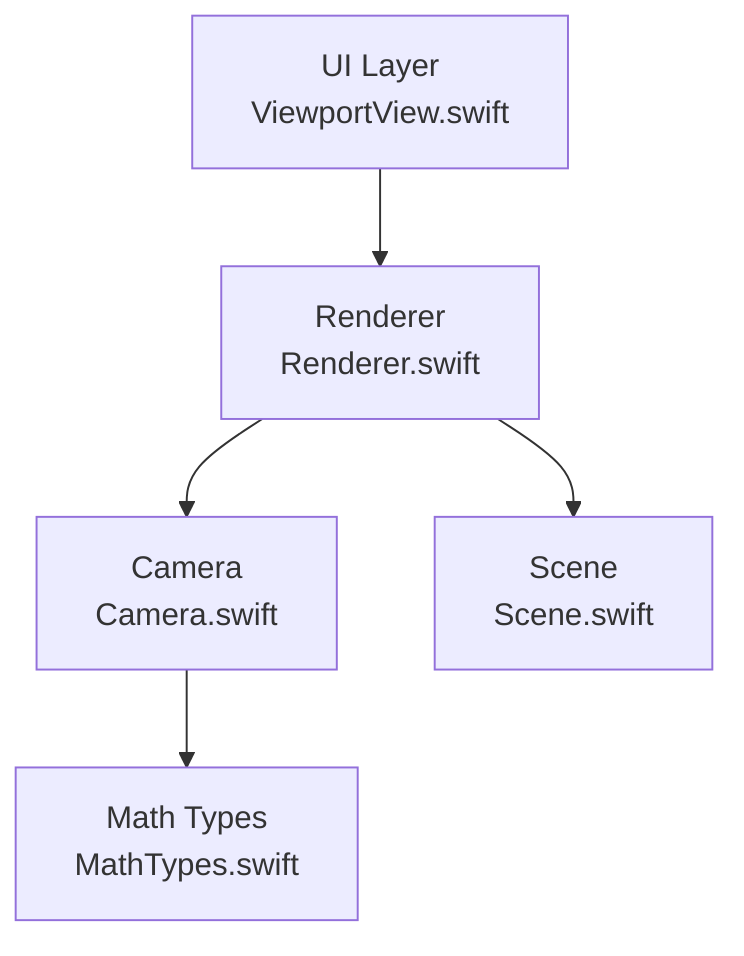
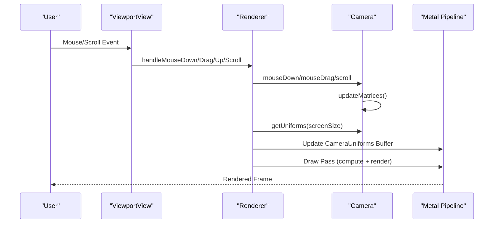
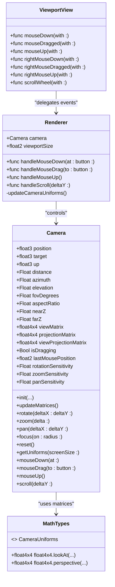
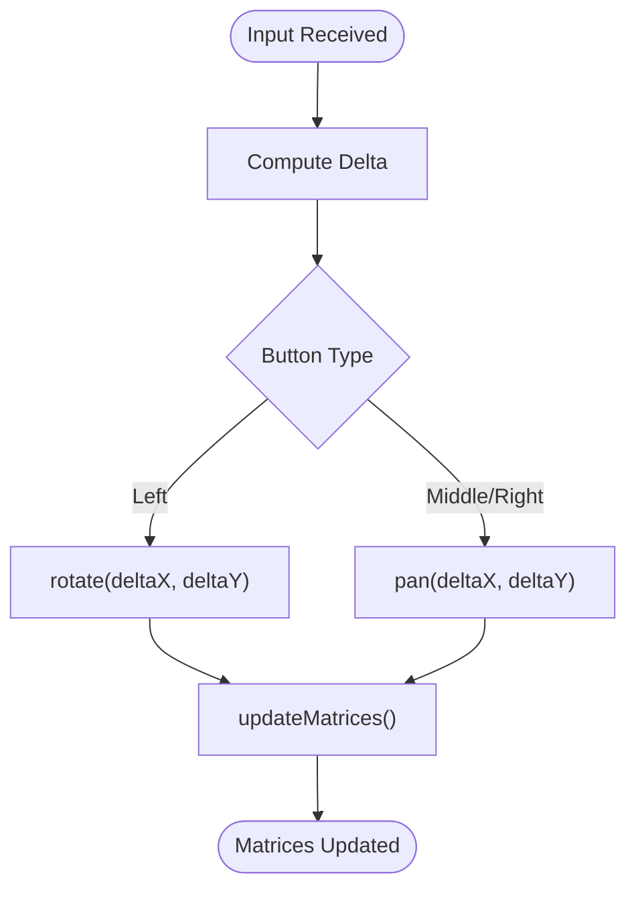
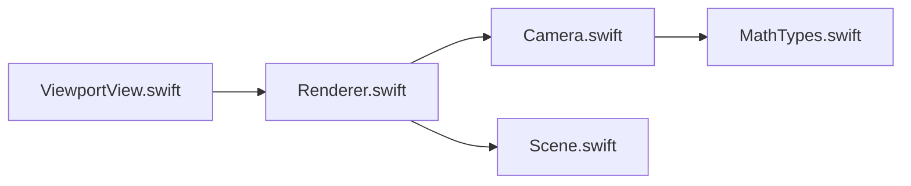

# Camera API

<cite>
**Referenced Files in This Document**
- [Camera.swift](file://Rendering/Camera.swift)
- [Renderer.swift](file://Rendering/Renderer.swift)
- [ViewportView.swift](file://UI/ViewportView.swift)
- [MathTypes.swift](file://Math/MathTypes.swift)
- [Scene.swift](file://Scene/Scene.swift)
</cite>

## Table of Contents
1. [Introduction](#introduction)
2. [Project Structure](#project-structure)
3. [Core Components](#core-components)
4. [Architecture Overview](#architecture-overview)
5. [Detailed Component Analysis](#detailed-component-analysis)
6. [Dependency Analysis](#dependency-analysis)
7. [Performance Considerations](#performance-considerations)
8. [Troubleshooting Guide](#troubleshooting-guide)
9. [Conclusion](#conclusion)

## Introduction
This document provides comprehensive API documentation for the Camera class responsible for 3D camera control and transformation in the Gaussian Splat Viewer. It covers camera state management (position, rotation, target), interactive operations (orbit, pan, zoom), transformation methods (view/projection matrices, coordinate conversions), public properties, method signatures, and integration with the renderer and viewport systems.

## Project Structure
The camera functionality is implemented in a dedicated module and integrates with the renderer and UI layers:
- Rendering/Camera.swift: Implements the Camera class with state and controls
- Rendering/Renderer.swift: Integrates camera with Metal rendering pipeline and handles input events
- UI/ViewportView.swift: Bridges SwiftUI/MetalKit input events to the renderer
- Math/MathTypes.swift: Provides mathematical types and matrix utilities used by the camera
- Scene/Scene.swift: Supplies scene data used for camera focus and bounds

**Diagram sources**
- [ViewportView.swift:1-185](file://UI/ViewportView.swift#L1-L185)
- [Renderer.swift:1-289](file://Rendering/Renderer.swift#L1-L289)
- [Camera.swift:1-184](file://Rendering/Camera.swift#L1-L184)
- [MathTypes.swift:1-189](file://Math/MathTypes.swift#L1-L189)
- [Scene.swift:1-158](file://Scene/Scene.swift#L1-L158)

**Section sources**
- [Camera.swift:1-184](file://Rendering/Camera.swift#L1-L184)
- [Renderer.swift:1-289](file://Rendering/Renderer.swift#L1-L289)
- [ViewportView.swift:1-185](file://UI/ViewportView.swift#L1-L185)
- [MathTypes.swift:1-189](file://Math/MathTypes.swift#L1-L189)
- [Scene.swift:1-158](file://Scene/Scene.swift#L1-L158)

## Core Components
- Camera: Orbit camera controller managing position, target, orientation, and projection matrices. Exposes interactive methods and sensitivity controls.
- Renderer: Integrates camera with Metal rendering, updates camera uniforms, and routes input events.
- ViewportView: Converts macOS/NSEvent input into camera actions via Renderer callbacks.
- MathTypes: Provides float3/float4x4 utilities and CameraUniforms structure for GPU consumption.
- Scene: Supplies scene center/radius for camera focus and maintains scene bounds.

**Section sources**
- [Camera.swift:4-184](file://Rendering/Camera.swift#L4-L184)
- [Renderer.swift:7-289](file://Rendering/Renderer.swift#L7-L289)
- [ViewportView.swift:6-185](file://UI/ViewportView.swift#L6-L185)
- [MathTypes.swift:54-62](file://Math/MathTypes.swift#L54-L62)
- [Scene.swift:140-151](file://Scene/Scene.swift#L140-L151)

## Architecture Overview
The camera participates in a layered input-to-rendering pipeline:
- Input events originate in the UI layer (NSEvents) and are handled by ViewportView.
- ViewportView delegates to Renderer, which forwards to Camera for state updates.
- Renderer updates CameraUniforms and passes them to Metal shaders each frame.
- Camera exposes view/projection matrices and coordinate helpers for GPU usage.

**Diagram sources**
- [ViewportView.swift:48-88](file://UI/ViewportView.swift#L48-L88)
- [Renderer.swift:271-287](file://Rendering/Renderer.swift#L271-L287)
- [Camera.swift:150-176](file://Rendering/Camera.swift#L150-L176)
- [Renderer.swift:253-260](file://Rendering/Renderer.swift#L253-L260)

## Detailed Component Analysis

### Camera Class API
The Camera class encapsulates orbital navigation and projection setup. It manages:
- Position and target for look-at behavior
- Spherical coordinates for orbital movement
- Projection parameters (FOV, aspect ratio, near/far planes)
- Cached matrices (view, projection, view-projection)
- Dragging state and sensitivity controls
- Methods for interactive control and GPU uniform export

Key public properties:
- position: float3 — camera eye position
- target: float3 — look-at target
- up: float3 — local up vector
- distance: Float — orbital distance from target
- azimuth: Float — horizontal angle (radians)
- elevation: Float — vertical angle (radians)
- fovDegrees: Float — vertical field of view
- aspectRatio: Float — viewport width/height
- nearZ: Float — near clipping plane
- farZ: Float — far clipping plane
- viewMatrix: float4x4 — cached view matrix
- projectionMatrix: float4x4 — cached projection matrix
- viewProjectionMatrix: float4x4 — cached combined matrix
- isDragging: Bool — indicates active drag session
- lastMousePosition: float2 — last drag position
- rotationSensitivity: Float — rotation speed factor
- zoomSensitivity: Float — zoom speed factor
- panSensitivity: Float — pan speed factor

Public methods:
- init(position:target:up:fovDegrees:aspectRatio:nearZ:farZ:)
  - Initializes camera and derives spherical coordinates from initial position/target.
- updateMatrices()
  - Recomputes position from spherical coordinates, builds view/projection matrices, and updates viewProjectionMatrix.
- rotate(deltaX:deltaY:)
  - Adjusts azimuth/elevation and clamps elevation to prevent gimbal lock, then updates matrices.
- zoom(delta:)
  - Applies exponential zoom based on delta and clamps distance within near/far bounds, then updates matrices.
- pan(deltaX:deltaY:)
  - Computes pan delta along camera right/up axes scaled by distance and sensitivity, adjusts target, then updates matrices.
- focus(on:radius:)
  - Centers on a point and sets distance to 3x the given radius.
- reset()
  - Resets to default orbital configuration.
- getUniforms(screenSize:)
  - Produces CameraUniforms for GPU consumption, including matrices, camera position, screen size, and tan-half FOV.
- mouseDown(at:)
- mouseDrag(to:button:)
- mouseUp()
- scroll(deltaY:)

Method signatures for requested operations:
- updateViewMatrix(): Not present in Camera; use updateMatrices() to refresh matrices.
- setTarget(_:)
  - Not present; adjust target directly via target property or use focus(on:radius:).
- handleInput(...)
  - Not present; use mouseDown/mouseDrag/mouseUp/scroll to process input.

Interactive operation parameters:
- rotate(deltaX:deltaY:): deltaX/Y are pixel deltas; sensitivity controlled by rotationSensitivity.
- zoom(delta:): delta is scroll delta; sensitivity controlled by zoomSensitivity.
- pan(deltaX:deltaY:): deltaX/Y are pixel deltas; sensitivity controlled by panSensitivity.

Constraints and limits:
- Elevation is clamped to avoid gimbal lock.
- Distance is clamped between nearZ*2 and farZ/2.

Integration with renderer:
- Renderer calls getUniforms(screenSize:) and writes CameraUniforms into a triple-buffered Metal buffer each frame.
- Renderer updates camera.aspectRatio on drawable size changes.

Coordinate conversions:
- Camera exposes viewMatrix.right/up vectors for pan calculations.
- Camera provides viewMatrix.forward/right/up directions via float4x4 extensions.

Examples:
- Camera setup: Initialize with desired position/target/FOV and aspect ratio; call updateMatrices().
- Interactive control workflow: On drag, compute delta from lastMousePosition, route to rotate/pan based on button, then updateMatrices().
- State management patterns: Store lastMousePosition per drag session; toggle isDragging to track state.

**Section sources**
- [Camera.swift:6-60](file://Rendering/Camera.swift#L6-L60)
- [Camera.swift:62-84](file://Rendering/Camera.swift#L62-L84)
- [Camera.swift:86-115](file://Rendering/Camera.swift#L86-L115)
- [Camera.swift:117-131](file://Rendering/Camera.swift#L117-L131)
- [Camera.swift:133-147](file://Rendering/Camera.swift#L133-L147)
- [Camera.swift:149-176](file://Rendering/Camera.swift#L149-L176)

### Renderer Integration
Renderer holds a Camera instance and synchronizes it with the Metal pipeline:
- Creates Camera with initial aspect ratio derived from MTKView drawable size.
- On scene load, focuses camera on scene center/radius and updates aspect ratio.
- On drawable size changes, updates camera.aspectRatio.
- Periodically updates CameraUniforms and passes them to shaders.

Key integration points:
- handleMouseDown/at:button:
- handleMouseDrag/to:button:
- handleMouseUp():
- handleScroll/deltaY:

These methods convert NSEvent positions to float2 and delegate to Camera.

**Section sources**
- [Renderer.swift:38-77](file://Rendering/Renderer.swift#L38-L77)
- [Renderer.swift:147-158](file://Rendering/Renderer.swift#L147-L158)
- [Renderer.swift:162-165](file://Rendering/Renderer.swift#L162-L165)
- [Renderer.swift:253-260](file://Rendering/Renderer.swift#L253-L260)
- [Renderer.swift:271-287](file://Rendering/Renderer.swift#L271-L287)

### ViewportView Input Bridge
ViewportView translates NSEvents into Renderer callbacks:
- Determines active mouse button from event.buttonNumber.
- Forwards mouseDown/Dragged/Up and scrollWheel events to Renderer.
- Maintains a reference to the current button during drag sessions.

**Section sources**
- [ViewportView.swift:48-88](file://UI/ViewportView.swift#L48-L88)
- [ViewportView.swift:102-139](file://UI/ViewportView.swift#L102-L139)

### Mathematical Utilities
MathTypes provides:
- Matrix utilities for lookAt and perspective projections.
- CameraUniforms structure for GPU uniform buffer layout.
- Direction extraction from matrices (forward/right/up).

These utilities underpin Camera’s matrix computation and uniform export.

**Section sources**
- [MathTypes.swift:104-167](file://Math/MathTypes.swift#L104-L167)
- [MathTypes.swift:54-62](file://Math/MathTypes.swift#L54-L62)

### Scene Integration
Scene supplies:
- center and radius for camera focus.
- bounding box computations for scene extents.

Renderer uses these to initialize camera positioning upon loading a scene.

**Section sources**
- [Scene.swift:140-151](file://Scene/Scene.swift#L140-L151)
- [Renderer.swift:154-157](file://Rendering/Renderer.swift#L154-L157)

## Architecture Overview

**Diagram sources**
- [Camera.swift:5-184](file://Rendering/Camera.swift#L5-L184)
- [Renderer.swift:7-289](file://Rendering/Renderer.swift#L7-L289)
- [ViewportView.swift:6-185](file://UI/ViewportView.swift#L6-L185)
- [MathTypes.swift:54-167](file://Math/MathTypes.swift#L54-L167)

## Detailed Component Analysis

### Camera State Management
- Position and Target: Controlled via direct property updates or via focus/on/radius.
- Spherical Coordinates: Derived from initial position/target; updated by rotate/zoom/pan.
- Projection Parameters: FOV, aspect ratio, near/far define projection matrix.
- Cached Matrices: Updated by updateMatrices(); consumed by getUniforms().

Operational flow for interactive updates:

**Diagram sources**
- [Camera.swift:86-115](file://Rendering/Camera.swift#L86-L115)
- [Camera.swift:62-84](file://Rendering/Camera.swift#L62-L84)

### Transformation Methods
- View Matrix: Built using float4x4.lookAt with position, target, up.
- Projection Matrix: Built using float4x4.perspective with FOV radians, aspect ratio, nearZ, farZ.
- Combined Matrix: projectionMatrix * viewMatrix.
- Coordinate Conversions: Camera exposes viewMatrix.right/up vectors and float4x4.forward/right/up.

**Section sources**
- [Camera.swift:70-83](file://Rendering/Camera.swift#L70-L83)
- [MathTypes.swift:104-131](file://Math/MathTypes.swift#L104-L131)

### Interactive Operations
- Orbit (Left drag): Updates azimuth/elevation; clamps elevation; recomputes position and matrices.
- Pan (Middle/Right drag): Computes pan delta along camera right/up axes; adjusts target; recomputes matrices.
- Zoom (Scroll): Applies exponential zoom; clamps distance; recomputes matrices.

Sensitivity configuration:
- rotationSensitivity: Controls angular velocity for orbit.
- zoomSensitivity: Controls zoom rate.
- panSensitivity: Controls pan rate scaled by distance.

Smoothness:
- No explicit interpolation is implemented in Camera; smooth transitions can be achieved by interpolating target/distance/angles externally before calling updateMatrices().

**Section sources**
- [Camera.swift:86-115](file://Rendering/Camera.swift#L86-L115)
- [Camera.swift:31-34](file://Rendering/Camera.swift#L31-L34)

### Public Properties for Queries
- Position, target, up for state inspection.
- viewMatrix/projectionMatrix/viewProjectionMatrix for rendering integration.
- Screen-related values (screenSize, tanHalfFov) exposed via getUniforms().

**Section sources**
- [Camera.swift:7-25](file://Rendering/Camera.swift#L7-L25)
- [Camera.swift:133-147](file://Rendering/Camera.swift#L133-L147)

### Method Signatures
- updateViewMatrix(): Not present; use updateMatrices().
- setTarget(_): Not present; adjust target directly or use focus(on:radius:).
- handleInput(...): Not present; use mouseDown/mouseDrag/mouseUp/scroll.

**Section sources**
- [Camera.swift:62-84](file://Rendering/Camera.swift#L62-L84)
- [Camera.swift:149-176](file://Rendering/Camera.swift#L149-L176)

### Examples

- Camera Setup
  - Initialize Camera with position/target/FOV and aspect ratio.
  - Call updateMatrices() to build initial matrices.

- Interactive Control Workflow
  - On mouseDown: set isDragging and lastMousePosition.
  - On mouseDrag: compute delta, route to rotate/pan based on button, call updateMatrices().
  - On mouseUp: set isDragging=false.

- State Management Patterns
  - Store lastMousePosition per drag session.
  - Clamp distance and elevation to reasonable ranges.
  - Use focus(on:radius:) to quickly frame a scene.

- Integration with Renderer and Viewport
  - Renderer receives NSEvents via ViewportView and forwards to Camera.
  - Renderer updates CameraUniforms each frame and binds them to shaders.

**Section sources**
- [Camera.swift:36-60](file://Rendering/Camera.swift#L36-L60)
- [Camera.swift:149-176](file://Rendering/Camera.swift#L149-L176)
- [Renderer.swift:271-287](file://Rendering/Renderer.swift#L271-L287)
- [ViewportView.swift:48-88](file://UI/ViewportView.swift#L48-L88)

## Dependency Analysis

- Coupling: Renderer depends on Camera for state and transformations; Camera depends on MathTypes for matrix utilities.
- Cohesion: Camera encapsulates all camera logic; Renderer encapsulates rendering integration.
- External Dependencies: simd for math, Metal/MetalKit for rendering.

**Diagram sources**
- [ViewportView.swift:6-185](file://UI/ViewportView.swift#L6-L185)
- [Renderer.swift:7-289](file://Rendering/Renderer.swift#L7-L289)
- [Camera.swift:1-184](file://Rendering/Camera.swift#L1-L184)
- [MathTypes.swift:1-189](file://Math/MathTypes.swift#L1-L189)
- [Scene.swift:1-158](file://Scene/Scene.swift#L1-L158)

**Section sources**
- [Renderer.swift:253-260](file://Rendering/Renderer.swift#L253-L260)
- [Camera.swift:62-84](file://Rendering/Camera.swift#L62-L84)

## Performance Considerations
- Matrix Updates: updateMatrices() is O(1); keep calls minimal per frame.
- Sensitivity Tuning: Adjust rotationSensitivity/zoomSensitivity/panSensitivity to balance responsiveness and stability.
- Distance Clamping: Prevents extreme zoom-in/out artifacts and maintains numerical stability.
- Triple Buffering: Renderer uses triple-buffered CameraUniforms to avoid CPU/GPU synchronization stalls.

[No sources needed since this section provides general guidance]

## Troubleshooting Guide
- Gimbal Lock Prevention: Elevation is clamped to avoid singularities; ensure elevation remains within safe bounds.
- Zoom Limits: Distance is clamped between nearZ*2 and farZ/2; verify nearZ/farZ values are sensible.
- Aspect Ratio Updates: Ensure aspectRatio is updated on drawable size changes to prevent distortion.
- Input Mapping: Verify button mapping aligns with intended controls (left=rotate, middle/right=pan).

**Section sources**
- [Camera.swift:91-94](file://Rendering/Camera.swift#L91-L94)
- [Camera.swift:100-102](file://Rendering/Camera.swift#L100-L102)
- [Renderer.swift:162-165](file://Rendering/Renderer.swift#L162-L165)

## Conclusion
The Camera class provides a robust orbital navigation system integrated with Metal rendering. It offers intuitive interactive controls, configurable sensitivity, and efficient matrix computation suitable for real-time Gaussian splat rendering. Its design cleanly separates concerns between input handling, state management, and rendering integration, enabling straightforward customization and extension.