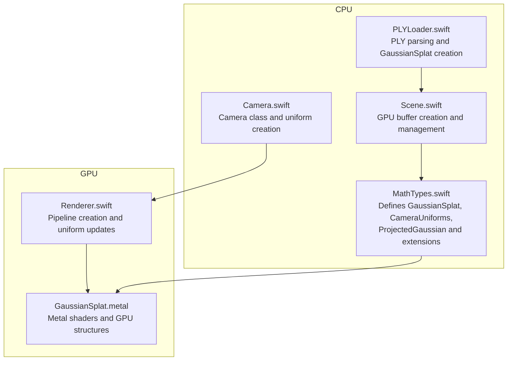
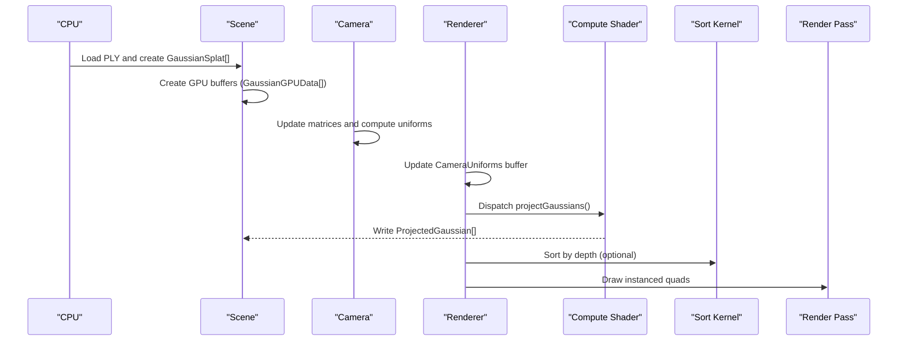
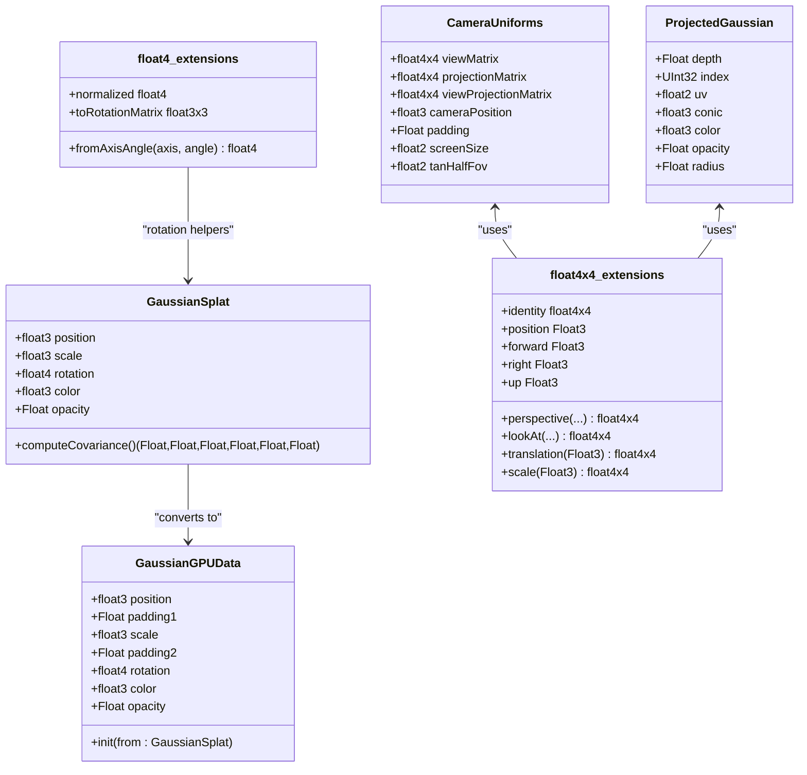

# Math Types API

<cite>
**Referenced Files in This Document**
- [MathTypes.swift](file://Math/MathTypes.swift)
- [GaussianSplat.metal](file://Shaders/GaussianSplat.metal)
- [Camera.swift](file://Rendering/Camera.swift)
- [Renderer.swift](file://Rendering/Renderer.swift)
- [Scene.swift](file://Scene/Scene.swift)
- [PLYLoader.swift](file://Scene/PLYLoader.swift)
</cite>

## Table of Contents
1. [Introduction](#introduction)
2. [Project Structure](#project-structure)
3. [Core Components](#core-components)
4. [Architecture Overview](#architecture-overview)
5. [Detailed Component Analysis](#detailed-component-analysis)
6. [Dependency Analysis](#dependency-analysis)
7. [Performance Considerations](#performance-considerations)
8. [Troubleshooting Guide](#troubleshooting-guide)
9. [Conclusion](#conclusion)

## Introduction
This document provides comprehensive API documentation for the mathematical types and structures used in Gaussian Splat Viewer. It covers the core data structures for representing 3D Gaussians, GPU-compatible data layouts, camera state uniforms, and per-splat computed data used for depth sorting. It also documents quaternion and matrix extensions, covariance computation methods, and practical guidance for memory alignment and GPU buffer layouts.

## Project Structure
The mathematical types and GPU-related structures are primarily defined in Swift and complemented by Metal shaders. The key files are:
- Math/MathTypes.swift: Defines core mathematical types and extensions
- Shaders/GaussianSplat.metal: Implements GPU kernels and structures mirroring the Swift types
- Rendering/Camera.swift: Provides camera state and uniform buffer creation
- Rendering/Renderer.swift: Manages GPU pipelines, buffers, and uniform updates
- Scene/Scene.swift: Creates GPU buffers from CPU data and manages lifecycle
- Scene/PLYLoader.swift: Loads Gaussian splats from PLY files and converts to CPU structures

**Diagram sources**
- [MathTypes.swift:1-189](file://Math/MathTypes.swift#L1-L189)
- [GaussianSplat.metal:1-309](file://Shaders/GaussianSplat.metal#L1-L309)
- [Camera.swift:1-184](file://Rendering/Camera.swift#L1-L184)
- [Renderer.swift:1-288](file://Rendering/Renderer.swift#L1-L288)
- [Scene.swift:1-140](file://Scene/Scene.swift#L1-L140)
- [PLYLoader.swift:1-403](file://Scene/PLYLoader.swift#L1-L403)

**Section sources**
- [MathTypes.swift:1-189](file://Math/MathTypes.swift#L1-L189)
- [GaussianSplat.metal:1-309](file://Shaders/GaussianSplat.metal#L1-L309)
- [Camera.swift:1-184](file://Rendering/Camera.swift#L1-L184)
- [Renderer.swift:1-288](file://Rendering/Renderer.swift#L1-L288)
- [Scene.swift:1-140](file://Scene/Scene.swift#L1-L140)
- [PLYLoader.swift:1-403](file://Scene/PLYLoader.swift#L1-L403)

## Core Components
This section documents the primary mathematical types and their roles in the system.

- GaussianSplat: Represents a single 3D Gaussian splat with position, scale, rotation, color, and opacity.
- GaussianGPUData: GPU-compatible structure for transferring per-splat data to the compute shader.
- CameraUniforms: Uniform buffer structure containing camera matrices and screen parameters.
- ProjectedGaussian: Per-splat computed data used for depth sorting and rendering.
- float4 (Quaternion) extensions: Axis-angle construction, normalization, and conversion to rotation matrix.
- float4x4 (Matrix) extensions: Perspective projection, look-at, translation, scale, and vector extraction helpers.
- Covariance computation: Methods to compute 3D covariance from scale and rotation, and 2D projection in shaders.

**Section sources**
- [MathTypes.swift:10-73](file://Math/MathTypes.swift#L10-L73)
- [MathTypes.swift:75-101](file://Math/MathTypes.swift#L75-L101)
- [MathTypes.swift:103-167](file://Math/MathTypes.swift#L103-L167)
- [MathTypes.swift:169-188](file://Math/MathTypes.swift#L169-L188)

## Architecture Overview
The system follows a CPU-to-GPU pipeline:
- CPU loads PLY data and constructs GaussianSplat instances.
- Scene creates GPU buffers and initializes GaussianGPUData arrays from GaussianSplat.
- Camera computes view/projection matrices and produces CameraUniforms.
- Renderer dispatches a compute kernel to project Gaussians and compute per-splat data.
- A sorting operation (bitonic sort) orders splats by depth.
- A render pass draws instanced quads for each splat using precomputed data.

**Diagram sources**
- [Scene.swift:57-95](file://Scene/Scene.swift#L57-L95)
- [Camera.swift:62-84](file://Rendering/Camera.swift#L62-L84)
- [Renderer.swift:186-250](file://Rendering/Renderer.swift#L186-L250)
- [GaussianSplat.metal:138-201](file://Shaders/GaussianSplat.metal#L138-L201)
- [GaussianSplat.metal:274-309](file://Shaders/GaussianSplat.metal#L274-L309)

## Detailed Component Analysis

### GaussianSplat
Represents a single 3D Gaussian splat with:
- position: float3 (world-space position)
- scale: float3 (scaling along local axes)
- rotation: float4 (quaternion, xyz imaginary, w real)
- color: float3 (RGB)
- opacity: Float

Initialization defaults:
- position: zero
- scale: (1, 1, 1)
- rotation: identity quaternion (0, 0, 0, 1)
- color: (1, 1, 1)
- opacity: 1.0

Usage examples:
- Construct from PLY data via PLYLoader.
- Convert to GPU-compatible data using GaussianGPUData initializer.

Memory considerations:
- Stored as a Swift struct; aligns with SIMD types for efficient vectorization.

**Section sources**
- [MathTypes.swift:12-30](file://Math/MathTypes.swift#L12-L30)
- [PLYLoader.swift:378-384](file://Scene/PLYLoader.swift#L378-L384)

### GaussianGPUData
GPU-compatible structure for per-splat data:
- position: float3
- padding1: Float (added for 16-byte alignment)
- scale: float3
- padding2: Float (added for 16-byte alignment)
- rotation: float4 (quaternion)
- color: float3
- opacity: Float

Initialization:
- from: Converts from GaussianSplat by copying fields.

Memory layout and alignment:
- 16-byte aligned fields ensure proper Metal buffer access.
- Padding fields are explicitly declared to meet alignment requirements.

GPU buffer creation:
- Scene creates a shared buffer sized by stride of GaussianGPUData multiplied by count.

**Section sources**
- [MathTypes.swift:34-51](file://Math/MathTypes.swift#L34-L51)
- [Scene.swift:64-95](file://Scene/Scene.swift#L64-L95)
- [GaussianSplat.metal:6-14](file://Shaders/GaussianSplat.metal#L6-L14)

### CameraUniforms
Camera state uniforms passed to GPU:
- viewMatrix: float4x4
- projectionMatrix: float4x4
- viewProjectionMatrix: float4x4
- cameraPosition: float3
- padding: Float (16-byte alignment)
- screenSize: float2
- tanHalfFov: float2

Creation:
- Camera.getUniforms(screenSize:) constructs CameraUniforms from current matrices and parameters.

GPU buffer layout:
- Renderer uses a triple-buffered uniform buffer with a stride rounded up to 256 bytes for Metal uniform alignment.

**Section sources**
- [MathTypes.swift:53-62](file://Math/MathTypes.swift#L53-L62)
- [Camera.swift:133-147](file://Rendering/Camera.swift#L133-L147)
- [Renderer.swift:19,130-143](file://Rendering/Renderer.swift#L19,L130-L143)

### ProjectedGaussian
Per-splat computed data used for depth sorting and rendering:
- depth: Float (NDC depth for sorting)
- index: UInt32 (original splat index)
- uv: float2 (screen-space center)
- conic: float3 (2D covariance inverse coefficients A, B, C)
- color: float3
- opacity: Float
- radius: Float (radius for sampling, e.g., 3 sigma)

Computation:
- Compute shader projectGaussians() calculates conic coefficients, radius, and depth from 3D covariance and camera state.

Sorting:
- Bitonic sort kernel compares depths and swaps data and indices.

**Section sources**
- [MathTypes.swift:64-73](file://Math/MathTypes.swift#L64-L73)
- [GaussianSplat.metal:138-201](file://Shaders/GaussianSplat.metal#L138-L201)
- [GaussianSplat.metal:274-309](file://Shaders/GaussianSplat.metal#L274-L309)

### Quaternion Extensions (float4)
Provides:
- fromAxisAngle(axis: Float3, angle: Float) -> float4: Constructs a normalized quaternion from axis-angle representation.
- normalized: float4: Normalizes the quaternion to unit length.
- toRotationMatrix: float3x3: Converts normalized quaternion to a 3x3 rotation matrix.

Usage:
- Used to build rotation matrices from splat rotations for covariance computation.

**Section sources**
- [MathTypes.swift:75-101](file://Math/MathTypes.swift#L75-L101)
- [GaussianSplat.metal:44-60](file://Shaders/GaussianSplat.metal#L44-L60)

### Matrix Extensions (float4x4)
Provides:
- identity: float4x4: Identity matrix.
- perspective(fovRadians: Float, aspect: Float, nearZ: Float, farZ: Float) -> float4x4: Perspective projection matrix.
- lookAt(eye: Float3, center: Float3, up: Float3) -> float4x4: View matrix.
- translation(Float3) -> float4x4: Translation matrix.
- scale(Float3) -> float4x4: Scale matrix.
- position: Float3, forward: Float3, right: Float3, up: Float3: Extract vectors from matrices.

Usage:
- Camera.updateMatrices() builds view and projection matrices using these helpers.
- Renderer passes combined matrices via CameraUniforms.

**Section sources**
- [MathTypes.swift:103-167](file://Math/MathTypes.swift#L103-L167)
- [Camera.swift:62-84](file://Rendering/Camera.swift#L62-L84)

### Covariance Computation
CPU-side:
- GaussianSplat.computeCovariance() returns upper-triangular elements of 3D covariance matrix Σ = R S S^T R^T.

GPU-side:
- computeCovariance3D(): Builds 3D covariance from scale and rotation.
- projectCovariance2D(): Projects 3D covariance to 2D screen space using Jacobian of perspective projection and view rotation.
- Conic coefficients (A, B, C) derived from 2D covariance inverse.

Usage:
- ProjectedGaussian stores conic coefficients for efficient fragment evaluation.

**Section sources**
- [MathTypes.swift:169-188](file://Math/MathTypes.swift#L169-L188)
- [GaussianSplat.metal:62-134](file://Shaders/GaussianSplat.metal#L62-L134)

## Dependency Analysis
Key relationships:
- GaussianSplat is the canonical CPU representation; GaussianGPUData mirrors it for GPU transfer.
- CameraUniforms encapsulates matrices and screen parameters consumed by compute and vertex shaders.
- ProjectedGaussian is produced by the compute shader and consumed by the render pass.
- float4 and float4x4 extensions are used across CPU and GPU code for math operations.

**Diagram sources**
- [MathTypes.swift:10-73](file://Math/MathTypes.swift#L10-L73)
- [MathTypes.swift:75-101](file://Math/MathTypes.swift#L75-L101)
- [MathTypes.swift:103-167](file://Math/MathTypes.swift#L103-L167)

**Section sources**
- [MathTypes.swift:10-188](file://Math/MathTypes.swift#L10-L188)

## Performance Considerations
- GPU buffer alignment: Use stride-aligned buffers to avoid misalignment penalties. The project uses explicit padding and Metal’s alignment rules.
- Triple-buffered uniforms: Reduces CPU-GPU synchronization stalls by cycling through offsets.
- Compute dispatch sizing: Thread group size of 256 balances occupancy and overhead.
- Depth sorting: Implemented as a compute kernel; consider enabling only when beneficial for visual quality vs. performance trade-offs.
- Memory bandwidth: GaussianGPUData is compact; keep per-splat data minimal to reduce bandwidth.

[No sources needed since this section provides general guidance]

## Troubleshooting Guide
Common issues and resolutions:
- Incorrect splat orientation: Ensure rotation quaternions are normalized before converting to matrices.
- Visibility artifacts: Verify 2D covariance inversion succeeds (non-zero determinant) and that focal lengths are computed from projection matrices.
- Depth sorting instability: Confirm depth values are computed consistently in clip/NDC space and that sorting interval is tuned appropriately.
- Buffer creation failures: Validate device capabilities and buffer sizes; ensure stride calculations account for alignment.

**Section sources**
- [MathTypes.swift:84-101](file://Math/MathTypes.swift#L84-L101)
- [GaussianSplat.metal:165-174](file://Shaders/GaussianSplat.metal#L165-L174)
- [Renderer.swift:194-208](file://Rendering/Renderer.swift#L194-L208)
- [Scene.swift:68-90](file://Scene/Scene.swift#L68-L90)

## Conclusion
The Math Types API provides a cohesive foundation for Gaussian Splatting rendering:
- Clear CPU structures (GaussianSplat) and GPU-compatible layouts (GaussianGPUData)
- Robust camera state uniforms (CameraUniforms) and matrix utilities (float4x4)
- Efficient per-splat computations (ProjectedGaussian) and covariance math (float4)
- Well-defined GPU pipelines for projection, sorting, and rasterization

These components enable scalable and visually accurate rendering of large-scale Gaussian splat scenes.