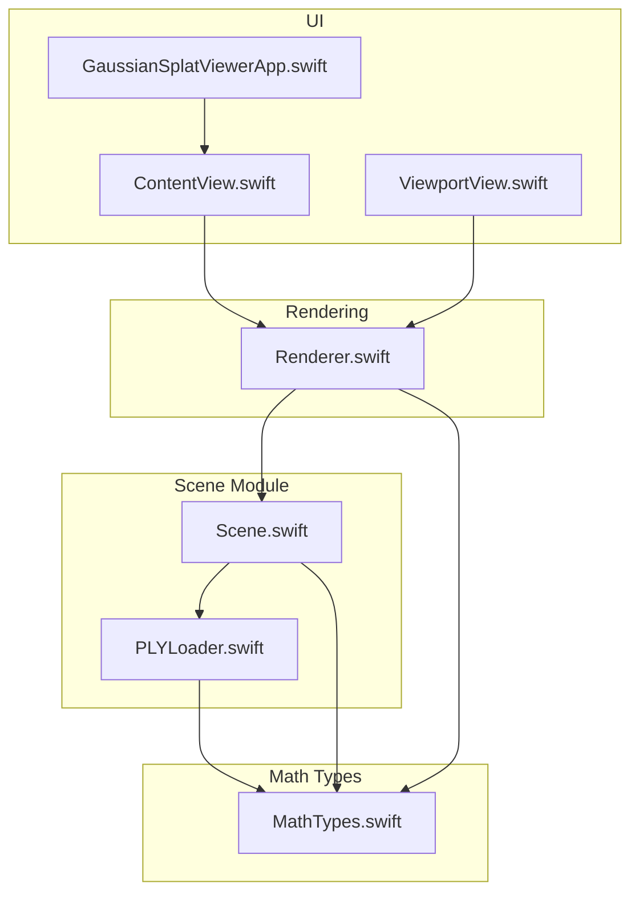
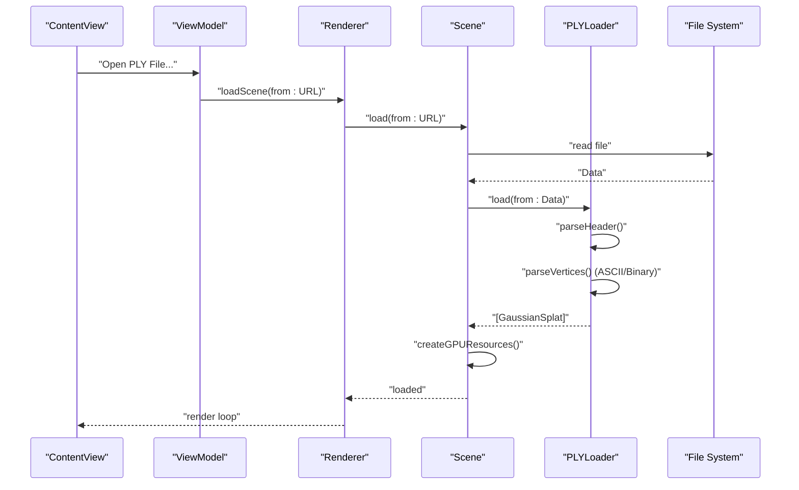
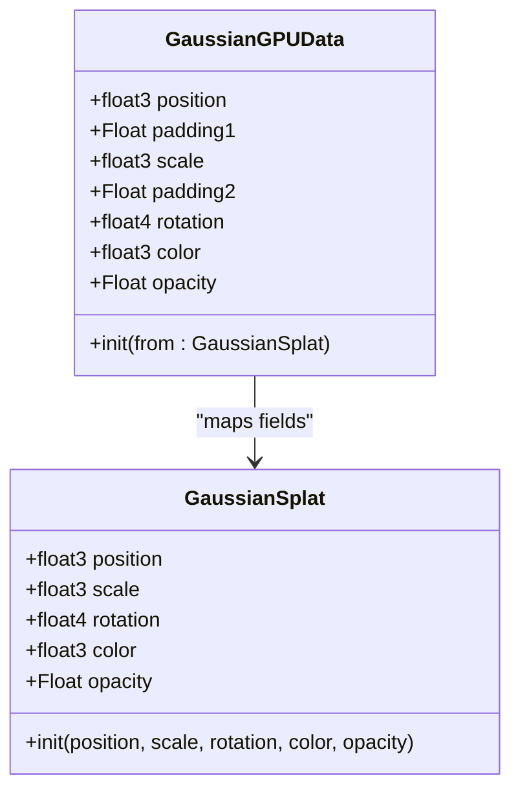
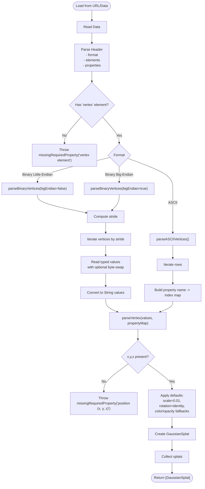
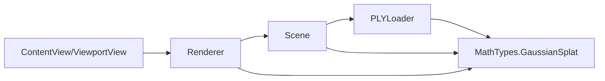

# PLYLoader API

<cite>
**Referenced Files in This Document**
- [PLYLoader.swift](file://Sources/Scene/PLYLoader.swift)
- [MathTypes.swift](file://Sources/Math/MathTypes.swift)
- [Scene.swift](file://Sources/Scene/Scene.swift)
- [Renderer.swift](file://Sources/Rendering/Renderer.swift)
- [ContentView.swift](file://Sources/UI/ContentView.swift)
- [ViewportView.swift](file://Sources/UI/ViewportView.swift)
- [GaussianSplatViewerApp.swift](file://Sources/GaussianSplatViewerApp.swift)
</cite>

## Table of Contents
1. [Introduction](#introduction)
2. [Project Structure](#project-structure)
3. [Core Components](#core-components)
4. [Architecture Overview](#architecture-overview)
5. [Detailed Component Analysis](#detailed-component-analysis)
6. [Dependency Analysis](#dependency-analysis)
7. [Performance Considerations](#performance-considerations)
8. [Troubleshooting Guide](#troubleshooting-guide)
9. [Conclusion](#conclusion)

## Introduction
This document provides comprehensive API documentation for the PLYLoader class responsible for parsing PLY (Polygon File Format) files and extracting Gaussian splat data used by the 3D Gaussian Splatting viewer. It covers supported file formats, property mapping, parsing algorithms, validation rules, error handling, and performance considerations for large datasets.

## Project Structure
PLYLoader is part of the Scene module and integrates with math types, rendering, and UI components to form a complete Gaussian splatting pipeline.

**Diagram sources**
- [PLYLoader.swift:1-386](file://Sources/Scene/PLYLoader.swift#L1-L386)
- [MathTypes.swift:1-189](file://Sources/Math/MathTypes.swift#L1-L189)
- [Scene.swift:1-130](file://Sources/Scene/Scene.swift#L1-L130)
- [Renderer.swift:1-288](file://Sources/Rendering/Renderer.swift#L1-L288)
- [ContentView.swift:1-119](file://Sources/UI/ContentView.swift#L1-L119)
- [ViewportView.swift:1-118](file://Sources/UI/ViewportView.swift#L1-L118)
- [GaussianSplatViewerApp.swift:1-65](file://Sources/GaussianSplatViewerApp.swift#L1-L65)

**Section sources**
- [PLYLoader.swift:1-386](file://Sources/Scene/PLYLoader.swift#L1-L386)
- [MathTypes.swift:1-189](file://Sources/Math/MathTypes.swift#L1-L189)
- [Scene.swift:1-130](file://Sources/Scene/Scene.swift#L1-L130)
- [Renderer.swift:1-288](file://Sources/Rendering/Renderer.swift#L1-L288)
- [ContentView.swift:1-119](file://Sources/UI/ContentView.swift#L1-L119)
- [ViewportView.swift:1-118](file://Sources/UI/ViewportView.swift#L1-L118)
- [GaussianSplatViewerApp.swift:1-65](file://Sources/GaussianSplatViewerApp.swift#L1-L65)

## Core Components
- PLYLoader: Static class providing load(from:) methods for URL and Data inputs, parsing PLY headers and vertex data, and constructing GaussianSplat instances.
- GaussianSplat: Data structure representing a single 3D Gaussian with position, scale, rotation, color, and opacity.
- Scene: Manages CPU and GPU resources for loaded splats, including buffer creation and scene statistics.
- Renderer: Integrates PLYLoader via Scene to render Gaussian splats using Metal compute and render pipelines.

Key responsibilities:
- File format support: ASCII, binary little-endian, binary big-endian.
- Property mapping: Position (x, y, z), scale (scale_0..2), rotation (rot_0..3), color (f_dc_0..2 or red/green/blue), opacity (opacity).
- Validation: Required properties, data type conversions, endian handling, and defaults for missing optional properties.
- Error handling: Structured errors for malformed headers, unsupported formats, parse failures, and missing properties.

**Section sources**
- [PLYLoader.swift:13-68](file://Sources/Scene/PLYLoader.swift#L13-L68)
- [MathTypes.swift:11-30](file://Sources/Math/MathTypes.swift#L11-L30)
- [Scene.swift:4-36](file://Sources/Scene/Scene.swift#L4-L36)
- [Renderer.swift:149-162](file://Sources/Rendering/Renderer.swift#L149-L162)

## Architecture Overview
The PLYLoader sits between the UI and Scene layers, transforming raw PLY data into GaussianSplat objects consumed by the renderer.

**Diagram sources**
- [ContentView.swift:95-112](file://Sources/UI/ContentView.swift#L95-L112)
- [ViewportView.swift:104-116](file://Sources/UI/ViewportView.swift#L104-L116)
- [Renderer.swift:149-162](file://Sources/Rendering/Renderer.swift#L149-L162)
- [Scene.swift:24-49](file://Sources/Scene/Scene.swift#L24-L49)
- [PLYLoader.swift:41-68](file://Sources/Scene/PLYLoader.swift#L41-L68)

## Detailed Component Analysis

### PLYLoader API
Static interface for loading Gaussian splats from PLY files.

- Methods
  - load(from: URL) throws -> [GaussianSplat]: Reads file data and delegates to load(from:).
  - load(from: Data) throws -> [GaussianSplat]: Parses header, identifies vertex element, and dispatches to ASCII or binary parser based on header format.

- File Format Support
  - ASCII: Human-readable vertex entries separated by whitespace.
  - Binary little-endian: Fixed-size binary records with native-endian integers/floats.
  - Binary big-endian: Fixed-size binary records with swapped-endian integers/floats.

- Parsing Algorithms
  - Header parsing: Scans header lines, validates magic marker, captures format, and collects element/property definitions until end_header.
  - ASCII vertex parsing: Computes data start line, iterates rows, splits by whitespace, maps property names to indices, and converts values to floats.
  - Binary vertex parsing: Computes stride from property sizes, iterates vertices by fixed offsets, reads typed values with optional byte-swapping, and converts to floats.

- Property Mapping and Defaults
  - Required: position (x, y, z). Missing any component triggers an error.
  - Optional: scale (scale_0..2) defaults to 0.01 if absent; rotation (rot_0..3) defaults to identity quaternion; color prioritizes SH DC components (f_dc_0..2) with sigmoid activation, otherwise falls back to red/green/blue in 0–255 range scaled to 0–1; opacity defaults to 1.0 if absent, otherwise applies sigmoid.

- Data Type Conversion
  - Supports char/int8, uchar/uint8, short/int16, ushort/uint16, int/int32, uint/uint32, float, long/int64, ulong/uint64, double.
  - Converts to Float with explicit byte-swap for big-endian numeric types.

- Validation Rules
  - Header must start with "ply".
  - Only "ascii" and "binary_little_endian"/"binary_big_endian" are supported.
  - Vertex element must be present.
  - Position components are mandatory; others are optional with defaults.
  - Rotation is normalized to unit quaternion.
  - Color derived from SH DC uses sigmoid activation; direct RGB uses 0–255 scaling.

- Error Handling
  - PLYLoaderError: fileNotFound, invalidHeader, unsupportedFormat, parseError(String), missingRequiredProperty(String).
  - ASCII parsing logs warnings for individual vertex parse failures and continues.
  - Binary parsing skips invalid vertices upon parse errors.

- Example Workflows
  - File loading: Scene.load(from: URL) -> PLYLoader.load(from: Data) -> GaussianSplat[].
  - Property extraction: Access GaussianSplat.position/scale/rotation/color/opacity after successful load.
  - Error recovery: Catch PLYLoaderError and display user-friendly messages; continue with defaults for optional properties.

- Code Example Paths
  - File loading: [Scene.load(from: URL):24-36](file://Sources/Scene/Scene.swift#L24-L36)
  - Data loading: [Scene.load(from: Data):38-49](file://Sources/Scene/Scene.swift#L38-L49)
  - PLY parsing: [PLYLoader.load(from: Data):47-68](file://Sources/Scene/PLYLoader.swift#L47-L68)
  - ASCII parsing: [parseASCIIVertices(...):155-197](file://Sources/Scene/PLYLoader.swift#L155-L197)
  - Binary parsing: [parseBinaryVertices(...):201-299](file://Sources/Scene/PLYLoader.swift#L201-L299)
  - Vertex parsing: [parseVertex(...):304-368](file://Sources/Scene/PLYLoader.swift#L304-L368)

**Section sources**
- [PLYLoader.swift:13-68](file://Sources/Scene/PLYLoader.swift#L13-L68)
- [PLYLoader.swift:72-151](file://Sources/Scene/PLYLoader.swift#L72-L151)
- [PLYLoader.swift:155-197](file://Sources/Scene/PLYLoader.swift#L155-L197)
- [PLYLoader.swift:201-299](file://Sources/Scene/PLYLoader.swift#L201-L299)
- [PLYLoader.swift:304-368](file://Sources/Scene/PLYLoader.swift#L304-L368)
- [Scene.swift:24-49](file://Sources/Scene/Scene.swift#L24-L49)

### GaussianSplat Model
Represents a single 3D Gaussian with GPU-compatible fields.

**Diagram sources**
- [MathTypes.swift:11-30](file://Sources/Math/MathTypes.swift#L11-L30)
- [MathTypes.swift:34-51](file://Sources/Math/MathTypes.swift#L34-L51)

**Section sources**
- [MathTypes.swift:11-30](file://Sources/Math/MathTypes.swift#L11-L30)
- [MathTypes.swift:34-51](file://Sources/Math/MathTypes.swift#L34-L51)

### Parsing Flow for ASCII and Binary

**Diagram sources**
- [PLYLoader.swift:47-68](file://Sources/Scene/PLYLoader.swift#L47-L68)
- [PLYLoader.swift:72-151](file://Sources/Scene/PLYLoader.swift#L72-L151)
- [PLYLoader.swift:155-197](file://Sources/Scene/PLYLoader.swift#L155-L197)
- [PLYLoader.swift:201-299](file://Sources/Scene/PLYLoader.swift#L201-L299)
- [PLYLoader.swift:304-368](file://Sources/Scene/PLYLoader.swift#L304-L368)

## Dependency Analysis
PLYLoader depends on math types for vector/quaternion operations and is consumed by Scene for GPU buffer creation and by Renderer for runtime rendering.

**Diagram sources**
- [PLYLoader.swift:13-68](file://Sources/Scene/PLYLoader.swift#L13-L68)
- [MathTypes.swift:11-30](file://Sources/Math/MathTypes.swift#L11-L30)
- [Scene.swift:4-36](file://Sources/Scene/Scene.swift#L4-L36)
- [Renderer.swift:149-162](file://Sources/Rendering/Renderer.swift#L149-L162)
- [ContentView.swift:95-112](file://Sources/UI/ContentView.swift#L95-L112)
- [ViewportView.swift:104-116](file://Sources/UI/ViewportView.swift#L104-L116)

**Section sources**
- [PLYLoader.swift:13-68](file://Sources/Scene/PLYLoader.swift#L13-L68)
- [MathTypes.swift:11-30](file://Sources/Math/MathTypes.swift#L11-L30)
- [Scene.swift:4-36](file://Sources/Scene/Scene.swift#L4-L36)
- [Renderer.swift:149-162](file://Sources/Rendering/Renderer.swift#L149-L162)
- [ContentView.swift:95-112](file://Sources/UI/ContentView.swift#L95-L112)
- [ViewportView.swift:104-116](file://Sources/UI/ViewportView.swift#L104-L116)

## Performance Considerations
- Memory efficiency
  - Pre-reserve capacity for splats to minimize reallocations: [reserveCapacity](file://Sources/Scene/PLYLoader.swift#L174).
  - Binary parsing reads fixed strides without intermediate allocations beyond Float arrays: [parseBinaryVertices:201-299](file://Sources/Scene/PLYLoader.swift#L201-L299).
  - Scene creates GPU buffers once after loading: [createGPUResources:52-85](file://Sources/Scene/Scene.swift#L52-L85).

- Large file handling
  - Binary formats reduce parsing overhead compared to ASCII.
  - Endian conversion is performed efficiently using byte-swap primitives for integer types: [parseBinaryVertices:201-299](file://Sources/Scene/PLYLoader.swift#L201-L299).

- Rendering throughput
  - Renderer uses compute shaders to project Gaussians and Metal instancing to draw quads efficiently: [Renderer drawing pipeline:171-250](file://Sources/Rendering/Renderer.swift#L171-L250).

[No sources needed since this section provides general guidance]

## Troubleshooting Guide
Common issues and recovery strategies:

- Malformed PLY header
  - Symptoms: invalidHeader error during parseHeader.
  - Recovery: Verify the file starts with "ply" and includes valid "format" and "end_header" markers.

- Unsupported format
  - Symptoms: unsupportedFormat error when encountering unknown format strings.
  - Recovery: Ensure the file uses "ascii", "binary_little_endian", or "binary_big_endian".

- Missing vertex element
  - Symptoms: missingRequiredProperty("vertex element").
  - Recovery: Confirm the PLY contains an "element vertex ..." declaration.

- Missing required position components
  - Symptoms: missingRequiredProperty("position (x, y, z)").
  - Recovery: Ensure "x", "y", and "z" properties exist in the vertex element.

- Binary parsing errors
  - Symptoms: parse errors or skipped vertices in binary mode.
  - Recovery: Validate data size equals header-defined count times stride; confirm correct endianness selection.

- Property value ranges
  - Rotation: Normalized automatically; ensure non-zero magnitude.
  - Color: Derived from SH DC (sigmoid) or direct RGB (0–255); verify ranges match expected inputs.
  - Opacity: Defaults to 1.0 if absent; sigmoid applied when present.

- Error types and handling
  - PLYLoaderError enumerates all failure modes; catch and present user-friendly messages.

**Section sources**
- [PLYLoader.swift:4-10](file://Sources/Scene/PLYLoader.swift#L4-L10)
- [PLYLoader.swift:72-151](file://Sources/Scene/PLYLoader.swift#L72-L151)
- [PLYLoader.swift:304-368](file://Sources/Scene/PLYLoader.swift#L304-L368)

## Conclusion
PLYLoader provides a robust, efficient mechanism for loading PLY files containing Gaussian splat data across ASCII and binary formats. Its flexible property mapping, comprehensive validation, and structured error handling enable reliable integration with the broader Gaussian splatting pipeline. For large datasets, prefer binary formats and leverage pre-reservation and GPU buffer creation to achieve optimal performance.