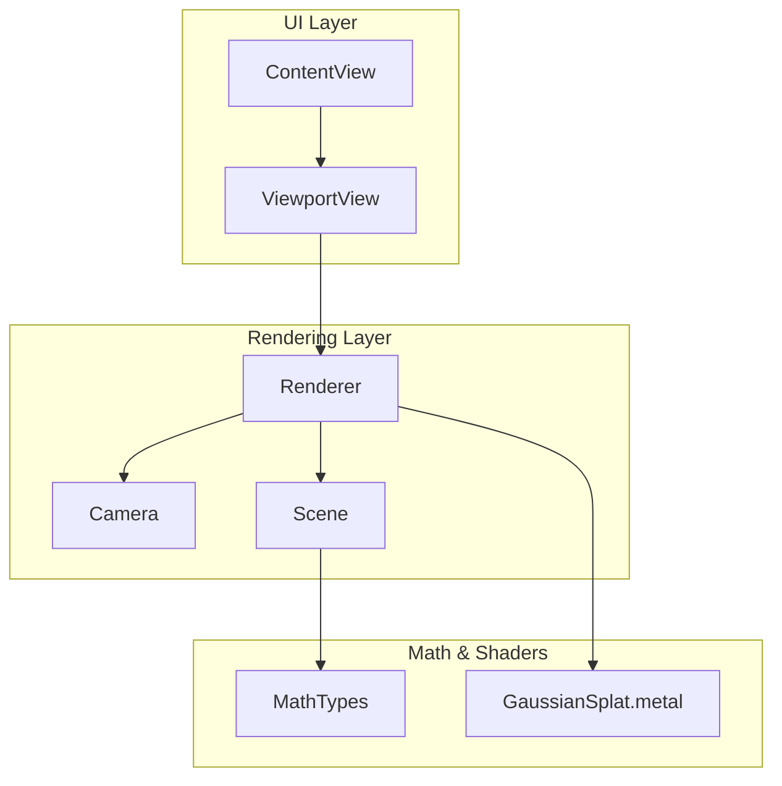
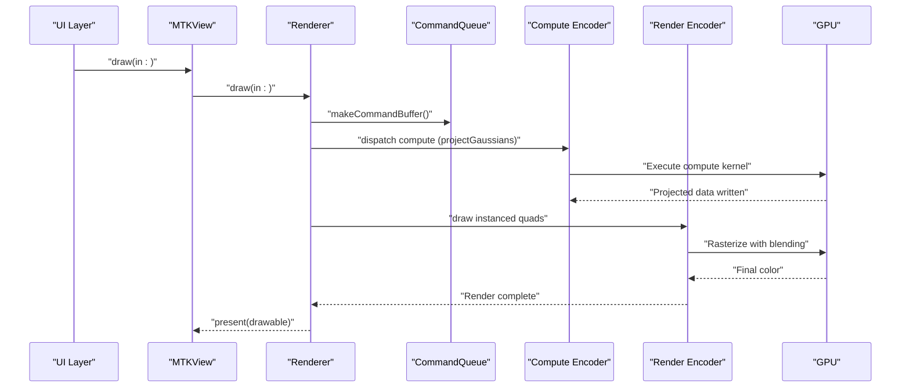
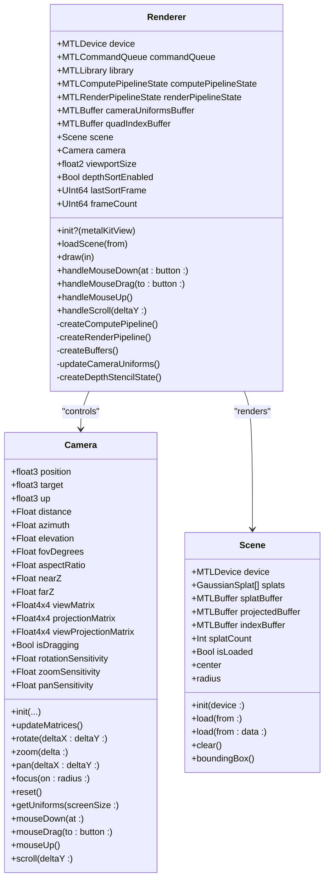
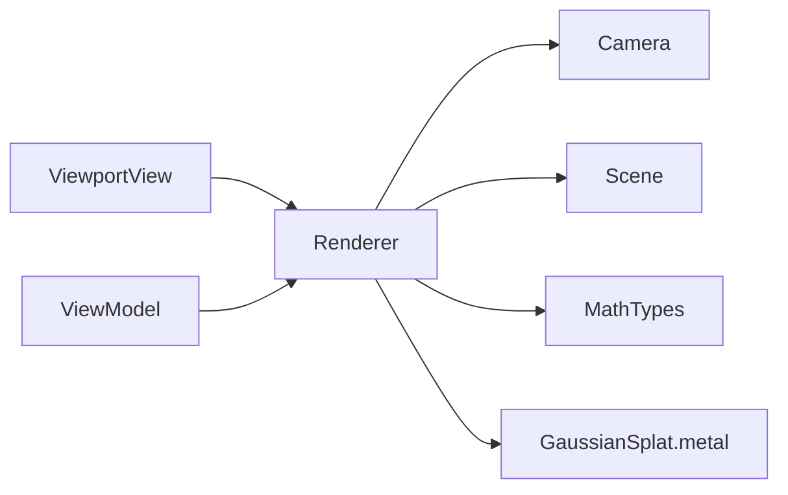

# Renderer API

<cite>
**Referenced Files in This Document**
- [Renderer.swift](file://Rendering/Renderer.swift)
- [Camera.swift](file://Rendering/Camera.swift)
- [Scene.swift](file://Scene/Scene.swift)
- [PLYLoader.swift](file://Scene/PLYLoader.swift)
- [MathTypes.swift](file://Math/MathTypes.swift)
- [GaussianSplat.metal](file://Shaders/GaussianSplat.metal)
- [ViewportView.swift](file://UI/ViewportView.swift)
- [ContentView.swift](file://UI/ContentView.swift)
- [GaussianSplatViewerApp.swift](file://GaussianSplatViewerApp.swift)
</cite>

## Table of Contents
1. [Introduction](#introduction)
2. [Project Structure](#project-structure)
3. [Core Components](#core-components)
4. [Architecture Overview](#architecture-overview)
5. [Detailed Component Analysis](#detailed-component-analysis)
6. [Dependency Analysis](#dependency-analysis)
7. [Performance Considerations](#performance-considerations)
8. [Troubleshooting Guide](#troubleshooting-guide)
9. [Conclusion](#conclusion)
10. [Appendices](#appendices)

## Introduction
This document provides comprehensive API documentation for the Renderer class responsible for GPU rendering of Gaussian Splatting scenes. It covers initialization, configuration, rendering pipeline control, GPU resource management, camera controls, and integration patterns with SwiftUI and Metal. It also documents error handling, performance characteristics, and threading considerations.

## Project Structure
The rendering system is organized around a few key modules:
- Rendering: Contains the Renderer and Camera classes, plus the Metal shaders.
- Scene: Manages scene data and GPU buffers for Gaussian splats.
- UI: SwiftUI views that host the Metal viewport and handle user input.
- Math: Shared mathematical types and helpers used across the rendering pipeline.
- Shaders: Metal compute and fragment shaders implementing the Gaussian splatting pipeline.

**Diagram sources**
- [Renderer.swift:38-77](file://Rendering/Renderer.swift#L38-L77)
- [Camera.swift:5-60](file://Rendering/Camera.swift#L5-L60)
- [Scene.swift:6-28](file://Scene/Scene.swift#L6-L28)
- [MathTypes.swift:10-73](file://Math/MathTypes.swift#L10-L73)
- [GaussianSplat.metal:138-201](file://Shaders/GaussianSplat.metal#L138-L201)

**Section sources**
- [Renderer.swift:38-77](file://Rendering/Renderer.swift#L38-L77)
- [ViewportView.swift:9-36](file://UI/ViewportView.swift#L9-L36)
- [GaussianSplatViewerApp.swift:4-10](file://GaussianSplatViewerApp.swift#L4-L10)

## Core Components
- Renderer: The central rendering engine that initializes Metal, builds pipelines, manages GPU buffers, and executes the compute and render passes.
- Camera: Orbit camera with sensitivity controls, matrix computation, and input-driven movement.
- Scene: Manages Gaussian splat data and GPU buffers, including creation and clearing of resources.
- PLYLoader: Loads Gaussian splat data from PLY files with support for ASCII and binary formats.
- MathTypes: Defines GPU-compatible structures and math utilities for matrices, quaternions, and covariance computations.
- GaussianSplat.metal: Implements the compute shader for projecting Gaussians and vertex/fragment shaders for rasterization.

Key responsibilities:
- Renderer handles Metal device initialization, pipeline creation, buffer management, and frame rendering.
- Camera exposes methods for mouse and scroll input handling to drive view transforms.
- Scene encapsulates data loading and GPU buffer lifecycle.
- MathTypes provides shared structures and math helpers used by both CPU and GPU code.
- Shaders implement the compute and rasterization stages of the Gaussian splatting pipeline.

**Section sources**
- [Renderer.swift:6-77](file://Rendering/Renderer.swift#L6-L77)
- [Camera.swift:5-177](file://Rendering/Camera.swift#L5-L177)
- [Scene.swift:6-139](file://Scene/Scene.swift#L6-L139)
- [MathTypes.swift:10-189](file://Math/MathTypes.swift#L10-L189)
- [GaussianSplat.metal:138-270](file://Shaders/GaussianSplat.metal#L138-L270)

## Architecture Overview
The Renderer integrates with MetalKit to drive a continuous rendering loop. It performs:
1. Compute pass: Project each Gaussian into screen space using a compute shader.
2. Optional depth sorting: Placeholder for future sorting implementation.
3. Render pass: Draw instanced quads for each Gaussian using vertex and fragment shaders with alpha blending.

**Diagram sources**
- [Renderer.swift:166-250](file://Rendering/Renderer.swift#L166-L250)
- [GaussianSplat.metal:138-201](file://Shaders/GaussianSplat.metal#L138-L201)
- [GaussianSplat.metal:205-241](file://Shaders/GaussianSplat.metal#L205-L241)
- [GaussianSplat.metal:245-270](file://Shaders/GaussianSplat.metal#L245-L270)

## Detailed Component Analysis

### Renderer API Reference
The Renderer class orchestrates GPU rendering for Gaussian Splatting. It implements the MTKViewDelegate protocol and manages Metal device, command queues, pipelines, buffers, and scene data.

Initialization and configuration:
- Initializer: Creates Metal device, command queue, loads Metal library, sets up MTKView properties, builds pipelines, creates buffers, and initializes a Scene.
- Pipeline creation: Builds compute and render pipelines from Metal library functions.
- Buffer creation: Allocates camera uniforms buffer (triply-buffered) and quad index buffer for instanced rendering.

Public methods:
- loadScene(from:): Loads a PLY file into the Scene and focuses the camera on the loaded geometry.
- handleMouseDown(at:button:), handleMouseDrag(to:button:), handleMouseUp(), handleScroll(deltaY:): Input handlers for camera control.
- draw(in:): The primary rendering method invoked by MTKView delegate.

Rendering pipeline control:
- draw(in:): Executes compute and render passes, updates camera uniforms, and presents the drawable.
- updateCameraUniforms(): Writes camera matrices and parameters into the triple-buffered uniform buffer.
- createDepthStencilState(): Creates a depth-stencil state for depth testing.

Error handling:
- Prints diagnostic messages for pipeline creation failures and Metal command buffer errors.
- Throws SceneError.noSplatsLoaded when attempting to load a scene before initialization.
- Throws SceneError.failedToCreateBuffer when GPU buffer creation fails.

Threading and asynchronous operations:
- Scene loading is performed asynchronously on a global queue to avoid blocking the UI.
- Command buffer completion handler reports errors asynchronously.

Method signatures and behavior:
- init?(metalKitView:): Initializes the renderer with a MetalKit view.
- loadScene(from:): Throws on failure; throws SceneError.noSplatsLoaded if scene is uninitialized.
- draw(in:): Performs compute and render passes; returns early if prerequisites are missing.
- handleMouseDown(at:button:), handleMouseDrag(to:button:), handleMouseUp(), handleScroll(deltaY:): Drive camera motion.

Integration patterns:
- Renderer is created inside ViewportView’s NSViewRepresentable and wired to ViewModel for UI coordination.
- Input events from InteractiveMTKView are forwarded to Renderer via a Coordinator.

**Section sources**
- [Renderer.swift:38-77](file://Rendering/Renderer.swift#L38-L77)
- [Renderer.swift:81-127](file://Rendering/Renderer.swift#L81-L127)
- [Renderer.swift:129-143](file://Rendering/Renderer.swift#L129-L143)
- [Renderer.swift:147-157](file://Rendering/Renderer.swift#L147-L157)
- [Renderer.swift:166-250](file://Rendering/Renderer.swift#L166-L250)
- [Renderer.swift:252-266](file://Rendering/Renderer.swift#L252-L266)
- [Renderer.swift:270-286](file://Rendering/Renderer.swift#L270-L286)
- [ViewportView.swift:18-21](file://UI/ViewportView.swift#L18-L21)
- [Scene.swift:136-139](file://Scene/Scene.swift#L136-L139)

#### Class Diagram: Renderer, Camera, Scene

**Diagram sources**
- [Renderer.swift:7-77](file://Rendering/Renderer.swift#L7-L77)
- [Camera.swift:5-177](file://Rendering/Camera.swift#L5-L177)
- [Scene.swift:6-139](file://Scene/Scene.swift#L6-L139)

### Camera API Reference
The Camera class implements an orbit camera with configurable sensitivity and supports input-driven transformations.

Key capabilities:
- Spherical coordinate system for orbit navigation.
- Look-at matrix and perspective projection matrix computation.
- Mouse drag for rotation and pan, scroll for zoom.
- Utility methods to focus on geometry and reset to defaults.
- Provides CameraUniforms for GPU consumption.

Public methods:
- init(...): Initializes camera parameters and computes initial matrices.
- updateMatrices(): Recomputes view and projection matrices.
- rotate(deltaX:deltaY:), zoom(delta:), pan(deltaX:deltaY:): Input-driven transformations.
- focus(on:radius:), reset(): Convenience methods for camera positioning.
- getUniforms(screenSize:): Produces a structure suitable for GPU uniforms.
- mouseDown(at:), mouseDrag(to:button:), mouseUp(), scroll(deltaY:): Input handlers.

**Section sources**
- [Camera.swift:36-84](file://Rendering/Camera.swift#L36-L84)
- [Camera.swift:86-131](file://Rendering/Camera.swift#L86-L131)
- [Camera.swift:133-177](file://Rendering/Camera.swift#L133-L177)

### Scene API Reference
The Scene class manages Gaussian splat data and GPU buffers.

Responsibilities:
- Load Gaussian splats from PLY files or raw data.
- Create GPU buffers for splat data, projected data, and sorting indices.
- Provide bounding box, center, and radius for camera focusing.
- Clear all data and buffers.

Public methods:
- init(device:): Initializes with a Metal device.
- load(from:), load(from:data:): Load PLY data and create GPU resources.
- clear(): Release all buffers and reset state.
- boundingBox(), center, radius: Geometry utilities.

Error handling:
- Throws SceneError.failedToCreateBuffer when buffer creation fails.
- Throws SceneError.noSplatsLoaded when attempting to load before initialization.

**Section sources**
- [Scene.swift:26-55](file://Scene/Scene.swift#L26-L55)
- [Scene.swift:57-95](file://Scene/Scene.swift#L57-L95)
- [Scene.swift:97-133](file://Scene/Scene.swift#L97-L133)
- [Scene.swift:136-139](file://Scene/Scene.swift#L136-L139)

### PLYLoader API Reference
The PLYLoader class parses PLY files containing Gaussian splat data.

Capabilities:
- Parse ASCII and binary little/big endian PLY files.
- Extract vertex properties for position, scale, rotation, color, and opacity.
- Convert SH coefficients to RGB and apply sigmoid activation.
- Compute Gaussian covariance from scale and rotation.

Public methods:
- load(from:), load(from:data:): Parse and return an array of GaussianSplat.
- parseHeader(_:), parseASCIIVertices(_:headerEnd:element:), parseBinaryVertices(_:headerEnd:element:bigEndian:): Internal parsing helpers.

Error handling:
- Throws PLYLoaderError for file not found, invalid header, unsupported format, parse errors, and missing required properties.

**Section sources**
- [PLYLoader.swift:42-68](file://Scene/PLYLoader.swift#L42-L68)
- [PLYLoader.swift:72-158](file://Scene/PLYLoader.swift#L72-L158)
- [PLYLoader.swift:162-204](file://Scene/PLYLoader.swift#L162-L204)
- [PLYLoader.swift:208-317](file://Scene/PLYLoader.swift#L208-L317)
- [PLYLoader.swift:321-385](file://Scene/PLYLoader.swift#L321-L385)
- [PLYLoader.swift:4-10](file://Scene/PLYLoader.swift#L4-L10)

### MathTypes API Reference
Defines GPU-compatible structures and math utilities.

Structures:
- GaussianSplat: Position, scale, rotation quaternion, color, opacity.
- GaussianGPUData: CPU-to-GPU compatible representation of a Gaussian.
- CameraUniforms: Matrices, camera position, screen size, and half-FOV tangents.
- ProjectedGaussian: Data produced by the compute shader for rendering.

Utilities:
- Quaternion math: normalization, conversion to rotation matrix.
- Matrix extensions: look-at, perspective, translation, scale, and vector extraction.
- Covariance computation: from scale and rotation.

**Section sources**
- [MathTypes.swift:12-51](file://Math/MathTypes.swift#L12-L51)
- [MathTypes.swift:54-73](file://Math/MathTypes.swift#L54-L73)
- [MathTypes.swift:76-101](file://Math/MathTypes.swift#L76-L101)
- [MathTypes.swift:104-167](file://Math/MathTypes.swift#L104-L167)
- [MathTypes.swift:170-188](file://Math/MathTypes.swift#L170-L188)

### Metal Shaders API Reference
The Metal shader program implements:
- Compute shader: projectGaussians, which projects each Gaussian into screen space, computes covariance, and writes ProjectedGaussian data.
- Vertex shader: gaussianVertex, which expands each projected Gaussian into a screen-aligned quad and computes NDC positions.
- Fragment shader: gaussianFragment, which evaluates the 2D Gaussian, applies premultiplied alpha, and discards transparent fragments.

Sorting:
- bitonicSort kernel is present for potential future depth sorting implementation.

**Section sources**
- [GaussianSplat.metal:138-201](file://Shaders/GaussianSplat.metal#L138-L201)
- [GaussianSplat.metal:205-241](file://Shaders/GaussianSplat.metal#L205-L241)
- [GaussianSplat.metal:245-270](file://Shaders/GaussianSplat.metal#L245-L270)
- [GaussianSplat.metal:274-309](file://Shaders/GaussianSplat.metal#L274-L309)

## Dependency Analysis
Renderer depends on:
- Metal/MetalKit for GPU device, command queues, pipelines, and render passes.
- Camera for view/projection matrices and input-driven motion.
- Scene for Gaussian data and GPU buffers.
- MathTypes for GPU-compatible structures and math utilities.
- GaussianSplat.metal for compute and fragment programs.

UI integration:
- ViewportView creates an MTKView, initializes Renderer, and forwards input events.
- ViewModel coordinates UI state and delegates scene loading to Renderer.

**Diagram sources**
- [Renderer.swift:7-77](file://Rendering/Renderer.swift#L7-L77)
- [ViewportView.swift:18-21](file://UI/ViewportView.swift#L18-L21)
- [MathTypes.swift:10-73](file://Math/MathTypes.swift#L10-L73)

**Section sources**
- [Renderer.swift:7-77](file://Rendering/Renderer.swift#L7-L77)
- [ViewportView.swift:18-21](file://UI/ViewportView.swift#L18-L21)

## Performance Considerations
- Triple-buffered camera uniforms: The camera uniforms buffer is triple-buffered to reduce CPU-GPU synchronization overhead. The renderer writes to the current frame’s slot and binds the appropriate offset each frame.
- Compute dispatch sizing: The compute shader dispatches thread groups sized to process all splats efficiently, with a fixed thread group size of 256.
- Alpha blending: The render pipeline enables alpha blending with additive blending factors to achieve correct compositing of overlapping splats.
- Depth sorting: Depth sorting is currently disabled and marked as a TODO. Enabling it would improve correctness at the cost of additional compute work.
- Buffer storage modes: Splats use shared storage mode for CPU/GPU sharing; projected data uses private storage mode for compute output.

[No sources needed since this section provides general guidance]

## Troubleshooting Guide
Common issues and resolutions:
- Metal library load failure: If the Metal library cannot be loaded, initialization fails. Verify shader compilation and bundle inclusion.
- Pipeline creation failure: If compute or render pipeline creation fails, check shader function names and descriptor configurations.
- No splats loaded: Attempting to load a scene before initialization throws SceneError.noSplatsLoaded. Ensure Renderer is initialized and Scene is created.
- Buffer creation failure: SceneError.failedToCreateBuffer indicates GPU memory allocation failure. Reduce scene size or ensure sufficient GPU memory.
- Command buffer errors: Renderer logs Metal command buffer errors via the completion handler. Inspect the error message for GPU-related issues.

**Section sources**
- [Renderer.swift:50-53](file://Rendering/Renderer.swift#L50-L53)
- [Renderer.swift:87-92](file://Rendering/Renderer.swift#L87-L92)
- [Renderer.swift:121-126](file://Rendering/Renderer.swift#L121-L126)
- [Renderer.swift:148-150](file://Rendering/Renderer.swift#L148-L150)
- [Renderer.swift:243-247](file://Rendering/Renderer.swift#L243-L247)
- [Scene.swift:70-77](file://Scene/Scene.swift#L70-L77)

## Conclusion
The Renderer class provides a robust foundation for Gaussian Splatting rendering on Metal. It integrates seamlessly with SwiftUI via MTKView, manages GPU resources efficiently, and exposes a clean API for scene loading, camera control, and rendering. Future enhancements could include enabling depth sorting and adding performance monitoring hooks.

[No sources needed since this section summarizes without analyzing specific files]

## Appendices

### Method Signatures and Descriptions
- init?(metalKitView:): Initializes the renderer with a MetalKit view. Returns nil on failure.
- loadScene(from:): Loads a PLY file into the Scene and focuses the camera. Throws on failure.
- draw(in:): Executes compute and render passes, updates uniforms, and presents the drawable.
- handleMouseDown(at:button:), handleMouseDrag(to:button:), handleMouseUp(), handleScroll(deltaY:): Input handlers for camera motion.

**Section sources**
- [Renderer.swift:38-77](file://Rendering/Renderer.swift#L38-L77)
- [Renderer.swift:147-157](file://Rendering/Renderer.swift#L147-L157)
- [Renderer.swift:166-250](file://Rendering/Renderer.swift#L166-L250)
- [Renderer.swift:270-286](file://Rendering/Renderer.swift#L270-L286)

### Rendering Configuration Parameters
- Resolution settings: Controlled by MTKView’s drawable size; Renderer updates viewportSize and camera aspect ratio accordingly.
- Quality modes: Not explicitly exposed; rendering quality is primarily governed by splat count and shader implementation.
- Performance options: Triple-buffered uniforms, shared/private buffer storage modes, and alpha blending are configured in the renderer.

**Section sources**
- [Renderer.swift:28-28](file://Rendering/Renderer.swift#L28-L28)
- [Renderer.swift:161-164](file://Rendering/Renderer.swift#L161-L164)
- [Renderer.swift:105-119](file://Rendering/Renderer.swift#L105-L119)

### GPU Resource Management
- Buffer allocation: Splats buffer uses shared storage mode; projected and index buffers use private storage mode.
- Texture handling: No textures are used in the current implementation.
- Metal device integration: Renderer sets MTKView device, delegates, and pixel formats; creates command queue and pipelines.

**Section sources**
- [Scene.swift:64-95](file://Scene/Scene.swift#L64-L95)
- [Renderer.swift:64-68](file://Rendering/Renderer.swift#L64-L68)
- [Renderer.swift:129-143](file://Rendering/Renderer.swift#L129-L143)

### Threading Considerations and Asynchronous Operations
- Scene loading: Performed on a global queue with user-initiated QoS to keep the UI responsive.
- Command buffer completion: Errors are reported asynchronously via the completion handler.
- Input handling: Forwarded from InteractiveMTKView to Renderer via Coordinator.

**Section sources**
- [ViewportView.swift:156-183](file://UI/ViewportView.swift#L156-L183)
- [Renderer.swift:243-247](file://Rendering/Renderer.swift#L243-L247)
- [ViewportView.swift:48-88](file://UI/ViewportView.swift#L48-L88)