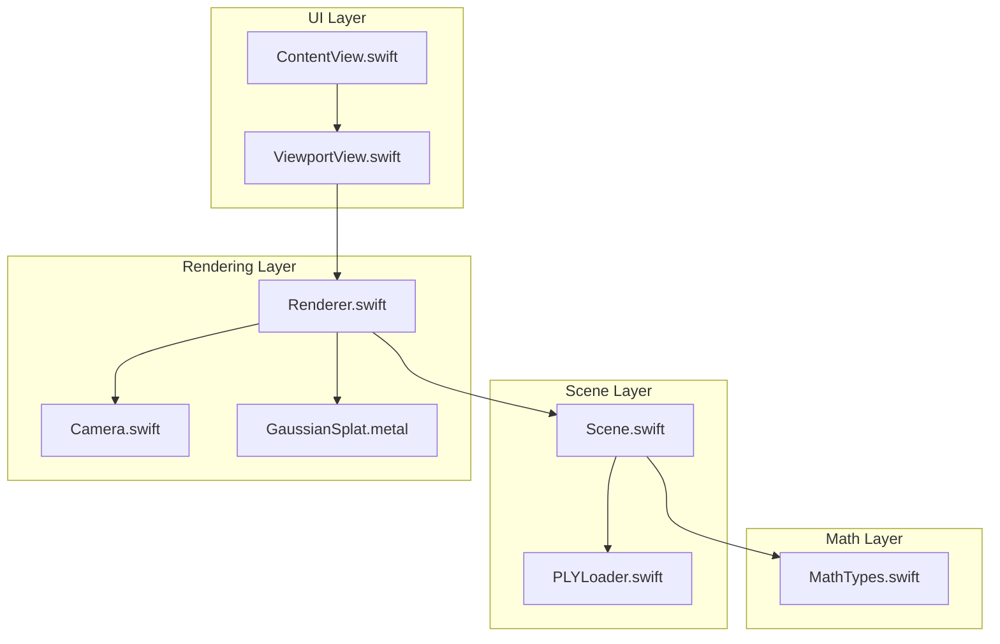
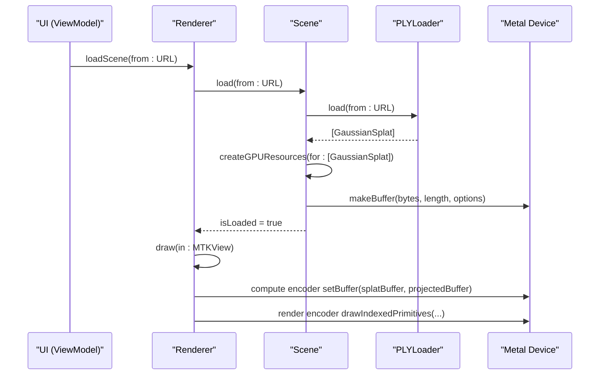
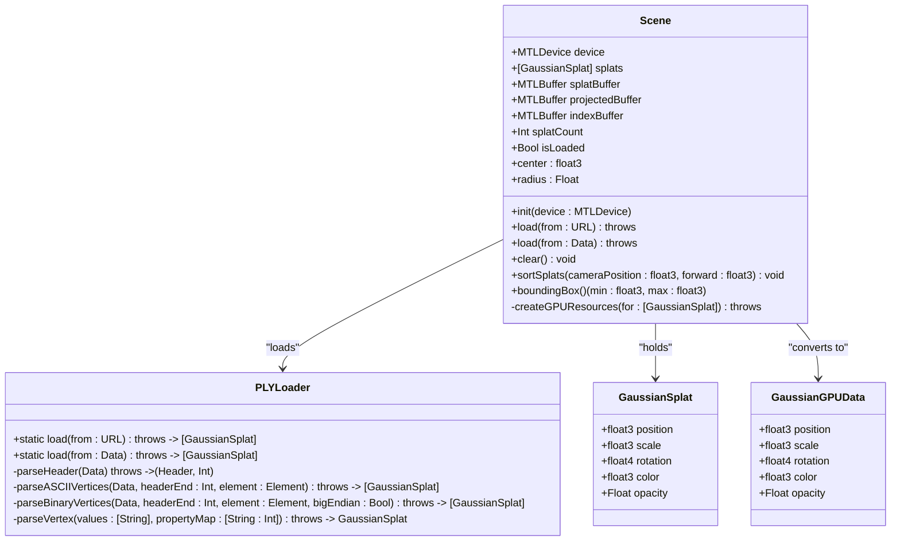
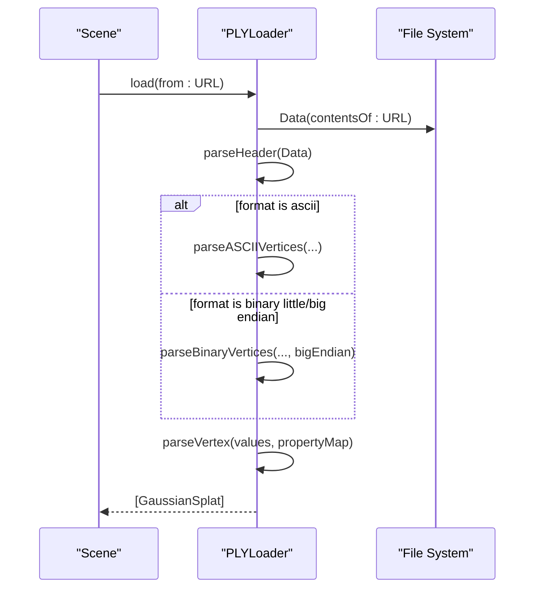
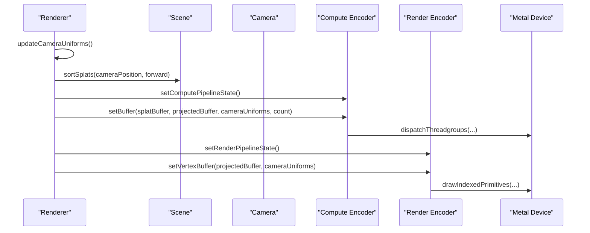
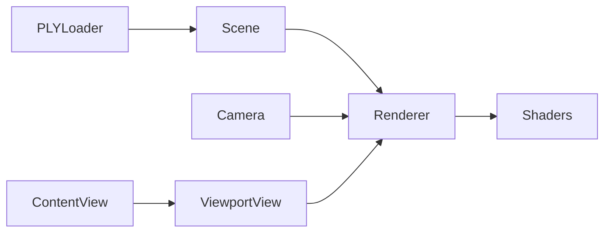

# Scene API

<cite>
**Referenced Files in This Document**
- [Scene.swift](file://Scene/Scene.swift)
- [PLYLoader.swift](file://Scene/PLYLoader.swift)
- [Renderer.swift](file://Rendering/Renderer.swift)
- [Camera.swift](file://Rendering/Camera.swift)
- [MathTypes.swift](file://Math/MathTypes.swift)
- [GaussianSplat.metal](file://Shaders/GaussianSplat.metal)
- [ContentView.swift](file://UI/ContentView.swift)
- [ViewportView.swift](file://UI/ViewportView.swift)
</cite>

## Table of Contents
1. [Introduction](#introduction)
2. [Project Structure](#project-structure)
3. [Core Components](#core-components)
4. [Architecture Overview](#architecture-overview)
5. [Detailed Component Analysis](#detailed-component-analysis)
6. [Dependency Analysis](#dependency-analysis)
7. [Performance Considerations](#performance-considerations)
8. [Troubleshooting Guide](#troubleshooting-guide)
9. [Conclusion](#conclusion)
10. [Appendices](#appendices)

## Introduction
This document provides comprehensive API documentation for the Scene management system and PLY file loading functionality. It covers the Scene class public methods for scene initialization, data loading, and resource management; the PLYLoader class API for file parsing, data validation, and format support; scene data structures; GPU buffer creation methods; memory management operations; loading workflow methods; error handling for file operations; and data validation processes. It also documents integration patterns with the renderer and camera systems, including method signatures for loadScene, createBuffers, and cleanup operations, along with examples of scene setup, file loading procedures, and data preparation workflows.

## Project Structure
The Scene and PLY loading system integrates with the renderer and camera subsystems, and is surfaced through SwiftUI views. The key modules are:
- Scene: Scene management and GPU buffer creation
- PLYLoader: PLY file parsing and validation
- Rendering: Renderer and Camera orchestration
- Math: Data structures and math utilities for GPU-compatible data
- Shaders: Metal shaders for projection and rendering
- UI: SwiftUI integration and user interaction

**Diagram sources**
- [Scene.swift:1-158](file://Scene/Scene.swift#L1-L158)
- [PLYLoader.swift:1-403](file://Scene/PLYLoader.swift#L1-L403)
- [Renderer.swift:1-289](file://Rendering/Renderer.swift#L1-L289)
- [Camera.swift:1-184](file://Rendering/Camera.swift#L1-L184)
- [MathTypes.swift:1-189](file://Math/MathTypes.swift#L1-L189)
- [GaussianSplat.metal:1-317](file://Shaders/GaussianSplat.metal#L1-L317)
- [ContentView.swift:1-130](file://UI/ContentView.swift#L1-L130)
- [ViewportView.swift:1-185](file://UI/ViewportView.swift#L1-L185)

**Section sources**
- [Scene.swift:1-158](file://Scene/Scene.swift#L1-L158)
- [PLYLoader.swift:1-403](file://Scene/PLYLoader.swift#L1-L403)
- [Renderer.swift:1-289](file://Rendering/Renderer.swift#L1-L289)
- [Camera.swift:1-184](file://Rendering/Camera.swift#L1-L184)
- [MathTypes.swift:1-189](file://Math/MathTypes.swift#L1-L189)
- [GaussianSplat.metal:1-317](file://Shaders/GaussianSplat.metal#L1-L317)
- [ContentView.swift:1-130](file://UI/ContentView.swift#L1-L130)
- [ViewportView.swift:1-185](file://UI/ViewportView.swift#L1-L185)

## Core Components
This section documents the primary APIs and their responsibilities.

- Scene
  - Manages Gaussian splats and GPU resources
  - Public methods:
    - load(from url: URL) throws
    - load(from data: Data) throws
    - clear() -> void
    - sortSplats(cameraPosition: float3, forward: float3) -> void
    - boundingBox() -> (min: float3, max: float3)
    - center: float3
    - radius: Float
    - splatCount: Int
    - isLoaded: Bool
  - GPU buffer creation:
    - createGPUResources(for: [GaussianSplat]) throws
  - Internal/private:
    - createGPUResources(for: [GaussianSplat]) throws

- PLYLoader
  - Loads Gaussian splats from PLY files or raw Data
  - Public static methods:
    - load(from url: URL) throws -> [GaussianSplat]
    - load(from data: Data) throws -> [GaussianSplat]
  - Internal parsing:
    - parseHeader(Data) throws -> (Header, Int)
    - parseASCIIVertices(Data, headerEnd: Int, element: Element) throws -> [GaussianSplat]
    - parseBinaryVertices(Data, headerEnd: Int, element: Element, bigEndian: Bool) throws -> [GaussianSplat]
    - parseVertex(values: [String], propertyMap: [String: Int]) throws -> GaussianSplat
  - Supporting types:
    - Format: ascii, binaryLittleEndian, binaryBigEndian
    - Property: name: String, type: String
    - Element: name: String, count: Int, properties: [Property]
    - Header: format: Format, elements: [Element]
  - Errors:
    - PLYLoaderError: fileNotFound, invalidHeader, unsupportedFormat, parseError(String), missingRequiredProperty(String)

- Renderer
  - Integrates Scene and Camera with Metal rendering
  - Public methods:
    - loadScene(from url: URL) throws
    - draw(in view: MTKView)
  - Internal pipeline and buffer creation:
    - createComputePipeline()
    - createRenderPipeline()
    - createBuffers()

- Camera
  - Orbit camera with spherical coordinates and matrix updates
  - Public methods:
    - updateMatrices()
    - rotate(deltaX: Float, deltaY: Float)
    - zoom(delta: Float)
    - pan(deltaX: Float, deltaY: Float)
    - focus(on point: float3, radius: Float)
    - reset()
    - getUniforms(screenSize: float2) -> CameraUniforms
    - mouseDown(at: float2)
    - mouseDrag(to: float2, button: MouseButton)
    - mouseUp()
    - scroll(deltaY: Float)

- MathTypes
  - Data structures for GPU compatibility:
    - GaussianSplat: position, scale, rotation, color, opacity
    - GaussianGPUData: GPU-compatible structure for splats
    - CameraUniforms: matrices and camera parameters for shaders
    - ProjectedGaussian: per-splat data after projection
  - Utilities:
    - float4 quaternion extensions (normalized, toRotationMatrix)
    - float4x4 matrix extensions (perspective, lookAt, translation, scale, directions)
    - covariance computation for GaussianSplat

- UI Integration
  - ContentView: file picker and overlays
  - ViewportView: SwiftUI wrapper around MTKView with input handling
  - ViewModel: orchestrates file loading and renderer lifecycle

**Section sources**
- [Scene.swift:1-158](file://Scene/Scene.swift#L1-L158)
- [PLYLoader.swift:1-403](file://Scene/PLYLoader.swift#L1-L403)
- [Renderer.swift:1-289](file://Rendering/Renderer.swift#L1-L289)
- [Camera.swift:1-184](file://Rendering/Camera.swift#L1-L184)
- [MathTypes.swift:1-189](file://Math/MathTypes.swift#L1-L189)
- [GaussianSplat.metal:1-317](file://Shaders/GaussianSplat.metal#L1-L317)
- [ContentView.swift:1-130](file://UI/ContentView.swift#L1-L130)
- [ViewportView.swift:1-185](file://UI/ViewportView.swift#L1-L185)

## Architecture Overview
The Scene API manages CPU-side Gaussian splats and their GPU buffers. The PLYLoader parses PLY files into GaussianSplat instances, which the Scene converts into GPU-friendly structures. The Renderer consumes these buffers and the Camera’s uniforms to project and render splats using Metal shaders.

**Diagram sources**
- [Renderer.swift:147-158](file://Rendering/Renderer.swift#L147-L158)
- [Scene.swift:30-55](file://Scene/Scene.swift#L30-L55)
- [PLYLoader.swift:41-68](file://Scene/PLYLoader.swift#L41-L68)
- [Scene.swift:57-95](file://Scene/Scene.swift#L57-L95)
- [Renderer.swift:167-251](file://Rendering/Renderer.swift#L167-L251)

## Detailed Component Analysis

### Scene API
The Scene class encapsulates Gaussian splat data and GPU resources. It exposes public methods for loading from URLs or Data, clearing resources, sorting splats for depth-based blending, and computing scene bounds.

Key public methods and behaviors:
- load(from url: URL) throws
  - Prints loading progress and timing
  - Delegates to PLYLoader.load(from: URL)
  - Calls createGPUResources(for: loadedSplats)
- load(from data: Data) throws
  - Similar to URL-based load but from Data
- clear() -> void
  - Resets splats and GPU buffers to nil
- sortSplats(cameraPosition: float3, forward: float3) -> void
  - Back-to-front sort using dot product against camera forward vector
  - Updates GPU buffer with sorted data
- boundingBox() -> (min: float3, max: float3)
  - Computes axis-aligned bounding box
- center: float3
  - Midpoint of bounding box
- radius: Float
  - Half-diagonal of bounding box
- splatCount: Int
  - Count of loaded splats
- isLoaded: Bool
  - True when splats and all GPU buffers are initialized

GPU buffer creation:
- createGPUResources(for: [GaussianSplat]) throws
  - Converts [GaussianSplat] to [GaussianGPUData]
  - Creates shared splatBuffer and private projectedBuffer and indexBuffer
  - Throws SceneError.failedToCreateBuffer on failure
  - Prints buffer sizes for diagnostics

Memory management:
- Uses Metal buffers with storageModeShared for splatBuffer and storageModePrivate for projectedBuffer and indexBuffer
- On empty input, clears buffers and resets state

Error handling:
- Throws SceneError.failedToCreateBuffer when buffer creation fails
- Throws SceneError.noSplatsLoaded when attempting to load without a Scene instance

Method signatures for reference:
- load(from url: URL) throws
- load(from data: Data) throws
- createGPUResources(for: [GaussianSplat]) throws
- clear() -> void

Example workflows:
- Scene setup: Initialize Scene(device: MTLDevice)
- File loading procedure: Scene.load(from: URL) -> creates GPU buffers
- Data preparation: Scene.createGPUResources(for: [GaussianSplat]) -> populates buffers

**Section sources**
- [Scene.swift:1-158](file://Scene/Scene.swift#L1-L158)

#### Class Diagram: Scene and Related Types

**Diagram sources**
- [Scene.swift:1-158](file://Scene/Scene.swift#L1-L158)
- [PLYLoader.swift:1-403](file://Scene/PLYLoader.swift#L1-L403)
- [MathTypes.swift:10-51](file://Math/MathTypes.swift#L10-L51)

### PLYLoader API
PLYLoader parses PLY files into GaussianSplat arrays. It supports ASCII and binary little/big endian formats and validates headers and required properties.

Public API:
- static load(from url: URL) throws -> [GaussianSplat]
- static load(from data: Data) throws -> [GaussianSplat]

Parsing pipeline:
- parseHeader(Data) throws -> (Header, Int)
  - Validates magic “ply” line
  - Parses format: ascii, binary_little_endian, binary_big_endian
  - Collects elements and properties
- parseASCIIVertices(Data, headerEnd: Int, element: Element) throws -> [GaussianSplat]
  - Decodes ASCII lines and maps property names to indices
- parseBinaryVertices(Data, headerEnd: Int, element: Element, bigEndian: Bool) throws -> [GaussianSplat]
  - Reads fixed-size records based on property types
  - Handles endianness conversions
- parseVertex(values: [String], propertyMap: [String: Int]) throws -> GaussianSplat
  - Extracts required position (x, y, z)
  - Optional: scale_0..2 (exponential mapping), rot_0..3 (quaternion), color via SH DC or red/green/blue, opacity via sigmoid

Supported PLY formats and property types:
- Formats: ascii, binary_little_endian, binary_big_endian
- Property types handled: char, uchar, short, ushort, int, uint, float, double, plus aliases
- Properties recognized:
  - Required: x, y, z
  - Optional: scale_0..2, rot_0..3, f_dc_0..2 (SH DC), red/green/blue, opacity

Validation and errors:
- PLYLoaderError: fileNotFound, invalidHeader, unsupportedFormat, parseError(String), missingRequiredProperty(String)
- Missing required properties (e.g., vertex element or position) trigger errors
- Binary parsing enforces stride calculation based on property types

Method signatures for reference:
- static load(from url: URL) throws -> [GaussianSplat]
- static load(from data: Data) throws -> [GaussianSplat]

Example workflow:
- PLYLoader.load(from: URL) -> [GaussianSplat]
- Scene.load(from: URL) -> delegates to PLYLoader and then creates GPU buffers

**Section sources**
- [PLYLoader.swift:1-403](file://Scene/PLYLoader.swift#L1-L403)

#### Sequence Diagram: PLY Loading and Validation

**Diagram sources**
- [PLYLoader.swift:41-68](file://Scene/PLYLoader.swift#L41-L68)
- [PLYLoader.swift:72-158](file://Scene/PLYLoader.swift#L72-L158)
- [PLYLoader.swift:162-204](file://Scene/PLYLoader.swift#L162-L204)
- [PLYLoader.swift:208-317](file://Scene/PLYLoader.swift#L208-L317)
- [PLYLoader.swift:321-385](file://Scene/PLYLoader.swift#L321-L385)

### Renderer and Camera Integration
The Renderer composes the Scene and Camera with Metal pipelines and draws Gaussian splats. It loads scenes, updates camera uniforms, performs compute projection, and renders instanced quads.

Key responsibilities:
- loadScene(from url: URL) throws
  - Validates Scene presence
  - Loads scene data and focuses camera on scene center/radius
  - Performs initial depth sort
- draw(in view: MTKView)
  - Updates camera uniforms
  - Conditionally sorts splats every N frames
  - Compute pass: project Gaussians into ProjectedGaussian buffer
  - Render pass: draw instanced quads using projected data

Camera integration:
- Camera.updateMatrices(), rotate(), zoom(), pan(), focus(), getUniforms()
- Renderer passes CameraUniforms to compute and vertex stages

Shader integration:
- Metal compute shader projectGaussians writes ProjectedGaussian
- Vertex and fragment shaders evaluate splat coverage and alpha

Method signatures for reference:
- loadScene(from url: URL) throws
- draw(in view: MTKView)

**Section sources**
- [Renderer.swift:147-158](file://Rendering/Renderer.swift#L147-L158)
- [Renderer.swift:167-251](file://Rendering/Renderer.swift#L167-L251)
- [Camera.swift:62-84](file://Rendering/Camera.swift#L62-L84)
- [Camera.swift:134-147](file://Rendering/Camera.swift#L134-L147)
- [GaussianSplat.metal:146-209](file://Shaders/GaussianSplat.metal#L146-L209)
- [GaussianSplat.metal:213-249](file://Shaders/GaussianSplat.metal#L213-L249)
- [GaussianSplat.metal:253-278](file://Shaders/GaussianSplat.metal#L253-L278)

#### Sequence Diagram: Renderer Drawing Pipeline

**Diagram sources**
- [Renderer.swift:187-191](file://Rendering/Renderer.swift#L187-L191)
- [Renderer.swift:194-218](file://Rendering/Renderer.swift#L194-L218)
- [Renderer.swift:221-242](file://Rendering/Renderer.swift#L221-L242)
- [GaussianSplat.metal:146-209](file://Shaders/GaussianSplat.metal#L146-L209)
- [GaussianSplat.metal:213-249](file://Shaders/GaussianSplat.metal#L213-L249)

### Data Structures and GPU Buffer Creation
Scene and MathTypes define the data structures used for GPU transfer and rendering.

- GaussianSplat
  - position: float3
  - scale: float3
  - rotation: float4 (quaternion)
  - color: float3
  - opacity: Float
- GaussianGPUData
  - GPU-compatible layout for splats
- ProjectedGaussian
  - depth, index, uv, conic (2D covariance inverse), color, opacity, radius
- CameraUniforms
  - view/projection/viewProjection matrices, cameraPosition, screenSize, tanHalfFov

GPU buffer creation:
- splatBuffer: shared storage for [GaussianGPUData]
- projectedBuffer: private storage for [ProjectedGaussian]
- indexBuffer: private storage for UInt32 indices (used for sorting)

Memory management:
- Buffer creation uses device.makeBuffer with appropriate storage modes
- On empty input, Scene.clear() releases buffers and resets state

**Section sources**
- [MathTypes.swift:10-73](file://Math/MathTypes.swift#L10-L73)
- [Scene.swift:57-95](file://Scene/Scene.swift#L57-L95)

## Dependency Analysis
The Scene depends on PLYLoader for data ingestion and on Metal for GPU buffers. The Renderer depends on Scene and Camera, and uses Metal for compute and render passes. The UI layer coordinates file selection and invokes Renderer.loadScene.

**Diagram sources**
- [Scene.swift:30-55](file://Scene/Scene.swift#L30-L55)
- [PLYLoader.swift:41-68](file://Scene/PLYLoader.swift#L41-L68)
- [Renderer.swift:147-158](file://Rendering/Renderer.swift#L147-L158)
- [Camera.swift:1-184](file://Rendering/Camera.swift#L1-L184)
- [GaussianSplat.metal:1-317](file://Shaders/GaussianSplat.metal#L1-L317)
- [ViewportView.swift:18-21](file://UI/ViewportView.swift#L18-L21)
- [ContentView.swift:110-123](file://UI/ContentView.swift#L110-L123)

**Section sources**
- [Scene.swift:1-158](file://Scene/Scene.swift#L1-L158)
- [PLYLoader.swift:1-403](file://Scene/PLYLoader.swift#L1-L403)
- [Renderer.swift:1-289](file://Rendering/Renderer.swift#L1-L289)
- [Camera.swift:1-184](file://Rendering/Camera.swift#L1-L184)
- [MathTypes.swift:1-189](file://Math/MathTypes.swift#L1-L189)
- [GaussianSplat.metal:1-317](file://Shaders/GaussianSplat.metal#L1-L317)
- [ContentView.swift:1-130](file://UI/ContentView.swift#L1-L130)
- [ViewportView.swift:1-185](file://UI/ViewportView.swift#L1-L185)

## Performance Considerations
- Depth sorting interval: Renderer sorts every N frames to reduce compute overhead
- Triple-buffered camera uniforms: Reduces contention between CPU and GPU
- Private vs shared storage modes: Use private for intermediate compute buffers, shared for small data
- Early discard in shaders: Fragments with negligible alpha are discarded
- Binary parsing stride: Accurate stride calculation prevents misreads and improves robustness

[No sources needed since this section provides general guidance]

## Troubleshooting Guide
Common issues and resolutions:
- SceneError.failedToCreateBuffer
  - Cause: Metal buffer creation failure
  - Resolution: Verify device availability and sufficient memory
- SceneError.noSplatsLoaded
  - Cause: Attempting to load without a Scene instance
  - Resolution: Ensure Renderer initializes Scene before loadScene
- PLYLoaderError.fileNotFound
  - Cause: Invalid URL or missing file
  - Resolution: Validate file path and permissions
- PLYLoaderError.invalidHeader
  - Cause: Malformed PLY header or encoding issues
  - Resolution: Ensure ASCII encoding and correct “end_header”
- PLYLoaderError.missingRequiredProperty
  - Cause: Missing x/y/z or vertex element
  - Resolution: Include required properties in PLY file
- PLYLoaderError.unsupportedFormat
  - Cause: Unsupported format string
  - Resolution: Use ascii or binary little/big endian
- PLYLoaderError.parseError
  - Cause: Malformed ASCII or binary data
  - Resolution: Validate property types and endianness

**Section sources**
- [Scene.swift:154-157](file://Scene/Scene.swift#L154-L157)
- [Renderer.swift:147-150](file://Rendering/Renderer.swift#L147-L150)
- [PLYLoader.swift:3-10](file://Scene/PLYLoader.swift#L3-L10)
- [PLYLoader.swift:72-86](file://Scene/PLYLoader.swift#L72-L86)
- [PLYLoader.swift:53-55](file://Scene/PLYLoader.swift#L53-L55)
- [PLYLoader.swift:118-124](file://Scene/PLYLoader.swift#L118-L124)
- [PLYLoader.swift:163-165](file://Scene/PLYLoader.swift#L163-L165)

## Conclusion
The Scene API provides a clean interface for loading Gaussian splats from PLY files, managing GPU resources, and integrating with the Renderer and Camera systems. PLYLoader offers robust parsing with validation and support for multiple formats. Together, these components enable efficient rendering of 3D Gaussian splatting scenes with proper memory management and error handling.

[No sources needed since this section summarizes without analyzing specific files]

## Appendices

### Method Signatures Reference
- Scene
  - load(from url: URL) throws
  - load(from data: Data) throws
  - createGPUResources(for: [GaussianSplat]) throws
  - clear() -> void
  - sortSplats(cameraPosition: float3, forward: float3) -> void
- PLYLoader
  - static load(from url: URL) throws -> [GaussianSplat]
  - static load(from data: Data) throws -> [GaussianSplat]
- Renderer
  - loadScene(from url: URL) throws
  - draw(in view: MTKView)
- Camera
  - updateMatrices()
  - rotate(deltaX: Float, deltaY: Float)
  - zoom(delta: Float)
  - pan(deltaX: Float, deltaY: Float)
  - focus(on point: float3, radius: Float)
  - reset()
  - getUniforms(screenSize: float2) -> CameraUniforms
  - mouseDown(at: float2)
  - mouseDrag(to: float2, button: MouseButton)
  - mouseUp()
  - scroll(deltaY: Float)

**Section sources**
- [Scene.swift:30-121](file://Scene/Scene.swift#L30-L121)
- [PLYLoader.swift:41-68](file://Scene/PLYLoader.swift#L41-L68)
- [Renderer.swift:147-158](file://Rendering/Renderer.swift#L147-L158)
- [Camera.swift:62-177](file://Rendering/Camera.swift#L62-L177)