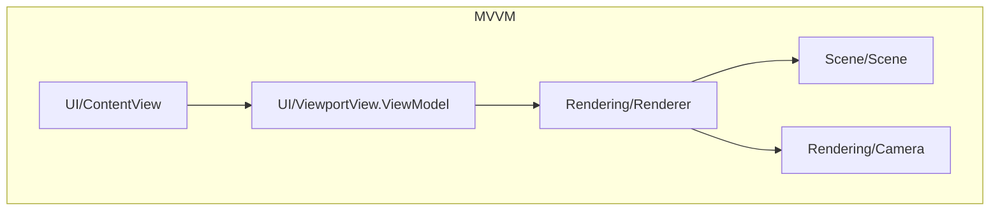
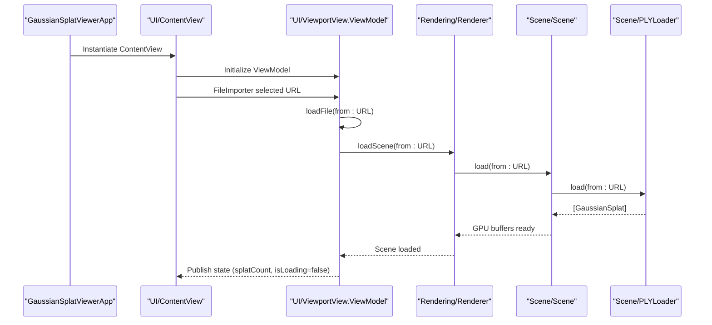
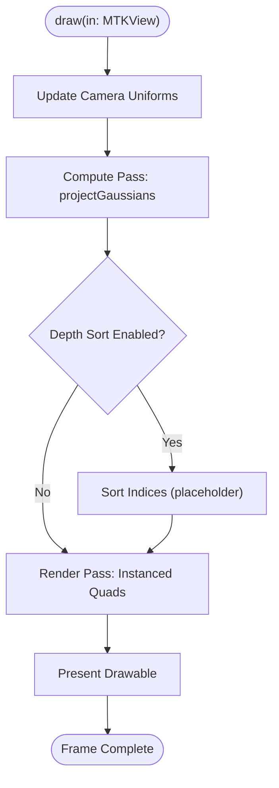
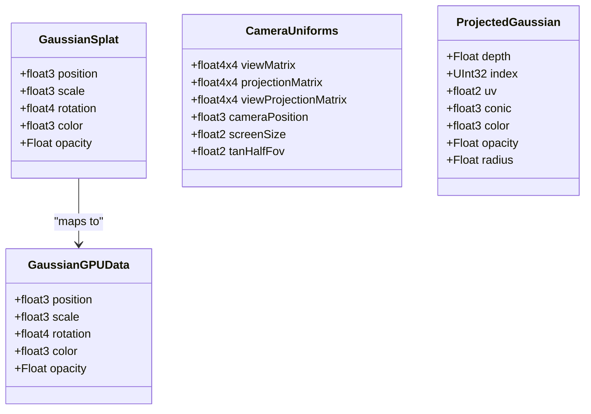
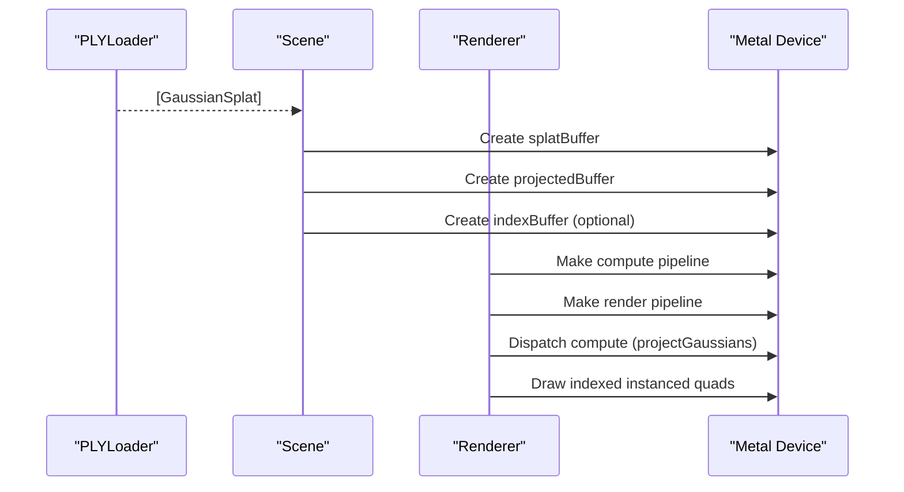
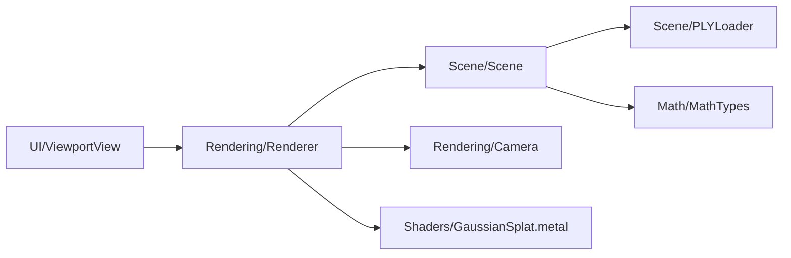

# Architecture Overview

<cite>
**Referenced Files in This Document**
- [GaussianSplatViewerApp.swift](file://GaussianSplatViewer/GaussianSplatViewerApp.swift)
- [ContentView.swift](file://GaussianSplatViewer/ContentView.swift)
- [UI/ContentView.swift](file://UI/ContentView.swift)
- [UI/ViewportView.swift](file://UI/ViewportView.swift)
- [Rendering/Renderer.swift](file://Rendering/Renderer.swift)
- [Rendering/Camera.swift](file://Rendering/Camera.swift)
- [Scene/Scene.swift](file://Scene/Scene.swift)
- [Scene/PLYLoader.swift](file://Scene/PLYLoader.swift)
- [Math/MathTypes.swift](file://Math/MathTypes.swift)
- [Shaders/GaussianSplat.metal](file://Shaders/GaussianSplat.metal)
</cite>

## Table of Contents
1. [Introduction](#introduction)
2. [Project Structure](#project-structure)
3. [Core Components](#core-components)
4. [Architecture Overview](#architecture-overview)
5. [Detailed Component Analysis](#detailed-component-analysis)
6. [Dependency Analysis](#dependency-analysis)
7. [Performance Considerations](#performance-considerations)
8. [Troubleshooting Guide](#troubleshooting-guide)
9. [Conclusion](#conclusion)

## Introduction
This document describes the architectural design of the Gaussian Splat Viewer system. The application follows an MVVM (Model-View-ViewModel) pattern with clear separation of concerns:
- Model: Scene and PLYLoader manage Gaussian splat data and GPU buffers.
- View: SwiftUI views (including a Metal-backed viewport) present the UI and capture user input.
- ViewModel: A coordinator class bridges UI and rendering, managing asynchronous loading and state.

The rendering pipeline integrates Metal compute shaders for projecting Gaussians, a render pass for drawing instanced quads, and Metal shaders for vertex and fragment stages. Mathematical foundations include Gaussian splat data structures, covariance computation, and camera matrices.

## Project Structure
The project is organized by domain and technology:
- UI: SwiftUI views and a Metal viewport wrapper.
- Rendering: Renderer and Camera orchestrate Metal pipelines and GPU resources.
- Scene: Scene manages Gaussian splat collections and GPU buffers; PLYLoader parses PLY files.
- Math: GPU-compatible data structures and math utilities.
- Shaders: Metal compute and fragment shaders for projection and rendering.

```mermaid
graph TB
subgraph "App Layer"
App["GaussianSplatViewerApp"]
ContentView["UI/ContentView"]
end
subgraph "Viewport"
ViewportView["UI/ViewportView"]
Renderer["Rendering/Renderer"]
Camera["Rendering/Camera"]
end
subgraph "Scene"
Scene["Scene/Scene"]
PLYLoader["Scene/PLYLoader"]
end
subgraph "Math & Shaders"
MathTypes["Math/MathTypes"]
MetalShaders["Shaders/GaussianSplat.metal"]
end
App --> ContentView
ContentView --> ViewportView
ViewportView --> Renderer
Renderer --> Scene
Renderer --> Camera
Scene --> PLYLoader
Renderer --> MetalShaders
Scene --> MathTypes
Camera --> MathTypes
```

**Diagram sources**
- [GaussianSplatViewerApp.swift:1-13](file://GaussianSplatViewer/GaussianSplatViewerApp.swift#L1-L13)
- [UI/ContentView.swift:1-130](file://UI/ContentView.swift#L1-L130)
- [UI/ViewportView.swift:1-185](file://UI/ViewportView.swift#L1-L185)
- [Rendering/Renderer.swift:1-292](file://Rendering/Renderer.swift#L1-L292)
- [Rendering/Camera.swift:1-184](file://Rendering/Camera.swift#L1-L184)
- [Scene/Scene.swift:1-131](file://Scene/Scene.swift#L1-L131)
- [Scene/PLYLoader.swift:1-403](file://Scene/PLYLoader.swift#L1-L403)
- [Math/MathTypes.swift:1-189](file://Math/MathTypes.swift#L1-L189)
- [Shaders/GaussianSplat.metal:1-309](file://Shaders/GaussianSplat.metal#L1-L309)

**Section sources**
- [GaussianSplatViewerApp.swift:1-13](file://GaussianSplatViewer/GaussianSplatViewerApp.swift#L1-L13)
- [UI/ContentView.swift:1-130](file://UI/ContentView.swift#L1-L130)
- [UI/ViewportView.swift:1-185](file://UI/ViewportView.swift#L1-L185)
- [Rendering/Renderer.swift:1-292](file://Rendering/Renderer.swift#L1-L292)
- [Rendering/Camera.swift:1-184](file://Rendering/Camera.swift#L1-L184)
- [Scene/Scene.swift:1-131](file://Scene/Scene.swift#L1-L131)
- [Scene/PLYLoader.swift:1-403](file://Scene/PLYLoader.swift#L1-L403)
- [Math/MathTypes.swift:1-189](file://Math/MathTypes.swift#L1-L189)
- [Shaders/GaussianSplat.metal:1-309](file://Shaders/GaussianSplat.metal#L1-L309)

## Core Components
- GaussianSplatViewerApp: SwiftUI App entry point that hosts the primary ContentView.
- UI/ContentView: SwiftUI View that composes toolbar, viewport, overlays, and file import.
- UI/ViewportView: NSViewRepresentable wrapping an MTKView; creates and wires the Renderer.
- Rendering/Renderer: MTKViewDelegate that builds Metal pipelines, manages buffers, and executes compute and render passes.
- Rendering/Camera: Orbit camera with sensitivity controls and matrix computations.
- Scene/Scene: Manages Gaussian splat arrays and GPU buffers; loads data via PLYLoader.
- Scene/PLYLoader: Parses PLY headers and vertex data, mapping to GaussianSplat instances.
- Math/MathTypes: Defines GaussianGPUData, CameraUniforms, ProjectedGaussian, and math helpers.
- Shaders/GaussianSplat.metal: Implements compute shader for projection, vertex shader for instanced quads, and fragment shader for splat blending.

**Section sources**
- [GaussianSplatViewerApp.swift:1-13](file://GaussianSplatViewer/GaussianSplatViewerApp.swift#L1-L13)
- [UI/ContentView.swift:1-130](file://UI/ContentView.swift#L1-L130)
- [UI/ViewportView.swift:1-185](file://UI/ViewportView.swift#L1-L185)
- [Rendering/Renderer.swift:1-292](file://Rendering/Renderer.swift#L1-L292)
- [Rendering/Camera.swift:1-184](file://Rendering/Camera.swift#L1-L184)
- [Scene/Scene.swift:1-131](file://Scene/Scene.swift#L1-L131)
- [Scene/PLYLoader.swift:1-403](file://Scene/PLYLoader.swift#L1-L403)
- [Math/MathTypes.swift:1-189](file://Math/MathTypes.swift#L1-L189)
- [Shaders/GaussianSplat.metal:1-309](file://Shaders/GaussianSplat.metal#L1-L309)

## Architecture Overview
The system follows MVVM:
- View: UI/ContentView displays the interface and delegates input to ViewModel.
- ViewModel: UI/ViewportView.ViewModel coordinates loading and exposes state to the View.
- Model: Scene holds Gaussian data and GPU buffers; PLYLoader populates it.
- Renderer: Rendering/Renderer orchestrates Metal compute and render passes, integrating Camera and Scene.



**Diagram sources**
- [UI/ContentView.swift:1-130](file://UI/ContentView.swift#L1-L130)
- [UI/ViewportView.swift:142-185](file://UI/ViewportView.swift#L142-L185)
- [Rendering/Renderer.swift:1-292](file://Rendering/Renderer.swift#L1-L292)
- [Rendering/Camera.swift:1-184](file://Rendering/Camera.swift#L1-L184)
- [Scene/Scene.swift:1-131](file://Scene/Scene.swift#L1-L131)

## Detailed Component Analysis

### MVVM Orchestration: App, View, and ViewModel
- GaussianSplatViewerApp creates a WindowGroup hosting UI/ContentView.
- UI/ContentView composes toolbar, viewport, overlays, and file importer; binds to ViewModel.
- UI/ViewportView.ViewModel handles asynchronous PLY loading, updates state, and coordinates with Renderer.



**Diagram sources**
- [GaussianSplatViewerApp.swift:1-13](file://GaussianSplatViewer/GaussianSplatViewerApp.swift#L1-L13)
- [UI/ContentView.swift:108-124](file://UI/ContentView.swift#L108-L124)
- [UI/ViewportView.swift:151-183](file://UI/ViewportView.swift#L151-L183)
- [Rendering/Renderer.swift:147-157](file://Rendering/Renderer.swift#L147-L157)
- [Scene/Scene.swift:26-50](file://Scene/Scene.swift#L26-L50)
- [Scene/PLYLoader.swift:42-68](file://Scene/PLYLoader.swift#L42-L68)

**Section sources**
- [GaussianSplatViewerApp.swift:1-13](file://GaussianSplatViewer/GaussianSplatViewerApp.swift#L1-L13)
- [UI/ContentView.swift:108-124](file://UI/ContentView.swift#L108-L124)
- [UI/ViewportView.swift:151-183](file://UI/ViewportView.swift#L151-L183)
- [Rendering/Renderer.swift:147-157](file://Rendering/Renderer.swift#L147-L157)
- [Scene/Scene.swift:26-50](file://Scene/Scene.swift#L26-L50)
- [Scene/PLYLoader.swift:42-68](file://Scene/PLYLoader.swift#L42-L68)

### Rendering Pipeline: Compute, Sort, and Render Passes
- Compute pass: projectGaussians Metal kernel computes per-splat projected data (depth, conic, color, opacity, radius).
- Depth sorting: placeholder for sorting indices every N frames (bitonic sort kernel provided).
- Render pass: draws instanced quads with alpha blending; fragment evaluates 2D Gaussian splats.



**Diagram sources**
- [Rendering/Renderer.swift:166-254](file://Rendering/Renderer.swift#L166-L254)
- [Shaders/GaussianSplat.metal:138-201](file://Shaders/GaussianSplat.metal#L138-L201)
- [Shaders/GaussianSplat.metal:274-309](file://Shaders/GaussianSplat.metal#L274-L309)

**Section sources**
- [Rendering/Renderer.swift:166-254](file://Rendering/Renderer.swift#L166-L254)
- [Shaders/GaussianSplat.metal:138-201](file://Shaders/GaussianSplat.metal#L138-L201)
- [Shaders/GaussianSplat.metal:274-309](file://Shaders/GaussianSplat.metal#L274-L309)

### Mathematical Foundation and GPU Formats
- GaussianGPUData: CPU-to-GPU structure containing position, scale, rotation, color, and opacity.
- CameraUniforms: GPU uniform buffer with view/projection matrices, camera position, screen size, and FOV tangents.
- ProjectedGaussian: Output of compute shader with depth, index, UV, conic (inverse covariance), color, opacity, and radius.
- Covariance math: Computes 3D covariance from scale and rotation, projects to 2D, and derives conic for fragment evaluation.



**Diagram sources**
- [Math/MathTypes.swift:12-30](file://Math/MathTypes.swift#L12-L30)
- [Math/MathTypes.swift:35-51](file://Math/MathTypes.swift#L35-L51)
- [Math/MathTypes.swift:54-62](file://Math/MathTypes.swift#L54-L62)
- [Math/MathTypes.swift:65-73](file://Math/MathTypes.swift#L65-L73)

**Section sources**
- [Math/MathTypes.swift:12-30](file://Math/MathTypes.swift#L12-L30)
- [Math/MathTypes.swift:35-51](file://Math/MathTypes.swift#L35-L51)
- [Math/MathTypes.swift:54-62](file://Math/MathTypes.swift#L54-L62)
- [Math/MathTypes.swift:65-73](file://Math/MathTypes.swift#L65-L73)

### Data Flow: PLY to GPU Buffers to Rendering
- PLYLoader parses headers and vertex properties, mapping to GaussianSplat.
- Scene creates GPU buffers for splat data, projected data, and optional index buffer.
- Renderer sets compute and render pipeline states, dispatches compute, and draws instanced quads.



**Diagram sources**
- [Scene/PLYLoader.swift:42-68](file://Scene/PLYLoader.swift#L42-L68)
- [Scene/Scene.swift:53-86](file://Scene/Scene.swift#L53-L86)
- [Rendering/Renderer.swift:81-143](file://Rendering/Renderer.swift#L81-L143)
- [Rendering/Renderer.swift:183-242](file://Rendering/Renderer.swift#L183-L242)

**Section sources**
- [Scene/PLYLoader.swift:42-68](file://Scene/PLYLoader.swift#L42-L68)
- [Scene/Scene.swift:53-86](file://Scene/Scene.swift#L53-L86)
- [Rendering/Renderer.swift:81-143](file://Rendering/Renderer.swift#L81-L143)
- [Rendering/Renderer.swift:183-242](file://Rendering/Renderer.swift#L183-L242)

## Dependency Analysis
- UI depends on SwiftUI and MetalKit; ViewportView creates MTKView and Renderer.
- Renderer depends on Scene and Camera; uses Metal device, command queue, and libraries.
- Scene depends on PLYLoader and Metal device for GPU buffers.
- MathTypes underpins both Scene and Renderer with GPU-compatible structures.
- Shaders define the compute and fragment stages consumed by Renderer.



**Diagram sources**
- [UI/ViewportView.swift:18-21](file://UI/ViewportView.swift#L18-L21)
- [Rendering/Renderer.swift:22-22](file://Rendering/Renderer.swift#L22-L22)
- [Scene/Scene.swift:10-15](file://Scene/Scene.swift#L10-L15)
- [Scene/PLYLoader.swift:1-10](file://Scene/PLYLoader.swift#L1-L10)
- [Math/MathTypes.swift:1-3](file://Math/MathTypes.swift#L1-L3)
- [Shaders/GaussianSplat.metal:1-3](file://Shaders/GaussianSplat.metal#L1-L3)

**Section sources**
- [UI/ViewportView.swift:18-21](file://UI/ViewportView.swift#L18-L21)
- [Rendering/Renderer.swift:22-22](file://Rendering/Renderer.swift#L22-L22)
- [Scene/Scene.swift:10-15](file://Scene/Scene.swift#L10-L15)
- [Scene/PLYLoader.swift:1-10](file://Scene/PLYLoader.swift#L1-L10)
- [Math/MathTypes.swift:1-3](file://Math/MathTypes.swift#L1-L3)
- [Shaders/GaussianSplat.metal:1-3](file://Shaders/GaussianSplat.metal#L1-L3)

## Performance Considerations
- Triple-buffered camera uniforms reduce CPU-GPU synchronization stalls.
- Compute dispatch groups sized to splat count with 256-wide thread groups.
- Alpha blending enabled for correct splat compositing; early discard in fragment shader reduces overdraw.
- Depth sorting is disabled by default and scheduled every N frames to balance correctness vs. cost.
- GPU buffer creation uses shared/private storage modes to balance speed and visibility across stages.

[No sources needed since this section provides general guidance]

## Troubleshooting Guide
Common issues and diagnostics:
- Metal library load failures: Verify shader function names match compute and vertex/fragment stages.
- Buffer creation errors: Ensure device availability and sufficient memory for splat buffers.
- PLY parsing errors: Confirm required properties (position) and supported formats (ASCII/binary little endian).
- No splats rendered: Check opacity and radius thresholds; verify compute projection ran and indices are valid.

**Section sources**
- [Rendering/Renderer.swift:47-53](file://Rendering/Renderer.swift#L47-L53)
- [Scene/Scene.swift:60-81](file://Scene/Scene.swift#L60-L81)
- [Scene/PLYLoader.swift:50-68](file://Scene/PLYLoader.swift#L50-L68)
- [Shaders/GaussianSplat.metal:245-270](file://Shaders/GaussianSplat.metal#L245-L270)

## Conclusion
The Gaussian Splat Viewer employs a clean MVVM architecture with distinct layers for UI, rendering, scene management, and math. The Metal-based rendering pipeline efficiently projects Gaussians via compute shaders and renders them with instanced quads and alpha blending. The modular design enables future enhancements such as enabling depth sorting and optimizing buffer strategies.