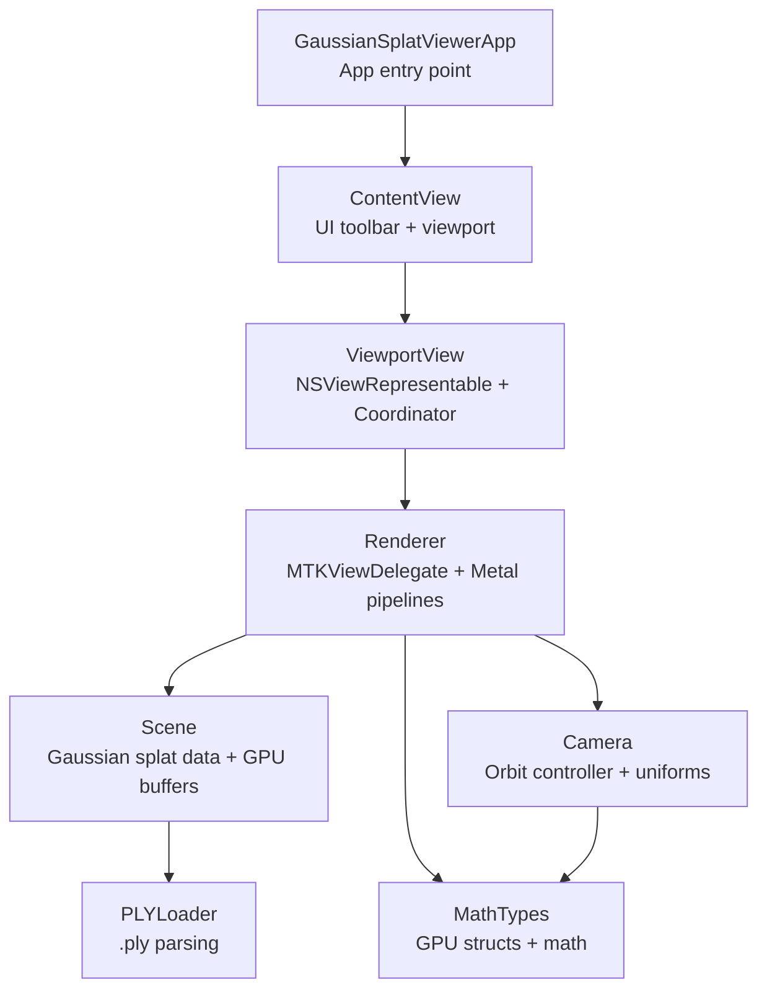
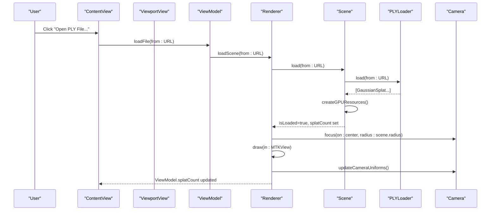
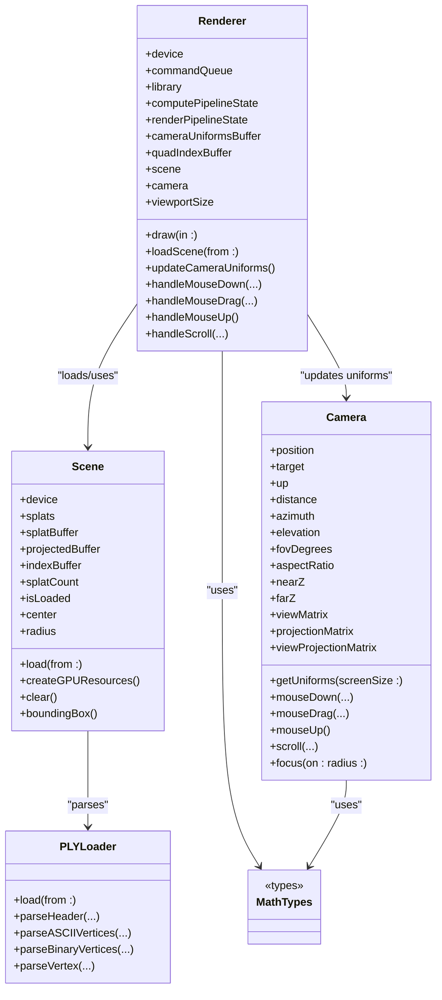

# Component Interactions

<cite>
**Referenced Files in This Document**
- [GaussianSplatViewerApp.swift](file://Sources/GaussianSplatViewerApp.swift)
- [ContentView.swift](file://Sources/UI/ContentView.swift)
- [ViewportView.swift](file://Sources/UI/ViewportView.swift)
- [Renderer.swift](file://Sources/Rendering/Renderer.swift)
- [Scene.swift](file://Sources/Scene/Scene.swift)
- [Camera.swift](file://Sources/Rendering/Camera.swift)
- [PLYLoader.swift](file://Sources/Scene/PLYLoader.swift)
- [MathTypes.swift](file://Sources/Math/MathTypes.swift)
</cite>

## Table of Contents
1. [Introduction](#introduction)
2. [Project Structure](#project-structure)
3. [Core Components](#core-components)
4. [Architecture Overview](#architecture-overview)
5. [Detailed Component Analysis](#detailed-component-analysis)
6. [Dependency Analysis](#dependency-analysis)
7. [Performance Considerations](#performance-considerations)
8. [Troubleshooting Guide](#troubleshooting-guide)
9. [Conclusion](#conclusion)

## Introduction
This document explains how the 3DGS system orchestrates component interactions across architectural layers. It focuses on the flow from the SwiftUI application entry point through the UI layer, ViewModel coordination, Metal-based rendering, and scene management. It documents how user input propagates through the system, how Renderer and Scene collaborate for GPU resource management, and provides sequence diagrams for typical operations such as file loading, scene rendering, and camera control updates.

## Project Structure
The project follows a layered architecture:
- Application entry point initializes the SwiftUI app and window.
- UI layer consists of ContentView and ViewportView, which integrate with SwiftUI and MetalKit.
- ViewModel coordinates UI state and delegates rendering tasks to Renderer.
- Renderer manages Metal pipelines, GPU buffers, and the drawing loop.
- Scene encapsulates Gaussian splat data and GPU buffers.
- Camera controls navigation and provides uniforms for shaders.
- PLYLoader parses .ply files into Gaussian splat data.
- MathTypes defines shared data structures and math utilities.

**Diagram sources**
- [GaussianSplatViewerApp.swift:1-65](file://Sources/GaussianSplatViewerApp.swift#L1-L65)
- [ContentView.swift:1-119](file://Sources/UI/ContentView.swift#L1-L119)
- [ViewportView.swift:1-118](file://Sources/UI/ViewportView.swift#L1-L118)
- [Renderer.swift:1-288](file://Sources/Rendering/Renderer.swift#L1-L288)
- [Scene.swift:1-130](file://Sources/Scene/Scene.swift#L1-L130)
- [Camera.swift:1-184](file://Sources/Rendering/Camera.swift#L1-L184)
- [PLYLoader.swift:1-386](file://Sources/Scene/PLYLoader.swift#L1-L386)
- [MathTypes.swift:1-189](file://Sources/Math/MathTypes.swift#L1-L189)

**Section sources**
- [GaussianSplatViewerApp.swift:1-65](file://Sources/GaussianSplatViewerApp.swift#L1-L65)
- [ContentView.swift:1-119](file://Sources/UI/ContentView.swift#L1-L119)
- [ViewportView.swift:1-118](file://Sources/UI/ViewportView.swift#L1-L118)
- [Renderer.swift:1-288](file://Sources/Rendering/Renderer.swift#L1-L288)
- [Scene.swift:1-130](file://Sources/Scene/Scene.swift#L1-L130)
- [Camera.swift:1-184](file://Sources/Rendering/Camera.swift#L1-L184)
- [PLYLoader.swift:1-386](file://Sources/Scene/PLYLoader.swift#L1-L386)
- [MathTypes.swift:1-189](file://Sources/Math/MathTypes.swift#L1-L189)

## Core Components
- GaussianSplatViewerApp: Initializes the SwiftUI app, sets default window size, and provides macOS Settings UI.
- ContentView: Provides toolbar actions, file picker, loading overlay, and instructions. It hosts ViewportView and binds to ViewModel.
- ViewportView: Bridges SwiftUI to MetalKit via NSViewRepresentable, creates Renderer, and forwards mouse/touch events to Renderer.
- ViewModel: Central coordinator managing UI state (loading, file name, splat count) and delegating scene loading to Renderer.
- Renderer: MTKViewDelegate that builds Metal pipelines, manages GPU buffers, runs compute and render passes, and handles camera updates.
- Scene: Holds CPU-side Gaussian splat data and GPU buffers; loads data from PLY via PLYLoader and creates GPU resources.
- Camera: Orbit camera controller that computes view/projection matrices and generates CameraUniforms for shaders.
- PLYLoader: Parses .ply headers and vertex data (ASCII/binary) into GaussianSplat arrays.
- MathTypes: Defines GaussianSplat, CameraUniforms, ProjectedGaussian, and supporting math utilities.

**Section sources**
- [GaussianSplatViewerApp.swift:1-65](file://Sources/GaussianSplatViewerApp.swift#L1-L65)
- [ContentView.swift:1-119](file://Sources/UI/ContentView.swift#L1-L119)
- [ViewportView.swift:1-118](file://Sources/UI/ViewportView.swift#L1-L118)
- [Renderer.swift:1-288](file://Sources/Rendering/Renderer.swift#L1-L288)
- [Scene.swift:1-130](file://Sources/Scene/Scene.swift#L1-L130)
- [Camera.swift:1-184](file://Sources/Rendering/Camera.swift#L1-L184)
- [PLYLoader.swift:1-386](file://Sources/Scene/PLYLoader.swift#L1-L386)
- [MathTypes.swift:1-189](file://Sources/Math/MathTypes.swift#L1-L189)

## Architecture Overview
The system follows a unidirectional data flow:
- UI triggers actions (open file, mouse events).
- ViewModel receives UI events and coordinates with Renderer.
- Renderer updates Camera and Scene state, then executes Metal compute and render passes.
- Scene manages GPU buffers and data derived from PLYLoader.
- MathTypes provides shared structures and math helpers used across Renderer and Camera.

**Diagram sources**
- [ContentView.swift:95-113](file://Sources/UI/ContentView.swift#L95-L113)
- [ViewportView.swift:104-116](file://Sources/UI/ViewportView.swift#L104-L116)
- [Renderer.swift:149-162](file://Sources/Rendering/Renderer.swift#L149-L162)
- [Scene.swift:24-49](file://Sources/Scene/Scene.swift#L24-L49)
- [PLYLoader.swift:41-68](file://Sources/Scene/PLYLoader.swift#L41-L68)
- [Camera.swift:117-122](file://Sources/Rendering/Camera.swift#L117-L122)

## Detailed Component Analysis

### UI Layer: ContentView and ViewportView
- ContentView manages toolbar buttons, file importer, loading overlay, and instructions. It binds ViewModel state to display file name and splat counts.
- ViewportView creates an MTKView, initializes Renderer, and forwards mouse/touch events to Renderer via Coordinator. It also exposes ViewModel to Renderer for scene loading coordination.

Key interactions:
- File selection triggers ViewModel.loadFile(from:), which asynchronously calls Renderer.loadScene(from:).
- Mouse events (drag, scroll) are forwarded to Renderer.handleMouseDrag(...) and Renderer.handleScroll(...).

**Section sources**
- [ContentView.swift:1-119](file://Sources/UI/ContentView.swift#L1-L119)
- [ViewportView.swift:1-118](file://Sources/UI/ViewportView.swift#L1-L118)

### ViewModel Coordination
- ViewModel holds @Published properties for isLoading, fileName, splatCount, and fps.
- It stores a strong reference to Renderer and delegates scene loading to Renderer.loadScene(from:).
- After asynchronous loading completes, ViewModel updates UI state on the main queue.

Typical call chain:
- ViewModel.loadFile(from:) -> Renderer.loadScene(from:) -> Scene.load(from:) -> PLYLoader.load(from:) -> Scene.createGPUResources()

**Section sources**
- [ViewportView.swift:96-117](file://Sources/UI/ViewportView.swift#L96-L117)

### Renderer: Metal Pipelines and Drawing Loop
- Renderer implements MTKViewDelegate and manages:
  - Metal device, command queue, and shader library.
  - Compute pipeline for projecting Gaussians and render pipeline for drawing instanced quads.
  - Triple-buffered CameraUniforms and quad index buffer.
  - Scene reference and Camera instance.
- draw(in:) performs:
  - Compute pass: project Gaussians using compute pipeline.
  - Optional depth sorting (placeholder).
  - Render pass: draw instanced quads with depth testing and alpha blending.
- Handles camera control updates via handleMouseDown(...), handleMouseDrag(...), handleMouseUp(), and handleScroll(...).

Renderer-Scene relationship:
- Renderer.loadScene(from:) calls Scene.load(from:), which parses PLY data and creates GPU buffers.
- Renderer.updateCameraUniforms() writes CameraUniforms into the triple-buffered uniform buffer for the current frame.

**Section sources**
- [Renderer.swift:1-288](file://Sources/Rendering/Renderer.swift#L1-L288)

### Scene Management and GPU Resources
- Scene holds CPU-side GaussianSplat array and GPU buffers:
  - splatBuffer: CPU-to-GPU transfer of GaussianGPUData.
  - projectedBuffer: compute shader output for projected data.
  - indexBuffer: sorting indices (placeholder).
- Scene.load(from:) parses PLY via PLYLoader and constructs GPU buffers.
- Scene.boundingBox(), center, and radius are computed to support camera focusing.

**Section sources**
- [Scene.swift:1-130](file://Sources/Scene/Scene.swift#L1-L130)

### Camera Control and Uniforms
- Camera implements orbit navigation with sensitivity controls and matrix caching.
- Camera.getUniforms(screenSize:) produces CameraUniforms for GPU consumption.
- Renderer.updateCameraUniforms() copies CameraUniforms into the uniform buffer for the current frame.

**Section sources**
- [Camera.swift:1-184](file://Sources/Rendering/Camera.swift#L1-L184)
- [Renderer.swift:252-259](file://Sources/Rendering/Renderer.swift#L252-L259)

### PLYLoader: File Parsing
- PLYLoader.load(from:) supports ASCII and binary little/big endian formats.
- It parses headers, validates required elements, and extracts vertex properties (position, scale, rotation, color, opacity).
- Converts SH coefficients to RGB and applies sigmoid activation.

**Section sources**
- [PLYLoader.swift:1-386](file://Sources/Scene/PLYLoader.swift#L1-L386)

### Math Types: Shared Structures
- Defines GaussianSplat, GaussianGPUData, CameraUniforms, ProjectedGaussian, and supporting math utilities.
- Supports covariance computation and matrix operations used by Camera and rendering.

**Section sources**
- [MathTypes.swift:1-189](file://Sources/Math/MathTypes.swift#L1-L189)

## Dependency Analysis
Renderer depends on:
- Scene for Gaussian data and GPU buffers.
- Camera for view/projection matrices and uniforms.
- MathTypes for CameraUniforms and math utilities.

Scene depends on:
- PLYLoader for parsing Gaussian data from .ply files.
- MathTypes for GaussianGPUData conversion.

ViewportView depends on:
- Renderer for event handling and scene loading coordination.

ViewModel depends on:
- Renderer for scene loading and camera updates.

**Diagram sources**
- [Renderer.swift:1-288](file://Sources/Rendering/Renderer.swift#L1-L288)
- [Scene.swift:1-130](file://Sources/Scene/Scene.swift#L1-L130)
- [Camera.swift:1-184](file://Sources/Rendering/Camera.swift#L1-L184)
- [PLYLoader.swift:1-386](file://Sources/Scene/PLYLoader.swift#L1-L386)
- [MathTypes.swift:1-189](file://Sources/Math/MathTypes.swift#L1-L189)

**Section sources**
- [Renderer.swift:1-288](file://Sources/Rendering/Renderer.swift#L1-L288)
- [Scene.swift:1-130](file://Sources/Scene/Scene.swift#L1-L130)
- [Camera.swift:1-184](file://Sources/Rendering/Camera.swift#L1-L184)
- [PLYLoader.swift:1-386](file://Sources/Scene/PLYLoader.swift#L1-L386)
- [MathTypes.swift:1-189](file://Sources/Math/MathTypes.swift#L1-L189)

## Performance Considerations
- Triple-buffered CameraUniforms reduce CPU/GPU synchronization stalls by allowing continuous updates while rendering.
- Instanced rendering with a quad index buffer minimizes draw call overhead.
- Asynchronous scene loading prevents UI blocking during PLY parsing and GPU buffer creation.
- Depth sorting is currently a placeholder; implementing a compute-based sort could improve visual quality at the cost of extra GPU work.
- Camera sensitivity parameters balance responsiveness and precision for smooth navigation.

[No sources needed since this section provides general guidance]

## Troubleshooting Guide
Common issues and their propagation:
- PLY parsing errors: PLYLoader.load(from:) throws PLYLoaderError variants (invalid header, unsupported format, parse errors). Scene.load(from:) surfaces these errors to Renderer.loadScene(from:), which prints a failure message and leaves the scene unloaded.
- GPU buffer creation failures: Scene.createGPUResources() throws SceneError.failedToCreateBuffer if Metal buffer allocation fails. Renderer.loadScene(from:) catches and logs the error.
- Missing Metal library: Renderer initialization attempts to load metallib and falls back to compiling from source; failure here prevents rendering setup.
- Camera focus issues: If Scene is empty, camera focus will use fallback bounds; ensure successful PLY parsing before expecting camera adjustments.

Error handling flow:
- UI -> ViewModel -> Renderer -> Scene -> PLYLoader
- Errors propagate upward through the call stack with logging at each level.

**Section sources**
- [PLYLoader.swift:3-10](file://Sources/Scene/PLYLoader.swift#L3-L10)
- [Scene.swift:51-85](file://Sources/Scene/Scene.swift#L51-L85)
- [Renderer.swift:149-162](file://Sources/Rendering/Renderer.swift#L149-L162)

## Conclusion
The 3DGS system demonstrates a clean separation of concerns across UI, ViewModel, Renderer, Scene, Camera, and data loaders. User input flows from SwiftUI to Renderer via ViewportView and Coordinator, while Renderer coordinates with Scene and Camera to manage GPU resources and produce frames. The architecture supports asynchronous loading, efficient Metal rendering, and responsive camera controls, with clear error propagation and state synchronization through published properties.