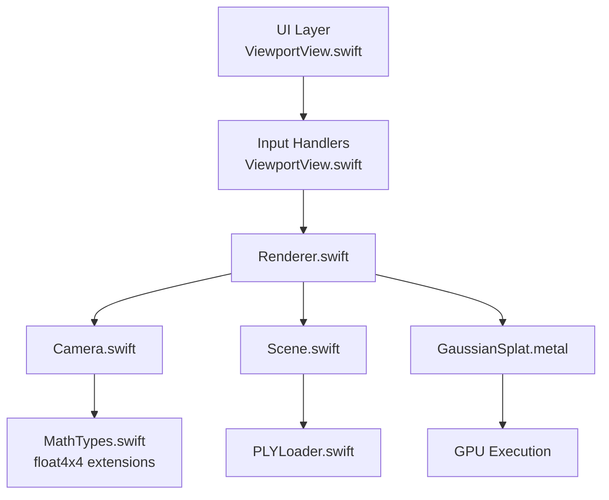
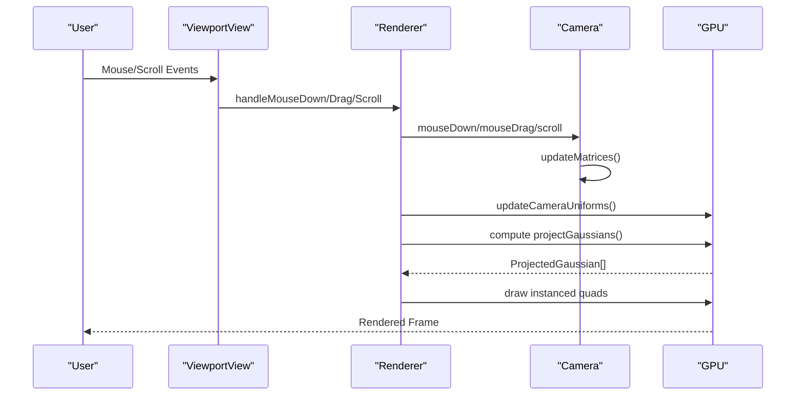
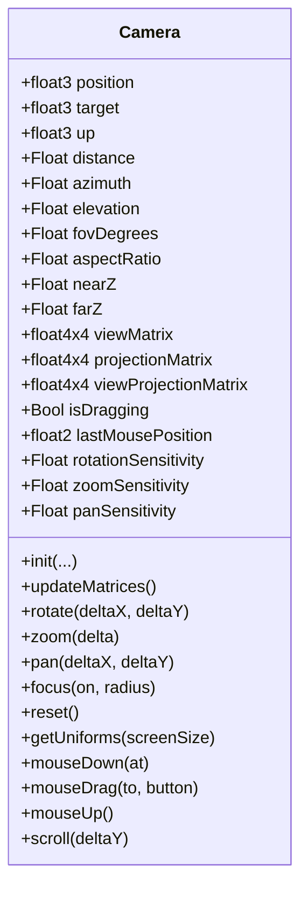
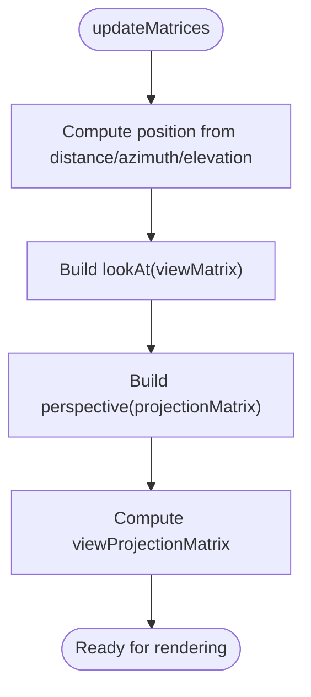
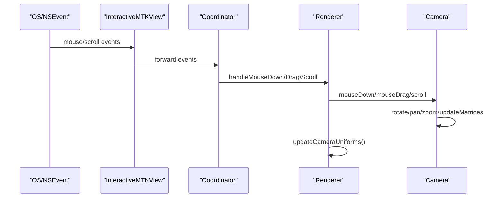
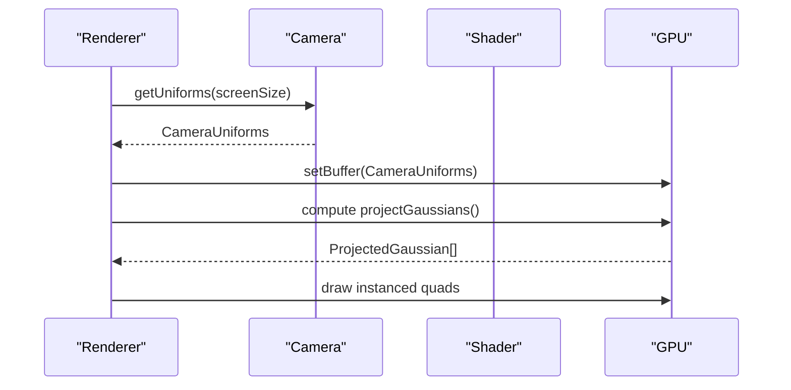
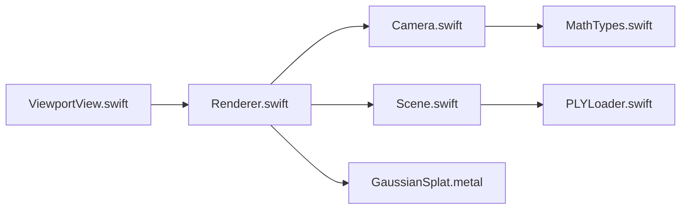

# Camera Component

<cite>
**Referenced Files in This Document**
- [Camera.swift](file://Rendering/Camera.swift)
- [MathTypes.swift](file://Math/MathTypes.swift)
- [Renderer.swift](file://Rendering/Renderer.swift)
- [ViewportView.swift](file://UI/ViewportView.swift)
- [GaussianSplat.metal](file://Shaders/GaussianSplat.metal)
- [Scene.swift](file://Scene/Scene.swift)
- [PLYLoader.swift](file://Scene/PLYLoader.swift)
</cite>

## Table of Contents
1. [Introduction](#introduction)
2. [Project Structure](#project-structure)
3. [Core Components](#core-components)
4. [Architecture Overview](#architecture-overview)
5. [Detailed Component Analysis](#detailed-component-analysis)
6. [Dependency Analysis](#dependency-analysis)
7. [Performance Considerations](#performance-considerations)
8. [Troubleshooting Guide](#troubleshooting-guide)
9. [Conclusion](#conclusion)

## Introduction
This document describes the Camera component that powers interactive 3D navigation in the Gaussian Splat Viewer. It explains the orbit camera system built on spherical coordinates, mouse input handling for rotation, panning, and zoom, and the mathematical foundations underpinning view/projection matrices and GPU uniform generation. It also covers camera state management, sensitivity controls, and how the camera integrates with the rendering pipeline to influence Gaussian splat projection and sorting.

## Project Structure
The Camera component lives in the Rendering module and interacts with UI input via the Viewport, the Renderer pipeline, and the GPU shaders. Supporting math utilities and GPU-compatible structures are defined in MathTypes. Scene and PLYLoader manage Gaussian splat data and GPU buffers.

**Diagram sources**
- [ViewportView.swift:1-185](file://UI/ViewportView.swift#L1-L185)
- [Renderer.swift:1-289](file://Rendering/Renderer.swift#L1-L289)
- [Camera.swift:1-184](file://Rendering/Camera.swift#L1-L184)
- [MathTypes.swift:1-189](file://Math/MathTypes.swift#L1-L189)
- [Scene.swift:1-158](file://Scene/Scene.swift#L1-L158)
- [PLYLoader.swift:1-403](file://Scene/PLYLoader.swift#L1-L403)
- [GaussianSplat.metal:1-317](file://Shaders/GaussianSplat.metal#L1-L317)

**Section sources**
- [ViewportView.swift:1-185](file://UI/ViewportView.swift#L1-L185)
- [Renderer.swift:1-289](file://Rendering/Renderer.swift#L1-L289)
- [Camera.swift:1-184](file://Rendering/Camera.swift#L1-L184)
- [MathTypes.swift:1-189](file://Math/MathTypes.swift#L1-L189)
- [Scene.swift:1-158](file://Scene/Scene.swift#L1-L158)
- [PLYLoader.swift:1-403](file://Scene/PLYLoader.swift#L1-L403)
- [GaussianSplat.metal:1-317](file://Shaders/GaussianSplat.metal#L1-L317)

## Core Components
- Camera: Implements orbit navigation with spherical coordinates, handles mouse input, computes view/projection/view-projection matrices, and generates GPU-compatible uniforms.
- MathTypes: Provides SIMD vector/matrix types, GPU uniform structures, and matrix/perspective/lookAt helpers used by Camera and shaders.
- Renderer: Integrates Camera with the Metal rendering pipeline, updates uniforms, drives compute and render passes, and manages scene/sorting.
- ViewportView: Bridges SwiftUI/MetalKit input events to Renderer, translating mouse and scroll actions into camera commands.
- Scene: Manages Gaussian splat data and GPU buffers, including sorting for depth blending.
- GaussianSplat.metal: GPU shaders that consume Camera uniforms to project Gaussians and render them efficiently.

**Section sources**
- [Camera.swift:1-184](file://Rendering/Camera.swift#L1-L184)
- [MathTypes.swift:1-189](file://Math/MathTypes.swift#L1-L189)
- [Renderer.swift:1-289](file://Rendering/Renderer.swift#L1-L289)
- [ViewportView.swift:1-185](file://UI/ViewportView.swift#L1-L185)
- [Scene.swift:1-158](file://Scene/Scene.swift#L1-L158)
- [GaussianSplat.metal:1-317](file://Shaders/GaussianSplat.metal#L1-L317)

## Architecture Overview
The camera is central to the rendering pipeline. It maintains position/target/up and derives view/projection matrices. These matrices are packaged into CameraUniforms and uploaded to GPU memory each frame. The compute shader projects each Gaussian using view/projection transforms and covariance, while the render pipeline draws instanced quads with alpha blending.

**Diagram sources**
- [ViewportView.swift:38-90](file://UI/ViewportView.swift#L38-L90)
- [Renderer.swift:269-288](file://Rendering/Renderer.swift#L269-L288)
- [Camera.swift:149-177](file://Rendering/Camera.swift#L149-L177)
- [Renderer.swift:253-260](file://Rendering/Renderer.swift#L253-L260)
- [GaussianSplat.metal:146-209](file://Shaders/GaussianSplat.metal#L146-L209)

## Detailed Component Analysis

### Camera: Orbit Navigation and Input Handling
- Spherical Coordinates: Distance, azimuth, and elevation define the camera’s position relative to the target. On initialization, position is converted to spherical coordinates.
- Position Updates: The position is recomputed from spherical coordinates each frame to keep target and orientation consistent.
- View/Projection Matrices: Look-at and perspective matrices are generated from current camera state. View-projection combines these for GPU use.
- Mouse Input:
  - Rotation: Left-drag adjusts azimuth/elevation with clamping to prevent gimbal lock.
  - Pan: Middle/right drag translates the target along camera right/up axes scaled by distance.
  - Zoom: Scroll scales distance with near/far bounds.
- Uniform Generation: Produces CameraUniforms containing view, projection, view-projection, camera position, screen size, and half-tangent FOV for GPU shaders.

**Diagram sources**
- [Camera.swift:4-184](file://Rendering/Camera.swift#L4-L184)

**Section sources**
- [Camera.swift:36-60](file://Rendering/Camera.swift#L36-L60)
- [Camera.swift:63-84](file://Rendering/Camera.swift#L63-L84)
- [Camera.swift:87-115](file://Rendering/Camera.swift#L87-L115)
- [Camera.swift:118-131](file://Rendering/Camera.swift#L118-L131)
- [Camera.swift:134-147](file://Rendering/Camera.swift#L134-L147)
- [Camera.swift:150-177](file://Rendering/Camera.swift#L150-L177)

### Mathematical Foundations
- Perspective Projection: Built from field-of-view (radians), aspect ratio, and near/far planes.
- Look-At View Matrix: Constructed from eye (position), center (target), and up vectors.
- Vector Accessors: Right/up/forward directions extracted from the view matrix for panning calculations.
- GPU Uniforms: CameraUniforms include matrices, camera position, screen size, and tan-half-FOV for shader computations.

**Diagram sources**
- [Camera.swift:63-84](file://Rendering/Camera.swift#L63-L84)
- [MathTypes.swift:107-131](file://Math/MathTypes.swift#L107-L131)

**Section sources**
- [MathTypes.swift:107-131](file://Math/MathTypes.swift#L107-L131)
- [MathTypes.swift:54-62](file://Math/MathTypes.swift#L54-L62)

### Input Integration and Event Flow
- ViewportView captures mouse and scroll events and forwards them to Renderer.
- Renderer delegates input to Camera, which updates internal state and matrices.
- Aspect ratio is updated when the view resizes, ensuring accurate projection.

**Diagram sources**
- [ViewportView.swift:102-139](file://UI/ViewportView.swift#L102-L139)
- [ViewportView.swift:38-90](file://UI/ViewportView.swift#L38-L90)
- [Renderer.swift:269-288](file://Rendering/Renderer.swift#L269-L288)
- [Camera.swift:149-177](file://Rendering/Camera.swift#L149-L177)

**Section sources**
- [ViewportView.swift:38-90](file://UI/ViewportView.swift#L38-L90)
- [Renderer.swift:162-165](file://Rendering/Renderer.swift#L162-L165)

### GPU Uniforms and Rendering Pipeline
- Uniform Buffer: CameraUniforms are triple-buffered and copied into GPU memory each frame.
- Compute Pass: projectGaussians reads CameraUniforms and transforms each Gaussian using view/projection matrices and covariance, writing ProjectedGaussian entries.
- Render Pass: Draws instanced quads with alpha blending enabled, using per-splat conic and color data.

**Diagram sources**
- [Renderer.swift:253-260](file://Rendering/Renderer.swift#L253-L260)
- [Camera.swift:134-147](file://Rendering/Camera.swift#L134-L147)
- [GaussianSplat.metal:146-209](file://Shaders/GaussianSplat.metal#L146-L209)

**Section sources**
- [Renderer.swift:129-143](file://Rendering/Renderer.swift#L129-L143)
- [Renderer.swift:253-260](file://Rendering/Renderer.swift#L253-L260)
- [GaussianSplat.metal:16-24](file://Shaders/GaussianSplat.metal#L16-L24)

### Camera State Management and Sensitivity
- Sensitivity Controls: rotationSensitivity, zoomSensitivity, panSensitivity govern responsiveness.
- Aspect Ratio Handling: Updated on drawable resize to maintain correct projection.
- Smoothness: Continuous updates to matrices and triple-buffered uniforms support smooth motion.

**Section sources**
- [Camera.swift:31-35](file://Rendering/Camera.swift#L31-L35)
- [Renderer.swift:162-165](file://Rendering/Renderer.swift#L162-L165)

### Examples

- Camera Initialization
  - Initialize with position, target, up, FOV, aspect ratio, and near/far planes. Spherical coordinates are derived from the initial position.
  - See [Camera.swift:36-60](file://Rendering/Camera.swift#L36-L60).

- Mouse Event Processing
  - Left drag rotates around the target; middle/right drag pans; scroll zooms.
  - See [ViewportView.swift:48-88](file://UI/ViewportView.swift#L48-L88) and [Camera.swift:150-177](file://Rendering/Camera.swift#L150-L177).

- Integration with Rendering Pipeline
  - Renderer updates camera uniforms each frame and drives compute and render passes.
  - See [Renderer.swift:253-260](file://Rendering/Renderer.swift#L253-L260) and [Renderer.swift:167-251](file://Rendering/Renderer.swift#L167-L251).

- Impact on Gaussian Projection
  - Camera uniforms feed the compute shader to transform positions and project covariance, affecting visibility and quality.
  - See [GaussianSplat.metal:146-209](file://Shaders/GaussianSplat.metal#L146-L209).

**Section sources**
- [Camera.swift:36-60](file://Rendering/Camera.swift#L36-L60)
- [ViewportView.swift:48-88](file://UI/ViewportView.swift#L48-L88)
- [Renderer.swift:253-260](file://Rendering/Renderer.swift#L253-L260)
- [Renderer.swift:167-251](file://Rendering/Renderer.swift#L167-L251)
- [GaussianSplat.metal:146-209](file://Shaders/GaussianSplat.metal#L146-L209)

## Dependency Analysis
- Camera depends on MathTypes for matrix utilities and GPU uniform structures.
- Renderer composes Camera, Scene, and Shaders, managing buffer lifecycles and pipeline states.
- ViewportView bridges UI input to Renderer.
- Scene provides Gaussian data and GPU buffers consumed by Renderer and shaders.

**Diagram sources**
- [Camera.swift:1-184](file://Rendering/Camera.swift#L1-L184)
- [MathTypes.swift:1-189](file://Math/MathTypes.swift#L1-L189)
- [Renderer.swift:1-289](file://Rendering/Renderer.swift#L1-L289)
- [ViewportView.swift:1-185](file://UI/ViewportView.swift#L1-L185)
- [Scene.swift:1-158](file://Scene/Scene.swift#L1-L158)
- [PLYLoader.swift:1-403](file://Scene/PLYLoader.swift#L1-L403)
- [GaussianSplat.metal:1-317](file://Shaders/GaussianSplat.metal#L1-L317)

**Section sources**
- [Camera.swift:1-184](file://Rendering/Camera.swift#L1-L184)
- [Renderer.swift:1-289](file://Rendering/Renderer.swift#L1-L289)
- [ViewportView.swift:1-185](file://UI/ViewportView.swift#L1-L185)
- [Scene.swift:1-158](file://Scene/Scene.swift#L1-L158)
- [PLYLoader.swift:1-403](file://Scene/PLYLoader.swift#L1-L403)
- [GaussianSplat.metal:1-317](file://Shaders/GaussianSplat.metal#L1-L317)

## Performance Considerations
- Triple-buffered CameraUniforms reduce CPU/GPU synchronization stalls.
- Depth sorting occurs periodically to balance quality and performance.
- Perspective and look-at matrices are computed per-frame; caching view/projection reduces redundant work.
- Panning scales with distance to maintain consistent feel across zoom levels.

[No sources needed since this section provides general guidance]

## Troubleshooting Guide
- Gimbal Lock Prevention: Elevation is clamped to avoid extreme angles.
- Bounds Checking: Distance is clamped between nearZ*2 and farZ/2 to prevent numerical issues.
- Input Mapping: Ensure mouse buttons are correctly mapped to rotation/pan/zoom actions.
- Aspect Ratio Changes: Verify aspect ratio updates on drawable size changes to avoid distortion.

**Section sources**
- [Camera.swift:91-102](file://Rendering/Camera.swift#L91-L102)
- [Renderer.swift:162-165](file://Rendering/Renderer.swift#L162-L165)
- [ViewportView.swift:48-88](file://UI/ViewportView.swift#L48-L88)

## Conclusion
The Camera component provides robust, responsive 3D navigation for the Gaussian Splat Viewer. Its orbit system, input handling, and matrix math integrate tightly with the Metal pipeline, enabling efficient projection and rendering of Gaussian splats. Proper sensitivity tuning and periodic depth sorting deliver a smooth, visually coherent experience.