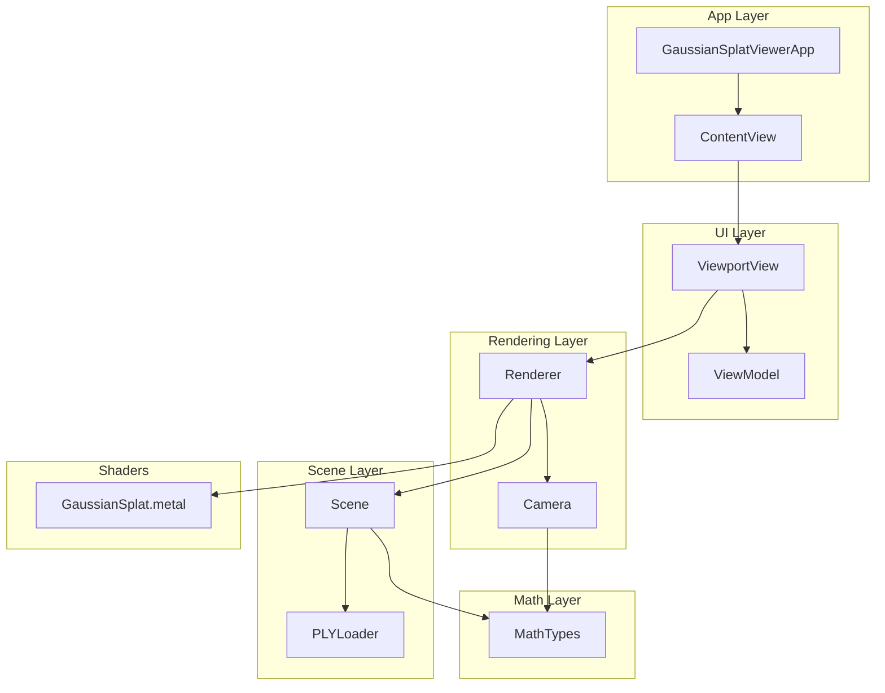
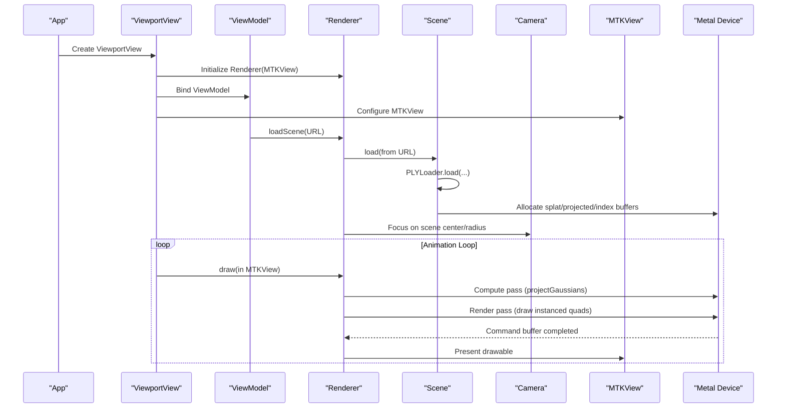
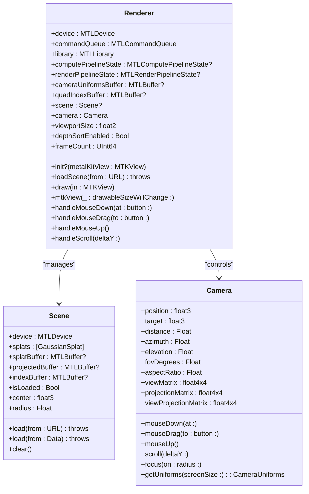
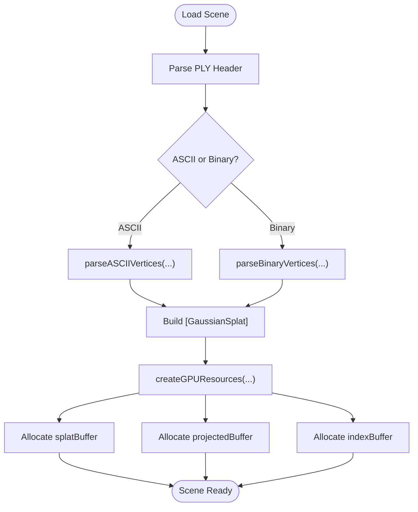
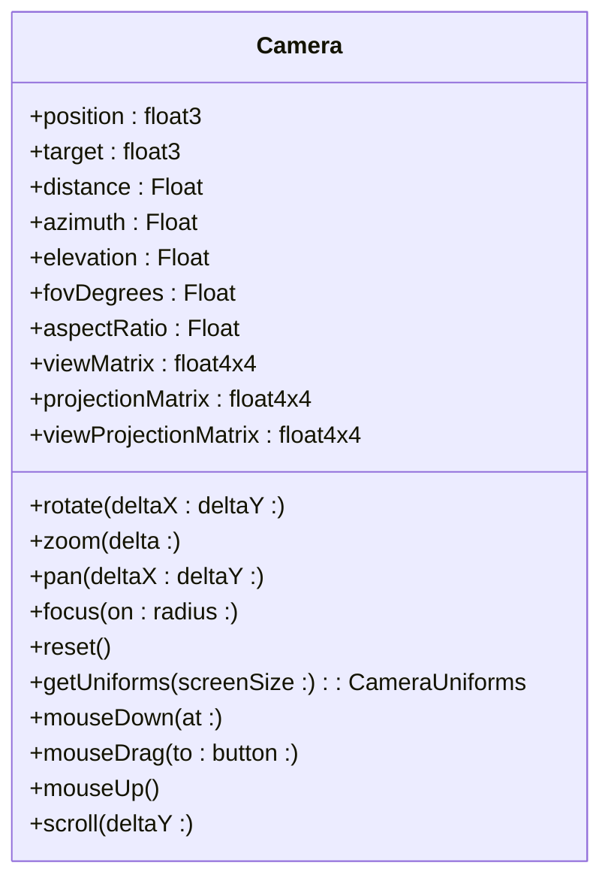
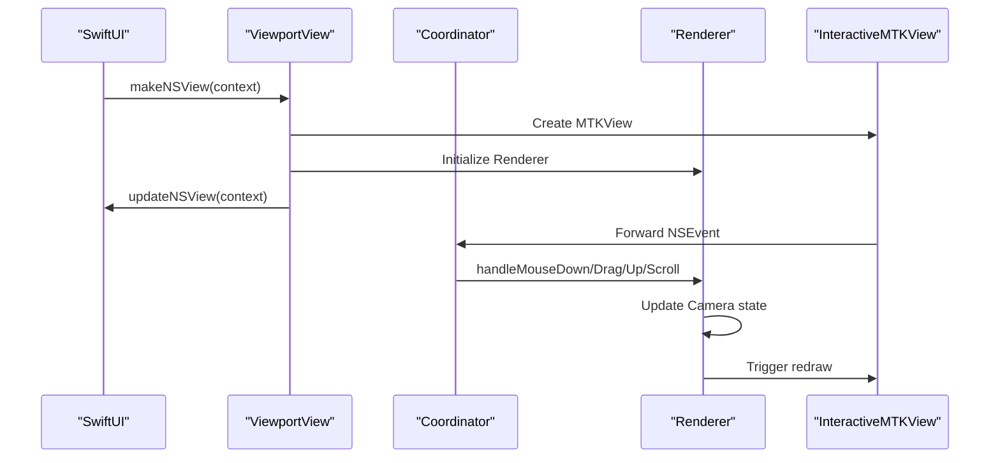
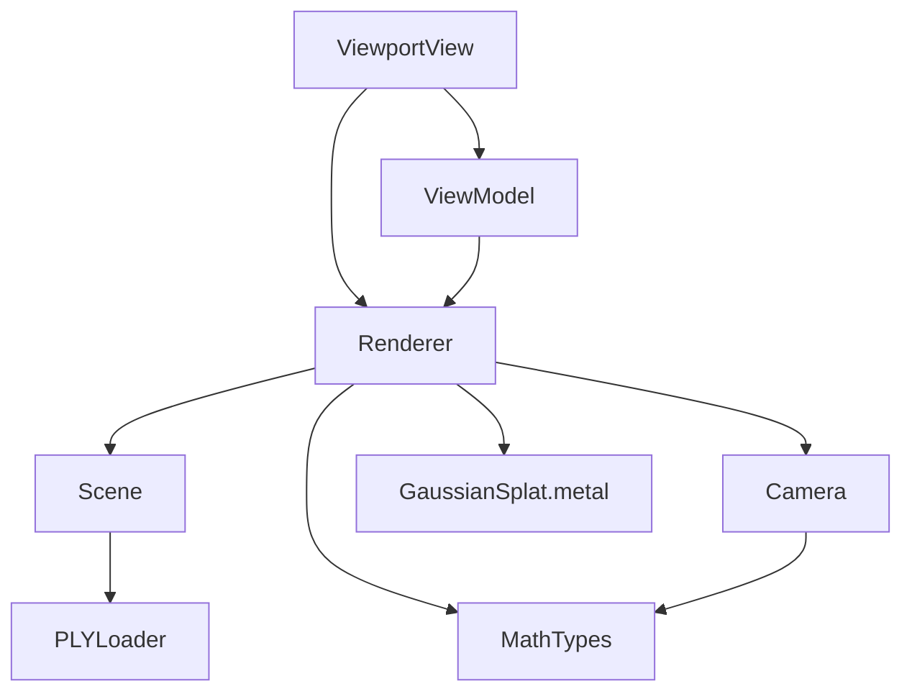

# Core Components

<cite>
**Referenced Files in This Document**
- [Renderer.swift](file://Rendering/Renderer.swift)
- [Scene.swift](file://Scene/Scene.swift)
- [Camera.swift](file://Rendering/Camera.swift)
- [ViewportView.swift](file://UI/ViewportView.swift)
- [PLYLoader.swift](file://Scene/PLYLoader.swift)
- [MathTypes.swift](file://Math/MathTypes.swift)
- [GaussianSplat.metal](file://Shaders/GaussianSplat.metal)
- [GaussianSplatViewerApp.swift](file://GaussianSplatViewerApp.swift)
- [ContentView.swift](file://GaussianSplatViewer/ContentView.swift)
</cite>

## Table of Contents
1. [Introduction](#introduction)
2. [Project Structure](#project-structure)
3. [Core Components](#core-components)
4. [Architecture Overview](#architecture-overview)
5. [Detailed Component Analysis](#detailed-component-analysis)
6. [Dependency Analysis](#dependency-analysis)
7. [Performance Considerations](#performance-considerations)
8. [Troubleshooting Guide](#troubleshooting-guide)
9. [Conclusion](#conclusion)

## Introduction
This document provides comprehensive documentation for the core components of the Gaussian Splat Viewer architecture. It focuses on four primary modules:
- Renderer: Central orchestrator managing Metal compute and render passes, GPU buffer management, and frame synchronization.
- Scene: Responsible for PLY file loading, data parsing, GPU buffer allocation, and scene state management.
- Camera: Implements interactive orbit navigation with spherical coordinates, mouse/keyboard controls, and matrix calculations.
- ViewportView: Bridges SwiftUI with Metal rendering, handling user input events, and managing the rendering surface.

The document covers component interactions, data flow, initialization sequences, lifecycle management, public interfaces, dependency injection patterns, and extension points.

## Project Structure
The project follows a modular layout:
- Rendering: Contains Renderer and Camera implementations.
- Scene: Contains Scene and PLYLoader implementations.
- UI: Contains ViewportView and supporting SwiftUI integration.
- Math: Defines shared mathematical types and GPU-compatible structures.
- Shaders: Contains the Metal shader program used for projection and rendering.
- App entry points: GaussianSplatViewerApp and a placeholder ContentView.

**Diagram sources**
- [GaussianSplatViewerApp.swift:1-13](file://GaussianSplatViewerApp.swift#L1-L13)
- [ContentView.swift:10-25](file://GaussianSplatViewer/ContentView.swift#L10-L25)
- [ViewportView.swift:6-90](file://UI/ViewportView.swift#L6-L90)
- [Renderer.swift:7-77](file://Rendering/Renderer.swift#L7-L77)
- [Scene.swift:6-28](file://Scene/Scene.swift#L6-L28)
- [PLYLoader.swift:13-68](file://Scene/PLYLoader.swift#L13-L68)
- [MathTypes.swift:4-189](file://Math/MathTypes.swift#L4-L189)
- [GaussianSplat.metal:1-309](file://Shaders/GaussianSplat.metal#L1-L309)

**Section sources**
- [GaussianSplatViewerApp.swift:1-13](file://GaussianSplatViewerApp.swift#L1-L13)
- [ContentView.swift:10-25](file://GaussianSplatViewer/ContentView.swift#L10-L25)
- [ViewportView.swift:6-90](file://UI/ViewportView.swift#L6-L90)
- [Renderer.swift:7-77](file://Rendering/Renderer.swift#L7-L77)
- [Scene.swift:6-28](file://Scene/Scene.swift#L6-L28)
- [PLYLoader.swift:13-68](file://Scene/PLYLoader.swift#L13-L68)
- [MathTypes.swift:4-189](file://Math/MathTypes.swift#L4-L189)
- [GaussianSplat.metal:1-309](file://Shaders/GaussianSplat.metal#L1-L309)

## Core Components
This section documents the primary components and their responsibilities.

- Renderer
  - Central orchestrator for Metal compute and render passes.
  - Manages GPU buffers, pipeline states, and frame synchronization.
  - Handles camera updates and delegates user input to Camera.
  - Coordinates scene loading and rendering lifecycle.

- Scene
  - Loads Gaussian splats from PLY files via PLYLoader.
  - Allocates GPU buffers for splat data, projected data, and indices.
  - Maintains scene state and provides bounding box computations.

- Camera
  - Implements orbit navigation using spherical coordinates.
  - Provides matrix calculations for view and projection.
  - Handles mouse and scroll interactions for rotation, pan, and zoom.

- ViewportView
  - SwiftUI wrapper around MTKView for Metal rendering.
  - Bridges user input events to Renderer.
  - Manages the rendering surface and input handler coordination.

**Section sources**
- [Renderer.swift:7-77](file://Rendering/Renderer.swift#L7-L77)
- [Scene.swift:6-28](file://Scene/Scene.swift#L6-L28)
- [Camera.swift:5-60](file://Rendering/Camera.swift#L5-L60)
- [ViewportView.swift:6-90](file://UI/ViewportView.swift#L6-L90)

## Architecture Overview
The system architecture centers on Renderer as the orchestrator. Renderer initializes Metal device, command queue, and pipelines, then manages scene loading and rendering. Scene handles data ingestion and GPU resource allocation. Camera provides navigation and matrix computations. ViewportView integrates SwiftUI with Metal and routes input events to Renderer.

**Diagram sources**
- [ViewportView.swift:18-36](file://UI/ViewportView.swift#L18-L36)
- [Renderer.swift:147-157](file://Rendering/Renderer.swift#L147-L157)
- [Scene.swift:31-55](file://Scene/Scene.swift#L31-L55)
- [Renderer.swift:166-250](file://Rendering/Renderer.swift#L166-L250)

**Section sources**
- [ViewportView.swift:18-36](file://UI/ViewportView.swift#L18-L36)
- [Renderer.swift:147-157](file://Rendering/Renderer.swift#L147-L157)
- [Scene.swift:31-55](file://Scene/Scene.swift#L31-L55)
- [Renderer.swift:166-250](file://Rendering/Renderer.swift#L166-L250)

## Detailed Component Analysis

### Renderer
Renderer is the central orchestrator managing Metal compute and render passes, GPU buffer management, and frame synchronization. It initializes the Metal device, creates pipelines, allocates buffers, and coordinates scene loading and rendering.

Key responsibilities:
- Metal initialization: Creates device, command queue, and loads Metal library.
- Pipeline creation: Builds compute and render pipeline states from shaders.
- Buffer management: Allocates camera uniforms, quad indices, and triple-buffered uniform slots.
- Scene integration: Loads scenes from URLs and focuses camera on loaded geometry.
- Frame orchestration: Updates camera uniforms, dispatches compute pass, performs optional depth sorting, and executes render pass.
- Input delegation: Delegates mouse and scroll events to Camera.

Initialization sequence:
- Renderer.init?(metalKitView:) sets up device, command queue, and MTKView properties.
- createComputePipeline() and createRenderPipeline() compile shader functions.
- createBuffers() allocates camera uniforms and quad index buffers.
- Scene(device:) initializes GPU buffers for splats.

Public interfaces:
- loadScene(from: URL) throws: Loads PLY data and focuses camera.
- handleMouseDown(at:button:), handleMouseDrag(to:button:), handleMouseUp(), handleScroll(deltaY:): Delegate input to Camera.

Lifecycle management:
- draw(in:) manages the complete frame lifecycle: compute, optional sort, render, present, and completion handling.
- mtkView(_:drawableSizeWillChange:) updates viewport and aspect ratio.

Extension points:
- Depth sorting: depthSortEnabled flag and sortInterval control periodic sorting.
- Triple buffering: cameraUniformStride enables CPU/GPU synchronization across frames.

**Diagram sources**
- [Renderer.swift:7-77](file://Rendering/Renderer.swift#L7-L77)
- [Scene.swift:6-28](file://Scene/Scene.swift#L6-L28)
- [Camera.swift:5-60](file://Rendering/Camera.swift#L5-L60)

**Section sources**
- [Renderer.swift:7-77](file://Rendering/Renderer.swift#L7-L77)
- [Renderer.swift:147-157](file://Rendering/Renderer.swift#L147-L157)
- [Renderer.swift:166-250](file://Rendering/Renderer.swift#L166-L250)
- [Renderer.swift:270-287](file://Rendering/Renderer.swift#L270-L287)

### Scene
Scene manages Gaussian splat collections and GPU resources. It loads data from PLY files via PLYLoader and allocates GPU buffers for splat data, projected data, and indices.

Key responsibilities:
- Data loading: Uses PLYLoader to parse ASCII and binary PLY formats.
- GPU buffer allocation: Creates buffers for splat data, projected data, and index arrays.
- Scene state: Tracks splat count, loaded state, and computes bounding box and radius.
- Resource cleanup: Clears buffers and resets state.

Initialization and loading:
- load(from: URL) throws parses PLY and creates GPU resources.
- load(from: Data) throws supports loading from raw data.
- createGPUResources(for:) allocates buffers and stores references.

Public interfaces:
- load(from: URL) throws, load(from: Data) throws: Load PLY data.
- clear(): Clear all data and buffers.
- boundingBox(): Compute min/max bounds.
- center: float3, radius: Float: Scene metrics.

**Diagram sources**
- [PLYLoader.swift:42-68](file://Scene/PLYLoader.swift#L42-L68)
- [PLYLoader.swift:162-204](file://Scene/PLYLoader.swift#L162-L204)
- [PLYLoader.swift:208-317](file://Scene/PLYLoader.swift#L208-L317)
- [Scene.swift:58-95](file://Scene/Scene.swift#L58-L95)

**Section sources**
- [Scene.swift:31-55](file://Scene/Scene.swift#L31-L55)
- [Scene.swift:58-95](file://Scene/Scene.swift#L58-L95)
- [Scene.swift:105-133](file://Scene/Scene.swift#L105-L133)
- [PLYLoader.swift:42-68](file://Scene/PLYLoader.swift#L42-L68)
- [PLYLoader.swift:162-204](file://Scene/PLYLoader.swift#L162-L204)
- [PLYLoader.swift:208-317](file://Scene/PLYLoader.swift#L208-L317)

### Camera
Camera implements interactive orbit navigation using spherical coordinates. It calculates view and projection matrices and handles mouse and scroll interactions.

Key responsibilities:
- Spherical coordinate system: Stores distance, azimuth, and elevation.
- Matrix computation: Updates view, projection, and combined matrices.
- Navigation: Supports rotation, pan, zoom, focus, and reset.
- Input handling: Processes mouse and scroll events to update camera state.

Navigation logic:
- rotate(deltaX: deltaY:): Adjusts azimuth and elevation with gimbal lock prevention.
- pan(deltaX: deltaY:): Moves target along view axes scaled by distance.
- zoom(delta:): Changes distance with near/far limits.
- focus(on:radius:): Positions camera to frame a target object.

Public interfaces:
- mouseDown(at:), mouseDrag(to:button:), mouseUp(), scroll(deltaY:): Input handlers.
- getUniforms(screenSize:): Produces CameraUniforms for GPU.
- reset(): Restore default camera position.

**Diagram sources**
- [Camera.swift:5-60](file://Rendering/Camera.swift#L5-L60)
- [Camera.swift:87-115](file://Rendering/Camera.swift#L87-L115)
- [Camera.swift:149-176](file://Rendering/Camera.swift#L149-L176)

**Section sources**
- [Camera.swift:5-60](file://Rendering/Camera.swift#L5-L60)
- [Camera.swift:87-115](file://Rendering/Camera.swift#L87-L115)
- [Camera.swift:134-147](file://Rendering/Camera.swift#L134-L147)
- [Camera.swift:149-176](file://Rendering/Camera.swift#L149-L176)

### ViewportView
ViewportView bridges SwiftUI with Metal rendering. It wraps MTKView, manages input handlers, and coordinates with Renderer and ViewModel.

Key responsibilities:
- SwiftUI integration: NSViewRepresentable implementation for MTKView.
- Input routing: Converts NSEvent to Renderer actions.
- Renderer lifecycle: Creates and injects Renderer into ViewModel.
- Interactive MTKView: Subclasses MTKView to forward input events.

Input handling:
- Coordinator implements ViewportInputHandling to route mouse and scroll events.
- InteractiveMTKView forwards NSEvents to the coordinator.

Public interfaces:
- makeNSView(context:): Creates and configures MTKView.
- updateNSView(_:context:): Updates input handler binding.
- makeCoordinator(): Creates Coordinator instance.

**Diagram sources**
- [ViewportView.swift:9-36](file://UI/ViewportView.swift#L9-L36)
- [ViewportView.swift:38-89](file://UI/ViewportView.swift#L38-L89)
- [ViewportView.swift:102-139](file://UI/ViewportView.swift#L102-L139)

**Section sources**
- [ViewportView.swift:9-36](file://UI/ViewportView.swift#L9-L36)
- [ViewportView.swift:38-89](file://UI/ViewportView.swift#L38-L89)
- [ViewportView.swift:102-139](file://UI/ViewportView.swift#L102-L139)

## Dependency Analysis
This section analyzes dependencies between components and their relationships.

**Diagram sources**
- [Renderer.swift:22-25](file://Rendering/Renderer.swift#L22-L25)
- [Scene.swift:10-15](file://Scene/Scene.swift#L10-L15)
- [PLYLoader.swift:13-68](file://Scene/PLYLoader.swift#L13-L68)
- [MathTypes.swift:4-189](file://Math/MathTypes.swift#L4-L189)
- [GaussianSplat.metal:1-309](file://Shaders/GaussianSplat.metal#L1-L309)
- [ViewportView.swift:18-21](file://UI/ViewportView.swift#L18-L21)
- [ViewportView.swift:149-184](file://UI/ViewportView.swift#L149-L184)

**Section sources**
- [Renderer.swift:22-25](file://Rendering/Renderer.swift#L22-L25)
- [Scene.swift:10-15](file://Scene/Scene.swift#L10-L15)
- [PLYLoader.swift:13-68](file://Scene/PLYLoader.swift#L13-L68)
- [MathTypes.swift:4-189](file://Math/MathTypes.swift#L4-L189)
- [GaussianSplat.metal:1-309](file://Shaders/GaussianSplat.metal#L1-L309)
- [ViewportView.swift:18-21](file://UI/ViewportView.swift#L18-L21)
- [ViewportView.swift:149-184](file://UI/ViewportView.swift#L149-L184)

## Performance Considerations
- Triple-buffered camera uniforms: Reduces CPU/GPU synchronization overhead by staggering uniform updates across frames.
- Compute dispatch sizing: Uses thread group size of 256 and computes thread groups based on splat count for efficient GPU utilization.
- Depth sorting: Implemented as a placeholder with configurable interval; future implementation should leverage bitonic sort kernel in shaders.
- Buffer allocation: Private storage mode for GPU buffers minimizes memory bandwidth pressure.
- Alpha blending: Enables additive blending for correct compositing of overlapping splats.

[No sources needed since this section provides general guidance]

## Troubleshooting Guide
Common issues and resolutions:
- Metal library loading failures: Verify shader compilation and function availability in GaussianSplat.metal.
- Buffer creation errors: Ensure device supports requested buffer sizes and storage modes.
- PLY parsing errors: Confirm PLY header format and required properties (position, scale, rotation, color).
- No splats loaded: Check that PLYLoader successfully parsed vertices and that Scene.isLoaded reflects loaded state.
- Input not responding: Confirm InteractiveMTKView accepts first responder and Coordinator is bound to MTKView.

**Section sources**
- [Renderer.swift:47-53](file://Rendering/Renderer.swift#L47-L53)
- [Scene.swift:68-85](file://Scene/Scene.swift#L68-L85)
- [PLYLoader.swift:72-158](file://Scene/PLYLoader.swift#L72-L158)
- [ViewportView.swift:107-110](file://UI/ViewportView.swift#L107-L110)

## Conclusion
The Gaussian Splat Viewer architecture demonstrates a clean separation of concerns with Renderer as the central orchestrator, Scene managing data and GPU resources, Camera providing navigation, and ViewportView bridging SwiftUI with Metal. The system leverages Metal compute for efficient projection, maintains robust input handling, and provides extension points for future enhancements such as depth sorting and advanced rendering techniques.