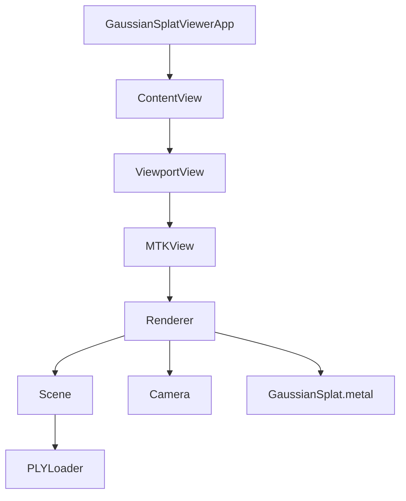
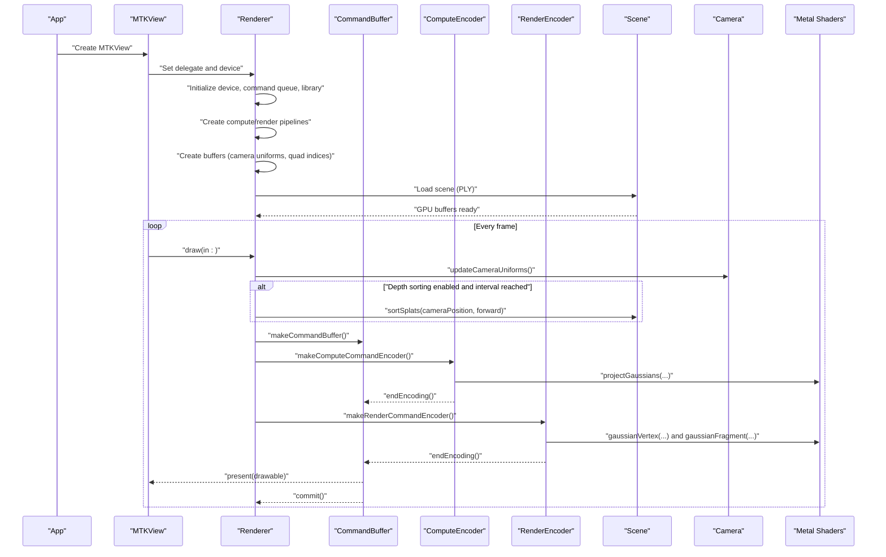
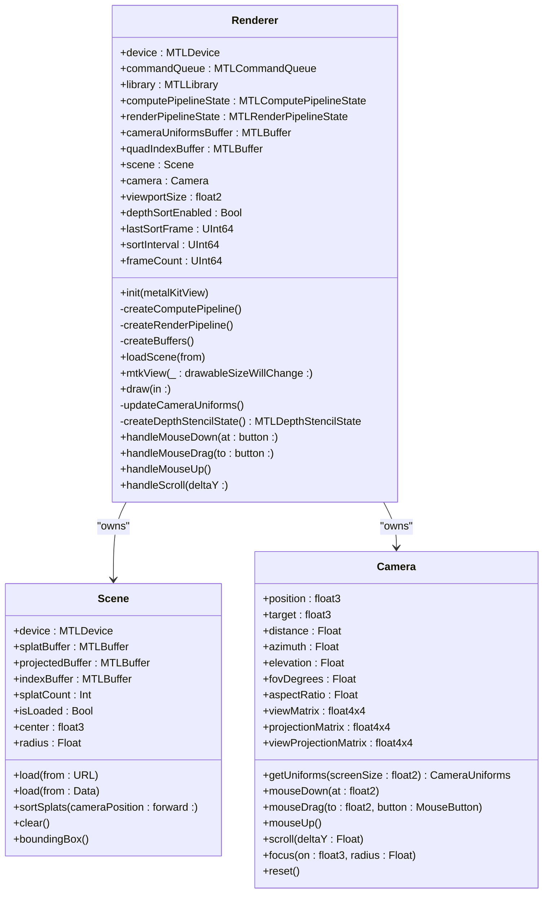
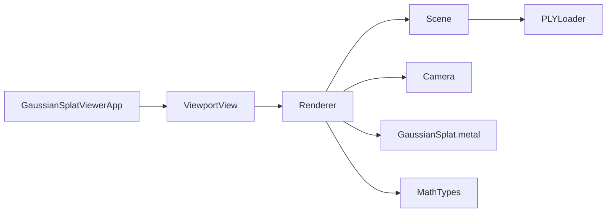

# Renderer Component

<cite>
**Referenced Files in This Document**
- [Renderer.swift](file://Rendering/Renderer.swift)
- [GaussianSplat.metal](file://Shaders/GaussianSplat.metal)
- [ViewportView.swift](file://UI/ViewportView.swift)
- [MathTypes.swift](file://Math/MathTypes.swift)
- [Scene.swift](file://Scene/Scene.swift)
- [Camera.swift](file://Rendering/Camera.swift)
- [PLYLoader.swift](file://Scene/PLYLoader.swift)
- [ContentView.swift](file://UI/ContentView.swift)
- [GaussianSplatViewerApp.swift](file://GaussianSplatViewerApp.swift)
</cite>

## Table of Contents
1. [Introduction](#introduction)
2. [Project Structure](#project-structure)
3. [Core Components](#core-components)
4. [Architecture Overview](#architecture-overview)
5. [Detailed Component Analysis](#detailed-component-analysis)
6. [Dependency Analysis](#dependency-analysis)
7. [Performance Considerations](#performance-considerations)
8. [Troubleshooting Guide](#troubleshooting-guide)
9. [Conclusion](#conclusion)

## Introduction
This document provides comprehensive documentation for the Renderer component, the central orchestrator of the Gaussian Splat Viewer’s rendering system. It explains how the Renderer integrates Metal compute and render passes to project 3D Gaussian splats into screen-space quads, manage GPU buffers and frame synchronization, and drive the three-stage rendering pipeline. It also covers initialization, device setup, command queue management, camera integration, viewport handling, and performance optimizations such as frame-skipping for depth sorting.

## Project Structure
The Renderer lives in the Rendering module and collaborates with:
- UI layer (ViewportView and ContentView) for Metal view hosting and user input
- Scene for GPU buffer management and scene data
- Camera for view/projection matrices and user-driven transformations
- MathTypes for GPU-compatible data structures
- Shaders for compute and render stages

**Diagram sources**
- [GaussianSplatViewerApp.swift:1-13](file://GaussianSplatViewerApp.swift#L1-L13)
- [ContentView.swift:1-130](file://UI/ContentView.swift#L1-L130)
- [ViewportView.swift:1-185](file://UI/ViewportView.swift#L1-L185)
- [Renderer.swift:1-289](file://Rendering/Renderer.swift#L1-L289)
- [Scene.swift:1-158](file://Scene/Scene.swift#L1-L158)
- [Camera.swift:1-184](file://Rendering/Camera.swift#L1-L184)
- [GaussianSplat.metal:1-317](file://Shaders/GaussianSplat.metal#L1-L317)
- [PLYLoader.swift:1-403](file://Scene/PLYLoader.swift#L1-L403)

**Section sources**
- [Renderer.swift:1-289](file://Rendering/Renderer.swift#L1-L289)
- [ViewportView.swift:1-185](file://UI/ViewportView.swift#L1-L185)
- [ContentView.swift:1-130](file://UI/ContentView.swift#L1-L130)

## Core Components
- Renderer: Implements MTKViewDelegate, manages Metal device, command queue, pipelines, buffers, camera uniforms, and the complete rendering pipeline.
- Scene: Owns GPU buffers for splat data, projected data, and indices; loads PLY data and updates CPU-side splats.
- Camera: Maintains view/projection matrices and exposes GPU uniforms.
- MathTypes: Defines GPU-compatible structures (CameraUniforms, GaussianGPUData, ProjectedGaussian).
- GaussianSplat.metal: Contains compute shader (projectGaussians), vertex shader (gaussianVertex), fragment shader (gaussianFragment), and a sorting kernel (bitonicSort).
- ViewportView: Wraps MTKView and wires input events to Renderer.

**Section sources**
- [Renderer.swift:6-289](file://Rendering/Renderer.swift#L6-L289)
- [Scene.swift:5-158](file://Scene/Scene.swift#L5-L158)
- [Camera.swift:4-184](file://Rendering/Camera.swift#L4-L184)
- [MathTypes.swift:32-73](file://Math/MathTypes.swift#L32-L73)
- [GaussianSplat.metal:146-317](file://Shaders/GaussianSplat.metal#L146-L317)
- [ViewportView.swift:5-90](file://UI/ViewportView.swift#L5-L90)

## Architecture Overview
The Renderer is the MTKViewDelegate that drives a three-stage pipeline each frame:
1. Compute pass: projectGaussians computes per-splat 2D covariance, conic parameters, radius, and depth.
2. Optional depth sorting: CPU sorts splats back-to-front for correct alpha blending.
3. Render pass: Instanced draw of screen-space quads using gaussianVertex and gaussianFragment.

**Diagram sources**
- [Renderer.swift:167-251](file://Rendering/Renderer.swift#L167-L251)
- [GaussianSplat.metal:146-278](file://Shaders/GaussianSplat.metal#L146-L278)
- [Scene.swift:105-121](file://Scene/Scene.swift#L105-L121)
- [Camera.swift:133-147](file://Rendering/Camera.swift#L133-L147)

## Detailed Component Analysis

### Renderer: MTKViewDelegate and Pipeline Orchestration
- Device and command queue setup: Creates system default device and command queue; sets MTKView properties and clears color.
- Pipeline creation:
  - Compute pipeline: projectGaussians function from the Metal library.
  - Render pipeline: gaussianVertex and gaussianFragment functions; enables alpha blending and disables depth writes.
- Buffer management:
  - Triple-buffered camera uniforms: stride-aligned shared buffer sized for three frames.
  - Quad index buffer for instanced triangle drawing.
- Frame synchronization: Uses frameCount modulo 3 to select the correct uniform buffer slice.
- Three-stage pipeline:
  - Compute pass: dispatches based on splat count with 256-wide thread groups.
  - Optional depth sorting: CPU sorts splats back-to-front every N frames.
  - Render pass: draws instanced triangles using projected data and camera uniforms.
- Error handling: Adds a completed handler to capture Metal command buffer errors.

Key implementation references:
- Initialization and MTKView setup: [Renderer.swift:38-77](file://Rendering/Renderer.swift#L38-L77)
- Pipeline creation: [Renderer.swift:81-127](file://Rendering/Renderer.swift#L81-L127)
- Buffer creation: [Renderer.swift:129-143](file://Rendering/Renderer.swift#L129-L143)
- Frame scheduling and draw loop: [Renderer.swift:167-251](file://Rendering/Renderer.swift#L167-L251)
- Camera uniforms update: [Renderer.swift:253-260](file://Rendering/Renderer.swift#L253-L260)
- Depth stencil state: [Renderer.swift:262-267](file://Rendering/Renderer.swift#L262-L267)

**Section sources**
- [Renderer.swift:38-77](file://Rendering/Renderer.swift#L38-L77)
- [Renderer.swift:81-127](file://Rendering/Renderer.swift#L81-L127)
- [Renderer.swift:129-143](file://Rendering/Renderer.swift#L129-L143)
- [Renderer.swift:167-251](file://Rendering/Renderer.swift#L167-L251)
- [Renderer.swift:253-267](file://Rendering/Renderer.swift#L253-L267)

#### Renderer Class Diagram

**Diagram sources**
- [Renderer.swift:6-289](file://Rendering/Renderer.swift#L6-L289)
- [Scene.swift:5-158](file://Scene/Scene.swift#L5-L158)
- [Camera.swift:4-184](file://Rendering/Camera.swift#L4-L184)

### Metal Pipeline Creation
- Compute pipeline:
  - Function name: projectGaussians
  - Inputs: splat buffer (GaussianGPUData), output buffer (ProjectedGaussian), camera uniforms, splat count
  - Dispatch: thread group size 256, thread groups computed from splat count
- Render pipeline:
  - Vertex function: gaussianVertex
  - Fragment function: gaussianFragment
  - Color attachment: BGRA8 sRGB, blending enabled (premultiplied alpha)
  - Depth attachment: 32-bit float, depth compare always, depth write disabled

References:
- Compute pipeline creation: [Renderer.swift:81-93](file://Rendering/Renderer.swift#L81-L93)
- Render pipeline creation: [Renderer.swift:95-127](file://Rendering/Renderer.swift#L95-L127)
- Compute shader: [GaussianSplat.metal:146-209](file://Shaders/GaussianSplat.metal#L146-L209)
- Vertex shader: [GaussianSplat.metal:213-249](file://Shaders/GaussianSplat.metal#L213-L249)
- Fragment shader: [GaussianSplat.metal:253-278](file://Shaders/GaussianSplat.metal#L253-L278)

**Section sources**
- [Renderer.swift:81-127](file://Rendering/Renderer.swift#L81-L127)
- [GaussianSplat.metal:146-278](file://Shaders/GaussianSplat.metal#L146-L278)

### GPU Buffer Management and Frame Synchronization
- Triple-buffered camera uniforms:
  - Stride alignment ensures coherency across frames
  - Offset selection via frameCount % 3 rotates among three slices
- Instanced quad rendering:
  - Quad index buffer defines two triangles per instance
  - Instance count equals splat count
- Frame synchronization:
  - Uniform updates occur before compute pass
  - Command buffer completion handler logs errors

References:
- Buffer creation: [Renderer.swift:129-143](file://Rendering/Renderer.swift#L129-L143)
- Uniform update: [Renderer.swift:253-260](file://Rendering/Renderer.swift#L253-L260)
- Instanced draw: [Renderer.swift:231-239](file://Rendering/Renderer.swift#L231-L239)

**Section sources**
- [Renderer.swift:129-143](file://Rendering/Renderer.swift#L129-L143)
- [Renderer.swift:253-260](file://Rendering/Renderer.swift#L253-L260)
- [Renderer.swift:231-239](file://Rendering/Renderer.swift#L231-L239)

### Three-Stage Rendering Pipeline
1. Compute pass (projectGaussians):
   - Reads GaussianGPUData, writes ProjectedGaussian
   - Computes 3D covariance, projects to 2D, builds conic, computes radius, stores depth and UV
2. Optional depth sorting:
   - CPU sorts splats back-to-front every N frames to minimize overdraw and improve blending
3. Render pass:
   - gaussianVertex generates quad vertices in clip space using projected data and camera uniforms
   - gaussianFragment evaluates 2D Gaussian, applies opacity, and returns premultiplied alpha

References:
- Compute pass dispatch: [Renderer.swift:194-218](file://Rendering/Renderer.swift#L194-L218)
- Sorting trigger: [Renderer.swift:187-191](file://Rendering/Renderer.swift#L187-L191)
- Render pass draw: [Renderer.swift:221-242](file://Rendering/Renderer.swift#L221-L242)
- Sorting kernel: [GaussianSplat.metal:282-316](file://Shaders/GaussianSplat.metal#L282-L316)

**Section sources**
- [Renderer.swift:187-242](file://Rendering/Renderer.swift#L187-L242)
- [GaussianSplat.metal:282-316](file://Shaders/GaussianSplat.metal#L282-L316)

### Initialization Sequence, Device Setup, and Error Handling
- Device and queue: Created early; MTKView configured with device, delegate, pixel formats, and clear color.
- Library loading: Attempts to load default Metal library from the app bundle.
- Pipeline creation: Ensures shader functions exist before building pipeline states.
- Error handling: Logs failures during library load, pipeline creation, and command buffer execution.

References:
- Initialization: [Renderer.swift:38-77](file://Rendering/Renderer.swift#L38-L77)
- Library load: [Renderer.swift:47-53](file://Rendering/Renderer.swift#L47-L53)
- Pipeline creation: [Renderer.swift:81-127](file://Rendering/Renderer.swift#L81-L127)
- Command buffer error handling: [Renderer.swift:244-248](file://Rendering/Renderer.swift#L244-L248)

**Section sources**
- [Renderer.swift:38-77](file://Rendering/Renderer.swift#L38-L77)
- [Renderer.swift:47-53](file://Rendering/Renderer.swift#L47-L53)
- [Renderer.swift:81-127](file://Rendering/Renderer.swift#L81-L127)
- [Renderer.swift:244-248](file://Rendering/Renderer.swift#L244-L248)

### Camera Integration and Viewport Handling
- Camera initialization: Sets up position, target, FOV, and aspect ratio based on MTKView drawable size.
- Viewport change: Updates viewportSize and camera aspect ratio when the view resizes.
- Uniforms: Camera uniforms include view/projection matrices, camera position, screen size, and tangent of half FOV.

References:
- Camera setup: [Renderer.swift:55-60](file://Rendering/Renderer.swift#L55-L60)
- Viewport resize: [Renderer.swift:162-165](file://Rendering/Renderer.swift#L162-L165)
- Uniforms: [Camera.swift:133-147](file://Rendering/Camera.swift#L133-L147)

**Section sources**
- [Renderer.swift:55-60](file://Rendering/Renderer.swift#L55-L60)
- [Renderer.swift:162-165](file://Rendering/Renderer.swift#L162-L165)
- [Camera.swift:133-147](file://Rendering/Camera.swift#L133-L147)

### Scene Integration and Data Flow
- Scene holds GPU buffers for splat data, projected data, and indices.
- Scene loads PLY data via PLYLoader and creates GPU buffers.
- Renderer triggers CPU-side sorting and updates splat buffer with sorted order.

References:
- Scene creation and buffers: [Scene.swift:57-95](file://Scene/Scene.swift#L57-L95)
- Scene sorting: [Scene.swift:105-121](file://Scene/Scene.swift#L105-L121)
- PLY loading: [PLYLoader.swift:41-68](file://Scene/PLYLoader.swift#L41-L68)

**Section sources**
- [Scene.swift:57-95](file://Scene/Scene.swift#L57-L95)
- [Scene.swift:105-121](file://Scene/Scene.swift#L105-L121)
- [PLYLoader.swift:41-68](file://Scene/PLYLoader.swift#L41-L68)

### UI Integration and Input Handling
- ViewportView wraps MTKView, sets up input handlers, and instantiates Renderer.
- Input events (mouse, drag, scroll) are forwarded to Renderer to update Camera state.
- ContentView provides UI controls and overlays for loading and instructions.

References:
- ViewportView and input wiring: [ViewportView.swift:9-90](file://UI/ViewportView.swift#L9-L90)
- Input forwarding: [ViewportView.swift:48-88](file://UI/ViewportView.swift#L48-L88)
- UI overlays: [ContentView.swift:8-124](file://UI/ContentView.swift#L8-L124)

**Section sources**
- [ViewportView.swift:9-90](file://UI/ViewportView.swift#L9-L90)
- [ViewportView.swift:48-88](file://UI/ViewportView.swift#L48-L88)
- [ContentView.swift:8-124](file://UI/ContentView.swift#L8-L124)

## Dependency Analysis
Renderer depends on:
- Metal device and libraries for compute and render pipelines
- Scene for GPU buffers and splat data
- Camera for matrices and uniforms
- MathTypes for GPU-compatible structures
- GaussianSplat.metal for shader functions

**Diagram sources**
- [Renderer.swift:6-289](file://Rendering/Renderer.swift#L6-L289)
- [Scene.swift:5-158](file://Scene/Scene.swift#L5-L158)
- [Camera.swift:4-184](file://Rendering/Camera.swift#L4-L184)
- [MathTypes.swift:32-73](file://Math/MathTypes.swift#L32-L73)
- [GaussianSplat.metal:146-278](file://Shaders/GaussianSplat.metal#L146-L278)
- [PLYLoader.swift:1-403](file://Scene/PLYLoader.swift#L1-L403)
- [ViewportView.swift:1-185](file://UI/ViewportView.swift#L1-L185)
- [GaussianSplatViewerApp.swift:1-13](file://GaussianSplatViewerApp.swift#L1-L13)

**Section sources**
- [Renderer.swift:6-289](file://Rendering/Renderer.swift#L6-L289)
- [Scene.swift:5-158](file://Scene/Scene.swift#L5-L158)
- [Camera.swift:4-184](file://Rendering/Camera.swift#L4-L184)
- [MathTypes.swift:32-73](file://Math/MathTypes.swift#L32-L73)
- [GaussianSplat.metal:146-278](file://Shaders/GaussianSplat.metal#L146-L278)
- [PLYLoader.swift:1-403](file://Scene/PLYLoader.swift#L1-L403)
- [ViewportView.swift:1-185](file://UI/ViewportView.swift#L1-L185)
- [GaussianSplatViewerApp.swift:1-13](file://GaussianSplatViewerApp.swift#L1-L13)

## Performance Considerations
- Frame skipping for sorting: The Renderer tracks frameCount and lastSortFrame, sorting every N frames to reduce CPU overhead while maintaining visual quality.
- Triple-buffered camera uniforms: Prevents CPU/GPU synchronization stalls by rotating among three uniform slices each frame.
- Efficient compute dispatch: Uses 256-thread groups and computes thread groups from splat count to minimize idle GPU time.
- Alpha blending: Enables blending with premultiplied alpha to achieve correct compositing without additional passes.
- Early discard in fragment shader: Discards fragments below threshold to reduce fragment shader cost.

References:
- Sorting interval and frame counting: [Renderer.swift:30-35](file://Rendering/Renderer.swift#L30-L35)
- Sorting trigger: [Renderer.swift:187-191](file://Rendering/Renderer.swift#L187-L191)
- Uniform stride and triple buffering: [Renderer.swift:18-19](file://Rendering/Renderer.swift#L18-L19), [Renderer.swift:201](file://Rendering/Renderer.swift#L201)
- Dispatch sizing: [Renderer.swift:209-215](file://Rendering/Renderer.swift#L209-L215)
- Blending configuration: [Renderer.swift:111-119](file://Rendering/Renderer.swift#L111-L119)
- Fragment discard: [GaussianSplat.metal:256-274](file://Shaders/GaussianSplat.metal#L256-L274)

**Section sources**
- [Renderer.swift:30-35](file://Rendering/Renderer.swift#L30-L35)
- [Renderer.swift:187-191](file://Rendering/Renderer.swift#L187-L191)
- [Renderer.swift:18-19](file://Rendering/Renderer.swift#L18-L19)
- [Renderer.swift:201](file://Rendering/Renderer.swift#L201)
- [Renderer.swift:209-215](file://Rendering/Renderer.swift#L209-L215)
- [Renderer.swift:111-119](file://Rendering/Renderer.swift#L111-L119)
- [GaussianSplat.metal:256-274](file://Shaders/GaussianSplat.metal#L256-L274)

## Troubleshooting Guide
Common issues and diagnostics:
- Metal library load failure: Check that the Metal library is embedded and named correctly; the Renderer logs a failure message if loading fails.
- Shader function not found: Ensure projectGaussians, gaussianVertex, and gaussianFragment exist in the Metal library.
- Pipeline creation failure: Verify shader functions are present and compatible with the device; the Renderer logs errors during pipeline creation.
- Command buffer errors: The Renderer registers a completed handler to print Metal command buffer errors.
- Missing scene data: The Renderer checks scene readiness and GPU buffers before drawing; ensure Scene is initialized and buffers are created.

References:
- Library load and logging: [Renderer.swift:47-53](file://Rendering/Renderer.swift#L47-L53)
- Shader function lookup: [Renderer.swift:82-85](file://Rendering/Renderer.swift#L82-L85), [Renderer.swift:99-103](file://Rendering/Renderer.swift#L99-L103)
- Pipeline creation errors: [Renderer.swift:90-92](file://Rendering/Renderer.swift#L90-L92), [Renderer.swift:124-126](file://Rendering/Renderer.swift#L124-L126)
- Command buffer error handling: [Renderer.swift:244-248](file://Rendering/Renderer.swift#L244-L248)
- Scene readiness checks: [Renderer.swift:167-180](file://Rendering/Renderer.swift#L167-L180)

**Section sources**
- [Renderer.swift:47-53](file://Rendering/Renderer.swift#L47-L53)
- [Renderer.swift:82-85](file://Rendering/Renderer.swift#L82-L85)
- [Renderer.swift:99-103](file://Rendering/Renderer.swift#L99-L103)
- [Renderer.swift:90-92](file://Rendering/Renderer.swift#L90-L92)
- [Renderer.swift:124-126](file://Rendering/Renderer.swift#L124-L126)
- [Renderer.swift:244-248](file://Rendering/Renderer.swift#L244-L248)
- [Renderer.swift:167-180](file://Rendering/Renderer.swift#L167-L180)

## Conclusion
The Renderer component orchestrates a robust, efficient Gaussian splatting pipeline on Metal. It manages device setup, compute and render pipelines, GPU buffers, and frame synchronization while integrating tightly with Camera and Scene. The three-stage pipeline—compute projection, optional CPU sorting, and instanced rendering—delivers visually correct and performant results. The design emphasizes separation of concerns, clear buffer management, and practical performance optimizations such as frame-skipped sorting and triple-buffered uniforms.