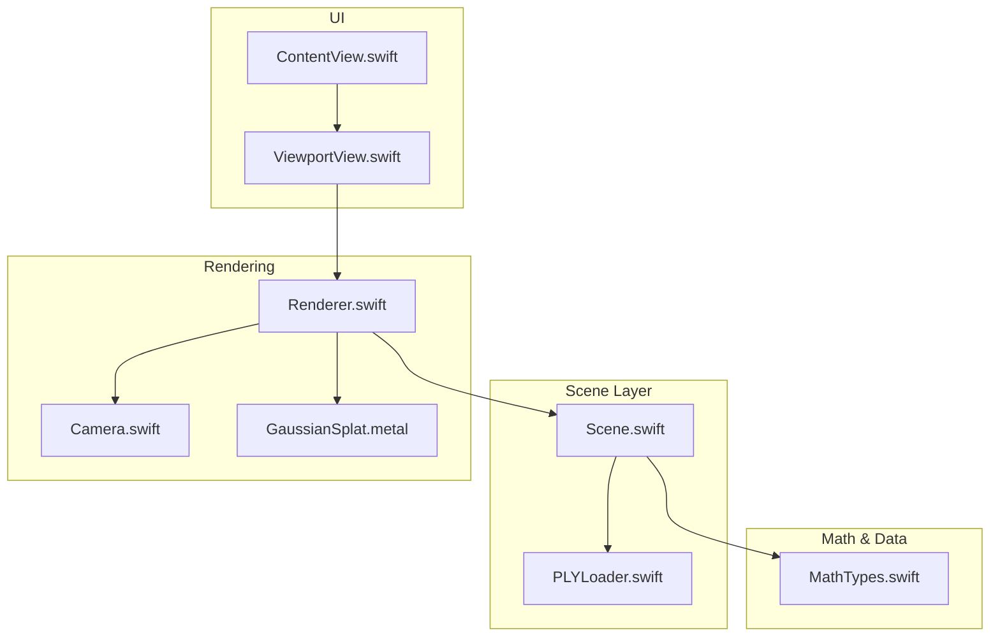
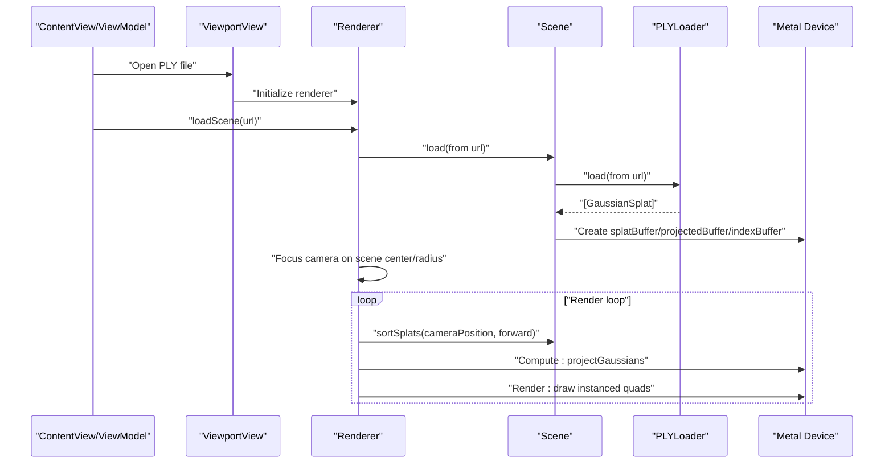
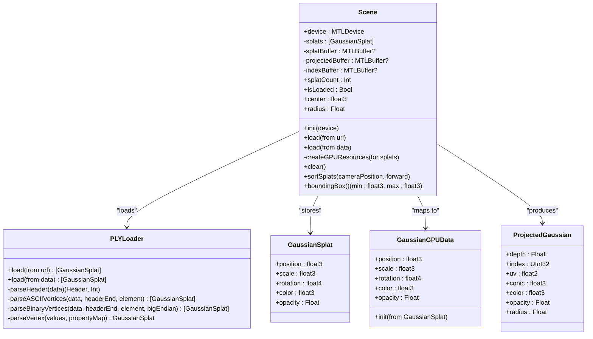
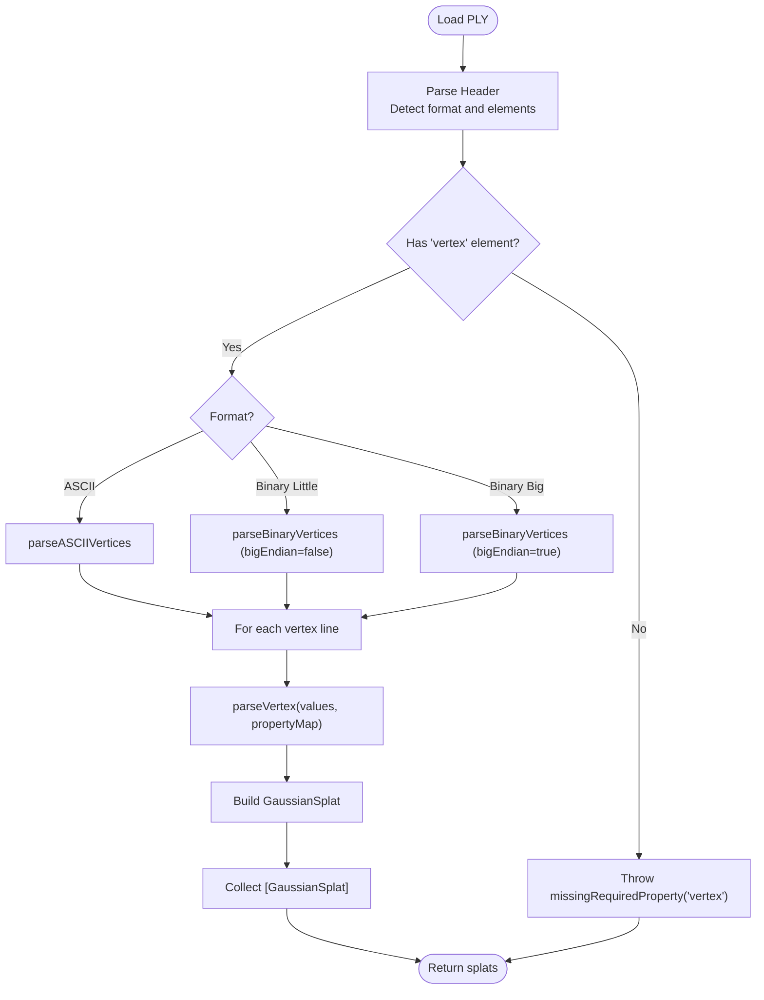
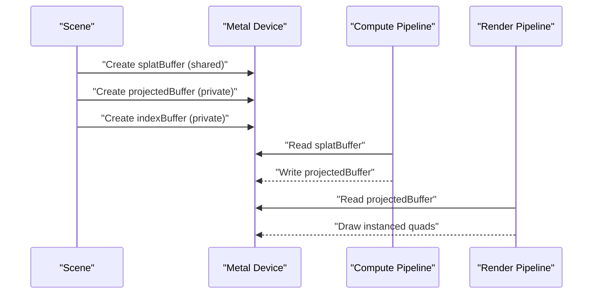
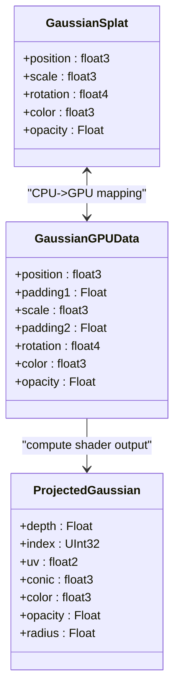
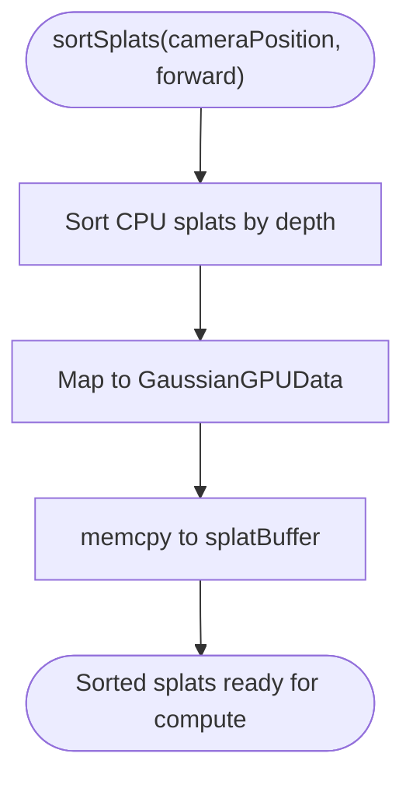
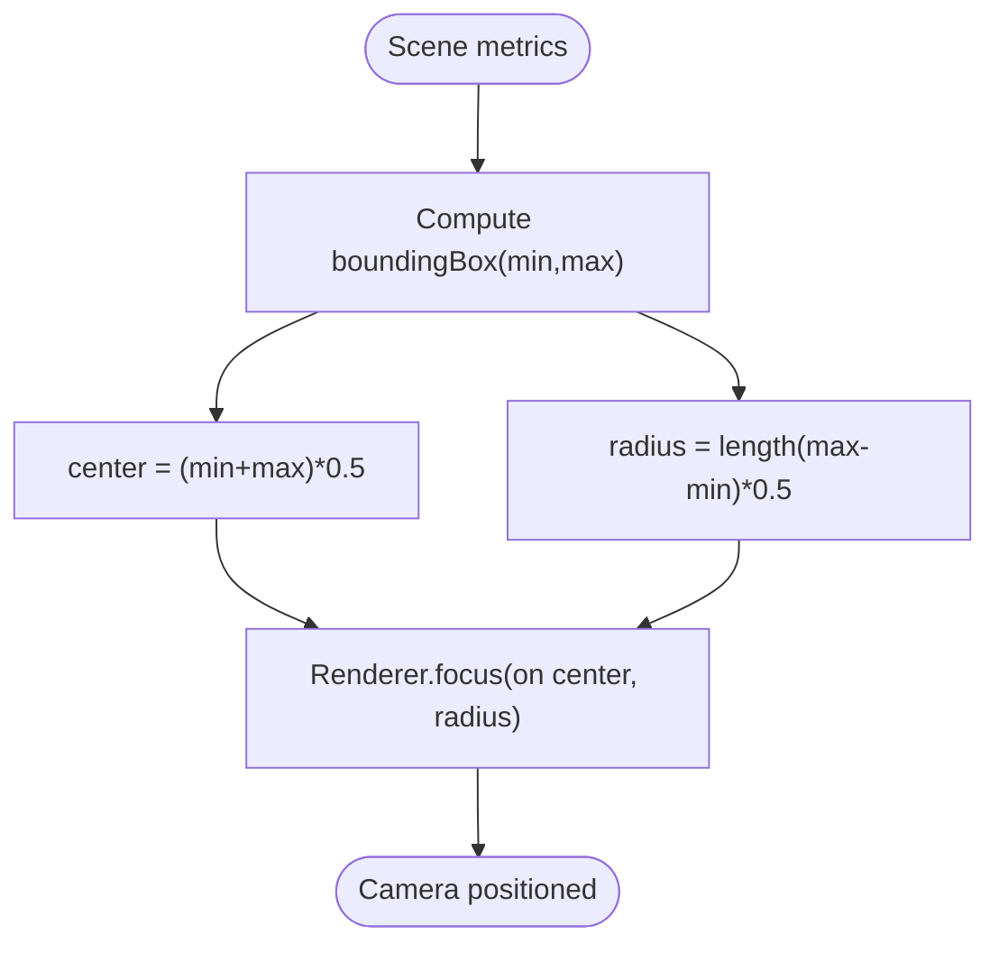
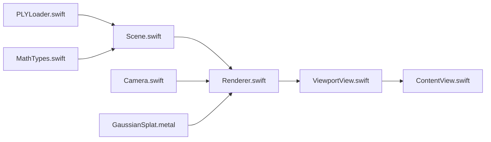

# Scene Component

<cite>
**Referenced Files in This Document**
- [Scene.swift](file://Scene/Scene.swift)
- [PLYLoader.swift](file://Scene/PLYLoader.swift)
- [MathTypes.swift](file://Math/MathTypes.swift)
- [Renderer.swift](file://Rendering/Renderer.swift)
- [Camera.swift](file://Rendering/Camera.swift)
- [GaussianSplat.metal](file://Shaders/GaussianSplat.metal)
- [ContentView.swift](file://UI/ContentView.swift)
- [ViewportView.swift](file://UI/ViewportView.swift)
</cite>

## Table of Contents
1. [Introduction](#introduction)
2. [Project Structure](#project-structure)
3. [Core Components](#core-components)
4. [Architecture Overview](#architecture-overview)
5. [Detailed Component Analysis](#detailed-component-analysis)
6. [Dependency Analysis](#dependency-analysis)
7. [Performance Considerations](#performance-considerations)
8. [Troubleshooting Guide](#troubleshooting-guide)
9. [Conclusion](#conclusion)

## Introduction
This document explains the Scene component that manages Gaussian splat data and GPU resources in the Gaussian Splat Viewer. It covers the end-to-end workflow from PLY file loading and parsing to GPU buffer creation, sorting, and rendering. It also documents the data structures, memory layout, camera focusing, and error handling.

## Project Structure
The Scene component spans several modules:
- Scene: orchestrates loading, GPU resource creation, sorting, and scene metrics
- Scene/PlyLoader: parses PLY headers and vertex data (ASCII and binary, little/big endian)
- Math: defines CPU and GPU-compatible data structures and math helpers
- Rendering: renders splats using Metal compute and graphics pipelines
- Shaders: Metal compute and fragment shaders for projection and rasterization
- UI: SwiftUI views and input handling to drive the renderer

**Diagram sources**
- [Scene.swift:1-158](file://Scene/Scene.swift#L1-L158)
- [PLYLoader.swift:1-403](file://Scene/PLYLoader.swift#L1-L403)
- [MathTypes.swift:1-189](file://Math/MathTypes.swift#L1-L189)
- [Renderer.swift:1-289](file://Rendering/Renderer.swift#L1-L289)
- [Camera.swift:1-184](file://Rendering/Camera.swift#L1-L184)
- [GaussianSplat.metal:1-317](file://Shaders/GaussianSplat.metal#L1-L317)
- [ContentView.swift:1-130](file://UI/ContentView.swift#L1-L130)
- [ViewportView.swift:1-185](file://UI/ViewportView.swift#L1-L185)

**Section sources**
- [Scene.swift:1-158](file://Scene/Scene.swift#L1-L158)
- [PLYLoader.swift:1-403](file://Scene/PLYLoader.swift#L1-L403)
- [MathTypes.swift:1-189](file://Math/MathTypes.swift#L1-L189)
- [Renderer.swift:1-289](file://Rendering/Renderer.swift#L1-L289)
- [Camera.swift:1-184](file://Rendering/Camera.swift#L1-L184)
- [GaussianSplat.metal:1-317](file://Shaders/GaussianSplat.metal#L1-L317)
- [ContentView.swift:1-130](file://UI/ContentView.swift#L1-L130)
- [ViewportView.swift:1-185](file://UI/ViewportView.swift#L1-L185)

## Core Components
- Scene: loads Gaussian splats from PLY, creates GPU buffers, sorts for depth blending, computes scene metrics (center, radius), and exposes state
- PLYLoader: parses PLY headers and vertex data, supporting ASCII and binary formats with multiple numeric types and scalar properties
- MathTypes: defines GaussianSplat and GPU-compatible structures (GaussianGPUData, ProjectedGaussian, CameraUniforms) and math helpers
- Renderer: drives the Metal pipeline, updates camera uniforms, sorts and projects splats, and draws instanced quads
- Camera: controls view/projection matrices and focuses on scene geometry
- Shaders: compute shader to project Gaussians and vertex/fragment shaders to rasterize

**Section sources**
- [Scene.swift:5-28](file://Scene/Scene.swift#L5-L28)
- [PLYLoader.swift:13-37](file://Scene/PLYLoader.swift#L13-L37)
- [MathTypes.swift:11-73](file://Math/MathTypes.swift#L11-L73)
- [Renderer.swift:7-77](file://Rendering/Renderer.swift#L7-L77)
- [Camera.swift:5-60](file://Rendering/Camera.swift#L5-L60)
- [GaussianSplat.metal:6-42](file://Shaders/GaussianSplat.metal#L6-L42)

## Architecture Overview
The Scene component integrates with the UI, Renderer, and PLYLoader to deliver a complete Gaussian splat pipeline.

**Diagram sources**
- [ContentView.swift:110-124](file://UI/ContentView.swift#L110-L124)
- [ViewportView.swift:18-21](file://UI/ViewportView.swift#L18-L21)
- [Renderer.swift:147-158](file://Rendering/Renderer.swift#L147-L158)
- [Scene.swift:31-55](file://Scene/Scene.swift#L31-L55)
- [PLYLoader.swift:42-68](file://Scene/PLYLoader.swift#L42-L68)
- [Renderer.swift:187-251](file://Rendering/Renderer.swift#L187-L251)

## Detailed Component Analysis

### Scene Component
Responsibilities:
- Load Gaussian splats from PLY via PLYLoader
- Create GPU buffers for splat data, projected data, and indices
- Sort splats back-to-front for alpha blending
- Compute scene center and radius for camera focusing
- Expose loading state and counts

Key behaviors:
- Loading from URL/Data: measures load time and delegates to PLYLoader
- GPU resource creation: allocates shared buffer for splat data and private buffers for projected data and indices
- Sorting: sorts CPU-side splats and writes back to GPU buffer
- Metrics: bounding box, center, and radius computed from positions

**Diagram sources**
- [Scene.swift:6-152](file://Scene/Scene.swift#L6-L152)
- [PLYLoader.swift:42-385](file://Scene/PLYLoader.swift#L42-L385)
- [MathTypes.swift:12-73](file://Math/MathTypes.swift#L12-L73)

**Section sources**
- [Scene.swift:6-152](file://Scene/Scene.swift#L6-L152)
- [PLYLoader.swift:42-68](file://Scene/PLYLoader.swift#L42-L68)

### PLYLoader Implementation
Supports:
- Header parsing with format detection (ASCII, binary little/big endian)
- Element discovery (expects "vertex" element)
- Property parsing with support for multiple numeric types:
  - char/int8, uchar/uint8, short/int16, ushort/uint16, int/int32, uint/uint32, float, double
- Scalar properties only (list properties are skipped)
- Vertex parsing into GaussianSplat with:
  - Required: x, y, z
  - Optional: scale_i (exponential default), rot_i (quaternion with rot_0 as w), color via SH DC or direct RGB, opacity via sigmoid

**Diagram sources**
- [PLYLoader.swift:42-68](file://Scene/PLYLoader.swift#L42-L68)
- [PLYLoader.swift:72-158](file://Scene/PLYLoader.swift#L72-L158)
- [PLYLoader.swift:162-204](file://Scene/PLYLoader.swift#L162-L204)
- [PLYLoader.swift:208-317](file://Scene/PLYLoader.swift#L208-L317)
- [PLYLoader.swift:321-385](file://Scene/PLYLoader.swift#L321-L385)

**Section sources**
- [PLYLoader.swift:17-37](file://Scene/PLYLoader.swift#L17-L37)
- [PLYLoader.swift:72-158](file://Scene/PLYLoader.swift#L72-L158)
- [PLYLoader.swift:208-317](file://Scene/PLYLoader.swift#L208-L317)
- [PLYLoader.swift:321-385](file://Scene/PLYLoader.swift#L321-L385)

### GPU Buffer Creation and Management
Scene creates three GPU buffers:
- splatBuffer: shared storage for CPU-to-GPU transfer of GaussianGPUData
- projectedBuffer: private storage for compute shader output (ProjectedGaussian)
- indexBuffer: private storage for sorting indices

Memory layout:
- GaussianGPUData is mapped from GaussianSplat with explicit padding to align to SIMD boundaries
- ProjectedGaussian is consumed by the compute shader and then by the vertex shader for instanced rendering

**Diagram sources**
- [Scene.swift:58-95](file://Scene/Scene.swift#L58-L95)
- [MathTypes.swift:35-51](file://Math/MathTypes.swift#L35-L51)
- [MathTypes.swift:65-73](file://Math/MathTypes.swift#L65-L73)
- [Renderer.swift:194-218](file://Rendering/Renderer.swift#L194-L218)
- [Renderer.swift:221-242](file://Rendering/Renderer.swift#L221-L242)

**Section sources**
- [Scene.swift:58-95](file://Scene/Scene.swift#L58-L95)
- [MathTypes.swift:35-73](file://Math/MathTypes.swift#L35-L73)
- [Renderer.swift:194-242](file://Rendering/Renderer.swift#L194-L242)

### Data Structures and Relationship Between CPU and GPU Formats
- CPU: GaussianSplat holds position, scale, rotation quaternion, color, and opacity
- GPU: GaussianGPUData mirrors GaussianSplat with padding fields to ensure alignment
- Compute output: ProjectedGaussian carries depth, index, UV, conic (inverse covariance), color, opacity, and radius

**Diagram sources**
- [MathTypes.swift:12-51](file://Math/MathTypes.swift#L12-L51)
- [MathTypes.swift:65-73](file://Math/MathTypes.swift#L65-L73)

**Section sources**
- [MathTypes.swift:12-73](file://Math/MathTypes.swift#L12-L73)

### Sorting and Depth Blending
Scene sorts splats back-to-front using camera position and forward vector. The sorted order is written back to the GPU splat buffer for subsequent compute passes.

**Diagram sources**
- [Scene.swift:106-121](file://Scene/Scene.swift#L106-L121)

**Section sources**
- [Scene.swift:106-121](file://Scene/Scene.swift#L106-L121)

### Scene Center Calculation, Bounding Radius, and Camera Focusing
Scene computes:
- Bounding box from positions
- Center as midpoint of min/max
- Radius as half the diagonal length

Renderer focuses the camera on the scene center with a radius-based distance.

**Diagram sources**
- [Scene.swift:124-151](file://Scene/Scene.swift#L124-L151)
- [Renderer.swift:154-157](file://Rendering/Renderer.swift#L154-L157)
- [Camera.swift:118-122](file://Rendering/Camera.swift#L118-L122)

**Section sources**
- [Scene.swift:124-151](file://Scene/Scene.swift#L124-L151)
- [Renderer.swift:154-157](file://Rendering/Renderer.swift#L154-L157)
- [Camera.swift:118-122](file://Rendering/Camera.swift#L118-L122)

### Example Workflows
- Scene initialization and loading:
  - UI triggers file selection and calls ViewModel.loadFile
  - ViewModel calls Renderer.loadScene, which delegates to Scene.load
  - Scene prints load timing and calls createGPUResources
- Data validation:
  - PLYLoader validates header, checks for required "vertex" element, and ensures presence of x,y,z
  - Unsupported or missing properties raise errors
- Buffer binding and memory management:
  - Renderer sets buffers for compute and render passes
  - Camera uniforms are triple-buffered for CPU/GPU synchronization
  - Sorting is performed every few frames to balance quality and performance

**Section sources**
- [ContentView.swift:151-183](file://UI/ContentView.swift#L151-L183)
- [Renderer.swift:147-158](file://Rendering/Renderer.swift#L147-L158)
- [Scene.swift:31-55](file://Scene/Scene.swift#L31-L55)
- [PLYLoader.swift:53-55](file://Scene/PLYLoader.swift#L53-L55)
- [PLYLoader.swift:329-333](file://Scene/PLYLoader.swift#L329-L333)
- [Renderer.swift:194-242](file://Rendering/Renderer.swift#L194-L242)

## Dependency Analysis
- Scene depends on:
  - PLYLoader for data ingestion
  - MathTypes for data structures and math
  - Metal device for buffer creation
- Renderer depends on:
  - Scene for splat data and buffers
  - Camera for view/projection matrices
  - Shaders for compute and rendering
- UI depends on:
  - ViewModel to coordinate loading and state
  - Renderer to render the scene

**Diagram sources**
- [Scene.swift:35-41](file://Scene/Scene.swift#L35-L41)
- [Renderer.swift:147-158](file://Rendering/Renderer.swift#L147-L158)
- [GaussianSplat.metal:146-209](file://Shaders/GaussianSplat.metal#L146-L209)

**Section sources**
- [Scene.swift:35-41](file://Scene/Scene.swift#L35-L41)
- [Renderer.swift:147-158](file://Rendering/Renderer.swift#L147-L158)
- [GaussianSplat.metal:146-209](file://Shaders/GaussianSplat.metal#L146-L209)

## Performance Considerations
- Buffer memory modes:
  - splatBuffer uses shared storage to minimize copies
  - projectedBuffer and indexBuffer use private storage for compute/graphics throughput
- Sorting cadence:
  - Sorting occurs every N frames to reduce CPU overhead while maintaining visual quality
- Compute dispatch:
  - Thread group size and grid sizing match splat count for efficient coverage
- Camera uniform buffering:
  - Triple-buffering avoids CPU/GPU synchronization stalls

[No sources needed since this section provides general guidance]

## Troubleshooting Guide
Common issues and remedies:
- PLYLoader errors:
  - invalidHeader: ensure the file has a valid PLY header and "end_header"
  - unsupportedFormat: only ASCII and binary little/big endian are supported
  - missingRequiredProperty: ensure "vertex" element and x,y,z properties exist
  - parseError: malformed ASCII or binary data
- Buffer creation failures:
  - SceneError.failedToCreateBuffer indicates Metal device failure; verify device availability
- No splats loaded:
  - SceneError.noSplatsLoaded occurs when attempting to load without a Scene instance
- Visibility issues:
  - If opacity is zero or radius is zero, splats are discarded in the vertex shader

**Section sources**
- [PLYLoader.swift:4-10](file://Scene/PLYLoader.swift#L4-L10)
- [Scene.swift:154-157](file://Scene/Scene.swift#L154-L157)
- [GaussianSplat.metal:230-234](file://Shaders/GaussianSplat.metal#L230-L234)

## Conclusion
The Scene component provides a robust foundation for Gaussian splat management, integrating PLY parsing, GPU buffer creation, sorting, and camera focusing. Its design cleanly separates CPU data structures from GPU-ready formats, enabling efficient Metal compute and rendering pipelines. The included error handling and performance-conscious buffer strategies ensure reliable operation across diverse datasets.