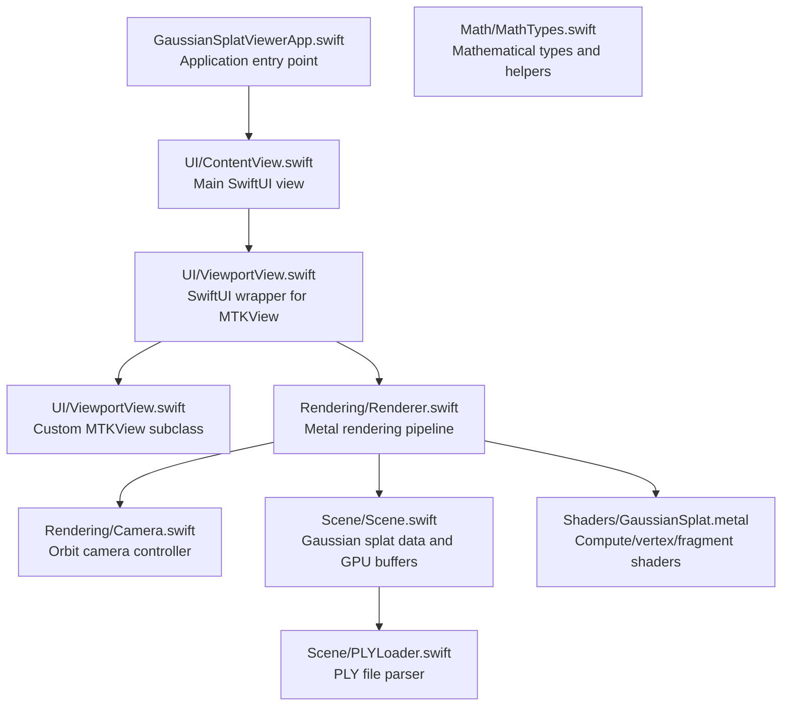
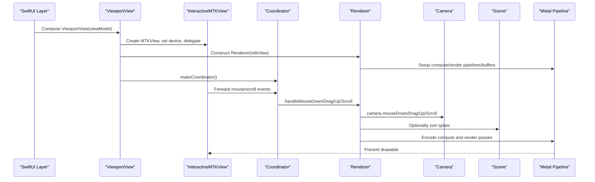
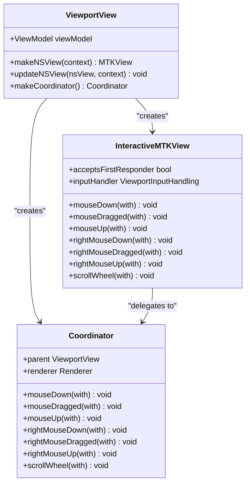
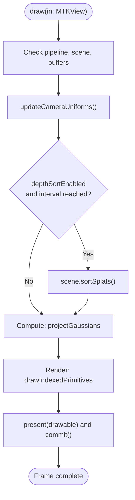
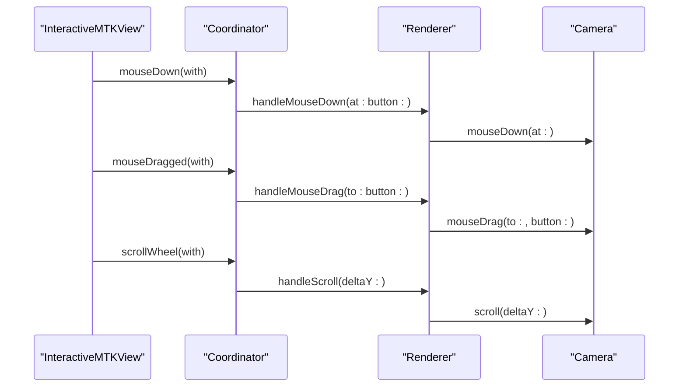
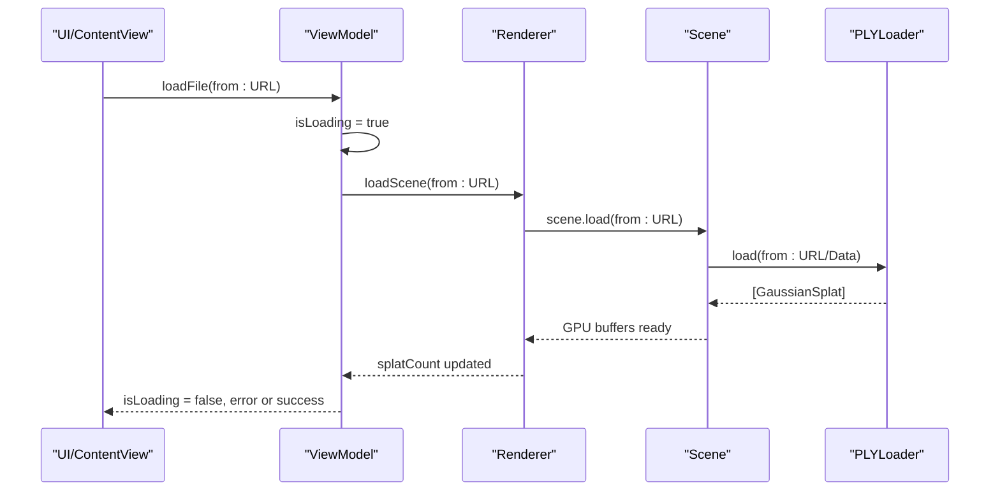
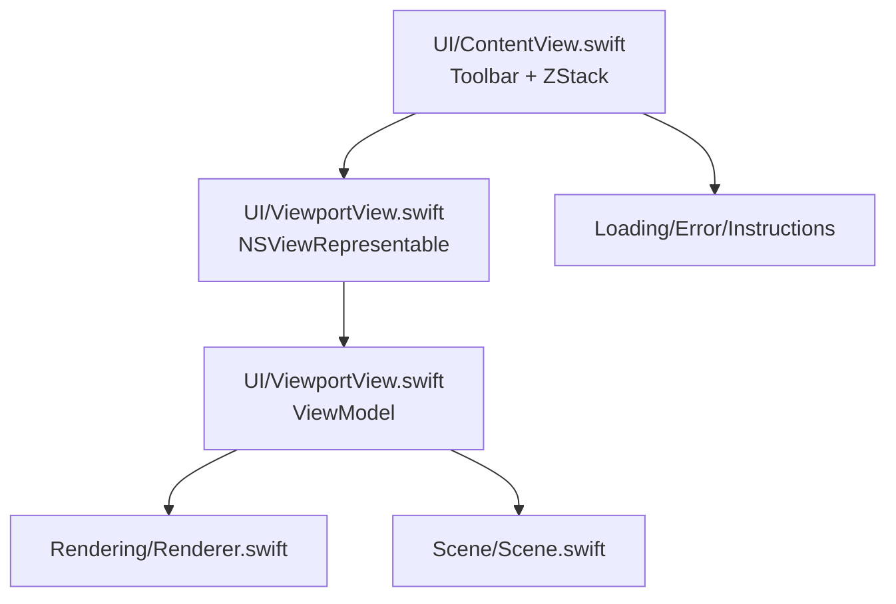
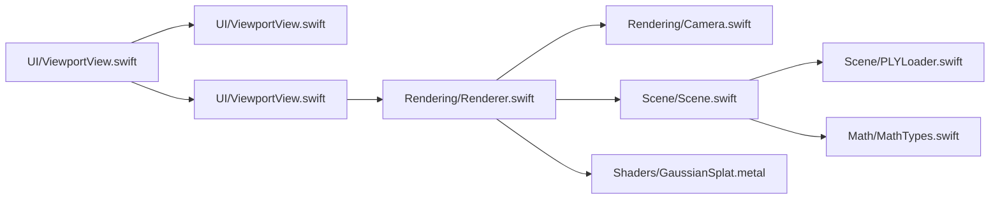

# Viewport Component

<cite>
**Referenced Files in This Document**
- [UI/ViewportView.swift](file://UI/ViewportView.swift)
- [UI/ContentView.swift](file://UI/ContentView.swift)
- [Rendering/Renderer.swift](file://Rendering/Renderer.swift)
- [Rendering/Camera.swift](file://Rendering/Camera.swift)
- [Scene/Scene.swift](file://Scene/Scene.swift)
- [Scene/PLYLoader.swift](file://Scene/PLYLoader.swift)
- [Math/MathTypes.swift](file://Math/MathTypes.swift)
- [Shaders/GaussianSplat.metal](file://Shaders/GaussianSplat.metal)
- [GaussianSplatViewerApp.swift](file://GaussianSplatViewerApp.swift)
</cite>

## Table of Contents
1. [Introduction](#introduction)
2. [Project Structure](#project-structure)
3. [Core Components](#core-components)
4. [Architecture Overview](#architecture-overview)
5. [Detailed Component Analysis](#detailed-component-analysis)
6. [Dependency Analysis](#dependency-analysis)
7. [Performance Considerations](#performance-considerations)
8. [Troubleshooting Guide](#troubleshooting-guide)
9. [Conclusion](#conclusion)

## Introduction
This document describes the ViewportView component that bridges SwiftUI and Metal rendering in a Gaussian Splatting viewer. It explains how the viewport integrates with MetalKit, handles user input (mouse, scroll), manages the view lifecycle, and coordinates with the Renderer and Camera components. It also covers state management, reactive updates, and performance considerations for input handling and rendering synchronization.

## Project Structure
The viewport lives in the UI layer and integrates with the Rendering and Scene subsystems. The main SwiftUI application composes the ViewportView within a toolbar and overlay system.

**Diagram sources**
- [GaussianSplatViewerApp.swift:1-13](file://GaussianSplatViewerApp.swift#L1-L13)
- [UI/ContentView.swift:1-130](file://UI/ContentView.swift#L1-L130)
- [UI/ViewportView.swift:1-185](file://UI/ViewportView.swift#L1-L185)
- [Rendering/Renderer.swift:1-289](file://Rendering/Renderer.swift#L1-L289)
- [Rendering/Camera.swift:1-184](file://Rendering/Camera.swift#L1-L184)
- [Scene/Scene.swift:1-158](file://Scene/Scene.swift#L1-L158)
- [Scene/PLYLoader.swift:1-408](file://Scene/PLYLoader.swift#L1-L408)
- [Math/MathTypes.swift:1-189](file://Math/MathTypes.swift#L1-L189)
- [Shaders/GaussianSplat.metal:1-317](file://Shaders/GaussianSplat.metal#L1-L317)

**Section sources**
- [UI/ViewportView.swift:1-185](file://UI/ViewportView.swift#L1-L185)
- [UI/ContentView.swift:1-130](file://UI/ContentView.swift#L1-L130)
- [Rendering/Renderer.swift:1-289](file://Rendering/Renderer.swift#L1-L289)
- [Rendering/Camera.swift:1-184](file://Rendering/Camera.swift#L1-L184)
- [Scene/Scene.swift:1-158](file://Scene/Scene.swift#L1-L158)
- [Scene/PLYLoader.swift:1-408](file://Scene/PLYLoader.swift#L1-L408)
- [Math/MathTypes.swift:1-189](file://Math/MathTypes.swift#L1-L189)
- [Shaders/GaussianSplat.metal:1-317](file://Shaders/GaussianSplat.metal#L1-L317)
- [GaussianSplatViewerApp.swift:1-13](file://GaussianSplatViewerApp.swift#L1-L13)

## Core Components
- ViewportView: A SwiftUI NSViewRepresentable that wraps an InteractiveMTKView, sets up Metal device and renderer, and wires input events to the Renderer via a Coordinator.
- InteractiveMTKView: A custom MTKView that accepts first responder and forwards Cocoa mouse and scroll events to a ViewportInputHandling delegate.
- ViewportInputHandling: Protocol defining mouse and scroll event callbacks forwarded from InteractiveMTKView.
- Coordinator: Implements ViewportInputHandling and delegates input to Renderer’s camera controls.
- Renderer: MTKViewDelegate that owns the Metal pipeline, buffers, camera, and scene. Handles resize, draw, and camera control callbacks.
- Camera: Orbit camera with sensitivity controls, matrix computation, and mouse interaction handlers.
- Scene: Manages Gaussian splat data and GPU buffers, loading from PLY, and maintaining sorted indices for rendering.
- ViewModel: ObservableObject coordinating UI state (loading, stats, errors) and holding a reference to Renderer for file loading.

**Section sources**
- [UI/ViewportView.swift:5-90](file://UI/ViewportView.swift#L5-L90)
- [Rendering/Renderer.swift:7-289](file://Rendering/Renderer.swift#L7-L289)
- [Rendering/Camera.swift:5-184](file://Rendering/Camera.swift#L5-L184)
- [Scene/Scene.swift:6-158](file://Scene/Scene.swift#L6-L158)
- [UI/ContentView.swift:4-125](file://UI/ContentView.swift#L4-L125)

## Architecture Overview
The viewport acts as the central integration point between SwiftUI and Metal. It creates the MTKView, initializes the Renderer, and forwards user input to the Camera through the Renderer. The Renderer drives the Metal pipeline and updates the Camera uniforms each frame.

**Diagram sources**
- [UI/ViewportView.swift:9-36](file://UI/ViewportView.swift#L9-L36)
- [UI/ViewportView.swift:102-139](file://UI/ViewportView.swift#L102-L139)
- [UI/ViewportView.swift:38-89](file://UI/ViewportView.swift#L38-L89)
- [Rendering/Renderer.swift:38-77](file://Rendering/Renderer.swift#L38-L77)
- [Rendering/Renderer.swift:167-251](file://Rendering/Renderer.swift#L167-L251)
- [Rendering/Camera.swift:150-177](file://Rendering/Camera.swift#L150-L177)

## Detailed Component Analysis

### ViewportView and InteractiveMTKView
- ViewportView implements NSViewRepresentable to host an MTKView configured for Metal rendering. It sets the device, enables display updates, and assigns a Coordinator as the input handler.
- InteractiveMTKView overrides key mouse and scroll event methods to forward them to a delegate conforming to ViewportInputHandling. It ensures the view becomes the first responder so it receives input events.

**Diagram sources**
- [UI/ViewportView.swift:6-36](file://UI/ViewportView.swift#L6-L36)
- [UI/ViewportView.swift:102-139](file://UI/ViewportView.swift#L102-L139)
- [UI/ViewportView.swift:38-89](file://UI/ViewportView.swift#L38-L89)

**Section sources**
- [UI/ViewportView.swift:9-36](file://UI/ViewportView.swift#L9-L36)
- [UI/ViewportView.swift:102-139](file://UI/ViewportView.swift#L102-L139)
- [UI/ViewportView.swift:38-89](file://UI/ViewportView.swift#L38-L89)

### Renderer and MTKViewDelegate
- Renderer initializes Metal device, command queue, and loads the Metal library. It configures the MTKView with appropriate pixel formats and clears color.
- It implements MTKViewDelegate to handle drawable size changes and drawing. During draw, it updates camera uniforms, optionally sorts splats, runs compute shaders to project Gaussians, and renders instanced quads with alpha blending.

**Diagram sources**
- [Rendering/Renderer.swift:167-251](file://Rendering/Renderer.swift#L167-L251)
- [Rendering/Renderer.swift:253-260](file://Rendering/Renderer.swift#L253-L260)

**Section sources**
- [Rendering/Renderer.swift:38-77](file://Rendering/Renderer.swift#L38-L77)
- [Rendering/Renderer.swift:162-165](file://Rendering/Renderer.swift#L162-L165)
- [Rendering/Renderer.swift:167-251](file://Rendering/Renderer.swift#L167-L251)

### Camera Control and Input Handling
- Mouse input is mapped to camera actions: left drag rotates, right/middle drag pans, and scroll zooms. The Coordinator translates Cocoa events into Renderer callbacks, which call Camera’s interaction methods.
- Camera maintains spherical coordinates and computes view/projection matrices. It exposes sensitivity controls and focuses on loaded scenes.

**Diagram sources**
- [UI/ViewportView.swift:112-138](file://UI/ViewportView.swift#L112-L138)
- [UI/ViewportView.swift:48-88](file://UI/ViewportView.swift#L48-L88)
- [Rendering/Renderer.swift:271-287](file://Rendering/Renderer.swift#L271-L287)
- [Rendering/Camera.swift:150-177](file://Rendering/Camera.swift#L150-L177)

**Section sources**
- [UI/ViewportView.swift:48-88](file://UI/ViewportView.swift#L48-L88)
- [Rendering/Renderer.swift:271-287](file://Rendering/Renderer.swift#L271-L287)
- [Rendering/Camera.swift:87-115](file://Rendering/Camera.swift#L87-L115)
- [Rendering/Camera.swift:150-177](file://Rendering/Camera.swift#L150-L177)

### Scene Loading and PLY Parsing
- ViewModel orchestrates asynchronous file loading, invoking Renderer’s scene loading and updating published UI state. Scene creation and GPU buffer allocation are handled by Scene, which uses PLYLoader to parse Gaussian data from PLY files.
- PLYLoader supports ASCII and binary little/big endian formats, extracting position, scale, rotation, color, and opacity fields.

**Diagram sources**
- [UI/ContentView.swift:110-123](file://UI/ContentView.swift#L110-L123)
- [UI/ViewportView.swift:151-183](file://UI/ViewportView.swift#L151-L183)
- [Rendering/Renderer.swift:147-158](file://Rendering/Renderer.swift#L147-L158)
- [Scene/Scene.swift:31-55](file://Scene/Scene.swift#L31-L55)
- [Scene/PLYLoader.swift:42-68](file://Scene/PLYLoader.swift#L42-L68)

**Section sources**
- [UI/ViewportView.swift:151-183](file://UI/ViewportView.swift#L151-L183)
- [Rendering/Renderer.swift:147-158](file://Rendering/Renderer.swift#L147-L158)
- [Scene/Scene.swift:31-55](file://Scene/Scene.swift#L31-L55)
- [Scene/PLYLoader.swift:42-68](file://Scene/PLYLoader.swift#L42-L68)

### SwiftUI Integration and State Management
- The main SwiftUI view composes a toolbar, a ZStack containing the ViewportView, and overlays for loading states and error messages. It binds to ViewModel’s published properties to drive reactive UI updates.
- The ViewportView holds an ObservedObject ViewModel and passes it to the Coordinator, enabling two-way coordination between UI and rendering.

**Diagram sources**
- [UI/ContentView.swift:8-108](file://UI/ContentView.swift#L8-L108)
- [UI/ViewportView.swift:7](file://UI/ViewportView.swift#L7)

**Section sources**
- [UI/ContentView.swift:8-108](file://UI/ContentView.swift#L8-L108)
- [UI/ViewportView.swift:7](file://UI/ViewportView.swift#L7)

## Dependency Analysis
- ViewportView depends on InteractiveMTKView and Coordinator to route input to Renderer.
- Renderer depends on Camera for view/projection matrices and Scene for splat data and GPU buffers.
- Scene depends on PLYLoader for parsing and Math types for vector/quaternion math.
- Shaders define the compute and rendering stages that Renderer targets.

**Diagram sources**
- [UI/ViewportView.swift:1-185](file://UI/ViewportView.swift#L1-L185)
- [Rendering/Renderer.swift:1-289](file://Rendering/Renderer.swift#L1-L289)
- [Rendering/Camera.swift:1-184](file://Rendering/Camera.swift#L1-L184)
- [Scene/Scene.swift:1-158](file://Scene/Scene.swift#L1-L158)
- [Scene/PLYLoader.swift:1-408](file://Scene/PLYLoader.swift#L1-L408)
- [Math/MathTypes.swift:1-189](file://Math/MathTypes.swift#L1-L189)
- [Shaders/GaussianSplat.metal:1-317](file://Shaders/GaussianSplat.metal#L1-L317)

**Section sources**
- [UI/ViewportView.swift:1-185](file://UI/ViewportView.swift#L1-L185)
- [Rendering/Renderer.swift:1-289](file://Rendering/Renderer.swift#L1-L289)
- [Rendering/Camera.swift:1-184](file://Rendering/Camera.swift#L1-L184)
- [Scene/Scene.swift:1-158](file://Scene/Scene.swift#L1-L158)
- [Scene/PLYLoader.swift:1-408](file://Scene/PLYLoader.swift#L1-L408)
- [Math/MathTypes.swift:1-189](file://Math/MathTypes.swift#L1-L189)
- [Shaders/GaussianSplat.metal:1-317](file://Shaders/GaussianSplat.metal#L1-L317)

## Performance Considerations
- Triple-buffered camera uniforms: The Renderer allocates a shared buffer sized for three frames to reduce CPU/GPU synchronization overhead.
- Frame-based depth sorting: Sorting occurs at a fixed interval to balance quality and performance.
- Alpha blending: The render pipeline enables blending with pre-multiplied alpha to achieve correct transparency.
- Event forwarding: Input events are forwarded synchronously to the Renderer’s camera; keep input handling lightweight to avoid blocking the render loop.
- Asynchronous loading: Scene loading is performed off the main thread to prevent UI stalls, with UI updates posted back to the main thread.

**Section sources**
- [Rendering/Renderer.swift:19, 130-143:19-143](file://Rendering/Renderer.swift#L19-L143)
- [Rendering/Renderer.swift:31, 33, 188-191:31-191](file://Rendering/Renderer.swift#L31-L191)
- [Rendering/Renderer.swift:111-119](file://Rendering/Renderer.swift#L111-L119)
- [UI/ViewportView.swift:151-183](file://UI/ViewportView.swift#L151-L183)

## Troubleshooting Guide
- No rendering: Verify MTKView device assignment and MTKViewDelegate are set. Ensure Metal library loads successfully and pipelines are created.
- Input not responding: Confirm InteractiveMTKView accepts first responder and the Coordinator is assigned as inputHandler.
- Scene loading failures: Check PLYLoader errors for missing required properties or unsupported formats. Validate that Scene GPU buffers are allocated after loading.
- Performance issues: Reduce splat count, disable depth sorting temporarily, or adjust sort interval.

**Section sources**
- [Rendering/Renderer.swift:38-77](file://Rendering/Renderer.swift#L38-L77)
- [UI/ViewportView.swift:9-26](file://UI/ViewportView.swift#L9-L26)
- [Scene/PLYLoader.swift:4-10](file://Scene/PLYLoader.swift#L4-L10)
- [Scene/Scene.swift:58-95](file://Scene/Scene.swift#L58-L95)

## Conclusion
The ViewportView serves as the primary bridge between SwiftUI and Metal rendering. It encapsulates MTKView setup, input delegation, and integration with the Renderer and Camera. By leveraging SwiftUI’s reactive state and the Renderer’s efficient Metal pipeline, it delivers responsive camera control and smooth rendering for Gaussian Splatting scenes. Proper separation of concerns—viewport input, camera control, scene management, and rendering—enables maintainability and extensibility.