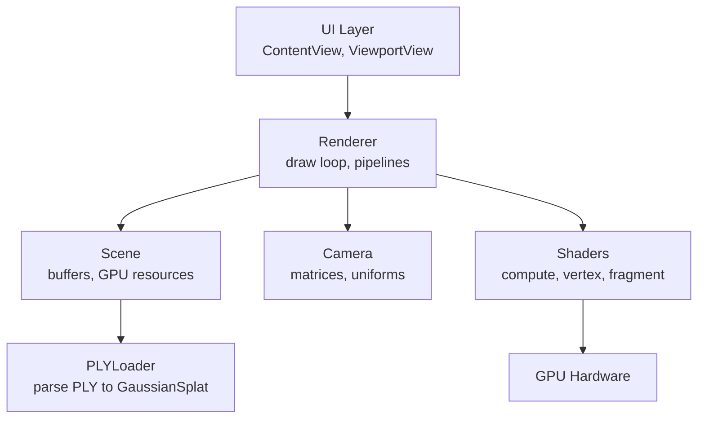
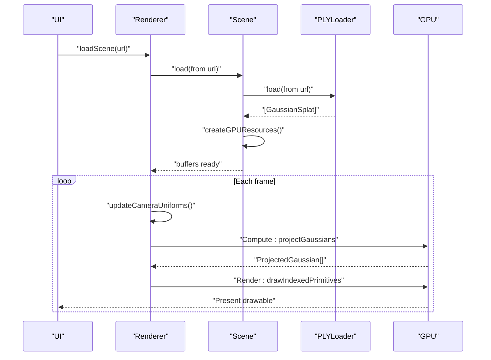
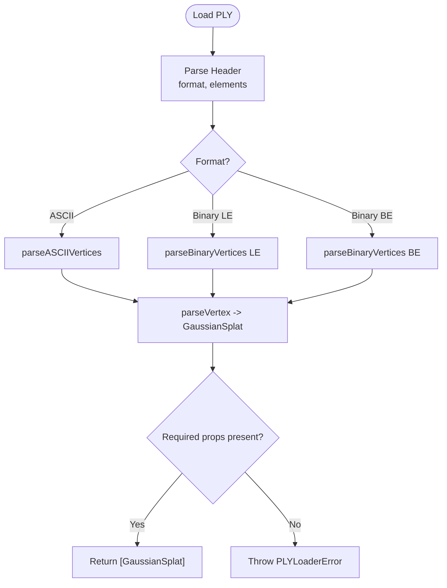
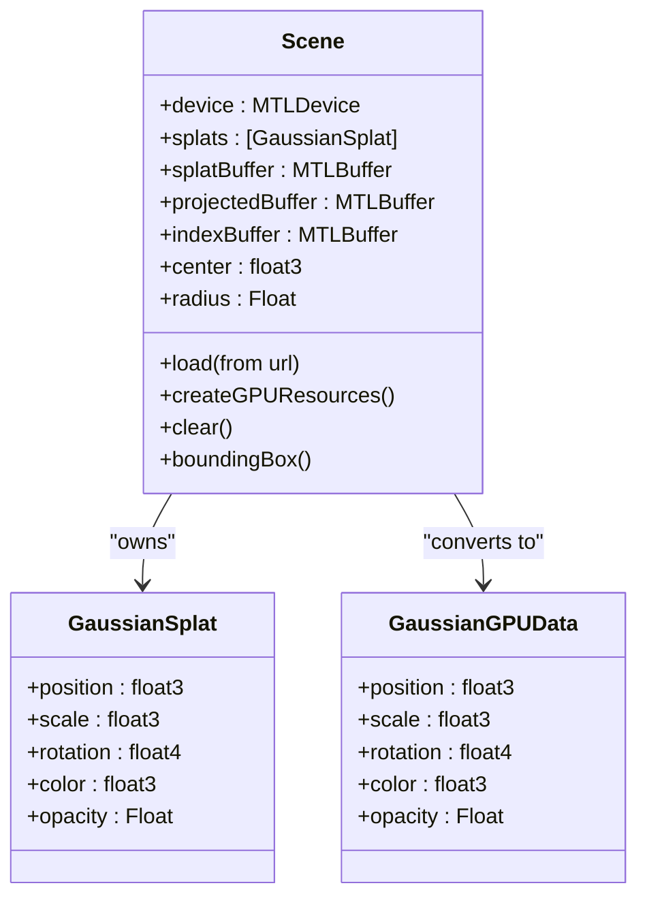
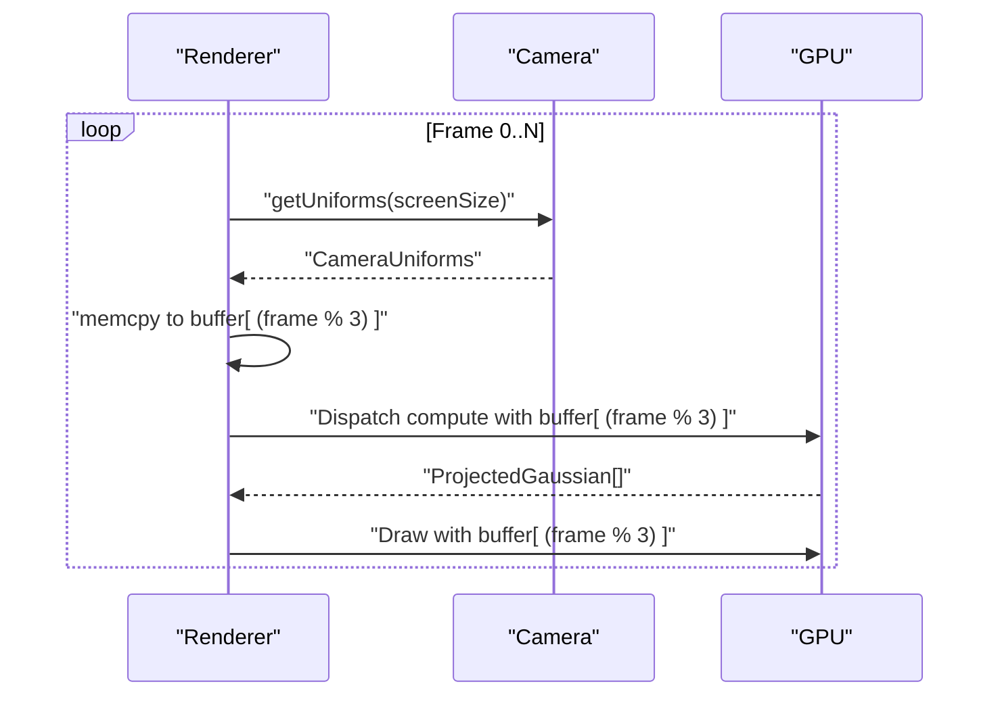
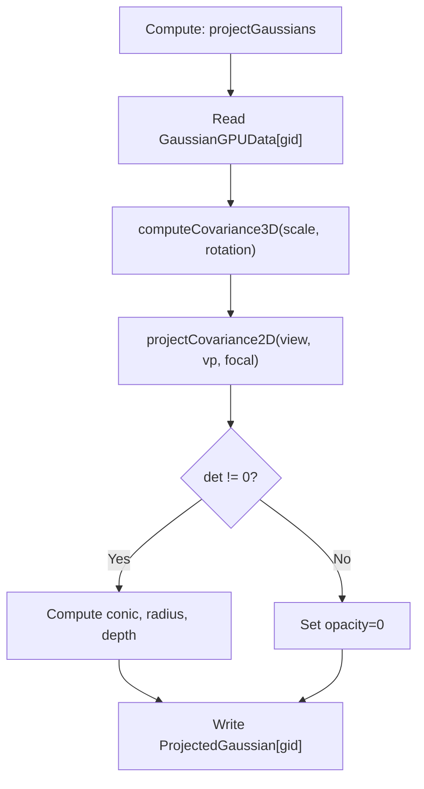
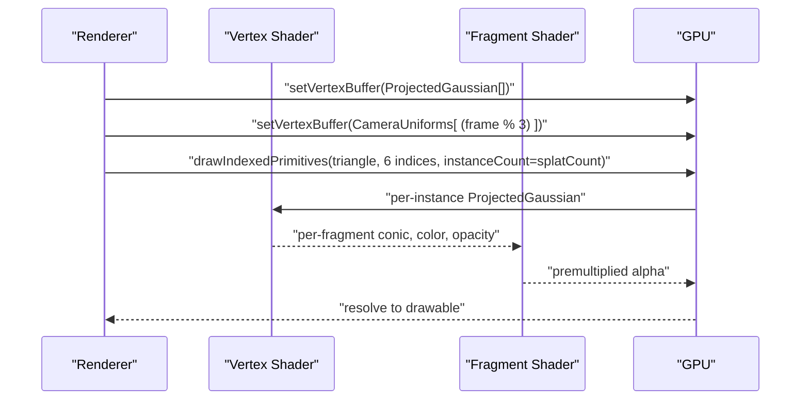
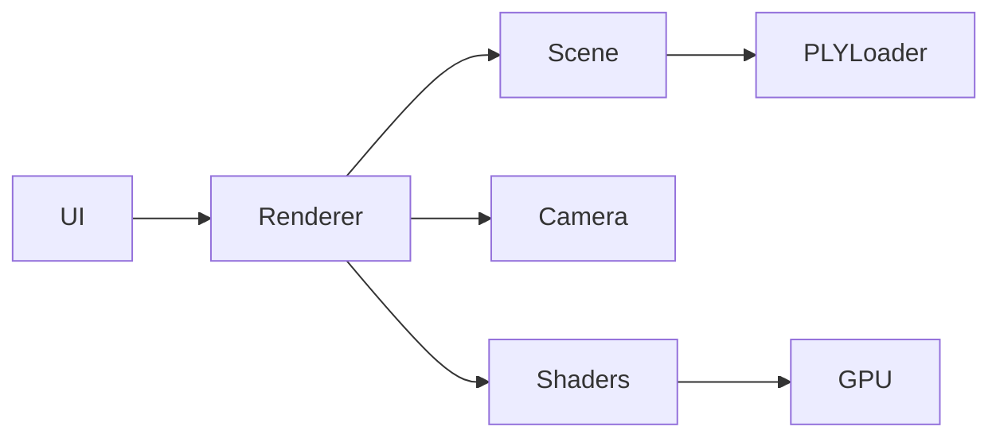

# Data Flow Architecture

<cite>
**Referenced Files in This Document**
- [PLYLoader.swift](file://Sources/Scene/PLYLoader.swift)
- [Scene.swift](file://Sources/Scene/Scene.swift)
- [MathTypes.swift](file://Sources/Math/MathTypes.swift)
- [GaussianSplat.metal](file://Sources/Shaders/GaussianSplat.metal)
- [Camera.swift](file://Sources/Rendering/Camera.swift)
- [Renderer.swift](file://Sources/Rendering/Renderer.swift)
- [ContentView.swift](file://Sources/UI/ContentView.swift)
- [ViewportView.swift](file://Sources/UI/ViewportView.swift)
- [GaussianSplatViewerApp.swift](file://Sources/GaussianSplatViewerApp.swift)
- [Package.swift](file://Package.swift)
</cite>

## Table of Contents
1. [Introduction](#introduction)
2. [Project Structure](#project-structure)
3. [Core Components](#core-components)
4. [Architecture Overview](#architecture-overview)
5. [Detailed Component Analysis](#detailed-component-analysis)
6. [Dependency Analysis](#dependency-analysis)
7. [Performance Considerations](#performance-considerations)
8. [Troubleshooting Guide](#troubleshooting-guide)
9. [Conclusion](#conclusion)

## Introduction
This document explains the complete data flow architecture for 3D Gaussian Splatting rendering in this macOS application. It traces how raw PLY data is parsed, transformed into GPU-ready structures, and processed through Metal compute and render pipelines to produce the final rendered image. It also covers memory management, triple-buffering for camera uniforms, and synchronization across CPU and GPU boundaries.

## Project Structure
The project follows a layered structure:
- UI layer: SwiftUI views and event handling
- Rendering layer: Metal-based renderer and camera control
- Scene layer: PLY loading and GPU buffer management
- Math layer: GPU-compatible data structures and math utilities
- Shaders: Metal compute and fragment shaders

**Diagram sources**
- [ContentView.swift:1-119](file://Sources/UI/ContentView.swift#L1-L119)
- [ViewportView.swift:1-118](file://Sources/UI/ViewportView.swift#L1-L118)
- [Renderer.swift:1-288](file://Sources/Rendering/Renderer.swift#L1-L288)
- [Scene.swift:1-130](file://Sources/Scene/Scene.swift#L1-L130)
- [PLYLoader.swift:1-386](file://Sources/Scene/PLYLoader.swift#L1-L386)
- [Camera.swift:1-184](file://Sources/Rendering/Camera.swift#L1-L184)
- [GaussianSplat.metal:1-309](file://Sources/Shaders/GaussianSplat.metal#L1-L309)

**Section sources**
- [Package.swift:1-17](file://Package.swift#L1-L17)
- [GaussianSplatViewerApp.swift:1-65](file://Sources/GaussianSplatViewerApp.swift#L1-L65)

## Core Components
- PLYLoader: Parses ASCII and binary PLY files, validates headers, extracts vertex properties, and constructs GaussianSplat instances.
- Scene: Owns CPU-side GaussianSplat arrays and creates GPU buffers for splat data, projected data, and indices.
- MathTypes: Defines GPU-compatible structures (GaussianGPUData, CameraUniforms, ProjectedGaussian) and math utilities for matrices/quaternions.
- Camera: Maintains camera pose and computes view/projection matrices; generates CameraUniforms for GPU.
- Renderer: Manages Metal pipelines, triple-buffered camera uniforms, compute and render passes, and draws instanced quads.
- Shaders: Compute shader projects Gaussians; vertex shader expands to screen-space quads; fragment shader evaluates splat alpha.

**Section sources**
- [PLYLoader.swift:13-68](file://Sources/Scene/PLYLoader.swift#L13-L68)
- [Scene.swift:5-85](file://Sources/Scene/Scene.swift#L5-L85)
- [MathTypes.swift:11-73](file://Sources/Math/MathTypes.swift#L11-L73)
- [Camera.swift:5-84](file://Sources/Rendering/Camera.swift#L5-L84)
- [Renderer.swift:7-79](file://Sources/Rendering/Renderer.swift#L7-L79)
- [GaussianSplat.metal:6-42](file://Sources/Shaders/GaussianSplat.metal#L6-L42)

## Architecture Overview
The data flow proceeds as follows:
1. UI triggers loading of a PLY file.
2. PLYLoader parses the file and produces an array of GaussianSplat.
3. Scene converts GaussianSplat to GaussianGPUData and allocates GPU buffers.
4. Renderer updates CameraUniforms (triply buffered) and runs:
   - Compute pass: project Gaussians to screen space and populate ProjectedGaussian array.
   - Optional depth sort (placeholder).
   - Render pass: draw instanced quads with per-instance ProjectedGaussian data.

**Diagram sources**
- [Renderer.swift:149-162](file://Sources/Rendering/Renderer.swift#L149-L162)
- [Scene.swift:24-49](file://Sources/Scene/Scene.swift#L24-L49)
- [PLYLoader.swift:42-68](file://Sources/Scene/PLYLoader.swift#L42-L68)
- [Renderer.swift:171-250](file://Sources/Rendering/Renderer.swift#L171-L250)

## Detailed Component Analysis

### PLY Loader Pipeline
- Validates PLY header and format (ASCII/binary little/big endian).
- Parses vertex elements and maps property names to indices.
- Converts ASCII and binary rows into GaussianSplat with position, scale, rotation, color, and opacity.
- Applies sigmoid activation for SH DC coefficients and normalizes quaternions.

**Diagram sources**
- [PLYLoader.swift:42-68](file://Sources/Scene/PLYLoader.swift#L42-L68)
- [PLYLoader.swift:155-197](file://Sources/Scene/PLYLoader.swift#L155-L197)
- [PLYLoader.swift:201-300](file://Sources/Scene/PLYLoader.swift#L201-L300)
- [PLYLoader.swift:304-368](file://Sources/Scene/PLYLoader.swift#L304-L368)

**Section sources**
- [PLYLoader.swift:3-10](file://Sources/Scene/PLYLoader.swift#L3-L10)
- [PLYLoader.swift:72-151](file://Sources/Scene/PLYLoader.swift#L72-L151)
- [PLYLoader.swift:155-300](file://Sources/Scene/PLYLoader.swift#L155-L300)
- [PLYLoader.swift:304-384](file://Sources/Scene/PLYLoader.swift#L304-L384)

### Scene Data Management and GPU Buffer Allocation
- Loads GaussianSplat array from PLYLoader.
- Creates three GPU buffers:
  - Splat buffer: shared storage for GaussianGPUData.
  - Projected buffer: private storage for ProjectedGaussian outputs.
  - Index buffer: private storage for sorting indices.
- Provides bounding box and center/radius for camera framing.

**Diagram sources**
- [Scene.swift:5-85](file://Sources/Scene/Scene.swift#L5-L85)
- [MathTypes.swift:11-51](file://Sources/Math/MathTypes.swift#L11-L51)

**Section sources**
- [Scene.swift:24-85](file://Sources/Scene/Scene.swift#L24-L85)
- [MathTypes.swift:11-51](file://Sources/Math/MathTypes.swift#L11-L51)

### Camera Uniforms and Triple-Buffering
- Camera computes view/projection/viewProjection matrices and generates CameraUniforms with screenSize and tanHalfFov.
- Renderer maintains a triple-buffered CameraUniforms buffer sized for three frames.
- At each frame, Renderer writes the current CameraUniforms at an offset determined by frameCount modulo 3, decoupling CPU updates from GPU consumption.

**Diagram sources**
- [Camera.swift:134-147](file://Sources/Rendering/Camera.swift#L134-L147)
- [Renderer.swift:252-259](file://Sources/Rendering/Renderer.swift#L252-L259)
- [Renderer.swift:198-199](file://Sources/Rendering/Renderer.swift#L198-L199)
- [Renderer.swift:229-230](file://Sources/Rendering/Renderer.swift#L229-L230)

**Section sources**
- [Camera.swift:134-147](file://Sources/Rendering/Camera.swift#L134-L147)
- [Renderer.swift:131-145](file://Sources/Rendering/Renderer.swift#L131-L145)
- [Renderer.swift:252-259](file://Sources/Rendering/Renderer.swift#L252-L259)

### Compute Pipeline: Gaussian Projection
- Compute kernel reads GaussianGPUData, computes 3D covariance from scale and rotation, projects to 2D, and writes ProjectedGaussian entries.
- Uses CameraUniforms for view/projection matrices and screen size/focal parameters.

**Diagram sources**
- [GaussianSplat.metal:138-198](file://Sources/Shaders/GaussianSplat.metal#L138-L198)
- [GaussianSplat.metal:64-134](file://Sources/Shaders/GaussianSplat.metal#L64-L134)

**Section sources**
- [GaussianSplat.metal:138-198](file://Sources/Shaders/GaussianSplat.metal#L138-L198)
- [GaussianSplat.metal:64-134](file://Sources/Shaders/GaussianSplat.metal#L64-L134)

### Render Pipeline: Instanced Quad Drawing
- Vertex shader expands a unit quad per instance using ProjectedGaussian (uv, conic, radius).
- Fragment shader evaluates 2D Gaussian density, applies opacity, and outputs premultiplied alpha.
- Renderer draws indexed triangles with instanceCount equal to the number of splats.

**Diagram sources**
- [Renderer.swift:221-246](file://Sources/Rendering/Renderer.swift#L221-L246)
- [GaussianSplat.metal:202-241](file://Sources/Shaders/GaussianSplat.metal#L202-L241)
- [GaussianSplat.metal:245-270](file://Sources/Shaders/GaussianSplat.metal#L245-L270)

**Section sources**
- [Renderer.swift:221-246](file://Sources/Rendering/Renderer.swift#L221-L246)
- [GaussianSplat.metal:202-241](file://Sources/Shaders/GaussianSplat.metal#L202-L241)
- [GaussianSplat.metal:245-270](file://Sources/Shaders/GaussianSplat.metal#L245-L270)

### Data Structures Across the Pipeline
- CPU: [GaussianSplat:12-29](file://Sources/Math/MathTypes.swift#L12-L29) holds raw attributes.
- GPU conversion: [GaussianGPUData:35-50](file://Sources/Math/MathTypes.swift#L35-L50) aligns to Metal buffer layout.
- Compute output: [ProjectedGaussian:65-73](file://Sources/Math/MathTypes.swift#L65-L73) carries per-splat projected data.
- Uniforms: [CameraUniforms:54-62](file://Sources/Math/MathTypes.swift#L54-L62) carries matrices and screen params.

**Section sources**
- [MathTypes.swift:11-73](file://Sources/Math/MathTypes.swift#L11-L73)

## Dependency Analysis
- UI depends on Renderer via ViewModel and ViewportView.
- Renderer depends on Scene for GPU buffers and on Camera for uniforms.
- Scene depends on PLYLoader for initial data and on Metal for buffer creation.
- Shaders depend on MathTypes structures and on Renderer-provided buffers.

**Diagram sources**
- [ContentView.swift:1-119](file://Sources/UI/ContentView.swift#L1-L119)
- [ViewportView.swift:1-118](file://Sources/UI/ViewportView.swift#L1-L118)
- [Renderer.swift:1-288](file://Sources/Rendering/Renderer.swift#L1-L288)
- [Scene.swift:1-130](file://Sources/Scene/Scene.swift#L1-L130)
- [PLYLoader.swift:1-386](file://Sources/Scene/PLYLoader.swift#L1-L386)
- [Camera.swift:1-184](file://Sources/Rendering/Camera.swift#L1-L184)
- [GaussianSplat.metal:1-309](file://Sources/Shaders/GaussianSplat.metal#L1-L309)

**Section sources**
- [Renderer.swift:1-79](file://Sources/Rendering/Renderer.swift#L1-L79)
- [Scene.swift:1-22](file://Sources/Scene/Scene.swift#L1-L22)

## Performance Considerations
- Triple buffering reduces CPU-GPU synchronization stalls by allowing the CPU to write the next frame’s uniforms while the GPU consumes the previous frame’s data.
- Shared storage for splat buffer enables efficient copying from CPU to GPU; private storage for projected data minimizes contention.
- Compute dispatch sizing uses 256-wide thread groups; adjust based on device capabilities and splat count.
- Depth sorting is currently a placeholder; implement a proper sort (e.g., bitonic sort kernel) to reduce overdraw and improve blending quality.
- Consider precomputing covariance upper-triangular elements on CPU to reduce shader computation if needed.

[No sources needed since this section provides general guidance]

## Troubleshooting Guide
Common issues and checks:
- PLY parsing errors: Verify header format and required properties (position). See [PLYLoaderError:4-10](file://Sources/Scene/PLYLoader.swift#L4-L10).
- Buffer creation failures: Ensure device supports Metal and buffers allocate successfully. See [SceneError:126-129](file://Sources/Scene/Scene.swift#L126-L129).
- No splats loaded: Confirm PLY contains a vertex element and sufficient properties. See [Scene.swift:24-49](file://Sources/Scene/Scene.swift#L24-L49).
- Rendering artifacts: Validate CameraUniforms (view/projection matrices, screenSize, tanHalfFov). See [Camera.swift:134-147](file://Sources/Rendering/Camera.swift#L134-L147).
- Compute mismatch: Ensure compute dispatch sizes match splat count and thread group size. See [Renderer.swift:202-208](file://Sources/Rendering/Renderer.swift#L202-L208).

**Section sources**
- [PLYLoader.swift:4-10](file://Sources/Scene/PLYLoader.swift#L4-L10)
- [Scene.swift:126-129](file://Sources/Scene/Scene.swift#L126-L129)
- [Camera.swift:134-147](file://Sources/Rendering/Camera.swift#L134-L147)
- [Renderer.swift:202-208](file://Sources/Rendering/Renderer.swift#L202-L208)

## Conclusion
The system transforms raw PLY data into GPU-ready structures and streams them through a Metal compute projection pass followed by a render pass. Triple-buffered camera uniforms decouple CPU updates from GPU consumption, while dedicated buffers isolate compute outputs from render inputs. Extending the pipeline with a robust depth-sorting mechanism would further improve rendering quality and performance.