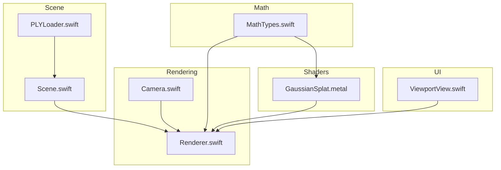
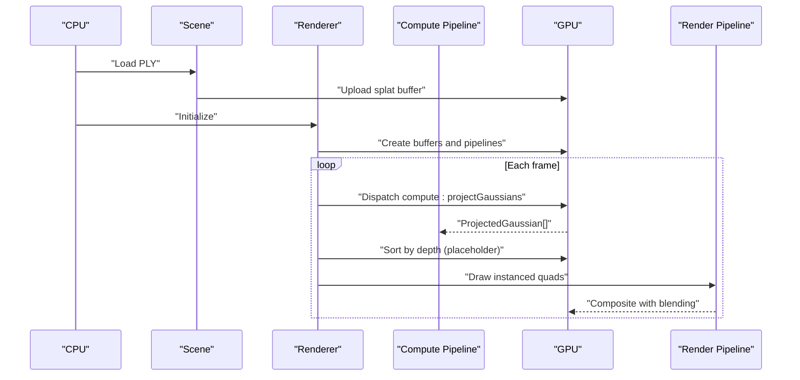
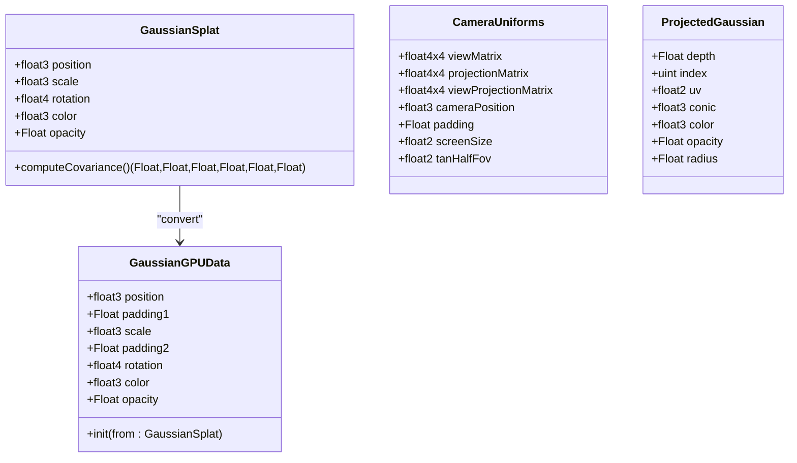
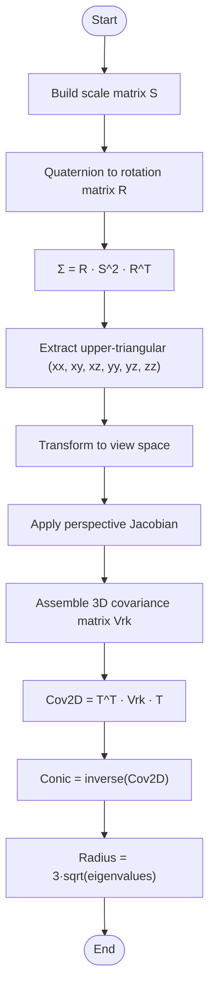
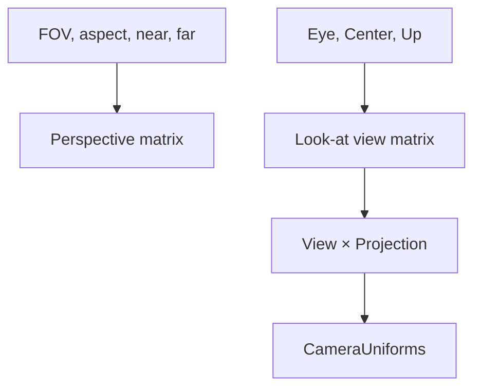
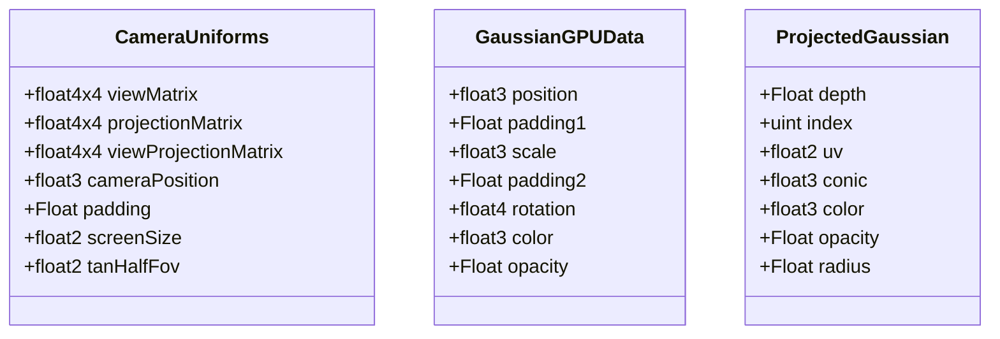
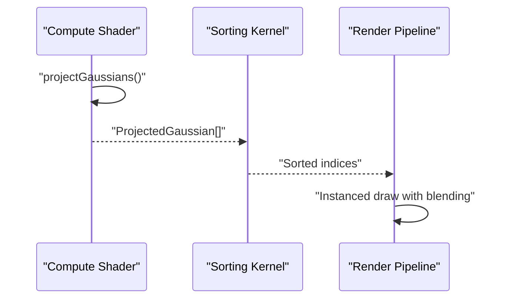
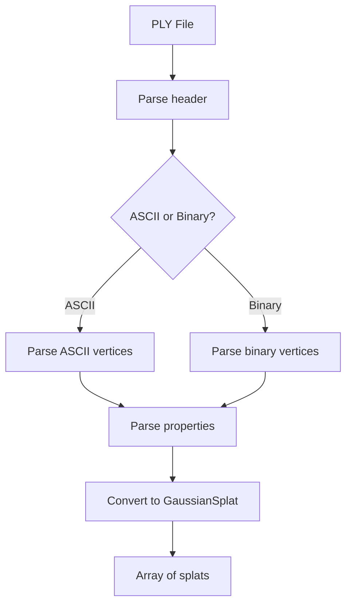
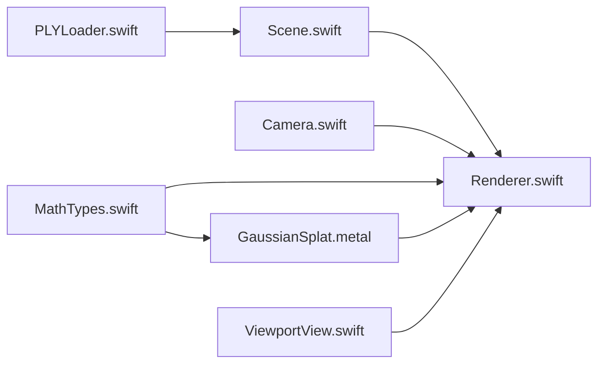

# Mathematical Foundation

<cite>
**Referenced Files in This Document**
- [MathTypes.swift](file://Math/MathTypes.swift)
- [GaussianSplat.metal](file://Shaders/GaussianSplat.metal)
- [Camera.swift](file://Rendering/Camera.swift)
- [Renderer.swift](file://Rendering/Renderer.swift)
- [Scene.swift](file://Scene/Scene.swift)
- [PLYLoader.swift](file://Scene/PLYLoader.swift)
- [ViewportView.swift](file://UI/ViewportView.swift)
</cite>

## Table of Contents
1. [Introduction](#introduction)
2. [Project Structure](#project-structure)
3. [Core Components](#core-components)
4. [Architecture Overview](#architecture-overview)
5. [Detailed Component Analysis](#detailed-component-analysis)
6. [Dependency Analysis](#dependency-analysis)
7. [Performance Considerations](#performance-considerations)
8. [Troubleshooting Guide](#troubleshooting-guide)
9. [Conclusion](#conclusion)

## Introduction
This document explains the mathematical foundation of Gaussian Splat Viewer, focusing on the data structures, transformations, projections, and GPU implementations that enable real-time rendering of 3D Gaussian splats. It covers:
- Gaussian splat data structures and GPU-compatible layouts
- Covariance matrices and their computation from scale and rotation
- Vector and matrix operations, including quaternions for 3D rotations
- Perspective projection and depth-based sorting
- GPU memory layouts for Metal compute and render pipelines
- Numerical stability considerations and performance characteristics

## Project Structure
The project is organized around three pillars:
- Math: Core mathematical types and conversions
- Rendering: Camera, renderer, and Metal pipeline orchestration
- Scene: PLY loading, scene management, and GPU buffer creation
- Shaders: Metal compute and fragment shaders implementing projection and splat evaluation
- UI: SwiftUI integration and interactive viewport

**Diagram sources**
- [MathTypes.swift:1-189](file://Math/MathTypes.swift#L1-L189)
- [GaussianSplat.metal:1-309](file://Shaders/GaussianSplat.metal#L1-L309)
- [Camera.swift:1-184](file://Rendering/Camera.swift#L1-L184)
- [Renderer.swift:1-288](file://Rendering/Renderer.swift#L1-L288)
- [Scene.swift:1-140](file://Scene/Scene.swift#L1-L140)
- [PLYLoader.swift:1-403](file://Scene/PLYLoader.swift#L1-L403)
- [ViewportView.swift:1-185](file://UI/ViewportView.swift#L1-L185)

**Section sources**
- [MathTypes.swift:1-189](file://Math/MathTypes.swift#L1-L189)
- [GaussianSplat.metal:1-309](file://Shaders/GaussianSplat.metal#L1-L309)
- [Camera.swift:1-184](file://Rendering/Camera.swift#L1-L184)
- [Renderer.swift:1-288](file://Rendering/Renderer.swift#L1-L288)
- [Scene.swift:1-140](file://Scene/Scene.swift#L1-L140)
- [PLYLoader.swift:1-403](file://Scene/PLYLoader.swift#L1-L403)
- [ViewportView.swift:1-185](file://UI/ViewportView.swift#L1-L185)

## Core Components
- Gaussian splat data structure with position, scale, rotation, color, and opacity
- GPU-compatible structures for compute and camera uniforms
- Projection pipeline computing 2D covariance and depth for sorting
- Depth-based sorting kernel and instanced rendering
- Camera matrices and uniforms for view/projection transforms

Key mathematical concepts:
- 3D covariance from scale and rotation via rotation matrices derived from quaternions
- Perspective projection with Jacobian approximation and clipping
- 2D covariance projection and conic representation (inverse covariance)
- Depth sorting for correct compositing order

**Section sources**
- [MathTypes.swift:11-30](file://Math/MathTypes.swift#L11-L30)
- [MathTypes.swift:34-51](file://Math/MathTypes.swift#L34-L51)
- [MathTypes.swift:53-73](file://Math/MathTypes.swift#L53-L73)
- [MathTypes.swift:75-101](file://Math/MathTypes.swift#L75-L101)
- [MathTypes.swift:103-167](file://Math/MathTypes.swift#L103-L167)
- [MathTypes.swift:169-188](file://Math/MathTypes.swift#L169-L188)

## Architecture Overview
The rendering pipeline consists of:
1. CPU loads PLY data and constructs Gaussian splats
2. Renderer creates GPU buffers and sets up Metal pipelines
3. Compute shader projects each splat to screen space, computes 2D covariance and conic
4. Depth sorting (placeholder) orders splats for correct blending
5. Instanced rendering draws screen-space quads with per-splat attributes

**Diagram sources**
- [Scene.swift:30-95](file://Scene/Scene.swift#L30-L95)
- [Renderer.swift:166-250](file://Rendering/Renderer.swift#L166-L250)
- [GaussianSplat.metal:138-201](file://Shaders/GaussianSplat.metal#L138-L201)

## Detailed Component Analysis

### Gaussian Splats and GPU Data Layouts
- CPU structure: position, scale, rotation (quaternion), color, opacity
- GPU structure: aligned fields with explicit padding to satisfy Metal alignment requirements
- Conversion from CPU to GPU structure preserves semantics for compute shader consumption

Implementation details:
- Rotation-to-matrix conversion via quaternion normalization and matrix construction
- Covariance computation from scale and rotation matrices
- GPU buffer creation with stride alignment for uniform buffers

**Diagram sources**
- [MathTypes.swift:11-30](file://Math/MathTypes.swift#L11-L30)
- [MathTypes.swift:34-51](file://Math/MathTypes.swift#L34-L51)
- [MathTypes.swift:53-73](file://Math/MathTypes.swift#L53-L73)

**Section sources**
- [MathTypes.swift:11-30](file://Math/MathTypes.swift#L11-L30)
- [MathTypes.swift:34-51](file://Math/MathTypes.swift#L34-L51)
- [MathTypes.swift:169-188](file://Math/MathTypes.swift#L169-L188)
- [Scene.swift:57-95](file://Scene/Scene.swift#L57-L95)

### Covariance Matrices and 2D Projection
Mathematical formulation:
- 3D covariance from scale and rotation: Σ = R · S · S^T · R^T = R · S^2 · R^T
- Upper-triangular elements stored for efficient 2D projection
- 2D covariance projection under perspective using Jacobian and view rotation
- Conic representation as inverse covariance: Σ^{-1} = [A, B; B, C]

Implementation highlights:
- Compute 3D covariance in compute shader using quaternion-derived rotation matrix and scale diagonal matrix
- Project to 2D using view matrix and projection matrices; apply perspective Jacobian and low-pass filtering
- Compute radius from eigenvalues (3σ) for quad sizing

**Diagram sources**
- [MathTypes.swift:169-188](file://Math/MathTypes.swift#L169-L188)
- [GaussianSplat.metal:64-134](file://Shaders/GaussianSplat.metal#L64-L134)

**Section sources**
- [MathTypes.swift:169-188](file://Math/MathTypes.swift#L169-L188)
- [GaussianSplat.metal:64-134](file://Shaders/GaussianSplat.metal#L64-L134)

### Perspective Projection and Camera Mathematics
- Perspective matrix computed from field-of-view, aspect ratio, near/far planes
- Look-at view matrix from eye, center, and up vectors
- Camera uniforms include view, projection, combined matrices, camera position, screen size, and tangent of half FOV

**Diagram sources**
- [MathTypes.swift:107-131](file://Math/MathTypes.swift#L107-L131)
- [Camera.swift:62-84](file://Rendering/Camera.swift#L62-L84)
- [Camera.swift:133-147](file://Rendering/Camera.swift#L133-L147)

**Section sources**
- [MathTypes.swift:107-131](file://Math/MathTypes.swift#L107-L131)
- [Camera.swift:62-84](file://Rendering/Camera.swift#L62-L84)
- [Camera.swift:133-147](file://Rendering/Camera.swift#L133-L147)

### GPU Data Layouts and Memory Alignment
- GaussianGPUData fields are padded to align with Metal’s 16-byte alignment requirements
- CameraUniforms are triple-buffered with a fixed stride to ensure coherent access across frames
- ProjectedGaussian stores per-splat attributes needed for vertex and fragment shaders

**Diagram sources**
- [MathTypes.swift:53-73](file://Math/MathTypes.swift#L53-L73)
- [MathTypes.swift:34-51](file://Math/MathTypes.swift#L34-L51)
- [Renderer.swift:19](file://Rendering/Renderer.swift#L19)

**Section sources**
- [MathTypes.swift:53-73](file://Math/MathTypes.swift#L53-L73)
- [MathTypes.swift:34-51](file://Math/MathTypes.swift#L34-L51)
- [Renderer.swift:19](file://Rendering/Renderer.swift#L19)

### Depth-Based Sorting and Blending
- Compute shader outputs ProjectedGaussian with depth and screen-space UV
- Sorting is currently a placeholder; the compute shader sets depth and radius for potential future sorting
- Render pipeline enables premultiplied alpha blending for correct compositing

**Diagram sources**
- [GaussianSplat.metal:138-201](file://Shaders/GaussianSplat.metal#L138-L201)
- [Renderer.swift:213-217](file://Rendering/Renderer.swift#L213-L217)
- [GaussianSplat.metal:272-309](file://Shaders/GaussianSplat.metal#L272-L309)

**Section sources**
- [GaussianSplat.metal:138-201](file://Shaders/GaussianSplat.metal#L138-L201)
- [Renderer.swift:213-217](file://Rendering/Renderer.swift#L213-L217)
- [GaussianSplat.metal:272-309](file://Shaders/GaussianSplat.metal#L272-L309)

### PLY Loading and Color/Opacity Conversion
- Supports ASCII and binary little/big endian PLY formats
- Parses vertex properties: position, scale, rotation (quaternion), color (SH DC or RGB), opacity
- Applies sigmoid activation to convert raw SH coefficients and opacity to [0,1]

**Diagram sources**
- [PLYLoader.swift:41-68](file://Scene/PLYLoader.swift#L41-L68)
- [PLYLoader.swift:162-204](file://Scene/PLYLoader.swift#L162-L204)
- [PLYLoader.swift:208-317](file://Scene/PLYLoader.swift#L208-L317)
- [PLYLoader.swift:321-385](file://Scene/PLYLoader.swift#L321-L385)

**Section sources**
- [PLYLoader.swift:41-68](file://Scene/PLYLoader.swift#L41-L68)
- [PLYLoader.swift:321-385](file://Scene/PLYLoader.swift#L321-L385)

## Dependency Analysis
- MathTypes.swift defines the core types and conversions used by both CPU and GPU
- GaussianSplat.metal mirrors CPU structures and implements projection and sorting kernels
- Camera.swift builds matrices consumed by both CPU and GPU
- Renderer.swift orchestrates Metal buffers, pipelines, and dispatches
- Scene.swift manages GPU buffers and scene data
- PLYLoader.swift produces GaussianSplat arrays consumed by Scene
- ViewportView.swift integrates UI and passes input events to Renderer

**Diagram sources**
- [PLYLoader.swift:1-403](file://Scene/PLYLoader.swift#L1-L403)
- [Scene.swift:1-140](file://Scene/Scene.swift#L1-L140)
- [Renderer.swift:1-288](file://Rendering/Renderer.swift#L1-L288)
- [Camera.swift:1-184](file://Rendering/Camera.swift#L1-L184)
- [MathTypes.swift:1-189](file://Math/MathTypes.swift#L1-L189)
- [GaussianSplat.metal:1-309](file://Shaders/GaussianSplat.metal#L1-L309)
- [ViewportView.swift:1-185](file://UI/ViewportView.swift#L1-L185)

**Section sources**
- [PLYLoader.swift:1-403](file://Scene/PLYLoader.swift#L1-L403)
- [Scene.swift:1-140](file://Scene/Scene.swift#L1-L140)
- [Renderer.swift:1-288](file://Rendering/Renderer.swift#L1-L288)
- [Camera.swift:1-184](file://Rendering/Camera.swift#L1-L184)
- [MathTypes.swift:1-189](file://Math/MathTypes.swift#L1-L189)
- [GaussianSplat.metal:1-309](file://Shaders/GaussianSplat.metal#L1-L309)
- [ViewportView.swift:1-185](file://UI/ViewportView.swift#L1-L185)

## Performance Considerations
- Numerical stability:
  - Quaternion normalization prevents degenerate rotations
  - Low-pass filtering adds small diagonal terms to 2D covariance before inversion
  - Determinant checks avoid division by zero; fallback opacity ensures robustness
- GPU memory:
  - Struct padding ensures 16-byte alignment for Metal buffers
  - Triple-buffering of uniform buffers reduces synchronization overhead
  - Private buffers for intermediate compute results minimize bandwidth
- Work distribution:
  - Compute shader dispatches 256-thread groups; adjust based on device capabilities
  - Sorting is disabled by default; enable periodically to balance quality vs. cost
- Rendering:
  - Premultiplied alpha blending avoids overdraw artifacts
  - Early discard in fragment shader reduces fragment computations

[No sources needed since this section provides general guidance]

## Troubleshooting Guide
Common issues and remedies:
- Splats not visible:
  - Verify opacity and color values; check fragment shader early discard conditions
  - Ensure splat positions are within camera near/far planes
- Incorrect ordering:
  - Confirm depth sorting is enabled and functioning; verify ProjectedGaussian depth values
- Poor performance:
  - Reduce splat count or increase sort interval
  - Ensure compute dispatch sizes match device capabilities
- Memory errors:
  - Validate buffer strides and alignment; confirm triple-buffer offsets are correct

**Section sources**
- [GaussianSplat.metal:245-270](file://Shaders/GaussianSplat.metal#L245-L270)
- [Renderer.swift:213-217](file://Rendering/Renderer.swift#L213-L217)
- [Renderer.swift:19-20](file://Rendering/Renderer.swift#L19-L20)

## Conclusion
Gaussian Splat Viewer combines precise mathematical formulations with efficient GPU implementations:
- Gaussian splats are represented by position, scale, rotation, color, and opacity
- Covariance matrices are computed from scale and rotation, projected to 2D under perspective, and represented as conics
- Camera matrices and uniforms drive the projection pipeline
- GPU buffers and Metal pipelines deliver real-time rendering with proper memory alignment and blending
- Numerical stability and performance are addressed through careful handling of determinants, padding, and sorting intervals

[No sources needed since this section summarizes without analyzing specific files]