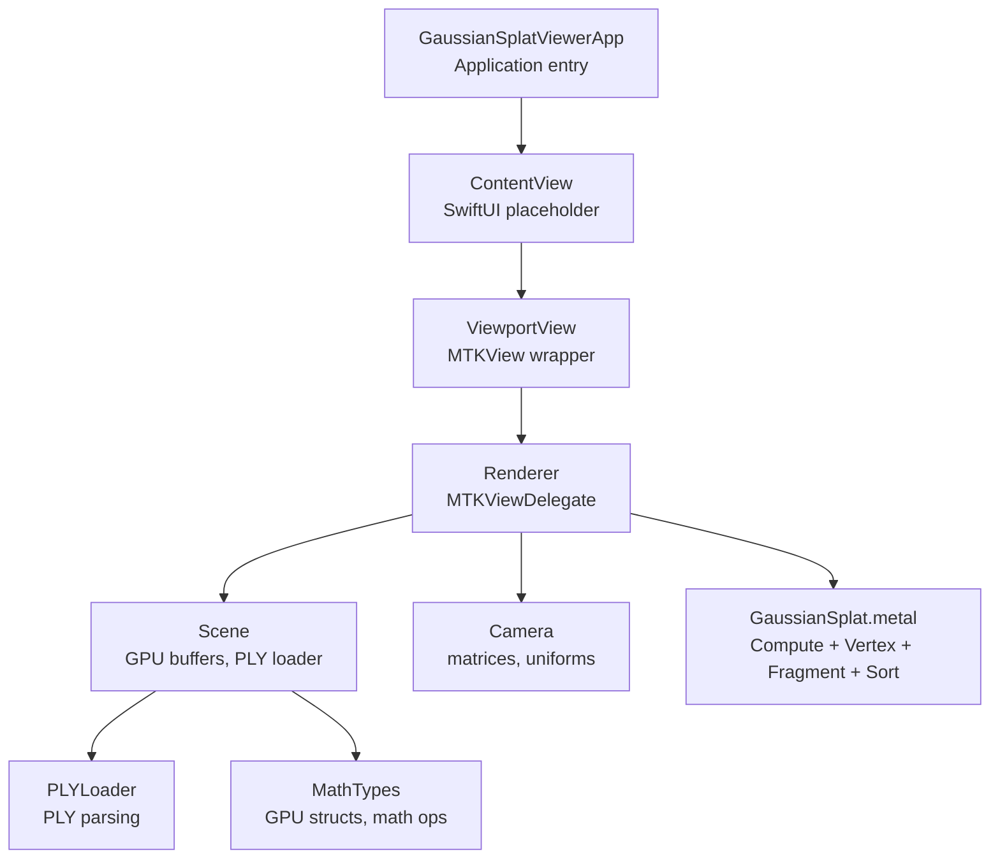
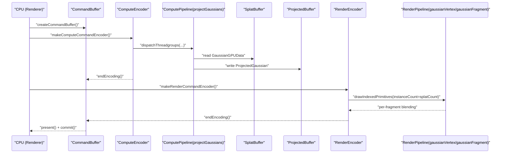
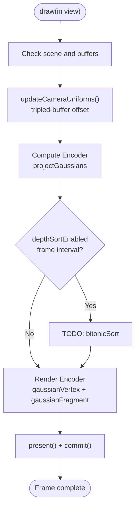
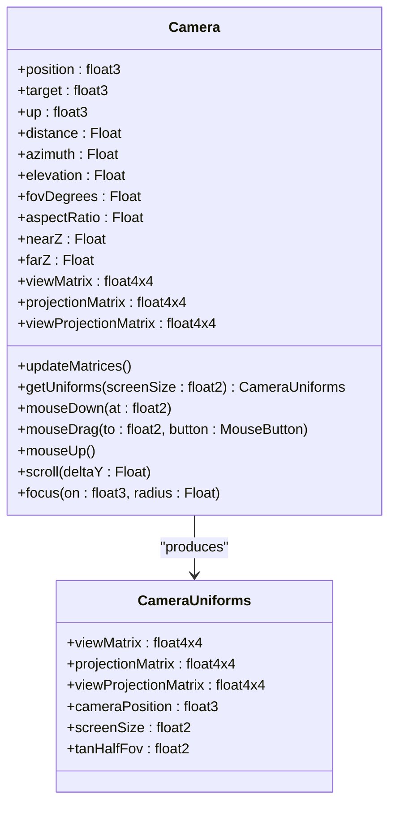
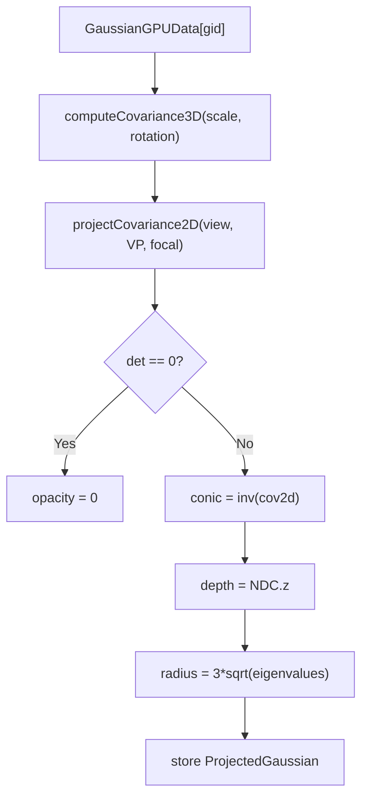
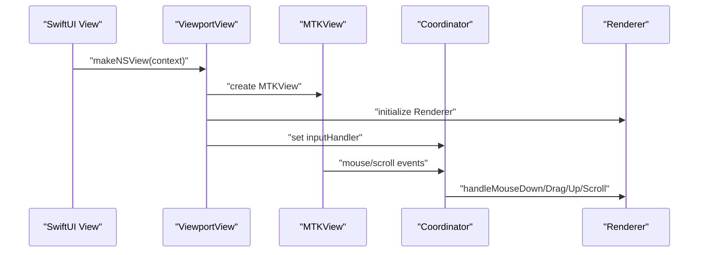
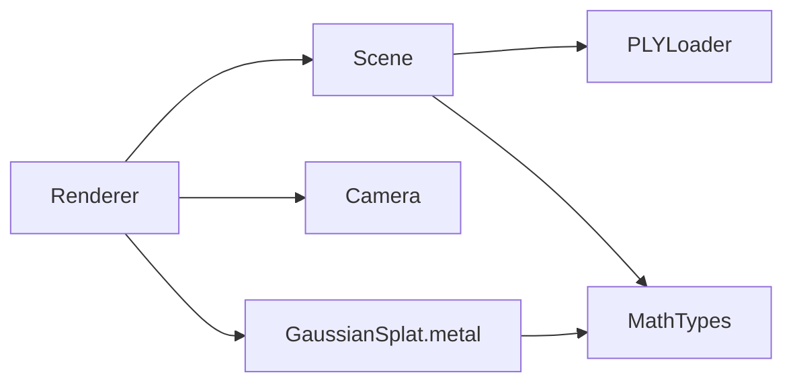

# Rendering Pipeline

<cite>
**Referenced Files in This Document**
- [GaussianSplatViewerApp.swift](file://GaussianSplatViewerApp.swift)
- [ContentView.swift](file://GaussianSplatViewer/ContentView.swift)
- [ViewportView.swift](file://UI/ViewportView.swift)
- [Renderer.swift](file://Rendering/Renderer.swift)
- [Camera.swift](file://Rendering/Camera.swift)
- [Scene.swift](file://Scene/Scene.swift)
- [PLYLoader.swift](file://Scene/PLYLoader.swift)
- [MathTypes.swift](file://Math/MathTypes.swift)
- [GaussianSplat.metal](file://Shaders/GaussianSplat.metal)
</cite>

## Table of Contents
1. [Introduction](#introduction)
2. [Project Structure](#project-structure)
3. [Core Components](#core-components)
4. [Architecture Overview](#architecture-overview)
5. [Detailed Component Analysis](#detailed-component-analysis)
6. [Dependency Analysis](#dependency-analysis)
7. [Performance Considerations](#performance-considerations)
8. [Troubleshooting Guide](#troubleshooting-guide)
9. [Conclusion](#conclusion)

## Introduction
This document describes the Gaussian Splat Viewer rendering pipeline architecture. It covers the multi-stage rendering process: a compute shader stage that projects 3D Gaussians into screen space and computes per-splat conic parameters and depth; GPU buffer management for intermediate data; and a Metal render pass that draws instanced quads representing splats. It also documents the compute pipeline workflow from initial data loading through projection, sorting, and final rasterization, along with the shader implementation in GaussianSplat.metal covering vertex transformation, fragment shading, and transparency handling. Integration between CPU-side rendering logic and GPU compute operations is explained, including synchronization points and data transfer patterns. Finally, performance optimization techniques, memory management strategies, and frame rate considerations are detailed, with pipeline diagrams, shader code analysis, and debugging approaches.

## Project Structure
The project follows a layered structure:
- Application entry point and SwiftUI views
- Rendering subsystem (Metal, compute, render passes)
- Scene management (PLY loading, GPU buffers)
- Math utilities for GPU-compatible structures and transformations
- Metal shaders for compute and graphics stages



**Diagram sources**
- [GaussianSplatViewerApp.swift:1-13](file://GaussianSplatViewerApp.swift#L1-L13)
- [ContentView.swift:10-20](file://GaussianSplatViewer/ContentView.swift#L10-L20)
- [ViewportView.swift:6-36](file://UI/ViewportView.swift#L6-L36)
- [Renderer.swift:7-77](file://Rendering/Renderer.swift#L7-L77)
- [Scene.swift:6-28](file://Scene/Scene.swift#L6-L28)
- [Camera.swift:5-60](file://Rendering/Camera.swift#L5-L60)
- [GaussianSplat.metal:138-201](file://Shaders/GaussianSplat.metal#L138-L201)

**Section sources**
- [GaussianSplatViewerApp.swift:1-13](file://GaussianSplatViewerApp.swift#L1-L13)
- [ContentView.swift:10-20](file://GaussianSplatViewer/ContentView.swift#L10-L20)
- [ViewportView.swift:6-36](file://UI/ViewportView.swift#L6-L36)
- [Renderer.swift:7-77](file://Rendering/Renderer.swift#L7-L77)
- [Scene.swift:6-28](file://Scene/Scene.swift#L6-L28)
- [Camera.swift:5-60](file://Rendering/Camera.swift#L5-L60)
- [GaussianSplat.metal:138-201](file://Shaders/GaussianSplat.metal#L138-L201)

## Core Components
- Renderer: Implements MTKViewDelegate, manages Metal device, command queue, pipelines, buffers, camera uniforms, and the draw loop. It performs compute dispatch, optional depth sorting, and render pass drawing.
- Scene: Loads Gaussian splats from PLY, constructs GPU buffers (splat data, projected data, indices), and exposes scene metrics.
- Camera: Maintains view/projection matrices, updates uniforms for GPU, and handles user input.
- PLYLoader: Parses PLY files (ASCII/binary) and extracts Gaussian properties.
- MathTypes: Defines GPU-compatible structures and math helpers for quaternions, matrices, and covariance computation.
- GaussianSplat.metal: Contains compute kernel for projection, vertex and fragment shaders for rasterization, and a sorting kernel.

Key responsibilities and interactions are detailed in later sections.

**Section sources**
- [Renderer.swift:7-287](file://Rendering/Renderer.swift#L7-L287)
- [Scene.swift:6-134](file://Scene/Scene.swift#L6-L134)
- [Camera.swift:5-177](file://Rendering/Camera.swift#L5-L177)
- [PLYLoader.swift:13-402](file://Scene/PLYLoader.swift#L13-L402)
- [MathTypes.swift:11-188](file://Math/MathTypes.swift#L11-L188)
- [GaussianSplat.metal:138-308](file://Shaders/GaussianSplat.metal#L138-L308)

## Architecture Overview
The rendering pipeline is a hybrid compute + graphics pipeline:
1. Compute pass: Each compute thread processes one Gaussian to produce a ProjectedGaussian record containing depth, UV, conic parameters, color, opacity, and radius.
2. Optional sorting: Depth sorting is planned (bitonic sort kernel exists) to improve compositing quality.
3. Render pass: Instanced draw of four-vertex quads per Gaussian splat, driven by the computed per-splat data.



**Diagram sources**
- [Renderer.swift:166-250](file://Rendering/Renderer.swift#L166-L250)
- [GaussianSplat.metal:138-201](file://Shaders/GaussianSplat.metal#L138-L201)
- [GaussianSplat.metal:205-270](file://Shaders/GaussianSplat.metal#L205-L270)

## Detailed Component Analysis

### Renderer: Multi-stage Pipeline and Buffer Management
- Device and command queue initialization, Metal library loading, and pipeline creation for compute and render stages.
- Triple-buffered camera uniforms buffer to decouple CPU updates from GPU consumption.
- Scene lifecycle: load PLY, create GPU buffers, focus camera.
- Draw loop:
  - Update camera uniforms into the triple-buffered uniform slot determined by frameCount modulo 3.
  - Compute pass: set splatBuffer and projectedBuffer, dispatch compute with thread group size 256.
  - Optional depth sorting: placeholder guarded by depthSortEnabled and interval.
  - Render pass: bind projectedBuffer and camera uniforms, draw indexed triangles with quad indices for instanced quads.
  - Command buffer completion handler logs errors.



**Diagram sources**
- [Renderer.swift:166-250](file://Rendering/Renderer.swift#L166-L250)
- [Renderer.swift:129-143](file://Rendering/Renderer.swift#L129-L143)
- [Renderer.swift:252-259](file://Rendering/Renderer.swift#L252-L259)

**Section sources**
- [Renderer.swift:7-77](file://Rendering/Renderer.swift#L7-L77)
- [Renderer.swift:129-143](file://Rendering/Renderer.swift#L129-L143)
- [Renderer.swift:166-250](file://Rendering/Renderer.swift#L166-L250)
- [Renderer.swift:252-259](file://Rendering/Renderer.swift#L252-L259)

### Scene: Data Loading and GPU Buffer Management
- Loads Gaussian splats from PLY via PLYLoader and converts to GPU-compatible structures.
- Creates:
  - Splat buffer: shared storage for GaussianGPUData.
  - Projected buffer: private storage for ProjectedGaussian outputs from compute.
  - Index buffer: private storage for sorting indices (bitonic sort kernel exists).
- Exposes isLoaded, splatCount, center, and radius for camera focusing.

```mermaid
classDiagram
class Scene {
+device : MTLDevice
+splatBuffer : MTLBuffer?
+projectedBuffer : MTLBuffer?
+indexBuffer : MTLBuffer?
+splatCount : Int
+isLoaded : Bool
+load(from : URL)
+load(from : Data)
-createGPUResources(for : [GaussianSplat])
+clear()
+boundingBox()
+center : float3
+radius : Float
}
class PLYLoader {
+load(from : URL) [GaussianSplat]
+load(from : Data) [GaussianSplat]
-parseHeader(Data) (Header, Int)
-parseASCIIVertices(...)
-parseBinaryVertices(...)
-parseVertex(...)
}
class GaussianSplat {
+position : float3
+scale : float3
+rotation : float4
+color : float3
+opacity : Float
}
class GaussianGPUData {
+position : float3
+scale : float3
+rotation : float4
+color : float3
+opacity : Float
}
Scene --> PLYLoader : "loads"
Scene --> GaussianGPUData : "creates buffers"
GaussianGPUData --> GaussianSplat : "init(from : )"
```

**Diagram sources**
- [Scene.swift:6-134](file://Scene/Scene.swift#L6-L134)
- [PLYLoader.swift:42-68](file://Scene/PLYLoader.swift#L42-L68)
- [MathTypes.swift:12-51](file://Math/MathTypes.swift#L12-L51)

**Section sources**
- [Scene.swift:30-95](file://Scene/Scene.swift#L30-L95)
- [PLYLoader.swift:42-68](file://Scene/PLYLoader.swift#L42-L68)
- [MathTypes.swift:12-51](file://Math/MathTypes.swift#L12-L51)

### Camera: Matrices and Uniforms
- Maintains position, target, up, FOV, aspect ratio, near/far planes.
- Computes viewMatrix, projectionMatrix, viewProjectionMatrix.
- Provides CameraUniforms for GPU, including screenSize and tanHalfFov.
- Handles mouse input to rotate, pan, zoom, and focus on scene.



**Diagram sources**
- [Camera.swift:5-147](file://Rendering/Camera.swift#L5-L147)
- [MathTypes.swift:54-62](file://Math/MathTypes.swift#L54-L62)

**Section sources**
- [Camera.swift:5-147](file://Rendering/Camera.swift#L5-L147)
- [MathTypes.swift:54-62](file://Math/MathTypes.swift#L54-L62)

### GaussianSplat.metal: Compute, Vertex, Fragment, and Sorting
- Structures:
  - GaussianGPUData: CPU-to-GPU Gaussian representation.
  - CameraUniforms: GPU uniforms for view/projection and screen parameters.
  - ProjectedGaussian: Output of compute pass for rasterization.
  - VertexOut: Inter-stage data for vertex shader.
- Compute shader (projectGaussians):
  - Builds 3D covariance from scale and rotation.
  - Projects covariance to 2D screen space using perspective Jacobian and view transform.
  - Computes conic (inverse covariance) and radius (3 sigma).
  - Stores depth, UV, conic, color, opacity, and radius.
- Vertex shader (gaussianVertex):
  - Builds quad vertices around projected UV.
  - Converts pixel positions to NDC and passes conic/color/opacity.
  - Discards invisible splats early.
- Fragment shader (gaussianFragment):
  - Evaluates 2D Gaussian using conic parameters.
  - Computes premultiplied alpha and discards near-zero alpha.
- Sorting kernel (bitonicSort):
  - Placeholder for depth-based sorting; exists in shader but not invoked in Renderer.



**Diagram sources**
- [GaussianSplat.metal:138-201](file://Shaders/GaussianSplat.metal#L138-L201)
- [GaussianSplat.metal:65-134](file://Shaders/GaussianSplat.metal#L65-L134)

**Section sources**
- [GaussianSplat.metal:6-42](file://Shaders/GaussianSplat.metal#L6-L42)
- [GaussianSplat.metal:138-201](file://Shaders/GaussianSplat.metal#L138-L201)
- [GaussianSplat.metal:205-270](file://Shaders/GaussianSplat.metal#L205-L270)
- [GaussianSplat.metal:274-308](file://Shaders/GaussianSplat.metal#L274-L308)

### UI Integration: SwiftUI + MTKView
- ViewportView wraps MTKView and wires input events to Renderer.
- ViewModel coordinates loading, error reporting, and publishing metrics.
- InteractiveMTKView forwards mouse and scroll events to the input handler.



**Diagram sources**
- [ViewportView.swift:6-90](file://UI/ViewportView.swift#L6-L90)
- [Renderer.swift:268-286](file://Rendering/Renderer.swift#L268-L286)

**Section sources**
- [ViewportView.swift:6-90](file://UI/ViewportView.swift#L6-L90)
- [Renderer.swift:268-286](file://Rendering/Renderer.swift#L268-L286)

## Dependency Analysis
- Renderer depends on Scene for GPU buffers and splat count, Camera for uniforms, and Metal library for compute and render pipelines.
- Scene depends on PLYLoader for data ingestion and MathTypes for GPU-compatible structures.
- GaussianSplat.metal defines the interface contracts for buffers and structures used by Renderer.



**Diagram sources**
- [Renderer.swift:7-77](file://Rendering/Renderer.swift#L7-L77)
- [Scene.swift:6-28](file://Scene/Scene.swift#L6-L28)
- [GaussianSplat.metal:138-201](file://Shaders/GaussianSplat.metal#L138-L201)

**Section sources**
- [Renderer.swift:7-77](file://Rendering/Renderer.swift#L7-L77)
- [Scene.swift:6-28](file://Scene/Scene.swift#L6-L28)
- [GaussianSplat.metal:138-201](file://Shaders/GaussianSplat.metal#L138-L201)

## Performance Considerations
- Compute dispatch sizing: Thread groups of 256; total thread groups computed from splatCount. This balances occupancy and memory bandwidth.
- Triple-buffered camera uniforms: Reduces CPU/GPU synchronization stalls by cycling through offsets based on frameCount modulo 3.
- Private vs shared buffers:
  - SplatBuffer: shared storage for CPU-hosted data uploaded once.
  - ProjectedBuffer and indexBuffer: private storage for compute outputs and sorting indices to minimize cache coherency overhead.
- Blending: Additive blending with premultiplied alpha reduces overdraw cost and improves correctness for overlapping splats.
- Early discard: Vertex shader discards invisible splats; fragment shader discards near-zero alpha to reduce fragment work.
- Sorting: Bitonic sort kernel exists; currently disabled to keep the pipeline simple. Enabling it would improve compositing quality at the cost of additional compute passes and memory bandwidth.

[No sources needed since this section provides general guidance]

## Troubleshooting Guide
Common issues and diagnostics:
- No splats rendered:
  - Verify Scene.isLoaded and that splatBuffer/projectedBuffer/indexBuffer are created.
  - Ensure PLYLoader successfully parsed required properties (position).
- Incorrect projection or splats off-screen:
  - Confirm Camera.updateMatrices and getUniforms are called before compute dispatch.
  - Check aspect ratio updates on drawable resize.
- Blending artifacts:
  - Ensure additive blending is enabled and premultiplied alpha is used in fragment shader.
- Performance drops:
  - Monitor splat count; consider enabling depth sorting if quality degrades with overlap.
  - Validate compute dispatch sizes and buffer memory usage.

**Section sources**
- [Renderer.swift:166-250](file://Rendering/Renderer.swift#L166-L250)
- [Scene.swift:19-24](file://Scene/Scene.swift#L19-L24)
- [Camera.swift:63-84](file://Rendering/Camera.swift#L63-L84)
- [GaussianSplat.metal:111-119](file://Shaders/GaussianSplat.metal#L111-L119)
- [GaussianSplat.metal:268-270](file://Shaders/GaussianSplat.metal#L268-L270)

## Conclusion
The Gaussian Splat Viewer implements a clean, efficient Metal-based rendering pipeline. The compute stage projects Gaussians and prepares per-splat data for rasterization, while the render stage draws instanced quads with correct transparency. GPU buffer management uses triple-buffered uniforms and private buffers for optimal performance. The architecture is modular, with clear separation between CPU-side orchestration, GPU compute, and graphics rendering. Future enhancements include enabling depth sorting and optimizing buffer usage patterns for very large datasets.