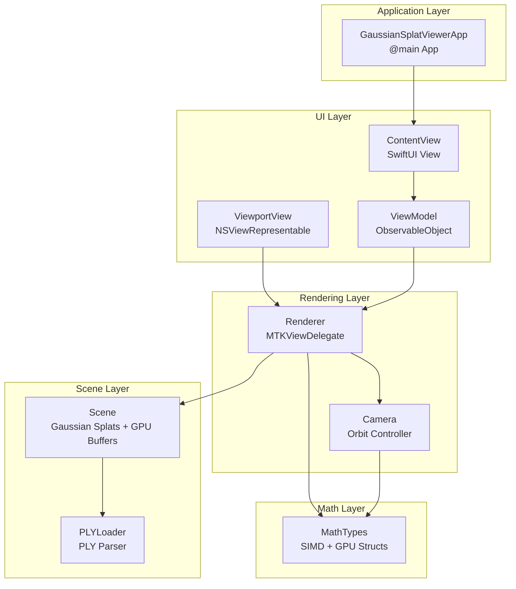
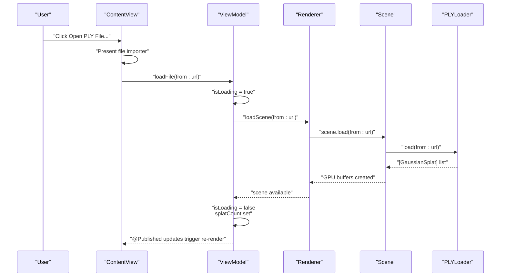
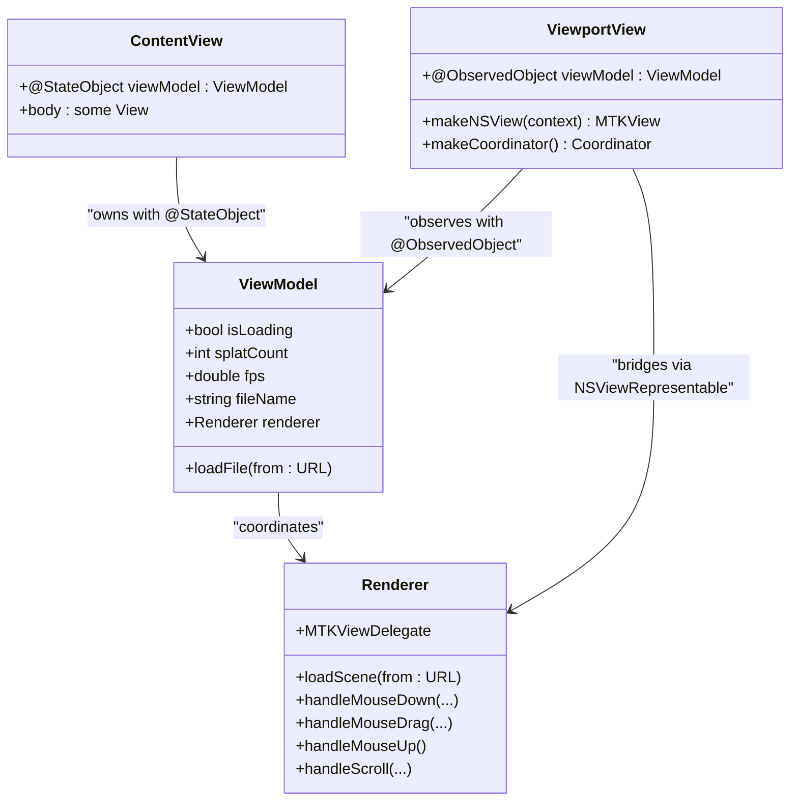
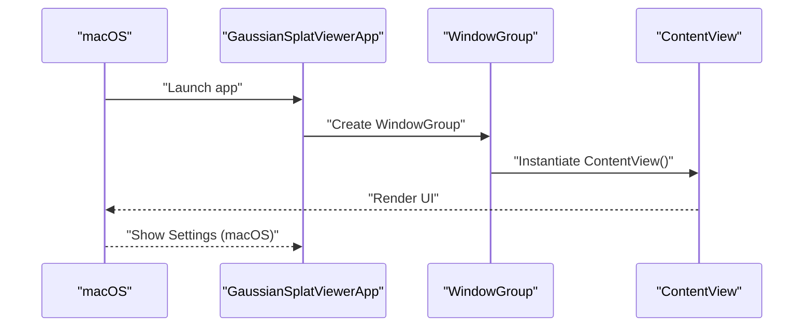
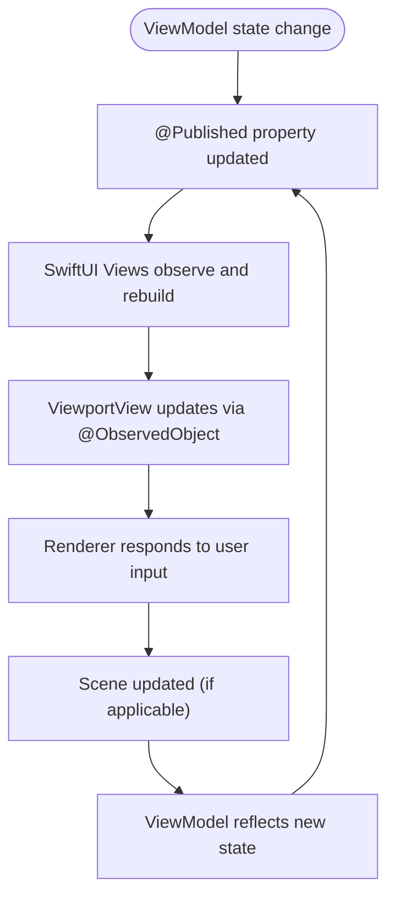
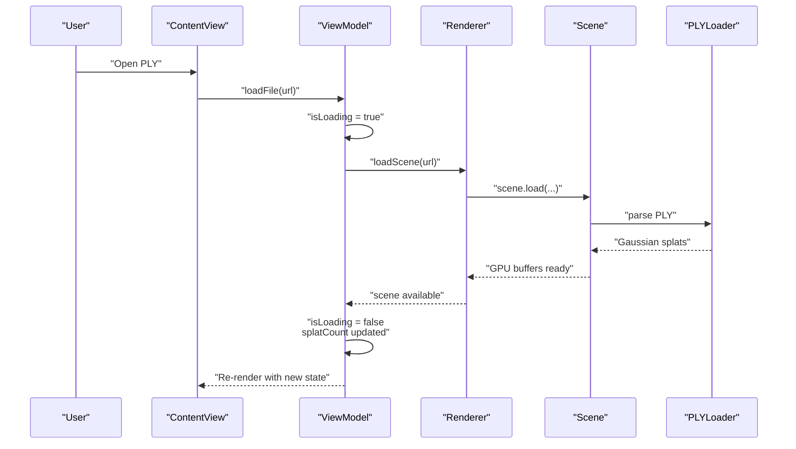
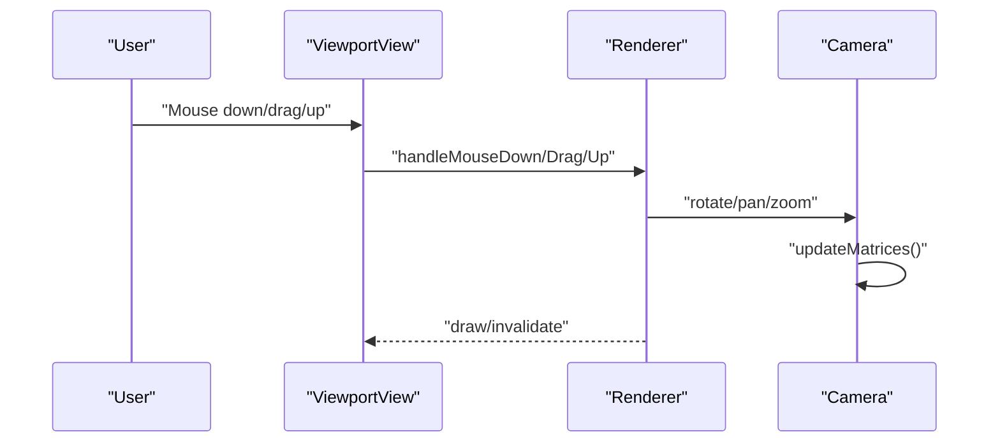
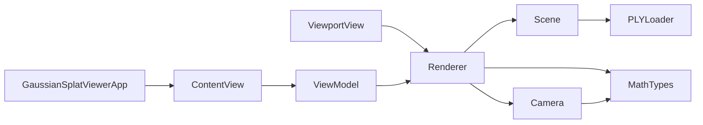

# System Design Patterns

<cite>
**Referenced Files in This Document**
- [GaussianSplatViewerApp.swift](file://Sources/GaussianSplatViewerApp.swift)
- [ContentView.swift](file://Sources/UI/ContentView.swift)
- [ViewportView.swift](file://Sources/UI/ViewportView.swift)
- [Renderer.swift](file://Sources/Rendering/Renderer.swift)
- [Scene.swift](file://Sources/Scene/Scene.swift)
- [Camera.swift](file://Sources/Rendering/Camera.swift)
- [PLYLoader.swift](file://Sources/Scene/PLYLoader.swift)
- [MathTypes.swift](file://Sources/Math/MathTypes.swift)
- [Package.swift](file://Package.swift)
</cite>

## Table of Contents
1. [Introduction](#introduction)
2. [Project Structure](#project-structure)
3. [Core Components](#core-components)
4. [Architecture Overview](#architecture-overview)
5. [Detailed Component Analysis](#detailed-component-analysis)
6. [Dependency Analysis](#dependency-analysis)
7. [Performance Considerations](#performance-considerations)
8. [Troubleshooting Guide](#troubleshooting-guide)
9. [Conclusion](#conclusion)

## Introduction
This document explains the system design patterns used in the 3DGS Gaussian Splatting viewer, focusing on the MVVM (Model-View-ViewModel) architecture implemented with SwiftUI. It demonstrates how reactive programming principles are applied using @StateObject, @ObservedObject, and @Published properties to manage observable state. The separation of concerns is highlighted between UI components (ContentView, ViewportView) and business logic through the ViewModel. The observer pattern is implemented to propagate state changes reactively across the application. Concrete examples from GaussianSplatViewerApp illustrate SwiftUI conventions, and the @main App lifecycle and window management are addressed. Finally, the document outlines how these design patterns improve maintainability, testability, and the separation between UI presentation and core functionality.

## Project Structure
The project is organized by domain and technology:
- UI layer: SwiftUI views and view models
- Rendering layer: Metal-based renderer and camera controls
- Scene layer: Scene graph and PLY file loading
- Math layer: GPU-compatible data structures and math utilities
- Application entry point: @main App lifecycle

**Diagram sources**
- [GaussianSplatViewerApp.swift:1-65](file://Sources/GaussianSplatViewerApp.swift#L1-L65)
- [ContentView.swift:1-119](file://Sources/UI/ContentView.swift#L1-L119)
- [ViewportView.swift:1-118](file://Sources/UI/ViewportView.swift#L1-L118)
- [Renderer.swift:1-288](file://Sources/Rendering/Renderer.swift#L1-L288)
- [Scene.swift:1-130](file://Sources/Scene/Scene.swift#L1-L130)
- [PLYLoader.swift:1-386](file://Sources/Scene/PLYLoader.swift#L1-L386)
- [MathTypes.swift:1-189](file://Sources/Math/MathTypes.swift#L1-L189)

**Section sources**
- [Package.swift:1-17](file://Package.swift#L1-L17)
- [GaussianSplatViewerApp.swift:1-65](file://Sources/GaussianSplatViewerApp.swift#L1-L65)

## Core Components
- App lifecycle and window management: The @main App defines the primary WindowGroup and macOS Settings scene, setting default window size and platform-specific UI.
- ContentView: The root SwiftUI View that composes toolbar, viewport, overlays, and file import flow. It owns the ViewModel with @StateObject and observes its published state.
- ViewModel: ObservableObject coordinating UI state and orchestrating asynchronous scene loading and renderer updates.
- ViewportView: NSViewRepresentable bridging Metal MTKView into SwiftUI, forwarding user input to the renderer via the ViewModel.
- Renderer: MTKViewDelegate managing Metal pipelines, compute passes, and render passes, interacting with Scene and Camera.
- Scene: Manages Gaussian splats and GPU buffers, loading from PLY via PLYLoader.
- Camera: Orbit camera controlling view/projection matrices and responding to mouse input.
- MathTypes: SIMD aliases and GPU-compatible structures for efficient Metal compute and rendering.

These components collectively implement MVVM with reactive state propagation and clear separation of concerns.

**Section sources**
- [GaussianSplatViewerApp.swift:1-65](file://Sources/GaussianSplatViewerApp.swift#L1-L65)
- [ContentView.swift:1-119](file://Sources/UI/ContentView.swift#L1-L119)
- [ViewportView.swift:96-117](file://Sources/UI/ViewportView.swift#L96-L117)
- [Renderer.swift:7-287](file://Sources/Rendering/Renderer.swift#L7-L287)
- [Scene.swift:4-124](file://Sources/Scene/Scene.swift#L4-L124)
- [Camera.swift:4-177](file://Sources/Rendering/Camera.swift#L4-L177)
- [MathTypes.swift:4-73](file://Sources/Math/MathTypes.swift#L4-L73)

## Architecture Overview
The MVVM architecture separates UI (View) from business logic (ViewModel) and exposes observable state (@Published) for reactive updates. SwiftUI’s declarative UI reacts automatically to ViewModel changes. The ViewModel holds references to Renderer and Scene, while ViewportView bridges Metal rendering into SwiftUI.

**Diagram sources**
- [ContentView.swift:95-113](file://Sources/UI/ContentView.swift#L95-L113)
- [ViewportView.swift:104-116](file://Sources/UI/ViewportView.swift#L104-L116)
- [Renderer.swift:149-162](file://Sources/Rendering/Renderer.swift#L149-L162)
- [Scene.swift:24-49](file://Sources/Scene/Scene.swift#L24-L49)
- [PLYLoader.swift:41-68](file://Sources/Scene/PLYLoader.swift#L41-L68)

## Detailed Component Analysis

### MVVM Implementation and Reactive State Management
- ViewModel as ObservableObject: Exposes @Published properties (isLoading, splatCount, fps, fileName) enabling reactive updates in Views.
- ContentView as View: Owns the ViewModel with @StateObject and binds UI to ViewModel state. Uses @ObservedObject in ViewportView to receive updates.
- Reactive updates: Changes to @Published properties propagate automatically to SwiftUI Views, updating UI without manual observers.

**Diagram sources**
- [ViewportView.swift:96-117](file://Sources/UI/ViewportView.swift#L96-L117)
- [ContentView.swift:3-4](file://Sources/UI/ContentView.swift#L3-L4)
- [ViewportView.swift:5-6](file://Sources/UI/ViewportView.swift#L5-L6)
- [Renderer.swift:7-287](file://Sources/Rendering/Renderer.swift#L7-L287)

**Section sources**
- [ViewportView.swift:96-117](file://Sources/UI/ViewportView.swift#L96-L117)
- [ContentView.swift:3-4](file://Sources/UI/ContentView.swift#L3-L4)

### SwiftUI Conventions and App Lifecycle
- @main App: Defines the primary WindowGroup hosting ContentView and macOS Settings scene with a tabbed General settings view.
- Window management: Sets default window size and title bar style.
- Preview support: ContentView includes a preview declaration for development.

**Diagram sources**
- [GaussianSplatViewerApp.swift:4-17](file://Sources/GaussianSplatViewerApp.swift#L4-L17)
- [GaussianSplatViewerApp.swift:21-63](file://Sources/GaussianSplatViewerApp.swift#L21-L63)

**Section sources**
- [GaussianSplatViewerApp.swift:1-65](file://Sources/GaussianSplatViewerApp.swift#L1-L65)

### Observer Pattern and Reactive Updates
- @Published properties: ViewModel publishes state changes; SwiftUI Views observe and rebuild accordingly.
- NSViewRepresentable coordination: ViewportView receives ViewModel updates and forwards user input to Renderer.
- MTKViewDelegate updates: Renderer drives Metal rendering and can notify ViewModel indirectly through shared references.

**Diagram sources**
- [ViewportView.swift:96-117](file://Sources/UI/ViewportView.swift#L96-L117)
- [Renderer.swift:268-287](file://Sources/Rendering/Renderer.swift#L268-L287)

**Section sources**
- [ViewportView.swift:96-117](file://Sources/UI/ViewportView.swift#L96-L117)
- [Renderer.swift:268-287](file://Sources/Rendering/Renderer.swift#L268-L287)

### Scene Loading Workflow
- File import: ContentView triggers file picker and delegates to ViewModel.
- Asynchronous loading: ViewModel switches to loading state, invokes Renderer to load Scene, then updates state on main queue.
- UI overlays: Loading indicator and instructions overlay are shown conditionally based on ViewModel state.

**Diagram sources**
- [ContentView.swift:95-113](file://Sources/UI/ContentView.swift#L95-L113)
- [ViewportView.swift:104-116](file://Sources/UI/ViewportView.swift#L104-L116)
- [Renderer.swift:149-162](file://Sources/Rendering/Renderer.swift#L149-L162)
- [Scene.swift:24-49](file://Sources/Scene/Scene.swift#L24-L49)
- [PLYLoader.swift:41-68](file://Sources/Scene/PLYLoader.swift#L41-L68)

**Section sources**
- [ContentView.swift:95-113](file://Sources/UI/ContentView.swift#L95-L113)
- [ViewportView.swift:104-116](file://Sources/UI/ViewportView.swift#L104-L116)
- [Renderer.swift:149-162](file://Sources/Rendering/Renderer.swift#L149-L162)
- [Scene.swift:24-49](file://Sources/Scene/Scene.swift#L24-L49)
- [PLYLoader.swift:41-68](file://Sources/Scene/PLYLoader.swift#L41-L68)

### Camera Controls and Mouse Events
- ViewportView handles mouse events and forwards them to Renderer via ViewModel.
- Renderer translates events into Camera operations (rotate, pan, zoom).
- Camera updates matrices and uniforms consumed by Metal shaders.

**Diagram sources**
- [ViewportView.swift:51-92](file://Sources/UI/ViewportView.swift#L51-L92)
- [Renderer.swift:270-286](file://Sources/Rendering/Renderer.swift#L270-L286)
- [Camera.swift:86-177](file://Sources/Rendering/Camera.swift#L86-L177)

**Section sources**
- [ViewportView.swift:51-92](file://Sources/UI/ViewportView.swift#L51-L92)
- [Renderer.swift:270-286](file://Sources/Rendering/Renderer.swift#L270-L286)
- [Camera.swift:86-177](file://Sources/Rendering/Camera.swift#L86-L177)

## Dependency Analysis
The following diagram shows key dependencies among components:

**Diagram sources**
- [GaussianSplatViewerApp.swift:4-17](file://Sources/GaussianSplatViewerApp.swift#L4-L17)
- [ContentView.swift:3-4](file://Sources/UI/ContentView.swift#L3-L4)
- [ViewportView.swift:5-6](file://Sources/UI/ViewportView.swift#L5-L6)
- [Renderer.swift:7-287](file://Sources/Rendering/Renderer.swift#L7-L287)
- [Scene.swift:4-124](file://Sources/Scene/Scene.swift#L4-L124)
- [PLYLoader.swift:13-68](file://Sources/Scene/PLYLoader.swift#L13-L68)
- [Camera.swift:5-177](file://Sources/Rendering/Camera.swift#L5-L177)
- [MathTypes.swift:4-73](file://Sources/Math/MathTypes.swift#L4-L73)

**Section sources**
- [GaussianSplatViewerApp.swift:1-65](file://Sources/GaussianSplatViewerApp.swift#L1-L65)
- [ContentView.swift:1-119](file://Sources/UI/ContentView.swift#L1-L119)
- [ViewportView.swift:1-118](file://Sources/UI/ViewportView.swift#L1-L118)
- [Renderer.swift:1-288](file://Sources/Rendering/Renderer.swift#L1-L288)
- [Scene.swift:1-130](file://Sources/Scene/Scene.swift#L1-L130)
- [PLYLoader.swift:1-386](file://Sources/Scene/PLYLoader.swift#L1-L386)
- [Camera.swift:1-184](file://Sources/Rendering/Camera.swift#L1-L184)
- [MathTypes.swift:1-189](file://Sources/Math/MathTypes.swift#L1-L189)

## Performance Considerations
- Asynchronous loading: Scene loading occurs on a global queue; UI updates are dispatched to the main queue to keep the UI responsive.
- Triple-buffered camera uniforms: Reduces CPU/GPU synchronization overhead in Metal rendering.
- Frame-based depth sorting: Controlled interval reduces compute overhead while maintaining visual quality.
- Efficient GPU buffers: Scene creates buffers for splats and projections to minimize transfers and maximize throughput.

[No sources needed since this section provides general guidance]

## Troubleshooting Guide
- File import errors: ContentView prints file picker errors to the console. Verify file permissions and security-scoped resource access.
- Metal library loading: Renderer attempts to load a precompiled metallib and falls back to compiling from source. Ensure shader resources are bundled.
- Scene loading failures: Renderer catches and logs errors during scene load; confirm PLY file validity and required properties.
- Camera sensitivity: Adjust Camera sensitivity constants to fine-tune interaction responsiveness.

**Section sources**
- [ContentView.swift:109-111](file://Sources/UI/ContentView.swift#L109-L111)
- [Renderer.swift:47-55](file://Sources/Rendering/Renderer.swift#L47-L55)
- [Renderer.swift:159-161](file://Sources/Rendering/Renderer.swift#L159-L161)
- [Camera.swift:32-34](file://Sources/Rendering/Camera.swift#L32-L34)

## Conclusion
The 3DGS Gaussian Splatting viewer demonstrates a clean MVVM architecture with SwiftUI, leveraging @StateObject, @ObservedObject, and @Published properties for reactive state management. The separation of concerns ensures that UI components remain presentation-focused while business logic resides in the ViewModel and underlying rendering/graphic systems. The observer pattern enables automatic UI updates, and the @main App lifecycle provides straightforward window management. These design patterns collectively enhance maintainability, testability, and modularity, allowing developers to evolve UI and rendering independently.