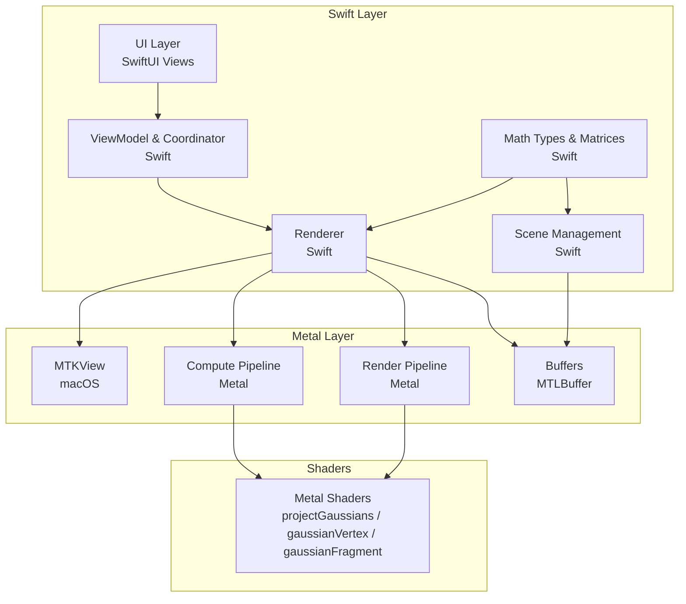
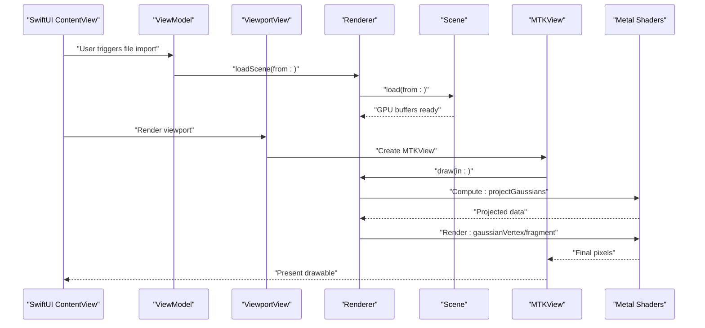
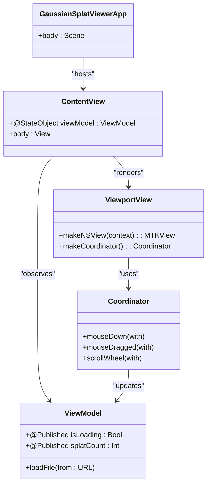
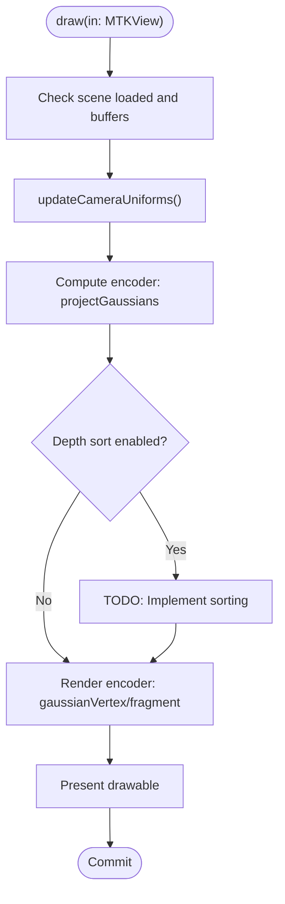
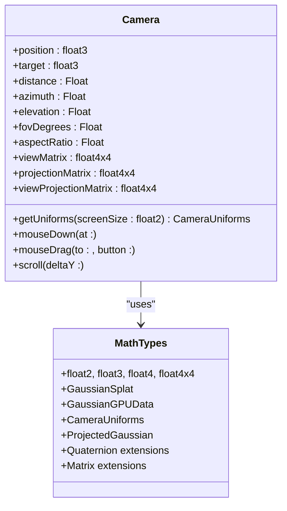
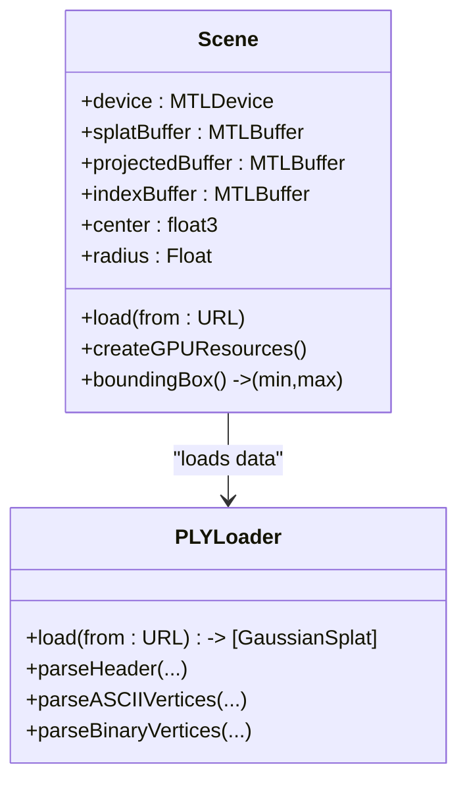
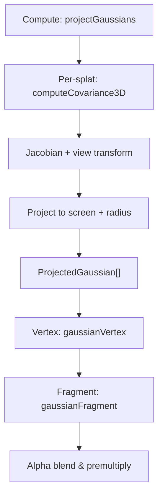
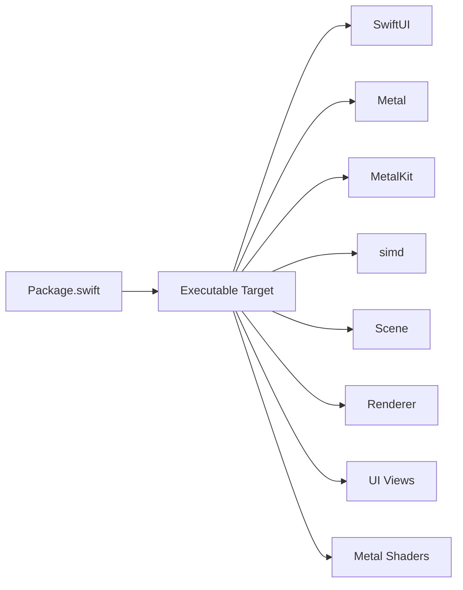

# Technology Stack

<cite>
**Referenced Files in This Document**
- [Package.swift](file://Package.swift)
- [GaussianSplatViewerApp.swift](file://Sources/GaussianSplatViewerApp.swift)
- [ContentView.swift](file://Sources/UI/ContentView.swift)
- [ViewportView.swift](file://Sources/UI/ViewportView.swift)
- [Renderer.swift](file://Sources/Rendering/Renderer.swift)
- [Camera.swift](file://Sources/Rendering/Camera.swift)
- [Scene.swift](file://Sources/Scene/Scene.swift)
- [MathTypes.swift](file://Sources/Math/MathTypes.swift)
- [PLYLoader.swift](file://Sources/Scene/PLYLoader.swift)
- [GaussianSplat.metal](file://Sources/Shaders/GaussianSplat.metal)
</cite>

## Table of Contents
1. [Introduction](#introduction)
2. [Project Structure](#project-structure)
3. [Core Components](#core-components)
4. [Architecture Overview](#architecture-overview)
5. [Detailed Component Analysis](#detailed-component-analysis)
6. [Dependency Analysis](#dependency-analysis)
7. [Performance Considerations](#performance-considerations)
8. [Troubleshooting Guide](#troubleshooting-guide)
9. [Conclusion](#conclusion)

## Introduction
This document explains the technology stack used in the 3D Gaussian Splatting viewer. It focuses on Swift as the primary development language and its integration with macOS frameworks, SwiftUI for declarative UI and reactive state management, Metal for GPU acceleration (compute shaders, render pipelines, and buffer management), and the simd vector math library for GPU-compatible mathematical operations. It also covers platform requirements, Swift Package Manager integration, and version compatibility rationale for achieving optimal performance in 3D Gaussian rendering.

## Project Structure
The project is organized around a clear separation of concerns:
- UI layer built with SwiftUI and wrapped Metal viewport
- Rendering pipeline implemented in Swift with Metal interop
- Math types and GPU-compatible structures in Swift
- Metal shaders written in Metal Shading Language (GLSL-like)
- Scene loading and PLY parsing utilities

**Diagram sources**
- [ContentView.swift:1-119](file://Sources/UI/ContentView.swift#L1-L119)
- [ViewportView.swift:1-118](file://Sources/UI/ViewportView.swift#L1-L118)
- [Renderer.swift:1-288](file://Sources/Rendering/Renderer.swift#L1-L288)
- [Scene.swift:1-130](file://Sources/Scene/Scene.swift#L1-L130)
- [MathTypes.swift:1-189](file://Sources/Math/MathTypes.swift#L1-L189)
- [GaussianSplat.metal:1-309](file://Sources/Shaders/GaussianSplat.metal#L1-L309)

**Section sources**
- [Package.swift:1-17](file://Package.swift#L1-L17)
- [GaussianSplatViewerApp.swift:1-65](file://Sources/GaussianSplatViewerApp.swift#L1-L65)
- [ContentView.swift:1-119](file://Sources/UI/ContentView.swift#L1-L119)
- [Renderer.swift:1-288](file://Sources/Rendering/Renderer.swift#L1-L288)
- [MathTypes.swift:1-189](file://Sources/Math/MathTypes.swift#L1-L189)
- [GaussianSplat.metal:1-309](file://Sources/Shaders/GaussianSplat.metal#L1-L309)

## Core Components
- Swift as the primary language: Implements UI, rendering, math, and scene management.
- SwiftUI: Declarative UI with reactive state (@Published, @StateObject) and integration with Metal via NSViewRepresentable.
- Metal: GPU acceleration with compute and render pipelines, triple-buffered camera uniforms, and instanced rendering.
- simd: Vector math and matrices for GPU-compatible transformations and camera uniforms.
- Metal Shading Language: Compute and fragment shaders for Gaussian projection and rasterization.

Why these technologies were chosen:
- Swift delivers modern performance, safety, and interoperability with Apple frameworks.
- SwiftUI enables rapid UI development with reactive state and seamless integration with MetalKit.
- Metal provides low-level GPU control for compute and rendering, essential for real-time Gaussian splatting.
- simd ensures vectorized math operations compatible with GPU layouts and efficient memory alignment.

**Section sources**
- [GaussianSplatViewerApp.swift:1-65](file://Sources/GaussianSplatViewerApp.swift#L1-L65)
- [ContentView.swift:1-119](file://Sources/UI/ContentView.swift#L1-L119)
- [Renderer.swift:1-288](file://Sources/Rendering/Renderer.swift#L1-L288)
- [MathTypes.swift:1-189](file://Sources/Math/MathTypes.swift#L1-L189)
- [GaussianSplat.metal:1-309](file://Sources/Shaders/GaussianSplat.metal#L1-L309)

## Architecture Overview
The app follows a layered architecture:
- UI layer (SwiftUI) manages user interactions and displays the Metal viewport.
- ViewModel and Coordinator bridge SwiftUI to the renderer.
- Renderer encapsulates Metal setup, pipelines, buffers, and drawing loop.
- Scene holds CPU and GPU data for Gaussian splats and exposes GPU buffers.
- MathTypes defines GPU-compatible structures and matrix utilities.
- Shaders implement compute projection and fragment blending.

**Diagram sources**
- [ContentView.swift:95-118](file://Sources/UI/ContentView.swift#L95-L118)
- [ViewportView.swift:8-31](file://Sources/UI/ViewportView.swift#L8-L31)
- [Renderer.swift:171-250](file://Sources/Rendering/Renderer.swift#L171-L250)
- [Scene.swift:24-85](file://Sources/Scene/Scene.swift#L24-L85)
- [GaussianSplat.metal:138-270](file://Sources/Shaders/GaussianSplat.metal#L138-L270)

## Detailed Component Analysis

### Swift and SwiftUI Integration
- App entry point uses SwiftUI App protocol with macOS-specific settings.
- ContentView composes toolbar, viewport, overlays, and file importer.
- ViewModel publishes state changes; ViewportView bridges to MTKView via NSViewRepresentable.
- Coordinator handles mouse and scroll events and forwards to Renderer.

**Diagram sources**
- [GaussianSplatViewerApp.swift:3-18](file://Sources/GaussianSplatViewerApp.swift#L3-L18)
- [ContentView.swift:3-119](file://Sources/UI/ContentView.swift#L3-L119)
- [ViewportView.swift:5-93](file://Sources/UI/ViewportView.swift#L5-L93)
- [ViewportView.swift:96-118](file://Sources/UI/ViewportView.swift#L96-L118)

**Section sources**
- [GaussianSplatViewerApp.swift:1-65](file://Sources/GaussianSplatViewerApp.swift#L1-L65)
- [ContentView.swift:1-119](file://Sources/UI/ContentView.swift#L1-L119)
- [ViewportView.swift:1-118](file://Sources/UI/ViewportView.swift#L1-L118)

### Metal Rendering Pipeline
- Renderer sets up MTKView, creates compute and render pipelines, and manages buffers.
- Triple-buffered camera uniforms enable CPU/GPU synchronization.
- Instanced rendering draws quads per Gaussian with indexed triangles.
- Depth sorting placeholder indicates future enhancement.

**Diagram sources**
- [Renderer.swift:171-250](file://Sources/Rendering/Renderer.swift#L171-L250)
- [Renderer.swift:252-259](file://Sources/Rendering/Renderer.swift#L252-L259)

**Section sources**
- [Renderer.swift:1-288](file://Sources/Rendering/Renderer.swift#L1-L288)

### Camera and Math Types
- Camera maintains orbit controls, matrices, and sensitivity parameters.
- MathTypes defines GPU-compatible structures and SIMD-based matrix utilities.
- Camera uniforms include matrices, camera position, screen size, and FOV tangents.

**Diagram sources**
- [Camera.swift:5-184](file://Sources/Rendering/Camera.swift#L5-L184)
- [MathTypes.swift:4-189](file://Sources/Math/MathTypes.swift#L4-L189)

**Section sources**
- [Camera.swift:1-184](file://Sources/Rendering/Camera.swift#L1-L184)
- [MathTypes.swift:1-189](file://Sources/Math/MathTypes.swift#L1-L189)

### Scene and Buffer Management
- Scene loads Gaussian splats from PLY and creates GPU buffers.
- GPU buffers include splat data, projected data, and optional index buffer.
- Scene computes bounding box and radius to focus camera.

**Diagram sources**
- [Scene.swift:4-130](file://Sources/Scene/Scene.swift#L4-L130)
- [PLYLoader.swift:13-386](file://Sources/Scene/PLYLoader.swift#L13-L386)

**Section sources**
- [Scene.swift:1-130](file://Sources/Scene/Scene.swift#L1-L130)
- [PLYLoader.swift:1-386](file://Sources/Scene/PLYLoader.swift#L1-L386)

### Metal Shaders
- Compute shader projects Gaussians to screen space, computing covariance and radius.
- Vertex shader generates quad vertices per instance and writes depth-normalized positions.
- Fragment shader evaluates 2D Gaussian, applies premultiplied alpha, and discards small contributions.

**Diagram sources**
- [GaussianSplat.metal:138-198](file://Sources/Shaders/GaussianSplat.metal#L138-L198)
- [GaussianSplat.metal:202-241](file://Sources/Shaders/GaussianSplat.metal#L202-L241)
- [GaussianSplat.metal:245-270](file://Sources/Shaders/GaussianSplat.metal#L245-L270)

**Section sources**
- [GaussianSplat.metal:1-309](file://Sources/Shaders/GaussianSplat.metal#L1-L309)

## Dependency Analysis
- Swift Package Manager defines the executable product and macOS platform requirement.
- Application integrates SwiftUI, Metal, MetalKit, and simd.
- External frameworks are accessed through standard macOS SDKs.

**Diagram sources**
- [Package.swift:4-16](file://Package.swift#L4-L16)
- [Renderer.swift:1-5](file://Sources/Rendering/Renderer.swift#L1-L5)
- [GaussianSplatViewerApp.swift:1](file://Sources/GaussianSplatViewerApp.swift#L1)

**Section sources**
- [Package.swift:1-17](file://Package.swift#L1-L17)
- [Renderer.swift:1-5](file://Sources/Rendering/Renderer.swift#L1-L5)

## Performance Considerations
- Triple-buffered camera uniforms reduce CPU/GPU synchronization stalls.
- Compute shader dispatches per Gaussian with 256-thread groups for throughput.
- Instanced rendering minimizes draw calls; quad indices reused for all instances.
- Depth sorting placeholder indicates potential future use of GPU sorting kernels.
- simd vector math aligns with GPU memory layout and improves cache coherency.

[No sources needed since this section provides general guidance]

## Troubleshooting Guide
Common issues and remedies:
- Metal library not found: Renderer attempts to load compiled metallib and falls back to default library; verify shader compilation and bundle embedding.
- Missing shader functions: Ensure compute and vertex/fragment functions match names used by Renderer.
- Buffer creation failures: Scene throws errors when GPU buffer allocation fails; confirm device capabilities and memory availability.
- PLY parsing errors: Loader reports missing elements or unsupported formats; validate PLY header and property names.

**Section sources**
- [Renderer.swift:46-55](file://Sources/Rendering/Renderer.swift#L46-L55)
- [Renderer.swift:83-95](file://Sources/Rendering/Renderer.swift#L83-L95)
- [Scene.swift:61-80](file://Sources/Scene/Scene.swift#L61-L80)
- [PLYLoader.swift:42-68](file://Sources/Scene/PLYLoader.swift#L42-L68)

## Conclusion
The 3D Gaussian Splatting viewer combines Swift, SwiftUI, Metal, and simd to deliver a performant, modern macOS application. Swift’s safety and expressiveness streamline UI and rendering logic, while SwiftUI’s declarative paradigm accelerates development. Metal provides the necessary compute and rendering throughput, and simd ensures GPU-compatible math. Together, these technologies enable interactive exploration of large-scale Gaussian splatting datasets with responsive UI and efficient GPU utilization.