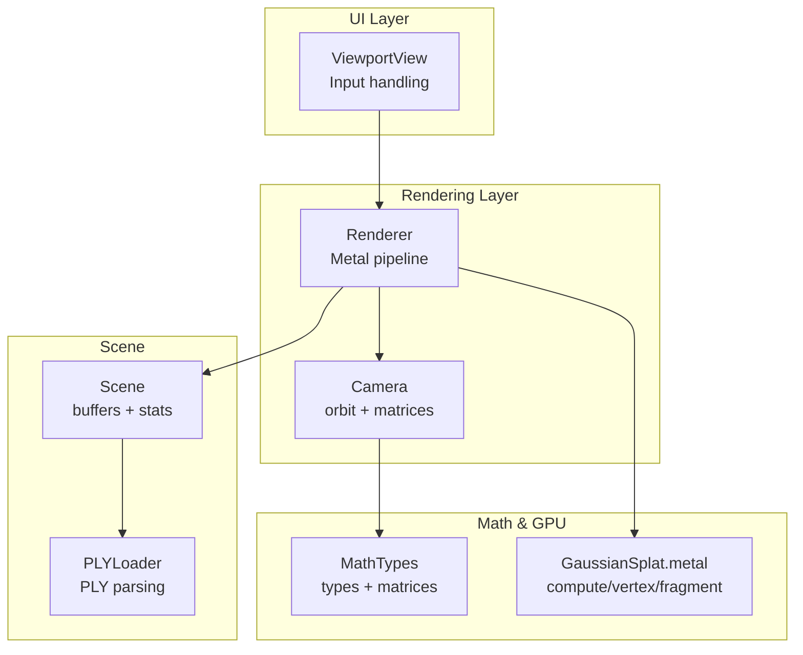
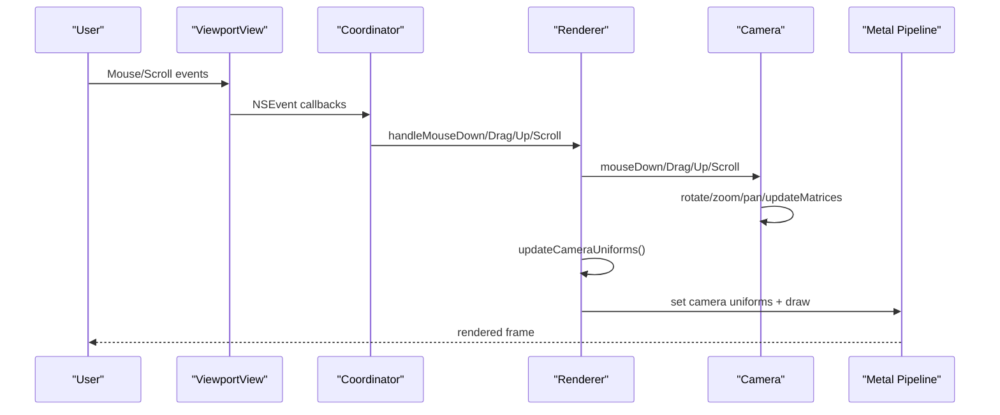
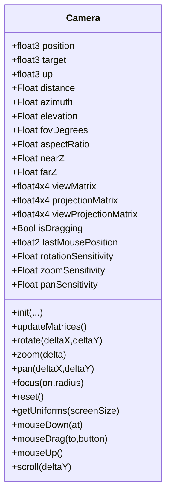
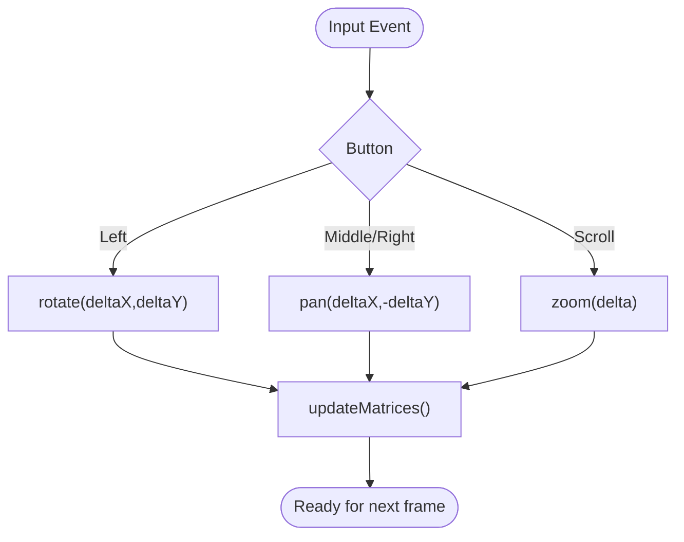
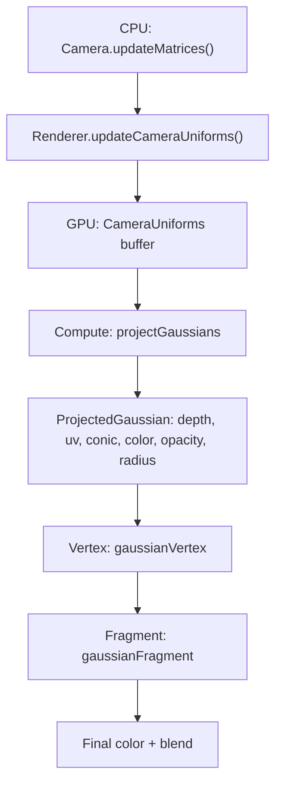
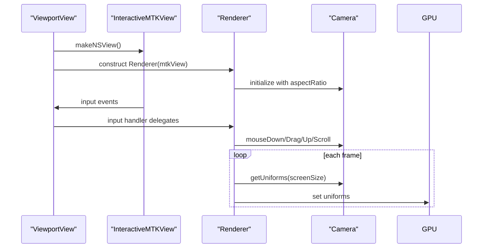
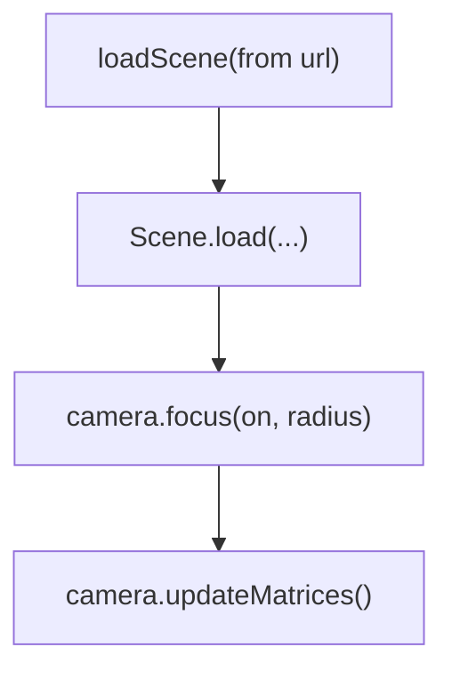
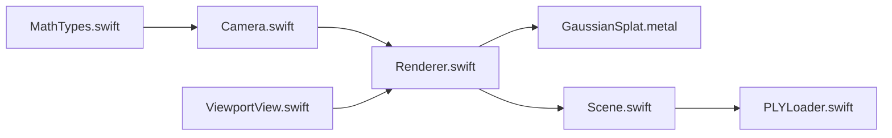

# Camera System

<cite>
**Referenced Files in This Document**
- [Camera.swift](file://Rendering/Camera.swift)
- [Renderer.swift](file://Rendering/Renderer.swift)
- [ViewportView.swift](file://UI/ViewportView.swift)
- [MathTypes.swift](file://Math/MathTypes.swift)
- [GaussianSplat.metal](file://Shaders/GaussianSplat.metal)
- [Scene.swift](file://Scene/Scene.swift)
- [PLYLoader.swift](file://Scene/PLYLoader.swift)
</cite>

## Table of Contents
1. [Introduction](#introduction)
2. [Project Structure](#project-structure)
3. [Core Components](#core-components)
4. [Architecture Overview](#architecture-overview)
5. [Detailed Component Analysis](#detailed-component-analysis)
6. [Dependency Analysis](#dependency-analysis)
7. [Performance Considerations](#performance-considerations)
8. [Troubleshooting Guide](#troubleshooting-guide)
9. [Conclusion](#conclusion)

## Introduction
This document explains the interactive orbit camera system used in the Gaussian Splatting viewer. It covers the spherical coordinate system for camera positioning, mouse and scroll interactions, mathematical transformations between 3D and screen space, sensitivity controls, constraints, and integration with the rendering pipeline. It also documents how the camera feeds uniforms to Metal shaders and how the viewport handles user input.

## Project Structure
The camera system spans several modules:
- Rendering/Camera.swift: Implements the orbit camera with spherical coordinates, matrices, and input handlers.
- Rendering/Renderer.swift: Integrates the camera into the Metal rendering pipeline, updating uniforms and driving draw cycles.
- UI/ViewportView.swift: Bridges SwiftUI and MetalKit, forwarding input events to the renderer.
- Math/MathTypes.swift: Provides vector/matrix types and GPU-compatible structures used by the camera and shaders.
- Shaders/GaussianSplat.metal: GPU-side projection and rendering using camera uniforms.
- Scene/Scene.swift and Scene/PLYLoader.swift: Scene management and PLY data loading, used to focus the camera on loaded geometry.

**Diagram sources**
- [ViewportView.swift:1-185](file://UI/ViewportView.swift#L1-L185)
- [Renderer.swift:1-288](file://Rendering/Renderer.swift#L1-L288)
- [Camera.swift:1-184](file://Rendering/Camera.swift#L1-L184)
- [MathTypes.swift:1-189](file://Math/MathTypes.swift#L1-L189)
- [GaussianSplat.metal:1-309](file://Shaders/GaussianSplat.metal#L1-L309)
- [Scene.swift:1-140](file://Scene/Scene.swift#L1-L140)
- [PLYLoader.swift:1-403](file://Scene/PLYLoader.swift#L1-L403)

**Section sources**
- [ViewportView.swift:1-185](file://UI/ViewportView.swift#L1-L185)
- [Renderer.swift:1-288](file://Rendering/Renderer.swift#L1-L288)
- [Camera.swift:1-184](file://Rendering/Camera.swift#L1-L184)
- [MathTypes.swift:1-189](file://Math/MathTypes.swift#L1-L189)
- [GaussianSplat.metal:1-309](file://Shaders/GaussianSplat.metal#L1-L309)
- [Scene.swift:1-140](file://Scene/Scene.swift#L1-L140)
- [PLYLoader.swift:1-403](file://Scene/PLYLoader.swift#L1-L403)

## Core Components
- Camera: Maintains position/target/up, spherical coordinates (distance, azimuth, elevation), projection parameters, cached matrices, sensitivity settings, and input state. Exposes methods for rotation, zoom, pan, focus, reset, and matrix/uniform generation.
- Renderer: Owns the camera, sets up Metal pipelines, manages GPU buffers, and updates camera uniforms each frame. Forwards input events to the camera.
- ViewportView: Wraps an InteractiveMTKView, forwards NSEvent callbacks to a coordinator that delegates to the renderer’s camera handlers.
- MathTypes: Defines float2/3/4, float4x4, CameraUniforms, GaussianGPUData, and matrix/projection helpers used by both CPU and GPU.
- Shaders: Compute shader projects Gaussians using camera uniforms; vertex/fragment shaders render them with proper blending and alpha testing.
- Scene/PLYLoader: Loads Gaussian splats from PLY and computes scene bounds; used to focus the camera on loaded content.

**Section sources**
- [Camera.swift:1-184](file://Rendering/Camera.swift#L1-L184)
- [Renderer.swift:1-288](file://Rendering/Renderer.swift#L1-L288)
- [ViewportView.swift:1-185](file://UI/ViewportView.swift#L1-L185)
- [MathTypes.swift:1-189](file://Math/MathTypes.swift#L1-L189)
- [GaussianSplat.metal:1-309](file://Shaders/GaussianSplat.metal#L1-L309)
- [Scene.swift:1-140](file://Scene/Scene.swift#L1-L140)
- [PLYLoader.swift:1-403](file://Scene/PLYLoader.swift#L1-L403)

## Architecture Overview
The camera is the central controller for navigation. Input events from the viewport reach the renderer, which delegates to the camera. The renderer updates camera uniforms and passes them to the GPU. The compute shader projects Gaussians using view/projection matrices; the vertex shader converts projected data to screen-space quads; the fragment shader evaluates 2D Gaussians and blends them.

**Diagram sources**
- [ViewportView.swift:38-89](file://UI/ViewportView.swift#L38-L89)
- [Renderer.swift:270-286](file://Rendering/Renderer.swift#L270-L286)
- [Camera.swift:87-177](file://Rendering/Camera.swift#L87-L177)

## Detailed Component Analysis

### Camera: Spherical Coordinates and Matrices
- Spherical representation: distance (radius), azimuth (horizontal angle), elevation (vertical angle). Position is derived from target plus a vector computed from spherical coordinates.
- Projection: perspective matrix built from FOV (degrees), aspect ratio, near/far planes. Combined viewProjection matrix stored for GPU.
- Rotation: delta-based change to azimuth/elevation, clamped to avoid gimbal lock.
- Zoom: multiplicative scaling of distance with near/far bounds.
- Pan: movement along view-space right/up directions scaled by distance and sensitivity.
- Focus/reset: convenience methods to re-center and set distance based on scene bounds.
- Uniforms: generates CameraUniforms with view/projection/viewProjection, camera position, screen size, and half-tangent of FOV for GPU.

**Diagram sources**
- [Camera.swift:4-177](file://Rendering/Camera.swift#L4-L177)

**Section sources**
- [Camera.swift:4-177](file://Rendering/Camera.swift#L4-L177)
- [MathTypes.swift:104-167](file://Math/MathTypes.swift#L104-L167)

### Input Handling: Mouse Drag, Scroll, Right-Click Pan
- Left drag rotates around the target using azimuth/elevation deltas.
- Middle/right drag pans by translating the target along view-space axes.
- Scroll zooms by adjusting distance.
- Input is captured by InteractiveMTKView and forwarded to the renderer’s camera handlers.

**Diagram sources**
- [Camera.swift:87-177](file://Rendering/Camera.swift#L87-L177)
- [ViewportView.swift:48-88](file://UI/ViewportView.swift#L48-L88)
- [Renderer.swift:270-286](file://Rendering/Renderer.swift#L270-L286)

**Section sources**
- [ViewportView.swift:38-89](file://UI/ViewportView.swift#L38-L89)
- [Renderer.swift:270-286](file://Rendering/Renderer.swift#L270-L286)
- [Camera.swift:87-177](file://Rendering/Camera.swift#L87-L177)

### Mathematical Transformations: 3D to Screen Space
- Camera matrices: lookAt(view) and perspective(projection) are built from camera parameters.
- GPU receives CameraUniforms containing viewMatrix, projectionMatrix, viewProjectionMatrix, cameraPosition, screenSize, and tanHalfFov.
- Compute shader:
  - Builds 3D covariance from scale and rotation.
  - Projects to view space, applies perspective Jacobian, transforms covariance to 2D.
  - Computes conic (inverse covariance), depth, UV, and radius.
- Vertex shader:
  - Builds quad vertices around projected centers, converts to NDC/screen space.
- Fragment shader:
  - Evaluates 2D Gaussian density, applies premultiplied alpha, discards faint pixels.

**Diagram sources**
- [Camera.swift:63-84](file://Rendering/Camera.swift#L63-L84)
- [Renderer.swift:252-259](file://Rendering/Renderer.swift#L252-L259)
- [GaussianSplat.metal:138-201](file://Shaders/GaussianSplat.metal#L138-L201)
- [GaussianSplat.metal:205-241](file://Shaders/GaussianSplat.metal#L205-L241)
- [GaussianSplat.metal:245-270](file://Shaders/GaussianSplat.metal#L245-L270)

**Section sources**
- [MathTypes.swift:54-62](file://Math/MathTypes.swift#L54-L62)
- [GaussianSplat.metal:138-201](file://Shaders/GaussianSplat.metal#L138-L201)
- [GaussianSplat.metal:205-241](file://Shaders/GaussianSplat.metal#L205-L241)
- [GaussianSplat.metal:245-270](file://Shaders/GaussianSplat.metal#L245-L270)

### Integration with ViewportView and Renderer
- ViewportView creates an InteractiveMTKView, wires input handlers, constructs a Renderer, and stores it in the ViewModel.
- Renderer initializes Camera with aspect ratio from the MTKView, updates aspect ratio on drawable size changes, and focuses the camera on loaded scenes.
- Renderer forwards input events to Camera and updates uniforms every frame.

**Diagram sources**
- [ViewportView.swift:9-36](file://UI/ViewportView.swift#L9-L36)
- [Renderer.swift:38-77](file://Rendering/Renderer.swift#L38-L77)
- [Renderer.swift:161-164](file://Rendering/Renderer.swift#L161-L164)
- [Renderer.swift:147-157](file://Rendering/Renderer.swift#L147-L157)

**Section sources**
- [ViewportView.swift:1-185](file://UI/ViewportView.swift#L1-L185)
- [Renderer.swift:1-288](file://Rendering/Renderer.swift#L1-L288)

### Scene Integration and Camera Focus
- After loading a scene, the renderer focuses the camera on the scene center and sets distance proportional to the scene radius.
- Scene provides bounding box and radius used for initial framing.

**Diagram sources**
- [Renderer.swift:147-157](file://Rendering/Renderer.swift#L147-L157)
- [Scene.swift:105-133](file://Scene/Scene.swift#L105-L133)
- [Camera.swift:118-122](file://Rendering/Camera.swift#L118-L122)

**Section sources**
- [Renderer.swift:147-157](file://Rendering/Renderer.swift#L147-L157)
- [Scene.swift:105-133](file://Scene/Scene.swift#L105-L133)
- [Camera.swift:118-122](file://Rendering/Camera.swift#L118-L122)

## Dependency Analysis
- Camera depends on MathTypes for vector/matrix types and matrix constructors.
- Renderer depends on Camera for matrices and uniforms, on Scene for GPU buffers, and on Metal for pipelines/buffers.
- ViewportView depends on Renderer to handle input and to own the MTKView.
- Shaders depend on CameraUniforms layout and rely on camera matrices for projection.

**Diagram sources**
- [MathTypes.swift:1-189](file://Math/MathTypes.swift#L1-L189)
- [Camera.swift:1-184](file://Rendering/Camera.swift#L1-L184)
- [Renderer.swift:1-288](file://Rendering/Renderer.swift#L1-L288)
- [GaussianSplat.metal:1-309](file://Shaders/GaussianSplat.metal#L1-L309)
- [Scene.swift:1-140](file://Scene/Scene.swift#L1-L140)
- [PLYLoader.swift:1-403](file://Scene/PLYLoader.swift#L1-L403)
- [ViewportView.swift:1-185](file://UI/ViewportView.swift#L1-L185)

**Section sources**
- [Camera.swift:1-184](file://Rendering/Camera.swift#L1-L184)
- [Renderer.swift:1-288](file://Rendering/Renderer.swift#L1-L288)
- [ViewportView.swift:1-185](file://UI/ViewportView.swift#L1-L185)
- [MathTypes.swift:1-189](file://Math/MathTypes.swift#L1-L189)
- [GaussianSplat.metal:1-309](file://Shaders/GaussianSplat.metal#L1-L309)
- [Scene.swift:1-140](file://Scene/Scene.swift#L1-L140)
- [PLYLoader.swift:1-403](file://Scene/PLYLoader.swift#L1-L403)

## Performance Considerations
- Triple-buffered camera uniforms: The renderer allocates a uniform buffer sized to accommodate three frames, avoiding CPU/GPU synchronization stalls.
- Minimal recomputation: Camera caches view/projection/viewProjection matrices and updates only when inputs change.
- Efficient projection: The compute shader performs covariance math and projection in parallel per Gaussian; early discard of invisible Gaussians reduces fragment workload.
- Depth sorting: The renderer tracks a frame interval for sorting; a placeholder indicates future implementation.
- Input responsiveness: Sensitivity parameters allow tuning for comfortable interaction without excessive recomputation.

[No sources needed since this section provides general guidance]

## Troubleshooting Guide
- Camera does not respond to input:
  - Verify InteractiveMTKView accepts first responder and input handlers are wired.
  - Ensure Renderer’s input handlers delegate to Camera.
- Gimbal lock or unstable rotation near poles:
  - Elevation is clamped to avoid extreme angles; confirm clamp limits are appropriate.
- Zoom feels sluggish or too sensitive:
  - Adjust zoomSensitivity on Camera.
- Panning speed varies with distance:
  - Pan sensitivity scales with distance; adjust panSensitivity accordingly.
- Incorrect aspect ratio or projection:
  - Update camera.aspectRatio when the drawable size changes; Renderer handles this automatically.

**Section sources**
- [ViewportView.swift:102-139](file://UI/ViewportView.swift#L102-L139)
- [Renderer.swift:161-164](file://Rendering/Renderer.swift#L161-L164)
- [Camera.swift:87-103](file://Rendering/Camera.swift#L87-L103)
- [Camera.swift:91-94](file://Rendering/Camera.swift#L91-L94)

## Conclusion
The camera system uses a robust spherical orbit model with explicit sensitivity controls, constrained elevation, and efficient matrix caching. Input from the viewport flows through the renderer to the camera, which supplies GPU-ready uniforms to the compute and rasterization stages. The design balances interactivity with performance, leveraging Metal’s parallelism and careful buffer management.