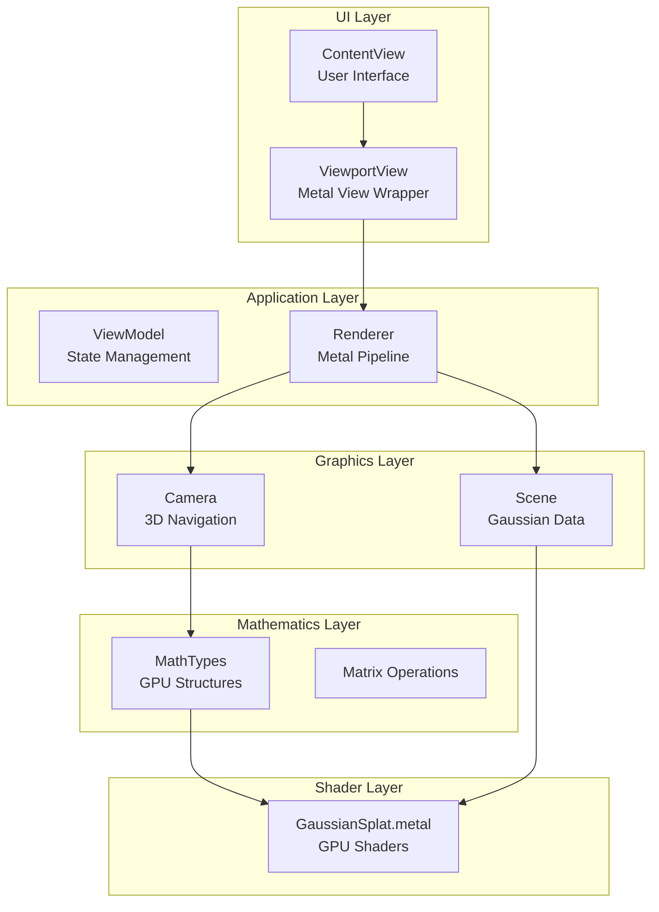
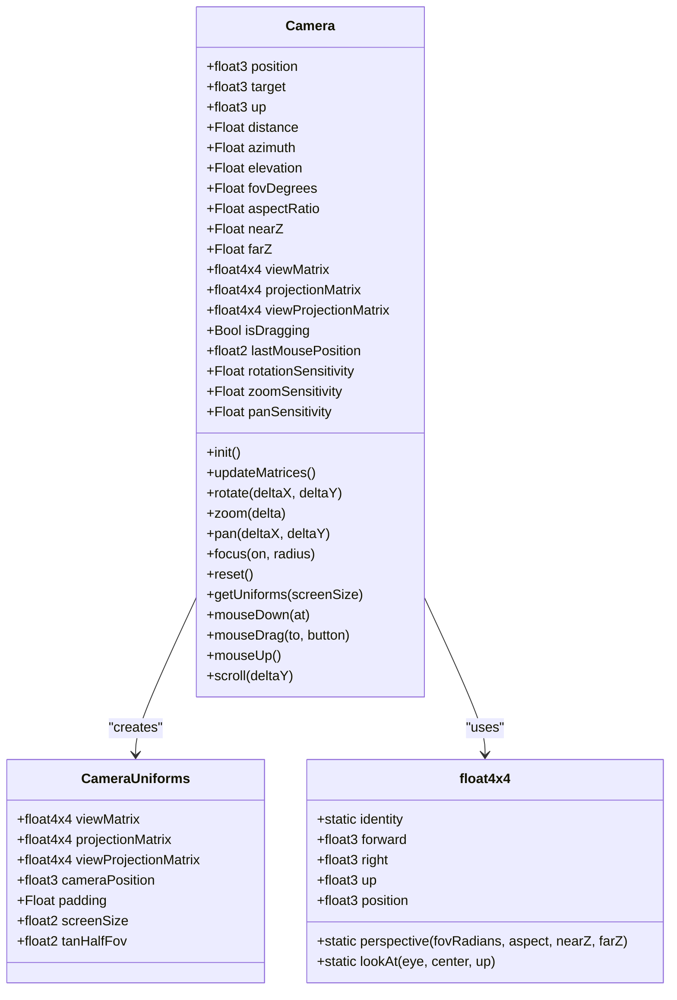
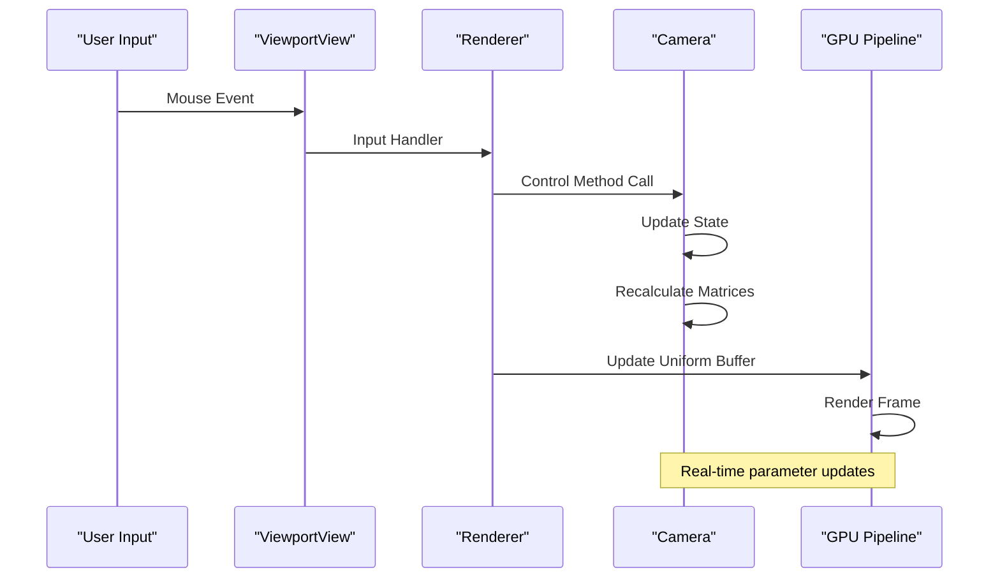
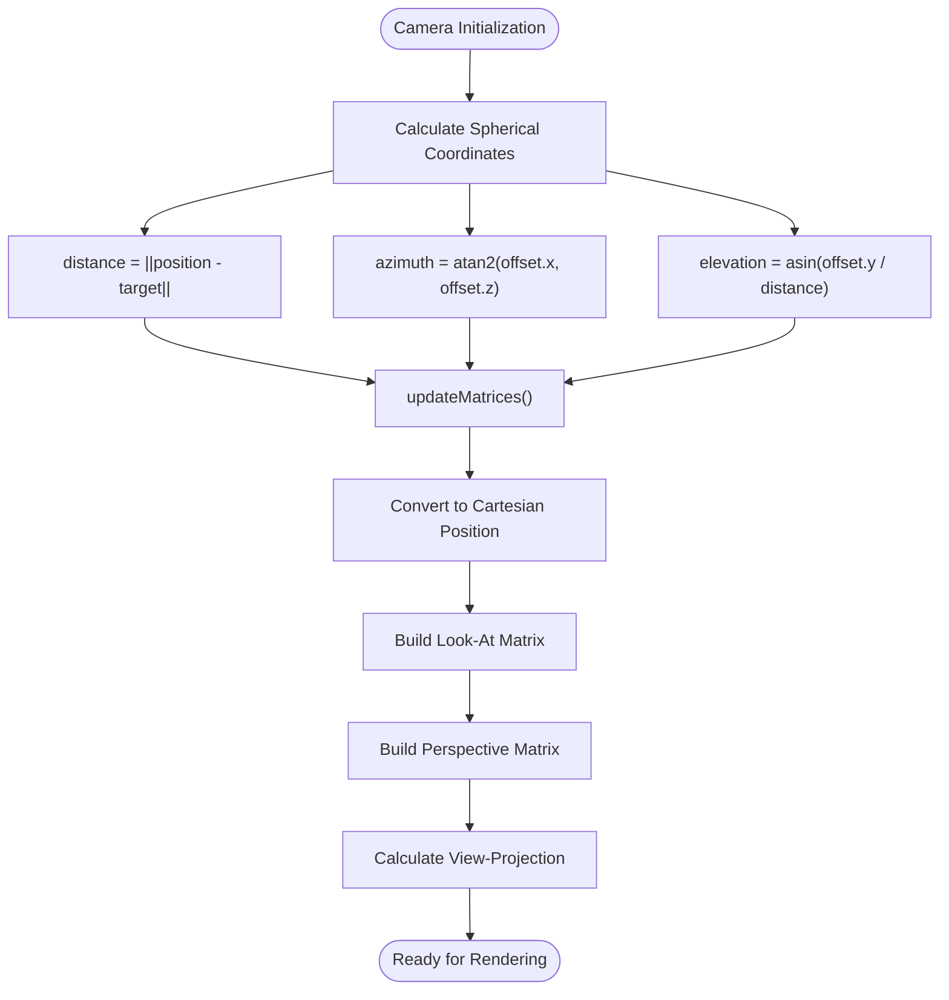
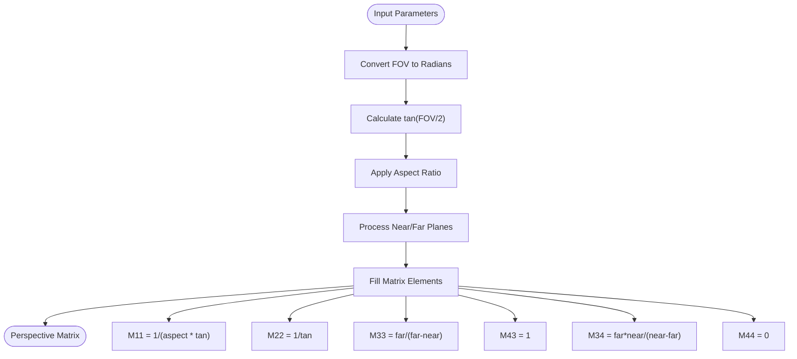
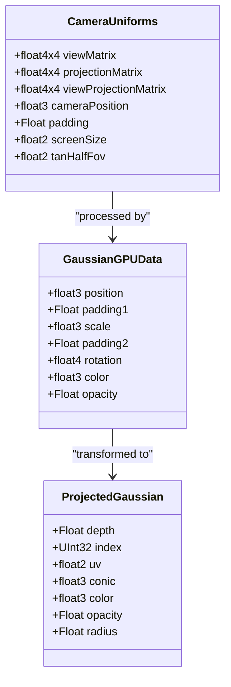
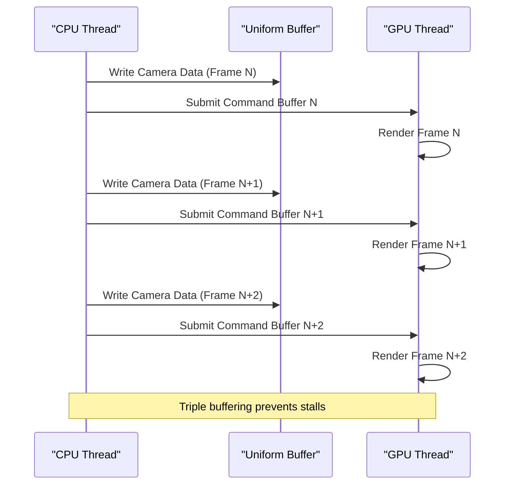
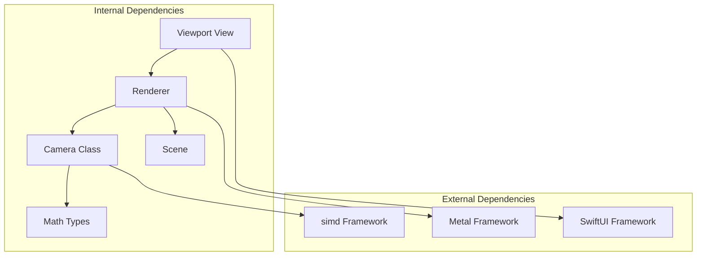

# Camera System

<cite>
**Referenced Files in This Document**
- [Camera.swift](file://Rendering/Camera.swift)
- [MathTypes.swift](file://Math/MathTypes.swift)
- [Renderer.swift](file://Rendering/Renderer.swift)
- [ViewportView.swift](file://UI/ViewportView.swift)
- [ContentView.swift](file://UI/ContentView.swift)
- [Scene.swift](file://Scene/Scene.swift)
- [PLYLoader.swift](file://Scene/PLYLoader.swift)
- [GaussianSplat.metal](file://Shaders/GaussianSplat.metal)
</cite>

## Table of Contents
1. [Introduction](#introduction)
2. [Project Structure](#project-structure)
3. [Core Components](#core-components)
4. [Architecture Overview](#architecture-overview)
5. [Detailed Component Analysis](#detailed-component-analysis)
6. [Dependency Analysis](#dependency-analysis)
7. [Performance Considerations](#performance-considerations)
8. [Troubleshooting Guide](#troubleshooting-guide)
9. [Conclusion](#conclusion)

## Introduction

The Camera class implements an interactive 3D navigation system for Gaussian Splatting visualization. This system provides intuitive orbit camera controls with spherical coordinate mathematics, perspective projection, and seamless integration with the Metal rendering pipeline. The camera system supports mouse-based navigation including rotation, panning, and zoom functionality, along with automatic focus targeting and real-time parameter updates.

The implementation combines mathematical foundations of 3D graphics with practical user interface considerations, providing a robust foundation for exploring 3D Gaussian Splatting scenes with natural mouse interactions.

## Project Structure

The camera system is integrated throughout the Gaussian Splat Viewer application, spanning multiple architectural layers:

**Diagram sources**
- [ContentView.swift:1-130](file://UI/ContentView.swift#L1-L130)
- [ViewportView.swift:1-185](file://UI/ViewportView.swift#L1-L185)
- [Renderer.swift:1-288](file://Rendering/Renderer.swift#L1-L288)
- [Camera.swift:1-184](file://Rendering/Camera.swift#L1-L184)
- [MathTypes.swift:1-189](file://Math/MathTypes.swift#L1-L189)
- [GaussianSplat.metal:1-309](file://Shaders/GaussianSplat.metal#L1-L309)

**Section sources**
- [ContentView.swift:1-130](file://UI/ContentView.swift#L1-L130)
- [ViewportView.swift:1-185](file://UI/ViewportView.swift#L1-L185)
- [Renderer.swift:1-288](file://Rendering/Renderer.swift#L1-L288)
- [Camera.swift:1-184](file://Rendering/Camera.swift#L1-L184)

## Core Components

The camera system consists of several interconnected components that work together to provide smooth 3D navigation:

### Camera Class Architecture

The Camera class serves as the central controller for 3D navigation, implementing the following key systems:

**Diagram sources**
- [Camera.swift:4-184](file://Rendering/Camera.swift#L4-L184)
- [MathTypes.swift:53-62](file://Math/MathTypes.swift#L53-L62)
- [MathTypes.swift:104-167](file://Math/MathTypes.swift#L104-L167)

### Mathematical Foundations

The camera system implements sophisticated mathematical operations for 3D transformations:

**Spherical Coordinate System**: The camera uses spherical coordinates to represent orbital positioning, converting between Cartesian and spherical representations for intuitive navigation.

**Quaternion Mathematics**: The system includes comprehensive quaternion operations for rotation representation and conversion to rotation matrices.

**Matrix Operations**: Custom matrix implementations provide perspective projection and look-at transformations essential for 3D rendering.

**Section sources**
- [Camera.swift:11-60](file://Rendering/Camera.swift#L11-L60)
- [MathTypes.swift:75-101](file://Math/MathTypes.swift#L75-L101)
- [MathTypes.swift:104-167](file://Math/MathTypes.swift#L104-L167)

## Architecture Overview

The camera system integrates seamlessly with the Metal rendering pipeline through a well-defined architecture:

**Diagram sources**
- [ViewportView.swift:38-89](file://UI/ViewportView.swift#L38-L89)
- [Renderer.swift:268-286](file://Rendering/Renderer.swift#L268-L286)
- [Camera.swift:62-84](file://Rendering/Camera.swift#L62-L84)

The architecture follows a clear separation of concerns:
- **Input Layer**: Handles user mouse events and translates them to camera controls
- **Control Layer**: Manages camera state and mathematical transformations
- **Rendering Layer**: Integrates camera data with GPU pipeline
- **Mathematical Layer**: Provides geometric computations and matrix operations

## Detailed Component Analysis

### Camera State Management

The Camera class maintains comprehensive state for 3D navigation:

#### Spherical Coordinate System
The camera uses spherical coordinates to achieve intuitive orbital navigation:
- **Distance**: Radial distance from target point
- **Azimuth**: Horizontal rotation angle (longitude)
- **Elevation**: Vertical rotation angle (latitude)

**Diagram sources**
- [Camera.swift:36-60](file://Rendering/Camera.swift#L36-L60)
- [Camera.swift:63-84](file://Rendering/Camera.swift#L63-L84)

#### Mouse Input Processing
The camera implements sophisticated mouse interaction handling:

**Drag Detection**: Tracks mouse state to distinguish between clicks and drags
**Rotation Calculation**: Converts mouse movement to spherical coordinate changes
**Panning Mechanics**: Calculates pan vectors using view-space basis vectors
**Zoom Functionality**: Implements exponential zoom with distance constraints

**Section sources**
- [Camera.swift:27-35](file://Rendering/Camera.swift#L27-L35)
- [Camera.swift:86-115](file://Rendering/Camera.swift#L86-L115)
- [Camera.swift:149-176](file://Rendering/Camera.swift#L149-L176)

### Mathematical Operations

#### Perspective Matrix Generation
The camera generates perspective projection matrices using custom implementations:

**Diagram sources**
- [MathTypes.swift:107-117](file://Math/MathTypes.swift#L107-L117)
- [Camera.swift:73-80](file://Rendering/Camera.swift#L73-L80)

#### View Matrix Construction
The look-at matrix construction ensures proper camera orientation:

**Forward Vector**: Normalized vector from eye to target
**Right Vector**: Cross product of up and forward vectors  
**Up Vector**: Cross product of forward and right vectors
**Translation Component**: Negative dot products for position transformation

**Section sources**
- [MathTypes.swift:119-131](file://Math/MathTypes.swift#L119-L131)
- [Camera.swift:70-71](file://Rendering/Camera.swift#L70-L71)

### Camera Uniform Buffer Structure

The camera data is efficiently transmitted to GPU through a structured buffer:

**Diagram sources**
- [MathTypes.swift:53-73](file://Math/MathTypes.swift#L53-L73)
- [GaussianSplat.metal:16-42](file://Shaders/GaussianSplat.metal#L16-L42)

**Section sources**
- [MathTypes.swift:53-62](file://Math/MathTypes.swift#L53-L62)
- [Camera.swift:133-147](file://Rendering/Camera.swift#L133-L147)

### Integration with Rendering Pipeline

The camera system integrates with the Metal rendering pipeline through multiple stages:

#### Frame Synchronization
The renderer implements triple buffering for camera uniforms to ensure proper synchronization between CPU and GPU:

**Diagram sources**
- [Renderer.swift:19-259](file://Rendering/Renderer.swift#L19-L259)

#### Screen Size Adaptation
The camera automatically adapts to viewport changes through aspect ratio updates:

**Dynamic Aspect Ratio**: Updated on drawable size changes
**Real-time Updates**: Camera matrices recalculated immediately
**GPU Integration**: Screen size passed to shaders for pixel-perfect rendering

**Section sources**
- [Renderer.swift:161-164](file://Rendering/Renderer.swift#L161-L164)
- [Camera.swift:133-147](file://Rendering/Camera.swift#L133-L147)

## Dependency Analysis

The camera system exhibits well-managed dependencies across architectural layers:

**Diagram sources**
- [Camera.swift:1-3](file://Rendering/Camera.swift#L1-L3)
- [Renderer.swift:1-5](file://Rendering/Renderer.swift#L1-L5)
- [ViewportView.swift:1-3](file://UI/ViewportView.swift#L1-L3)

### Coupling and Cohesion

**High Cohesion**: Camera class encapsulates all navigation logic
**Low Coupling**: Minimal dependencies between components
**Clear Interfaces**: Well-defined protocols for input handling
**Separation of Concerns**: Mathematical operations separated from rendering

### Circular Dependencies
The system avoids circular dependencies through clear architectural boundaries:
- UI layer depends on rendering layer
- Rendering layer depends on math layer
- No reverse dependencies exist

**Section sources**
- [Camera.swift:1-184](file://Rendering/Camera.swift#L1-L184)
- [Renderer.swift:1-288](file://Rendering/Renderer.swift#L1-L288)
- [ViewportView.swift:1-185](file://UI/ViewportView.swift#L1-L185)

## Performance Considerations

The camera system implements several optimizations for real-time performance:

### Numerical Stability
- **Elevation Clamping**: Prevents gimbal lock by limiting vertical rotation
- **Distance Constraints**: Maintains reasonable zoom limits
- **Matrix Normalization**: Ensures numerical precision in transformations

### Computational Efficiency
- **Cached Matrices**: Reduces redundant calculations
- **Triple Buffering**: Eliminates GPU-CPU synchronization stalls
- **Efficient Updates**: Only recalculation when state changes

### Memory Management
- **Aligned Buffers**: Proper memory alignment for GPU efficiency
- **Minimal Allocations**: Reuses existing structures
- **Optimized Data Layout**: Contiguous memory layout for uniform buffers

## Troubleshooting Guide

### Common Issues and Solutions

#### Camera Jumps or Resets Unexpectedly
**Cause**: Aspect ratio mismatch or uninitialized camera state
**Solution**: Ensure aspect ratio is updated on drawable size changes and initialize camera with proper parameters

#### Mouse Input Not Responding
**Cause**: Input handler not properly connected or focus issues
**Solution**: Verify input handler assignment and ensure view accepts first responder status

#### Rendering Artifacts
**Cause**: Incorrect uniform buffer updates or matrix calculation errors
**Solution**: Check camera matrix updates and verify uniform buffer synchronization

#### Performance Degradation
**Cause**: Excessive matrix recalculations or inefficient buffer management
**Solution**: Monitor update frequency and ensure proper caching mechanisms

**Section sources**
- [Camera.swift:91-96](file://Rendering/Camera.swift#L91-L96)
- [Renderer.swift:252-259](file://Rendering/Renderer.swift#L252-L259)
- [ViewportView.swift:102-139](file://UI/ViewportView.swift#L102-L139)

## Conclusion

The Camera class provides a comprehensive solution for 3D navigation in Gaussian Splatting visualization. Its implementation demonstrates excellent architectural principles with clear separation of concerns, robust mathematical foundations, and efficient GPU integration.

Key strengths of the implementation include:
- **Intuitive Controls**: Natural mouse-based navigation with sensible defaults
- **Mathematical Rigor**: Proper spherical coordinate handling and matrix operations
- **Performance Optimization**: Efficient updates and triple buffering for smooth rendering
- **Extensibility**: Clean architecture allowing for future enhancements

The system successfully bridges the gap between user interaction and GPU rendering, providing a solid foundation for exploring complex 3D scenes through interactive navigation controls.