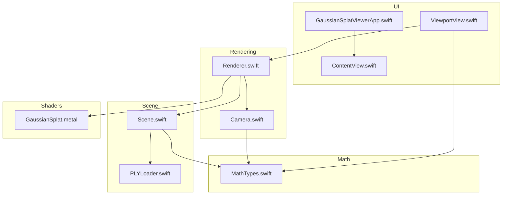
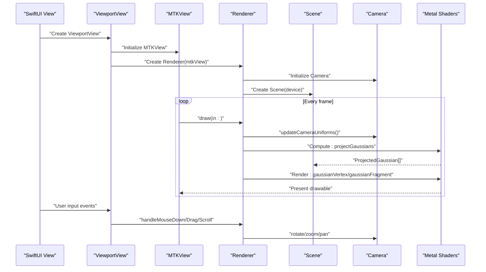
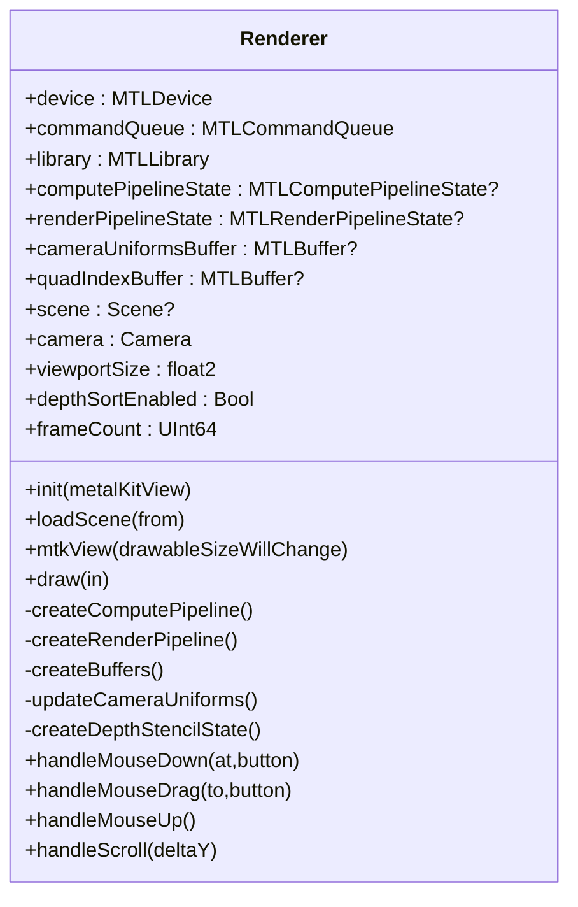
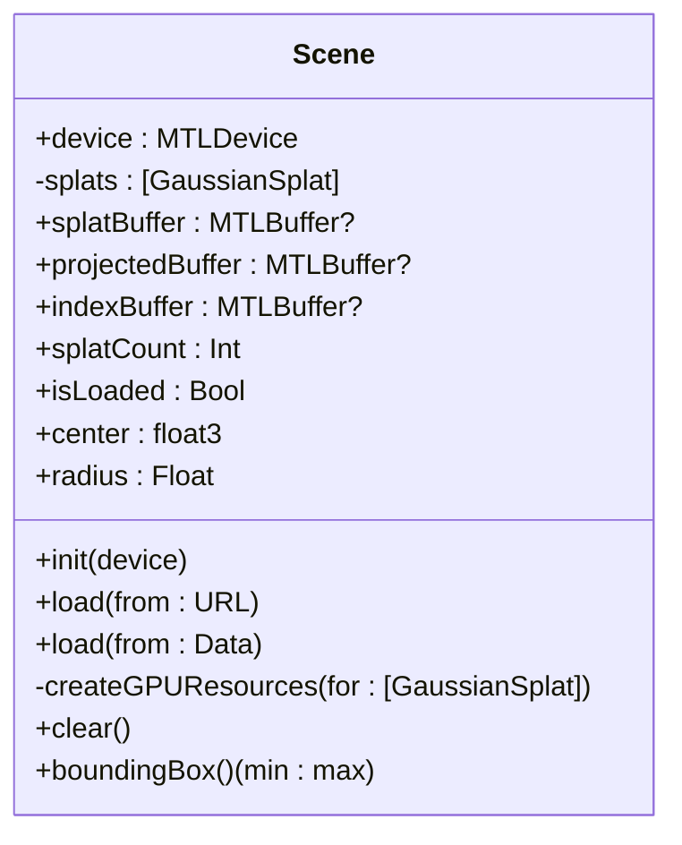
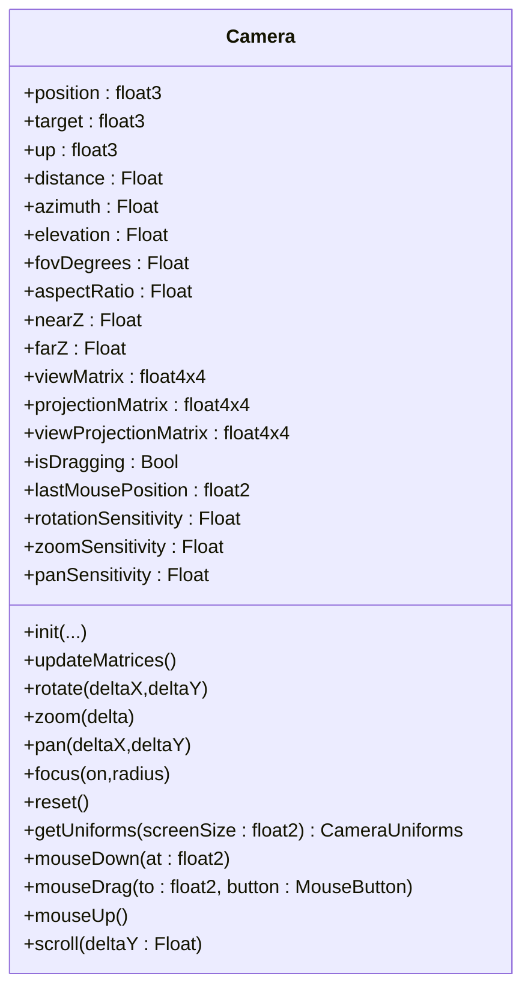
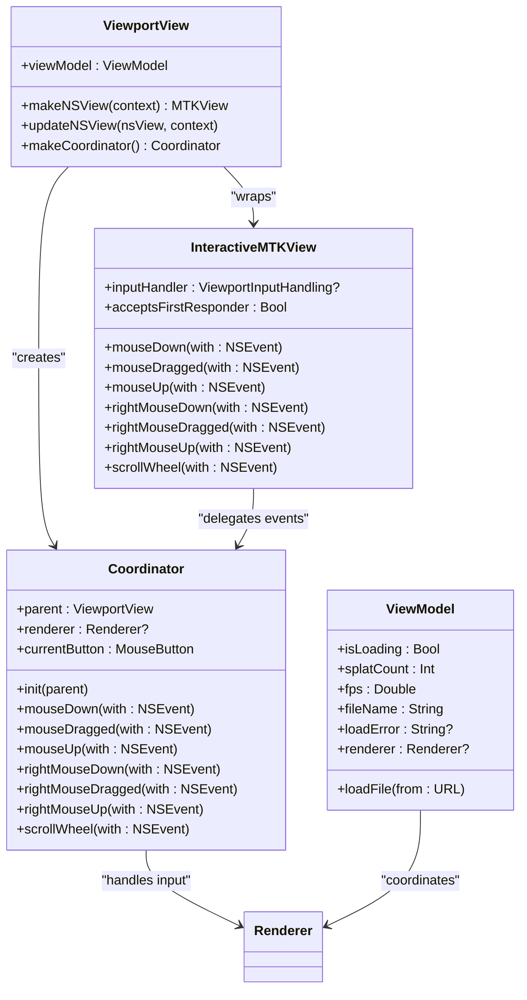
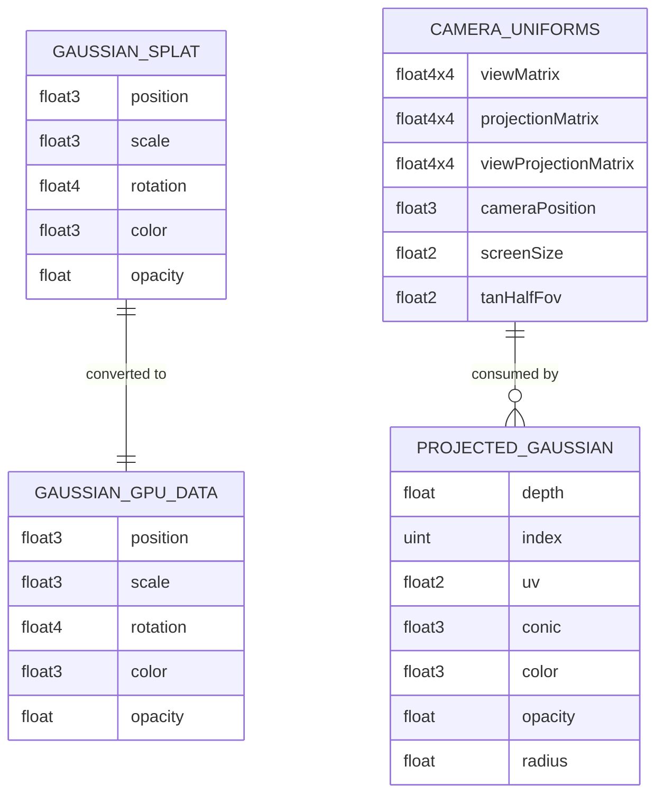
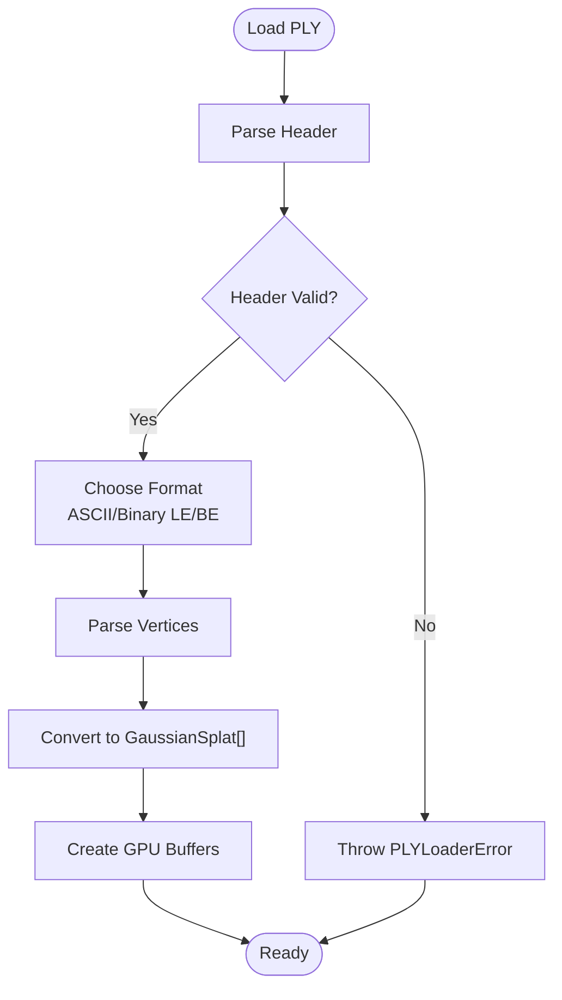
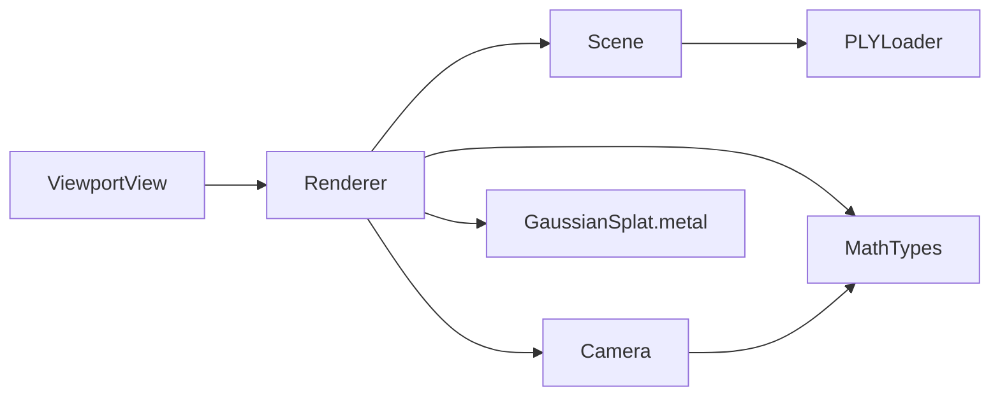

# Core Components

<cite>
**Referenced Files in This Document**
- [Renderer.swift](file://Rendering/Renderer.swift)
- [Scene.swift](file://Scene/Scene.swift)
- [Camera.swift](file://Rendering/Camera.swift)
- [ViewportView.swift](file://UI/ViewportView.swift)
- [MathTypes.swift](file://Math/MathTypes.swift)
- [PLYLoader.swift](file://Scene/PLYLoader.swift)
- [GaussianSplat.metal](file://Shaders/GaussianSplat.metal)
- [GaussianSplatViewerApp.swift](file://GaussianSplatViewerApp.swift)
- [ContentView.swift](file://GaussianSplatViewer/ContentView.swift)
</cite>

## Table of Contents
1. [Introduction](#introduction)
2. [Project Structure](#project-structure)
3. [Core Components](#core-components)
4. [Architecture Overview](#architecture-overview)
5. [Detailed Component Analysis](#detailed-component-analysis)
6. [Dependency Analysis](#dependency-analysis)
7. [Performance Considerations](#performance-considerations)
8. [Troubleshooting Guide](#troubleshooting-guide)
9. [Conclusion](#conclusion)

## Introduction
This document describes the core components of the Gaussian Splat Viewer, focusing on the rendering engine, scene management, camera controls, and SwiftUI viewport integration. It explains the Renderer class as the main Metal-based pipeline orchestrator, the Scene class for GPU buffer allocation and PLY data loading, the Camera class for interactive orbit navigation, and the ViewportView SwiftUI component for Metal viewport integration and user input handling. It also documents initialization sequences, lifecycle management, resource cleanup, and performance considerations.

## Project Structure
The project is organized into focused modules:
- Rendering: Renderer and Camera logic
- Scene: Scene management and PLY loading
- UI: SwiftUI viewport wrapper and input handling
- Math: Shared data structures and math utilities
- Shaders: Metal shaders for projection and rendering
- App: Minimal SwiftUI app shell

**Diagram sources**
- [Renderer.swift:1-292](file://Rendering/Renderer.swift#L1-L292)
- [Scene.swift:1-140](file://Scene/Scene.swift#L1-L140)
- [Camera.swift:1-184](file://Rendering/Camera.swift#L1-L184)
- [ViewportView.swift:1-185](file://UI/ViewportView.swift#L1-L185)
- [MathTypes.swift:1-189](file://Math/MathTypes.swift#L1-L189)
- [PLYLoader.swift:1-403](file://Scene/PLYLoader.swift#L1-L403)
- [GaussianSplat.metal:1-309](file://Shaders/GaussianSplat.metal#L1-L309)
- [GaussianSplatViewerApp.swift:1-13](file://GaussianSplatViewerApp.swift#L1-L13)
- [ContentView.swift:1-25](file://GaussianSplatViewer/ContentView.swift#L1-L25)

**Section sources**
- [Renderer.swift:1-292](file://Rendering/Renderer.swift#L1-L292)
- [Scene.swift:1-140](file://Scene/Scene.swift#L1-L140)
- [Camera.swift:1-184](file://Rendering/Camera.swift#L1-L184)
- [ViewportView.swift:1-185](file://UI/ViewportView.swift#L1-L185)
- [MathTypes.swift:1-189](file://Math/MathTypes.swift#L1-L189)
- [PLYLoader.swift:1-403](file://Scene/PLYLoader.swift#L1-L403)
- [GaussianSplat.metal:1-309](file://Shaders/GaussianSplat.metal#L1-L309)
- [GaussianSplatViewerApp.swift:1-13](file://GaussianSplatViewerApp.swift#L1-L13)
- [ContentView.swift:1-25](file://GaussianSplatViewer/ContentView.swift#L1-L25)

## Core Components
- Renderer: Metal-based rendering engine with compute and render passes, camera uniform updates, and viewport integration.
- Scene: Manages Gaussian splat data and GPU buffers, loads from PLY, computes bounding statistics, and exposes state for rendering.
- Camera: Orbit camera with spherical coordinates, matrix calculations, and interactive controls.
- ViewportView: SwiftUI wrapper around MTKView, input event forwarding, and ViewModel coordination.
- MathTypes: Shared data structures and matrix/quaternion utilities used across components.
- PLYLoader: Robust PLY parser supporting ASCII and binary little/big endian formats.
- Shaders: Metal compute and fragment shaders implementing Gaussian projection and rendering.

**Section sources**
- [Renderer.swift:6-292](file://Rendering/Renderer.swift#L6-L292)
- [Scene.swift:5-140](file://Scene/Scene.swift#L5-L140)
- [Camera.swift:4-184](file://Rendering/Camera.swift#L4-L184)
- [ViewportView.swift:5-185](file://UI/ViewportView.swift#L5-L185)
- [MathTypes.swift:4-189](file://Math/MathTypes.swift#L4-L189)
- [PLYLoader.swift:13-403](file://Scene/PLYLoader.swift#L13-L403)
- [GaussianSplat.metal:1-309](file://Shaders/GaussianSplat.metal#L1-L309)

## Architecture Overview
The Renderer integrates Metal compute and render passes to project Gaussian splats and draw them as textured quads. The Scene holds CPU and GPU data, while the Camera manages view/projection matrices and user interactions. The ViewportView bridges SwiftUI and MetalKit, forwarding input events to the Renderer.

**Diagram sources**
- [ViewportView.swift:34-90](file://UI/ViewportView.swift#L34-L90)
- [Renderer.swift:38-77](file://Rendering/Renderer.swift#L38-L77)
- [Renderer.swift:166-254](file://Rendering/Renderer.swift#L166-L254)
- [Camera.swift:63-84](file://Rendering/Camera.swift#L63-L84)
- [GaussianSplat.metal:138-201](file://Shaders/GaussianSplat.metal#L138-L201)
- [GaussianSplat.metal:205-270](file://Shaders/GaussianSplat.metal#L205-L270)

## Detailed Component Analysis

### Renderer
Responsibilities:
- Initializes Metal device, command queue, and shader library.
- Creates compute and render pipeline states from Metal shaders.
- Allocates camera uniforms and quad index buffers.
- Manages scene loading and camera focus.
- Implements MTKViewDelegate draw loop with compute and render passes.
- Handles camera interaction events (mouse, drag, scroll).

Key data structures and buffers:
- cameraUniformsBuffer: Triple-buffered shared memory for CameraUniforms.
- quadIndexBuffer: Index buffer for instanced quad drawing.
- computePipelineState/renderPipelineState: Compiled Metal pipelines.
- scene: Scene instance holding GPU buffers.

Processing logic:
- Compute pass: projectGaussians dispatches one thread per Gaussian.
- Render pass: draws instanced quads using projected data and CameraUniforms.
- Uniform updates: CameraUniforms are copied into the triple-buffered region based on frameCount.

Lifecycle and cleanup:
- Initialization sets MTKView properties and delegates.
- draw(in:) handles command buffer creation and completion handler logging.
- No explicit deinit/cleanup code observed; Metal resources are owned by device.

Integration patterns:
- Renderer is created inside ViewportView Coordinator and exposed to ViewModel.
- Input events from ViewportView are forwarded to Renderer’s camera handlers.

**Section sources**
- [Renderer.swift:6-292](file://Rendering/Renderer.swift#L6-L292)
- [GaussianSplat.metal:138-201](file://Shaders/GaussianSplat.metal#L138-L201)
- [GaussianSplat.metal:205-270](file://Shaders/GaussianSplat.metal#L205-L270)

#### Class Diagram: Renderer

**Diagram sources**
- [Renderer.swift:7-292](file://Rendering/Renderer.swift#L7-L292)

### Scene
Responsibilities:
- Holds CPU-side GaussianSplat array and GPU buffers.
- Loads PLY data via PLYLoader and creates GPU buffers.
- Computes bounding box, center, and radius for camera focus.
- Exposes isLoaded and splatCount for rendering readiness.

GPU buffer allocation:
- splatBuffer: Host-coherent storage for GaussianGPUData.
- projectedBuffer: Private storage for ProjectedGaussian computed by the compute shader.
- indexBuffer: Private storage for sorting indices (currently a placeholder).

Data loading:
- load(from url/data) parses PLY and constructs GPU buffers.
- clear() resets all data and buffers.

Bounding statistics:
- boundingBox(), center, radius support automatic camera framing.

**Section sources**
- [Scene.swift:5-140](file://Scene/Scene.swift#L5-L140)
- [PLYLoader.swift:41-68](file://Scene/PLYLoader.swift#L41-L68)

#### Class Diagram: Scene

**Diagram sources**
- [Scene.swift:6-140](file://Scene/Scene.swift#L6-L140)
- [MathTypes.swift:12-73](file://Math/MathTypes.swift#L12-L73)

### Camera
Responsibilities:
- Orbit camera with spherical coordinates (distance, azimuth, elevation).
- Maintains view and projection matrices and combined view-projection matrix.
- Provides getUniforms(screenSize:) for GPU consumption.
- Handles mouse input for rotation, pan, and zoom.

Interaction model:
- mouseDown/mouseDrag/mouseUp track dragging state and deltas.
- scroll(deltaY) adjusts zoom.
- rotate(deltaX, deltaY) updates spherical coordinates with clamping.
- pan(deltaX, deltaY) translates target along view axes scaled by distance.
- focus(on, radius) positions camera to frame a target object.
- reset() restores default pose.

Matrix utilities:
- lookAt and perspective helpers in float4x4 extension.
- Quaternion-to-matrix conversion for covariance computation.

**Section sources**
- [Camera.swift:4-184](file://Rendering/Camera.swift#L4-L184)
- [MathTypes.swift:104-167](file://Math/MathTypes.swift#L104-L167)

#### Class Diagram: Camera

**Diagram sources**
- [Camera.swift:5-184](file://Rendering/Camera.swift#L5-L184)

### ViewportView (SwiftUI + MetalKit)
Responsibilities:
- NSViewRepresentable that wraps an InteractiveMTKView.
- Creates Renderer and injects it into ViewModel.
- Forwards mouse and scroll events to Renderer via Coordinator.

Event handling:
- Left-click drag rotates; middle/right drag pans.
- Scroll wheel zooms.
- Right mouse button is mapped to .right for symmetry.

InteractiveMTKView:
- Accepts first responder and forwards events to inputHandler.

ViewModel:
- Coordinates loading, publishes stats (splatCount, fps, fileName), and error reporting.
- Uses security-scoped URLs for sandboxed file access.

**Section sources**
- [ViewportView.swift:5-185](file://UI/ViewportView.swift#L5-L185)

#### Class Diagram: ViewportView and Coordinator

**Diagram sources**
- [ViewportView.swift:6-185](file://UI/ViewportView.swift#L6-L185)

### Data Structures and Math Utilities
Shared structures:
- GaussianSplat: position, scale, rotation quaternion, color, opacity.
- GaussianGPUData: GPU-compatible layout for per-splat data.
- CameraUniforms: matrices, camera position, screen size, half-FOV tangents.
- ProjectedGaussian: per-instance data for rendering (depth, UV, conic, color, opacity, radius).

Math extensions:
- float4x4: perspective, lookAt, translation, scale, and vector extraction helpers.
- float4: axis-angle to quaternion, normalization, rotation matrix conversion.
- Covariance computation from scale and rotation for 3D Gaussian.

**Section sources**
- [MathTypes.swift:10-189](file://Math/MathTypes.swift#L10-L189)

#### Data Model Diagram

**Diagram sources**
- [MathTypes.swift:12-73](file://Math/MathTypes.swift#L12-L73)

### PLY Loader
Capabilities:
- Parses ASCII and binary little/big endian PLY files.
- Supports element/property parsing and vertex data extraction.
- Converts PLY fields to GaussianSplat (position, scale, rotation, color, opacity).
- Robust error handling for missing properties and invalid headers.

Parsing modes:
- ASCII: line-by-line parsing with property name mapping.
- Binary: fixed stride calculation per property type with endianness handling.

**Section sources**
- [PLYLoader.swift:13-403](file://Scene/PLYLoader.swift#L13-L403)

#### Flowchart: PLY Loading

**Diagram sources**
- [PLYLoader.swift:72-158](file://Scene/PLYLoader.swift#L72-L158)
- [PLYLoader.swift:162-204](file://Scene/PLYLoader.swift#L162-L204)
- [PLYLoader.swift:208-317](file://Scene/PLYLoader.swift#L208-L317)
- [Scene.swift:58-95](file://Scene/Scene.swift#L58-L95)

### Shaders
Compute shader:
- projectGaussians: For each Gaussian, computes 3D covariance, projects to 2D, evaluates conic (inverse covariance), and writes ProjectedGaussian with depth, UV, color, opacity, radius.

Vertex shader:
- gaussianVertex: Builds quad vertices around projected UV and radius, converts to clip space using CameraUniforms, and passes conic/color/opacity to fragment.

Fragment shader:
- gaussianFragment: Evaluates 2D Gaussian density using conic parameters, computes premultiplied alpha, and discards transparent fragments.

Sorting kernel:
- bitonicSort: Placeholder for depth-based sorting (currently disabled in Renderer).

**Section sources**
- [GaussianSplat.metal:138-201](file://Shaders/GaussianSplat.metal#L138-L201)
- [GaussianSplat.metal:205-270](file://Shaders/GaussianSplat.metal#L205-L270)
- [GaussianSplat.metal:274-309](file://Shaders/GaussianSplat.metal#L274-L309)

## Dependency Analysis
- Renderer depends on:
  - Scene for GPU buffers and splat data.
  - Camera for uniforms and matrices.
  - Metal for compute/render pipelines and buffers.
  - MathTypes for data structures and matrix utilities.
  - Shaders for compute and render functions.
- Scene depends on:
  - PLYLoader for data ingestion.
  - MathTypes for GaussianGPUData conversion.
  - Metal for GPU buffer creation.
- Camera depends on:
  - MathTypes for matrix and quaternion utilities.
- ViewportView depends on:
  - Renderer for input handling.
  - ViewModel for state and loading orchestration.
  - InteractiveMTKView for event forwarding.

**Diagram sources**
- [Renderer.swift:1-292](file://Rendering/Renderer.swift#L1-L292)
- [Scene.swift:1-140](file://Scene/Scene.swift#L1-L140)
- [Camera.swift:1-184](file://Rendering/Camera.swift#L1-L184)
- [ViewportView.swift:1-185](file://UI/ViewportView.swift#L1-L185)
- [MathTypes.swift:1-189](file://Math/MathTypes.swift#L1-L189)
- [PLYLoader.swift:1-403](file://Scene/PLYLoader.swift#L1-L403)
- [GaussianSplat.metal:1-309](file://Shaders/GaussianSplat.metal#L1-L309)

**Section sources**
- [Renderer.swift:1-292](file://Rendering/Renderer.swift#L1-L292)
- [Scene.swift:1-140](file://Scene/Scene.swift#L1-L140)
- [Camera.swift:1-184](file://Rendering/Camera.swift#L1-L184)
- [ViewportView.swift:1-185](file://UI/ViewportView.swift#L1-L185)
- [MathTypes.swift:1-189](file://Math/MathTypes.swift#L1-L189)
- [PLYLoader.swift:1-403](file://Scene/PLYLoader.swift#L1-L403)
- [GaussianSplat.metal:1-309](file://Shaders/GaussianSplat.metal#L1-L309)

## Performance Considerations
- Compute dispatch sizing: The compute shader dispatches ceil(count/256) thread groups with 256 threads per group. Ensure splatCount is large enough to benefit from coalescing and occupancy.
- Triple-buffered uniforms: Using three uniform blocks avoids CPU-GPU synchronization stalls at the cost of increased memory usage.
- Alpha blending: The render pipeline enables blending with additive blending factors to achieve correct compositing of overlapping splats.
- Depth testing: Depth stencil state is configured for less-than comparison with depth writes enabled.
- Sorting: Depth sorting is currently disabled and marked as TODO; enabling bitonicSort would improve correctness at the cost of additional compute throughput.
- Buffer memory: GPU buffers are allocated with storageModeShared for splatBuffer and storageModePrivate for projectedBuffer/indexBuffer; consider pinned memory options if performance is constrained.
- Input sensitivity: Rotation/zoom/pan sensitivities are tuned defaults; adjust for large scenes or precision needs.
- Frame pacing: MTKView preferredFramesPerSecond is set to 60; consider dynamic adjustment based on device capabilities.

[No sources needed since this section provides general guidance]

## Troubleshooting Guide
Common issues and remedies:
- Metal library not found: Renderer prints a failure message when the default library cannot be loaded; ensure shaders are compiled into the app bundle.
- Compute pipeline creation failure: Verify compute function name "projectGaussians" matches the shader.
- Render pipeline creation failure: Verify vertex and fragment function names match the shader.
- Buffer creation errors: SceneError.failedToCreateBuffer indicates device buffer allocation failure; check available VRAM and buffer sizes.
- No splats loaded: SceneError.noSplatsLoaded occurs when trying to load without a Scene instance; ensure Scene is initialized before loadScene.
- PLY parsing errors: PLYLoaderError variants indicate invalid headers, unsupported formats, or missing properties; validate PLY file format and required fields.
- Command buffer errors: Renderer logs Metal command buffer failures in the completion handler; inspect error.localizedDescription for details.

**Section sources**
- [Renderer.swift:47-53](file://Rendering/Renderer.swift#L47-L53)
- [Renderer.swift:81-93](file://Rendering/Renderer.swift#L81-L93)
- [Renderer.swift:95-127](file://Rendering/Renderer.swift#L95-L127)
- [Scene.swift:68-85](file://Scene/Scene.swift#L68-L85)
- [Scene.swift:136-140](file://Scene/Scene.swift#L136-L140)
- [PLYLoader.swift:4-10](file://Scene/PLYLoader.swift#L4-L10)
- [Renderer.swift:247-251](file://Rendering/Renderer.swift#L247-L251)

## Conclusion
The Gaussian Splat Viewer integrates SwiftUI, MetalKit, and Metal shaders to deliver an interactive 3D Gaussian rendering pipeline. The Renderer orchestrates compute and render passes, Scene manages GPU buffers and PLY ingestion, Camera provides intuitive orbit navigation, and ViewportView bridges UI and Metal input handling. With careful buffer management, optional depth sorting, and tuned sensitivity parameters, the viewer achieves efficient and visually correct rendering of large splat datasets.