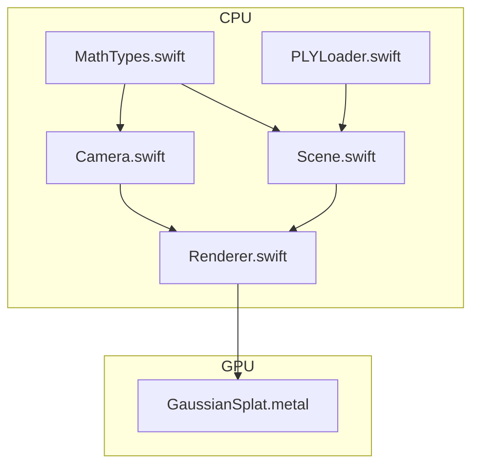
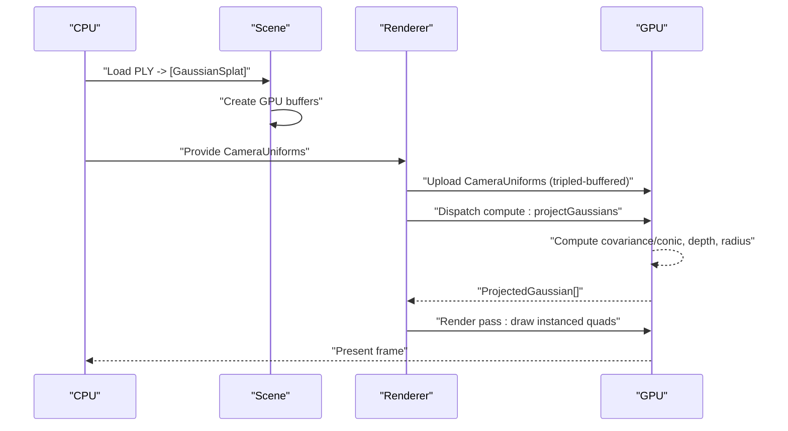
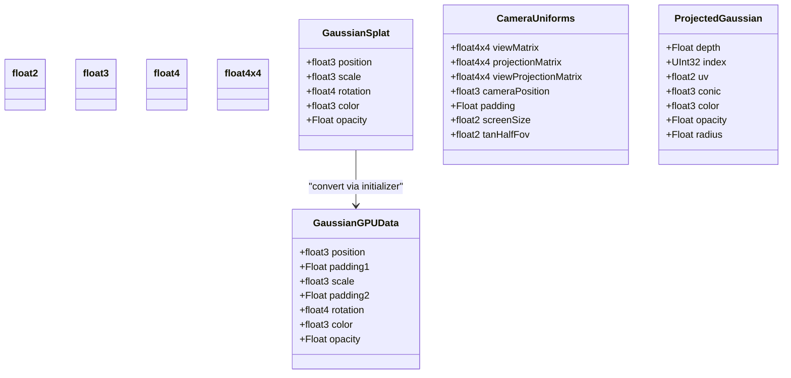
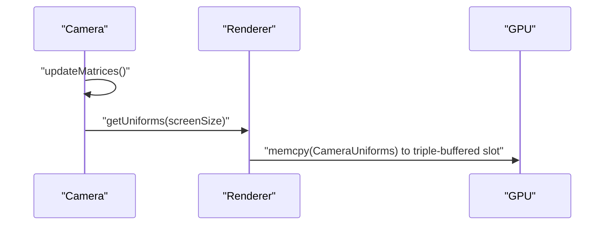
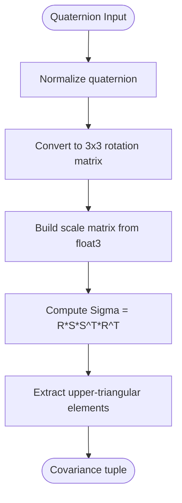
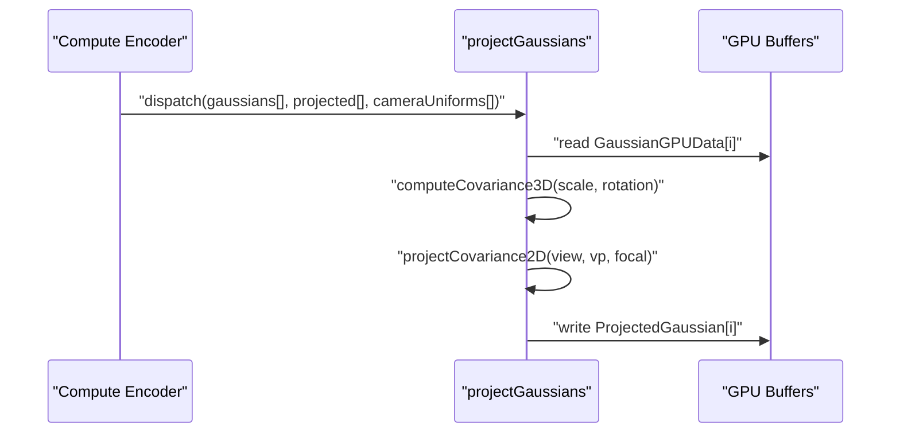
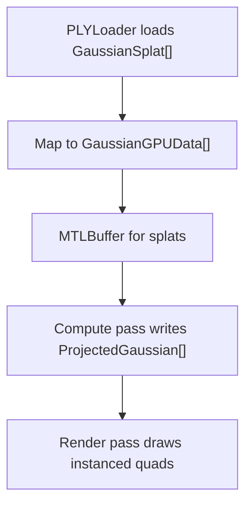
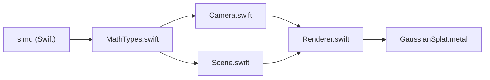

# Mathematical Types

<cite>
**Referenced Files in This Document**
- [MathTypes.swift](file://Sources/Math/MathTypes.swift)
- [GaussianSplat.metal](file://Sources/Shaders/GaussianSplat.metal)
- [Camera.swift](file://Sources/Rendering/Camera.swift)
- [Renderer.swift](file://Sources/Rendering/Renderer.swift)
- [Scene.swift](file://Sources/Scene/Scene.swift)
- [PLYLoader.swift](file://Sources/Scene/PLYLoader.swift)
- [Package.swift](file://Package.swift)
</cite>

## Table of Contents
1. [Introduction](#introduction)
2. [Project Structure](#project-structure)
3. [Core Components](#core-components)
4. [Architecture Overview](#architecture-overview)
5. [Detailed Component Analysis](#detailed-component-analysis)
6. [Dependency Analysis](#dependency-analysis)
7. [Performance Considerations](#performance-considerations)
8. [Troubleshooting Guide](#troubleshooting-guide)
9. [Conclusion](#conclusion)

## Introduction
This document describes the Mathematical Types component responsible for GPU-compatible data structures and vector/matrix operations used throughout the rendering pipeline. It explains how Swift SIMD types and Metal-compatible structures are organized, how GPU-friendly memory layouts are enforced, and how CPU-side types convert to GPU buffers for compute and rendering stages. It also covers camera matrices, covariance computations, and shader integration, along with performance implications and optimization strategies.

## Project Structure
The Mathematical Types module lives under Sources/Math and integrates with rendering, scene loading, and Metal shader code. The key files are:
- Sources/Math/MathTypes.swift: Defines SIMD aliases, CPU-side types, GPU-compatible structures, and math utilities.
- Sources/Shaders/GaussianSplat.metal: Implements GPU kernels and structures mirroring the CPU types.
- Sources/Rendering/Camera.swift: Builds camera matrices and exposes CameraUniforms for GPU.
- Sources/Rendering/Renderer.swift: Creates Metal buffers and pipelines, dispatches compute and render passes.
- Sources/Scene/Scene.swift: Manages GPU buffers for splats and projected data.
- Sources/Scene/PLYLoader.swift: Loads Gaussian splats from PLY files and populates CPU-side structures.

**Diagram sources**
- [MathTypes.swift](file://Sources/Math/MathTypes.swift)
- [GaussianSplat.metal](file://Sources/Shaders/GaussianSplat.metal)
- [Camera.swift](file://Sources/Rendering/Camera.swift)
- [Renderer.swift](file://Sources/Rendering/Renderer.swift)
- [Scene.swift](file://Sources/Scene/Scene.swift)
- [PLYLoader.swift](file://Sources/Scene/PLYLoader.swift)

**Section sources**
- [Package.swift:1-17](file://Package.swift#L1-L17)

## Core Components
- SIMD type aliases for clarity and consistency across CPU and GPU code.
- GaussianSplat: CPU-side representation of a 3D Gaussian with position, scale, rotation (quaternion), color, and opacity.
- GaussianGPUData: Metal-compatible structure with explicit padding to ensure 16-byte alignment for vector registers.
- CameraUniforms: Uniform buffer structure containing view/projection matrices, camera position, screen size, and half-field-of-view tangents.
- ProjectedGaussian: Intermediate GPU structure for per-splat projected data used in sorting and rasterization.
- Matrix and quaternion extensions: Perspective projection, look-at, translation, scaling, and direction extraction; quaternion normalization and conversion to rotation matrices.
- Covariance computation: From scale and rotation to 3D covariance and 2D projection with conic representation.

**Section sources**
- [MathTypes.swift:1-189](file://Sources/Math/MathTypes.swift#L1-L189)
- [GaussianSplat.metal:1-309](file://Sources/Shaders/GaussianSplat.metal#L1-L309)

## Architecture Overview
The rendering pipeline uses a compute-first approach:
- CPU loads PLY data into GaussianSplat instances, converts to GaussianGPUData, and uploads to GPU buffers.
- A compute kernel projects each Gaussian into screen space, computes 2D covariance (conic), and writes ProjectedGaussian entries.
- A render pass draws instanced quads using the projected data, with alpha blending for compositing.

**Diagram sources**
- [Scene.swift:52-85](file://Sources/Scene/Scene.swift#L52-L85)
- [Renderer.swift:187-250](file://Sources/Rendering/Renderer.swift#L187-L250)
- [GaussianSplat.metal:138-198](file://Sources/Shaders/GaussianSplat.metal#L138-L198)

## Detailed Component Analysis

### SIMD and GPU-Compatible Data Structures
- SIMD aliases: float2, float3, float4, float4x4 unify vector/matrix usage across CPU and GPU.
- GaussianGPUData enforces 16-byte alignment by inserting Float padding after float3 fields, ensuring Metal’s vector registers receive aligned data.
- CameraUniforms mirrors the GPU structure with padding to keep float4x4 rows aligned.
- ProjectedGaussian stores per-splat projected attributes for sorting and rasterization.

**Diagram sources**
- [MathTypes.swift:5-51](file://Sources/Math/MathTypes.swift#L5-L51)
- [GaussianSplat.metal:6-34](file://Sources/Shaders/GaussianSplat.metal#L6-L34)

**Section sources**
- [MathTypes.swift:5-74](file://Sources/Math/MathTypes.swift#L5-L74)
- [GaussianSplat.metal:6-34](file://Sources/Shaders/GaussianSplat.metal#L6-L34)

### Camera Matrices and Uniforms
- Camera builds view and projection matrices and exposes CameraUniforms for GPU consumption.
- The renderer triple-buffers CameraUniforms to avoid CPU/GPU synchronization stalls.

**Diagram sources**
- [Camera.swift:63-84](file://Sources/Rendering/Camera.swift#L63-L84)
- [Camera.swift:134-147](file://Sources/Rendering/Camera.swift#L134-L147)
- [Renderer.swift:252-259](file://Sources/Rendering/Renderer.swift#L252-L259)

**Section sources**
- [Camera.swift:63-147](file://Sources/Rendering/Camera.swift#L63-L147)
- [Renderer.swift:252-259](file://Sources/Rendering/Renderer.swift#L252-L259)

### Quaternion and Matrix Utilities
- float4 extensions: fromAxisAngle, normalized, and toRotationMatrix enable building rotation matrices from quaternions.
- float4x4 extensions: identity, perspective, lookAt, translation, scale, and direction extractors simplify camera and transform math.

**Diagram sources**
- [MathTypes.swift:76-101](file://Sources/Math/MathTypes.swift#L76-L101)
- [MathTypes.swift:104-167](file://Sources/Math/MathTypes.swift#L104-L167)
- [MathTypes.swift:170-188](file://Sources/Math/MathTypes.swift#L170-L188)

**Section sources**
- [MathTypes.swift:76-188](file://Sources/Math/MathTypes.swift#L76-L188)

### Compute Projection Kernel
- The compute kernel reads GaussianGPUData, computes 3D covariance from scale and rotation, projects to 2D, and writes ProjectedGaussian entries.
- It derives focal lengths from the projection matrix and uses camera view/projection matrices for world-to-screen transforms.

**Diagram sources**
- [Renderer.swift:188-212](file://Sources/Rendering/Renderer.swift#L188-L212)
- [GaussianSplat.metal:138-198](file://Sources/Shaders/GaussianSplat.metal#L138-L198)

**Section sources**
- [GaussianSplat.metal:138-198](file://Sources/Shaders/GaussianSplat.metal#L138-L198)

### Scene and Buffer Management
- Scene creates GPU buffers for splats and projected data, converting CPU GaussianSplat arrays to GaussianGPUData for upload.
- Renderer triple-buffers CameraUniforms and sets up Metal buffers and pipelines.

**Diagram sources**
- [Scene.swift:52-85](file://Sources/Scene/Scene.swift#L52-L85)
- [Renderer.swift:131-145](file://Sources/Rendering/Renderer.swift#L131-L145)
- [PLYLoader.swift:42-68](file://Sources/Scene/PLYLoader.swift#L42-L68)

**Section sources**
- [Scene.swift:52-85](file://Sources/Scene/Scene.swift#L52-L85)
- [Renderer.swift:131-145](file://Sources/Rendering/Renderer.swift#L131-L145)
- [PLYLoader.swift:42-68](file://Sources/Scene/PLYLoader.swift#L42-L68)

## Dependency Analysis
- CPU math types depend on simd and Metal for alignment semantics.
- GPU structures mirror CPU types to ensure identical memory layouts.
- Renderer depends on Scene for GPU buffers and Camera for uniforms.
- Shaders depend on Metal types and structures defined in the shader file.

**Diagram sources**
- [MathTypes.swift:1-2](file://Sources/Math/MathTypes.swift#L1-L2)
- [GaussianSplat.metal:1-2](file://Sources/Shaders/GaussianSplat.metal#L1-L2)
- [Renderer.swift:1-4](file://Sources/Rendering/Renderer.swift#L1-L4)

**Section sources**
- [MathTypes.swift:1-2](file://Sources/Math/MathTypes.swift#L1-L2)
- [GaussianSplat.metal:1-2](file://Sources/Shaders/GaussianSplat.metal#L1-L2)
- [Renderer.swift:1-4](file://Sources/Rendering/Renderer.swift#L1-L4)

## Performance Considerations
- Alignment and padding: GaussianGPUData inserts Float padding after float3 fields to ensure 16-byte alignment for vector registers, reducing misalignment penalties on Metal.
- Triple buffering: CameraUniforms are stored in three contiguous slots to avoid CPU/GPU synchronization stalls during updates.
- Compute dispatch sizing: Using threadgroup size of 256 aligns well with GPU cores and reduces overhead.
- Memory bandwidth: ProjectedGaussian is compact and GPU-local; consider reusing buffers and minimizing redundant reads.
- Sorting: Depth sorting is planned; bitonic sort kernel is present and can be integrated periodically to reduce overdraw.
- Alpha blending: The render pipeline enables additive blending with pre-multiplied alpha to minimize overdraw artifacts.

[No sources needed since this section provides general guidance]

## Troubleshooting Guide
- Unaligned memory errors: Ensure GPU structures match CPU structures in field order and padding. Verify that float3 fields are followed by a Float padding to preserve 16-byte alignment.
- Incorrect projections: Confirm CameraUniforms are updated and triple-buffered correctly; verify that view/projection matrices are current and that screenSize and tanHalfFov are set appropriately.
- Visibility issues: Check opacity thresholds and conic determinant checks in the compute kernel; ensure det != 0 before computing inverse covariance.
- Sorting problems: If depth sorting is enabled, ensure the sorting kernel is dispatched and indices are synchronized before rendering.

**Section sources**
- [MathTypes.swift:35-51](file://Sources/Math/MathTypes.swift#L35-L51)
- [Renderer.swift:198-208](file://Sources/Rendering/Renderer.swift#L198-L208)
- [GaussianSplat.metal:167-174](file://Sources/Shaders/GaussianSplat.metal#L167-L174)

## Conclusion
The Mathematical Types component provides a clean, GPU-friendly foundation for 3D Gaussian splatting. By aligning CPU and GPU structures, leveraging SIMD and Metal-compatible types, and encapsulating camera and matrix utilities, the system achieves efficient compute and rendering. Proper attention to memory layout, buffer management, and shader integration ensures optimal performance on modern GPUs.