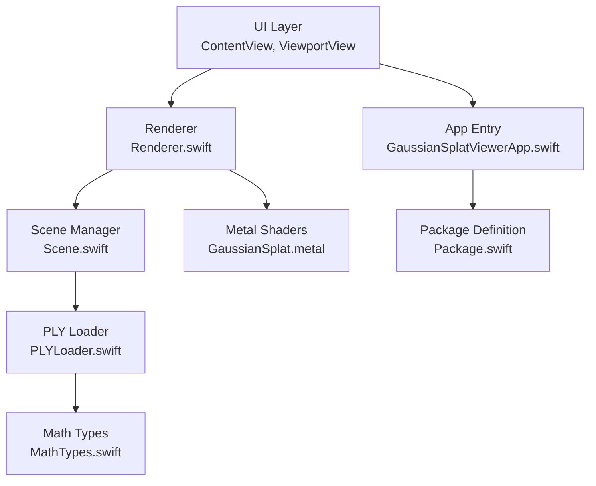
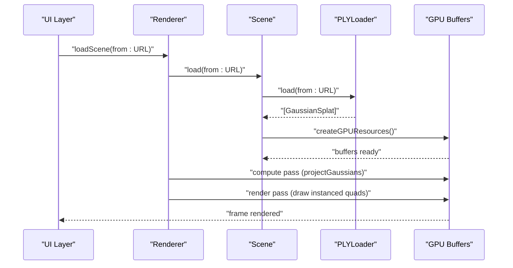
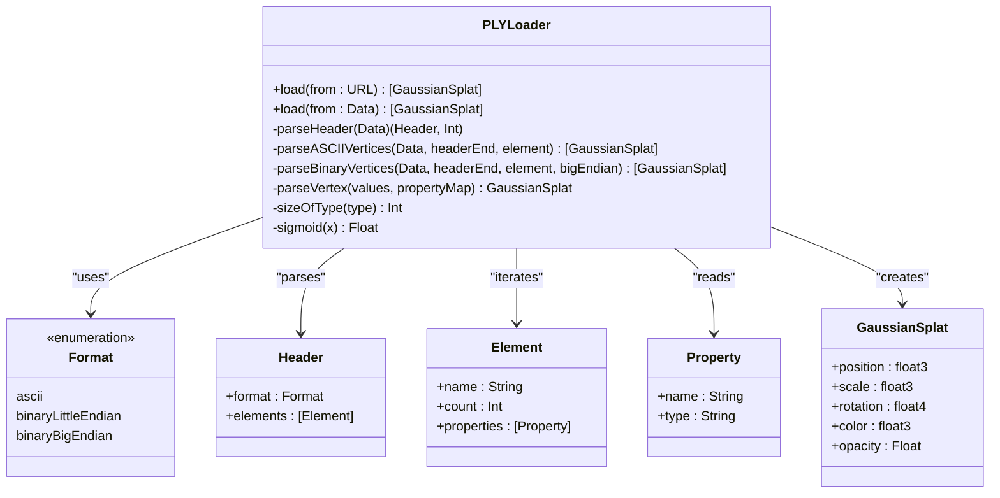
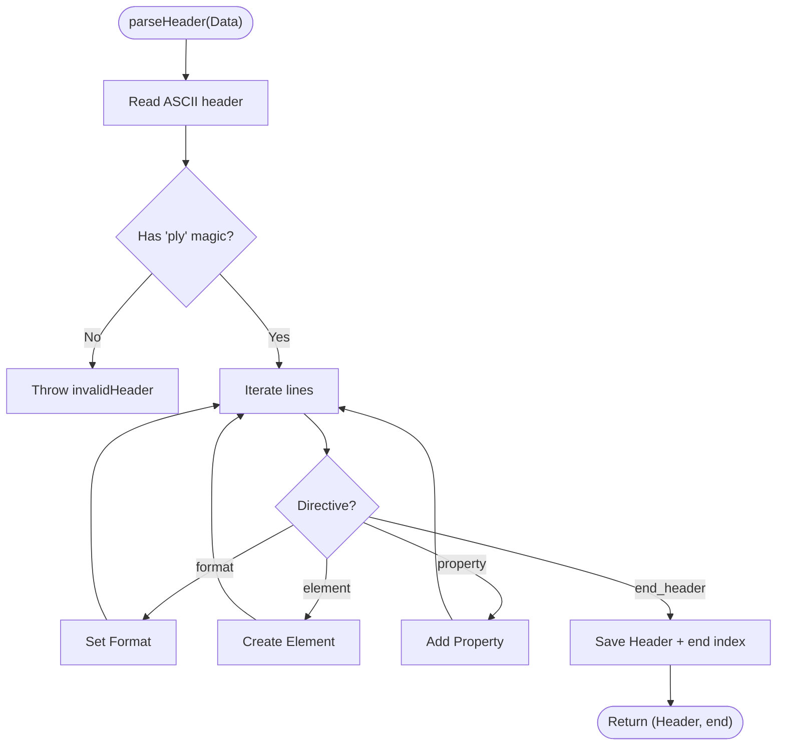
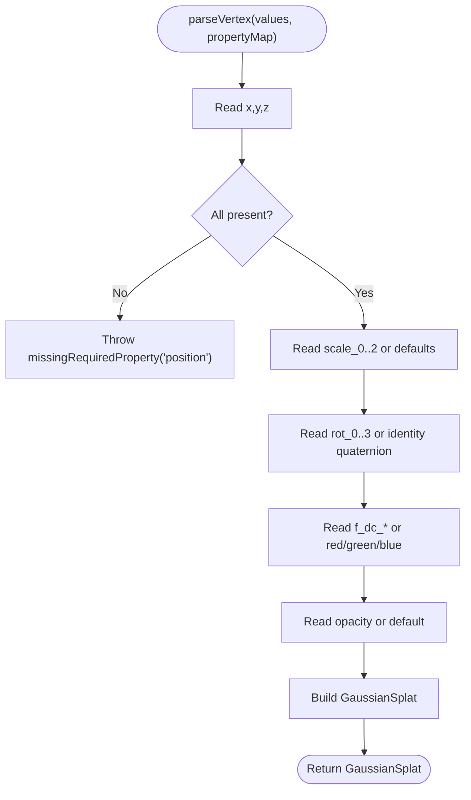
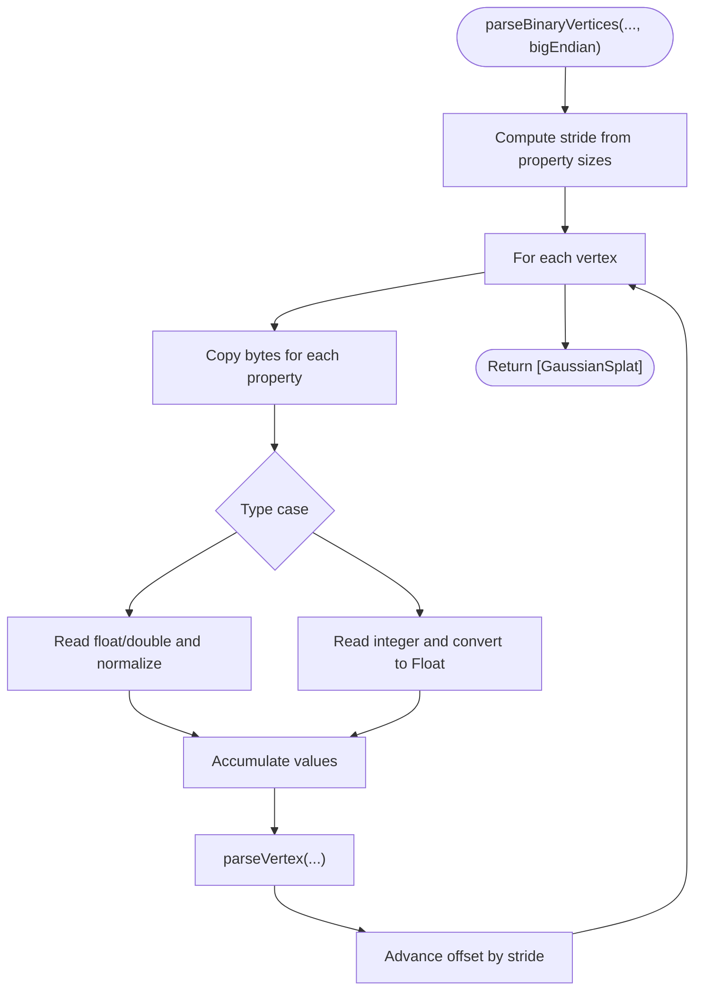
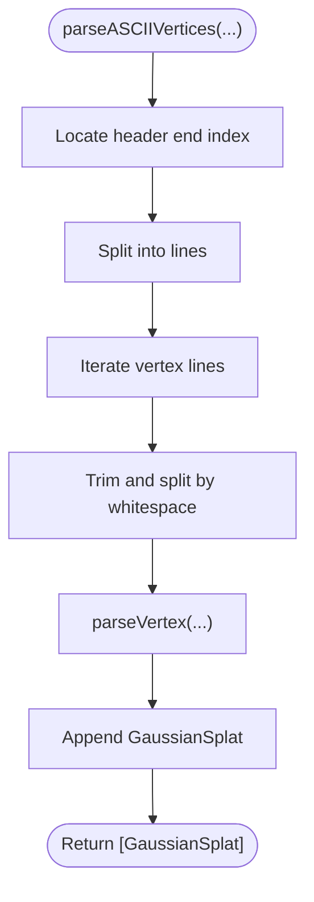
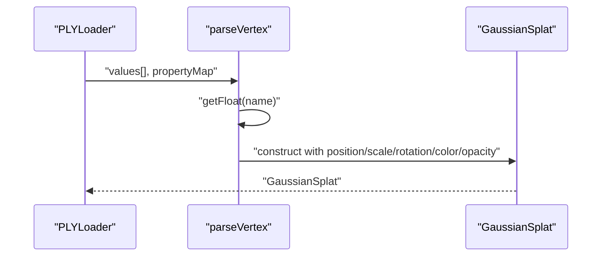
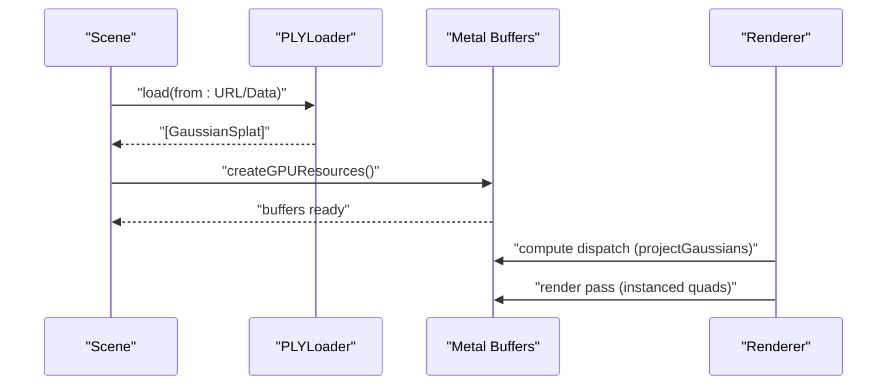
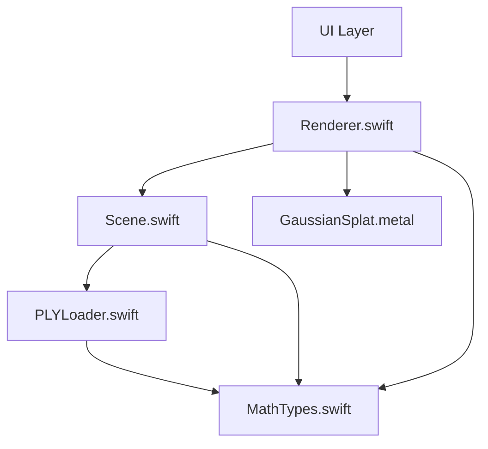

# PLY Loader

<cite>
**Referenced Files in This Document**
- [PLYLoader.swift](file://Sources/Scene/PLYLoader.swift)
- [Scene.swift](file://Sources/Scene/Scene.swift)
- [MathTypes.swift](file://Sources/Math/MathTypes.swift)
- [GaussianSplat.metal](file://Sources/Shaders/GaussianSplat.metal)
- [Renderer.swift](file://Sources/Rendering/Renderer.swift)
- [Camera.swift](file://Sources/Rendering/Camera.swift)
- [ContentView.swift](file://Sources/UI/ContentView.swift)
- [ViewportView.swift](file://Sources/UI/ViewportView.swift)
- [GaussianSplatViewerApp.swift](file://Sources/GaussianSplatViewerApp.swift)
- [Package.swift](file://Package.swift)
</cite>

## Table of Contents
1. [Introduction](#introduction)
2. [Project Structure](#project-structure)
3. [Core Components](#core-components)
4. [Architecture Overview](#architecture-overview)
5. [Detailed Component Analysis](#detailed-component-analysis)
6. [Dependency Analysis](#dependency-analysis)
7. [Performance Considerations](#performance-considerations)
8. [Troubleshooting Guide](#troubleshooting-guide)
9. [Conclusion](#conclusion)
10. [Appendices](#appendices)

## Introduction
This document provides a comprehensive guide to the PLY Loader component responsible for parsing Stanford PLY files and extracting Gaussian splat data. It explains support for ASCII, binary little-endian, and binary big-endian formats, the property parsing system for positions, scales, rotations, colors, and opacities, header parsing and element/property validation, data extraction into internal Gaussian splat representations, error handling strategies, integration with the Scene for GPU-ready data ingestion, and practical examples of loading workflows. It also covers performance considerations for large files, memory optimization, and progressive loading strategies.

## Project Structure
The PLY Loader resides in the Scene module alongside the Scene manager and integrates with math types, Metal shaders, and the renderer. The UI layer triggers loading and delegates to the renderer, which manages GPU buffers and rendering.

**Diagram sources**
- [PLYLoader.swift:1-386](file://Sources/Scene/PLYLoader.swift#L1-L386)
- [Scene.swift:1-130](file://Sources/Scene/Scene.swift#L1-L130)
- [MathTypes.swift:1-189](file://Sources/Math/MathTypes.swift#L1-L189)
- [GaussianSplat.metal:1-309](file://Sources/Shaders/GaussianSplat.metal#L1-L309)
- [Renderer.swift:1-288](file://Sources/Rendering/Renderer.swift#L1-L288)
- [Camera.swift:1-184](file://Sources/Rendering/Camera.swift#L1-L184)
- [ContentView.swift:1-119](file://Sources/UI/ContentView.swift#L1-L119)
- [ViewportView.swift:1-118](file://Sources/UI/ViewportView.swift#L1-L118)
- [GaussianSplatViewerApp.swift:1-65](file://Sources/GaussianSplatViewerApp.swift#L1-L65)
- [Package.swift:1-17](file://Package.swift#L1-L17)

**Section sources**
- [PLYLoader.swift:1-386](file://Sources/Scene/PLYLoader.swift#L1-L386)
- [Scene.swift:1-130](file://Sources/Scene/Scene.swift#L1-L130)
- [MathTypes.swift:1-189](file://Sources/Math/MathTypes.swift#L1-L189)
- [GaussianSplat.metal:1-309](file://Sources/Shaders/GaussianSplat.metal#L1-L309)
- [Renderer.swift:1-288](file://Sources/Rendering/Renderer.swift#L1-L288)
- [Camera.swift:1-184](file://Sources/Rendering/Camera.swift#L1-L184)
- [ContentView.swift:1-119](file://Sources/UI/ContentView.swift#L1-L119)
- [ViewportView.swift:1-118](file://Sources/UI/ViewportView.swift#L1-L118)
- [GaussianSplatViewerApp.swift:1-65](file://Sources/GaussianSplatViewerApp.swift#L1-L65)
- [Package.swift:1-17](file://Package.swift#L1-L17)

## Core Components
- PLYLoader: Parses PLY headers and vertex data, supporting ASCII and binary (little-endian and big-endian). Converts parsed vertices into GaussianSplat instances.
- Scene: Manages CPU and GPU resources, loads splats via PLYLoader, and creates Metal buffers for GPU consumption.
- MathTypes: Defines GaussianSplat and GPU-compatible structures (GaussianGPUData), along with math utilities for quaternions and covariance computation.
- GaussianSplat.metal: Provides Metal compute and fragment shaders for projecting Gaussians, computing conics, and rasterizing splats.
- Renderer: Orchestrates compute and render passes, updates camera uniforms, and drives the drawing loop.
- UI: Presents a file picker, displays loading states, and coordinates with the renderer.

Key responsibilities:
- PLYLoader: Header parsing, element validation, property mapping, binary decoding with endianness handling, and GaussianSplat construction.
- Scene: Buffer creation, GPU resource lifecycle, and scene metadata (center, radius).
- Renderer: Pipeline setup, compute dispatch, render pass, and depth sorting scaffolding.

**Section sources**
- [PLYLoader.swift:13-386](file://Sources/Scene/PLYLoader.swift#L13-L386)
- [Scene.swift:5-124](file://Sources/Scene/Scene.swift#L5-L124)
- [MathTypes.swift:11-73](file://Sources/Math/MathTypes.swift#L11-L73)
- [GaussianSplat.metal:6-34](file://Sources/Shaders/GaussianSplat.metal#L6-L34)
- [Renderer.swift:7-79](file://Sources/Rendering/Renderer.swift#L7-L79)

## Architecture Overview
The PLY Loader sits between the UI and Scene, transforming PLY files into Gaussian splat data. The Scene converts CPU splats into GPU-ready buffers. The Renderer executes compute and render passes using Metal shaders.

**Diagram sources**
- [PLYLoader.swift:42-68](file://Sources/Scene/PLYLoader.swift#L42-L68)
- [Scene.swift:24-85](file://Sources/Scene/Scene.swift#L24-L85)
- [Renderer.swift:149-250](file://Sources/Rendering/Renderer.swift#L149-L250)
- [GaussianSplat.metal:138-198](file://Sources/Shaders/GaussianSplat.metal#L138-L198)

## Detailed Component Analysis

### PLYLoader Class Architecture
The PLYLoader class encapsulates:
- Format enumeration for ASCII and binary endianness.
- Internal structures for Property, Element, and Header.
- Public static load methods for URL and Data.
- Header parsing with validation and endianness detection.
- ASCII and binary vertex parsers with stride calculation and endianness handling.
- Vertex parsing into GaussianSplat with robust defaults and conversions.

**Diagram sources**
- [PLYLoader.swift:13-386](file://Sources/Scene/PLYLoader.swift#L13-L386)
- [MathTypes.swift:11-30](file://Sources/Math/MathTypes.swift#L11-L30)

**Section sources**
- [PLYLoader.swift:13-386](file://Sources/Scene/PLYLoader.swift#L13-L386)
- [MathTypes.swift:11-30](file://Sources/Math/MathTypes.swift#L11-L30)

### Header Parsing and Validation
- Validates magic header and format declaration.
- Supports element declarations and property lists.
- Skips list properties (commonly unused in Gaussian splatting).
- Calculates header end position for data segment boundaries.

**Diagram sources**
- [PLYLoader.swift:72-151](file://Sources/Scene/PLYLoader.swift#L72-L151)

**Section sources**
- [PLYLoader.swift:72-151](file://Sources/Scene/PLYLoader.swift#L72-L151)

### Property Parsing System
- Required: position (x, y, z).
- Optional: scale (scale_0..2), rotation (rot_0..3), color (SH DC f_dc_* or RGB red/green/blue), opacity (opacity).
- Defaults: scale defaults to small positive values, rotation defaults to identity quaternion, opacity defaults to 1.0.
- Color conversion: SH DC coefficients are passed through a sigmoid activation; direct RGB values are normalized from 0–255.

**Diagram sources**
- [PLYLoader.swift:304-368](file://Sources/Scene/PLYLoader.swift#L304-L368)

**Section sources**
- [PLYLoader.swift:304-368](file://Sources/Scene/PLYLoader.swift#L304-L368)

### Binary Parsing and Endianness Handling
- Computes stride from property sizes.
- Iterates vertices with fixed stride.
- Reads numeric types with explicit size mapping and endianness conversion for big-endian.
- Converts integer types to Float consistently.

**Diagram sources**
- [PLYLoader.swift:201-300](file://Sources/Scene/PLYLoader.swift#L201-L300)
- [PLYLoader.swift:372-380](file://Sources/Scene/PLYLoader.swift#L372-L380)

**Section sources**
- [PLYLoader.swift:201-300](file://Sources/Scene/PLYLoader.swift#L201-L300)
- [PLYLoader.swift:372-380](file://Sources/Scene/PLYLoader.swift#L372-L380)

### ASCII Parsing Workflow
- Locates header end in bytes.
- Iterates lines for the number of vertices.
- Splits values by whitespace and parses floats.
- Calls parseVertex with a property name-to-index map.

**Diagram sources**
- [PLYLoader.swift:155-197](file://Sources/Scene/PLYLoader.swift#L155-L197)

**Section sources**
- [PLYLoader.swift:155-197](file://Sources/Scene/PLYLoader.swift#L155-L197)

### Data Extraction to Gaussian Splats
- Position: mandatory float3.
- Scale: optional float3 with defaults.
- Rotation: optional quaternion normalized to float4.
- Color: derived from SH DC coefficients (sigmoid) or direct RGB (0–255 normalization).
- Opacity: optional Float with sigmoid activation.

**Diagram sources**
- [PLYLoader.swift:304-368](file://Sources/Scene/PLYLoader.swift#L304-L368)
- [MathTypes.swift:11-30](file://Sources/Math/MathTypes.swift#L11-L30)

**Section sources**
- [PLYLoader.swift:304-368](file://Sources/Scene/PLYLoader.swift#L304-L368)
- [MathTypes.swift:11-30](file://Sources/Math/MathTypes.swift#L11-L30)

### Integration with Scene and GPU Conversion
- Scene.load(...) invokes PLYLoader and then creates GPU buffers.
- GaussianGPUData mirrors GaussianSplat layout for Metal buffers.
- Renderer sets up compute and render pipelines and draws instanced quads.

**Diagram sources**
- [Scene.swift:24-85](file://Sources/Scene/Scene.swift#L24-L85)
- [MathTypes.swift:34-51](file://Sources/Math/MathTypes.swift#L34-L51)
- [Renderer.swift:149-250](file://Sources/Rendering/Renderer.swift#L149-L250)

**Section sources**
- [Scene.swift:24-85](file://Sources/Scene/Scene.swift#L24-L85)
- [MathTypes.swift:34-51](file://Sources/Math/MathTypes.swift#L34-L51)
- [Renderer.swift:149-250](file://Sources/Rendering/Renderer.swift#L149-L250)

## Dependency Analysis
- PLYLoader depends on Foundation for Data/String parsing and MathTypes for GaussianSplat and float3/float4.
- Scene depends on Metal for GPU buffers and on PLYLoader for data ingestion.
- Renderer depends on Metal and MetalKit for compute/render pipelines and on Scene for splat buffers.
- UI depends on SwiftUI and MTKView for input and rendering surface.

**Diagram sources**
- [PLYLoader.swift:1-386](file://Sources/Scene/PLYLoader.swift#L1-L386)
- [Scene.swift:1-130](file://Sources/Scene/Scene.swift#L1-L130)
- [MathTypes.swift:1-189](file://Sources/Math/MathTypes.swift#L1-L189)
- [GaussianSplat.metal:1-309](file://Sources/Shaders/GaussianSplat.metal#L1-L309)
- [Renderer.swift:1-288](file://Sources/Rendering/Renderer.swift#L1-L288)

**Section sources**
- [PLYLoader.swift:1-386](file://Sources/Scene/PLYLoader.swift#L1-L386)
- [Scene.swift:1-130](file://Sources/Scene/Scene.swift#L1-L130)
- [MathTypes.swift:1-189](file://Sources/Math/MathTypes.swift#L1-L189)
- [GaussianSplat.metal:1-309](file://Sources/Shaders/GaussianSplat.metal#L1-L309)
- [Renderer.swift:1-288](file://Sources/Rendering/Renderer.swift#L1-L288)

## Performance Considerations
- Large file handling:
  - Binary parsing avoids per-line string splitting overhead compared to ASCII.
  - Big-endian binary parsing performs byte-swapping only when necessary.
- Memory optimization:
  - Pre-reserving capacity for splats reduces reallocations.
  - Using Float arrays and stride-based reads minimizes allocations.
  - GaussianGPUData aligns fields to reduce padding overhead.
- Progressive loading:
  - UI already offloads loading to a background queue and updates the main thread.
  - Consider chunked loading for extremely large files by streaming vertex segments.
- GPU throughput:
  - Compute shader projects Gaussians in batches; tune thread group sizes for hardware.
  - Depth sorting is currently a placeholder; implement efficient sorting kernels for large counts.

[No sources needed since this section provides general guidance]

## Troubleshooting Guide
Common issues and strategies:
- Malformed headers:
  - Verify 'ply' magic and supported format declarations.
  - Ensure 'end_header' delimiter exists and is recognized.
- Missing properties:
  - Position (x, y, z) is required; missing causes immediate failure.
  - Missing optional properties use safe defaults.
- Data type mismatches:
  - Unsupported property types default to zero; ensure expected numeric types.
  - Big-endian binary requires correct endianness flag.
- Runtime errors:
  - PLYLoaderError enumerates specific failures; catch and log messages.
  - SceneError indicates buffer creation failures; verify device capabilities.

**Section sources**
- [PLYLoader.swift:4-10](file://Sources/Scene/PLYLoader.swift#L4-L10)
- [PLYLoader.swift:53-65](file://Sources/Scene/PLYLoader.swift#L53-L65)
- [PLYLoader.swift:311-316](file://Sources/Scene/PLYLoader.swift#L311-L316)
- [Scene.swift:126-129](file://Sources/Scene/Scene.swift#L126-L129)

## Conclusion
The PLY Loader provides robust parsing for ASCII and binary PLY files, with careful handling of endianness and property defaults. It integrates cleanly with the Scene and Renderer to produce GPU-ready Gaussian splat data. The design balances correctness, performance, and extensibility, enabling efficient rendering of large-scale Gaussian splatting scenes.

[No sources needed since this section summarizes without analyzing specific files]

## Appendices

### Practical Examples

- Loading a PLY file from URL:
  - UI triggers loading via ViewModel and Renderer.
  - Scene.load(...) calls PLYLoader.load(from: URL).
  - Scene creates GPU buffers and Renderer renders.

- Property mapping:
  - Position: x, y, z.
  - Scale: scale_0, scale_1, scale_2 (defaults to small positive).
  - Rotation: rot_0..3 (defaults to identity quaternion).
  - Color: either SH DC coefficients (f_dc_*) or direct RGB (red/green/blue).
  - Opacity: opacity (defaults to 1.0).

- Data validation:
  - Header validation ensures supported format and presence of 'end_header'.
  - Vertex parsing validates required position and applies defaults for optional attributes.

**Section sources**
- [PLYLoader.swift:42-68](file://Sources/Scene/PLYLoader.swift#L42-L68)
- [Scene.swift:24-49](file://Sources/Scene/Scene.swift#L24-L49)
- [ContentView.swift:104-116](file://Sources/UI/ContentView.swift#L104-L116)
- [ViewportView.swift:104-116](file://Sources/UI/ViewportView.swift#L104-L116)