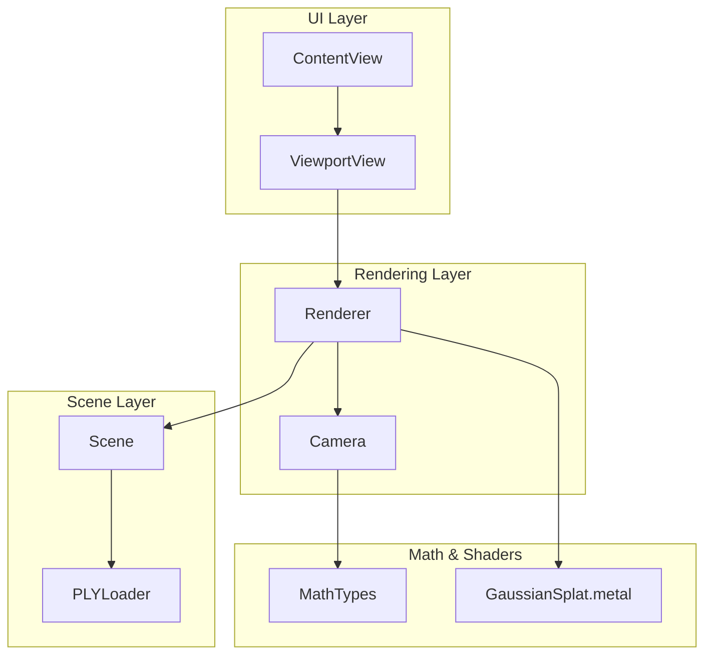
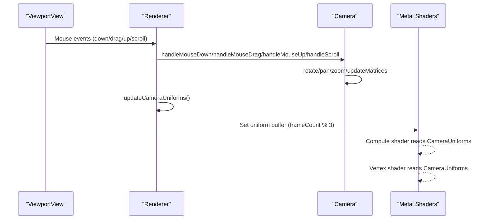
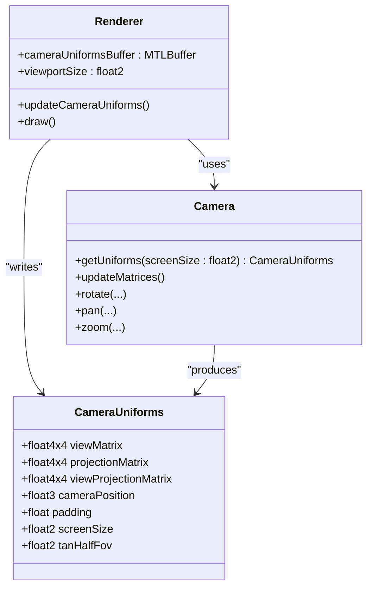
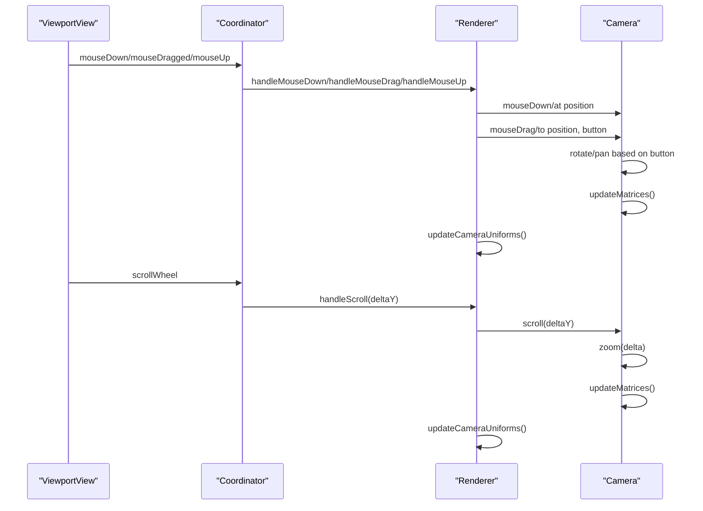
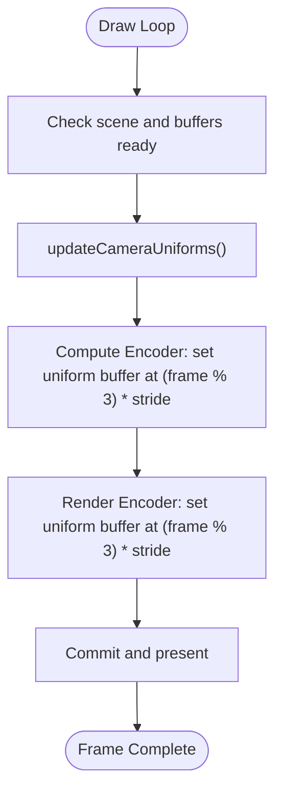
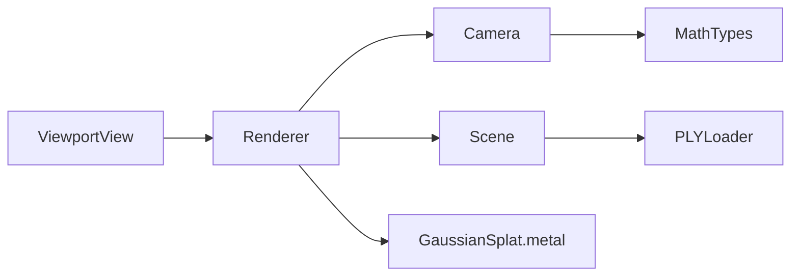

# Camera Integration

<cite>
**Referenced Files in This Document**
- [Camera.swift](file://Rendering/Camera.swift)
- [Renderer.swift](file://Rendering/Renderer.swift)
- [MathTypes.swift](file://Math/MathTypes.swift)
- [GaussianSplat.metal](file://Shaders/GaussianSplat.metal)
- [ViewportView.swift](file://UI/ViewportView.swift)
- [ContentView.swift](file://UI/ContentView.swift)
- [Scene.swift](file://Scene/Scene.swift)
- [PLYLoader.swift](file://Scene/PLYLoader.swift)
</cite>

## Table of Contents
1. [Introduction](#introduction)
2. [Project Structure](#project-structure)
3. [Core Components](#core-components)
4. [Architecture Overview](#architecture-overview)
5. [Detailed Component Analysis](#detailed-component-analysis)
6. [Dependency Analysis](#dependency-analysis)
7. [Performance Considerations](#performance-considerations)
8. [Troubleshooting Guide](#troubleshooting-guide)
9. [Conclusion](#conclusion)

## Introduction
This document explains the camera integration within the Renderer system, focusing on the CameraUniforms structure and its role in the rendering pipeline, uniform buffer layout and memory alignment, camera control integration with mouse input handling for orbit, pan, and zoom operations, camera-to-renderer communication through the updateCameraUniforms method, and frame-based uniform buffer rotation. It also covers practical examples of camera state management, input event processing, viewport adaptation, camera initialization, focus operations on loaded scenes, and aspect ratio handling for different viewport sizes.

## Project Structure
The camera system spans several modules:
- Rendering: Camera and Renderer orchestrate camera state and GPU uniform updates.
- Math: Defines CameraUniforms and math helpers for matrices and transformations.
- Shaders: Define the GPU-side CameraUniforms structure and consume camera data in compute and vertex shaders.
- UI: Provides input handling and viewport adaptation via ViewportView and ContentView.
- Scene: Loads PLY data and computes scene bounds for camera focus operations.

**Diagram sources**
- [Renderer.swift:38-77](file://Rendering/Renderer.swift#L38-L77)
- [Camera.swift:4-60](file://Rendering/Camera.swift#L4-L60)
- [MathTypes.swift:54-62](file://Math/MathTypes.swift#L54-L62)
- [GaussianSplat.metal:16-24](file://Shaders/GaussianSplat.metal#L16-L24)
- [ViewportView.swift:9-26](file://UI/ViewportView.swift#L9-L26)
- [Scene.swift:31-55](file://Scene/Scene.swift#L31-L55)

**Section sources**
- [Renderer.swift:38-77](file://Rendering/Renderer.swift#L38-L77)
- [Camera.swift:4-60](file://Rendering/Camera.swift#L4-L60)
- [MathTypes.swift:54-62](file://Math/MathTypes.swift#L54-L62)
- [GaussianSplat.metal:16-24](file://Shaders/GaussianSplat.metal#L16-L24)
- [ViewportView.swift:9-26](file://UI/ViewportView.swift#L9-L26)
- [Scene.swift:31-55](file://Scene/Scene.swift#L31-L55)

## Core Components
- Camera: Maintains position, target, up vector, spherical coordinates, projection parameters, cached matrices, and sensitivity settings. Exposes methods for orbit, pan, zoom, focus, reset, and mouse interaction handling. Provides CameraUniforms for GPU consumption.
- Renderer: Initializes the camera with the current viewport aspect ratio, manages triple-buffered camera uniforms, rotates the uniform buffer per frame, and integrates camera updates into the draw loop. Handles input forwarding from UI to Camera.
- MathTypes: Defines CameraUniforms with view/projection/viewProjection matrices, camera position, padding, screen size, and half-field-of-view tangents. Includes matrix helpers for lookAt and perspective.
- GaussianSplat.metal: Declares the GPU-side CameraUniforms structure and consumes camera data in compute and vertex shaders for projection and rendering.
- ViewportView: Bridges SwiftUI to Metal, captures mouse events, and forwards them to the Renderer.
- Scene: Loads PLY data, computes scene center/radius, and focuses the camera on loaded scenes.

**Section sources**
- [Camera.swift:4-184](file://Rendering/Camera.swift#L4-L184)
- [Renderer.swift:253-260](file://Rendering/Renderer.swift#L253-L260)
- [MathTypes.swift:54-62](file://Math/MathTypes.swift#L54-L62)
- [GaussianSplat.metal:16-24](file://Shaders/GaussianSplat.metal#L16-L24)
- [ViewportView.swift:38-89](file://UI/ViewportView.swift#L38-L89)
- [Scene.swift:140-151](file://Scene/Scene.swift#L140-L151)

## Architecture Overview
The camera pipeline connects UI input to GPU uniforms through the Renderer and Camera. The Renderer maintains a triple-buffered CameraUniforms buffer and rotates the write offset each frame. The Camera exposes getUniforms(screenSize:) to produce the current uniform set, which includes matrices and derived parameters for the shaders.

**Diagram sources**
- [ViewportView.swift:48-88](file://UI/ViewportView.swift#L48-L88)
- [Renderer.swift:271-287](file://Rendering/Renderer.swift#L271-L287)
- [Camera.swift:87-177](file://Rendering/Camera.swift#L87-L177)
- [Renderer.swift:253-260](file://Rendering/Renderer.swift#L253-L260)
- [GaussianSplat.metal:146-209](file://Shaders/GaussianSplat.metal#L146-L209)

## Detailed Component Analysis

### CameraUniforms Structure and GPU Layout
CameraUniforms is the bridge between CPU camera state and GPU shaders. It includes:
- Matrices: viewMatrix, projectionMatrix, viewProjectionMatrix
- Camera state: cameraPosition
- Padding: a single float to align the structure to 16-byte boundaries
- Screen metrics: screenSize and tanHalfFov

The Renderer allocates a triple-buffered uniform buffer and rounds each uniform stride to a 256-byte boundary to satisfy Metal’s alignment requirements. The updateCameraUniforms method writes the current CameraUniforms at an offset determined by frameCount modulo 3.

**Diagram sources**
- [MathTypes.swift:54-62](file://Math/MathTypes.swift#L54-L62)
- [Renderer.swift:19](file://Rendering/Renderer.swift#L19)
- [Renderer.swift:253-260](file://Rendering/Renderer.swift#L253-L260)
- [Camera.swift:134-147](file://Rendering/Camera.swift#L134-L147)

**Section sources**
- [MathTypes.swift:54-62](file://Math/MathTypes.swift#L54-L62)
- [Renderer.swift:19](file://Rendering/Renderer.swift#L19)
- [Renderer.swift:253-260](file://Rendering/Renderer.swift#L253-L260)
- [Camera.swift:134-147](file://Rendering/Camera.swift#L134-L147)

### Uniform Buffer Layout and Alignment
- The Renderer calculates a uniform stride rounded up to the nearest multiple of 256 bytes to meet Metal alignment constraints.
- The uniform buffer is sized as stride × 3 for triple buffering.
- Each frame, the Renderer selects the write offset as (frameCount % 3) × stride, ensuring CPU and GPU remain synchronized without stalling.

Practical implications:
- Uniforms must be aligned to 256-byte boundaries.
- Triple buffering prevents GPU stalls by allowing CPU to write while GPU reads from a different slot.

**Section sources**
- [Renderer.swift:19](file://Rendering/Renderer.swift#L19)
- [Renderer.swift:129-143](file://Rendering/Renderer.swift#L129-L143)
- [Renderer.swift:201](file://Rendering/Renderer.swift#L201)
- [Renderer.swift:228](file://Rendering/Renderer.swift#L228)

### Camera Control Integration with Mouse Input
The input pipeline flows from SwiftUI to MetalKit, then to Renderer and Camera:
- ViewportView wraps an InteractiveMTKView and forwards mouse events to a Coordinator.
- Coordinator maps button numbers to MouseButton and delegates to Renderer.
- Renderer translates events into Camera methods: rotate, pan, zoom, and mouse state transitions.

Behavior highlights:
- Left drag: orbit around target with azimuth/elevation adjustments and elevation clamped to prevent gimbal lock.
- Right/middle drag: pan by translating the target along view-space axes scaled by distance.
- Scroll: zoom by scaling distance with bounds checking against near/far planes.
- Mouse state: isDragging toggled on down/drag/up to track interaction state.

**Diagram sources**
- [ViewportView.swift:48-88](file://UI/ViewportView.swift#L48-L88)
- [Renderer.swift:271-287](file://Rendering/Renderer.swift#L271-L287)
- [Camera.swift:150-177](file://Rendering/Camera.swift#L150-L177)

**Section sources**
- [ViewportView.swift:48-88](file://UI/ViewportView.swift#L48-L88)
- [Renderer.swift:271-287](file://Rendering/Renderer.swift#L271-L287)
- [Camera.swift:87-115](file://Rendering/Camera.swift#L87-L115)
- [Camera.swift:150-177](file://Rendering/Camera.swift#L150-L177)

### Camera-to-Renderer Communication and Frame-Based Rotation
The Renderer integrates camera updates into the draw loop:
- updateCameraUniforms produces CameraUniforms from the current Camera and writes it into the triple-buffered uniform buffer at the frame-specific offset.
- The compute encoder sets the uniform buffer at the same offset, ensuring the compute shader sees the camera state for the current frame.
- The render encoder also binds the same uniform buffer at the same offset for vertex shader consumption.

This guarantees that compute and render stages operate on the same camera state for the current frame.

**Diagram sources**
- [Renderer.swift:167-251](file://Rendering/Renderer.swift#L167-L251)
- [Renderer.swift:253-260](file://Rendering/Renderer.swift#L253-L260)

**Section sources**
- [Renderer.swift:167-251](file://Rendering/Renderer.swift#L167-L251)
- [Renderer.swift:253-260](file://Rendering/Renderer.swift#L253-L260)

### Practical Examples

#### Camera State Management
- Initialization: The Renderer constructs a Camera with initial position, target, up, FOV, and aspect ratio derived from the MTKView’s drawable size.
- Focus on loaded scene: After loading a scene, the Renderer calls camera.focus(on:radius:) and updates the camera’s aspect ratio to match the current viewport.
- Reset: The Camera.reset method restores default orbit parameters.

References:
- [Renderer.swift:56-60](file://Rendering/Renderer.swift#L56-L60)
- [Renderer.swift:154-157](file://Rendering/Renderer.swift#L154-L157)
- [Camera.swift:125-131](file://Rendering/Camera.swift#L125-L131)

#### Input Event Processing
- Mouse down/drag/up: The Coordinator maps NSEvent button numbers to MouseButton and invokes Renderer methods, which delegate to Camera.mouseDown/mouseDrag/mouseUp.
- Scroll wheel: The Coordinator forwards scrolling deltas to Renderer.handleScroll, which calls Camera.scroll.

References:
- [ViewportView.swift:48-88](file://UI/ViewportView.swift#L48-L88)
- [Renderer.swift:271-287](file://Rendering/Renderer.swift#L271-L287)
- [Camera.swift:150-177](file://Rendering/Camera.swift#L150-L177)

#### Viewport Adaptation
- Drawable size change: The Renderer’s MTKViewDelegate method updates viewportSize and camera.aspectRatio whenever the view resizes.
- Aspect ratio handling: The Camera recomputes projection matrices using the updated aspect ratio, ensuring correct field-of-view scaling.

References:
- [Renderer.swift:162-165](file://Rendering/Renderer.swift#L162-L165)
- [Camera.swift:74-84](file://Rendering/Camera.swift#L74-L84)

#### Scene Loading and Focus Operations
- Scene loading: The ViewModel loads a PLY file asynchronously and calls Renderer.loadScene(from:), which loads the scene and focuses the camera on the scene center/radius.
- Focus operation: The Camera.focus(on:radius:) sets the target and positions the camera at approximately three times the object radius.

References:
- [ViewportView.swift:151-183](file://UI/ViewportView.swift#L151-L183)
- [Renderer.swift:147-158](file://Rendering/Renderer.swift#L147-L158)
- [Scene.swift:140-151](file://Scene/Scene.swift#L140-L151)
- [Camera.swift:118-122](file://Rendering/Camera.swift#L118-L122)

## Dependency Analysis
- Renderer depends on Camera for matrices and uniforms, and on Scene for splat data and sorting.
- Camera depends on MathTypes for matrix utilities and CameraUniforms definition.
- ViewportView depends on Renderer to receive input events and to render the scene.
- Scene depends on PLYLoader for parsing Gaussian splats from PLY files.

**Diagram sources**
- [ViewportView.swift:9-26](file://UI/ViewportView.swift#L9-L26)
- [Renderer.swift:25-26](file://Rendering/Renderer.swift#L25-L26)
- [Camera.swift:4-25](file://Rendering/Camera.swift#L4-L25)
- [Scene.swift:31-55](file://Scene/Scene.swift#L31-L55)
- [PLYLoader.swift:42-68](file://Scene/PLYLoader.swift#L42-L68)
- [MathTypes.swift:54-62](file://Math/MathTypes.swift#L54-L62)
- [GaussianSplat.metal:16-24](file://Shaders/GaussianSplat.metal#L16-L24)

**Section sources**
- [ViewportView.swift:9-26](file://UI/ViewportView.swift#L9-L26)
- [Renderer.swift:25-26](file://Rendering/Renderer.swift#L25-L26)
- [Camera.swift:4-25](file://Rendering/Camera.swift#L4-L25)
- [Scene.swift:31-55](file://Scene/Scene.swift#L31-L55)
- [PLYLoader.swift:42-68](file://Scene/PLYLoader.swift#L42-L68)
- [MathTypes.swift:54-62](file://Math/MathTypes.swift#L54-L62)
- [GaussianSplat.metal:16-24](file://Shaders/GaussianSplat.metal#L16-L24)

## Performance Considerations
- Triple-buffered uniforms: Using three slots avoids GPU stalls by decoupling CPU writes from GPU reads.
- Frame-based rotation: Writing at (frameCount % 3) × stride ensures predictable, non-blocking updates.
- Depth sorting interval: The Renderer sorts splats every N frames to balance quality and performance.
- Matrix recomputation: Camera.updateMatrices recalculates view/projection matrices only when inputs change, minimizing redundant work.

[No sources needed since this section provides general guidance]

## Troubleshooting Guide
Common issues and resolutions:
- Incorrect aspect ratio after resize: Ensure the Renderer updates camera.aspectRatio in the MTKViewDelegate method and that Camera.updateMatrices is invoked after resizing.
- Jittery camera movement: Verify that mouse drag deltas are computed correctly and that rotation/pan sensitivity values are tuned appropriately.
- Uniform misalignment errors: Confirm that the uniform stride is a multiple of 256 and that offsets are calculated as (frame % 3) × stride.
- No visible scene after loading: Check that Renderer.loadScene calls camera.focus and updates camera.aspectRatio, and that Scene.isLoaded is true before drawing.

**Section sources**
- [Renderer.swift:162-165](file://Rendering/Renderer.swift#L162-L165)
- [Camera.swift:63-84](file://Rendering/Camera.swift#L63-L84)
- [Renderer.swift:19-20](file://Rendering/Renderer.swift#L19-L20)
- [Renderer.swift:147-158](file://Rendering/Renderer.swift#L147-L158)
- [Renderer.swift:170-172](file://Rendering/Renderer.swift#L170-L172)

## Conclusion
The camera integration in the Renderer system is designed for responsive interaction and efficient GPU utilization. CameraUniforms encapsulates all necessary camera state for the shaders, with strict alignment and triple-buffering to prevent stalls. The input pipeline from SwiftUI to MetalKit to Renderer and Camera enables smooth orbit, pan, and zoom controls. The Renderer orchestrates camera updates within the draw loop, ensuring compute and render stages share the same camera state per frame. Scene loading and focus operations provide a seamless experience for navigating loaded Gaussian splatting scenes across varying viewport sizes.