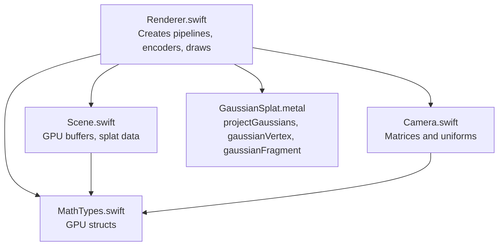
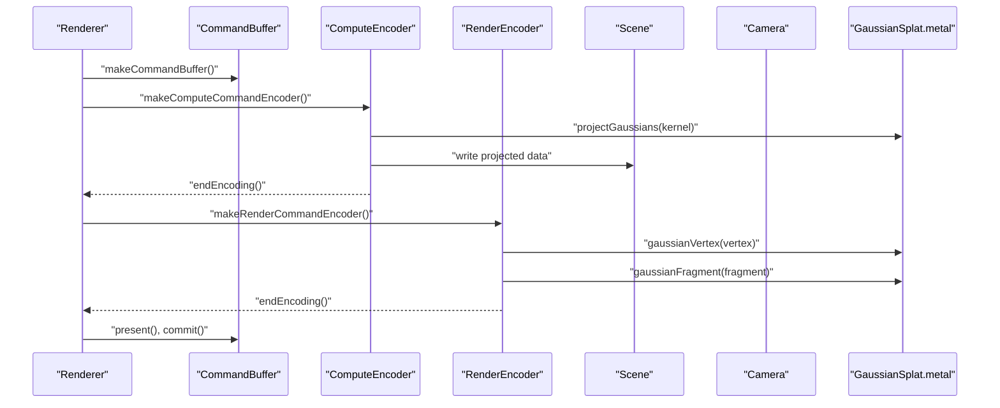
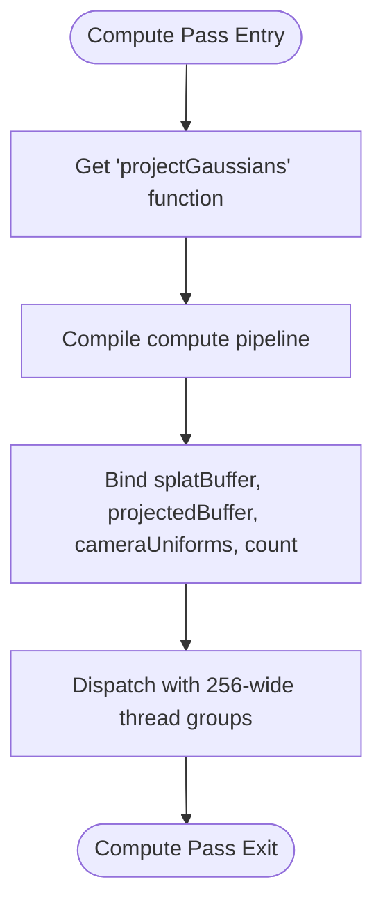
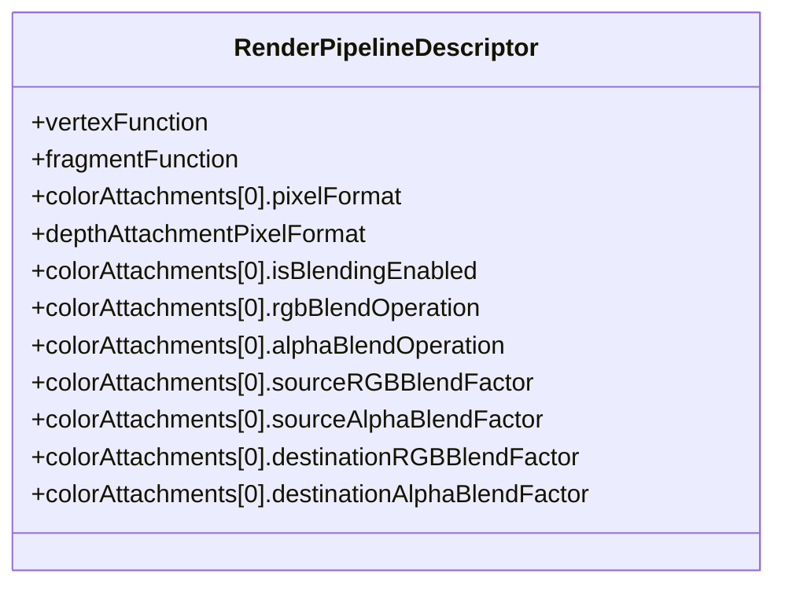
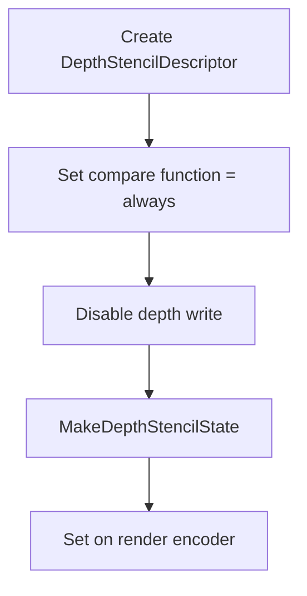
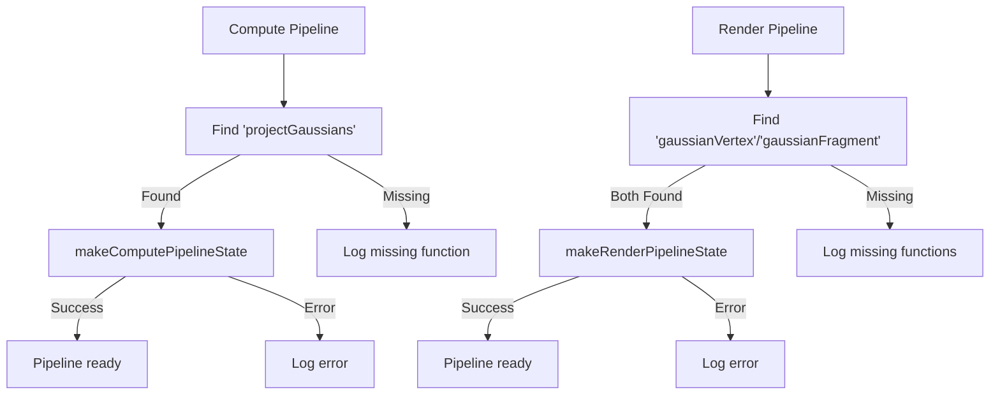
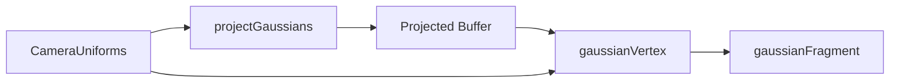
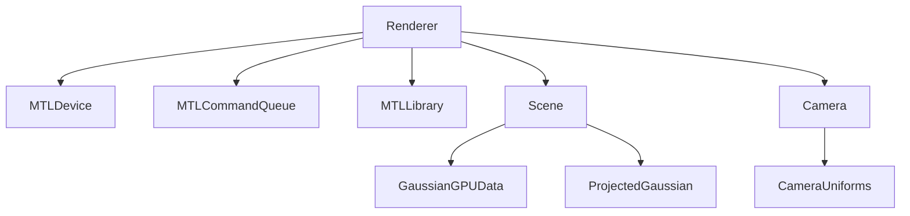

# Metal Pipeline Management

<cite>
**Referenced Files in This Document**
- [Renderer.swift](file://Rendering/Renderer.swift)
- [GaussianSplat.metal](file://Shaders/GaussianSplat.metal)
- [MathTypes.swift](file://Math/MathTypes.swift)
- [Scene.swift](file://Scene/Scene.swift)
- [Camera.swift](file://Rendering/Camera.swift)
</cite>

## Table of Contents
1. [Introduction](#introduction)
2. [Project Structure](#project-structure)
3. [Core Components](#core-components)
4. [Architecture Overview](#architecture-overview)
5. [Detailed Component Analysis](#detailed-component-analysis)
6. [Dependency Analysis](#dependency-analysis)
7. [Performance Considerations](#performance-considerations)
8. [Troubleshooting Guide](#troubleshooting-guide)
9. [Conclusion](#conclusion)

## Introduction
This document explains Metal pipeline management in the Renderer class, focusing on:
- Compute pipeline creation for Gaussian projection using the projectGaussians function
- Thread group sizing and dispatch configuration
- Render pipeline setup with vertex and fragment shader functions
- Blending configuration for transparency
- Depth stencil state creation
- Pipeline state validation and error handling
- Relationship between compute and render pipelines
- Practical examples of pipeline descriptor configuration, function compilation, and state validation
- Performance considerations and reuse strategies

## Project Structure
The Gaussian Splatting renderer integrates Swift-based Metal setup with Metal shading language (MSL) compute and fragment shaders. The key files involved are:
- Renderer.swift: Initializes Metal device, command queue, shader library, and creates compute and render pipelines. Drives the compute and render passes each frame.
- GaussianSplat.metal: Defines compute, vertex, and fragment functions plus shared structures and math utilities.
- MathTypes.swift: Declares GPU-compatible structures (CameraUniforms, GaussianGPUData, ProjectedGaussian) used across Swift and MSL.
- Scene.swift: Manages GPU buffers for splats and projected data, and provides CPU-side sorting.
- Camera.swift: Provides camera matrices and uniforms passed to shaders.

**Diagram sources**
- [Renderer.swift:38-77](file://Rendering/Renderer.swift#L38-L77)
- [Scene.swift:26-95](file://Scene/Scene.swift#L26-L95)
- [Camera.swift:134-147](file://Rendering/Camera.swift#L134-L147)
- [GaussianSplat.metal:146-278](file://Shaders/GaussianSplat.metal#L146-L278)
- [MathTypes.swift:34-73](file://Math/MathTypes.swift#L34-L73)

**Section sources**
- [Renderer.swift:38-77](file://Rendering/Renderer.swift#L38-L77)
- [GaussianSplat.metal:146-278](file://Shaders/GaussianSplat.metal#L146-L278)
- [MathTypes.swift:34-73](file://Math/MathTypes.swift#L34-L73)
- [Scene.swift:26-95](file://Scene/Scene.swift#L26-L95)
- [Camera.swift:134-147](file://Rendering/Camera.swift#L134-L147)

## Core Components
- Compute pipeline: Compiles the projectGaussians kernel and validates creation.
- Render pipeline: Compiles gaussianVertex and gaussianFragment, sets pixel and depth formats, enables alpha blending, and validates creation.
- Uniform buffer: Triple-buffered CameraUniforms for efficient CPU/GPU synchronization.
- Index buffer: Shared quad indices for instanced rendering of projected Gaussians.
- Depth stencil state: Configured to disable depth writes and always pass depth tests.

Key responsibilities:
- Pipeline creation and error logging
- Frame-based uniform updates
- Compute dispatch with fixed thread group size
- Render pass with indexed instanced drawing

**Section sources**
- [Renderer.swift:81-127](file://Rendering/Renderer.swift#L81-L127)
- [Renderer.swift:129-143](file://Rendering/Renderer.swift#L129-L143)
- [Renderer.swift:262-267](file://Rendering/Renderer.swift#L262-L267)

## Architecture Overview
The renderer executes a two-stage pipeline each frame:
1) Compute pass: projectGaussians transforms raw splat data into projected per-splat data (depth, conic, color, opacity, radius).
2) Render pass: gaussianVertex and gaussianFragment draw instanced quads with premultiplied alpha blending.

**Diagram sources**
- [Renderer.swift:167-251](file://Rendering/Renderer.swift#L167-L251)
- [GaussianSplat.metal:146-278](file://Shaders/GaussianSplat.metal#L146-L278)

## Detailed Component Analysis

### Compute Pipeline: projectGaussians
- Function compilation: The compute function named projectGaussians is retrieved from the shader library and compiled into a compute pipeline state.
- Validation: Creation is wrapped in a do-catch block; errors are logged and pipeline remains nil if creation fails.
- Buffer bindings:
  - Buffer 0: Input splat data (GaussianGPUData)
  - Buffer 1: Output projected data (ProjectedGaussian)
  - Buffer 2: CameraUniforms (tripled-buffered)
  - Buffer 3: Splat count (UInt32)
- Dispatch configuration:
  - Thread group size: 256 threads in X dimension
  - Thread groups: Ceiling division of splatCount by 256
  - Dispatch call uses threadGroups and threadsPerThreadgroup

**Diagram sources**
- [Renderer.swift:81-93](file://Rendering/Renderer.swift#L81-L93)
- [Renderer.swift:194-218](file://Rendering/Renderer.swift#L194-L218)
- [GaussianSplat.metal:146-209](file://Shaders/GaussianSplat.metal#L146-L209)

**Section sources**
- [Renderer.swift:81-93](file://Rendering/Renderer.swift#L81-L93)
- [Renderer.swift:194-218](file://Rendering/Renderer.swift#L194-L218)
- [GaussianSplat.metal:146-209](file://Shaders/GaussianSplat.metal#L146-L209)

### Render Pipeline: Vertex and Fragment Shaders
- Function compilation:
  - Vertex function: gaussianVertex
  - Fragment function: gaussianFragment
- Descriptor configuration:
  - Color attachment pixel format: BGRA8 unorm sRGB
  - Depth attachment pixel format: depth32Float
  - Blending enabled with additive blending and one-oneMinusSourceAlpha factors for premultiplied alpha
- Validation: Creation is wrapped in a do-catch block; errors are logged and pipeline remains nil if creation fails.

**Diagram sources**
- [Renderer.swift:95-127](file://Rendering/Renderer.swift#L95-L127)

**Section sources**
- [Renderer.swift:95-127](file://Rendering/Renderer.swift#L95-L127)
- [GaussianSplat.metal:213-249](file://Shaders/GaussianSplat.metal#L213-L249)
- [GaussianSplat.metal:253-278](file://Shaders/GaussianSplat.metal#L253-L278)

### Depth Stencil State
- Depth compare function: always
- Depth write disabled
- Created once per frame and set on the render encoder

**Diagram sources**
- [Renderer.swift:262-267](file://Rendering/Renderer.swift#L262-L267)

**Section sources**
- [Renderer.swift:262-267](file://Rendering/Renderer.swift#L262-L267)

### Pipeline State Validation and Error Handling
- Compute pipeline creation:
  - Retrieves function by name; logs failure if not found
  - Compilation wrapped in do-catch; logs error on failure
- Render pipeline creation:
  - Retrieves vertex and fragment functions; logs failure if either is missing
  - Compilation wrapped in do-catch; logs error on failure
- Command buffer completion handler checks for error and logs failure message

**Diagram sources**
- [Renderer.swift:81-93](file://Rendering/Renderer.swift#L81-L93)
- [Renderer.swift:95-127](file://Rendering/Renderer.swift#L95-L127)
- [Renderer.swift:244-248](file://Rendering/Renderer.swift#L244-L248)

**Section sources**
- [Renderer.swift:81-93](file://Rendering/Renderer.swift#L81-L93)
- [Renderer.swift:95-127](file://Rendering/Renderer.swift#L95-L127)
- [Renderer.swift:244-248](file://Rendering/Renderer.swift#L244-L248)

### Relationship Between Compute and Render Pipelines
- Compute pipeline writes ProjectedGaussian data to a GPU buffer.
- Render pipeline reads the projected data and draws instanced quads.
- Both share CameraUniforms for consistent transformations.
- The render pass uses a quad index buffer to draw four vertices per instance.

**Diagram sources**
- [Renderer.swift:194-242](file://Rendering/Renderer.swift#L194-L242)
- [GaussianSplat.metal:146-278](file://Shaders/GaussianSplat.metal#L146-L278)

**Section sources**
- [Renderer.swift:194-242](file://Rendering/Renderer.swift#L194-L242)
- [GaussianSplat.metal:146-278](file://Shaders/GaussianSplat.metal#L146-L278)

### Practical Examples: Pipeline Descriptor Configuration, Function Compilation, and State Validation
- Function compilation:
  - Compute: retrieve function by name and compile to compute pipeline state
  - Render: retrieve vertex and fragment functions and compile to render pipeline state
- Descriptor configuration:
  - Render pipeline descriptor sets vertex and fragment functions, pixel formats, and blending parameters
- State validation:
  - Try/catch around pipeline creation; log errors and continue with safe defaults

These steps are implemented in the Renderer class initialization and pipeline creation methods.

**Section sources**
- [Renderer.swift:81-127](file://Rendering/Renderer.swift#L81-L127)

## Dependency Analysis
- Renderer depends on:
  - Metal device and command queue
  - Shader library for function retrieval
  - Scene for GPU buffers and splat counts
  - Camera for uniforms and matrices
- Shader module defines:
  - Structures compatible with Swift GPU types
  - Compute, vertex, and fragment functions
- Scene manages GPU buffers and provides isLoaded checks used in the draw loop.

**Diagram sources**
- [Renderer.swift:8-14](file://Rendering/Renderer.swift#L8-L14)
- [Scene.swift:12-24](file://Scene/Scene.swift#L12-L24)
- [MathTypes.swift:34-73](file://Math/MathTypes.swift#L34-L73)
- [Camera.swift:134-147](file://Rendering/Camera.swift#L134-L147)

**Section sources**
- [Renderer.swift:8-14](file://Rendering/Renderer.swift#L8-L14)
- [Scene.swift:12-24](file://Scene/Scene.swift#L12-L24)
- [MathTypes.swift:34-73](file://Math/MathTypes.swift#L34-L73)
- [Camera.swift:134-147](file://Rendering/Camera.swift#L134-L147)

## Performance Considerations
- Pipeline creation cost:
  - Prefer creating pipelines once during initialization and reusing them across frames.
  - Avoid recreating pipelines every frame; the current code does this correctly by invoking creation once in init.
- Dispatch sizing:
  - Fixed thread group width of 256 is efficient for most GPUs; ensure splatCount is reasonably sized to avoid excessive small groups.
  - Use ceiling division to cover all splats with minimal wasted threads.
- Buffer management:
  - Triple-buffering CameraUniforms reduces CPU/GPU synchronization stalls.
  - Private storage mode for projected buffer minimizes cache pollution compared to shared buffers.
- Blending:
  - Premultiplied alpha with one-oneMinusSourceAlpha avoids overdraw artifacts and reduces blending overhead.
- Depth testing:
  - Depth writes disabled with always compare allows correct order-independent transparency when combined with back-to-front sorting.

[No sources needed since this section provides general guidance]

## Troubleshooting Guide
Common issues and remedies:
- Missing shader functions:
  - Verify function names match between Swift and MSL.
  - Ensure the shader library loads successfully from the app bundle.
- Pipeline creation failures:
  - Check that vertex and fragment functions are both present for render pipeline.
  - Validate pixel formats and blending parameters.
- Runtime errors:
  - Inspect command buffer completion handler for Metal errors.
- Incorrect rendering:
  - Confirm CameraUniforms are updated per frame and triple-buffered offsets are correct.
  - Ensure splat count is set before dispatch and that projected buffer is bound for compute output.

**Section sources**
- [Renderer.swift:81-93](file://Rendering/Renderer.swift#L81-L93)
- [Renderer.swift:95-127](file://Rendering/Renderer.swift#L95-L127)
- [Renderer.swift:244-248](file://Rendering/Renderer.swift#L244-L248)

## Conclusion
The Renderer class implements a robust two-stage Metal pipeline for Gaussian splatting:
- A compute pass projects splats into screen-space data using projectGaussians.
- A render pass draws instanced quads with premultiplied alpha blending and a depth stencil state configured for transparency.
- Pipelines are created once and reused, with careful buffer management and triple-buffered uniforms for performance.
- Error handling is present at each stage to aid debugging and graceful degradation.

[No sources needed since this section summarizes without analyzing specific files]