# Renderer Engine

<cite>
**Referenced Files in This Document**
- [Renderer.swift](file://Rendering/Renderer.swift)
- [GaussianSplat.metal](file://Shaders/GaussianSplat.metal)
- [ViewportView.swift](file://UI/ViewportView.swift)
- [MathTypes.swift](file://Math/MathTypes.swift)
- [Scene.swift](file://Scene/Scene.swift)
- [Camera.swift](file://Rendering/Camera.swift)
- [PLYLoader.swift](file://Scene/PLYLoader.swift)
- [ContentView.swift](file://UI/ContentView.swift)
</cite>

## Table of Contents
1. [Introduction](#introduction)
2. [Project Structure](#project-structure)
3. [Core Components](#core-components)
4. [Architecture Overview](#architecture-overview)
5. [Detailed Component Analysis](#detailed-component-analysis)
6. [Dependency Analysis](#dependency-analysis)
7. [Performance Considerations](#performance-considerations)
8. [Troubleshooting Guide](#troubleshooting-guide)
9. [Conclusion](#conclusion)

## Introduction

The Renderer class serves as the main rendering engine for the Gaussian Splat Viewer, implementing a sophisticated Metal-based graphics pipeline for real-time rendering of 3D Gaussian splatting scenes. This document provides comprehensive coverage of the Metal integration architecture, including compute pipeline creation, render pipeline configuration, and triple-buffered uniform management. It details the three-stage rendering pipeline: compute pass for Gaussian projection, depth sorting implementation, and render pass for instanced quad drawing.

The renderer integrates seamlessly with SwiftUI through a dedicated MTKView delegate implementation, managing command buffer lifecycle, GPU resource allocation, and camera controls. The system employs advanced GPU techniques including compute shaders for efficient Gaussian projection, instanced rendering for optimal performance, and sophisticated depth-based compositing with premultiplied alpha blending.

## Project Structure

The Gaussian Splat Viewer follows a clean modular architecture with distinct layers for rendering, math utilities, scene management, and user interface integration.

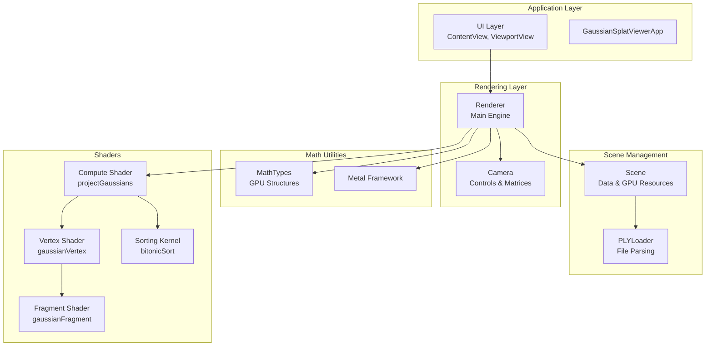

**Diagram sources**
- [Renderer.swift:1-288](file://Rendering/Renderer.swift#L1-L288)
- [Scene.swift:1-140](file://Scene/Scene.swift#L1-L140)
- [GaussianSplat.metal:1-309](file://Shaders/GaussianSplat.metal#L1-L309)

**Section sources**
- [Renderer.swift:1-288](file://Rendering/Renderer.swift#L1-L288)
- [Scene.swift:1-140](file://Scene/Scene.swift#L1-L140)
- [GaussianSplat.metal:1-309](file://Shaders/GaussianSplat.metal#L1-L309)

## Core Components

### Renderer Class Architecture

The Renderer class implements a comprehensive Metal-based rendering system with the following key components:

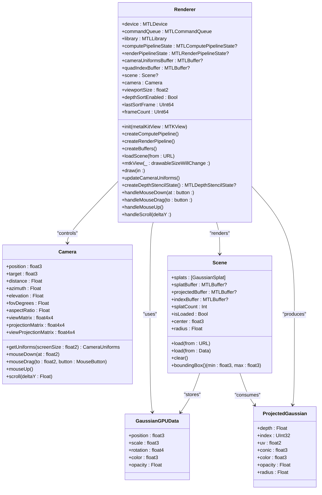

**Diagram sources**
- [Renderer.swift:6-287](file://Rendering/Renderer.swift#L6-L287)
- [Camera.swift:5-183](file://Rendering/Camera.swift#L5-L183)
- [Scene.swift:6-134](file://Scene/Scene.swift#L6-L134)
- [MathTypes.swift:35-73](file://Math/MathTypes.swift#L35-L73)

### Metal Pipeline States

The renderer creates two primary pipeline states for different stages of the rendering process:

1. **Compute Pipeline**: Processes Gaussian splats and projects them to screen space
2. **Render Pipeline**: Handles instanced quad rendering with proper blending

**Section sources**
- [Renderer.swift:81-127](file://Rendering/Renderer.swift#L81-L127)
- [GaussianSplat.metal:138-201](file://Shaders/GaussianSplat.metal#L138-L201)

## Architecture Overview

The Gaussian Splat Viewer implements a sophisticated three-stage rendering pipeline that efficiently processes thousands of Gaussian splats in real-time:

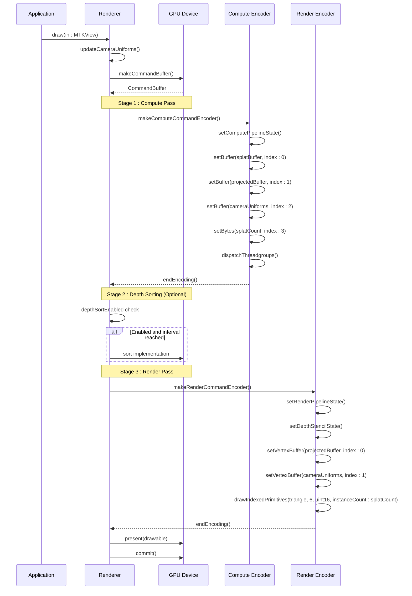

**Diagram sources**
- [Renderer.swift:166-250](file://Rendering/Renderer.swift#L166-L250)
- [GaussianSplat.metal:138-201](file://Shaders/GaussianSplat.metal#L138-L201)

## Detailed Component Analysis

### Metal Integration Architecture

The renderer establishes comprehensive Metal integration through careful pipeline state management and resource allocation strategies.

#### Compute Pipeline Creation

The compute pipeline is specifically designed for Gaussian projection calculations:

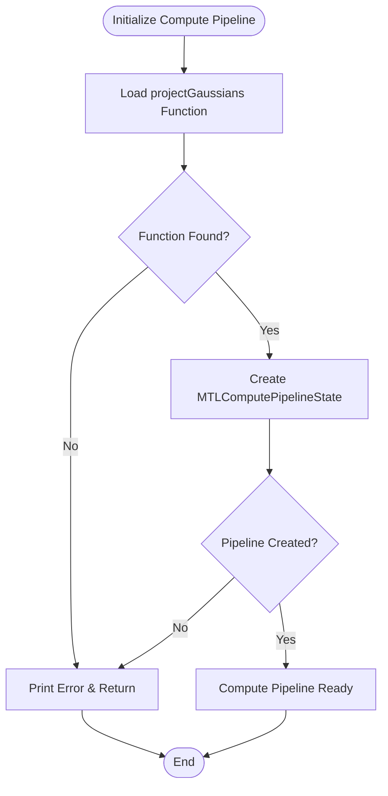

**Diagram sources**
- [Renderer.swift:81-93](file://Rendering/Renderer.swift#L81-L93)
- [GaussianSplat.metal:138-144](file://Shaders/GaussianSplat.metal#L138-L144)

#### Render Pipeline Configuration

The render pipeline implements sophisticated blending for proper Gaussian compositing:

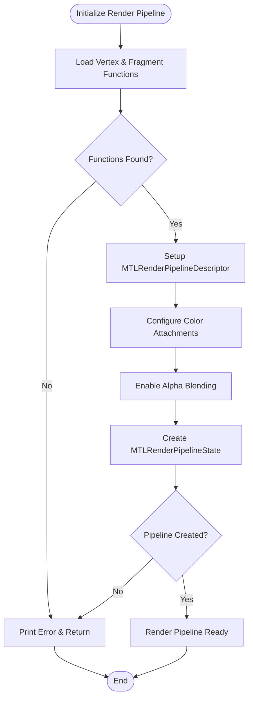

**Diagram sources**
- [Renderer.swift:95-127](file://Rendering/Renderer.swift#L95-L127)
- [GaussianSplat.metal:205-270](file://Shaders/GaussianSplat.metal#L205-L270)

#### Triple-Buffered Uniform Management

The renderer implements a sophisticated triple-buffering strategy for camera uniforms to prevent synchronization conflicts:

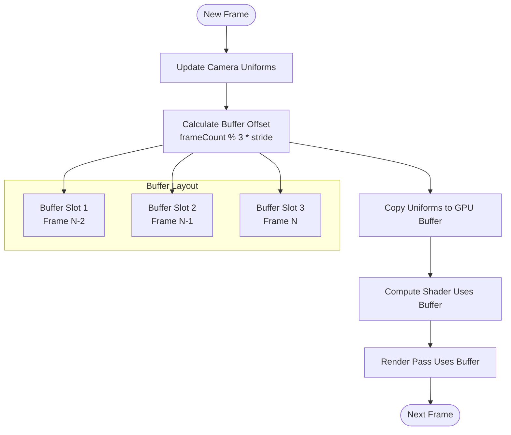

**Diagram sources**
- [Renderer.swift:194-195](file://Rendering/Renderer.swift#L194-L195)
- [Renderer.swift:252-259](file://Rendering/Renderer.swift#L252-L259)

**Section sources**
- [Renderer.swift:13-143](file://Rendering/Renderer.swift#L13-L143)
- [Renderer.swift:252-259](file://Rendering/Renderer.swift#L252-L259)

### Three-Stage Rendering Pipeline

The renderer implements a carefully orchestrated three-stage pipeline for optimal performance and visual quality.

#### Stage 1: Compute Pass for Gaussian Projection

The compute pass transforms 3D Gaussian splats into screen-space projections with covariance matrices:

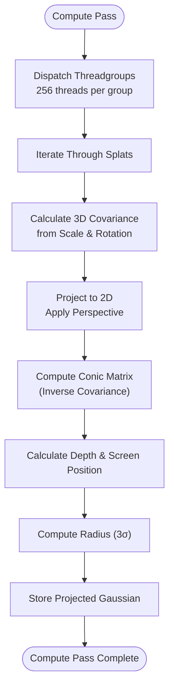

**Diagram sources**
- [Renderer.swift:186-211](file://Rendering/Renderer.swift#L186-L211)
- [GaussianSplat.metal:138-201](file://Shaders/GaussianSplat.metal#L138-L201)

#### Stage 2: Depth Sorting Implementation

The renderer includes infrastructure for depth-based sorting to improve rendering quality:

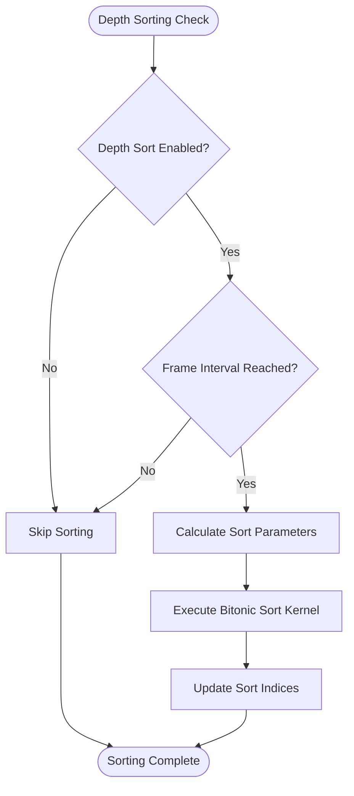

**Diagram sources**
- [Renderer.swift:213-217](file://Rendering/Renderer.swift#L213-L217)
- [GaussianSplat.metal:274-308](file://Shaders/GaussianSplat.metal#L274-L308)

#### Stage 3: Render Pass for Instanced Quad Drawing

The final render pass draws instanced quads with proper Gaussian evaluation:

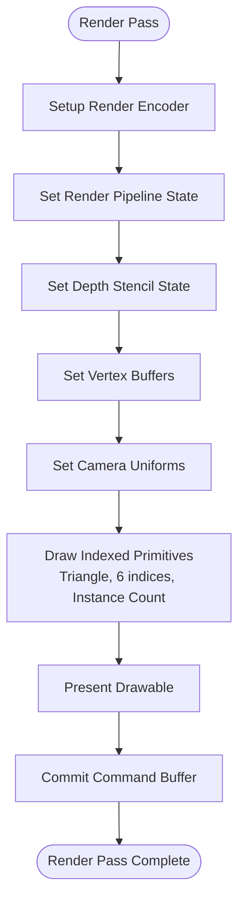

**Diagram sources**
- [Renderer.swift:219-241](file://Rendering/Renderer.swift#L219-L241)
- [GaussianSplat.metal:205-270](file://Shaders/GaussianSplat.metal#L205-L270)

**Section sources**
- [Renderer.swift:166-250](file://Rendering/Renderer.swift#L166-L250)
- [GaussianSplat.metal:138-270](file://Shaders/GaussianSplat.metal#L138-L270)

### MTKViewDelegate Implementation

The renderer implements the MTKViewDelegate protocol for seamless Metal integration:

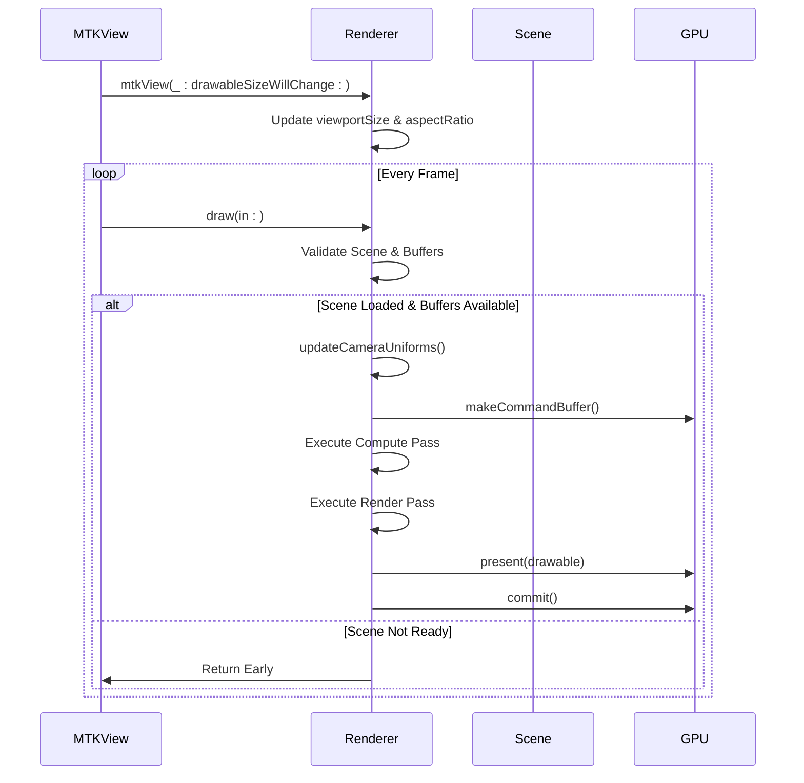

**Diagram sources**
- [Renderer.swift:161-250](file://Rendering/Renderer.swift#L161-L250)

**Section sources**
- [Renderer.swift:161-250](file://Rendering/Renderer.swift#L161-L250)

### Command Buffer Management

The renderer implements robust command buffer lifecycle management with proper error handling:

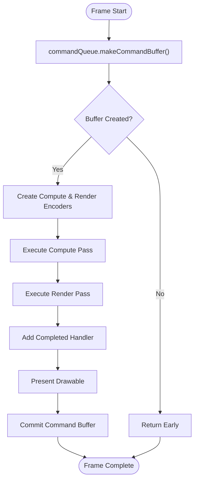

**Diagram sources**
- [Renderer.swift:175-249](file://Rendering/Renderer.swift#L175-L249)

**Section sources**
- [Renderer.swift:175-249](file://Rendering/Renderer.swift#L175-L249)

### GPU Resource Allocation Strategies

The renderer employs strategic GPU memory allocation for optimal performance:

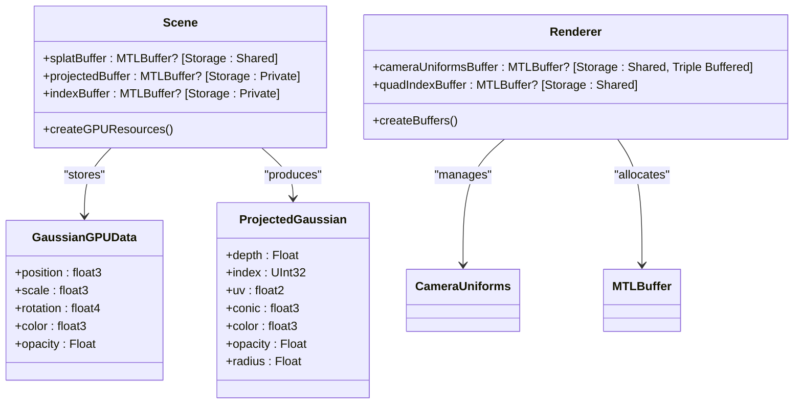

**Diagram sources**
- [Scene.swift:58-95](file://Scene/Scene.swift#L58-L95)
- [Renderer.swift:129-143](file://Rendering/Renderer.swift#L129-L143)
- [MathTypes.swift:35-73](file://Math/MathTypes.swift#L35-L73)

**Section sources**
- [Scene.swift:58-95](file://Scene/Scene.swift#L58-L95)
- [Renderer.swift:129-143](file://Rendering/Renderer.swift#L129-L143)

## Dependency Analysis

The renderer maintains clean separation of concerns through well-defined dependencies:

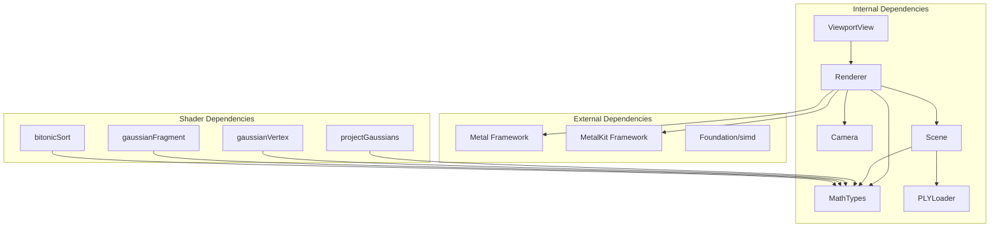

**Diagram sources**
- [Renderer.swift:1-7](file://Rendering/Renderer.swift#L1-L7)
- [Scene.swift:1-4](file://Scene/Scene.swift#L1-L4)
- [GaussianSplat.metal:1-4](file://Shaders/GaussianSplat.metal#L1-L4)

**Section sources**
- [Renderer.swift:1-7](file://Rendering/Renderer.swift#L1-L7)
- [Scene.swift:1-4](file://Scene/Scene.swift#L1-L4)

## Performance Considerations

### Compute Shader Optimization

The compute shader implementation employs several optimization strategies:

1. **Thread Group Efficiency**: Uses 256-thread groups for optimal GPU utilization
2. **Vectorized Operations**: Leverages SIMD operations for mathematical computations
3. **Early Termination**: Discards invisible Gaussians to reduce GPU workload
4. **Memory Coalescing**: Sequential access patterns for optimal memory bandwidth

### Rendering Pipeline Optimizations

The renderer implements multiple performance optimizations:

1. **Triple Buffering**: Prevents synchronization stalls between CPU and GPU
2. **Instanced Rendering**: Reduces draw call overhead for thousands of Gaussians
3. **Efficient Blending**: Uses premultiplied alpha for optimal compositing performance
4. **Selective Sorting**: Configurable depth sorting to balance quality vs. performance

### Memory Management Strategies

1. **Buffer Pooling**: Reuses GPU buffers across frames when possible
2. **Appropriate Storage Modes**: Uses shared storage for frequently updated data
3. **Private Storage for Computed Results**: Keeps intermediate results in fast GPU memory
4. **Proper Alignment**: Ensures proper memory alignment for optimal performance

## Troubleshooting Guide

### Common Metal Issues and Solutions

#### Pipeline Creation Failures

**Issue**: Compute or render pipeline fails to create
**Solution**: Verify shader function names match exactly and Metal library loads successfully

**Section sources**
- [Renderer.swift:82-92](file://Rendering/Renderer.swift#L82-L92)
- [Renderer.swift:99-126](file://Rendering/Renderer.swift#L99-L126)

#### Buffer Allocation Errors

**Issue**: GPU buffer creation fails during scene loading
**Solution**: Check available GPU memory and verify buffer sizes are reasonable

**Section sources**
- [Scene.swift:68-85](file://Scene/Scene.swift#L68-L85)

#### Rendering Artifacts

**Issue**: Gaussians appear incorrectly or with artifacts
**Solution**: Verify camera uniform calculations and ensure proper depth testing configuration

**Section sources**
- [Renderer.swift:261-266](file://Rendering/Renderer.swift#L261-L266)
- [GaussianSplat.metal:245-270](file://Shaders/GaussianSplat.metal#L245-L270)

#### Performance Issues

**Issue**: Low frame rates with large scenes
**Solution**: Consider reducing scene complexity, enabling selective sorting, or optimizing shader performance

**Section sources**
- [Renderer.swift:213-217](file://Rendering/Renderer.swift#L213-L217)
- [Renderer.swift:202-208](file://Rendering/Renderer.swift#L202-L208)

### Debugging Techniques

1. **Enable Metal API Validation**: Use Xcode's Metal API validation to catch runtime errors
2. **Monitor GPU Memory**: Track buffer allocations and memory usage patterns
3. **Frame Capture Analysis**: Use Xcode's GPU Frame Capture to analyze rendering performance
4. **Shader Debugging**: Utilize Metal Shading Language debugger for compute shader issues

## Conclusion

The Renderer class provides a comprehensive and optimized solution for Gaussian splatting visualization using Metal. Its sophisticated three-stage pipeline, triple-buffered uniform management, and efficient resource allocation strategies deliver high-performance rendering capabilities for complex 3D scenes.

The architecture demonstrates excellent separation of concerns, with clear responsibilities for scene management, camera control, and rendering pipeline execution. The Metal integration is thorough and leverages modern GPU features including compute shaders, instanced rendering, and advanced blending techniques.

Key strengths of the implementation include:
- Efficient compute shader utilization for Gaussian projection
- Sophisticated depth-based sorting infrastructure
- Robust command buffer and resource management
- Comprehensive error handling and validation
- Clean architectural separation and extensibility

The system provides a solid foundation for Gaussian splatting applications and can be extended with additional features such as advanced sorting algorithms, dynamic LOD systems, or enhanced lighting models while maintaining its performance characteristics.