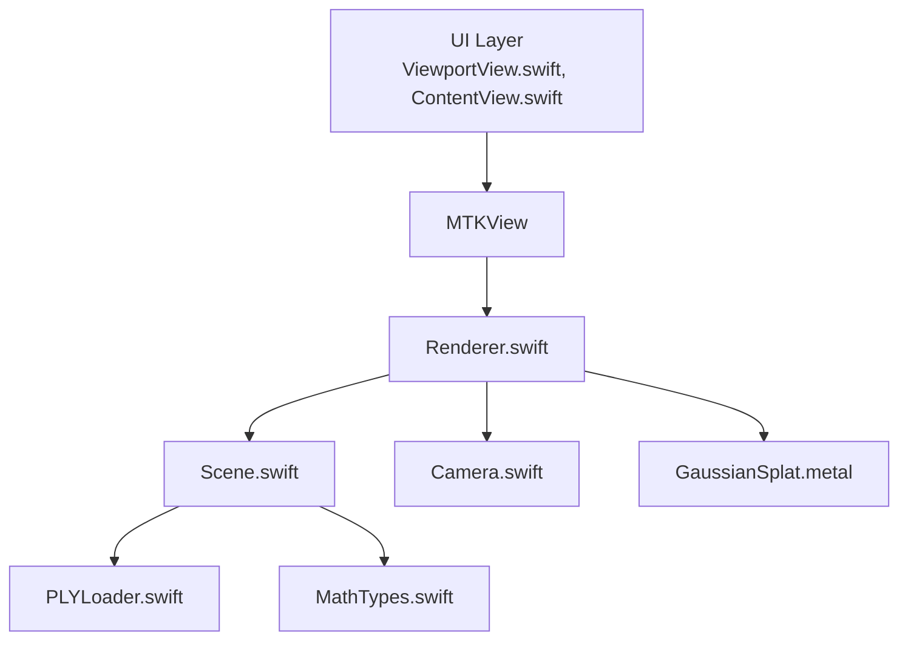
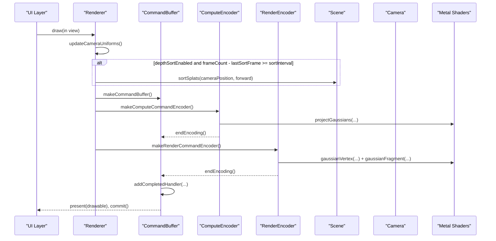
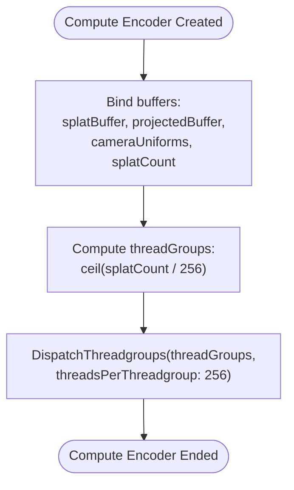
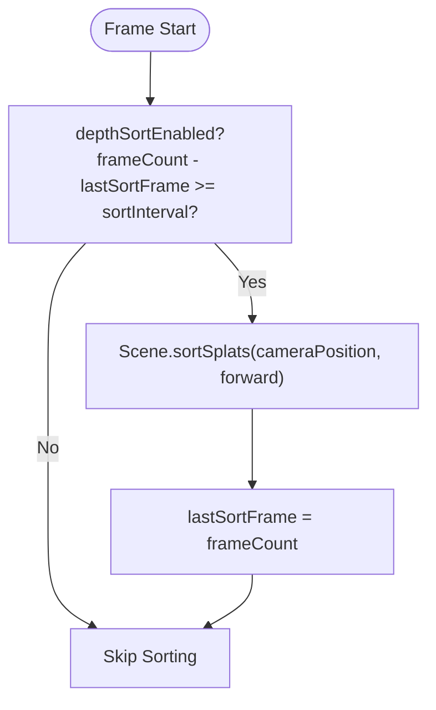
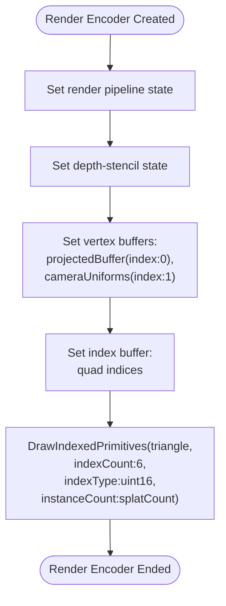
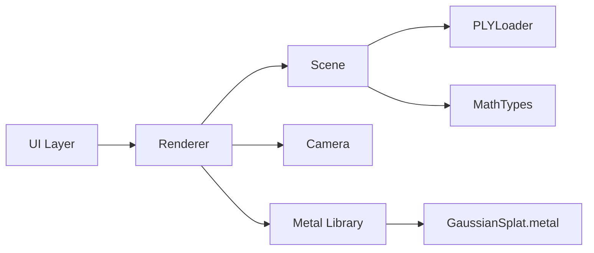

# Rendering Stages

<cite>
**Referenced Files in This Document**
- [Renderer.swift](file://Rendering/Renderer.swift)
- [GaussianSplat.metal](file://Shaders/GaussianSplat.metal)
- [Scene.swift](file://Scene/Scene.swift)
- [Camera.swift](file://Rendering/Camera.swift)
- [MathTypes.swift](file://Math/MathTypes.swift)
- [PLYLoader.swift](file://Scene/PLYLoader.swift)
- [ViewportView.swift](file://UI/ViewportView.swift)
- [ContentView.swift](file://UI/ContentView.swift)
</cite>

## Table of Contents
1. [Introduction](#introduction)
2. [Project Structure](#project-structure)
3. [Core Components](#core-components)
4. [Architecture Overview](#architecture-overview)
5. [Detailed Component Analysis](#detailed-component-analysis)
6. [Dependency Analysis](#dependency-analysis)
7. [Performance Considerations](#performance-considerations)
8. [Troubleshooting Guide](#troubleshooting-guide)
9. [Conclusion](#conclusion)

## Introduction
This document explains the three-stage rendering pipeline implemented in the Renderer. It covers:
- Stage 1: Compute pass for Gaussian projection, including buffer binding, uniform setup, and thread group dispatch calculations.
- Stage 2: Planned depth sorting mechanism with frame interval management and sorting frequency controls.
- Stage 3: Render pass implementation with instanced quad drawing, vertex buffer setup, and index buffer usage.
It also documents command buffer management, encoder lifecycle, and completion handler implementation, and provides practical examples and optimization strategies for each stage.

## Project Structure
The rendering pipeline spans Swift code (Renderer, Scene, Camera, UI) and Metal shaders (GaussianSplat.metal). The UI integrates a MetalKit view and delegates rendering to the Renderer, which orchestrates compute and render passes, manages GPU buffers, and applies camera transforms.

**Diagram sources**
- [ViewportView.swift:1-185](file://UI/ViewportView.swift#L1-L185)
- [Renderer.swift:1-289](file://Rendering/Renderer.swift#L1-L289)
- [Scene.swift:1-158](file://Scene/Scene.swift#L1-L158)
- [Camera.swift:1-184](file://Rendering/Camera.swift#L1-L184)
- [GaussianSplat.metal:1-317](file://Shaders/GaussianSplat.metal#L1-L317)
- [PLYLoader.swift:1-403](file://Scene/PLYLoader.swift#L1-L403)
- [MathTypes.swift:1-189](file://Math/MathTypes.swift#L1-L189)

**Section sources**
- [Renderer.swift:1-289](file://Rendering/Renderer.swift#L1-L289)
- [GaussianSplat.metal:1-317](file://Shaders/GaussianSplat.metal#L1-L317)
- [Scene.swift:1-158](file://Scene/Scene.swift#L1-L158)
- [Camera.swift:1-184](file://Rendering/Camera.swift#L1-L184)
- [MathTypes.swift:1-189](file://Math/MathTypes.swift#L1-L189)
- [PLYLoader.swift:1-403](file://Scene/PLYLoader.swift#L1-L403)
- [ViewportView.swift:1-185](file://UI/ViewportView.swift#L1-L185)
- [ContentView.swift:1-130](file://UI/ContentView.swift#L1-L130)

## Core Components
- Renderer: Orchestrates compute and render passes, manages buffers, camera uniforms, and frame counters. Implements depth sorting control and triple-buffered camera uniform updates.
- Scene: Loads Gaussian splats from PLY, creates GPU buffers, and sorts splats on the CPU for depth-based rendering.
- Camera: Provides view/projection matrices and uniforms for the GPU.
- GaussianSplat.metal: Contains compute, vertex, and fragment shaders for projection, instanced quad rendering, and sorting kernels.
- UI: Wraps MTKView and forwards input events to the Renderer.

Key responsibilities:
- Buffer creation and binding for splat data, projected data, and index buffer.
- Compute dispatch sizing aligned to splat count.
- Instanced rendering with shared index buffer and per-instance projected data.
- Triple-buffered camera uniform writes to avoid GPU-CPU synchronization stalls.

**Section sources**
- [Renderer.swift:6-289](file://Rendering/Renderer.swift#L6-L289)
- [Scene.swift:1-158](file://Scene/Scene.swift#L1-L158)
- [Camera.swift:1-184](file://Rendering/Camera.swift#L1-L184)
- [GaussianSplat.metal:1-317](file://Shaders/GaussianSplat.metal#L1-L317)

## Architecture Overview
The Renderer’s draw loop performs three stages per frame:
1) Depth sorting (optional) — sorts splats back-to-front for correct alpha blending.
2) Compute pass — projects Gaussians to screen space and prepares per-splat data for rendering.
3) Render pass — draws instanced quads using per-instance projected data and a shared index buffer.

**Diagram sources**
- [Renderer.swift:167-251](file://Rendering/Renderer.swift#L167-L251)
- [GaussianSplat.metal:146-278](file://Shaders/GaussianSplat.metal#L146-L278)
- [Scene.swift:105-121](file://Scene/Scene.swift#L105-L121)
- [Camera.swift:134-147](file://Rendering/Camera.swift#L134-L147)

## Detailed Component Analysis

### Stage 1: Compute Pass for Gaussian Projection
Purpose:
- Transform 3D Gaussian splats into 2D projected data with depth, conic parameters, and radius for efficient rasterization.

Key steps:
- Bind splat buffer (input) and projected buffer (output).
- Bind camera uniforms buffer (tripled-buffered).
- Set splat count argument for the compute kernel.
- Dispatch compute with thread group size and grid size derived from splat count.

Buffer binding and arguments:
- Buffer 0: splatBuffer (device const GaussianGPUData*)
- Buffer 1: projectedBuffer (device ProjectedGaussian*)
- Buffer 2: camera uniforms (constant CameraUniforms&)
- Buffer 3: splatCount (constant uint&)
- Thread group size: 256 threads per group.
- Grid size: ceil(splatCount / 256).

Shader responsibilities:
- Compute 3D covariance from scale and rotation.
- Project covariance to 2D using view/projection matrices and FOV.
- Derive conic parameters (inverse covariance) and radius.
- Write ProjectedGaussian entries with depth, index, UV, conic, color, opacity, radius.

Timing and coordination:
- Runs unconditionally each frame after optional depth sorting.
- Uses triple-buffered camera uniforms to avoid write-read conflicts across frames.

Optimization tips:
- Keep splat count stable to minimize buffer reallocation overhead.
- Ensure splat data is tightly packed and aligned to 256-byte strides for uniform buffers.
- Consider reducing sorting frequency for large scenes.

**Section sources**
- [Renderer.swift:194-218](file://Rendering/Renderer.swift#L194-L218)
- [GaussianSplat.metal:146-209](file://Shaders/GaussianSplat.metal#L146-L209)
- [MathTypes.swift:34-73](file://Math/MathTypes.swift#L34-L73)

#### Compute Dispatch Flow

**Diagram sources**
- [Renderer.swift:209-215](file://Rendering/Renderer.swift#L209-L215)
- [GaussianSplat.metal:146-152](file://Shaders/GaussianSplat.metal#L146-L152)

### Stage 2: Planned Depth Sorting Mechanism
Current state:
- Implemented on CPU: Scene.sortSplats computes back-to-front ordering using dot product with camera forward vector and updates the splat buffer.

Planned improvements:
- Add a compute-based sorting pass using the provided bitonicSort kernel in the shaders.
- Use an index buffer to reorder instances without rewriting splat data.
- Control sorting frequency via frame intervals to balance correctness and performance.

Controls:
- depthSortEnabled: toggle sorting on/off.
- sortInterval: frames between sorting passes.
- lastSortFrame/frameCount: frame interval management.

Frequency control:
- Sorting occurs when frameCount - lastSortFrame >= sortInterval.
- Adjust sortInterval to trade off quality vs. CPU cost.

Practical example:
- For a 100k splats scene, set sortInterval to 5–10 frames to reduce CPU overhead while maintaining acceptable blending order.

**Section sources**
- [Renderer.swift:30-34](file://Rendering/Renderer.swift#L30-L34)
- [Renderer.swift:187-191](file://Rendering/Renderer.swift#L187-L191)
- [Scene.swift:105-121](file://Scene/Scene.swift#L105-L121)
- [GaussianSplat.metal:282-316](file://Shaders/GaussianSplat.metal#L282-L316)

#### Depth Sorting Flow

**Diagram sources**
- [Renderer.swift:187-191](file://Rendering/Renderer.swift#L187-L191)
- [Scene.swift:105-121](file://Scene/Scene.swift#L105-L121)

### Stage 3: Render Pass with Instanced Quad Drawing
Purpose:
- Draw each Gaussian as an instanced quad, using per-instance projected data and a shared index buffer.

Setup:
- Render pipeline with vertex and fragment functions.
- Depth stencil state configured for alpha blending (no depth writes).
- Vertex buffers:
  - Buffer 0: projectedBuffer (ProjectedGaussian[])
  - Buffer 1: camera uniforms (constant CameraUniforms&) via triple-buffered offset.
- Index buffer:
  - Shared quad indices [0,1,2,2,1,3] for two triangles.

Instanced draw:
- Primitive type: triangle
- Index count: 6
- Index type: uint16
- Instance count: splatCount
- Vertex shader generates per-quad positions from projected data and camera uniforms.

Optimization tips:
- Reuse quad index buffer across frames.
- Keep vertex attributes minimal; ProjectedGaussian is compact.
- Consider front-to-back rendering (sorting) to reduce overdraw.

**Section sources**
- [Renderer.swift:221-242](file://Rendering/Renderer.swift#L221-L242)
- [GaussianSplat.metal:213-278](file://Shaders/GaussianSplat.metal#L213-L278)
- [MathTypes.swift:64-73](file://Math/MathTypes.swift#L64-L73)

#### Render Pass Flow

**Diagram sources**
- [Renderer.swift:221-242](file://Rendering/Renderer.swift#L221-L242)
- [GaussianSplat.metal:213-249](file://Shaders/GaussianSplat.metal#L213-L249)

### Command Buffer Management, Encoder Lifecycle, and Completion Handler
Lifecycle:
- Create command buffer from command queue.
- Create compute encoder, encode compute commands, end compute encoder.
- Create render encoder, encode render commands, end render encoder.
- Add completion handler to capture errors.
- Present drawable and commit command buffer.

Completion handler:
- Logs Metal command buffer failure details if present.

Best practices:
- Use triple-buffered camera uniforms to avoid contention.
- Ensure buffers are created with appropriate storage modes (shared/private).
- Keep encoder creation and encoding within the same frame to prevent synchronization issues.

**Section sources**
- [Renderer.swift:167-251](file://Rendering/Renderer.swift#L167-L251)

## Dependency Analysis
Renderer depends on Scene for GPU buffers and splat data, Camera for uniforms, and Metal library for shader functions. Scene depends on PLYLoader for data ingestion and MathTypes for data structures. UI wraps MTKView and forwards input to Renderer.

**Diagram sources**
- [Renderer.swift:1-289](file://Rendering/Renderer.swift#L1-L289)
- [Scene.swift:1-158](file://Scene/Scene.swift#L1-L158)
- [Camera.swift:1-184](file://Rendering/Camera.swift#L1-L184)
- [GaussianSplat.metal:1-317](file://Shaders/GaussianSplat.metal#L1-L317)
- [PLYLoader.swift:1-403](file://Scene/PLYLoader.swift#L1-L403)
- [MathTypes.swift:1-189](file://Math/MathTypes.swift#L1-L189)
- [ViewportView.swift:1-185](file://UI/ViewportView.swift#L1-L185)

**Section sources**
- [Renderer.swift:1-289](file://Rendering/Renderer.swift#L1-L289)
- [Scene.swift:1-158](file://Scene/Scene.swift#L1-L158)
- [Camera.swift:1-184](file://Rendering/Camera.swift#L1-L184)
- [GaussianSplat.metal:1-317](file://Shaders/GaussianSplat.metal#L1-L317)
- [PLYLoader.swift:1-403](file://Scene/PLYLoader.swift#L1-L403)
- [MathTypes.swift:1-189](file://Math/MathTypes.swift#L1-L189)
- [ViewportView.swift:1-185](file://UI/ViewportView.swift#L1-L185)

## Performance Considerations
- Compute pass:
  - Use 256 threads per group; ensure grid size aligns to splat count to avoid underutilization.
  - Keep splat data contiguous and aligned to minimize memory bandwidth pressure.
- Sorting:
  - Reduce sortInterval for dynamic scenes; increase for static scenes.
  - Consider GPU-based bitonic sort using provided kernel and index buffer to avoid CPU overhead.
- Render pass:
  - Alpha blending requires back-to-front ordering; enable sorting when transparency is used.
  - Minimize overdraw by sorting and early discard in fragment shader.
- Uniforms:
  - Triple-buffered camera uniforms prevent stalls; ensure stride alignment matches shader expectations.
- Index buffer:
  - Reuse quad indices to avoid repeated buffer uploads.

[No sources needed since this section provides general guidance]

## Troubleshooting Guide
Common issues and remedies:
- No rendering output:
  - Verify compute and render pipelines are created successfully.
  - Ensure scene is loaded and splatBuffer/projectedBuffer/indexBuffer are initialized.
- Incorrect blending or artifacts:
  - Confirm depth sorting is enabled and happening at appropriate intervals.
  - Check depth-stencil state is configured for alpha blending.
- Performance drops:
  - Reduce sortInterval or disable sorting temporarily.
  - Ensure splat count is reasonable; large scenes benefit from GPU sorting.
- Command buffer errors:
  - Inspect completion handler logs for Metal errors.

**Section sources**
- [Renderer.swift:81-127](file://Rendering/Renderer.swift#L81-L127)
- [Renderer.swift:167-251](file://Rendering/Renderer.swift#L167-L251)
- [Scene.swift:57-95](file://Scene/Scene.swift#L57-L95)

## Conclusion
The Renderer implements a robust three-stage pipeline: compute-based Gaussian projection, optional depth sorting, and instanced quad rendering. The design leverages triple-buffered uniforms, shared index buffers, and careful encoder lifecycle management. For production readiness, consider migrating sorting to the GPU using the provided bitonic kernel and tuning sortInterval based on scene dynamics and performance targets.