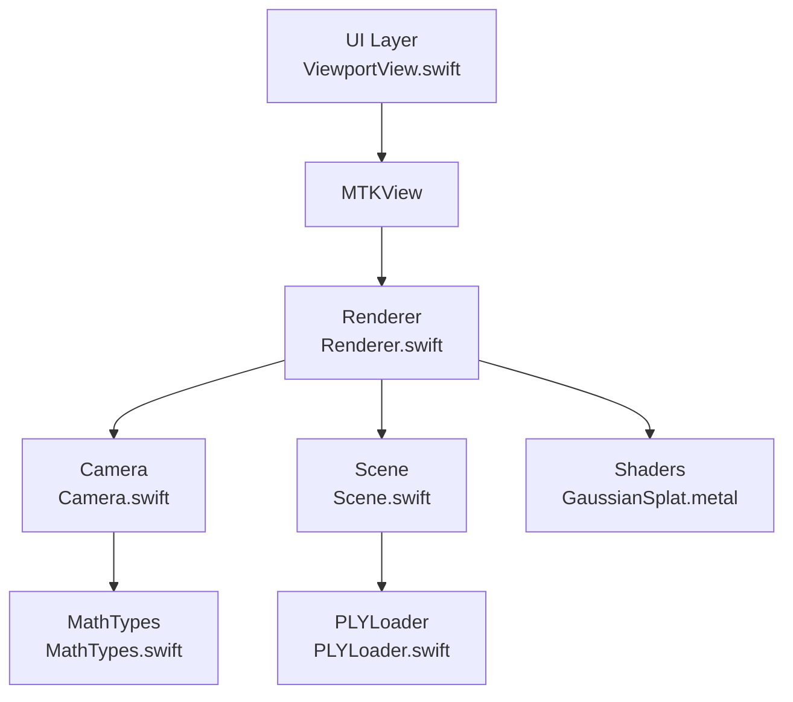
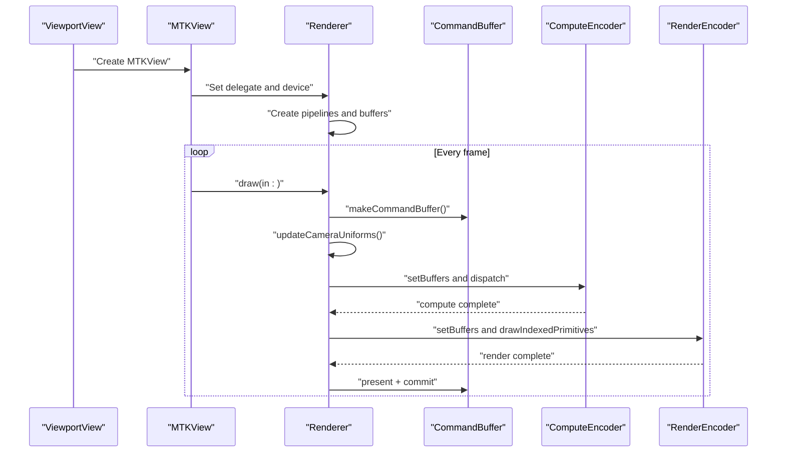
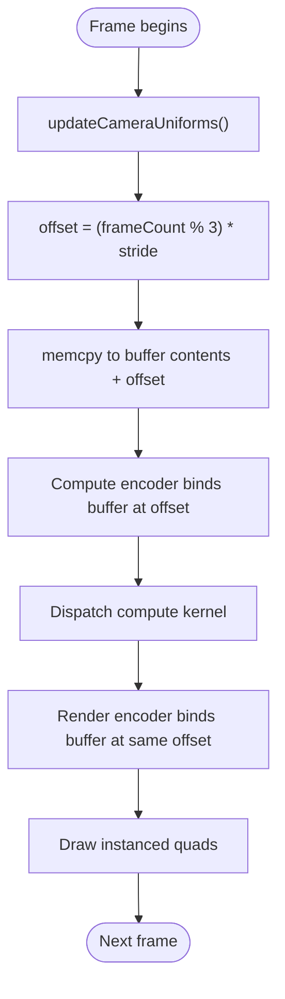
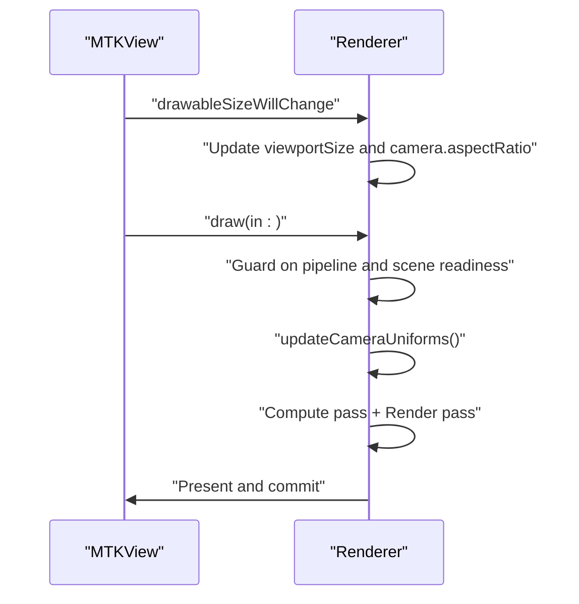
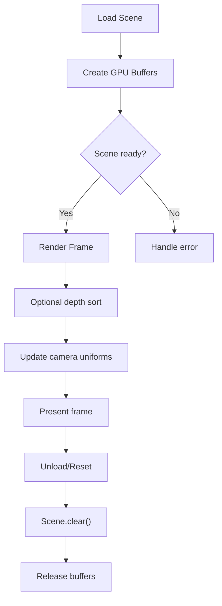
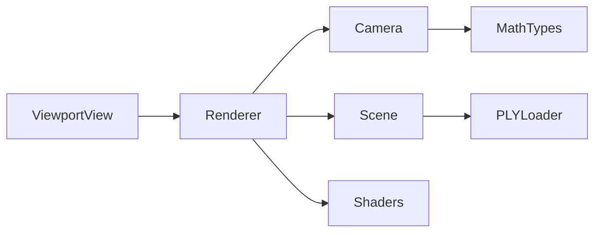

# Resource Management

<cite>
**Referenced Files in This Document**
- [Renderer.swift](file://Rendering/Renderer.swift)
- [Camera.swift](file://Rendering/Camera.swift)
- [Scene.swift](file://Scene/Scene.swift)
- [MathTypes.swift](file://Math/MathTypes.swift)
- [GaussianSplat.metal](file://Shaders/GaussianSplat.metal)
- [ViewportView.swift](file://UI/ViewportView.swift)
- [PLYLoader.swift](file://Scene/PLYLoader.swift)
</cite>

## Table of Contents
1. [Introduction](#introduction)
2. [Project Structure](#project-structure)
3. [Core Components](#core-components)
4. [Architecture Overview](#architecture-overview)
5. [Detailed Component Analysis](#detailed-component-analysis)
6. [Dependency Analysis](#dependency-analysis)
7. [Performance Considerations](#performance-considerations)
8. [Troubleshooting Guide](#troubleshooting-guide)
9. [Conclusion](#conclusion)

## Introduction
This document focuses on GPU resource management in the Renderer class, with emphasis on the triple-buffered camera uniforms system, buffer creation strategies, memory alignment, CPU-GPU synchronization, and MTKViewDelegate integration. It also covers buffer lifecycles for camera data, quad indices, and scene data, including storage modes and memory optimization. Practical examples demonstrate buffer lifecycle management, memory cleanup, and resource validation, along with common pitfalls, leak prevention, and performance monitoring strategies.

## Project Structure
The rendering pipeline is centered around a Renderer that owns Metal device resources, pipelines, and buffers. The Scene manages Gaussian splat data and GPU buffers. The Camera provides uniforms consumed by shaders. The UI layer integrates with MTKView and delegates drawing to the Renderer.

**Diagram sources**
- [ViewportView.swift:1-185](file://UI/ViewportView.swift#L1-L185)
- [Renderer.swift:1-289](file://Rendering/Renderer.swift#L1-L289)
- [Camera.swift:1-184](file://Rendering/Camera.swift#L1-L184)
- [Scene.swift:1-158](file://Scene/Scene.swift#L1-L158)
- [PLYLoader.swift:1-403](file://Scene/PLYLoader.swift#L1-L403)
- [GaussianSplat.metal:1-317](file://Shaders/GaussianSplat.metal#L1-L317)
- [MathTypes.swift:1-189](file://Math/MathTypes.swift#L1-L189)

**Section sources**
- [Renderer.swift:1-289](file://Rendering/Renderer.swift#L1-L289)
- [ViewportView.swift:1-185](file://UI/ViewportView.swift#L1-L185)

## Core Components
- Renderer: Creates and manages Metal device, command queue, pipelines, and buffers. Implements MTKViewDelegate to handle drawable size changes and drawing. Uses triple-buffered camera uniforms for CPU-GPU synchronization.
- Camera: Provides CameraUniforms for GPU consumption, including matrices, camera position, screen size, and field-of-view tangents.
- Scene: Loads Gaussian splats from PLY, creates GPU buffers for splat data, projected data, and indices, and sorts splats for alpha blending.
- MathTypes: Defines GPU-compatible structures (CameraUniforms, GaussianGPUData, ProjectedGaussian) and SIMD types used across Swift and Metal.
- Shaders: Define the compute and render passes that consume camera uniforms and splat data.

Key GPU resource areas:
- Triple-buffered camera uniforms buffer with stride alignment for Metal’s 256-byte binding granularity.
- Shared storage for camera uniforms to reduce GPU memory pressure.
- Private storage for compute output buffers to keep GPU-local data hot.
- Index buffer for sorting indices in compute kernels.
- Quad index buffer for instanced rendering of splats.

**Section sources**
- [Renderer.swift:16-143](file://Rendering/Renderer.swift#L16-L143)
- [Camera.swift:133-147](file://Rendering/Camera.swift#L133-L147)
- [Scene.swift:57-95](file://Scene/Scene.swift#L57-L95)
- [MathTypes.swift:53-73](file://Math/MathTypes.swift#L53-L73)
- [GaussianSplat.metal:16-34](file://Shaders/GaussianSplat.metal#L16-L34)

## Architecture Overview
The Renderer initializes Metal resources, sets up MTKView with appropriate pixel formats and clear color, and draws frames by updating camera uniforms, dispatching compute work, and issuing render commands. The Scene holds GPU buffers for splat data and computed projections, while the Camera supplies uniforms aligned to Metal’s binding requirements.

**Diagram sources**
- [Renderer.swift:167-251](file://Rendering/Renderer.swift#L167-L251)
- [ViewportView.swift:9-26](file://UI/ViewportView.swift#L9-L26)

## Detailed Component Analysis

### Triple-Buffered Camera Uniforms System
The Renderer maintains a triple-buffered camera uniforms buffer to decouple CPU updates from GPU consumption. The buffer length equals stride times three, and the per-frame offset is determined by the modulo of the frame counter with three.

- Stride calculation: The stride is calculated to align to Metal’s 256-byte binding granularity, ensuring each uniform block resides on a 256-byte boundary. This prevents misalignment penalties and ensures coherent access patterns.
- Storage mode: The camera uniforms buffer uses shared storage, balancing CPU write throughput and GPU read performance.
- CPU-GPU synchronization: The Renderer writes the current frame’s uniforms at an offset based on frameCount % 3. The compute and render encoders bind the same offset, ensuring the GPU reads the correct frame’s uniforms without stalling.

**Diagram sources**
- [Renderer.swift:19-20](file://Rendering/Renderer.swift#L19-L20)
- [Renderer.swift:130-143](file://Rendering/Renderer.swift#L130-L143)
- [Renderer.swift:201-202](file://Rendering/Renderer.swift#L201-L202)
- [Renderer.swift:228-229](file://Rendering/Renderer.swift#L228-L229)
- [Renderer.swift:253-260](file://Rendering/Renderer.swift#L253-L260)

**Section sources**
- [Renderer.swift:19-20](file://Rendering/Renderer.swift#L19-L20)
- [Renderer.swift:130-143](file://Rendering/Renderer.swift#L130-L143)
- [Renderer.swift:201-202](file://Rendering/Renderer.swift#L201-L202)
- [Renderer.swift:228-229](file://Rendering/Renderer.swift#L228-L229)
- [Renderer.swift:253-260](file://Rendering/Renderer.swift#L253-L260)

### Buffer Creation and Memory Alignment
- Camera uniforms buffer: Created with length equal to stride times three and shared storage mode. The stride calculation ensures 256-byte alignment for Metal binding.
- Quad index buffer: Pre-populated with indices for a single quad triangle strip, stored in shared storage for fast GPU access.
- Scene buffers:
  - Splat buffer: CPU-side array mapped to GPU via shared storage for initial upload.
  - Projected buffer: GPU compute output buffer using private storage to keep data close to the GPU.
  - Index buffer: GPU-local buffer for sorting indices, also using private storage.

Storage mode rationale:
- Shared: Balances CPU writes and GPU reads; suitable for uniforms and small, frequently updated data.
- Private: Keeps GPU-local data hot and reduces bus traffic; ideal for compute outputs and indices.

**Section sources**
- [Renderer.swift:130-143](file://Rendering/Renderer.swift#L130-L143)
- [Scene.swift:64-95](file://Scene/Scene.swift#L64-L95)

### MTKViewDelegate Implementation
The Renderer implements MTKViewDelegate to:
- Respond to drawable size changes by updating viewport size and camera aspect ratio.
- Configure MTKView with appropriate pixel formats (.bgra8Unorm_srgb for color, .depth32Float for depth) and clear color.
- Drive the draw cycle by validating scene readiness and GPU buffers, updating camera uniforms, dispatching compute work, and performing the render pass.

**Diagram sources**
- [Renderer.swift:162-165](file://Rendering/Renderer.swift#L162-L165)
- [Renderer.swift:66-68](file://Rendering/Renderer.swift#L66-L68)
- [Renderer.swift:167-251](file://Rendering/Renderer.swift#L167-L251)

**Section sources**
- [Renderer.swift:66-68](file://Rendering/Renderer.swift#L66-L68)
- [Renderer.swift:162-165](file://Rendering/Renderer.swift#L162-L165)
- [Renderer.swift:167-251](file://Rendering/Renderer.swift#L167-L251)

### Buffer Lifecycle Management and Cleanup
- Creation: Buffers are created during initialization and when loading scenes. The Scene constructs splat, projected, and index buffers upon successful PLY load.
- Updates: Camera uniforms are copied per frame at the selected triple-buffer offset. Scene data is updated when sorting occurs.
- Destruction: The Scene provides a clear method that releases all GPU buffers and resets internal state. This is essential to prevent leaks when switching scenes or unloading data.

**Diagram sources**
- [Scene.swift:31-55](file://Scene/Scene.swift#L31-L55)
- [Scene.swift:57-95](file://Scene/Scene.swift#L57-L95)
- [Scene.swift:97-103](file://Scene/Scene.swift#L97-L103)
- [Renderer.swift:167-251](file://Rendering/Renderer.swift#L167-L251)

**Section sources**
- [Scene.swift:31-55](file://Scene/Scene.swift#L31-L55)
- [Scene.swift:57-95](file://Scene/Scene.swift#L57-L95)
- [Scene.swift:97-103](file://Scene/Scene.swift#L97-L103)

### Practical Examples

- Triple-buffered camera uniforms:
  - Allocate a buffer sized to stride times three.
  - Compute offset as (frameCount % 3) * stride.
  - Bind the same offset in compute and render encoders.
  - Update uniforms per frame using memcpy at the computed offset.

- Buffer creation for camera data, quad indices, and scene data:
  - Camera uniforms: shared storage, triple-buffered.
  - Quad indices: shared storage, small fixed-size buffer.
  - Scene splat data: shared storage for initial upload.
  - Projected data: private storage for compute output.
  - Index buffer: private storage for sorting.

- Memory cleanup:
  - Call Scene.clear() to release buffers and reset state.
  - Ensure MTKView is removed from the view hierarchy to allow Metal to reclaim resources.

- Resource validation:
  - Verify pipeline states and scene readiness before drawing.
  - Check buffer validity and sizes before binding.

**Section sources**
- [Renderer.swift:130-143](file://Rendering/Renderer.swift#L130-L143)
- [Renderer.swift:201-202](file://Rendering/Renderer.swift#L201-L202)
- [Renderer.swift:228-229](file://Rendering/Renderer.swift#L228-L229)
- [Scene.swift:57-95](file://Scene/Scene.swift#L57-L95)
- [Scene.swift:97-103](file://Scene/Scene.swift#L97-L103)

## Dependency Analysis
The Renderer depends on Camera for uniforms, Scene for splat data and GPU buffers, and Shaders for compute and render stages. The UI layer provides the MTKView and delegates drawing to the Renderer.

**Diagram sources**
- [Renderer.swift:1-289](file://Rendering/Renderer.swift#L1-L289)
- [Camera.swift:1-184](file://Rendering/Camera.swift#L1-L184)
- [Scene.swift:1-158](file://Scene/Scene.swift#L1-L158)
- [ViewportView.swift:1-185](file://UI/ViewportView.swift#L1-L185)
- [PLYLoader.swift:1-403](file://Scene/PLYLoader.swift#L1-L403)
- [MathTypes.swift:1-189](file://Math/MathTypes.swift#L1-L189)
- [GaussianSplat.metal:1-317](file://Shaders/GaussianSplat.metal#L1-L317)

**Section sources**
- [Renderer.swift:1-289](file://Rendering/Renderer.swift#L1-L289)
- [Camera.swift:1-184](file://Rendering/Camera.swift#L1-L184)
- [Scene.swift:1-158](file://Scene/Scene.swift#L1-L158)
- [ViewportView.swift:1-185](file://UI/ViewportView.swift#L1-L185)
- [PLYLoader.swift:1-403](file://Scene/PLYLoader.swift#L1-L403)
- [MathTypes.swift:1-189](file://Math/MathTypes.swift#L1-L189)
- [GaussianSplat.metal:1-317](file://Shaders/GaussianSplat.metal#L1-L317)

## Performance Considerations
- Alignment and stride: Use the 256-byte aligned stride for camera uniforms to avoid misalignment penalties and improve cache coherency.
- Storage modes:
  - Prefer shared storage for frequently updated small buffers (camera uniforms).
  - Prefer private storage for compute outputs and indices to minimize CPU-GPU transfers.
- Compute dispatch sizing: Use thread group size of 256 and compute thread groups sized to ceil(splatCount / 256) to maximize GPU utilization.
- Alpha blending: Depth sorting improves correctness for translucent splats; tune sort interval to balance quality and performance.
- Pipeline state reuse: Recreate pipelines only when necessary; reuse existing states to reduce overhead.

[No sources needed since this section provides general guidance]

## Troubleshooting Guide
Common issues and remedies:
- Missing or invalid buffers:
  - Ensure Scene.isLoaded is true and all GPU buffers are created before drawing.
  - Validate buffer creation errors and handle SceneError.failedToCreateBuffer.
- Incorrect uniform offsets:
  - Verify frameCount modulo and stride calculations match between compute and render encoders.
- Stutter or tearing:
  - Confirm triple-buffering is applied consistently across compute and render passes.
  - Ensure command buffer completion handler logs errors and that present occurs after render encoding.
- Pixel format mismatches:
  - Verify MTKView color and depth pixel formats match render pipeline expectations.
- Sorting artifacts:
  - Confirm sort interval and depth comparison align with forward vector from camera view matrix.

**Section sources**
- [Renderer.swift:167-251](file://Rendering/Renderer.swift#L167-L251)
- [Renderer.swift:244-248](file://Rendering/Renderer.swift#L244-L248)
- [Scene.swift:154-157](file://Scene/Scene.swift#L154-L157)

## Conclusion
The Renderer’s triple-buffered camera uniforms system, combined with careful buffer creation and storage mode selection, enables efficient CPU-GPU synchronization and smooth rendering. Proper lifecycle management, validation, and alignment strategies prevent leaks and ensure predictable performance. By following the outlined practices and troubleshooting steps, developers can maintain robust GPU resource management in the Gaussian splatting pipeline.