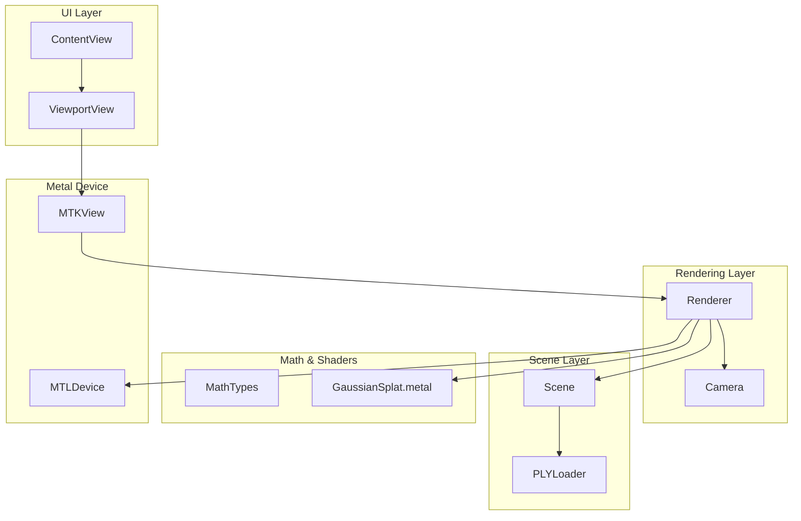
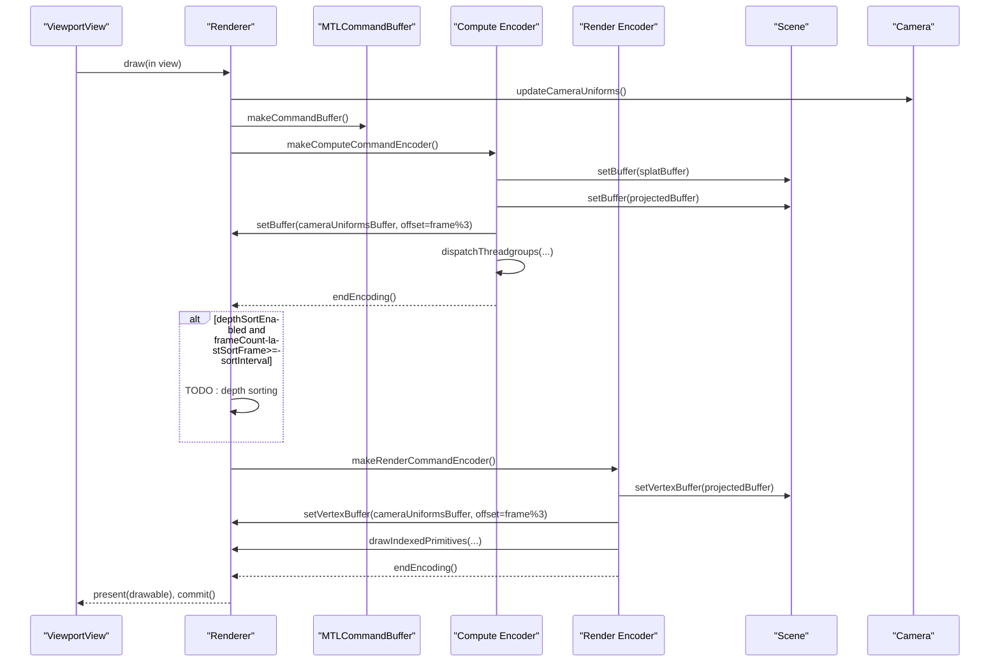
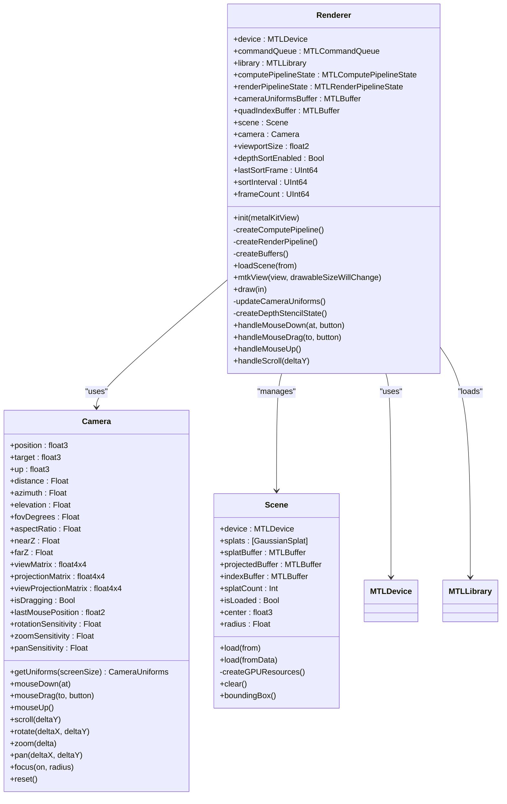
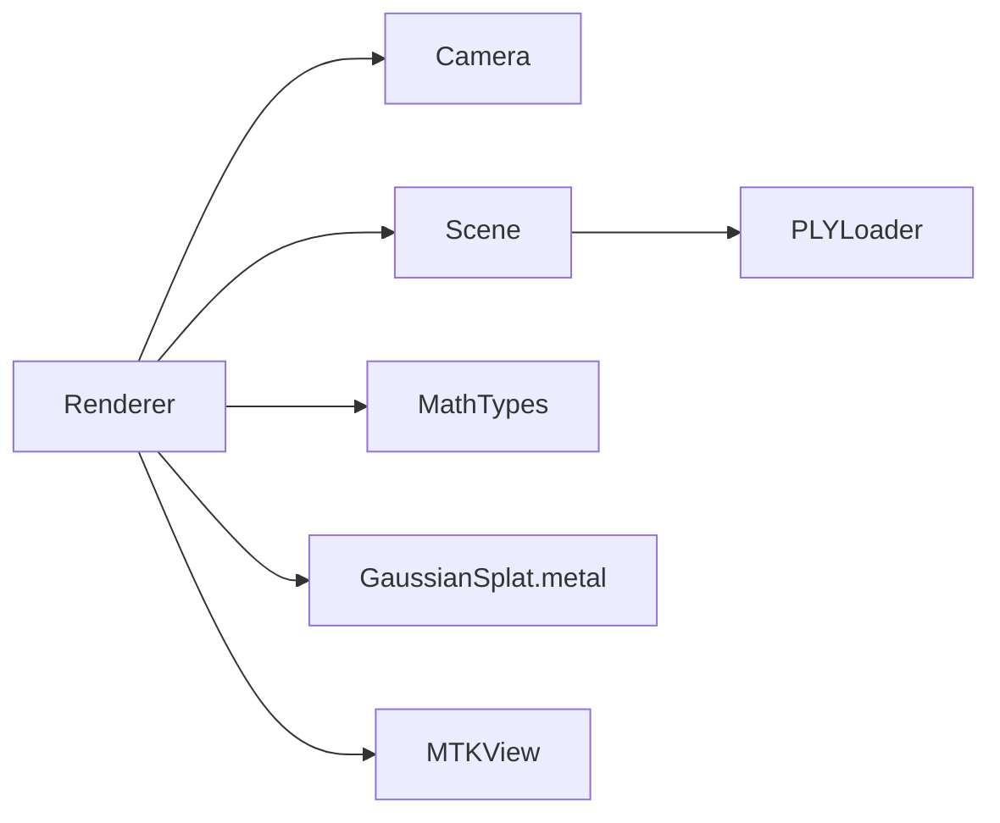

# Renderer System

<cite>
**Referenced Files in This Document**
- [Renderer.swift](file://Sources/Rendering/Renderer.swift)
- [Camera.swift](file://Sources/Rendering/Camera.swift)
- [Scene.swift](file://Sources/Scene/Scene.swift)
- [MathTypes.swift](file://Sources/Math/MathTypes.swift)
- [GaussianSplat.metal](file://Sources/Shaders/GaussianSplat.metal)
- [PLYLoader.swift](file://Sources/Scene/PLYLoader.swift)
- [ContentView.swift](file://Sources/UI/ContentView.swift)
- [ViewportView.swift](file://Sources/UI/ViewportView.swift)
- [Package.swift](file://Package.swift)
</cite>

## Table of Contents
1. [Introduction](#introduction)
2. [Project Structure](#project-structure)
3. [Core Components](#core-components)
4. [Architecture Overview](#architecture-overview)
5. [Detailed Component Analysis](#detailed-component-analysis)
6. [Dependency Analysis](#dependency-analysis)
7. [Performance Considerations](#performance-considerations)
8. [Troubleshooting Guide](#troubleshooting-guide)
9. [Conclusion](#conclusion)

## Introduction
This document explains the Renderer system responsible for Gaussian splatting rendering on macOS using Metal. It covers the Renderer class as the central orchestrator that initializes the Metal device, manages command queues, creates pipeline states, and executes a dual-pipeline rendering strategy. It documents the triple-buffering scheme for camera uniforms, the MTKViewDelegate-driven frame pipeline, buffer management, and performance optimizations such as thread group sizing and frame-skipping for depth sorting. Practical examples outline pipeline creation, buffer setup, and rendering loop execution, along with error handling, Metal library fallbacks, and integration with Scene and Camera components.

## Project Structure
The Renderer system is organized around a small set of cohesive modules:
- Rendering: Renderer and Camera
- Scene: Scene and PLYLoader
- Math: GPU-compatible data structures and math helpers
- Shaders: Metal shader source
- UI: SwiftUI integration via MTKView

**Diagram sources**
- [Renderer.swift:1-288](file://Sources/Rendering/Renderer.swift#L1-L288)
- [Camera.swift:1-184](file://Sources/Rendering/Camera.swift#L1-L184)
- [Scene.swift:1-130](file://Sources/Scene/Scene.swift#L1-L130)
- [MathTypes.swift:1-189](file://Sources/Math/MathTypes.swift#L1-L189)
- [GaussianSplat.metal:1-309](file://Sources/Shaders/GaussianSplat.metal#L1-L309)
- [PLYLoader.swift:1-386](file://Sources/Scene/PLYLoader.swift#L1-L386)
- [ContentView.swift:1-119](file://Sources/UI/ContentView.swift#L1-L119)
- [ViewportView.swift:1-118](file://Sources/UI/ViewportView.swift#L1-L118)

**Section sources**
- [Renderer.swift:1-288](file://Sources/Rendering/Renderer.swift#L1-L288)
- [Package.swift:1-17](file://Package.swift#L1-L17)

## Core Components
- Renderer: Central orchestrator managing Metal device, command queue, pipelines, buffers, and the rendering loop. Implements MTKViewDelegate to drive frame updates.
- Camera: Orbit camera with spherical coordinates, sensitivity controls, and GPU uniform generation.
- Scene: Manages Gaussian splat data, loads from PLY, and maintains GPU buffers for splat data, projections, and indices.
- MathTypes: Defines GPU-compatible structures (CameraUniforms, GaussianGPUData, ProjectedGaussian) and matrix/quaternion helpers.
- GaussianSplat.metal: Metal shaders implementing compute projection, vertex, and fragment stages, plus a sorting kernel.
- PLYLoader: Robust parser for PLY files supporting ASCII and binary formats.
- UI: SwiftUI integration via ViewportView wrapping MTKView and coordinating with Renderer.

**Section sources**
- [Renderer.swift:6-79](file://Sources/Rendering/Renderer.swift#L6-L79)
- [Camera.swift:4-177](file://Sources/Rendering/Camera.swift#L4-L177)
- [Scene.swift:4-124](file://Sources/Scene/Scene.swift#L4-L124)
- [MathTypes.swift:10-73](file://Sources/Math/MathTypes.swift#L10-L73)
- [GaussianSplat.metal:6-42](file://Sources/Shaders/GaussianSplat.metal#L6-L42)
- [PLYLoader.swift:13-68](file://Sources/Scene/PLYLoader.swift#L13-L68)
- [ViewportView.swift:5-93](file://Sources/UI/ViewportView.swift#L5-L93)

## Architecture Overview
The Renderer composes a dual-pipeline rendering system:
- Compute pipeline: projectGaussians computes per-splat projected data (depth, conic, color, opacity, radius) and writes to a projected buffer.
- Render pipeline: draws instanced quads using the projected data and CameraUniforms, with alpha blending and depth testing.

It uses triple buffering for camera uniforms to decouple CPU updates from GPU consumption, and integrates with Camera for view/projection matrices and with Scene for splat data and GPU buffers.

**Diagram sources**
- [Renderer.swift:171-250](file://Sources/Rendering/Renderer.swift#L171-L250)
- [GaussianSplat.metal:138-198](file://Sources/Shaders/GaussianSplat.metal#L138-L198)
- [GaussianSplat.metal:202-241](file://Sources/Shaders/GaussianSplat.metal#L202-L241)
- [GaussianSplat.metal:245-270](file://Sources/Shaders/GaussianSplat.metal#L245-L270)

## Detailed Component Analysis

### Renderer Class
Responsibilities:
- Metal device and command queue initialization
- Metal library loading with fallback from metallib to compiled source
- Dual pipeline creation (compute and render)
- Buffer management (camera uniforms, quad indices)
- MTKViewDelegate implementation for frame rendering
- Camera interaction callbacks
- Scene loading and camera focus

Key implementation patterns:
- Triple-buffering for CameraUniforms: offsets computed as (frameCount % 3) * stride to avoid CPU-GPU synchronization stalls.
- Dual-pipeline rendering: compute encoding for projection, optional depth sorting placeholder, render encoding for instanced quads.
- Thread group sizing: 256-wide groups with threadGroups calculated from splatCount.

**Diagram sources**
- [Renderer.swift:6-79](file://Sources/Rendering/Renderer.swift#L6-L79)
- [Camera.swift:4-177](file://Sources/Rendering/Camera.swift#L4-L177)
- [Scene.swift:4-124](file://Sources/Scene/Scene.swift#L4-L124)

**Section sources**
- [Renderer.swift:37-79](file://Sources/Rendering/Renderer.swift#L37-L79)
- [Renderer.swift:83-145](file://Sources/Rendering/Renderer.swift#L83-L145)
- [Renderer.swift:171-250](file://Sources/Rendering/Renderer.swift#L171-L250)
- [Renderer.swift:252-266](file://Sources/Rendering/Renderer.swift#L252-L266)

### Camera Component
Features:
- Orbit navigation with spherical coordinates
- Mouse interaction handlers for rotation, pan, and zoom
- Uniform buffer generation for GPU consumption
- Sensitivity tuning for smooth interaction

Implementation highlights:
- getUniforms constructs CameraUniforms with view/projection matrices, camera position, screen size, and half-tangent FOV factors.

**Section sources**
- [Camera.swift:36-147](file://Sources/Rendering/Camera.swift#L36-L147)
- [Camera.swift:149-177](file://Sources/Rendering/Camera.swift#L149-L177)

### Scene Component
Responsibilities:
- Load Gaussian splats from PLY files via PLYLoader
- Create GPU buffers for splat data, projected data, and indices
- Provide scene center/radius for camera focusing

Key points:
- createGPUResources builds buffers with appropriate storage modes and sizes
- Throws SceneError for buffer creation failures

**Section sources**
- [Scene.swift:24-85](file://Sources/Scene/Scene.swift#L24-L85)
- [Scene.swift:95-124](file://Sources/Scene/Scene.swift#L95-L124)
- [PLYLoader.swift:41-68](file://Sources/Scene/PLYLoader.swift#L41-L68)

### Math Types and GPU Structures
Defines:
- GaussianGPUData: CPU-to-GPU representation of a Gaussian splat
- CameraUniforms: GPU uniform block for view/projection and camera state
- ProjectedGaussian: Output of compute shader for rendering

These structures are designed for efficient GPU memory layout and alignment.

**Section sources**
- [MathTypes.swift:34-73](file://Sources/Math/MathTypes.swift#L34-L73)

### Metal Shaders
Shader roles:
- projectGaussians: compute shader that projects 3D Gaussians to 2D, computes covariance, conic, depth, and radius
- gaussianVertex: vertex shader that generates quad vertices per instance using projected data
- gaussianFragment: fragment shader that evaluates 2D Gaussian splat with alpha blending
- bitonicSort: compute kernel for optional depth sorting (placeholder in Renderer)

Memory and computation:
- Uses shared/private storage modes for buffers
- Employs thread group sizing and grid calculation aligned with splat counts

**Section sources**
- [GaussianSplat.metal:138-198](file://Sources/Shaders/GaussianSplat.metal#L138-L198)
- [GaussianSplat.metal:202-241](file://Sources/Shaders/GaussianSplat.metal#L202-L241)
- [GaussianSplat.metal:245-270](file://Sources/Shaders/GaussianSplat.metal#L245-L270)
- [GaussianSplat.metal:274-308](file://Sources/Shaders/GaussianSplat.metal#L274-L308)

### MTKViewDelegate Implementation
The Renderer implements MTKViewDelegate to:
- Update viewport size on drawable size changes
- Drive the rendering loop: update camera uniforms, encode compute pass, optionally sort, encode render pass, present, and commit

Triple-buffering strategy:
- CameraUniforms buffer is sized for three frames
- Offsets selected via (frameCount % 3) to decouple producer/consumer

**Section sources**
- [Renderer.swift:164-250](file://Sources/Rendering/Renderer.swift#L164-L250)

### Buffer Management
- CameraUniforms: triple-buffered shared memory
- Quad indices: shared memory triangle indices for instanced quad drawing
- Scene buffers: splat data (shared), projected data (private), indices (private)

Memory layout considerations:
- Structs defined for GPU compatibility
- Private buffers for intermediate compute results reduce bandwidth pressure

**Section sources**
- [Renderer.swift:131-145](file://Sources/Rendering/Renderer.swift#L131-L145)
- [Scene.swift:52-85](file://Sources/Scene/Scene.swift#L52-L85)
- [MathTypes.swift:34-73](file://Sources/Math/MathTypes.swift#L34-L73)

### Practical Examples

#### Pipeline Creation
- Compute pipeline: createComputePipeline loads the compute function and builds MTLComputePipelineState
- Render pipeline: createRenderPipeline loads vertex and fragment functions, sets up blending and depth/stencil

**Section sources**
- [Renderer.swift:83-129](file://Sources/Rendering/Renderer.swift#L83-L129)

#### Buffer Setup
- CameraUniforms buffer: triple-buffered shared memory sized by stride * 3
- Quad index buffer: shared memory with six indices forming two triangles
- Scene GPU buffers: splatBuffer (shared), projectedBuffer (private), indexBuffer (private)

**Section sources**
- [Renderer.swift:131-145](file://Sources/Rendering/Renderer.swift#L131-L145)
- [Scene.swift:52-85](file://Sources/Scene/Scene.swift#L52-L85)

#### Rendering Loop Execution
- Frame begins with camera uniforms update and compute encoding
- Optional depth sorting placeholder
- Render encoding with instanced quad drawing
- Present and commit

**Section sources**
- [Renderer.swift:171-250](file://Sources/Rendering/Renderer.swift#L171-L250)

## Dependency Analysis
Renderer depends on:
- Metal device and command queue for GPU operations
- MTLLibrary for shader compilation/loading
- Camera for view/projection matrices and uniforms
- Scene for splat data and GPU buffers
- MathTypes for GPU-compatible structures
- GaussianSplat.metal for compute/vertex/fragment/sort kernels

**Diagram sources**
- [Renderer.swift:6-79](file://Sources/Rendering/Renderer.swift#L6-L79)
- [Camera.swift:4-177](file://Sources/Rendering/Camera.swift#L4-L177)
- [Scene.swift:4-124](file://Sources/Scene/Scene.swift#L4-L124)
- [MathTypes.swift:10-73](file://Sources/Math/MathTypes.swift#L10-L73)
- [GaussianSplat.metal:1-309](file://Sources/Shaders/GaussianSplat.metal#L1-L309)
- [PLYLoader.swift:13-68](file://Sources/Scene/PLYLoader.swift#L13-L68)

**Section sources**
- [Renderer.swift:6-79](file://Sources/Rendering/Renderer.swift#L6-L79)
- [Scene.swift:4-124](file://Sources/Scene/Scene.swift#L4-L124)

## Performance Considerations
- Thread group sizing: 256-wide thread groups with grid size derived from splat count to maximize occupancy while avoiding wasted work
- Frame skipping for sorting: depthSortEnabled with sortInterval reduces compute overhead by sorting every N frames
- Triple-buffering: offsets (frameCount % 3) decouple CPU updates from GPU consumption, reducing stalls
- Storage modes: private buffers for intermediate compute results minimize bandwidth; shared buffers for frequently accessed data
- Alpha blending: enabled with additive blending and premultiplied alpha in fragment shader
- Depth testing: less-than compare with depth write enabled ensures correct occlusion

[No sources needed since this section provides general guidance]

## Troubleshooting Guide
Common issues and remedies:
- Metal library loading failure: Renderer attempts to load a precompiled metallib, falling back to compiling from source; if both fail, initialization returns nil
- Pipeline creation errors: createComputePipeline and createRenderPipeline print diagnostics on failure
- Buffer creation errors: Scene.createGPUResources throws SceneError.failedToCreateBuffer on failure
- No scene loaded: draw checks scene.isLoaded and returns early if not ready
- Depth sorting: currently a placeholder; implement bitonicSort kernel usage when enabling

**Section sources**
- [Renderer.swift:46-55](file://Sources/Rendering/Renderer.swift#L46-L55)
- [Renderer.swift:89-94](file://Sources/Rendering/Renderer.swift#L89-L94)
- [Renderer.swift:123-128](file://Sources/Rendering/Renderer.swift#L123-L128)
- [Scene.swift:61-70](file://Sources/Scene/Scene.swift#L61-L70)
- [Renderer.swift:214-218](file://Sources/Rendering/Renderer.swift#L214-L218)

## Conclusion
The Renderer system provides a clean, efficient Gaussian splatting pipeline leveraging Metal’s compute and rendering capabilities. Its dual-pipeline design separates projection computation from instanced quad rendering, while triple-buffering and careful buffer management ensure smooth frame pacing. The integration with Camera and Scene components enables interactive navigation and robust scene loading. Future enhancements could include implementing the depth sorting compute pass and expanding profiling metrics for performance tuning.