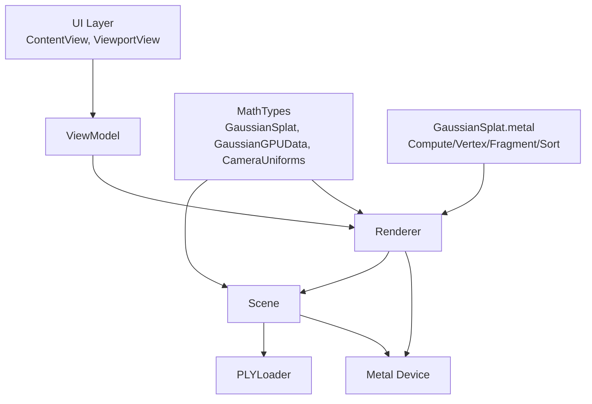
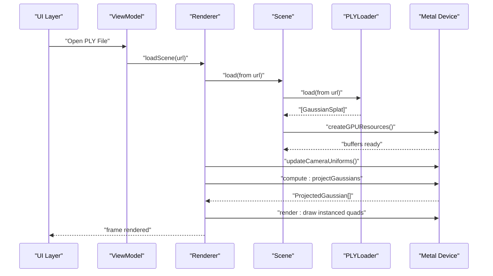
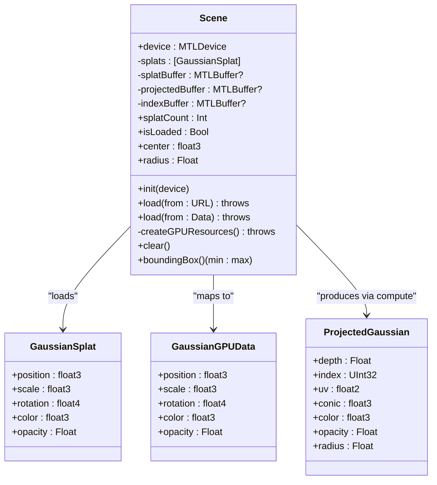
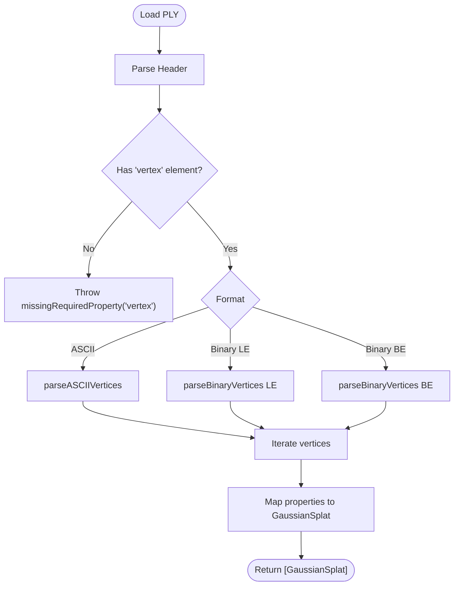
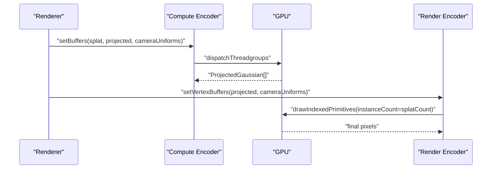
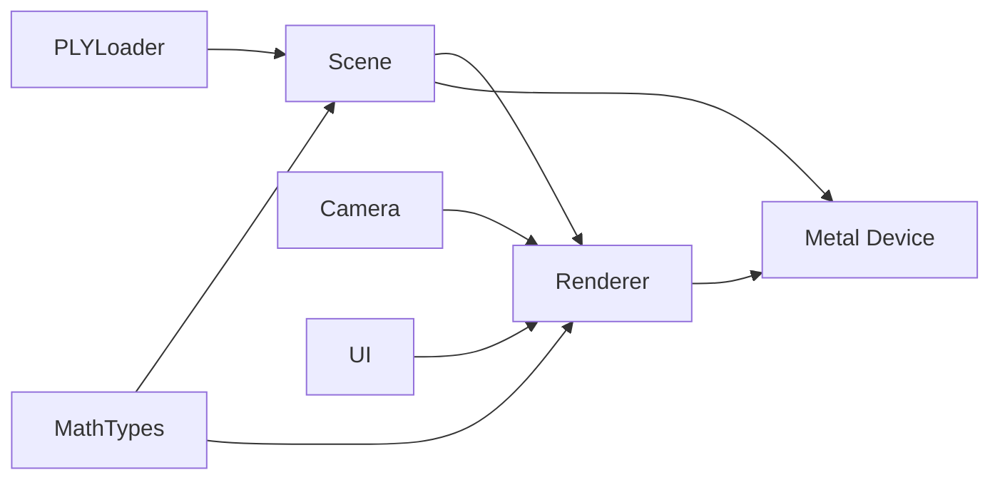

# Scene Management

<cite>
**Referenced Files in This Document**
- [Scene.swift](file://Sources/Scene/Scene.swift)
- [PLYLoader.swift](file://Sources/Scene/PLYLoader.swift)
- [MathTypes.swift](file://Sources/Math/MathTypes.swift)
- [Renderer.swift](file://Sources/Rendering/Renderer.swift)
- [GaussianSplat.metal](file://Sources/Shaders/GaussianSplat.metal)
- [Camera.swift](file://Sources/Rendering/Camera.swift)
- [ContentView.swift](file://Sources/UI/ContentView.swift)
- [ViewportView.swift](file://Sources/UI/ViewportView.swift)
- [GaussianSplatViewerApp.swift](file://Sources/GaussianSplatViewerApp.swift)
</cite>

## Table of Contents
1. [Introduction](#introduction)
2. [Project Structure](#project-structure)
3. [Core Components](#core-components)
4. [Architecture Overview](#architecture-overview)
5. [Detailed Component Analysis](#detailed-component-analysis)
6. [Dependency Analysis](#dependency-analysis)
7. [Performance Considerations](#performance-considerations)
8. [Troubleshooting Guide](#troubleshooting-guide)
9. [Conclusion](#conclusion)
10. [Appendices](#appendices)

## Introduction
This document explains the Scene management component responsible for Gaussian splat data handling and GPU resource coordination. It covers the Scene class architecture for managing Gaussian splat collections, CPU-GPU data synchronization, and resource lifecycle. It documents Gaussian splat data structures, GPU buffer allocation strategies, the scene loading workflow, data validation, error handling, integration with PLYLoader for file ingestion, and coordination with Renderer for buffer updates. It also includes performance considerations, practical examples, threading considerations, GPU memory management, and resource deallocation patterns.

## Project Structure
The Scene management sits at the intersection of data ingestion, GPU resource management, and rendering orchestration:
- Scene manages CPU-side splat arrays and GPU buffers
- PLYLoader parses PLY files into GaussianSplat instances
- MathTypes defines CPU/GPU-compatible data structures
- Renderer coordinates compute and render passes, updating buffers and uniforms
- UI layers trigger loading and drive the rendering loop

**Diagram sources**
- [Scene.swift:1-130](file://Sources/Scene/Scene.swift#L1-L130)
- [PLYLoader.swift:1-386](file://Sources/Scene/PLYLoader.swift#L1-L386)
- [MathTypes.swift:1-189](file://Sources/Math/MathTypes.swift#L1-L189)
- [Renderer.swift:1-288](file://Sources/Rendering/Renderer.swift#L1-L288)
- [GaussianSplat.metal:1-309](file://Sources/Shaders/GaussianSplat.metal#L1-L309)
- [ViewportView.swift:1-118](file://Sources/UI/ViewportView.swift#L1-L118)
- [ContentView.swift:1-119](file://Sources/UI/ContentView.swift#L1-L119)

**Section sources**
- [Scene.swift:1-130](file://Sources/Scene/Scene.swift#L1-L130)
- [PLYLoader.swift:1-386](file://Sources/Scene/PLYLoader.swift#L1-L386)
- [MathTypes.swift:1-189](file://Sources/Math/MathTypes.swift#L1-L189)
- [Renderer.swift:1-288](file://Sources/Rendering/Renderer.swift#L1-L288)
- [GaussianSplat.metal:1-309](file://Sources/Shaders/GaussianSplat.metal#L1-L309)
- [ViewportView.swift:1-118](file://Sources/UI/ViewportView.swift#L1-L118)
- [ContentView.swift:1-119](file://Sources/UI/ContentView.swift#L1-L119)

## Core Components
- Scene: Central manager for Gaussian splat collections and GPU buffers. Handles loading from PLY, creating GPU buffers, clearing resources, and computing scene bounds.
- PLYLoader: Parses PLY files (ASCII and binary little/big endian) into GaussianSplat arrays, validating headers and properties.
- MathTypes: Defines GaussianSplat, GaussianGPUData, CameraUniforms, ProjectedGaussian, and math utilities for quaternions and covariance computation.
- Renderer: Orchestrates Metal compute and render passes, updates camera uniforms, dispatches compute kernels, and draws instanced quads.
- Camera: Manages camera pose, matrices, and generates GPU uniforms.
- UI: Triggers loading and renders the viewport; ViewModel coordinates asynchronous loading and state.

Key responsibilities:
- CPU-GPU synchronization via mapped/shared buffers and triple-buffered camera uniforms
- Resource lifecycle: creation, update, and release of splat, projected, index, and uniform buffers
- Data validation and error propagation from PLY parsing to Scene creation

**Section sources**
- [Scene.swift:1-130](file://Sources/Scene/Scene.swift#L1-L130)
- [PLYLoader.swift:1-386](file://Sources/Scene/PLYLoader.swift#L1-L386)
- [MathTypes.swift:1-189](file://Sources/Math/MathTypes.swift#L1-L189)
- [Renderer.swift:1-288](file://Sources/Rendering/Renderer.swift#L1-L288)
- [Camera.swift:1-184](file://Sources/Rendering/Camera.swift#L1-L184)
- [ViewportView.swift:1-118](file://Sources/UI/ViewportView.swift#L1-L118)
- [ContentView.swift:1-119](file://Sources/UI/ContentView.swift#L1-L119)

## Architecture Overview
The Scene orchestrates data ingestion and GPU resource creation. Renderer consumes Scene buffers and uniforms to perform compute projection and rasterization.

**Diagram sources**
- [Renderer.swift:149-162](file://Sources/Rendering/Renderer.swift#L149-L162)
- [Scene.swift:24-49](file://Sources/Scene/Scene.swift#L24-L49)
- [PLYLoader.swift:41-68](file://Sources/Scene/PLYLoader.swift#L41-L68)
- [Scene.swift:51-85](file://Sources/Scene/Scene.swift#L51-L85)
- [Renderer.swift:187-250](file://Sources/Rendering/Renderer.swift#L187-L250)

## Detailed Component Analysis

### Scene Class
Responsibilities:
- Load Gaussian splats from PLY URLs or raw Data
- Validate presence of splats and create GPU buffers
- Provide scene bounds, center, and radius for camera framing
- Clear all CPU and GPU resources

CPU-GPU data structures:
- GaussianSplat: position, scale, rotation (quaternion), color, opacity
- GaussianGPUData: CPU-to-GPU compatible layout for splat data
- ProjectedGaussian: per-splat data produced by compute shader for sorting and rendering

GPU buffer allocation:
- Splat buffer: shared storage for GaussianGPUData
- Projected buffer: private storage for compute output
- Index buffer: private storage for sorted indices (placeholder)

Error handling:
- Throws SceneError for buffer creation failures and empty splat lists

Lifecycle:
- Initialization sets device
- load(from:) triggers PLY parsing and GPU resource creation
- clear() releases CPU arrays and GPU buffers
- boundingBox(), center, radius support camera framing

**Diagram sources**
- [Scene.swift:4-124](file://Sources/Scene/Scene.swift#L4-L124)
- [MathTypes.swift:11-73](file://Sources/Math/MathTypes.swift#L11-L73)

**Section sources**
- [Scene.swift:1-130](file://Sources/Scene/Scene.swift#L1-L130)
- [MathTypes.swift:11-73](file://Sources/Math/MathTypes.swift#L11-L73)

### PLYLoader
Responsibilities:
- Parse PLY headers (format detection, element/property metadata)
- Parse vertex data in ASCII or binary (little/big endian)
- Map PLY properties to GaussianSplat fields with defaults
- Validate required properties and handle missing optional fields

Parsing logic:
- Header parsing builds element and property metadata
- ASCII parsing reads whitespace-separated floats per line
- Binary parsing computes stride and reads typed values with endianness handling
- Vertex parsing maps x/y/z to position, optional scale/rotation/color/opacity

Validation and errors:
- PLYLoaderError enumerates file-not-found, invalid-header, unsupported-format, parse-error, and missing-required-property

**Diagram sources**
- [PLYLoader.swift:41-68](file://Sources/Scene/PLYLoader.swift#L41-L68)
- [PLYLoader.swift:72-151](file://Sources/Scene/PLYLoader.swift#L72-L151)
- [PLYLoader.swift:155-197](file://Sources/Scene/PLYLoader.swift#L155-L197)
- [PLYLoader.swift:201-300](file://Sources/Scene/PLYLoader.swift#L201-L300)
- [PLYLoader.swift:304-368](file://Sources/Scene/PLYLoader.swift#L304-L368)

**Section sources**
- [PLYLoader.swift:1-386](file://Sources/Scene/PLYLoader.swift#L1-L386)

### Renderer and GPU Coordination
Responsibilities:
- Create Metal pipeline states for compute and render passes
- Manage camera uniforms buffer (tripled-buffered for CPU/GPU sync)
- Load scenes, update camera uniforms, and dispatch compute and render passes
- Draw instanced quads using projected data

Compute pass:
- projectGaussians kernel reads GaussianGPUData, writes ProjectedGaussian, and computes conic, radius, and depth
- Uses camera uniforms (view/projection matrices, screen size, FOV tangents)

Render pass:
- Vertex shader converts ProjectedGaussian to clip-space quads
- Fragment shader evaluates 2D Gaussian and applies premultiplied alpha

Threading and triple buffering:
- Camera uniforms are triple-buffered; each frame selects an offset based on frameCount modulo 3

**Diagram sources**
- [Renderer.swift:187-250](file://Sources/Rendering/Renderer.swift#L187-L250)
- [GaussianSplat.metal:138-198](file://Sources/Shaders/GaussianSplat.metal#L138-L198)
- [GaussianSplat.metal:200-270](file://Sources/Shaders/GaussianSplat.metal#L200-L270)

**Section sources**
- [Renderer.swift:1-288](file://Sources/Rendering/Renderer.swift#L1-L288)
- [GaussianSplat.metal:1-309](file://Sources/Shaders/GaussianSplat.metal#L1-L309)

### Camera and Uniforms
Responsibilities:
- Maintain camera pose, matrices, and FOV
- Generate CameraUniforms for GPU consumption
- Provide mouse/touch interactions for orbit/pan/zoom

Uniforms:
- viewMatrix, projectionMatrix, viewProjectionMatrix
- cameraPosition, screenSize, tanHalfFov

Integration:
- Renderer updates CameraUniforms each frame and offsets into the triple-buffered uniform buffer

**Section sources**
- [Camera.swift:1-184](file://Sources/Rendering/Camera.swift#L1-L184)
- [Renderer.swift:252-259](file://Sources/Rendering/Renderer.swift#L252-L259)
- [MathTypes.swift:54-62](file://Sources/Math/MathTypes.swift#L54-L62)

### UI Integration and Threading
Responsibilities:
- ContentView presents toolbar, viewport, and instructions
- ViewportView wraps MTKView and forwards mouse events to Renderer
- ViewModel loads files asynchronously and updates state

Threading:
- File loading runs on a global queue; UI updates on main queue
- Renderer’s draw loop runs on the GPU thread

**Section sources**
- [ContentView.swift:1-119](file://Sources/UI/ContentView.swift#L1-L119)
- [ViewportView.swift:1-118](file://Sources/UI/ViewportView.swift#L1-L118)
- [GaussianSplatViewerApp.swift:1-65](file://Sources/GaussianSplatViewerApp.swift#L1-L65)

## Dependency Analysis
Scene depends on:
- PLYLoader for data ingestion
- MathTypes for CPU/GPU data structures
- Metal device for buffer creation

Renderer depends on:
- Scene for splat/projected/index buffers
- Camera for uniforms
- Metal device for pipelines and buffers

UI depends on:
- ViewModel to coordinate loading
- Renderer to render frames

**Diagram sources**
- [Scene.swift:1-130](file://Sources/Scene/Scene.swift#L1-L130)
- [PLYLoader.swift:1-386](file://Sources/Scene/PLYLoader.swift#L1-L386)
- [MathTypes.swift:1-189](file://Sources/Math/MathTypes.swift#L1-L189)
- [Renderer.swift:1-288](file://Sources/Rendering/Renderer.swift#L1-L288)
- [Camera.swift:1-184](file://Sources/Rendering/Camera.swift#L1-L184)
- [ViewportView.swift:1-118](file://Sources/UI/ViewportView.swift#L1-L118)
- [ContentView.swift:1-119](file://Sources/UI/ContentView.swift#L1-L119)

**Section sources**
- [Scene.swift:1-130](file://Sources/Scene/Scene.swift#L1-L130)
- [Renderer.swift:1-288](file://Sources/Rendering/Renderer.swift#L1-L288)

## Performance Considerations
Buffer sizing and alignment:
- Splat buffer size equals stride of GaussianGPUData multiplied by splat count
- Projected buffer size equals stride of ProjectedGaussian multiplied by splat count
- Index buffer size equals stride of UInt32 multiplied by splat count
- Alignment: Metal requires proper alignment; MathTypes adds padding fields to GaussianGPUData to align float3 members

Memory modes:
- Splat buffer uses shared storage for CPU/GPU coherency
- Projected and index buffers use private storage for compute output and sorting indices

Triple-buffered uniforms:
- Camera uniforms buffer is triple-buffered to avoid CPU/GPU synchronization stalls

Compute dispatch:
- Threadgroup size 256; dispatch groups computed from splat count

Data transfer optimization:
- Batch copy of CPU data into GPU buffer during creation
- Minimal per-frame transfers; uniforms are updated via memcpy into the triple-buffered region

Sorting:
- Depth sorting is planned and would use a compute sort kernel; currently a placeholder

[No sources needed since this section provides general guidance]

## Troubleshooting Guide
Common issues and remedies:
- Buffer creation failure: SceneError.failedToCreateBuffer indicates device buffer creation failure; verify device availability and sufficient memory
- No splats loaded: SceneError.noSplatsLoaded can occur if PLYLoader fails to parse; check PLY header and vertex properties
- PLY parsing errors: PLYLoaderError.invalidHeader, unsupportedFormat, parseError, missingRequiredProperty indicate malformed PLY files or missing required fields
- Compute projection anomalies: Verify camera uniforms and ensure splat count is non-zero before compute dispatch
- Rendering artifacts: Confirm ProjectedGaussian validity (opacity, radius, conic) and shader evaluation thresholds

**Section sources**
- [Scene.swift:126-130](file://Sources/Scene/Scene.swift#L126-L130)
- [PLYLoader.swift:3-10](file://Sources/Scene/PLYLoader.swift#L3-L10)
- [Renderer.swift:187-250](file://Sources/Rendering/Renderer.swift#L187-L250)

## Conclusion
The Scene management component integrates PLY data ingestion, CPU-to-GPU data structures, and Metal-based compute and render passes. It provides robust buffer lifecycle management, validation, and error handling while coordinating with Renderer and Camera for efficient GPU utilization. The architecture supports scalable scene sizes through triple-buffered uniforms, aligned GPU buffers, and asynchronous UI-driven loading.

[No sources needed since this section summarizes without analyzing specific files]

## Appendices

### Practical Examples

- Scene initialization and loading
  - Initialize Scene with a Metal device
  - Load from a PLY URL or Data; observe timing and counts printed
  - Scene creates GPU buffers and validates non-empty splats

- Buffer management
  - Splat buffer: shared storage for GaussianGPUData
  - Projected buffer: private storage for compute output
  - Index buffer: private storage for sorting indices

- Cleanup procedures
  - Call clear() to remove CPU arrays and release GPU buffers

- Threading considerations
  - File loading occurs on a global queue; UI updates on main queue
  - Renderer’s draw loop runs on GPU thread; triple-buffered uniforms prevent contention

- GPU memory management
  - Prefer private storage for compute outputs and indices
  - Use shared storage for small, frequently accessed data
  - Monitor buffer sizes and adjust for large scenes

**Section sources**
- [Scene.swift:24-49](file://Sources/Scene/Scene.swift#L24-L49)
- [Scene.swift:51-85](file://Sources/Scene/Scene.swift#L51-L85)
- [Scene.swift:87-93](file://Sources/Scene/Scene.swift#L87-L93)
- [Renderer.swift:149-162](file://Sources/Rendering/Renderer.swift#L149-L162)
- [Renderer.swift:252-259](file://Sources/Rendering/Renderer.swift#L252-L259)
- [ViewportView.swift:104-116](file://Sources/UI/ViewportView.swift#L104-L116)