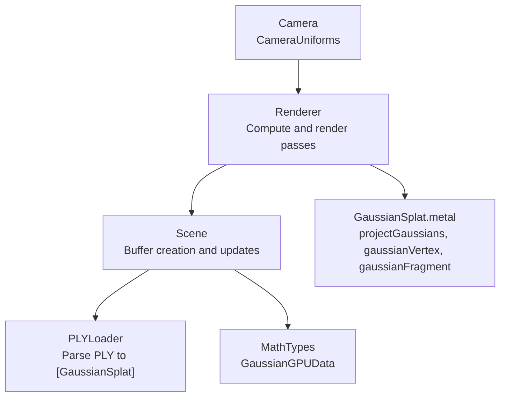
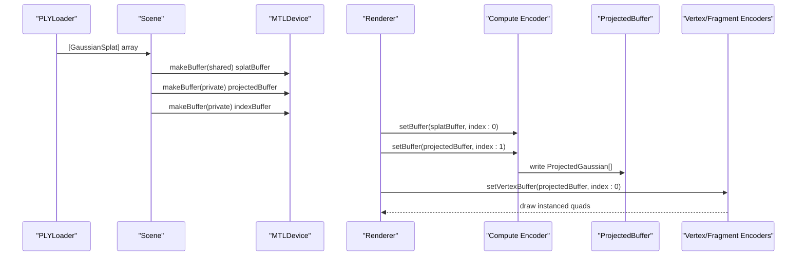
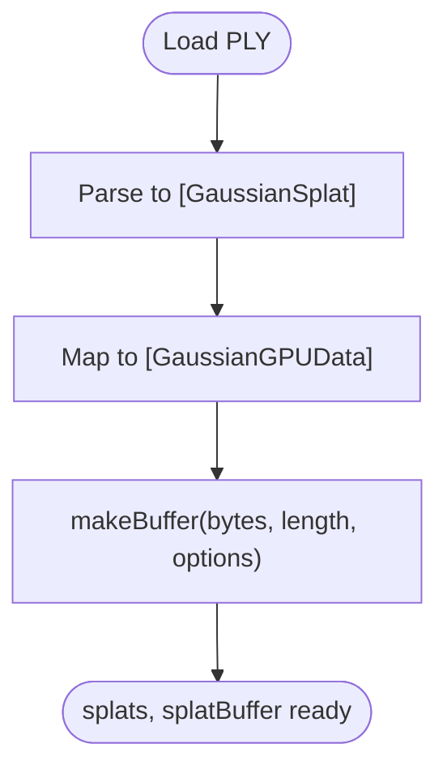
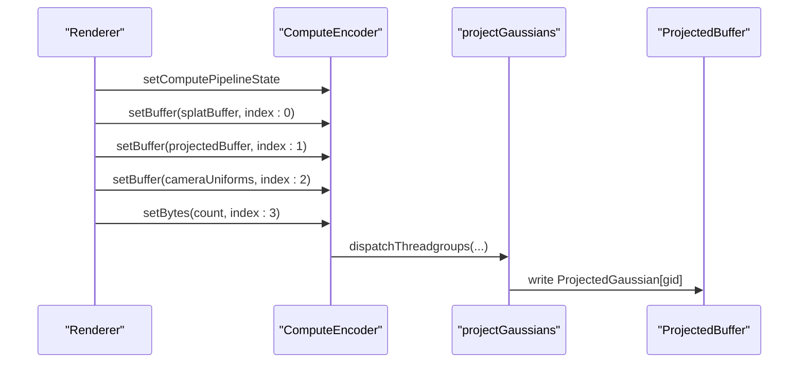
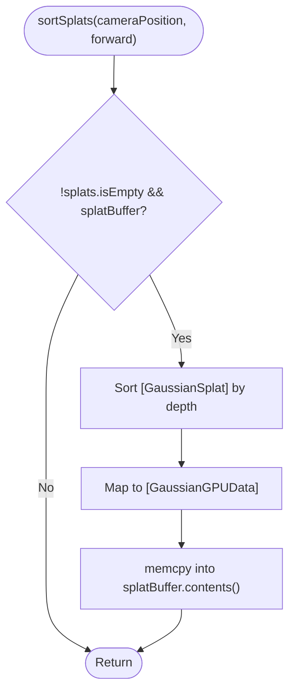
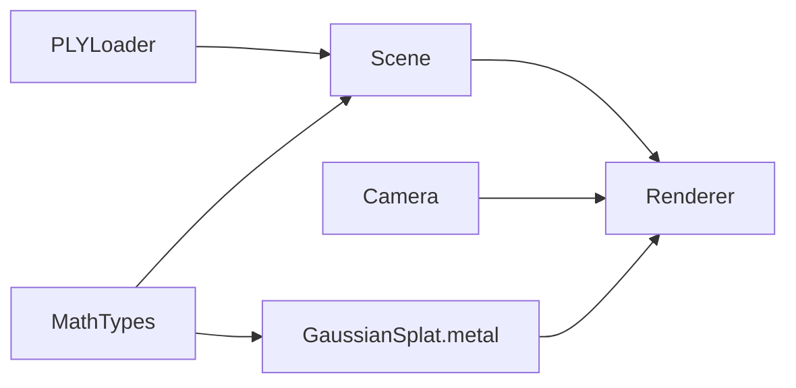

# GPU Buffer Management

<cite>
**Referenced Files in This Document**
- [Scene.swift](file://Scene/Scene.swift)
- [Renderer.swift](file://Rendering/Renderer.swift)
- [MathTypes.swift](file://Math/MathTypes.swift)
- [GaussianSplat.metal](file://Shaders/GaussianSplat.metal)
- [PLYLoader.swift](file://Scene/PLYLoader.swift)
- [Camera.swift](file://Rendering/Camera.swift)
</cite>

## Table of Contents
1. [Introduction](#introduction)
2. [Project Structure](#project-structure)
3. [Core Components](#core-components)
4. [Architecture Overview](#architecture-overview)
5. [Detailed Component Analysis](#detailed-component-analysis)
6. [Dependency Analysis](#dependency-analysis)
7. [Performance Considerations](#performance-considerations)
8. [Troubleshooting Guide](#troubleshooting-guide)
9. [Conclusion](#conclusion)

## Introduction
This document explains GPU buffer management within the Scene class, focusing on three primary buffers:
- splatBuffer: stores static Gaussian data on the GPU
- projectedBuffer: receives compute shader output for rendering
- indexBuffer: holds sorting indices for depth-based compositing

It covers buffer creation, memory layout, storage mode selection, sizing calculations, memory usage tracking, conversion from CPU GaussianSplat objects to GPU-friendly GaussianGPUData structures, update strategies, cleanup procedures, and error handling for allocation failures and memory pressure.

## Project Structure
The buffer management spans several modules:
- Scene: loads PLY data, converts to GPU-compatible structures, creates and updates buffers
- Rendering: orchestrates compute and render passes, dispatches compute kernels, binds buffers
- Math: defines GPU-compatible data structures and conversions
- Shaders: define buffer bindings and compute/vertex/fragment stages
- Camera: provides uniforms consumed by compute and vertex shaders

**Diagram sources**
- [Scene.swift:58-95](file://Scene/Scene.swift#L58-L95)
- [Renderer.swift:167-251](file://Rendering/Renderer.swift#L167-L251)
- [MathTypes.swift:35-51](file://Math/MathTypes.swift#L35-L51)
- [GaussianSplat.metal:146-209](file://Shaders/GaussianSplat.metal#L146-L209)
- [Camera.swift:134-147](file://Rendering/Camera.swift#L134-L147)

**Section sources**
- [Scene.swift:58-95](file://Scene/Scene.swift#L58-L95)
- [Renderer.swift:167-251](file://Rendering/Renderer.swift#L167-L251)
- [MathTypes.swift:35-51](file://Math/MathTypes.swift#L35-L51)
- [GaussianSplat.metal:146-209](file://Shaders/GaussianSplat.metal#L146-L209)
- [Camera.swift:134-147](file://Rendering/Camera.swift#L134-L147)

## Core Components
- Scene manages CPU and GPU data lifecycles, buffer creation, and back-to-front sorting updates.
- Renderer drives compute and render passes, binding buffers and dispatching compute work.
- MathTypes defines the CPU and GPU-compatible structures and conversion helpers.
- GaussianSplat.metal implements the compute shader that writes to projectedBuffer and the vertex/fragment shaders that read from it.
- PLYLoader supplies the initial CPU data used to populate splatBuffer.
- Camera provides uniforms consumed by compute and vertex stages.

Key buffer roles:
- splatBuffer: Static per-splat data (position, scale, rotation, color, opacity). Created with shared storage to allow CPU updates.
- projectedBuffer: Output of compute shader containing per-splat projected data (depth, index, uv, conic, color, opacity, radius). Private storage for GPU-only write throughput.
- indexBuffer: Indices used for sorting. Private storage for GPU-only access.

**Section sources**
- [Scene.swift:13-15](file://Scene/Scene.swift#L13-L15)
- [Scene.swift:58-95](file://Scene/Scene.swift#L58-L95)
- [Renderer.swift:194-218](file://Rendering/Renderer.swift#L194-L218)
- [GaussianSplat.metal:6-34](file://Shaders/GaussianSplat.metal#L6-L34)

## Architecture Overview
The buffer lifecycle follows a predictable flow:
- Scene loads PLY data and converts to GaussianGPUData
- Scene allocates splatBuffer (shared), projectedBuffer (private), and indexBuffer (private)
- Renderer’s compute pass reads from splatBuffer and writes to projectedBuffer
- Renderer’s render pass draws instanced quads using projectedBuffer
- Scene periodically sorts splats back-to-front and updates splatBuffer contents

**Diagram sources**
- [Scene.swift:58-95](file://Scene/Scene.swift#L58-L95)
- [Renderer.swift:194-218](file://Rendering/Renderer.swift#L194-L218)
- [GaussianSplat.metal:146-209](file://Shaders/GaussianSplat.metal#L146-L209)

## Detailed Component Analysis

### Buffer Creation and Storage Modes
- splatBuffer: Created with shared storage to enable CPU-side updates after sorting. Size equals stride of GaussianGPUData multiplied by count.
- projectedBuffer: Created with private storage for high-throughput GPU writes from the compute shader.
- indexBuffer: Created with private storage for GPU sorting kernel access.

Storage mode rationale:
- Shared buffers allow CPU reads/writes but incur synchronization overhead; used for splatBuffer because it is updated after sorting.
- Private buffers are optimized for GPU-only access and reduce contention; used for projectedBuffer and indexBuffer.

Buffer sizing:
- splatBuffer: stride(GaussianGPUData) × count
- projectedBuffer: stride(ProjectedGaussian) × count
- indexBuffer: stride(UInt32) × count

Memory usage tracking:
- After successful creation, Scene prints approximate sizes for splatBuffer (MB) and projectedBuffer (KB).

**Section sources**
- [Scene.swift:64-95](file://Scene/Scene.swift#L64-L95)
- [MathTypes.swift:35-51](file://Math/MathTypes.swift#L35-L51)
- [MathTypes.swift:65-73](file://Math/MathTypes.swift#L65-L73)

### CPU to GPU Data Conversion
Scene converts CPU GaussianSplat objects to GPU-friendly GaussianGPUData structures before creating splatBuffer. This ensures the GPU sees a compact, aligned representation suitable for compute and rendering.

Conversion path:
- PLYLoader produces [GaussianSplat]
- Scene.map converts each GaussianSplat to GaussianGPUData
- Scene creates splatBuffer with bytes pointing to the mapped array

**Diagram sources**
- [PLYLoader.swift:42-68](file://Scene/PLYLoader.swift#L42-L68)
- [Scene.swift:65-72](file://Scene/Scene.swift#L65-L72)
- [MathTypes.swift:35-51](file://Math/MathTypes.swift#L35-L51)

**Section sources**
- [Scene.swift:65-72](file://Scene/Scene.swift#L65-L72)
- [MathTypes.swift:35-51](file://Math/MathTypes.swift#L35-L51)

### Compute Pass and projectedBuffer Updates
Renderer’s compute pass:
- Sets splatBuffer as input (index:0)
- Sets projectedBuffer as output (index:1)
- Sets CameraUniforms buffer (index:2)
- Sets splat count (index:3)
- Dispatches threadgroups sized to cover all splats

The compute shader writes ProjectedGaussian entries into projectedBuffer, computing depth, uv, conic, color, opacity, and radius per splat.

**Diagram sources**
- [Renderer.swift:194-218](file://Rendering/Renderer.swift#L194-L218)
- [GaussianSplat.metal:146-209](file://Shaders/GaussianSplat.metal#L146-L209)

**Section sources**
- [Renderer.swift:194-218](file://Rendering/Renderer.swift#L194-L218)
- [GaussianSplat.metal:146-209](file://Shaders/GaussianSplat.metal#L146-L209)

### Back-to-Front Sorting and splatBuffer Updates
Scene performs periodic depth-based sorting:
- Sorts splats by dot product of (position - cameraPosition) with forward vector
- Rebuilds GaussianGPUData array from sorted splats
- Uses memcpy to update splatBuffer contents

Sorting cadence:
- Controlled by Renderer’s depthSortEnabled flag and sortInterval
- Sorted every N frames to balance quality and performance

**Diagram sources**
- [Scene.swift:106-121](file://Scene/Scene.swift#L106-L121)

**Section sources**
- [Scene.swift:106-121](file://Scene/Scene.swift#L106-L121)
- [Renderer.swift:188-191](file://Rendering/Renderer.swift#L188-L191)

### Render Pass and Instanced Drawing
Renderer’s render pass:
- Sets render pipeline state and depth stencil state
- Binds projectedBuffer as vertex buffer (index:0)
- Binds CameraUniforms buffer (index:1)
- Draws indexed triangles using quadIndexBuffer with instance count equal to splatCount

This draws one quad per splat, using the precomputed ProjectedGaussian data.

**Section sources**
- [Renderer.swift:220-242](file://Rendering/Renderer.swift#L220-L242)
- [GaussianSplat.metal:213-249](file://Shaders/GaussianSplat.metal#L213-L249)

### Buffer Update Strategies
- splatBuffer updates: Occur after sorting; memcpy replaces entire buffer contents. This is efficient for small-to-moderate counts and leverages shared storage for CPU updates.
- projectedBuffer updates: Overwritten each frame by compute shader; private storage avoids CPU contention.
- indexBuffer: Not actively updated in the current code; sorting is performed on CPU and splatBuffer is rewritten.

Optimization opportunities:
- Consider staging updates to avoid frequent buffer copies
- Batch updates when possible
- Use buffer offsets or triple buffering for camera uniforms to reduce CPU-GPU synchronization

**Section sources**
- [Scene.swift:106-121](file://Scene/Scene.swift#L106-L121)
- [Renderer.swift:129-143](file://Rendering/Renderer.swift#L129-L143)

### Memory Cleanup Procedures
Scene.clear removes all CPU and GPU resources:
- Clears splats array
- Sets splatBuffer, projectedBuffer, and indexBuffer to nil

This releases GPU memory and resets the Scene state.

**Section sources**
- [Scene.swift:97-103](file://Scene/Scene.swift#L97-L103)

### Error Handling for Buffer Allocation Failures
Scene throws SceneError.failedToCreateBuffer when any buffer creation fails. Renderer checks for scene.isLoaded and required buffers before drawing, avoiding crashes.

Recommended improvements:
- Add memory pressure detection and fallback strategies
- Implement graceful degradation when allocations fail
- Log device memory limits and buffer sizes for diagnostics

**Section sources**
- [Scene.swift:70-72](file://Scene/Scene.swift#L70-L72)
- [Scene.swift:76-78](file://Scene/Scene.swift#L76-L78)
- [Scene.swift:83-85](file://Scene/Scene.swift#L83-L85)
- [Renderer.swift:167-180](file://Rendering/Renderer.swift#L167-L180)

## Dependency Analysis
- Scene depends on MathTypes for GaussianGPUData and on PLYLoader for initial data.
- Renderer depends on Scene for buffer handles and on Camera for uniforms.
- Shaders depend on MathTypes structures for buffer layouts.

**Diagram sources**
- [Scene.swift:58-95](file://Scene/Scene.swift#L58-L95)
- [Renderer.swift:167-251](file://Rendering/Renderer.swift#L167-L251)
- [MathTypes.swift:35-51](file://Math/MathTypes.swift#L35-L51)
- [GaussianSplat.metal:146-209](file://Shaders/GaussianSplat.metal#L146-L209)

**Section sources**
- [Scene.swift:58-95](file://Scene/Scene.swift#L58-L95)
- [Renderer.swift:167-251](file://Rendering/Renderer.swift#L167-L251)
- [MathTypes.swift:35-51](file://Math/MathTypes.swift#L35-L51)
- [GaussianSplat.metal:146-209](file://Shaders/GaussianSplat.metal#L146-L209)

## Performance Considerations
- Buffer sizing: Use stride-based sizing to minimize padding overhead. Align structures to Metal alignment rules.
- Storage modes: Prefer private storage for GPU-only buffers (projectedBuffer, indexBuffer) and shared for buffers requiring CPU updates (splatBuffer).
- Sorting cadence: Adjust sortInterval to balance visual quality and CPU cost.
- Compute dispatch: Use threadgroup size of 256 and compute threadgroups sized to ceil(count/256) for efficient coverage.
- Alpha blending: Enable blending in the render pipeline to support correct compositing order.

[No sources needed since this section provides general guidance]

## Troubleshooting Guide
Common issues and resolutions:
- Buffer allocation failure: Scene throws SceneError.failedToCreateBuffer. Check device capabilities and available memory; reduce splat count or simplify geometry.
- No splats loaded: Renderer throws SceneError.noSplatsLoaded when attempting to load a scene without initialization.
- Sorting not applied: Ensure depthSortEnabled is true and sufficient frames have elapsed (sortInterval).
- Incorrect rendering order: Verify sorting occurs before compute dispatch and that splatBuffer reflects sorted order.

**Section sources**
- [Scene.swift:70-72](file://Scene/Scene.swift#L70-L72)
- [Scene.swift:76-78](file://Scene/Scene.swift#L76-L78)
- [Scene.swift:83-85](file://Scene/Scene.swift#L83-L85)
- [Renderer.swift:147-158](file://Rendering/Renderer.swift#L147-L158)
- [Renderer.swift:188-191](file://Rendering/Renderer.swift#L188-L191)

## Conclusion
The Scene class implements robust GPU buffer management tailored for Gaussian splat rendering. It converts CPU data to GPU-friendly structures, creates appropriately sized and typed buffers with careful storage mode selection, and updates them efficiently during sorting and rendering. The Renderer coordinates compute and render passes, binding buffers and dispatching compute work. While the current implementation focuses on correctness and simplicity, future enhancements could include staged updates, memory pressure handling, and GPU-side sorting to further optimize performance.