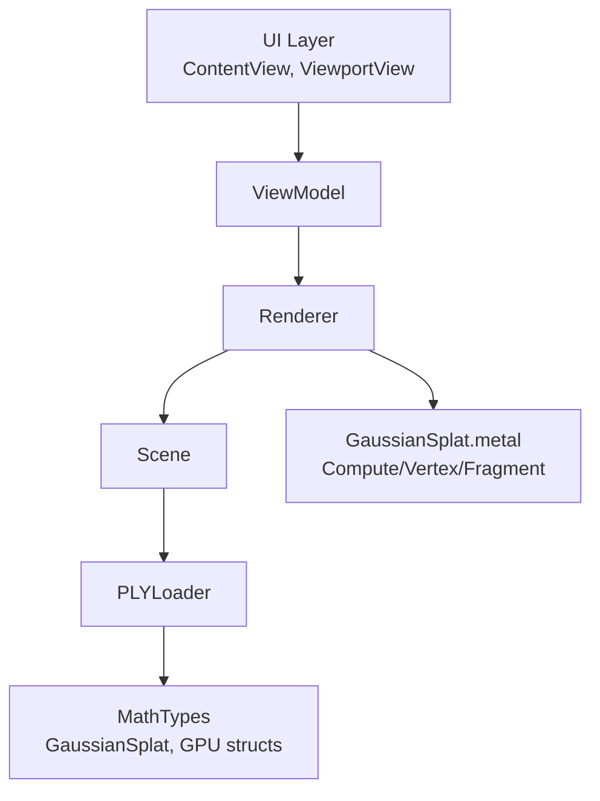
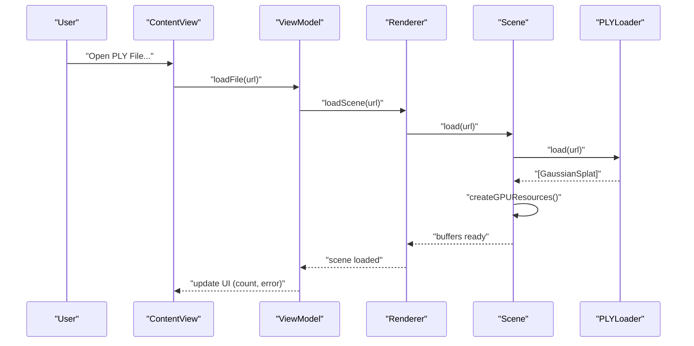
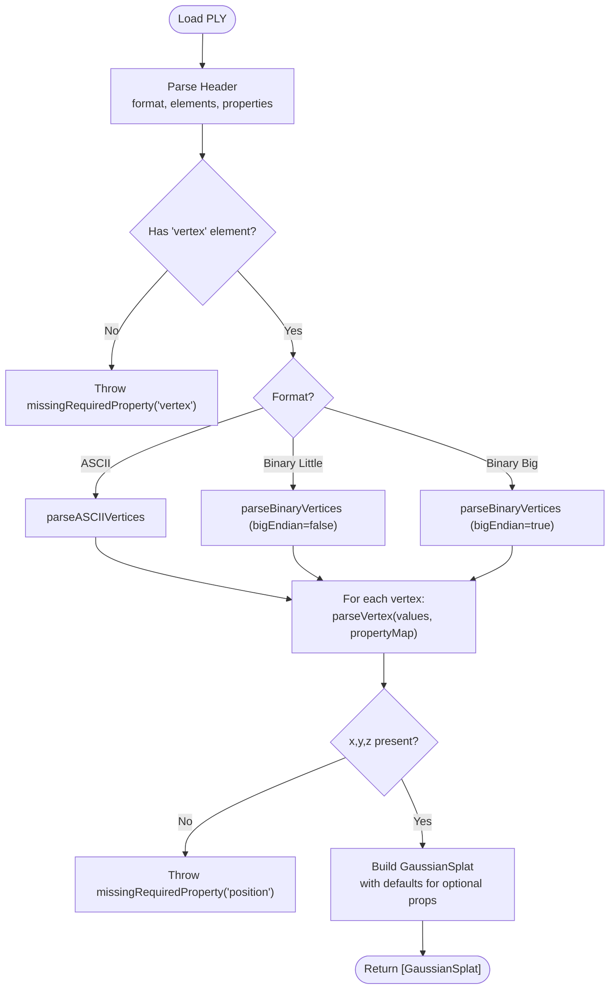
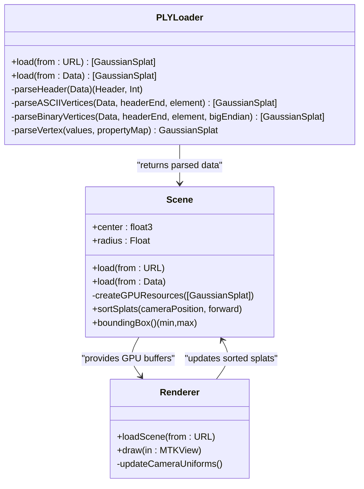
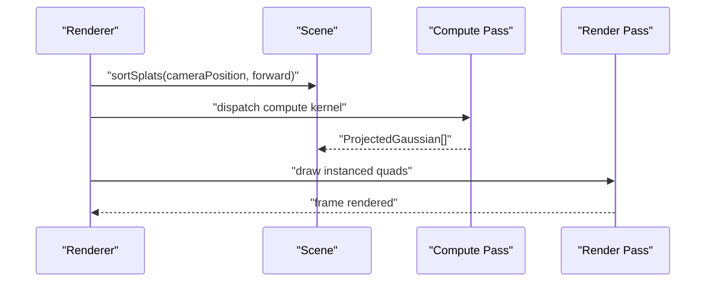
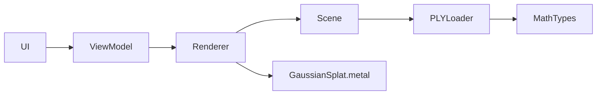

# PLY File Loading

<cite>
**Referenced Files in This Document**
- [PLYLoader.swift](file://Scene/PLYLoader.swift)
- [Scene.swift](file://Scene/Scene.swift)
- [MathTypes.swift](file://Math/MathTypes.swift)
- [Renderer.swift](file://Rendering/Renderer.swift)
- [Camera.swift](file://Rendering/Camera.swift)
- [ViewportView.swift](file://UI/ViewportView.swift)
- [ContentView.swift](file://UI/ContentView.swift)
- [GaussianSplat.metal](file://Shaders/GaussianSplat.metal)
</cite>

## Table of Contents
1. [Introduction](#introduction)
2. [Project Structure](#project-structure)
3. [Core Components](#core-components)
4. [Architecture Overview](#architecture-overview)
5. [Detailed Component Analysis](#detailed-component-analysis)
6. [Dependency Analysis](#dependency-analysis)
7. [Performance Considerations](#performance-considerations)
8. [Troubleshooting Guide](#troubleshooting-guide)
9. [Conclusion](#conclusion)
10. [Appendices](#appendices)

## Introduction
This document explains the PLY file loading system used to ingest 3D Gaussian splatting scenes. It covers supported PLY formats (ASCII and binary), element and property parsing, data validation, and the end-to-end workflow from file selection to GPU-ready Gaussian splat data. It also documents supported properties (positions, colors, scales, rotations, opacity), error handling, and integration with the Scene class and rendering pipeline.

## Project Structure
The PLY loading system spans several modules:
- Scene: PLYLoader and Scene orchestrate parsing and GPU resource creation.
- Math: Defines Gaussian data structures and math utilities.
- Rendering: Renderer loads scenes, sorts splats, and renders via Metal.
- UI: SwiftUI views trigger file selection and display loading states.
- Shaders: Metal compute and fragment shaders process Gaussian splats.

**Diagram sources**
- [PLYLoader.swift:41-68](file://Scene/PLYLoader.swift#L41-L68)
- [Scene.swift:30-55](file://Scene/Scene.swift#L30-L55)
- [Renderer.swift:147-158](file://Rendering/Renderer.swift#L147-L158)
- [MathTypes.swift:12-51](file://Math/MathTypes.swift#L12-L51)
- [GaussianSplat.metal:6-34](file://Shaders/GaussianSplat.metal#L6-L34)

**Section sources**
- [PLYLoader.swift:1-403](file://Scene/PLYLoader.swift#L1-L403)
- [Scene.swift:1-158](file://Scene/Scene.swift#L1-L158)
- [MathTypes.swift:1-189](file://Math/MathTypes.swift#L1-L189)
- [Renderer.swift:1-289](file://Rendering/Renderer.swift#L1-L289)
- [ViewportView.swift:141-184](file://UI/ViewportView.swift#L141-L184)
- [ContentView.swift:1-130](file://UI/ContentView.swift#L1-L130)
- [GaussianSplat.metal:146-278](file://Shaders/GaussianSplat.metal#L146-L278)

## Core Components
- PLYLoader: Parses PLY headers and vertex data, supports ASCII and binary little/big endian, extracts positions, colors, scales, rotations, and opacity, validates required properties, and converts to GaussianSplat instances.
- Scene: Owns CPU and GPU data, creates Metal buffers, sorts splats for depth blending, and exposes scene metrics.
- MathTypes: Defines GaussianSplat, GPU-compatible structures, and math utilities (quaternions, covariance computation).
- Renderer: Loads scenes, updates camera, sorts and projects splats, and draws via Metal compute and render passes.
- UI: Presents file picker, loading indicators, and error messages; delegates loading to ViewModel and Renderer.

**Section sources**
- [PLYLoader.swift:13-68](file://Scene/PLYLoader.swift#L13-L68)
- [Scene.swift:6-55](file://Scene/Scene.swift#L6-L55)
- [MathTypes.swift:12-188](file://Math/MathTypes.swift#L12-L188)
- [Renderer.swift:7-77](file://Rendering/Renderer.swift#L7-L77)
- [ViewportView.swift:141-184](file://UI/ViewportView.swift#L141-L184)
- [ContentView.swift:4-124](file://UI/ContentView.swift#L4-L124)

## Architecture Overview
The PLY loading workflow:
1. UI triggers file selection.
2. ViewModel loads the file asynchronously and delegates to Renderer.
3. Renderer calls Scene.load, which delegates to PLYLoader.load.
4. PLYLoader parses the header and vertex data, validates properties, and constructs GaussianSplat arrays.
5. Scene creates GPU buffers and populates them from parsed splats.
6. Renderer sorts and projects splats, then renders them using Metal shaders.

**Diagram sources**
- [ContentView.swift:110-124](file://UI/ContentView.swift#L110-L124)
- [ViewportView.swift:151-183](file://UI/ViewportView.swift#L151-L183)
- [Renderer.swift:147-158](file://Rendering/Renderer.swift#L147-L158)
- [Scene.swift:30-55](file://Scene/Scene.swift#L30-L55)
- [PLYLoader.swift:41-68](file://Scene/PLYLoader.swift#L41-L68)

## Detailed Component Analysis

### PLYLoader Implementation
- Supported formats: ASCII and binary little/big endian.
- Header parsing: Reads “ply” magic, format declaration, elements, and properties; skips list properties.
- Vertex parsing:
  - ASCII: splits by whitespace, maps property names to indices, and decodes floats.
  - Binary: computes stride from property sizes, reads typed values with endianness handling, and decodes floats.
- Property extraction and defaults:
  - Required: x, y, z.
  - Optional: scale_0..2 (exponential default), rot_1..3, rot_0 (normalized quaternion), color via SH DC f_dc_0..2 or direct red/green/blue (0–255), opacity via sigmoid.
- Validation and errors: Throws descriptive errors for missing elements, invalid headers, unsupported formats, and missing required properties.

**Diagram sources**
- [PLYLoader.swift:48-68](file://Scene/PLYLoader.swift#L48-L68)
- [PLYLoader.swift:72-158](file://Scene/PLYLoader.swift#L72-L158)
- [PLYLoader.swift:162-204](file://Scene/PLYLoader.swift#L162-L204)
- [PLYLoader.swift:208-317](file://Scene/PLYLoader.swift#L208-L317)
- [PLYLoader.swift:321-385](file://Scene/PLYLoader.swift#L321-L385)

**Section sources**
- [PLYLoader.swift:17-37](file://Scene/PLYLoader.swift#L17-L37)
- [PLYLoader.swift:72-158](file://Scene/PLYLoader.swift#L72-L158)
- [PLYLoader.swift:162-204](file://Scene/PLYLoader.swift#L162-L204)
- [PLYLoader.swift:208-317](file://Scene/PLYLoader.swift#L208-L317)
- [PLYLoader.swift:321-385](file://Scene/PLYLoader.swift#L321-L385)

### Supported PLY Properties and Data Extraction
- Position coordinates: x, y, z (required).
- Color channels:
  - Prefer SH DC coefficients f_dc_0..2 mapped via sigmoid.
  - Fallback to red, green, blue (0–255) mapped to 0..1.
- Gaussian parameters:
  - Scale: scale_0, scale_1, scale_2 (defaults to small exponential if absent).
  - Rotation: rot_1..3, rot_0 (normalized quaternion).
  - Opacity: optional; defaults to 1.0 or sigmoid if provided.
- Data types: Supports char/int8, uchar/uint8, short/int16, ushort/uint16, int/int32, uint, float, long/int64, ulong/uint64, double.

**Section sources**
- [PLYLoader.swift:328-385](file://Scene/PLYLoader.swift#L328-L385)
- [PLYLoader.swift:389-397](file://Scene/PLYLoader.swift#L389-L397)

### Data Validation and Error Handling
- Header validation: Ensures “ply” magic, valid format, and presence of “end_header”.
- Element validation: Requires “vertex” element.
- Property validation: Requires x, y, z; optional properties are defaulted.
- Binary parsing: Validates offsets and sizes; skips invalid vertices.
- Errors: PLYLoaderError enumerates fileNotFound, invalidHeader, unsupportedFormat, parseError, missingRequiredProperty.

**Section sources**
- [PLYLoader.swift:4-10](file://Scene/PLYLoader.swift#L4-L10)
- [PLYLoader.swift:72-158](file://Scene/PLYLoader.swift#L72-L158)
- [PLYLoader.swift:53-55](file://Scene/PLYLoader.swift#L53-L55)
- [PLYLoader.swift:329-333](file://Scene/PLYLoader.swift#L329-L333)
- [PLYLoader.swift:208-317](file://Scene/PLYLoader.swift#L208-L317)

### Integration with Scene and Data Transformation Pipeline
- Scene.load delegates to PLYLoader.load, then creates GPU buffers for splats, projections, and indices.
- Scene.sortSplats reorders splats back-to-front for alpha blending and updates the GPU buffer.
- Renderer.loadScene initializes camera focus, triggers sorting, and drives compute and render passes.

**Diagram sources**
- [PLYLoader.swift:41-68](file://Scene/PLYLoader.swift#L41-L68)
- [Scene.swift:30-95](file://Scene/Scene.swift#L30-L95)
- [Renderer.swift:147-158](file://Rendering/Renderer.swift#L147-L158)

**Section sources**
- [Scene.swift:30-95](file://Scene/Scene.swift#L30-L95)
- [Renderer.swift:147-158](file://Rendering/Renderer.swift#L147-L158)

### Rendering Pipeline and GPU Data
- GPU structures: GaussianGPUData mirrors GaussianSplat for Metal buffers.
- Compute shader: Projects each Gaussian into 2D, computes covariance, conic, and radius.
- Vertex/Fragment shaders: Draw instanced quads per Gaussian with alpha blending.

**Diagram sources**
- [Scene.swift:105-121](file://Scene/Scene.swift#L105-L121)
- [Renderer.swift:187-251](file://Rendering/Renderer.swift#L187-L251)
- [GaussianSplat.metal:146-278](file://Shaders/GaussianSplat.metal#L146-L278)

**Section sources**
- [MathTypes.swift:35-51](file://Math/MathTypes.swift#L35-L51)
- [Renderer.swift:187-251](file://Rendering/Renderer.swift#L187-L251)
- [GaussianSplat.metal:6-34](file://Shaders/GaussianSplat.metal#L6-L34)

## Dependency Analysis
- UI depends on ViewModel and Renderer for loading and rendering.
- Renderer depends on Scene for data and on Metal for GPU resources.
- Scene depends on PLYLoader for parsing and on Metal for buffers.
- PLYLoader depends on Foundation and MathTypes for parsing and data structures.

**Diagram sources**
- [ViewportView.swift:141-184](file://UI/ViewportView.swift#L141-L184)
- [Renderer.swift:7-77](file://Rendering/Renderer.swift#L7-L77)
- [Scene.swift:6-28](file://Scene/Scene.swift#L6-L28)
- [PLYLoader.swift:1-3](file://Scene/PLYLoader.swift#L1-L3)
- [GaussianSplat.metal:146-278](file://Shaders/GaussianSplat.metal#L146-L278)

**Section sources**
- [ViewportView.swift:141-184](file://UI/ViewportView.swift#L141-L184)
- [Renderer.swift:7-77](file://Rendering/Renderer.swift#L7-L77)
- [Scene.swift:6-28](file://Scene/Scene.swift#L6-L28)
- [PLYLoader.swift:1-3](file://Scene/PLYLoader.swift#L1-L3)

## Performance Considerations
- Prefer binary little-endian PLY for speed when available.
- Reserve capacity for splats to avoid reallocation.
- Use GPU buffers with appropriate storage modes (shared for small data, private for intermediate compute).
- Sort splats periodically to reduce overdraw and improve blending performance.
- Validate early: skip malformed vertices and report warnings to avoid aborting entire loads.

[No sources needed since this section provides general guidance]

## Troubleshooting Guide
Common issues and resolutions:
- Invalid header or unsupported format: Verify “ply” magic, “end_header”, and format declaration.
- Missing vertex element: Ensure the PLY contains a “vertex” element with the expected properties.
- Missing required position (x, y, z): Add position properties or regenerate the PLY with correct schema.
- Unexpected data types: Confirm property types match supported sizes; binary parsing relies on exact sizes.
- Large files: Use binary format and monitor memory usage; Scene creates buffers proportional to splat count.
- UI shows no splats: Check ViewModel error propagation and Renderer scene initialization.

**Section sources**
- [PLYLoader.swift:4-10](file://Scene/PLYLoader.swift#L4-L10)
- [PLYLoader.swift:72-158](file://Scene/PLYLoader.swift#L72-L158)
- [PLYLoader.swift:53-55](file://Scene/PLYLoader.swift#L53-L55)
- [PLYLoader.swift:329-333](file://Scene/PLYLoader.swift#L329-L333)
- [Renderer.swift:147-158](file://Rendering/Renderer.swift#L147-L158)
- [ViewportView.swift:165-182](file://UI/ViewportView.swift#L165-L182)

## Conclusion
The PLY loading system robustly supports ASCII and binary PLY formats, validates required properties, and converts parsed data into GPU-ready Gaussian splats. It integrates cleanly with Scene and Renderer to deliver interactive 3D Gaussian splatting visualization. By following the supported property schema and leveraging binary formats, users can efficiently load large datasets and debug issues through clear error reporting.

## Appendices

### Example Workflows
- Loading a standard ASCII PLY with SH DC colors and scale/rotation parameters.
- Loading a binary little-endian PLY with direct RGB colors and minimal properties.
- Handling malformed files by catching PLYLoaderError and surfacing user-friendly messages.

[No sources needed since this section describes workflows conceptually]