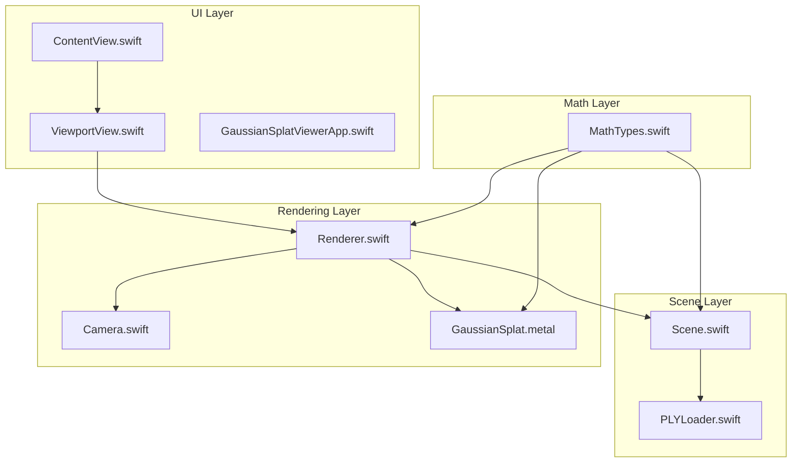
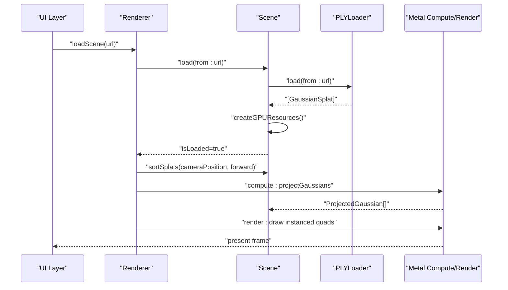
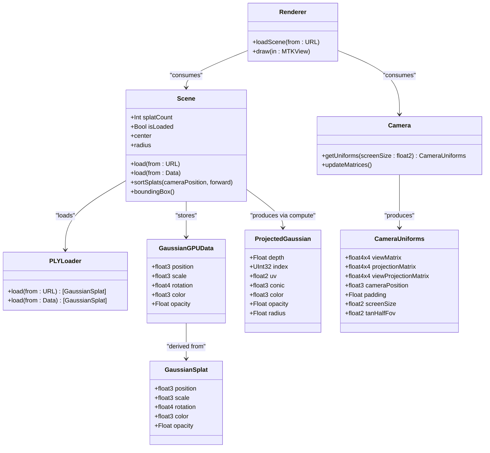

# Scene Data Structures

<cite>
**Referenced Files in This Document**
- [Scene.swift](file://Scene/Scene.swift)
- [PLYLoader.swift](file://Scene/PLYLoader.swift)
- [MathTypes.swift](file://Math/MathTypes.swift)
- [Camera.swift](file://Rendering/Camera.swift)
- [Renderer.swift](file://Rendering/Renderer.swift)
- [GaussianSplat.metal](file://Shaders/GaussianSplat.metal)
- [ContentView.swift](file://UI/ContentView.swift)
- [ViewportView.swift](file://UI/ViewportView.swift)
- [GaussianSplatViewerApp.swift](file://GaussianSplatViewerApp.swift)
</cite>

## Table of Contents
1. [Introduction](#introduction)
2. [Project Structure](#project-structure)
3. [Core Components](#core-components)
4. [Architecture Overview](#architecture-overview)
5. [Detailed Component Analysis](#detailed-component-analysis)
6. [Dependency Analysis](#dependency-analysis)
7. [Performance Considerations](#performance-considerations)
8. [Troubleshooting Guide](#troubleshooting-guide)
9. [Conclusion](#conclusion)

## Introduction
This document explains the scene data structures and management used in the Gaussian Splatting viewer. It covers the GaussianSplat data model (position, scale, rotation, color, opacity), the GPU-efficient GaussianGPUData structure, and the ProjectedGaussian structure used in the rendering pipeline. It also documents scene state management (splatCount, isLoaded), validation, geometric computations (bounding box, center, radius), and how these integrate with the Metal rendering pipeline.

## Project Structure
The project is organized around three primary domains:
- Scene: Data loading, GPU resource creation, and scene geometry helpers
- Math: SIMD-based math types and GPU-compatible structures
- Rendering: Camera, renderer, and Metal shaders
- UI: SwiftUI views and Metal viewport integration

**Diagram sources**
- [Scene.swift:1-158](file://Scene/Scene.swift#L1-L158)
- [PLYLoader.swift:1-403](file://Scene/PLYLoader.swift#L1-L403)
- [MathTypes.swift:1-189](file://Math/MathTypes.swift#L1-L189)
- [Camera.swift:1-184](file://Rendering/Camera.swift#L1-L184)
- [Renderer.swift:1-289](file://Rendering/Renderer.swift#L1-L289)
- [GaussianSplat.metal:1-317](file://Shaders/GaussianSplat.metal#L1-L317)
- [ContentView.swift:1-130](file://UI/ContentView.swift#L1-L130)
- [ViewportView.swift:1-185](file://UI/ViewportView.swift#L1-L185)
- [GaussianSplatViewerApp.swift:1-13](file://GaussianSplatViewerApp.swift#L1-L13)

**Section sources**
- [Scene.swift:1-158](file://Scene/Scene.swift#L1-L158)
- [MathTypes.swift:1-189](file://Math/MathTypes.swift#L1-L189)
- [Renderer.swift:1-289](file://Rendering/Renderer.swift#L1-L289)

## Core Components
This section documents the core data structures and their roles in the system.

- GaussianSplat: The primary CPU-side representation of a 3D Gaussian splat with position, scale, rotation (quaternion), color, and opacity.
- GaussianGPUData: A GPU-compatible packed structure derived from GaussianSplat for efficient Metal buffer storage.
- ProjectedGaussian: A per-splat structure computed by the Metal compute shader, containing depth, index, UV, 2D covariance conic parameters, color, opacity, and radius.
- CameraUniforms: A uniform buffer structure passed to shaders with view/projection matrices, camera position, screen size, and FOV tangents.

These structures are defined in the math layer and consumed by the scene and renderer.

**Section sources**
- [MathTypes.swift:10-73](file://Math/MathTypes.swift#L10-L73)
- [MathTypes.swift:34-51](file://Math/MathTypes.swift#L34-L51)
- [MathTypes.swift:64-73](file://Math/MathTypes.swift#L64-L73)
- [MathTypes.swift:53-62](file://Math/MathTypes.swift#L53-L62)

## Architecture Overview
The rendering pipeline consists of:
- CPU: Scene loads PLY data, creates GPU buffers, sorts splats, computes scene geometry.
- GPU: Compute shader projects splats into ProjectedGaussian entries; vertex/fragment shaders render instanced quads per splat.

**Diagram sources**
- [Renderer.swift:147-158](file://Rendering/Renderer.swift#L147-L158)
- [Scene.swift:30-55](file://Scene/Scene.swift#L30-L55)
- [Scene.swift:58-95](file://Scene/Scene.swift#L58-L95)
- [Scene.swift:106-121](file://Scene/Scene.swift#L106-L121)
- [GaussianSplat.metal:146-209](file://Shaders/GaussianSplat.metal#L146-L209)
- [GaussianSplat.metal:213-249](file://Shaders/GaussianSplat.metal#L213-L249)
- [GaussianSplat.metal:253-278](file://Shaders/GaussianSplat.metal#L253-L278)

## Detailed Component Analysis

### GaussianSplat Data Model
- Position: float3 representing 3D world coordinates.
- Scale: float3 representing scaling along principal axes.
- Rotation: float4 quaternion (x, y, z, w) for orientation.
- Color: float3 RGB color (derived from SH DC or direct RGB).
- Opacity: Float for translucency.

Validation and conversion patterns:
- Rotation normalization ensures valid orientation.
- Color derivation supports both SH DC coefficients and direct RGB channels.
- Opacity is sigmoid-transformed to [0,1].

Geometric computation:
- Covariance matrix computed from scale and rotation using a rotation matrix built from the quaternion.

**Section sources**
- [MathTypes.swift:12-30](file://Math/MathTypes.swift#L12-L30)
- [MathTypes.swift:170-188](file://Math/MathTypes.swift#L170-L188)

### GaussianGPUData for GPU Memory Efficiency
- Purpose: Pack GaussianSplat fields into a GPU-friendly structure with explicit padding to satisfy alignment requirements.
- Fields: position, scale, rotation, color, opacity, with two padding floats to align to 16-byte boundaries.
- Construction: Derived from GaussianSplat via initializer mapping.

Integration:
- Scene allocates a shared buffer sized by the number of splats times the stride of GaussianGPUData.
- Renderer passes this buffer to the compute shader.

**Section sources**
- [MathTypes.swift:34-51](file://Math/MathTypes.swift#L34-L51)
- [Scene.swift:58-95](file://Scene/Scene.swift#L58-L95)

### ProjectedGaussian in the Rendering Pipeline
- Purpose: Output of the compute shader, carrying per-splat data needed for rasterization.
- Fields: depth, index, uv, conic (2D covariance inverse), color, opacity, radius.
- Computed in shader:
  - 3D covariance from scale and rotation.
  - 2D covariance projection using view/projection matrices and FOV tangents.
  - Conic matrix (inverse covariance) used in fragment evaluation.
  - Radius computed as three sigmas of eigenvalues.

Rendering:
- Vertex shader generates screen-space quad vertices using radius and UV.
- Fragment shader evaluates 2D Gaussian using conic parameters and premultiplied alpha.

**Section sources**
- [MathTypes.swift:64-73](file://Math/MathTypes.swift#L64-L73)
- [GaussianSplat.metal:64-78](file://Shaders/GaussianSplat.metal#L64-L78)
- [GaussianSplat.metal:80-142](file://Shaders/GaussianSplat.metal#L80-L142)
- [GaussianSplat.metal:146-209](file://Shaders/GaussianSplat.metal#L146-L209)
- [GaussianSplat.metal:213-249](file://Shaders/GaussianSplat.metal#L213-L249)
- [GaussianSplat.metal:253-278](file://Shaders/GaussianSplat.metal#L253-L278)

### Scene State Management and Validation
- splatCount: Exposed as a computed property reflecting the number of loaded splats.
- isLoaded: True when splats are present and all GPU buffers are allocated.
- Loading:
  - From URL or raw Data via PLYLoader.
  - Creates GPU buffers for splat data, projected data, and indices.
  - Prints memory sizes for diagnostics.
- Sorting:
  - Back-to-front sorting using camera position and forward vector.
  - Updates GPU buffer with sorted data.

Scene geometry:
- boundingBox(): Computes min/max bounds across positions.
- center: Midpoint of bounding box.
- radius: Half-diagonal length of bounding box.

**Section sources**
- [Scene.swift:17-24](file://Scene/Scene.swift#L17-L24)
- [Scene.swift:30-55](file://Scene/Scene.swift#L30-L55)
- [Scene.swift:58-95](file://Scene/Scene.swift#L58-L95)
- [Scene.swift:106-121](file://Scene/Scene.swift#L106-L121)
- [Scene.swift:123-151](file://Scene/Scene.swift#L123-L151)

### PLY Loader and Data Validation
- Supports ASCII and binary little/big endian PLY formats.
- Parses vertex elements and maps properties to GaussianSplat fields.
- Validates presence of required fields (position) and handles optional fields (scale, rotation, color, opacity).
- Converts SH DC coefficients to RGB using sigmoid, or reads direct RGB channels.
- Handles endianness and numeric types robustly.

**Section sources**
- [PLYLoader.swift:41-68](file://Scene/PLYLoader.swift#L41-L68)
- [PLYLoader.swift:162-204](file://Scene/PLYLoader.swift#L162-L204)
- [PLYLoader.swift:208-317](file://Scene/PLYLoader.swift#L208-L317)
- [PLYLoader.swift:321-385](file://Scene/PLYLoader.swift#L321-L385)

### Camera and Uniforms
- Camera stores position, target, up, FOV, aspect ratio, near/far planes.
- Provides view/projection matrices and combined view-projection matrix.
- Exposes getUniforms(screenSize:) returning CameraUniforms for GPU consumption.
- Supports orbit controls: rotate, zoom, pan, focus, reset.

**Section sources**
- [Camera.swift:5-60](file://Rendering/Camera.swift#L5-L60)
- [Camera.swift:133-147](file://Rendering/Camera.swift#L133-L147)
- [MathTypes.swift:53-62](file://Math/MathTypes.swift#L53-L62)

### Renderer and Metal Pipeline
- Initializes Metal device, command queue, and shader library.
- Creates compute pipeline (projectGaussians) and render pipeline (gaussianVertex/gaussianFragment).
- Manages camera uniforms buffer with triple buffering for CPU/GPU synchronization.
- Draws instanced quads using projected data buffer and quad indices.
- Enables alpha blending for correct compositing.

**Section sources**
- [Renderer.swift:38-77](file://Rendering/Renderer.swift#L38-L77)
- [Renderer.swift:81-127](file://Rendering/Renderer.swift#L81-L127)
- [Renderer.swift:129-143](file://Rendering/Renderer.swift#L129-L143)
- [Renderer.swift:167-251](file://Rendering/Renderer.swift#L167-L251)

### UI Integration
- ContentView provides toolbar, file picker, and viewport overlay messages.
- ViewportView wraps MTKView and forwards input events to Renderer.
- ViewModel coordinates asynchronous loading and exposes stats (splatCount, FPS placeholder).

**Section sources**
- [ContentView.swift:4-125](file://UI/ContentView.swift#L4-L125)
- [ViewportView.swift:6-90](file://UI/ViewportView.swift#L6-L90)
- [ViewportView.swift:142-185](file://UI/ViewportView.swift#L142-L185)

## Dependency Analysis
Key dependencies and relationships:
- Scene depends on PLYLoader for data ingestion and on Metal device for GPU buffers.
- Renderer depends on Scene for splat data and on Camera for uniforms.
- MathTypes defines shared structures used across CPU and GPU.
- Shaders consume GPU-compatible structures and produce ProjectedGaussian.

**Diagram sources**
- [MathTypes.swift:10-73](file://Math/MathTypes.swift#L10-L73)
- [Scene.swift:1-158](file://Scene/Scene.swift#L1-158)
- [PLYLoader.swift:1-403](file://Scene/PLYLoader.swift#L1-L403)
- [Renderer.swift:1-289](file://Rendering/Renderer.swift#L1-L289)
- [Camera.swift:1-184](file://Rendering/Camera.swift#L1-L184)

**Section sources**
- [Scene.swift:1-158](file://Scene/Scene.swift#L1-L158)
- [MathTypes.swift:10-73](file://Math/MathTypes.swift#L10-L73)
- [Renderer.swift:1-289](file://Rendering/Renderer.swift#L1-L289)

## Performance Considerations
- GPU memory layout:
  - GaussianGPUData uses explicit padding to meet alignment requirements, minimizing misalignment penalties.
  - Shared storage mode for splat buffer reduces bandwidth compared to private buffers.
- Compute throughput:
  - Compute shader processes one thread per splat; dispatch sizing uses 256-wide thread groups.
  - ProjectedGaussian buffer is private to maximize GPU cache locality.
- Sorting:
  - Back-to-front sorting occurs periodically (every N frames) to reduce overdraw and improve blending performance.
- Rendering:
  - Instanced rendering with a small quad index buffer minimizes draw overhead.
  - Alpha blending configured for correct compositing.

[No sources needed since this section provides general guidance]

## Troubleshooting Guide
Common issues and checks:
- No splats loaded:
  - Verify PLY file contains a vertex element with required position fields.
  - Ensure loader errors are surfaced to the UI.
- Buffer creation failures:
  - Check device capabilities and Metal library availability.
  - Confirm GPU buffer allocations succeed.
- Visibility issues:
  - Validate opacity and color values; zero opacity or invalid conic will discard fragments.
  - Ensure camera is focused on scene center/radius.
- Performance problems:
  - Reduce splat count or disable depth sorting temporarily.
  - Monitor GPU memory usage and buffer sizes printed during load.

**Section sources**
- [Scene.swift:58-95](file://Scene/Scene.swift#L58-L95)
- [Renderer.swift:147-158](file://Rendering/Renderer.swift#L147-L158)
- [GaussianSplat.metal:230-234](file://Shaders/GaussianSplat.metal#L230-L234)
- [GaussianSplat.metal:174-178](file://Shaders/GaussianSplat.metal#L174-L178)

## Conclusion
The scene data model centers on GaussianSplat and its GPU counterparts, enabling efficient loading, projection, and rendering of 3D Gaussian splats. Scene tracks state and geometry, PLYLoader validates and parses input, and the Metal pipeline performs compute and rasterization. Together, these components deliver a robust foundation for Gaussian Splatting visualization with clear separation of concerns and performance-conscious design.