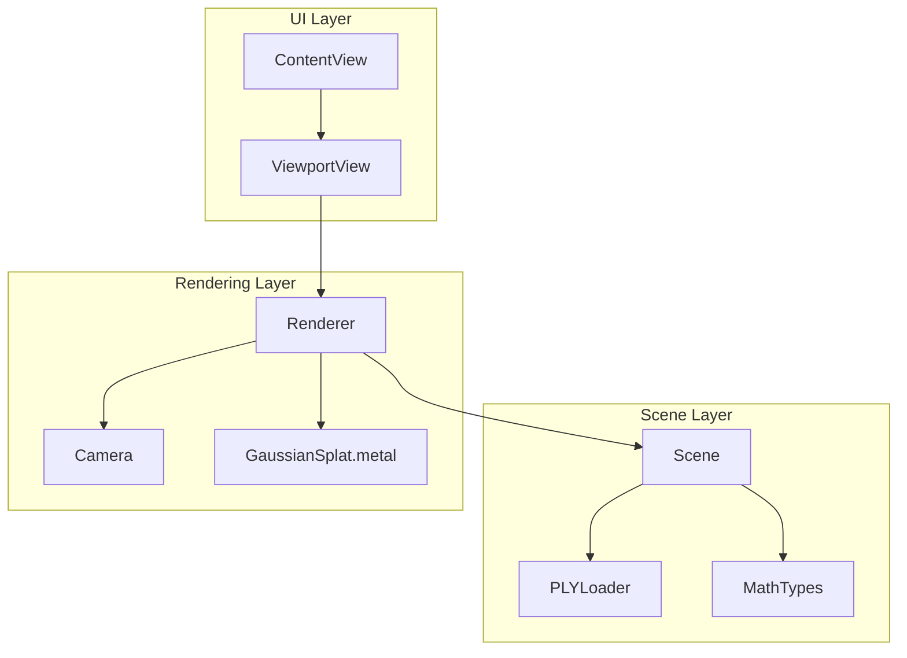
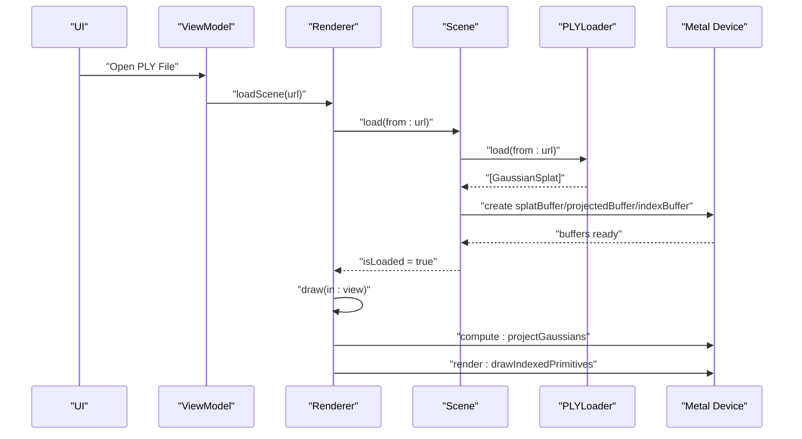
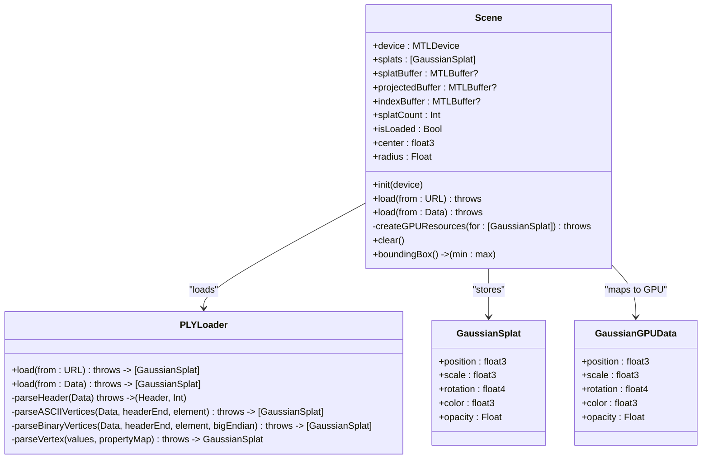
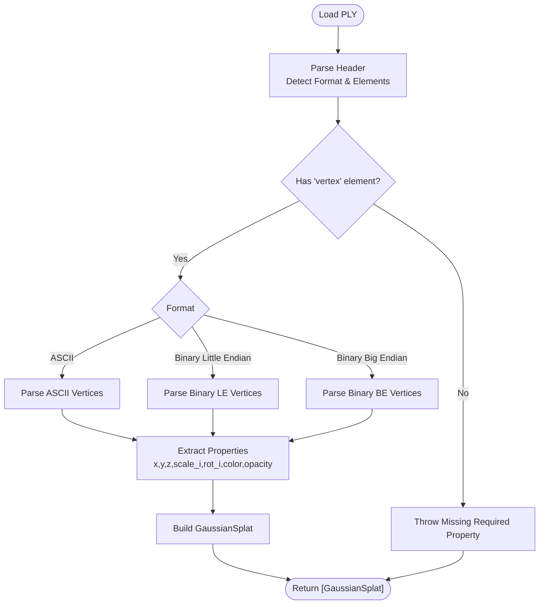
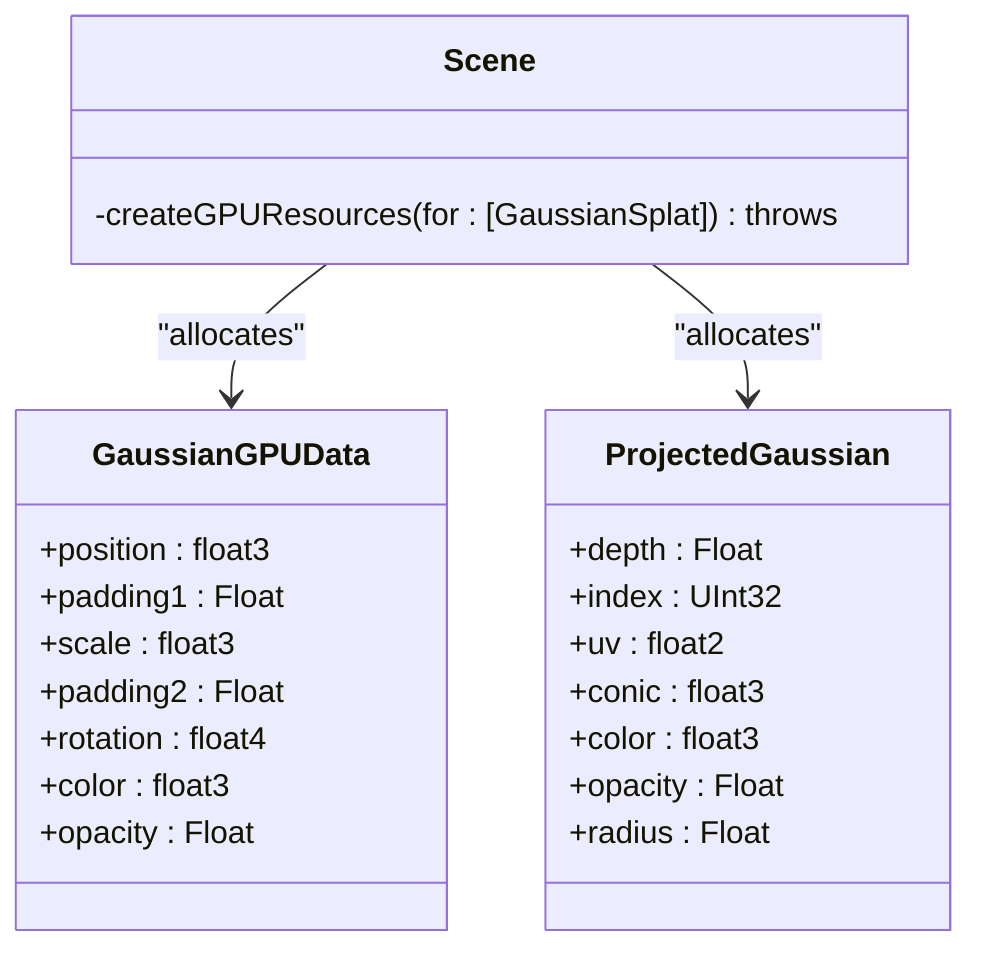
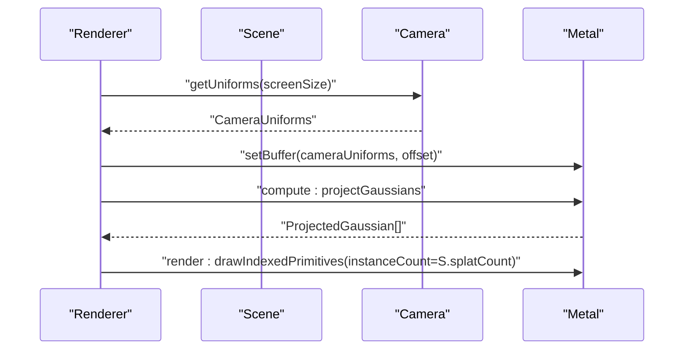
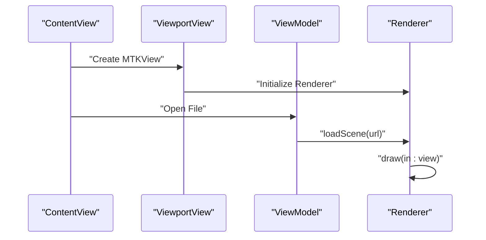
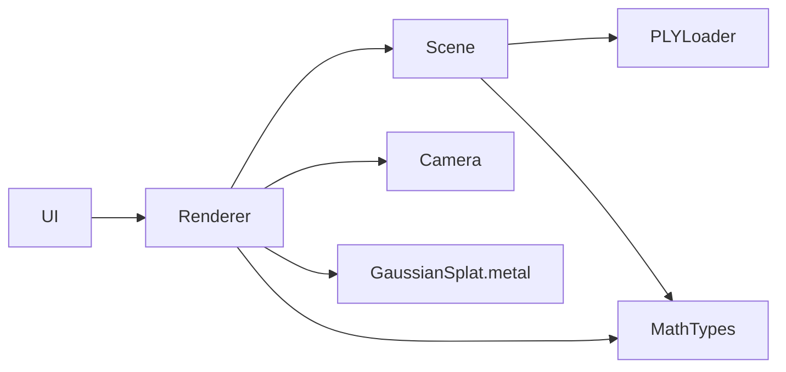

# Scene Management

<cite>
**Referenced Files in This Document**
- [Scene.swift](file://Scene/Scene.swift)
- [PLYLoader.swift](file://Scene/PLYLoader.swift)
- [MathTypes.swift](file://Math/MathTypes.swift)
- [Renderer.swift](file://Rendering/Renderer.swift)
- [Camera.swift](file://Rendering/Camera.swift)
- [GaussianSplat.metal](file://Shaders/GaussianSplat.metal)
- [ContentView.swift](file://UI/ContentView.swift)
- [ViewportView.swift](file://UI/ViewportView.swift)
- [GaussianSplatViewerApp.swift](file://GaussianSplatViewerApp.swift)
</cite>

## Table of Contents
1. [Introduction](#introduction)
2. [Project Structure](#project-structure)
3. [Core Components](#core-components)
4. [Architecture Overview](#architecture-overview)
5. [Detailed Component Analysis](#detailed-component-analysis)
6. [Dependency Analysis](#dependency-analysis)
7. [Performance Considerations](#performance-considerations)
8. [Troubleshooting Guide](#troubleshooting-guide)
9. [Conclusion](#conclusion)
10. [Appendices](#appendices)

## Introduction
This document provides comprehensive documentation for the Scene class and related systems responsible for scene management and data handling in a Gaussian Splatting viewer. It covers:
- PLY file loading and parsing, including format detection, property extraction, and robust error handling
- GPU buffer creation and memory layout for splat data, projected data, and indices
- Gaussian splat data structures, including CPU and GPU-compatible layouts
- Scene initialization, validation, and statistics computation
- Relationship between Scene and Renderer components, data flow, and rendering pipeline
- Practical examples for loading different PLY variants, handling large datasets, and optimizing memory usage

## Project Structure
The project follows a modular structure with clear separation of concerns:
- Scene: PLY loading, scene data management, and GPU buffer creation
- Math: Shared math types and GPU-compatible structures
- Rendering: Renderer and Camera orchestrate Metal rendering
- Shaders: Metal shaders implement projection and rasterization
- UI: SwiftUI views and MTKView integration for user interaction

**Diagram sources**
- [Scene.swift:1-140](file://Scene/Scene.swift#L1-L140)
- [PLYLoader.swift:1-403](file://Scene/PLYLoader.swift#L1-L403)
- [MathTypes.swift:1-189](file://Math/MathTypes.swift#L1-L189)
- [Renderer.swift:1-288](file://Rendering/Renderer.swift#L1-L288)
- [Camera.swift:1-184](file://Rendering/Camera.swift#L1-L184)
- [GaussianSplat.metal:1-309](file://Shaders/GaussianSplat.metal#L1-L309)
- [ContentView.swift:1-130](file://UI/ContentView.swift#L1-L130)
- [ViewportView.swift:1-185](file://UI/ViewportView.swift#L1-L185)

**Section sources**
- [Scene.swift:1-140](file://Scene/Scene.swift#L1-L140)
- [PLYLoader.swift:1-403](file://Scene/PLYLoader.swift#L1-L403)
- [MathTypes.swift:1-189](file://Math/MathTypes.swift#L1-L189)
- [Renderer.swift:1-288](file://Rendering/Renderer.swift#L1-L288)
- [Camera.swift:1-184](file://Rendering/Camera.swift#L1-L184)
- [GaussianSplat.metal:1-309](file://Shaders/GaussianSplat.metal#L1-L309)
- [ContentView.swift:1-130](file://UI/ContentView.swift#L1-L130)
- [ViewportView.swift:1-185](file://UI/ViewportView.swift#L1-L185)
- [GaussianSplatViewerApp.swift:1-13](file://GaussianSplatViewerApp.swift#L1-L13)

## Core Components
- Scene: Central manager for Gaussian splats, GPU buffers, and scene state. Handles PLY loading, GPU resource creation, and scene statistics.
- PLYLoader: Robust parser for Stanford PLY files supporting ASCII and binary little/big endian formats, extracting vertex properties and constructing GaussianSplat instances.
- MathTypes: Defines GaussianSplat, GaussianGPUData, ProjectedGaussian, CameraUniforms, and related math utilities for GPU-friendly data layouts.
- Renderer: Metal-based renderer orchestrating compute and render passes, managing camera uniforms, and driving the drawing loop.
- Camera: Orbit camera controlling view/projection matrices and responding to user input.
- GaussianSplat.metal: Implements compute and fragment shaders for projecting Gaussians and rasterizing splats.

Key responsibilities:
- Scene manages CPU splat arrays and GPU buffers, validates loaded state, and computes scene bounds.
- PLYLoader parses headers, detects formats, and extracts numeric properties into GaussianSplat objects.
- Renderer consumes Scene data to drive Metal compute and render passes, with camera-driven uniforms.

**Section sources**
- [Scene.swift:5-140](file://Scene/Scene.swift#L5-L140)
- [PLYLoader.swift:13-403](file://Scene/PLYLoader.swift#L13-L403)
- [MathTypes.swift:10-189](file://Math/MathTypes.swift#L10-L189)
- [Renderer.swift:6-288](file://Rendering/Renderer.swift#L6-L288)
- [Camera.swift:4-184](file://Rendering/Camera.swift#L4-L184)
- [GaussianSplat.metal:6-309](file://Shaders/GaussianSplat.metal#L6-L309)

## Architecture Overview
The system integrates UI, scene loading, and rendering through a clear pipeline:
- UI triggers file loading via ViewModel and Renderer
- Renderer delegates scene loading to Scene
- Scene loads PLY via PLYLoader and creates GPU buffers
- Renderer runs compute pass to project Gaussians and render pass to draw splats

**Diagram sources**
- [Renderer.swift:147-157](file://Rendering/Renderer.swift#L147-L157)
- [Scene.swift:30-55](file://Scene/Scene.swift#L30-L55)
- [PLYLoader.swift:42-68](file://Scene/PLYLoader.swift#L42-L68)
- [GaussianSplat.metal:138-201](file://Shaders/GaussianSplat.metal#L138-L201)

## Detailed Component Analysis

### Scene: Scene Management and GPU Buffer Lifecycle
Responsibilities:
- Load splats from PLY via URL or raw Data
- Validate loaded state and compute scene statistics (center, radius)
- Create GPU buffers for splat data, projected data, and indices
- Provide bounding box computation and clear operations

Key behaviors:
- PLY loading prints timing metrics and delegates to PLYLoader
- GPU buffer creation maps CPU GaussianSplat to GaussianGPUData and allocates Metal buffers
- Index buffer stores per-splat indices for potential sorting
- Scene state exposes isLoaded and splatCount for Renderer safety checks

**Diagram sources**
- [Scene.swift:5-140](file://Scene/Scene.swift#L5-L140)
- [PLYLoader.swift:13-403](file://Scene/PLYLoader.swift#L13-L403)
- [MathTypes.swift:10-73](file://Math/MathTypes.swift#L10-L73)

**Section sources**
- [Scene.swift:5-140](file://Scene/Scene.swift#L5-L140)
- [PLYLoader.swift:42-68](file://Scene/PLYLoader.swift#L42-L68)
- [MathTypes.swift:10-73](file://Math/MathTypes.swift#L10-L73)

### PLY Loader: Format Parsing, Property Extraction, and Error Handling
Capabilities:
- Detects PLY format (ASCII, binary little endian, binary big endian)
- Parses headers and enumerates elements and properties
- Supports property types including float, double, char/int8, uchar/uint8, short/int16, ushort/uint16, int/int32, uint/uint32
- Extracts required position (x, y, z) and optional properties:
  - Scale components (scale_0, scale_1, scale_2) with exponential mapping
  - Rotation as quaternion (rot_1, rot_2, rot_3, rot_0) normalized
  - Color via SH DC coefficients (f_dc_0..2) or direct RGB (red, green, blue)
  - Opacity via sigmoid mapping
- Robust error handling for missing headers, unsupported formats, and parse failures

**Diagram sources**
- [PLYLoader.swift:42-68](file://Scene/PLYLoader.swift#L42-L68)
- [PLYLoader.swift:72-158](file://Scene/PLYLoader.swift#L72-L158)
- [PLYLoader.swift:162-204](file://Scene/PLYLoader.swift#L162-L204)
- [PLYLoader.swift:208-317](file://Scene/PLYLoader.swift#L208-L317)
- [PLYLoader.swift:321-385](file://Scene/PLYLoader.swift#L321-L385)

**Section sources**
- [PLYLoader.swift:13-403](file://Scene/PLYLoader.swift#L13-L403)

### GPU Buffer Allocation and Memory Layout
Scene creates three GPU buffers:
- Splat buffer: CPU-to-GPU transfer of GaussianGPUData for each splat
- Projected buffer: Output of compute shader containing ProjectedGaussian entries
- Index buffer: UInt32 indices for potential sorting

Memory layout considerations:
- GaussianGPUData mirrors GaussianSplat with explicit padding to align to SIMD boundaries
- ProjectedGaussian holds depth, index, UV, conic, color, opacity, and radius
- Storage modes:
  - Splat buffer uses shared storage for CPU/GPU coherency
  - Projected and index buffers use private storage for compute/render throughput

**Diagram sources**
- [MathTypes.swift:34-73](file://Math/MathTypes.swift#L34-L73)
- [Scene.swift:58-95](file://Scene/Scene.swift#L58-L95)

**Section sources**
- [MathTypes.swift:34-73](file://Math/MathTypes.swift#L34-L73)
- [Scene.swift:58-95](file://Scene/Scene.swift#L58-L95)

### Renderer and Camera: Data Flow and Rendering Pipeline
Renderer responsibilities:
- Creates Metal pipeline states for compute and render passes
- Manages camera uniforms buffer with triple buffering for CPU/GPU synchronization
- Drives the draw loop: compute pass projects Gaussians, optional sorting, and render pass draws instanced quads
- Updates camera uniforms each frame and handles viewport changes

Camera responsibilities:
- Orbit navigation with spherical coordinates
- Maintains view and projection matrices
- Provides CameraUniforms for GPU consumption

**Diagram sources**
- [Renderer.swift:166-250](file://Rendering/Renderer.swift#L166-L250)
- [Camera.swift:134-147](file://Rendering/Camera.swift#L134-L147)
- [GaussianSplat.metal:138-201](file://Shaders/GaussianSplat.metal#L138-L201)

**Section sources**
- [Renderer.swift:1-288](file://Rendering/Renderer.swift#L1-L288)
- [Camera.swift:1-184](file://Rendering/Camera.swift#L1-L184)
- [GaussianSplat.metal:138-271](file://Shaders/GaussianSplat.metal#L138-L271)

### UI Integration and Data Flow
The UI layer integrates with the renderer and scene:
- ContentView provides toolbar and viewport
- ViewportView wraps MTKView and wires input events to Renderer
- ViewModel coordinates asynchronous loading and updates UI state

**Diagram sources**
- [ContentView.swift:1-130](file://UI/ContentView.swift#L1-L130)
- [ViewportView.swift:1-185](file://UI/ViewportView.swift#L1-L185)
- [GaussianSplatViewerApp.swift:1-13](file://GaussianSplatViewerApp.swift#L1-L13)

**Section sources**
- [ContentView.swift:1-130](file://UI/ContentView.swift#L1-L130)
- [ViewportView.swift:1-185](file://UI/ViewportView.swift#L1-L185)
- [GaussianSplatViewerApp.swift:1-13](file://GaussianSplatViewerApp.swift#L1-L13)

## Dependency Analysis
- Scene depends on PLYLoader for data ingestion and Metal device for buffer creation
- Renderer depends on Scene for splat data and Camera for uniforms
- MathTypes defines shared structures consumed by Scene, Renderer, and shaders
- Shaders depend on MathTypes structures for GPU data layout
- UI depends on Renderer for viewport rendering and ViewModel for state

**Diagram sources**
- [Scene.swift:1-140](file://Scene/Scene.swift#L1-L140)
- [PLYLoader.swift:1-403](file://Scene/PLYLoader.swift#L1-L403)
- [MathTypes.swift:1-189](file://Math/MathTypes.swift#L1-L189)
- [Renderer.swift:1-288](file://Rendering/Renderer.swift#L1-L288)
- [GaussianSplat.metal:1-309](file://Shaders/GaussianSplat.metal#L1-L309)
- [ViewportView.swift:1-185](file://UI/ViewportView.swift#L1-L185)

**Section sources**
- [Scene.swift:1-140](file://Scene/Scene.swift#L1-L140)
- [Renderer.swift:1-288](file://Rendering/Renderer.swift#L1-L288)
- [MathTypes.swift:1-189](file://Math/MathTypes.swift#L1-L189)

## Performance Considerations
- PLY parsing:
  - ASCII parsing iterates per line; for large files, binary formats offer better throughput
  - Binary parsing uses fixed strides and type sizes; ensure endianness handling is correct
- GPU buffer creation:
  - Use shared storage for splat buffer to enable CPU reads/writes; consider private storage for compute outputs
  - Pre-reserve capacity in splat arrays to minimize reallocations
- Compute pass:
  - Dispatch grid size should match splat count; ensure thread group size aligns with hardware
  - Camera uniforms use triple buffering to avoid CPU/GPU synchronization stalls
- Rendering:
  - Instanced rendering with indexed quads minimizes draw calls
  - Alpha blending requires careful ordering; consider depth sorting for correctness
- Memory:
  - Monitor buffer sizes printed during GPU creation to estimate VRAM usage
  - For very large scenes, consider streaming or LOD strategies

[No sources needed since this section provides general guidance]

## Troubleshooting Guide
Common issues and remedies:
- PLYLoader errors:
  - Invalid header or unsupported format: verify PLY magic and element/property declarations
  - Missing required properties (position): ensure x, y, z are present
  - Parse errors: inspect malformed lines in ASCII or incorrect stride in binary
- Buffer creation failures:
  - SceneError.failedToCreateBuffer indicates Metal buffer allocation failure; check available memory and buffer sizes
- Scene not loaded:
  - SceneError.noSplatsLoaded occurs when attempting to render without valid splats; ensure successful load and isLoaded check
- Rendering artifacts:
  - Incorrect camera uniforms or viewport size; verify aspect ratio and screenSize updates
  - Sorting disabled by default; enable depth sorting for complex scenes

**Section sources**
- [PLYLoader.swift:3-10](file://Scene/PLYLoader.swift#L3-L10)
- [Scene.swift:136-140](file://Scene/Scene.swift#L136-L140)
- [Renderer.swift:147-157](file://Rendering/Renderer.swift#L147-L157)

## Conclusion
The Scene class centralizes Gaussian splat data management and GPU buffer lifecycle, while PLYLoader provides robust parsing for diverse PLY formats. Together with Renderer and Camera, the system delivers a responsive Gaussian Splatting viewer with clear data flow and extensible architecture. Proper buffer sizing, format selection, and sorting strategies are essential for performance and visual quality.

[No sources needed since this section summarizes without analyzing specific files]

## Appendices

### Practical Examples

- Loading ASCII PLY:
  - Use Scene.load(from: URL) to load a PLY file with ASCII vertex data
  - PLYLoader parses header and ASCII lines, mapping properties to GaussianSplat
  - Scene creates GPU buffers and sets isLoaded

- Loading Binary PLY:
  - PLYLoader detects binary format and calculates stride from property types
  - Binary parsing reads fixed-size records with endianness conversion
  - Validates offsets and types to prevent buffer overruns

- Handling Large Datasets:
  - Prefer binary little-endian PLY for speed
  - Monitor buffer sizes and consider splitting large files into tiles
  - Use triple-buffered camera uniforms to reduce CPU/GPU stalls

- Optimizing Memory Usage:
  - Ensure GaussianGPUData padding aligns to SIMD boundaries
  - Use private storage for compute outputs and indices
  - Validate splat counts and clear buffers when switching scenes

[No sources needed since this section provides general guidance]