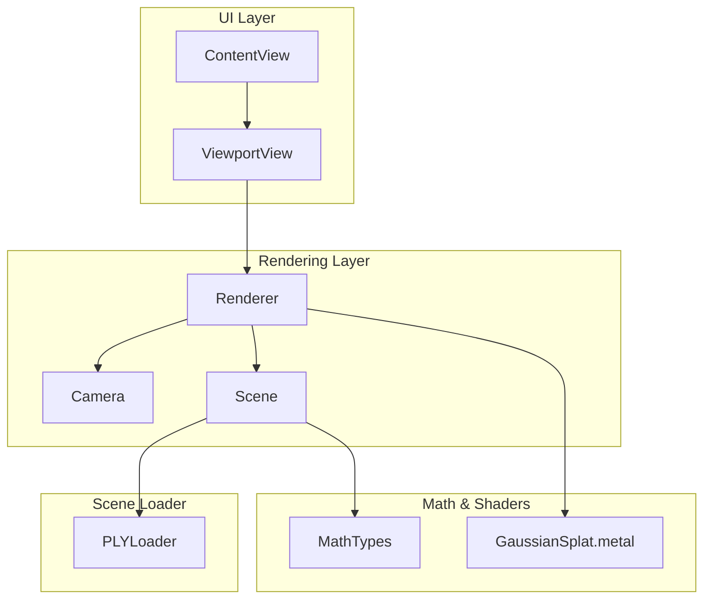
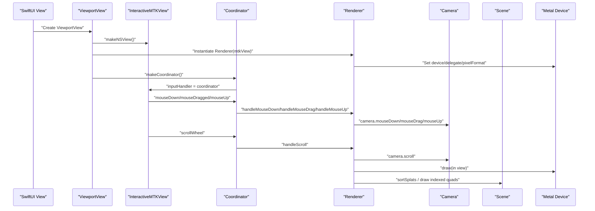
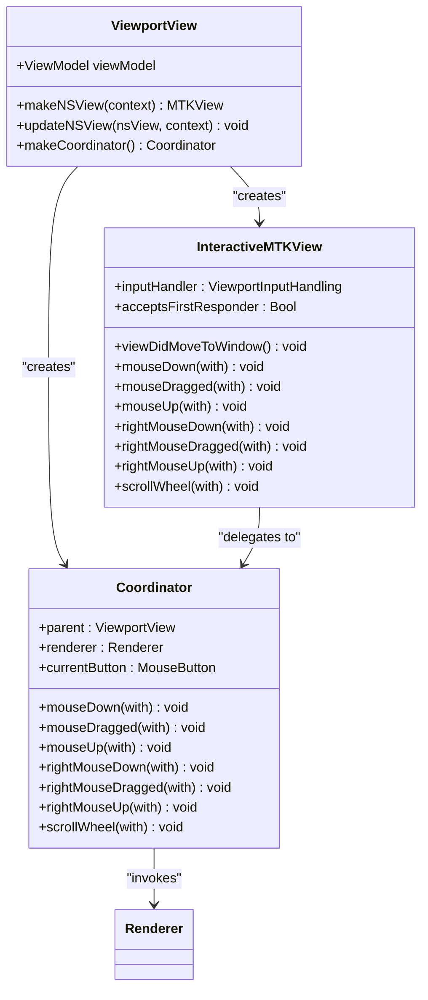
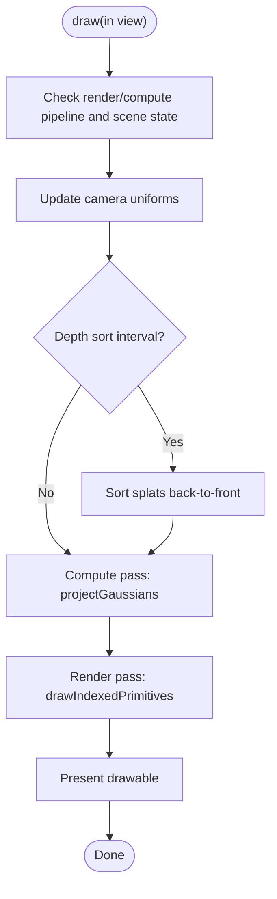
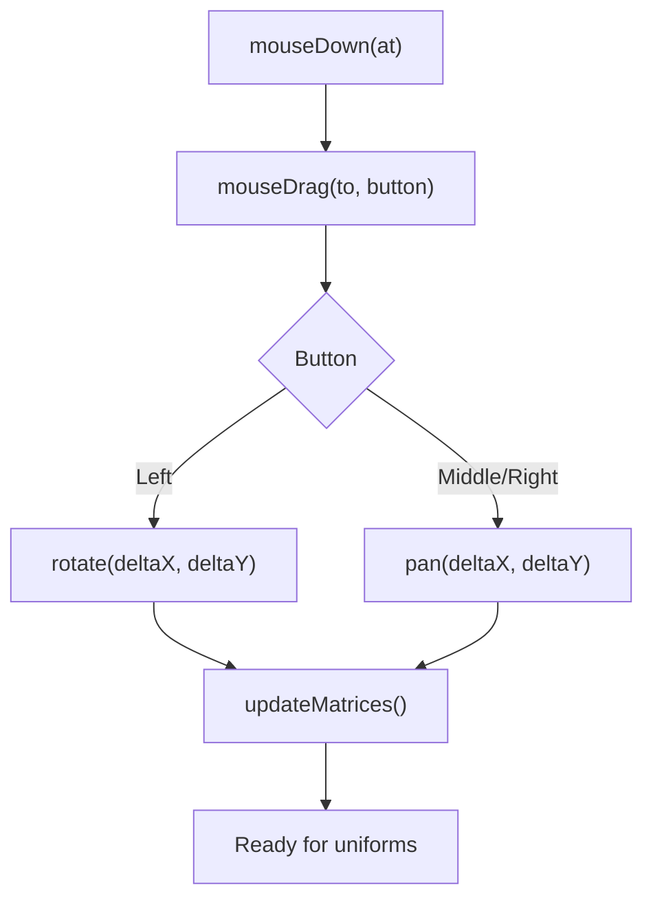
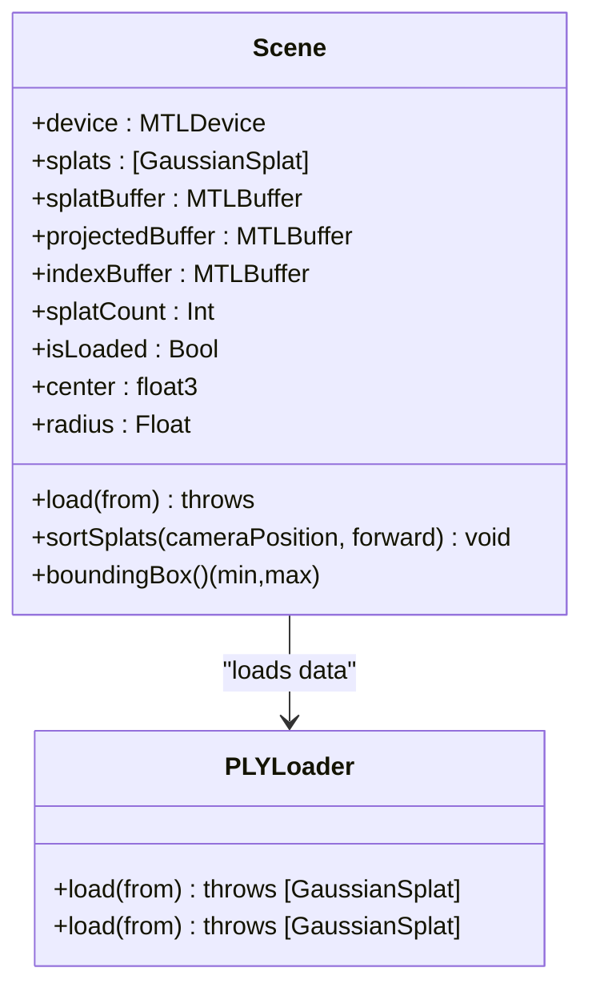
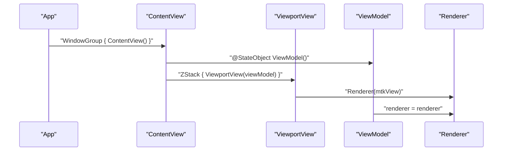
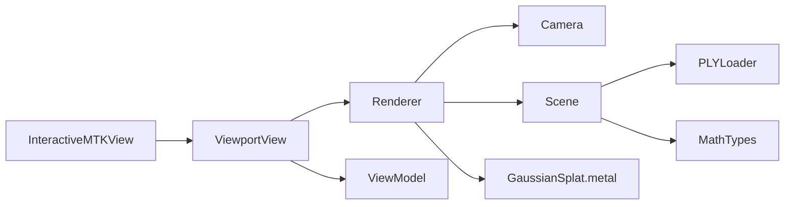

# Viewport Integration

<cite>
**Referenced Files in This Document**
- [ViewportView.swift](file://UI/ViewportView.swift)
- [Renderer.swift](file://Rendering/Renderer.swift)
- [Camera.swift](file://Rendering/Camera.swift)
- [Scene.swift](file://Scene/Scene.swift)
- [MathTypes.swift](file://Math/MathTypes.swift)
- [ContentView.swift](file://UI/ContentView.swift)
- [GaussianSplat.metal](file://Shaders/GaussianSplat.metal)
- [PLYLoader.swift](file://Scene/PLYLoader.swift)
- [GaussianSplatViewerApp.swift](file://GaussianSplatViewerApp.swift)
</cite>

## Table of Contents
1. [Introduction](#introduction)
2. [Project Structure](#project-structure)
3. [Core Components](#core-components)
4. [Architecture Overview](#architecture-overview)
5. [Detailed Component Analysis](#detailed-component-analysis)
6. [Dependency Analysis](#dependency-analysis)
7. [Performance Considerations](#performance-considerations)
8. [Troubleshooting Guide](#troubleshooting-guide)
9. [Conclusion](#conclusion)
10. [Appendices](#appendices)

## Introduction
This document explains the SwiftUI-Metal viewport integration centered around the ViewportView component. It covers MetalKit view setup, delegate implementation, SwiftUI integration patterns, user input handling (mouse tracking, drag gestures, scroll), viewport sizing and aspect ratio management, and the coordination between ViewportView and the Renderer. It also documents the integration with the Camera and Scene subsystems, event propagation, state synchronization, and performance optimization strategies for smooth rendering.

## Project Structure
The viewport integration spans several modules:
- UI: SwiftUI views and the ViewportView wrapper around MTKView
- Rendering: Renderer, Camera, and Scene orchestration
- Math: GPU-compatible data structures and math helpers
- Shaders: Metal compute and fragment shaders for Gaussian splatting
- Scene: PLY file loading and GPU buffer creation

**Diagram sources**
- [ContentView.swift:1-130](file://UI/ContentView.swift#L1-L130)
- [ViewportView.swift:1-185](file://UI/ViewportView.swift#L1-L185)
- [Renderer.swift:1-289](file://Rendering/Renderer.swift#L1-L289)
- [Camera.swift:1-184](file://Rendering/Camera.swift#L1-L184)
- [Scene.swift:1-158](file://Scene/Scene.swift#L1-L158)
- [MathTypes.swift:1-189](file://Math/MathTypes.swift#L1-L189)
- [GaussianSplat.metal:1-317](file://Shaders/GaussianSplat.metal#L1-L317)
- [PLYLoader.swift:1-403](file://Scene/PLYLoader.swift#L1-L403)

**Section sources**
- [GaussianSplatViewerApp.swift:1-13](file://GaussianSplatViewerApp.swift#L1-L13)
- [ContentView.swift:1-130](file://UI/ContentView.swift#L1-L130)
- [ViewportView.swift:1-185](file://UI/ViewportView.swift#L1-L185)
- [Renderer.swift:1-289](file://Rendering/Renderer.swift#L1-L289)

## Core Components
- ViewportView: SwiftUI wrapper around MTKView that sets up the Metal device, renderer, and input handler. It implements NSViewRepresentable and uses a Coordinator to bridge MTKView input events to the Renderer.
- InteractiveMTKView: Subclass of MTKView that forwards NSEvent-driven mouse and scroll events to a ViewportInputHandling delegate.
- ViewportInputHandling protocol: Defines the interface for mouse and scroll event callbacks.
- Renderer: MTKViewDelegate that manages Metal pipeline creation, buffer allocation, scene loading, and the draw loop. It exposes camera control handlers for mouse and scroll events.
- Camera: Orbit camera with sensitivity controls, drag state, and matrix computation for view/projection.
- Scene: Manages CPU and GPU data for Gaussian splats, GPU buffer creation, and depth sorting.
- MathTypes: Defines GPU-compatible structures (CameraUniforms, GaussianGPUData, ProjectedGaussian) and matrix/quaternion helpers.
- GaussianSplat.metal: Implements compute and fragment shaders for projecting and rendering splats.
- PLYLoader: Loads Gaussian splats from .ply files, handling ASCII and binary formats.

**Section sources**
- [ViewportView.swift:1-185](file://UI/ViewportView.swift#L1-L185)
- [Renderer.swift:1-289](file://Rendering/Renderer.swift#L1-L289)
- [Camera.swift:1-184](file://Rendering/Camera.swift#L1-L184)
- [Scene.swift:1-158](file://Scene/Scene.swift#L1-L158)
- [MathTypes.swift:1-189](file://Math/MathTypes.swift#L1-L189)
- [GaussianSplat.metal:1-317](file://Shaders/GaussianSplat.metal#L1-L317)
- [PLYLoader.swift:1-403](file://Scene/PLYLoader.swift#L1-L403)

## Architecture Overview
The viewport integrates SwiftUI with MetalKit through a two-way bridge:
- SwiftUI creates the ViewportView, which instantiates an InteractiveMTKView and a Renderer.
- InteractiveMTKView forwards NSEvents to the Coordinator, which calls Renderer’s camera control methods.
- Renderer updates Camera state and drives the MTKView draw loop, which executes compute and render passes using Metal.

**Diagram sources**
- [ViewportView.swift:9-36](file://UI/ViewportView.swift#L9-L36)
- [Renderer.swift:167-251](file://Rendering/Renderer.swift#L167-L251)
- [Camera.swift:149-176](file://Rendering/Camera.swift#L149-L176)

## Detailed Component Analysis

### ViewportView and InteractiveMTKView
- ViewportView implements NSViewRepresentable to host an MTKView inside SwiftUI. It initializes the Metal device, enables continuous rendering, sets preferred frame rate, and wires the Coordinator as the input handler.
- The Coordinator conforms to ViewportInputHandling and translates NSEvents into Renderer camera control calls.
- InteractiveMTKView overrides mouse and scroll event methods to forward events to the input handler and ensures first-responder status so the view receives input.

**Diagram sources**
- [ViewportView.swift:6-90](file://UI/ViewportView.swift#L6-L90)

**Section sources**
- [ViewportView.swift:9-36](file://UI/ViewportView.swift#L9-L36)
- [ViewportView.swift:102-139](file://UI/ViewportView.swift#L102-L139)

### Renderer and MTKView Delegate
- Renderer implements MTKViewDelegate and manages:
  - Metal device, command queue, and shader library
  - Compute and render pipeline creation
  - Camera uniforms buffer and index buffer
  - Scene lifecycle (loading, sorting, drawing)
- It updates viewportSize and camera aspect ratio on drawableSize changes and performs a two-pass pipeline: compute (project Gaussians) and render (draw instanced quads).
- It exposes camera control handlers for mouse and scroll events.

**Diagram sources**
- [Renderer.swift:167-251](file://Rendering/Renderer.swift#L167-L251)

**Section sources**
- [Renderer.swift:38-77](file://Rendering/Renderer.swift#L38-L77)
- [Renderer.swift:162-165](file://Rendering/Renderer.swift#L162-L165)
- [Renderer.swift:167-251](file://Rendering/Renderer.swift#L167-L251)
- [Renderer.swift:271-287](file://Rendering/Renderer.swift#L271-L287)

### Camera Control and Interaction
- Camera handles mouse drag differently based on button:
  - Left drag: rotate around target
  - Middle/Right drag: pan in screen space
  - Scroll: zoom with distance clamping
- It computes view and projection matrices and provides uniforms for GPU consumption.

**Diagram sources**
- [Camera.swift:149-176](file://Rendering/Camera.swift#L149-L176)
- [Camera.swift:86-115](file://Rendering/Camera.swift#L86-L115)

**Section sources**
- [Camera.swift:86-115](file://Rendering/Camera.swift#L86-L115)
- [Camera.swift:149-176](file://Rendering/Camera.swift#L149-L176)

### Scene and GPU Buffer Management
- Scene loads Gaussian splats from PLY and creates GPU buffers for splat data, projected data, and indices.
- It supports sorting splats for correct alpha blending and provides bounding box and radius for camera focusing.

**Diagram sources**
- [Scene.swift:6-158](file://Scene/Scene.swift#L6-L158)
- [PLYLoader.swift:41-68](file://Scene/PLYLoader.swift#L41-L68)

**Section sources**
- [Scene.swift:30-95](file://Scene/Scene.swift#L30-L95)
- [Scene.swift:105-121](file://Scene/Scene.swift#L105-L121)
- [PLYLoader.swift:41-68](file://Scene/PLYLoader.swift#L41-L68)

### SwiftUI-Metal Interoperability Patterns
- ViewportView uses NSViewRepresentable to embed MTKView in SwiftUI, setting up the Metal device and renderer in makeNSView and wiring the Coordinator in makeCoordinator.
- The ViewModel holds a reference to the Renderer and publishes loading and scene metrics for UI feedback.
- The top-level ContentView composes the toolbar, viewport, overlays, and file importer.

**Diagram sources**
- [GaussianSplatViewerApp.swift:4-10](file://GaussianSplatViewerApp.swift#L4-L10)
- [ContentView.swift:4-124](file://UI/ContentView.swift#L4-L124)
- [ViewportView.swift:9-26](file://UI/ViewportView.swift#L9-L26)

**Section sources**
- [ViewportView.swift:9-36](file://UI/ViewportView.swift#L9-L36)
- [ContentView.swift:4-124](file://UI/ContentView.swift#L4-L124)

## Dependency Analysis
- ViewportView depends on Renderer and ViewModel to manage input and rendering state.
- InteractiveMTKView depends on ViewportInputHandling to receive events.
- Renderer depends on Camera for view/projection matrices and Scene for splat data and GPU buffers.
- Scene depends on PLYLoader for data ingestion and MathTypes for GPU-compatible structures.
- Shaders depend on MathTypes structures and CameraUniforms for uniforms.

**Diagram sources**
- [ViewportView.swift:1-185](file://UI/ViewportView.swift#L1-L185)
- [Renderer.swift:1-289](file://Rendering/Renderer.swift#L1-L289)
- [Scene.swift:1-158](file://Scene/Scene.swift#L1-L158)
- [PLYLoader.swift:1-403](file://Scene/PLYLoader.swift#L1-L403)
- [MathTypes.swift:1-189](file://Math/MathTypes.swift#L1-L189)
- [GaussianSplat.metal:1-317](file://Shaders/GaussianSplat.metal#L1-L317)

**Section sources**
- [ViewportView.swift:1-185](file://UI/ViewportView.swift#L1-L185)
- [Renderer.swift:1-289](file://Rendering/Renderer.swift#L1-L289)

## Performance Considerations
- Triple-buffered camera uniforms: The renderer allocates a shared buffer sized to accommodate three frames, avoiding contention and enabling asynchronous updates.
- Compute and render separation: The compute pass projects splats and prepares per-splat data; the render pass draws instanced quads. This reduces redundant work and improves throughput.
- Depth sorting cadence: Sorting occurs every N frames to balance correctness and performance.
- Asynchronous scene loading: Scene loading runs off the main thread, keeping UI responsive.
- Frame pacing: Preferred frames per second is set to a fixed value to stabilize timing.

Practical tips:
- Prefer triple buffering for uniform updates to minimize stalls.
- Keep compute dispatch sizes aligned with thread group sizes for efficient GPU utilization.
- Limit sorting frequency for large scenes; consider adaptive intervals.
- Use asynchronous I/O for large .ply files and avoid blocking the main thread.

**Section sources**
- [Renderer.swift:19-20](file://Rendering/Renderer.swift#L19-L20)
- [Renderer.swift:188-191](file://Rendering/Renderer.swift#L188-L191)
- [Renderer.swift:130-143](file://Rendering/Renderer.swift#L130-L143)
- [Renderer.swift:15-34](file://Rendering/Renderer.swift#L15-L34)
- [Scene.swift:30-55](file://Scene/Scene.swift#L30-L55)

## Troubleshooting Guide
Common issues and resolutions:
- No rendering output:
  - Verify MTKView pixel formats and clear color are set.
  - Ensure the renderer is assigned as MTKView delegate and device is valid.
- Input not responding:
  - Confirm InteractiveMTKView accepts first responder and inputHandler is set.
  - Ensure Coordinator is created and assigned to the MTKView.
- Incorrect aspect ratio or zoom:
  - Check drawableSize change callback updates camera aspect ratio.
- Poor performance:
  - Reduce sorting frequency or disable depth sorting temporarily.
  - Verify compute dispatch parameters match splat count.
- Scene load errors:
  - Validate .ply format and required properties.
  - Check buffer creation and memory allocation.

**Section sources**
- [Renderer.swift:64-69](file://Rendering/Renderer.swift#L64-L69)
- [Renderer.swift:162-165](file://Rendering/Renderer.swift#L162-L165)
- [ViewportView.swift:102-139](file://UI/ViewportView.swift#L102-L139)
- [Scene.swift:57-95](file://Scene/Scene.swift#L57-L95)
- [PLYLoader.swift:41-68](file://Scene/PLYLoader.swift#L41-L68)

## Conclusion
The ViewportView component provides a clean SwiftUI-Metal integration by wrapping MTKView, bridging input events to the Renderer, and coordinating with Camera and Scene. The Renderer encapsulates Metal pipeline management, GPU buffer handling, and the draw loop, while Camera and Scene manage navigation and data. Together, these components deliver responsive viewport interaction and efficient rendering for Gaussian splatting.

## Appendices

### Practical Examples

- Configuring the viewport:
  - Set MTKView device, delegate, pixel formats, and clear color in the renderer initialization.
  - Ensure the SwiftUI view wraps the ViewportView and applies background and overlay states.

- Custom interaction handlers:
  - Extend the Coordinator to intercept additional NSEvents and route them to custom camera modes or scene actions.
  - Add new buttons or modifiers to differentiate interaction modes (e.g., middle-click pan vs. right-click pan).

- Performance optimization checklist:
  - Use triple-buffered uniforms and align compute dispatch sizes.
  - Adjust depth sort interval based on scene size.
  - Offload heavy I/O to background queues.
  - Monitor command buffer completion for GPU errors.

**Section sources**
- [Renderer.swift:38-77](file://Rendering/Renderer.swift#L38-L77)
- [ViewportView.swift:9-36](file://UI/ViewportView.swift#L9-L36)
- [Camera.swift:86-115](file://Rendering/Camera.swift#L86-L115)