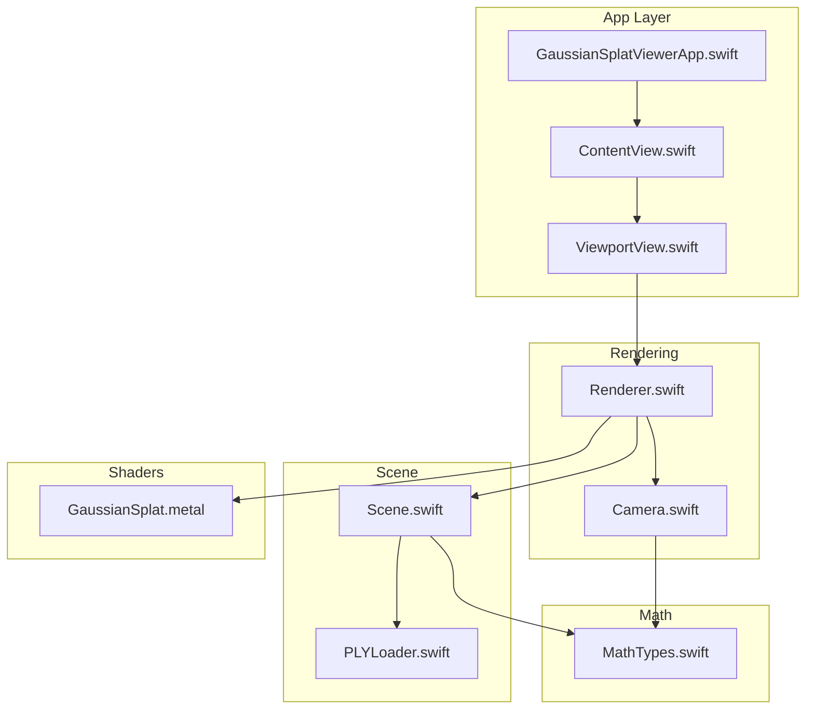
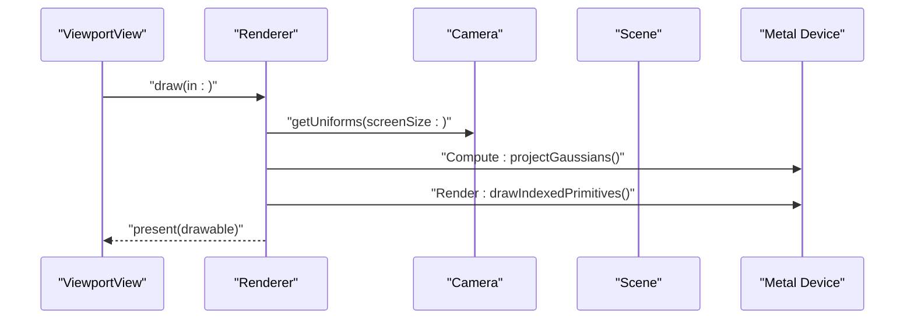
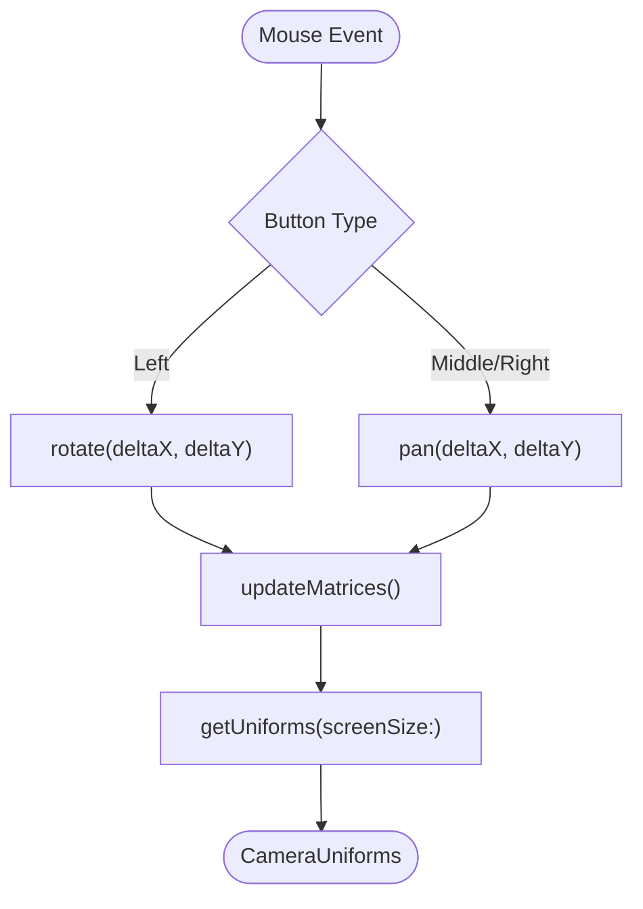
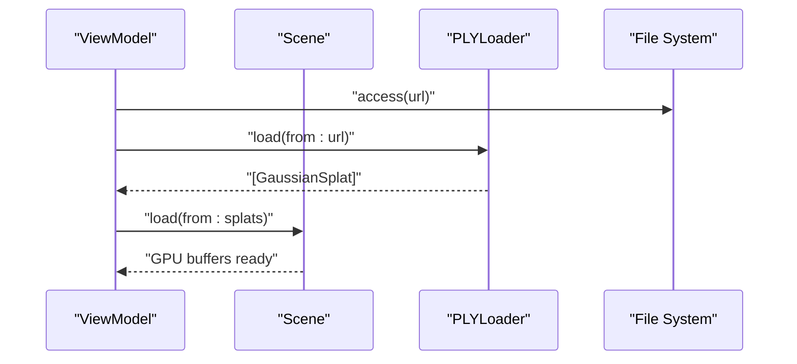
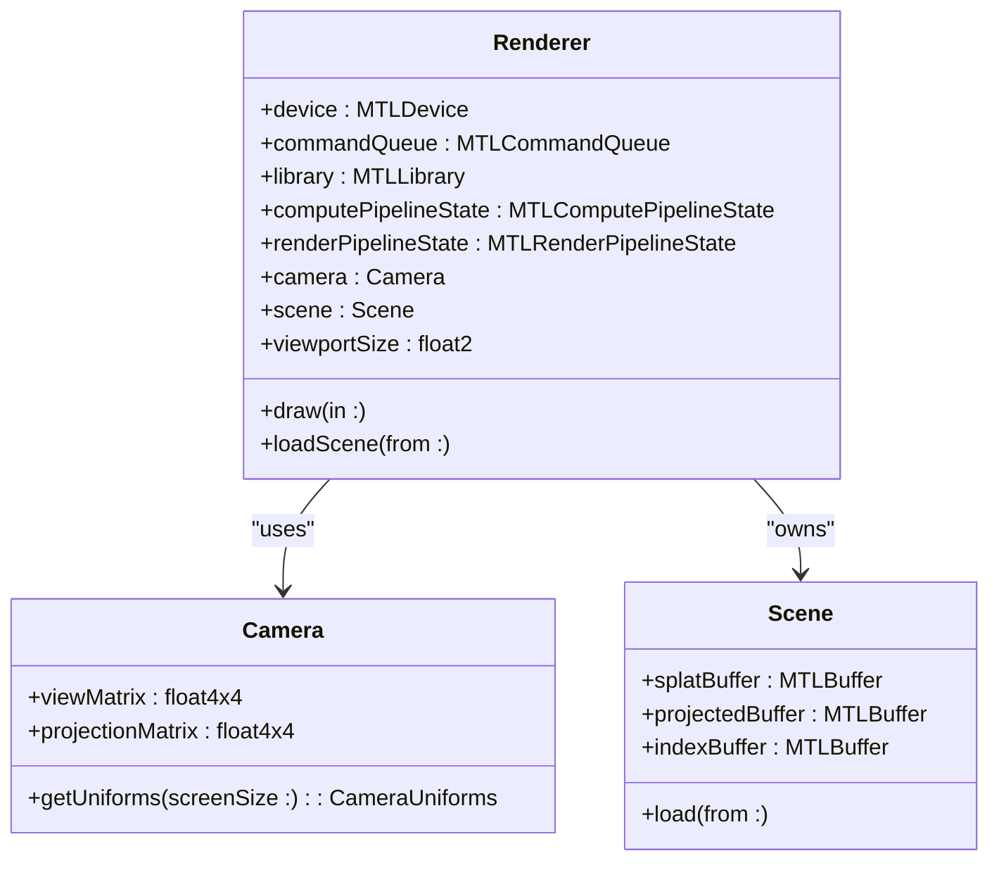
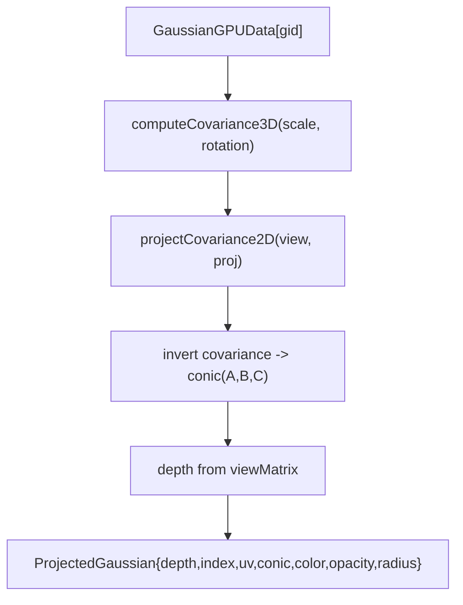
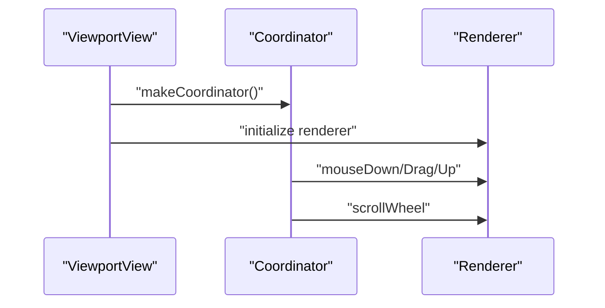
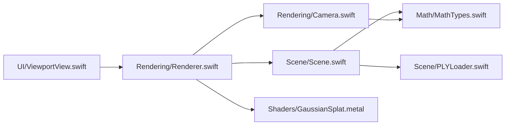

# Development Guide

<cite>
**Referenced Files in This Document**
- [GaussianSplatViewerApp.swift](file://GaussianSplatViewer/GaussianSplatViewerApp.swift)
- [ContentView.swift](file://GaussianSplatViewer/ContentView.swift)
- [MathTypes.swift](file://Math/MathTypes.swift)
- [Camera.swift](file://Rendering/Camera.swift)
- [Renderer.swift](file://Rendering/Renderer.swift)
- [Scene.swift](file://Scene/Scene.swift)
- [PLYLoader.swift](file://Scene/PLYLoader.swift)
- [GaussianSplat.metal](file://Shaders/GaussianSplat.metal)
- [ViewportView.swift](file://UI/ViewportView.swift)
- [GaussianSplatViewerTests.swift](file://GaussianSplatViewerTests/GaussianSplatViewerTests.swift)
- [GaussianSplatViewerUITests.swift](file://GaussianSplatViewerUITests/GaussianSplatViewerUITests.swift)
- [GaussianSplatViewerUITestsLaunchTests.swift](file://GaussianSplatViewerUITests/GaussianSplatViewerUITestsLaunchTests.swift)
- [xcschememanagement.plist](file://GaussianSplatViewer.xcodeproj/xcuserdata/rajveersahay.xcuserdatad/xcschemes/xcschememanagement.plist)
</cite>

## Table of Contents
1. [Introduction](#introduction)
2. [Project Structure](#project-structure)
3. [Core Components](#core-components)
4. [Architecture Overview](#architecture-overview)
5. [Detailed Component Analysis](#detailed-component-analysis)
6. [Dependency Analysis](#dependency-analysis)
7. [Performance Considerations](#performance-considerations)
8. [Testing Strategies](#testing-strategies)
9. [Contribution Guidelines](#contribution-guidelines)
10. [Troubleshooting Guide](#troubleshooting-guide)
11. [Conclusion](#conclusion)
12. [Appendices](#appendices)

## Introduction
This development guide explains how to contribute to and extend the Gaussian Splat Viewer. It covers build and development workflows, Xcode project setup, dependency management, debugging techniques, code organization, architectural patterns, and extension guidelines for loaders, shaders, and camera controls. It also documents testing strategies for GPU code, mathematical accuracy, and performance benchmarking, along with contribution and best practices.

## Project Structure
The project follows a modular structure separating math utilities, rendering pipeline, scene management, UI integration, and Metal shaders. SwiftUI drives the UI, MetalKit renders via Metal, and Metal computes projections on the GPU.



**Diagram sources**
- [GaussianSplatViewerApp.swift:10-17](file://GaussianSplatViewer/GaussianSplatViewerApp.swift#L10-L17)
- [ContentView.swift:10-20](file://GaussianSplatViewer/ContentView.swift#L10-L20)
- [ViewportView.swift:6-36](file://UI/ViewportView.swift#L6-L36)
- [Renderer.swift:7-77](file://Rendering/Renderer.swift#L7-L77)
- [Camera.swift:5-60](file://Rendering/Camera.swift#L5-L60)
- [Scene.swift:6-28](file://Scene/Scene.swift#L6-L28)
- [PLYLoader.swift:13-68](file://Scene/PLYLoader.swift#L13-L68)
- [MathTypes.swift:5-62](file://Math/MathTypes.swift#L5-L62)
- [GaussianSplat.metal:6-42](file://Shaders/GaussianSplat.metal#L6-L42)

**Section sources**
- [GaussianSplatViewerApp.swift:10-17](file://GaussianSplatViewer/GaussianSplatViewerApp.swift#L10-L17)
- [ContentView.swift:10-20](file://GaussianSplatViewer/ContentView.swift#L10-L20)
- [ViewportView.swift:6-36](file://UI/ViewportView.swift#L6-L36)
- [Renderer.swift:7-77](file://Rendering/Renderer.swift#L7-L77)
- [Camera.swift:5-60](file://Rendering/Camera.swift#L5-L60)
- [Scene.swift:6-28](file://Scene/Scene.swift#L6-L28)
- [PLYLoader.swift:13-68](file://Scene/PLYLoader.swift#L13-L68)
- [MathTypes.swift:5-62](file://Math/MathTypes.swift#L5-L62)
- [GaussianSplat.metal:6-42](file://Shaders/GaussianSplat.metal#L6-L42)

## Core Components
- Application bootstrap and SwiftUI views define the app entry point and a placeholder UI surface.
- Renderer manages Metal device initialization, pipeline creation, compute and render passes, and camera uniform updates.
- Camera encapsulates orbit navigation, sensitivity, and matrix computation.
- Scene holds CPU and GPU data for splats and exposes bounding statistics.
- PLYLoader parses ASCII and binary PLY files, mapping fields to Gaussian splats.
- MathTypes defines vector/matrix types, GPU-compatible structures, and math helpers.
- GaussianSplat.metal implements compute and fragment shaders for projection and rasterization.

Key responsibilities and interactions are covered in later sections.

**Section sources**
- [GaussianSplatViewerApp.swift:10-17](file://GaussianSplatViewer/GaussianSplatViewerApp.swift#L10-L17)
- [ContentView.swift:10-20](file://GaussianSplatViewer/ContentView.swift#L10-L20)
- [Renderer.swift:7-77](file://Rendering/Renderer.swift#L7-L77)
- [Camera.swift:5-60](file://Rendering/Camera.swift#L5-L60)
- [Scene.swift:6-28](file://Scene/Scene.swift#L6-L28)
- [PLYLoader.swift:13-68](file://Scene/PLYLoader.swift#L13-L68)
- [MathTypes.swift:5-62](file://Math/MathTypes.swift#L5-L62)
- [GaussianSplat.metal:6-42](file://Shaders/GaussianSplat.metal#L6-L42)

## Architecture Overview
The rendering pipeline is split into:
- Compute pass: Project Gaussians to screen-space using a Metal compute kernel.
- Optional sorting pass: Depth-sorting is planned and partially wired.
- Render pass: Draw instanced quads per Gaussian using vertex and fragment shaders with alpha blending.



**Diagram sources**
- [Renderer.swift:166-250](file://Rendering/Renderer.swift#L166-L250)
- [Camera.swift:134-147](file://Rendering/Camera.swift#L134-L147)
- [GaussianSplat.metal:138-201](file://Shaders/GaussianSplat.metal#L138-L201)
- [GaussianSplat.metal:205-241](file://Shaders/GaussianSplat.metal#L205-L241)
- [GaussianSplat.metal:245-270](file://Shaders/GaussianSplat.metal#L245-L270)

## Detailed Component Analysis

### Math and Data Types
- Type aliases simplify vector/matrix usage.
- GaussianGPUData mirrors CPU-side splat data for GPU transfer.
- CameraUniforms carries matrices and screen info to shaders.
- Quaternion and matrix helpers support covariance computation and transforms.

```mermaid
classDiagram
class GaussianSplat {
+float3 position
+float3 scale
+float4 rotation
+float3 color
+Float opacity
}
class GaussianGPUData {
+float3 position
+float3 scale
+float4 rotation
+float3 color
+Float opacity
}
class CameraUniforms {
+float4x4 viewMatrix
+float4x4 projectionMatrix
+float4x4 viewProjectionMatrix
+float3 cameraPosition
+float2 screenSize
+float2 tanHalfFov
}
GaussianGPUData --> GaussianSplat : "init(from : )"
```

**Diagram sources**
- [MathTypes.swift:12-51](file://Math/MathTypes.swift#L12-L51)
- [MathTypes.swift:54-62](file://Math/MathTypes.swift#L54-L62)

**Section sources**
- [MathTypes.swift:5-62](file://Math/MathTypes.swift#L5-L62)
- [MathTypes.swift:76-101](file://Math/MathTypes.swift#L76-L101)
- [MathTypes.swift:104-167](file://Math/MathTypes.swift#L104-L167)
- [MathTypes.swift:170-188](file://Math/MathTypes.swift#L170-L188)

### Camera Controls
- Orbit camera with spherical coordinates, look-at view matrix, and perspective projection.
- Mouse/touch handlers translate to rotate, pan, and zoom actions.
- Uniforms exported for GPU consumption.



**Diagram sources**
- [Camera.swift:86-115](file://Rendering/Camera.swift#L86-L115)
- [Camera.swift:134-147](file://Rendering/Camera.swift#L134-L147)
- [Camera.swift:150-176](file://Rendering/Camera.swift#L150-L176)

**Section sources**
- [Camera.swift:5-60](file://Rendering/Camera.swift#L5-L60)
- [Camera.swift:134-147](file://Rendering/Camera.swift#L134-L147)
- [Camera.swift:150-176](file://Rendering/Camera.swift#L150-L176)

### Scene Management and Loader
- Scene loads PLY data, constructs GPU buffers, and maintains splat metadata.
- PLYLoader supports ASCII and binary little/big endian, mapping standard fields to splats.



**Diagram sources**
- [Scene.swift:31-55](file://Scene/Scene.swift#L31-L55)
- [PLYLoader.swift:42-68](file://Scene/PLYLoader.swift#L42-L68)
- [ViewportView.swift:151-183](file://UI/ViewportView.swift#L151-L183)

**Section sources**
- [Scene.swift:31-95](file://Scene/Scene.swift#L31-L95)
- [PLYLoader.swift:42-68](file://Scene/PLYLoader.swift#L42-L68)
- [PLYLoader.swift:162-204](file://Scene/PLYLoader.swift#L162-L204)
- [PLYLoader.swift:208-317](file://Scene/PLYLoader.swift#L208-L317)
- [PLYLoader.swift:321-385](file://Scene/PLYLoader.swift#L321-L385)

### Renderer and Metal Pipeline
- Initializes Metal device, command queue, and loads Metal library from bundle.
- Creates compute and render pipelines, sets up triple-buffered camera uniforms, and draws instanced quads.
- Handles drawable size changes and depth stencil state.



**Diagram sources**
- [Renderer.swift:7-77](file://Rendering/Renderer.swift#L7-L77)
- [Renderer.swift:166-250](file://Rendering/Renderer.swift#L166-L250)
- [Camera.swift:134-147](file://Rendering/Camera.swift#L134-L147)
- [Scene.swift:12-24](file://Scene/Scene.swift#L12-L24)

**Section sources**
- [Renderer.swift:38-77](file://Rendering/Renderer.swift#L38-L77)
- [Renderer.swift:81-127](file://Rendering/Renderer.swift#L81-L127)
- [Renderer.swift:129-143](file://Rendering/Renderer.swift#L129-L143)
- [Renderer.swift:166-250](file://Rendering/Renderer.swift#L166-L250)
- [Renderer.swift:261-266](file://Rendering/Renderer.swift#L261-L266)

### Shaders
- Compute shader projects each Gaussian to screen space, computing covariance, conic, radius, and depth.
- Vertex shader expands projected data into screen-space quads.
- Fragment shader evaluates 2D Gaussian with alpha compositing and discards invisible fragments.



**Diagram sources**
- [GaussianSplat.metal:138-201](file://Shaders/GaussianSplat.metal#L138-L201)
- [GaussianSplat.metal:205-241](file://Shaders/GaussianSplat.metal#L205-L241)
- [GaussianSplat.metal:245-270](file://Shaders/GaussianSplat.metal#L245-L270)

**Section sources**
- [GaussianSplat.metal:64-74](file://Shaders/GaussianSplat.metal#L64-L74)
- [GaussianSplat.metal:77-134](file://Shaders/GaussianSplat.metal#L77-L134)
- [GaussianSplat.metal:138-201](file://Shaders/GaussianSplat.metal#L138-L201)
- [GaussianSplat.metal:205-241](file://Shaders/GaussianSplat.metal#L205-L241)
- [GaussianSplat.metal:245-270](file://Shaders/GaussianSplat.metal#L245-L270)

### UI Integration
- SwiftUI View wraps a MetalKit view and wires input events to the renderer.
- ViewModel coordinates asynchronous loading and publishes stats.



**Diagram sources**
- [ViewportView.swift:6-36](file://UI/ViewportView.swift#L6-L36)
- [ViewportView.swift:38-89](file://UI/ViewportView.swift#L38-L89)
- [ViewportView.swift:142-184](file://UI/ViewportView.swift#L142-L184)

**Section sources**
- [ViewportView.swift:6-36](file://UI/ViewportView.swift#L6-L36)
- [ViewportView.swift:38-89](file://UI/ViewportView.swift#L38-L89)
- [ViewportView.swift:142-184](file://UI/ViewportView.swift#L142-L184)

## Dependency Analysis
- Renderer depends on Camera and Scene; Scene depends on PLYLoader and MathTypes.
- Shaders depend on shared structures defined in MathTypes and Metal headers.
- UI depends on Renderer via ViewModel and MTKView.



**Diagram sources**
- [ViewportView.swift:6-36](file://UI/ViewportView.swift#L6-L36)
- [Renderer.swift:7-77](file://Rendering/Renderer.swift#L7-L77)
- [Scene.swift:6-28](file://Scene/Scene.swift#L6-L28)
- [PLYLoader.swift:13-68](file://Scene/PLYLoader.swift#L13-L68)
- [GaussianSplat.metal:6-42](file://Shaders/GaussianSplat.metal#L6-L42)
- [MathTypes.swift:5-62](file://Math/MathTypes.swift#L5-L62)
- [Camera.swift:5-60](file://Rendering/Camera.swift#L5-L60)

**Section sources**
- [Renderer.swift:7-77](file://Rendering/Renderer.swift#L7-L77)
- [Scene.swift:6-28](file://Scene/Scene.swift#L6-L28)
- [PLYLoader.swift:13-68](file://Scene/PLYLoader.swift#L13-L68)
- [GaussianSplat.metal:6-42](file://Shaders/GaussianSplat.metal#L6-L42)
- [MathTypes.swift:5-62](file://Math/MathTypes.swift#L5-L62)
- [Camera.swift:5-60](file://Rendering/Camera.swift#L5-L60)

## Performance Considerations
- Triple-buffered camera uniforms reduce CPU/GPU synchronization stalls.
- Compute dispatch tuned to 256-workgroup size for efficient GPU utilization.
- Alpha blending enabled for correct splat compositing.
- Depth sorting is currently disabled; enable and tune the sorting pass for correctness and performance.
- Prefer GPU-side operations (projection, covariance) to minimize CPU overhead.
- Keep shader logic branch-free where possible; early discard reduces fragment work.

[No sources needed since this section provides general guidance]

## Testing Strategies
- Unit tests: Use Swift Testing framework to assert math correctness and loader parsing.
- UI tests: Validate app launch and basic interactions.
- GPU tests: Use Xcode GPU Frame Capture to inspect compute dispatches and render targets.
- Mathematical verification: Compare covariance computations against known transforms and numerical limits.
- Performance benchmarking: Measure frame times and splat counts; profile compute vs. render costs.

**Section sources**
- [GaussianSplatViewerTests.swift:10-18](file://GaussianSplatViewerTests/GaussianSplatViewerTests.swift#L10-L18)
- [GaussianSplatViewerUITests.swift:25-42](file://GaussianSplatViewerUITests/GaussianSplatViewerUITests.swift#L25-L42)
- [GaussianSplatViewerUITestsLaunchTests.swift:21-34](file://GaussianSplatViewerUITests/GaussianSplatViewerUITestsLaunchTests.swift#L21-L34)

## Contribution Guidelines
- Follow existing naming conventions: PascalCase for types/classes, camelCase for properties/functions, and descriptive suffixes like “GPU” for GPU-related structures.
- Keep responsibilities cohesive: math in MathTypes, rendering in Renderer, scene data in Scene, loader in PLYLoader, UI glue in ViewportView.
- Add unit tests for new math and loader logic; add UI tests for new interactions.
- Document public APIs and shader interfaces with clear comments.
- Use Metal best practices: align buffers, minimize state changes, and leverage instancing.

[No sources needed since this section provides general guidance]

## Troubleshooting Guide
Common issues and remedies:
- No splats rendered: Verify loader parsed fields and opacity threshold; confirm compute shader ran and splat count is non-zero.
- Garbage or black screen: Check depth stencil state and blending configuration; ensure camera uniforms are uploaded.
- Poor performance: Confirm compute dispatch sizing and triple-buffering; disable depth sort until optimized.
- Build failures: Ensure Metal library loads from bundle and shader functions match pipeline descriptors.

**Section sources**
- [Renderer.swift:166-250](file://Rendering/Renderer.swift#L166-L250)
- [Renderer.swift:261-266](file://Rendering/Renderer.swift#L261-L266)
- [GaussianSplat.metal:138-201](file://Shaders/GaussianSplat.metal#L138-L201)

## Conclusion
This guide outlined the project’s modular architecture, GPU pipeline, and development workflow. By following the extension guidelines for loaders, shaders, and camera controls, and applying the testing and performance strategies, contributors can safely add features and maintain quality.

[No sources needed since this section summarizes without analyzing specific files]

## Appendices

### A. Build and Development Workflow
- Open the Xcode project and select the scheme defined in the shared scheme state.
- Build and run on macOS; Metal requires a compatible GPU.
- Use Xcode’s Scheme editor to configure Run/Debug settings if needed.

**Section sources**
- [xcschememanagement.plist:7-11](file://GaussianSplatViewer.xcodeproj/xcuserdata/rajveersahay.xcuserdatad/xcschemes/xcschememanagement.plist#L7-L11)

### B. Extending the PLY Loader
- Add new property mappings in the loader’s parsing logic.
- Ensure defaults and normalization match expectations (e.g., scale exponentiation, SH to RGB conversion).
- Add unit tests validating new fields and error conditions.

**Section sources**
- [PLYLoader.swift:321-385](file://Scene/PLYLoader.swift#L321-L385)

### C. Implementing Custom Shaders
- Define structures mirroring MathTypes in Metal headers.
- Implement compute and vertex/fragment stages; reuse conic and covariance logic.
- Wire uniforms and buffers in Renderer; ensure stride alignment and triple buffering.

**Section sources**
- [GaussianSplat.metal:6-42](file://Shaders/GaussianSplat.metal#L6-L42)
- [Renderer.swift:129-143](file://Rendering/Renderer.swift#L129-L143)
- [Renderer.swift:166-250](file://Rendering/Renderer.swift#L166-L250)

### D. Adding New Camera Controls
- Extend Camera with new modes (e.g., first-person) and sensitivity tuning.
- Update input handling in ViewportView to route new gestures.
- Expose new parameters via uniforms and update shaders if needed.

**Section sources**
- [Camera.swift:5-60](file://Rendering/Camera.swift#L5-L60)
- [ViewportView.swift:38-89](file://UI/ViewportView.swift#L38-L89)

### E. Debugging Tools and Techniques
- Use Xcode GPU Frame Capture to inspect compute dispatches and render targets.
- Validate shader inputs with breakpoint debugging in Metal shaders.
- Profile CPU/GPU overlap using Instruments and adjust triple-buffering and dispatch sizes accordingly.

[No sources needed since this section provides general guidance]