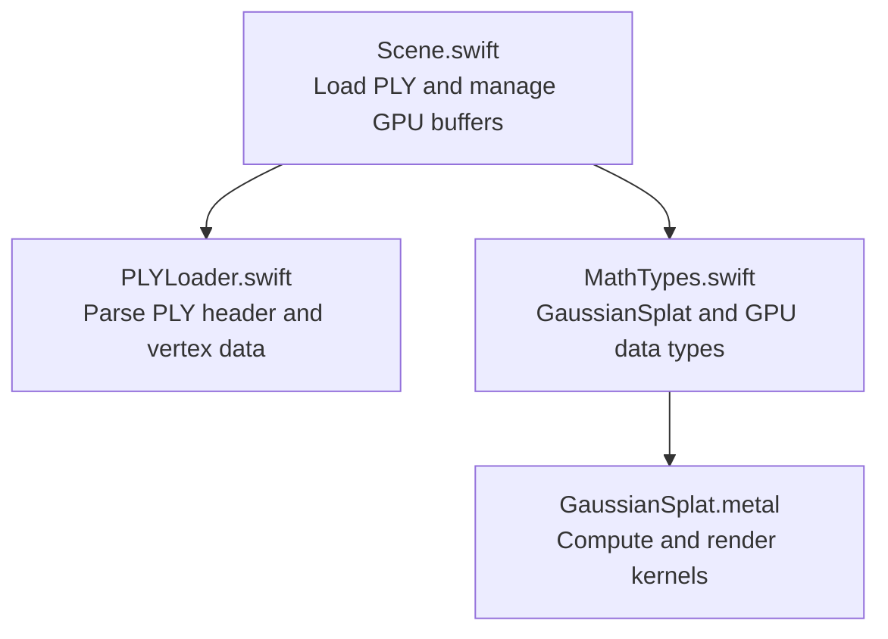
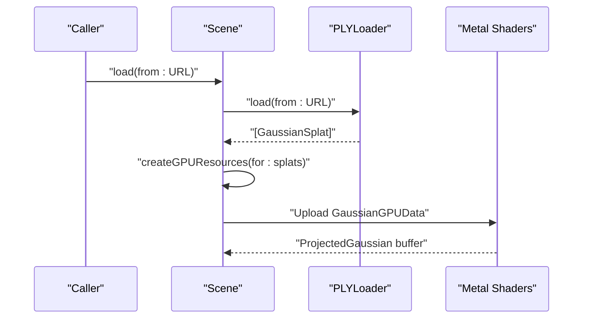
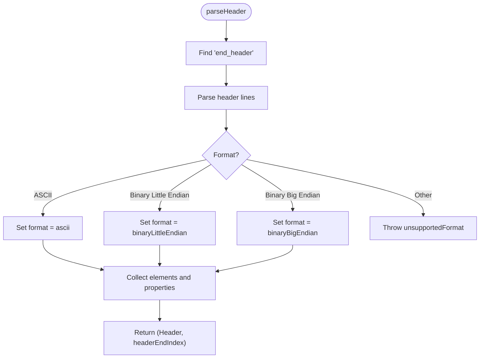
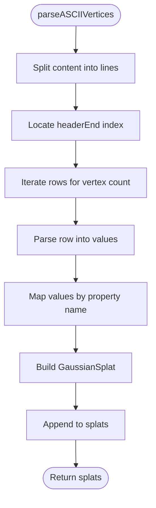
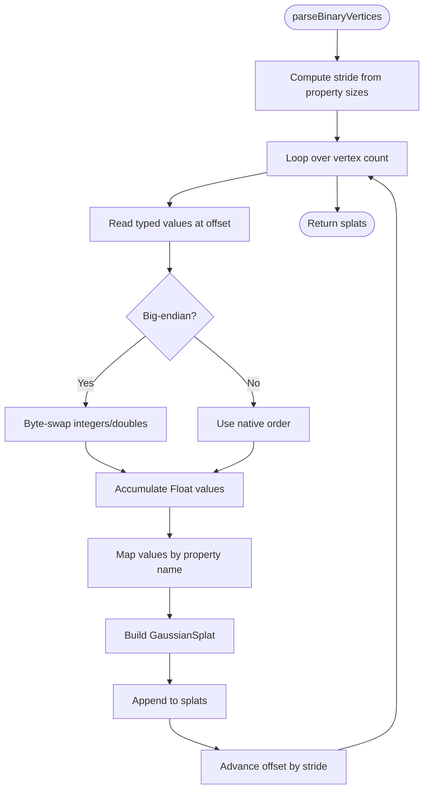
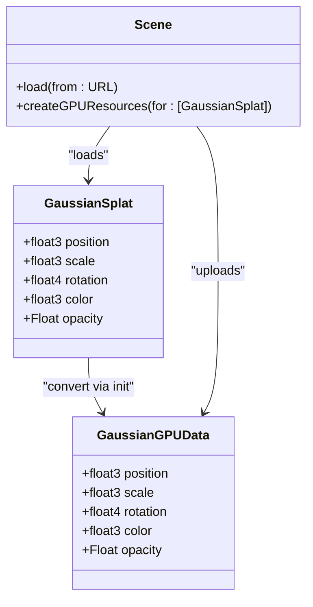
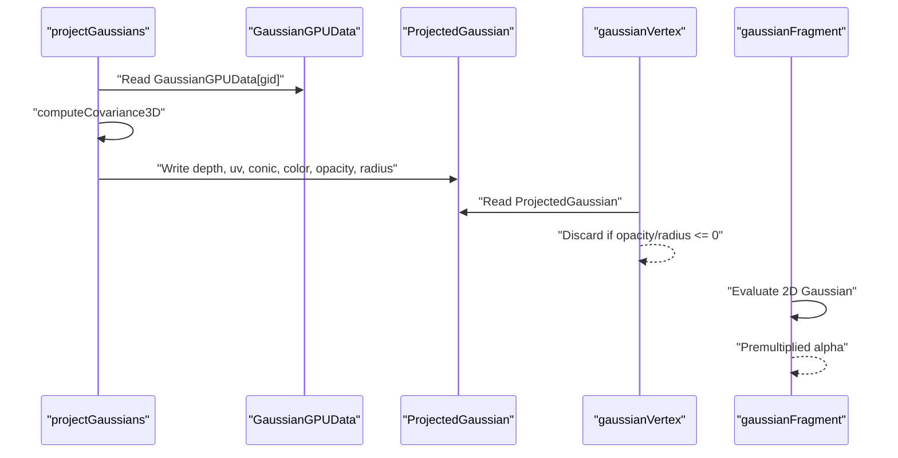
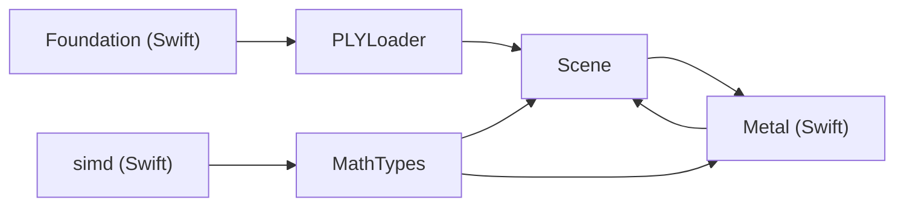

# File Format Support

<cite>
**Referenced Files in This Document**
- [PLYLoader.swift](file://Scene/PLYLoader.swift)
- [Scene.swift](file://Scene/Scene.swift)
- [MathTypes.swift](file://Math/MathTypes.swift)
- [GaussianSplat.metal](file://Shaders/GaussianSplat.metal)
- [GaussianSplatViewerTests.swift](file://GaussianSplatViewerTests/GaussianSplatViewerTests.swift)
</cite>

## Table of Contents
1. [Introduction](#introduction)
2. [Project Structure](#project-structure)
3. [Core Components](#core-components)
4. [Architecture Overview](#architecture-overview)
5. [Detailed Component Analysis](#detailed-component-analysis)
6. [Dependency Analysis](#dependency-analysis)
7. [Performance Considerations](#performance-considerations)
8. [Troubleshooting Guide](#troubleshooting-guide)
9. [Conclusion](#conclusion)
10. [Appendices](#appendices)

## Introduction
This document explains how Gaussian Splat Viewer loads and interprets PLY (Polygon File Format) files for rendering 3D Gaussian splats. It covers the PLY specification as parsed by the loader, supported property types, endianness handling, parsing algorithms, memory management, and conversion to internal data structures. It also provides guidance for preparing PLY files from various sources and troubleshooting common issues.

## Project Structure
PLY loading is implemented in a dedicated loader class and integrated into the scene management layer. Supporting math types define the internal representation of Gaussian splats and GPU-compatible structures. Metal shaders consume the GPU data for rendering.

**Diagram sources**
- [PLYLoader.swift:41-68](file://Scene/PLYLoader.swift#L41-L68)
- [Scene.swift:30-55](file://Scene/Scene.swift#L30-L55)
- [MathTypes.swift:11-51](file://Math/MathTypes.swift#L11-L51)
- [GaussianSplat.metal:138-201](file://Shaders/GaussianSplat.metal#L138-L201)

**Section sources**
- [PLYLoader.swift:1-403](file://Scene/PLYLoader.swift#L1-L403)
- [Scene.swift:1-140](file://Scene/Scene.swift#L1-L140)
- [MathTypes.swift:1-189](file://Math/MathTypes.swift#L1-L189)
- [GaussianSplat.metal:1-308](file://Shaders/GaussianSplat.metal#L1-L308)

## Core Components
- PLYLoader: Parses PLY headers, validates format, and extracts vertex data in ASCII or binary modes with endianness awareness. Converts parsed values into GaussianSplat instances.
- Scene: Orchestrates loading, prints timing, and creates GPU buffers for rendering.
- MathTypes: Defines GaussianSplat and GPU-compatible structures used by the renderer.
- GaussianSplat.metal: Implements projection and rendering of Gaussian splats on GPU.

**Section sources**
- [PLYLoader.swift:12-68](file://Scene/PLYLoader.swift#L12-L68)
- [Scene.swift:30-95](file://Scene/Scene.swift#L30-L95)
- [MathTypes.swift:11-51](file://Math/MathTypes.swift#L11-L51)
- [GaussianSplat.metal:138-201](file://Shaders/GaussianSplat.metal#L138-L201)

## Architecture Overview
The loader reads the PLY header to determine format and element definitions, then parses vertex data according to the declared properties. The Scene layer coordinates loading and GPU resource creation. The GPU consumes GaussianGPUData to project and render splats.

**Diagram sources**
- [Scene.swift:30-55](file://Scene/Scene.swift#L30-L55)
- [PLYLoader.swift:41-68](file://Scene/PLYLoader.swift#L41-L68)
- [MathTypes.swift:34-51](file://Math/MathTypes.swift#L34-L51)
- [GaussianSplat.metal:138-201](file://Shaders/GaussianSplat.metal#L138-L201)

## Detailed Component Analysis

### PLYLoader: PLY Header and Vertex Parsing
- Header parsing:
  - Validates magic line and end of header marker.
  - Supports ASCII and binary little/big endian formats.
  - Collects elements and their properties; list properties are skipped.
- ASCII parsing:
  - Iterates lines after header, converts values to floats, and maps by property name.
- Binary parsing:
  - Computes stride from property sizes, iterates vertices, and reads typed values.
  - Handles endianness conversions for integer and floating-point types.
- Vertex parsing:
  - Requires position (x, y, z).
  - Optional: scale_0, scale_1, scale_2 (exponential defaults), rotation quaternions rot_1..rot_0 (normalized), color via SH DC f_dc_0..2 or direct RGB red/green/blue (0–255), opacity via sigmoid.

**Diagram sources**
- [PLYLoader.swift:72-158](file://Scene/PLYLoader.swift#L72-L158)

**Diagram sources**
- [PLYLoader.swift:162-204](file://Scene/PLYLoader.swift#L162-L204)

**Diagram sources**
- [PLYLoader.swift:208-317](file://Scene/PLYLoader.swift#L208-L317)

**Section sources**
- [PLYLoader.swift:72-158](file://Scene/PLYLoader.swift#L72-L158)
- [PLYLoader.swift:162-204](file://Scene/PLYLoader.swift#L162-L204)
- [PLYLoader.swift:208-317](file://Scene/PLYLoader.swift#L208-L317)
- [PLYLoader.swift:321-385](file://Scene/PLYLoader.swift#L321-L385)

### Supported Property Types and Conversions
- Position: x, y, z (required)
- Scale: scale_0, scale_1, scale_2 (optional; default small exponential if missing)
- Rotation: rot_1, rot_2, rot_3, rot_0 (optional; normalized quaternion)
- Color:
  - SH DC: f_dc_0, f_dc_1, f_dc_2 (converted via sigmoid)
  - Or direct RGB: red, green, blue (0–255 range)
- Opacity: opacity (optional; sigmoid if present)
- Data types handled:
  - Integer types: char/int8, uchar/uint8, short/int16, ushort/uint16, int/int32, uint/uint32
  - Floating types: float, double
  - Endianness: binary modes handle little and big endian

**Section sources**
- [PLYLoader.swift:321-385](file://Scene/PLYLoader.swift#L321-L385)
- [PLYLoader.swift:389-397](file://Scene/PLYLoader.swift#L389-L397)
- [PLYLoader.swift:233-298](file://Scene/PLYLoader.swift#L233-L298)

### Internal Data Structures and GPU Conversion
- GaussianSplat: CPU-side representation with position, scale, rotation, color, opacity.
- GaussianGPUData: GPU-compatible structure aligned for Metal buffers, including padding fields.
- Scene creates:
  - Shared buffer for GaussianGPUData
  - Private buffers for projected data and indices
- Rendering pipeline uses GaussianGPUData to compute 2D projections and draw splats.

**Diagram sources**
- [MathTypes.swift:11-51](file://Math/MathTypes.swift#L11-L51)
- [Scene.swift:57-95](file://Scene/Scene.swift#L57-L95)

**Section sources**
- [MathTypes.swift:11-51](file://Math/MathTypes.swift#L11-L51)
- [Scene.swift:57-95](file://Scene/Scene.swift#L57-L95)

### Rendering Pipeline and Projection
- Compute kernel projects each Gaussian to 2D, computing covariance, conic, radius, and depth.
- Vertex and fragment shaders evaluate 2D Gaussians and blend premultiplied alpha.

**Diagram sources**
- [GaussianSplat.metal:138-201](file://Shaders/GaussianSplat.metal#L138-L201)
- [GaussianSplat.metal:205-270](file://Shaders/GaussianSplat.metal#L205-L270)

**Section sources**
- [GaussianSplat.metal:138-201](file://Shaders/GaussianSplat.metal#L138-L201)
- [GaussianSplat.metal:205-270](file://Shaders/GaussianSplat.metal#L205-L270)

## Dependency Analysis
- PLYLoader depends on Foundation for Data/String parsing and math types for vector/quaternion operations.
- Scene depends on PLYLoader for data ingestion and Metal for GPU buffers.
- MathTypes defines shared types used across CPU and GPU.
- GaussianSplat.metal consumes GPU data structures and camera uniforms.

**Diagram sources**
- [PLYLoader.swift:1](file://Scene/PLYLoader.swift#L1)
- [MathTypes.swift:1](file://Math/MathTypes.swift#L1)
- [Scene.swift:1](file://Scene/Scene.swift#L1)
- [GaussianSplat.metal:1](file://Shaders/GaussianSplat.metal#L1)

**Section sources**
- [PLYLoader.swift:1](file://Scene/PLYLoader.swift#L1)
- [MathTypes.swift:1](file://Math/MathTypes.swift#L1)
- [Scene.swift:1](file://Scene/Scene.swift#L1)
- [GaussianSplat.metal:1](file://Shaders/GaussianSplat.metal#L1)

## Performance Considerations
- Parsing:
  - ASCII parsing uses line-based scanning; reserve capacity for splats to minimize reallocations.
  - Binary parsing computes stride and reads fixed-size chunks; endianness swaps are O(1) per field.
- Memory:
  - Scene allocates a shared buffer for GaussianGPUData and private buffers for projected data and indices.
  - GPU buffer sizes depend on splat count and struct strides.
- Rendering:
  - ProjectGaussians runs per splat; consider sorting by depth to reduce overdraw.
  - Fragment evaluation uses 2D Gaussian with conic; ensure reasonable radii to limit pixel coverage.

[No sources needed since this section provides general guidance]

## Troubleshooting Guide
Common issues and remedies:
- Missing required properties:
  - Missing vertex element or position fields cause errors. Ensure the PLY contains a vertex element with x, y, z.
- Unsupported or invalid header:
  - Malformed magic line or unknown format triggers errors. Verify the header begins with the correct magic and declares a supported format.
- Endianness mismatch:
  - Binary files from big-endian systems require the big-endian mode; otherwise values are misinterpreted.
- Unexpected property types:
  - Non-float numeric types are converted to Float; ensure numeric values are valid.
- Color and opacity:
  - If SH DC is absent, fallback to direct RGB; if opacity is absent, default to fully opaque.

**Section sources**
- [PLYLoader.swift:4-10](file://Scene/PLYLoader.swift#L4-L10)
- [PLYLoader.swift:53-55](file://Scene/PLYLoader.swift#L53-L55)
- [PLYLoader.swift:329-333](file://Scene/PLYLoader.swift#L329-L333)

## Conclusion
PLYLoader provides robust ASCII and binary PLY parsing with endianness handling and flexible property mapping. The Scene layer integrates loading and GPU resource creation, while MathTypes and Metal shaders define the runtime representation and rendering pipeline. Following the property specifications and preparation guidelines below ensures reliable loading and rendering of Gaussian splats.

[No sources needed since this section summarizes without analyzing specific files]

## Appendices

### PLY File Format Specification for Gaussian Splats
- Header:
  - Magic line indicating PLY.
  - Format declaration: ascii, binary_little_endian, or binary_big_endian.
  - Elements: typically a vertex element with a count and properties.
  - Properties: primitive types (char, uchar, short, ushort, int, uint, float, double) and list properties (skipped by the loader).
- Vertex element:
  - Required: x, y, z.
  - Optional: scale_0, scale_1, scale_2; rot_1, rot_2, rot_3, rot_0; f_dc_0..2 or red, green, blue; opacity.

**Section sources**
- [PLYLoader.swift:72-158](file://Scene/PLYLoader.swift#L72-L158)
- [PLYLoader.swift:321-385](file://Scene/PLYLoader.swift#L321-L385)

### Preparing PLY Files from Various Sources
- Ensure the vertex element includes required position fields (x, y, z).
- Provide optional scale and rotation parameters for shape and orientation.
- Supply either SH DC coefficients (f_dc_0..2) or direct RGB channels (red, green, blue).
- Optionally include opacity values.
- Choose ASCII for portability or binary for performance; if binary, select the correct endianness.

[No sources needed since this section provides general guidance]

### Example Workflows
- Loading from URL:
  - Scene.load(from: URL) invokes PLYLoader.load(from: URL) and then creates GPU buffers.
- Loading from raw data:
  - Scene.load(from: Data) performs the same steps from in-memory data.

**Section sources**
- [Scene.swift:30-55](file://Scene/Scene.swift#L30-L55)
- [PLYLoader.swift:41-68](file://Scene/PLYLoader.swift#L41-L68)

### Test Coverage
- Current test suite does not include PLY-specific tests; consider adding tests for:
  - Valid ASCII and binary PLY inputs
  - Endianness handling
  - Missing vs. optional properties
  - Error conditions (invalid header, unsupported format)

**Section sources**
- [GaussianSplatViewerTests.swift:10-18](file://GaussianSplatViewerTests/GaussianSplatViewerTests.swift#L10-L18)