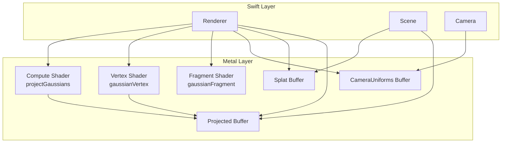
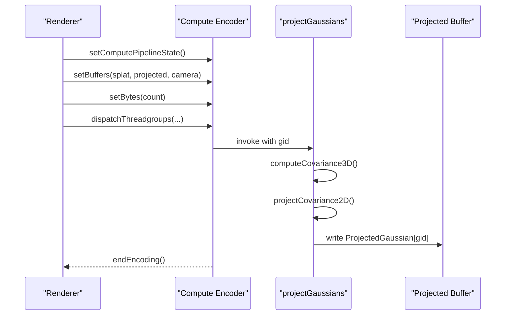
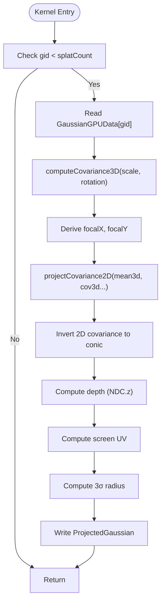
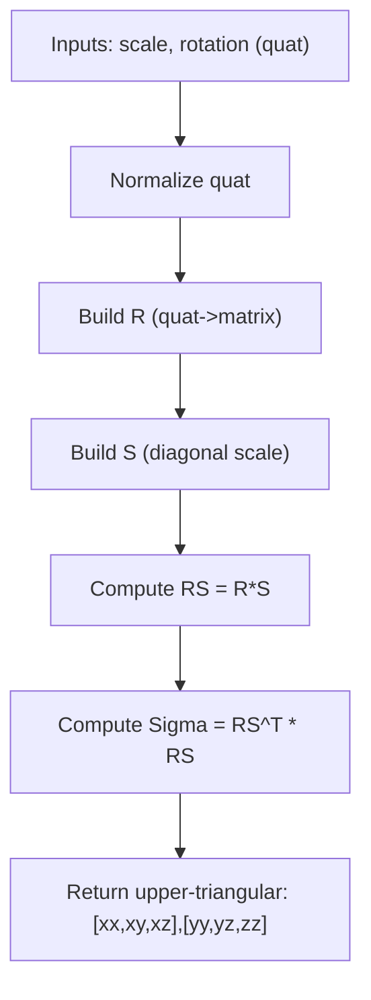
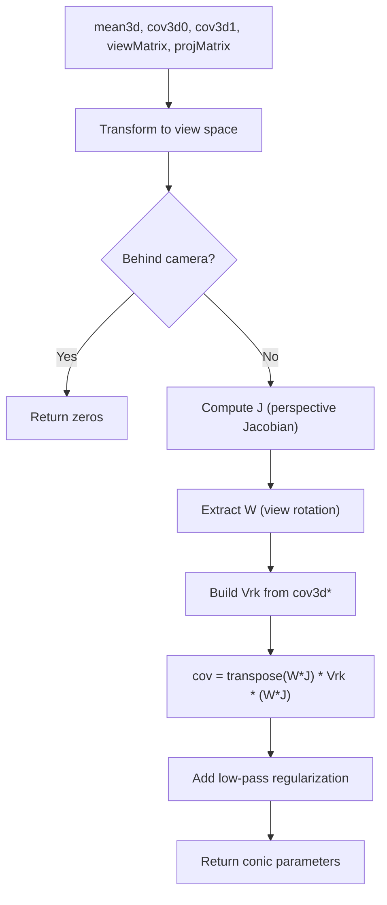
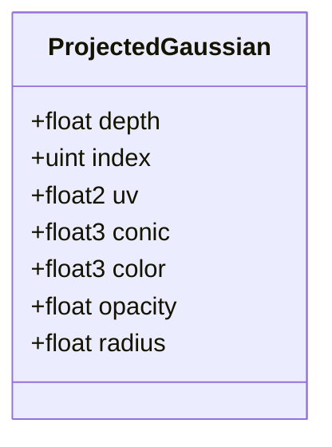
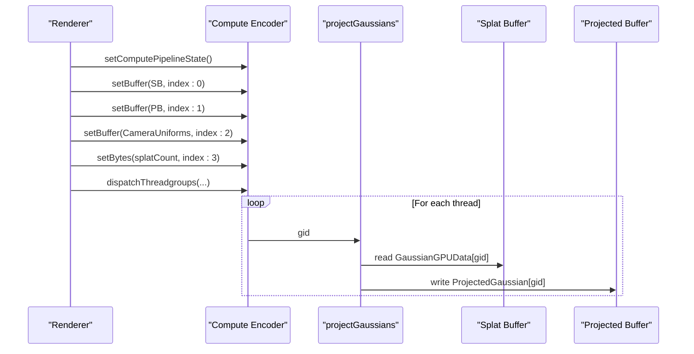
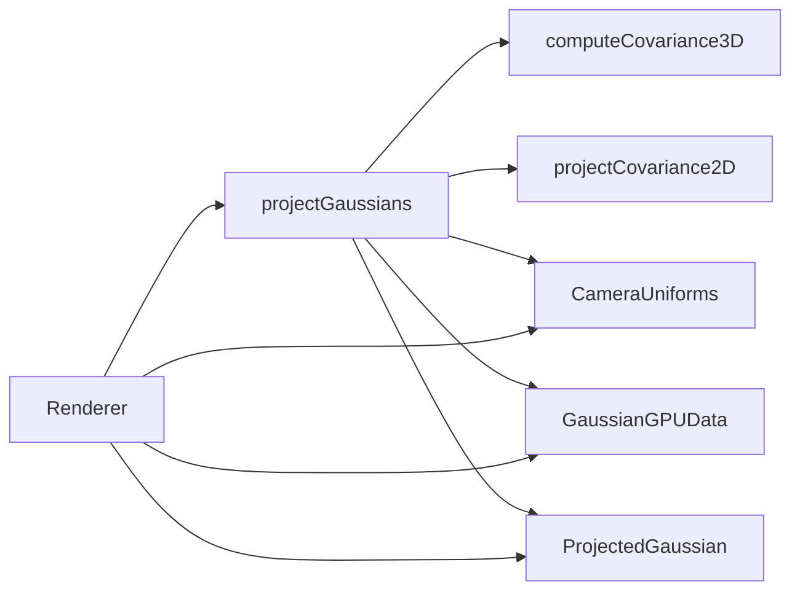

# Compute Shader Stage

<cite>
**Referenced Files in This Document**
- [GaussianSplat.metal](file://Shaders/GaussianSplat.metal)
- [MathTypes.swift](file://Math/MathTypes.swift)
- [Renderer.swift](file://Rendering/Renderer.swift)
- [Scene.swift](file://Scene/Scene.swift)
- [Camera.swift](file://Rendering/Camera.swift)
- [PLYLoader.swift](file://Scene/PLYLoader.swift)
</cite>

## Table of Contents
1. [Introduction](#introduction)
2. [Project Structure](#project-structure)
3. [Core Components](#core-components)
4. [Architecture Overview](#architecture-overview)
5. [Detailed Component Analysis](#detailed-component-analysis)
6. [Dependency Analysis](#dependency-analysis)
7. [Performance Considerations](#performance-considerations)
8. [Troubleshooting Guide](#troubleshooting-guide)
9. [Conclusion](#conclusion)

## Introduction
This document explains the compute shader stage that projects 3D Gaussian splats to screen space. It focuses on the projectGaussians kernel, covariance computation from scale and rotation, 2D covariance projection using perspective jacobians and view matrices, compute pipeline execution, thread indexing, GPU memory access patterns, and the output data structure ProjectedGaussian. It also covers performance considerations and GPU resource utilization.

## Project Structure
The compute shader stage is implemented in a single Metal shader file and integrates with Swift code that manages GPU buffers, pipelines, and camera uniforms. The key components are:
- Compute shader: projectGaussians kernel and supporting math utilities
- Output structure: ProjectedGaussian for per-splat data after projection
- Swift integration: Renderer sets up pipelines and dispatches compute
- Scene data: CPU-side Gaussian splats mapped to GPU-compatible structures
- Camera: provides view/projection matrices and screen-space parameters

**Diagram sources**
- [Renderer.swift:166-250](file://Rendering/Renderer.swift#L166-L250)
- [GaussianSplat.metal:138-201](file://Shaders/GaussianSplat.metal#L138-L201)
- [GaussianSplat.metal:205-241](file://Shaders/GaussianSplat.metal#L205-L241)
- [GaussianSplat.metal:245-270](file://Shaders/GaussianSplat.metal#L245-L270)

**Section sources**
- [Renderer.swift:166-250](file://Rendering/Renderer.swift#L166-L250)
- [GaussianSplat.metal:138-201](file://Shaders/GaussianSplat.metal#L138-L201)

## Core Components
- projectGaussians kernel: transforms each Gaussian’s 3D position and covariance to screen space, computes conic parameters, and writes ProjectedGaussian entries.
- computeCovariance3D: builds 3D covariance from scale and rotation (quaternion-to-matrix conversion).
- projectCovariance2D: projects 3D covariance into 2D using perspective projection jacobians and view matrices.
- ProjectedGaussian: output structure containing depth, index, UV coordinates, conic parameters, color, opacity, and radius.
- CameraUniforms: GPU-visible camera parameters including matrices and screen/tan-half-FOV.

**Section sources**
- [GaussianSplat.metal:138-201](file://Shaders/GaussianSplat.metal#L138-L201)
- [GaussianSplat.metal:64-74](file://Shaders/GaussianSplat.metal#L64-L74)
- [GaussianSplat.metal:76-134](file://Shaders/GaussianSplat.metal#L76-L134)
- [GaussianSplat.metal:26-34](file://Shaders/GaussianSplat.metal#L26-L34)
- [GaussianSplat.metal:16-24](file://Shaders/GaussianSplat.metal#L16-L24)

## Architecture Overview
The compute stage runs once per Gaussian splat. It:
- Reads GaussianGPUData from the splat buffer
- Computes 3D covariance from scale and rotation
- Projects 3D covariance to 2D using perspective jacobians and view matrices
- Builds conic parameters (inverse covariance)
- Computes depth and screen-space UV coordinates
- Writes ProjectedGaussian to the projected buffer

**Diagram sources**
- [Renderer.swift:187-211](file://Rendering/Renderer.swift#L187-L211)
- [GaussianSplat.metal:138-201](file://Shaders/GaussianSplat.metal#L138-L201)

## Detailed Component Analysis

### projectGaussians Kernel
The kernel performs per-splat projection:
- Validates thread index against splat count
- Reads GaussianGPUData at gid
- Computes 3D covariance via computeCovariance3D
- Derives focal lengths from projection matrix and screen size
- Projects 3D covariance to 2D using projectCovariance2D
- Inverts 2D covariance to form conic parameters
- Computes view-space position for depth and clip/NDC/screen-space positions
- Computes radius as 3-sigma extents
- Writes ProjectedGaussian with depth, index, UV, conic, color, opacity, radius

**Diagram sources**
- [GaussianSplat.metal:138-201](file://Shaders/GaussianSplat.metal#L138-L201)

**Section sources**
- [GaussianSplat.metal:138-201](file://Shaders/GaussianSplat.metal#L138-L201)

### Covariance Computation from Scale and Rotation
- computeCovariance3D constructs a rotation matrix from the quaternion and a diagonal scale matrix, then forms Sigma = (R*S)^T * (R*S) = S^T * R^T * R * S = S^2 (since R is orthogonal).
- The function returns upper-triangular elements row-major for efficient storage: [xx, xy, xz], [yy, yz, zz].

**Diagram sources**
- [GaussianSplat.metal:64-74](file://Shaders/GaussianSplat.metal#L64-L74)
- [MathTypes.swift:170-187](file://Math/MathTypes.swift#L170-L187)

**Section sources**
- [GaussianSplat.metal:64-74](file://Shaders/GaussianSplat.metal#L64-L74)
- [MathTypes.swift:170-187](file://Math/MathTypes.swift#L170-L187)

### 2D Covariance Projection Using Perspective Jacobians and View Matrices
- Transforms 3D mean to view space; early-exits if behind camera.
- Applies perspective projection limits and computes the Jacobian J of perspective projection.
- Extracts view rotation W from the view matrix.
- Builds 3D covariance matrix Vrk from upper-triangular elements.
- Computes 2D covariance as cov = transpose(W*J) * Vrk * (W*J).
- Adds low-pass regularization to diagonal elements.
- Returns conic parameters (upper-triangular of inverse covariance).

**Diagram sources**
- [GaussianSplat.metal:76-134](file://Shaders/GaussianSplat.metal#L76-L134)

**Section sources**
- [GaussianSplat.metal:76-134](file://Shaders/GaussianSplat.metal#L76-L134)

### Output Data Structure: ProjectedGaussian
ProjectedGaussian holds per-splat data for rendering:
- depth: depth value used for sorting
- index: original splat index for reordering
- uv: screen-space coordinates
- conic: 2D covariance inverse parameters (A, B, C)
- color: RGB color
- opacity: pre-multiplied alpha contribution
- radius: 3-sigma radius for rasterization

**Diagram sources**
- [GaussianSplat.metal:26-34](file://Shaders/GaussianSplat.metal#L26-L34)

**Section sources**
- [GaussianSplat.metal:26-34](file://Shaders/GaussianSplat.metal#L26-L34)

### Compute Pipeline Execution Model, Thread Indexing, and GPU Memory Access Patterns
- Dispatch configuration: 256-wide thread groups; grid size computed from splatCount.
- Thread indexing: gid equals thread_position_in_grid; kernel validates gid < splatCount.
- Memory access:
  - Read: splat buffer (GaussianGPUData) at gid
  - Write: projected buffer (ProjectedGaussian) at gid
  - Uniforms: CameraUniforms buffer (tripled-buffered per frame)
- GPU buffers:
  - Splat buffer: shared storage for uploaded CPU data
  - Projected buffer: private storage for compute output
  - Index buffer: placeholder for future sorting indices

**Diagram sources**
- [Renderer.swift:187-211](file://Rendering/Renderer.swift#L187-L211)
- [GaussianSplat.metal:138-201](file://Shaders/GaussianSplat.metal#L138-L201)

**Section sources**
- [Renderer.swift:187-211](file://Rendering/Renderer.swift#L187-L211)
- [Scene.swift:57-95](file://Scene/Scene.swift#L57-L95)

### Camera Uniforms and Screen-Space Parameters
- CameraUniforms includes viewMatrix, projectionMatrix, viewProjectionMatrix, cameraPosition, screenSize, and tanHalfFov.
- Focal lengths are derived from projectionMatrix and screenSize.
- tanHalfFov is computed from FOV and aspect ratio.

**Section sources**
- [GaussianSplat.metal:16-24](file://Shaders/GaussianSplat.metal#L16-L24)
- [GaussianSplat.metal:154-155](file://Shaders/GaussianSplat.metal#L154-L155)
- [Camera.swift:133-147](file://Rendering/Camera.swift#L133-L147)

### GPU Data Structures and Swift Integration
- GaussianGPUData mirrors CPU-side GaussianSplat for GPU transfer.
- ProjectedGaussian is the compute output structure consumed by the vertex shader.
- Scene creates GPU buffers for splats and projections; Renderer binds them to the compute encoder.

**Section sources**
- [MathTypes.swift:34-51](file://Math/MathTypes.swift#L34-L51)
- [MathTypes.swift:64-73](file://Math/MathTypes.swift#L64-L73)
- [Scene.swift:57-95](file://Scene/Scene.swift#L57-L95)
- [Renderer.swift:187-211](file://Rendering/Renderer.swift#L187-L211)

## Dependency Analysis
- projectGaussians depends on:
  - computeCovariance3D and projectCovariance2D for geometric computations
  - CameraUniforms for view/projection and screen parameters
  - GaussianGPUData input and ProjectedGaussian output
- Renderer orchestrates:
  - Compute pipeline creation and dispatch
  - Buffer binding and uniform updates
  - Render pipeline for final drawing

**Diagram sources**
- [GaussianSplat.metal:138-201](file://Shaders/GaussianSplat.metal#L138-L201)
- [GaussianSplat.metal:64-74](file://Shaders/GaussianSplat.metal#L64-L74)
- [GaussianSplat.metal:76-134](file://Shaders/GaussianSplat.metal#L76-L134)
- [Renderer.swift:187-211](file://Rendering/Renderer.swift#L187-L211)

**Section sources**
- [GaussianSplat.metal:138-201](file://Shaders/GaussianSplat.metal#L138-L201)
- [Renderer.swift:187-211](file://Rendering/Renderer.swift#L187-L211)

## Performance Considerations
- Workgroup sizing: 256 threads per group balance occupancy and scheduling overhead.
- Memory coalescing: Each thread reads/writes contiguous elements, good for bandwidth.
- Branch divergence: Early exit for behind-camera Gaussians reduces unnecessary work.
- Deterministic output: Writing directly to gid avoids atomics and reduces contention.
- Uniform updates: Triple-buffering prevents CPU/GPU synchronization stalls.
- Sorting: Depth sorting is currently a placeholder; consider implementing a proper GPU sort (e.g., bitonic sort) for correctness and performance.
- Precision: Using float3x3 and float4x4 ensures efficient SIMD operations on GPU.

[No sources needed since this section provides general guidance]

## Troubleshooting Guide
- Kernel does not run:
  - Verify compute pipeline creation succeeds and function name matches.
  - Ensure splatCount is set and not zero.
- Incorrect projection or visibility:
  - Check CameraUniforms values (matrices, screenSize, tanHalfFov).
  - Confirm view/projection matrices are updated per frame.
- Garbage output:
  - Validate GaussianGPUData layout and alignment.
  - Ensure splat buffer is populated before compute dispatch.
- Sorting not applied:
  - Depth sorting is disabled in the current implementation; enable and implement bitonic sort kernel usage.
- Performance issues:
  - Reduce splat count or increase thread group size if beneficial for your GPU.
  - Minimize redundant uniform updates.

**Section sources**
- [Renderer.swift:81-93](file://Rendering/Renderer.swift#L81-L93)
- [Renderer.swift:197-208](file://Rendering/Renderer.swift#L197-L208)
- [Renderer.swift:213-217](file://Rendering/Renderer.swift#L213-L217)

## Conclusion
The compute shader stage efficiently projects 3D Gaussian splats to screen space by combining robust covariance mathematics with Metal compute dispatch. The projectGaussians kernel produces ProjectedGaussian entries that drive subsequent vertex and fragment stages. Proper buffer management, camera uniform updates, and thread indexing ensure high throughput. Future enhancements include enabling depth sorting and optimizing memory access patterns for very large scenes.