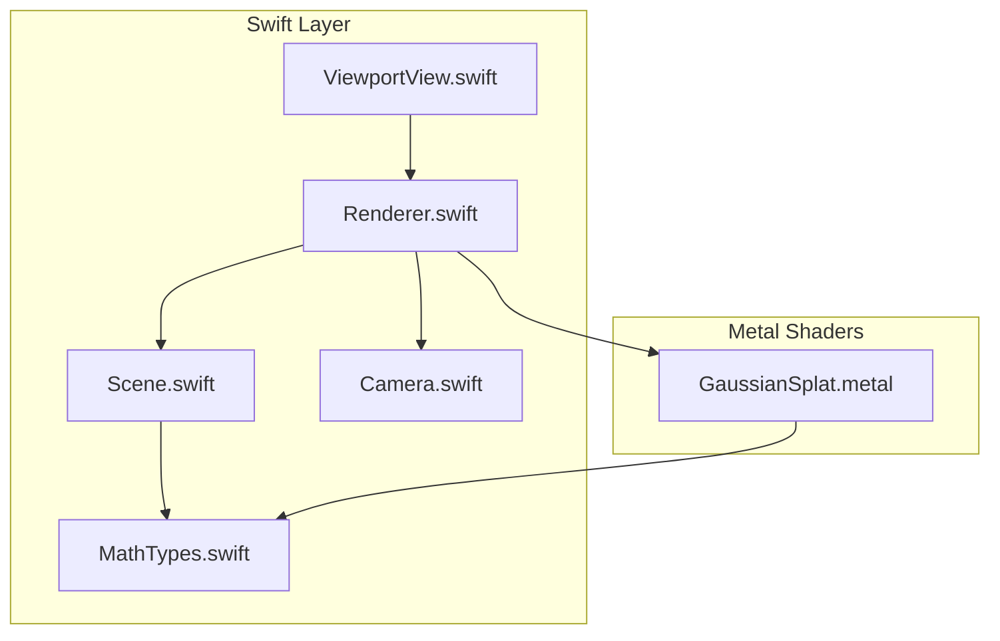
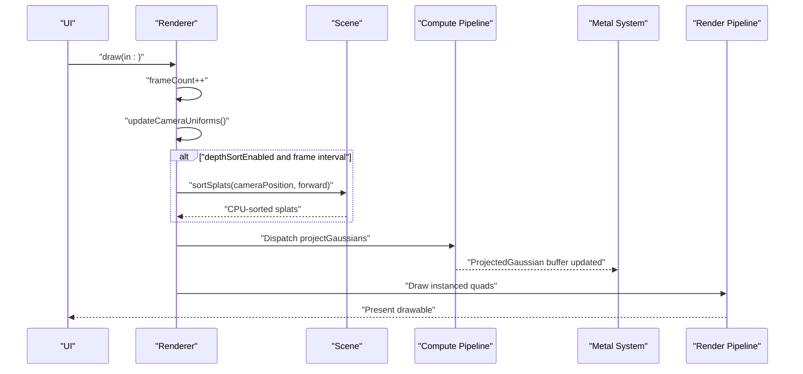
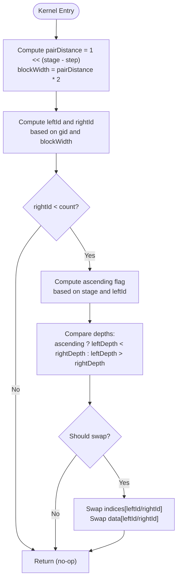
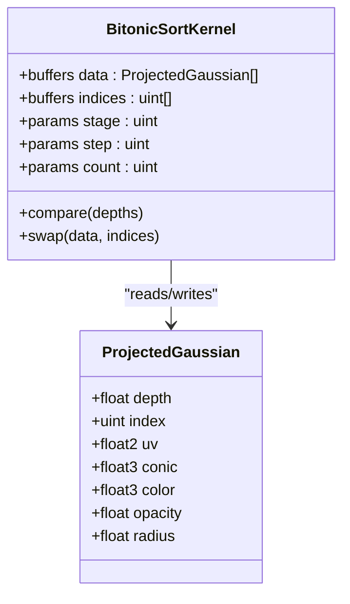
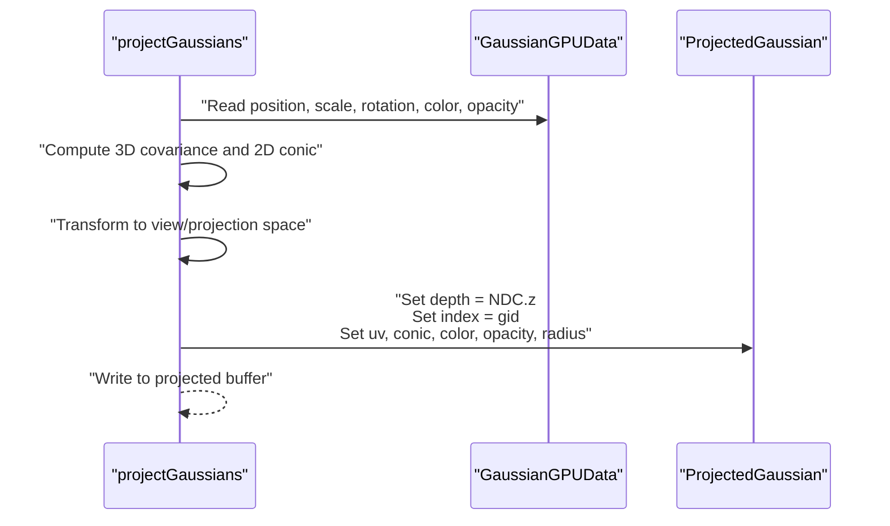
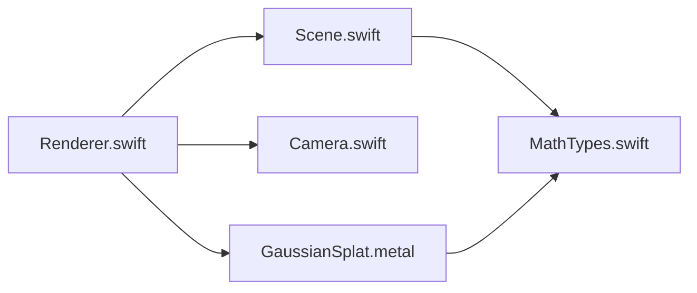

# Depth Sorting Algorithms

<cite>
**Referenced Files in This Document**
- [GaussianSplat.metal](file://Shaders/GaussianSplat.metal)
- [Renderer.swift](file://Rendering/Renderer.swift)
- [Scene.swift](file://Scene/Scene.swift)
- [MathTypes.swift](file://Math/MathTypes.swift)
- [Camera.swift](file://Rendering/Camera.swift)
- [PLYLoader.swift](file://Scene/PLYLoader.swift)
- [ViewportView.swift](file://UI/ViewportView.swift)
</cite>

## Table of Contents
1. [Introduction](#introduction)
2. [Project Structure](#project-structure)
3. [Core Components](#core-components)
4. [Architecture Overview](#architecture-overview)
5. [Detailed Component Analysis](#detailed-component-analysis)
6. [Dependency Analysis](#dependency-analysis)
7. [Performance Considerations](#performance-considerations)
8. [Troubleshooting Guide](#troubleshooting-guide)
9. [Conclusion](#conclusion)

## Introduction
This document explains the depth sorting implementation used to render Gaussian splats with correct transparency. It focuses on the bitonic sort compute kernel that sorts projected Gaussians by depth for efficient GPU-based rendering. The document covers the sorting stages, block width calculations, thread synchronization patterns, sorting criteria, index buffer management, performance characteristics, and optimization strategies.

## Project Structure
The depth sorting pipeline spans several modules:
- Metal shaders define the compute kernel and GPU data structures.
- Swift code manages scene data, GPU buffers, and the rendering loop.
- Math types define GPU-compatible structures and helpers.
- UI integrates the renderer into a Metal viewport.

**Diagram sources**
- [Renderer.swift:1-289](file://Rendering/Renderer.swift#L1-L289)
- [Scene.swift:1-158](file://Scene/Scene.swift#L1-L158)
- [Camera.swift:1-184](file://Rendering/Camera.swift#L1-L184)
- [MathTypes.swift:1-189](file://Math/MathTypes.swift#L1-L189)
- [GaussianSplat.metal:1-317](file://Shaders/GaussianSplat.metal#L1-L317)
- [ViewportView.swift:1-185](file://UI/ViewportView.swift#L1-L185)

**Section sources**
- [Renderer.swift:1-289](file://Rendering/Renderer.swift#L1-L289)
- [Scene.swift:1-158](file://Scene/Scene.swift#L1-L158)
- [GaussianSplat.metal:1-317](file://Shaders/GaussianSplat.metal#L1-L317)
- [MathTypes.swift:1-189](file://Math/MathTypes.swift#L1-L189)
- [Camera.swift:1-184](file://Rendering/Camera.swift#L1-L184)
- [ViewportView.swift:1-185](file://UI/ViewportView.swift#L1-L185)

## Core Components
- Projected Gaussian data structure carries depth and index for sorting.
- The compute shader projects Gaussians and prepares per-instance data.
- The bitonic sort compute kernel performs stage-based comparisons and swaps both data and index arrays.
- The renderer orchestrates sorting, projection, and rendering passes.

Key data structures and roles:
- ProjectedGaussian: holds depth, index, UV, conic, color, opacity, radius.
- bitonicSort: compares pairs across stages and swaps both data and indices.

**Section sources**
- [GaussianSplat.metal:26-34](file://Shaders/GaussianSplat.metal#L26-L34)
- [GaussianSplat.metal:282-316](file://Shaders/GaussianSplat.metal#L282-L316)
- [MathTypes.swift:65-73](file://Math/MathTypes.swift#L65-L73)

## Architecture Overview
The depth sorting pipeline runs every N frames and consists of:
- Sorting pass: bitonic sort stages compare and swap pairs based on depth.
- Projection pass: compute shader projects Gaussians and writes ProjectedGaussian entries.
- Rendering pass: instanced draw renders splats back-to-front for correct blending.

**Diagram sources**
- [Renderer.swift:167-251](file://Rendering/Renderer.swift#L167-L251)
- [Scene.swift:105-121](file://Scene/Scene.swift#L105-L121)
- [GaussianSplat.metal:146-209](file://Shaders/GaussianSplat.metal#L146-L209)

## Detailed Component Analysis

### Bitonic Sort Compute Kernel
The bitonic sort kernel performs stage-based comparisons and swaps both data and indices to maintain relationships between ProjectedGaussian entries and original indices.

- Stage and step parameters define the current comparison phase and distance between paired elements.
- Block width determines the stride for pairing within a block.
- Indices are swapped alongside data to preserve original ordering for downstream use.

**Diagram sources**
- [GaussianSplat.metal:282-316](file://Shaders/GaussianSplat.metal#L282-L316)

**Section sources**
- [GaussianSplat.metal:282-316](file://Shaders/GaussianSplat.metal#L282-L316)

### Sorting Criteria and Index Buffer Management
- Sorting criterion: ProjectedGaussian.depth in ProjectedGaussian structure.
- Index buffer: uint indices array is swapped in lockstep with data to track original indices.
- After sorting, rendering uses the ProjectedGaussian entries for instanced drawing.

**Diagram sources**
- [GaussianSplat.metal:26-34](file://Shaders/GaussianSplat.metal#L26-L34)
- [GaussianSplat.metal:282-316](file://Shaders/GaussianSplat.metal#L282-L316)

**Section sources**
- [GaussianSplat.metal:26-34](file://Shaders/GaussianSplat.metal#L26-L34)
- [GaussianSplat.metal:282-316](file://Shaders/GaussianSplat.metal#L282-L316)

### Thread Synchronization Patterns
- The bitonic sort kernel is designed as a single-stage compute dispatch per iteration, with no explicit synchronization between stages in the provided code.
- The renderer invokes sorting periodically and then immediately proceeds to projection, relying on Metal’s implicit ordering within a command buffer.

**Section sources**
- [Renderer.swift:187-191](file://Rendering/Renderer.swift#L187-L191)
- [GaussianSplat.metal:282-316](file://Shaders/GaussianSplat.metal#L282-L316)

### Projection Pass and Depth Computation
- The compute shader computes ProjectedGaussian entries with depth set to the normalized device coordinate z.
- Indices are initialized to the original Gaussian index for later sorting.

**Diagram sources**
- [GaussianSplat.metal:146-209](file://Shaders/GaussianSplat.metal#L146-L209)

**Section sources**
- [GaussianSplat.metal:146-209](file://Shaders/GaussianSplat.metal#L146-L209)

### Rendering Pass and Transparency
- Instanced rendering draws quads for each projected Gaussian.
- Back-to-front order ensures correct alpha blending.
- Depth testing is configured to always pass for correct compositing.

**Section sources**
- [Renderer.swift:220-242](file://Rendering/Renderer.swift#L220-L242)

## Dependency Analysis
- Renderer depends on Scene for splat data and buffers, and on Camera for uniforms.
- Scene creates GPU buffers and updates the splat buffer after CPU-side sorting.
- Shader defines ProjectedGaussian and bitonicSort kernel consumed by Renderer.

**Diagram sources**
- [Renderer.swift:1-289](file://Rendering/Renderer.swift#L1-L289)
- [Scene.swift:1-158](file://Scene/Scene.swift#L1-L158)
- [GaussianSplat.metal:1-317](file://Shaders/GaussianSplat.metal#L1-L317)
- [MathTypes.swift:1-189](file://Math/MathTypes.swift#L1-L189)

**Section sources**
- [Renderer.swift:1-289](file://Rendering/Renderer.swift#L1-L289)
- [Scene.swift:1-158](file://Scene/Scene.swift#L1-L158)
- [GaussianSplat.metal:1-317](file://Shaders/GaussianSplat.metal#L1-L317)
- [MathTypes.swift:1-189](file://Math/MathTypes.swift#L1-L189)

## Performance Considerations
- Sorting cadence: The renderer sorts every N frames to balance correctness and cost.
- Compute dispatch sizing: The projection compute uses fixed thread group size; sorting stages should align with data size and occupancy.
- Memory bandwidth:
  - ProjectedGaussian is small and compact; sorting swaps both data and indices efficiently.
  - Using indices avoids moving heavy per-splat payloads during comparisons.
- GPU compute unit utilization:
  - Bitonic sort is highly parallel; ensure sufficient data to keep SMs busy.
  - Consider coalesced access patterns for indices and data arrays.
- Alternative approaches:
  - For small datasets, a simpler comparison-based sort or radix sort may reduce overhead.
  - For large datasets, consider segmented sorting or hierarchical approaches to reduce contention.

[No sources needed since this section provides general guidance]

## Troubleshooting Guide
- Incorrect depth ordering:
  - Verify ProjectedGaussian.depth is set to NDC.z in the compute shader.
  - Confirm sorting is enabled and invoked at the intended frame interval.
- Garbage or flickering output:
  - Ensure indices are swapped alongside data in the bitonic sort kernel.
  - Check that the render pass uses the correct buffers and that depth testing is configured appropriately.
- Poor performance:
  - Increase sort interval to reduce compute overhead.
  - Ensure thread group sizes match hardware warp sizes and data counts.

**Section sources**
- [GaussianSplat.metal:200-208](file://Shaders/GaussianSplat.metal#L200-L208)
- [GaussianSplat.metal:282-316](file://Shaders/GaussianSplat.metal#L282-L316)
- [Renderer.swift:187-191](file://Rendering/Renderer.swift#L187-L191)
- [Renderer.swift:220-242](file://Rendering/Renderer.swift#L220-L242)

## Conclusion
The depth sorting implementation leverages a bitonic sort compute kernel to efficiently sort projected Gaussians by depth, enabling correct transparency rendering. The design maintains index relationships through parallel swaps, minimizes memory bandwidth, and integrates cleanly into the renderer’s frame pipeline. For optimal performance, tune the sorting cadence and consider alternative sorting strategies for varying dataset sizes.