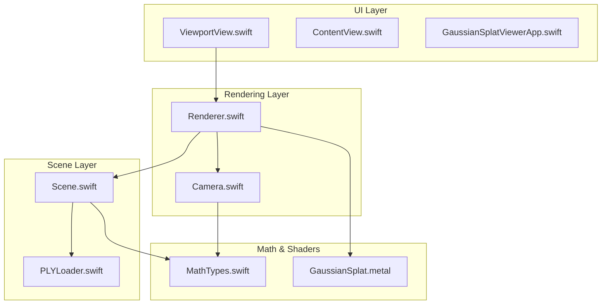
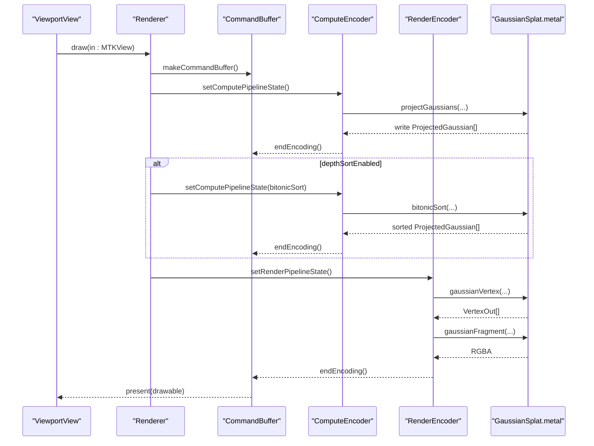
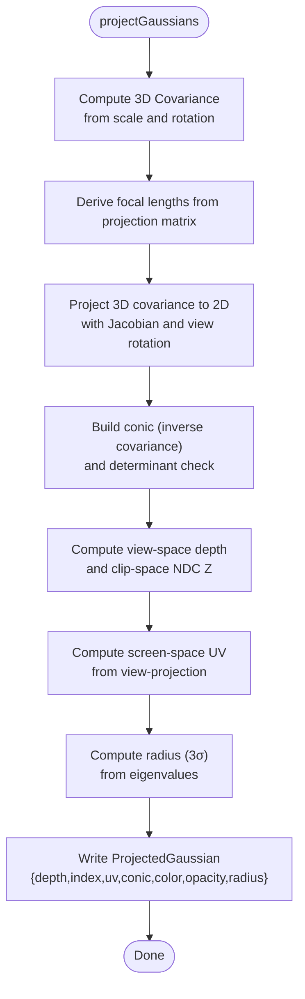
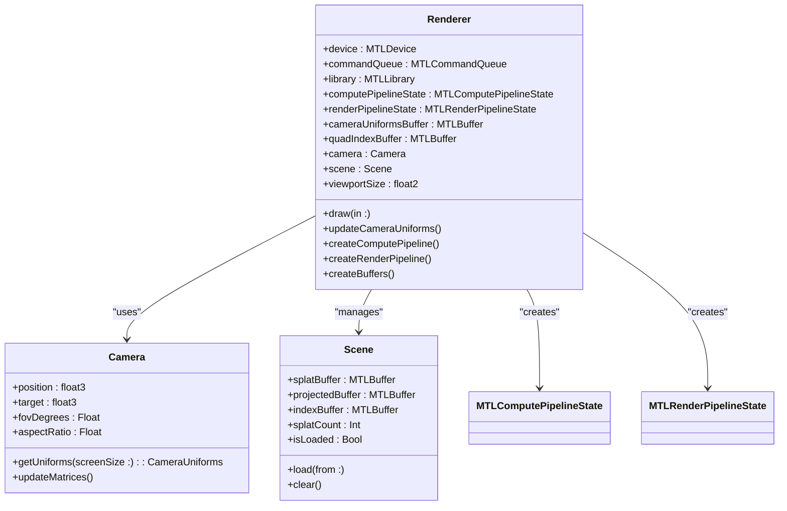
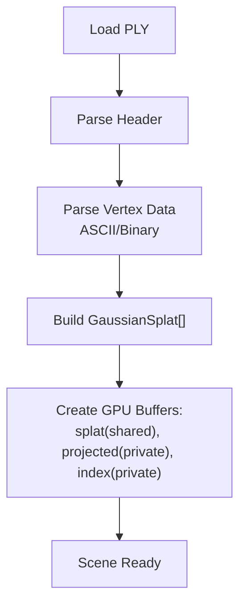
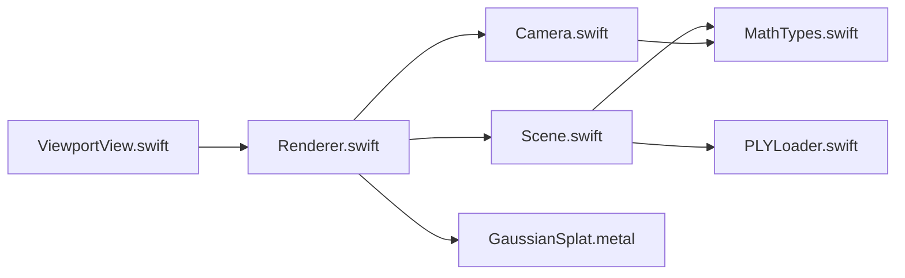
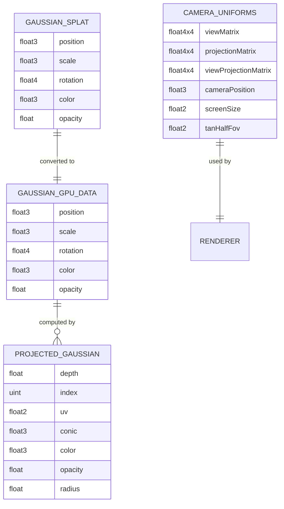

# GPU Rendering Pipeline

<cite>
**Referenced Files in This Document**
- [GaussianSplat.metal](file://Shaders/GaussianSplat.metal)
- [Renderer.swift](file://Rendering/Renderer.swift)
- [Camera.swift](file://Rendering/Camera.swift)
- [Scene.swift](file://Scene/Scene.swift)
- [ViewportView.swift](file://UI/ViewportView.swift)
- [MathTypes.swift](file://Math/MathTypes.swift)
- [PLYLoader.swift](file://Scene/PLYLoader.swift)
- [GaussianSplatViewerApp.swift](file://GaussianSplatViewer/GaussianSplatViewerApp.swift)
- [ContentView.swift](file://GaussianSplatViewer/ContentView.swift)
</cite>

## Table of Contents
1. [Introduction](#introduction)
2. [Project Structure](#project-structure)
3. [Core Components](#core-components)
4. [Architecture Overview](#architecture-overview)
5. [Detailed Component Analysis](#detailed-component-analysis)
6. [Dependency Analysis](#dependency-analysis)
7. [Performance Considerations](#performance-considerations)
8. [Troubleshooting Guide](#troubleshooting-guide)
9. [Conclusion](#conclusion)
10. [Appendices](#appendices)

## Introduction
This document describes the GPU rendering pipeline for a Metal-based Gaussian splatting viewer. It covers the complete flow from compute shader projection of 3D Gaussians to screen-space rendering, including compute shader stage for Gaussian projection, depth sorting algorithms, and Metal render passes. It documents the GaussianSplat.metal shader implementation covering vertex transformation, fragment shading, and transparency handling. It explains the compute pipeline for projecting 3D Gaussians to screen space and sorting by depth. It covers GPU buffer management, uniform buffer updates, and Metal command encoding. It includes shader compilation, pipeline state objects, and performance optimization techniques. It documents the integration between Swift renderer code and Metal shaders, including data transfer patterns and synchronization. It addresses GPU memory management, texture handling, and Metal device compatibility considerations.

## Project Structure
The project is organized around a clear separation of concerns:
- Shaders: Metal compute and fragment/vertex shaders for projection, sorting, and rendering
- Rendering: Swift renderer, camera, and pipeline creation
- Scene: PLY loading, GPU buffer creation, and scene state
- UI: SwiftUI wrapper for MTKView and input handling
- Math: GPU-compatible data structures and math helpers

**Diagram sources**
- [ViewportView.swift:1-185](file://UI/ViewportView.swift#L1-L185)
- [Renderer.swift:1-288](file://Rendering/Renderer.swift#L1-L288)
- [Camera.swift:1-184](file://Rendering/Camera.swift#L1-L184)
- [Scene.swift:1-140](file://Scene/Scene.swift#L1-L140)
- [PLYLoader.swift:1-403](file://Scene/PLYLoader.swift#L1-L403)
- [MathTypes.swift:1-189](file://Math/MathTypes.swift#L1-L189)
- [GaussianSplat.metal:1-309](file://Shaders/GaussianSplat.metal#L1-L309)

**Section sources**
- [GaussianSplat.metal:1-309](file://Shaders/GaussianSplat.metal#L1-L309)
- [Renderer.swift:1-288](file://Rendering/Renderer.swift#L1-L288)
- [Camera.swift:1-184](file://Rendering/Camera.swift#L1-L184)
- [Scene.swift:1-140](file://Scene/Scene.swift#L1-L140)
- [ViewportView.swift:1-185](file://UI/ViewportView.swift#L1-L185)
- [MathTypes.swift:1-189](file://Math/MathTypes.swift#L1-L189)
- [PLYLoader.swift:1-403](file://Scene/PLYLoader.swift#L1-L403)
- [GaussianSplatViewerApp.swift:1-18](file://GaussianSplatViewer/GaussianSplatViewerApp.swift#L1-L18)
- [ContentView.swift:1-25](file://GaussianSplatViewer/ContentView.swift#L1-L25)

## Core Components
- GaussianSplat.metal: Defines GPU data structures, compute shader for projection, sorting kernel, and vertex/fragment shaders for rendering
- Renderer.swift: Creates Metal device, pipelines, buffers, encodes compute and render passes, and handles camera uniform updates
- Camera.swift: Manages camera pose, matrices, and produces CameraUniforms for GPU
- Scene.swift: Loads PLY data, creates GPU buffers for splats and projections, and maintains scene metadata
- ViewportView.swift: Wraps MTKView in SwiftUI, wires input events to renderer
- MathTypes.swift: Provides GPU-compatible structures and math helpers for covariance and matrices
- PLYLoader.swift: Parses PLY files and constructs GaussianSplat arrays

**Section sources**
- [GaussianSplat.metal:1-309](file://Shaders/GaussianSplat.metal#L1-L309)
- [Renderer.swift:1-288](file://Rendering/Renderer.swift#L1-L288)
- [Camera.swift:1-184](file://Rendering/Camera.swift#L1-L184)
- [Scene.swift:1-140](file://Scene/Scene.swift#L1-L140)
- [ViewportView.swift:1-185](file://UI/ViewportView.swift#L1-L185)
- [MathTypes.swift:1-189](file://Math/MathTypes.swift#L1-L189)
- [PLYLoader.swift:1-403](file://Scene/PLYLoader.swift#L1-L403)

## Architecture Overview
The pipeline consists of:
- Compute pass: projectGaussians computes 2D covariance, conic matrix, radius, and depth for each Gaussian
- Optional sort pass: bitonicSort sorts projected Gaussians by depth (currently a placeholder)
- Render pass: draws instanced quads with premultiplied alpha blending

**Diagram sources**
- [Renderer.swift:166-250](file://Rendering/Renderer.swift#L166-L250)
- [GaussianSplat.metal:138-201](file://Shaders/GaussianSplat.metal#L138-L201)
- [GaussianSplat.metal:274-308](file://Shaders/GaussianSplat.metal#L274-L308)
- [GaussianSplat.metal:205-241](file://Shaders/GaussianSplat.metal#L205-L241)
- [GaussianSplat.metal:245-270](file://Shaders/GaussianSplat.metal#L245-L270)

## Detailed Component Analysis

### GaussianSplat.metal Shader Implementation
- Data structures:
  - GaussianGPUData: position, scale, rotation (quaternion), color, opacity
  - CameraUniforms: view/projection/viewProjection matrices, camera position, screen size, tangent half FOV
  - ProjectedGaussian: depth, index, UV, conic (inverse 2D covariance), color, opacity, radius
  - VertexOut: per-vertex attributes for rendering
- Compute shader: projectGaussians
  - Computes 3D covariance from scale and rotation
  - Projects to 2D using perspective projection Jacobian and view rotation
  - Builds conic matrix (inverse covariance) and checks determinant
  - Computes view-space depth and screen-space UV
  - Calculates radius using eigenvalues (3 sigma)
  - Writes ProjectedGaussian entries
- Vertex shader: gaussianVertex
  - Builds quad vertices (-1,-1), (1,-1), (-1,1), (1,1)
  - Applies Gaussian radius and UV to compute pixel positions
  - Converts to NDC and passes conic/color/opacity
- Fragment shader: gaussianFragment
  - Evaluates 2D Gaussian density using conic
  - Computes alpha with opacity and exponential falloff
  - Uses premultiplied alpha and discards small alpha
- Sorting kernel: bitonicSort
  - Performs bitonic sort across pairs with configurable stage and step
  - Swaps ProjectedGaussian entries and associated indices

**Diagram sources**
- [GaussianSplat.metal:138-201](file://Shaders/GaussianSplat.metal#L138-L201)

**Section sources**
- [GaussianSplat.metal:6-34](file://Shaders/GaussianSplat.metal#L6-L34)
- [GaussianSplat.metal:138-201](file://Shaders/GaussianSplat.metal#L138-L201)
- [GaussianSplat.metal:205-241](file://Shaders/GaussianSplat.metal#L205-L241)
- [GaussianSplat.metal:245-270](file://Shaders/GaussianSplat.metal#L245-L270)
- [GaussianSplat.metal:274-308](file://Shaders/GaussianSplat.metal#L274-L308)

### Renderer.swift: Metal Pipeline and Command Encoding
- Device and library: initializes Metal device, command queue, loads default library
- Pipelines:
  - Compute pipeline: projectGaussians function
  - Render pipeline: gaussianVertex + gaussianFragment with alpha blending
- Buffers:
  - Camera uniforms buffer: triple-buffered with aligned stride for CPU/GPU sync
  - Quad index buffer: shared storage for indexed instanced drawing
- Frame loop:
  - Updates camera uniforms per frame using triple-buffering
  - Compute pass: dispatches projectGaussians with thread group sizing
  - Optional sort pass: placeholder for bitonicSort (indices buffer exists)
  - Render pass: draws instanced triangles using quad indices
- Depth stencil: less-than depth compare with depth writes enabled

**Diagram sources**
- [Renderer.swift:7-77](file://Rendering/Renderer.swift#L7-L77)
- [Renderer.swift:166-250](file://Rendering/Renderer.swift#L166-L250)
- [Camera.swift:5-84](file://Rendering/Camera.swift#L5-L84)
- [Scene.swift:6-95](file://Scene/Scene.swift#L6-L95)

**Section sources**
- [Renderer.swift:38-77](file://Rendering/Renderer.swift#L38-L77)
- [Renderer.swift:81-127](file://Rendering/Renderer.swift#L81-L127)
- [Renderer.swift:129-143](file://Rendering/Renderer.swift#L129-L143)
- [Renderer.swift:166-250](file://Rendering/Renderer.swift#L166-L250)
- [Renderer.swift:252-266](file://Rendering/Renderer.swift#L252-L266)

### Camera.swift: Matrices and Uniforms
- Maintains position, target, up, FOV, aspect ratio, near/far planes
- Spherical coordinates for orbit navigation
- Provides view, projection, and combined matrices
- Exports CameraUniforms with screen size and tangent half FOV for GPU

**Section sources**
- [Camera.swift:36-84](file://Rendering/Camera.swift#L36-L84)
- [Camera.swift:134-147](file://Rendering/Camera.swift#L134-L147)

### Scene.swift and PLYLoader.swift: Data Loading and GPU Buffers
- Scene:
  - Loads Gaussian splats from PLY via PLYLoader
  - Creates GPU buffers: splat buffer (shared), projected buffer (private), index buffer (private)
  - Computes bounding box and radius for camera focusing
- PLYLoader:
  - Supports ASCII and binary little/big endian formats
  - Parses vertex elements and properties
  - Constructs GaussianSplat with position, scale, rotation, color, opacity

**Diagram sources**
- [PLYLoader.swift:41-68](file://Scene/PLYLoader.swift#L41-L68)
- [Scene.swift:57-95](file://Scene/Scene.swift#L57-L95)

**Section sources**
- [Scene.swift:30-55](file://Scene/Scene.swift#L30-L55)
- [Scene.swift:57-95](file://Scene/Scene.swift#L57-L95)
- [PLYLoader.swift:41-68](file://Scene/PLYLoader.swift#L41-L68)

### UI Integration: ViewportView.swift
- SwiftUI wrapper for MTKView
- Creates InteractiveMTKView and Renderer
- Bridges mouse and scroll events to renderer camera controls
- Provides ViewModel for loading files and reporting status

**Section sources**
- [ViewportView.swift:9-90](file://UI/ViewportView.swift#L9-L90)
- [ViewportView.swift:142-184](file://UI/ViewportView.swift#L142-L184)

### MathTypes.swift: GPU-Compatible Structures and Helpers
- Defines GaussianGPUData, CameraUniforms, ProjectedGaussian
- Quaternion math helpers and conversion to rotation matrices
- Matrix extensions for perspective, lookAt, translation, scale
- Covariance computation helpers for CPU-side usage

**Section sources**
- [MathTypes.swift:34-73](file://Math/MathTypes.swift#L34-L73)
- [MathTypes.swift:76-101](file://Math/MathTypes.swift#L76-L101)
- [MathTypes.swift:104-167](file://Math/MathTypes.swift#L104-L167)
- [MathTypes.swift:170-188](file://Math/MathTypes.swift#L170-L188)

## Dependency Analysis
- Renderer depends on:
  - Camera for uniforms
  - Scene for splat data and GPU buffers
  - Metal device for pipeline creation and command encoding
- Scene depends on:
  - PLYLoader for data parsing
  - Metal device for buffer creation
- ViewportView depends on:
  - Renderer for input handling and drawing
- Shaders depend on:
  - MathTypes for data structures and math helpers

**Diagram sources**
- [ViewportView.swift:1-185](file://UI/ViewportView.swift#L1-L185)
- [Renderer.swift:1-288](file://Rendering/Renderer.swift#L1-L288)
- [Camera.swift:1-184](file://Rendering/Camera.swift#L1-L184)
- [Scene.swift:1-140](file://Scene/Scene.swift#L1-L140)
- [PLYLoader.swift:1-403](file://Scene/PLYLoader.swift#L1-L403)
- [MathTypes.swift:1-189](file://Math/MathTypes.swift#L1-L189)
- [GaussianSplat.metal:1-309](file://Shaders/GaussianSplat.metal#L1-L309)

**Section sources**
- [Renderer.swift:1-288](file://Rendering/Renderer.swift#L1-L288)
- [Scene.swift:1-140](file://Scene/Scene.swift#L1-L140)
- [ViewportView.swift:1-185](file://UI/ViewportView.swift#L1-L185)
- [MathTypes.swift:1-189](file://Math/MathTypes.swift#L1-L189)
- [GaussianSplat.metal:1-309](file://Shaders/GaussianSplat.metal#L1-L309)

## Performance Considerations
- Triple-buffered uniform updates: reduces CPU/GPU synchronization stalls by cycling offsets
- Shared vs private buffers:
  - Splats: shared for CPU read/write
  - Projected data: private for compute output
  - Indices: private for sorting
- Compute dispatch sizing: 256-thread groups with ceiling division for total splats
- Alpha blending: additive with premultiplied alpha minimizes overdraw cost
- Early discard in fragment shader prevents unnecessary rasterization
- Depth sorting interval: configurable frame interval to balance correctness and cost
- Perspective projection Jacobian clamping avoids extreme warping near FOV edges

[No sources needed since this section provides general guidance]

## Troubleshooting Guide
- Shader compilation failures:
  - Verify function names match between Swift and Metal
  - Ensure Metal library is loaded from the app bundle
- Pipeline creation errors:
  - Confirm vertex and fragment functions exist
  - Check pixel formats and blending descriptors
- Buffer creation errors:
  - Validate buffer sizes and storage modes
  - Ensure alignment for uniform buffers
- Command encoding errors:
  - Check for nil buffers and pipeline states
  - Verify render pass descriptor availability
- Sorting not applied:
  - Implement bitonicSort dispatch in the render loop
  - Ensure index buffer is bound and sorted

**Section sources**
- [Renderer.swift:47-53](file://Rendering/Renderer.swift#L47-L53)
- [Renderer.swift:81-93](file://Rendering/Renderer.swift#L81-L93)
- [Renderer.swift:95-127](file://Rendering/Renderer.swift#L95-L127)
- [Renderer.swift:129-143](file://Rendering/Renderer.swift#L129-L143)
- [Renderer.swift:166-250](file://Rendering/Renderer.swift#L166-L250)

## Conclusion
The Gaussian splatting pipeline integrates Swift-based scene management and camera control with Metal compute and rendering. The compute shader projects Gaussians to screen space, and the vertex/fragment shaders render them with proper transparency. The renderer manages triple-buffered uniforms, indexed instanced rendering, and optional depth sorting. The system demonstrates efficient GPU utilization through shared/private buffer policies, aligned uniform updates, and alpha blending. Future enhancements include implementing the bitonic sort compute pass and optimizing draw call batching.

[No sources needed since this section summarizes without analyzing specific files]

## Appendices

### Data Model Diagram

**Diagram sources**
- [MathTypes.swift:12-51](file://Math/MathTypes.swift#L12-L51)
- [MathTypes.swift:54-73](file://Math/MathTypes.swift#L54-L73)
- [Camera.swift:134-147](file://Rendering/Camera.swift#L134-L147)
- [GaussianSplat.metal:6-34](file://Shaders/GaussianSplat.metal#L6-L34)