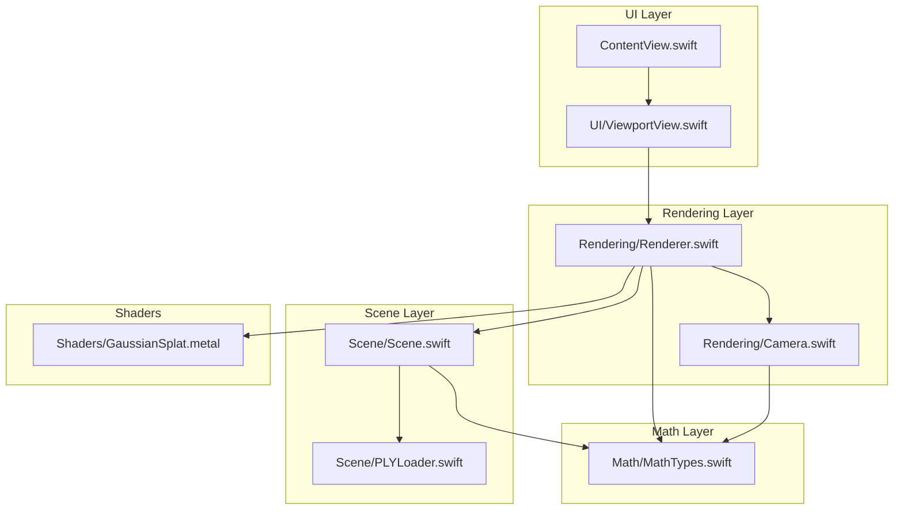
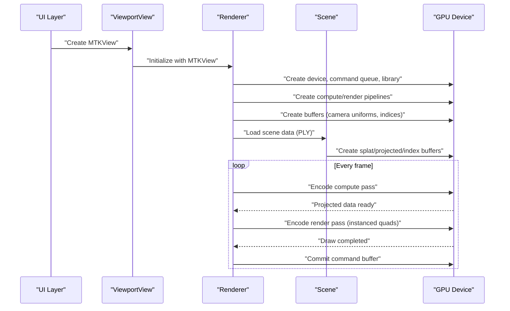
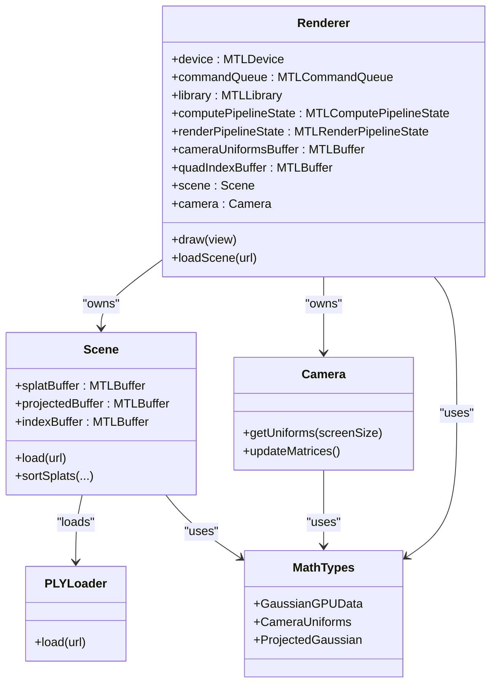
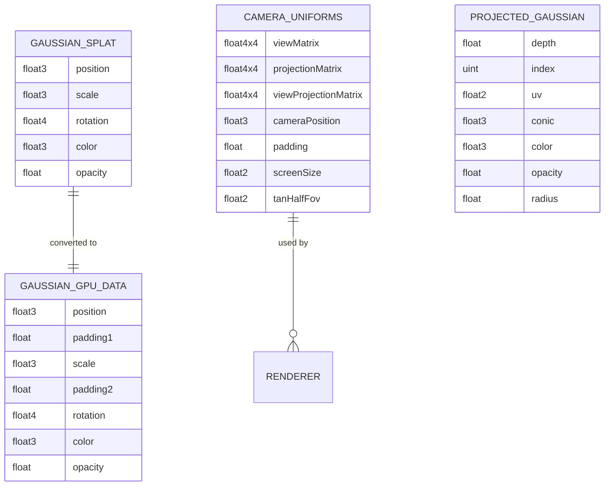

# Metal Framework Integration

<cite>
**Referenced Files in This Document**
- [GaussianSplatViewer/ContentView.swift](file://GaussianSplatViewer/ContentView.swift)
- [UI/ViewportView.swift](file://UI/ViewportView.swift)
- [Rendering/Renderer.swift](file://Rendering/Renderer.swift)
- [Rendering/Camera.swift](file://Rendering/Camera.swift)
- [Scene/Scene.swift](file://Scene/Scene.swift)
- [Scene/PLYLoader.swift](file://Scene/PLYLoader.swift)
- [Math/MathTypes.swift](file://Math/MathTypes.swift)
- [Shaders/GaussianSplat.metal](file://Shaders/GaussianSplat.metal)
</cite>

## Table of Contents
1. [Introduction](#introduction)
2. [Project Structure](#project-structure)
3. [Core Components](#core-components)
4. [Architecture Overview](#architecture-overview)
5. [Detailed Component Analysis](#detailed-component-analysis)
6. [Dependency Analysis](#dependency-analysis)
7. [Performance Considerations](#performance-considerations)
8. [Troubleshooting Guide](#troubleshooting-guide)
9. [Conclusion](#conclusion)
10. [Appendices](#appendices)

## Introduction
This document explains how the project integrates Metal for GPU-accelerated rendering of 3D Gaussian splats. It covers Metal device initialization, shader compilation and pipeline creation, GPU buffer management, command encoding and render passes, synchronization, memory management strategies, performance optimization, debugging, and compatibility considerations. The implementation targets macOS with SwiftUI and MetalKit, using a compute-first pipeline to project splats and a deferred rendering pass to draw them as textured quads with alpha blending.

## Project Structure
The project is organized around a clear separation of concerns:
- UI layer: SwiftUI views and a MetalKit wrapper for the viewport.
- Rendering layer: Renderer orchestrating Metal device, command queues, pipelines, and draw loops.
- Scene layer: Scene managing CPU and GPU data for splats, including buffer creation and sorting.
- Math layer: Shared GPU-compatible data structures and math utilities.
- Shaders: Metal Shading Language (MSL) source compiled into the app bundle.

**Diagram sources**
- [GaussianSplatViewer/ContentView.swift:1-25](file://GaussianSplatViewer/ContentView.swift#L1-L25)
- [UI/ViewportView.swift:1-185](file://UI/ViewportView.swift#L1-L185)
- [Rendering/Renderer.swift:1-289](file://Rendering/Renderer.swift#L1-L289)
- [Rendering/Camera.swift:1-184](file://Rendering/Camera.swift#L1-L184)
- [Scene/Scene.swift:1-158](file://Scene/Scene.swift#L1-L158)
- [Scene/PLYLoader.swift:1-403](file://Scene/PLYLoader.swift#L1-L403)
- [Math/MathTypes.swift:1-189](file://Math/MathTypes.swift#L1-L189)
- [Shaders/GaussianSplat.metal:1-317](file://Shaders/GaussianSplat.metal#L1-L317)

**Section sources**
- [GaussianSplatViewer/ContentView.swift:1-25](file://GaussianSplatViewer/ContentView.swift#L1-L25)
- [UI/ViewportView.swift:1-185](file://UI/ViewportView.swift#L1-L185)
- [Rendering/Renderer.swift:1-289](file://Rendering/Renderer.swift#L1-L289)
- [Rendering/Camera.swift:1-184](file://Rendering/Camera.swift#L1-L184)
- [Scene/Scene.swift:1-158](file://Scene/Scene.swift#L1-L158)
- [Scene/PLYLoader.swift:1-403](file://Scene/PLYLoader.swift#L1-L403)
- [Math/MathTypes.swift:1-189](file://Math/MathTypes.swift#L1-L189)
- [Shaders/GaussianSplat.metal:1-317](file://Shaders/GaussianSplat.metal#L1-L317)

## Core Components
- Metal device and command queue: Created at startup and shared across the app.
- Metal library: Loaded from the app bundle containing compiled MSL.
- Pipelines: Compute pipeline for projecting splats; render pipeline for drawing instanced quads.
- Buffers: Camera uniforms (triply-buffered), quad indices, and splat/projected/index buffers.
- Scene: Manages CPU data and GPU buffers for splats and provides sorting.
- Camera: Maintains view/projection matrices and generates GPU uniforms.
- Renderer: Drives the draw loop, encodes compute and render passes, and handles input.

Key responsibilities and interactions are detailed in later sections.

**Section sources**
- [Rendering/Renderer.swift:38-77](file://Rendering/Renderer.swift#L38-L77)
- [Rendering/Renderer.swift:81-143](file://Rendering/Renderer.swift#L81-L143)
- [Rendering/Renderer.swift:167-251](file://Rendering/Renderer.swift#L167-L251)
- [Scene/Scene.swift:57-95](file://Scene/Scene.swift#L57-L95)
- [Rendering/Camera.swift:133-147](file://Rendering/Camera.swift#L133-L147)

## Architecture Overview
The rendering pipeline is compute-first:
1. Compute pass: Each thread processes one Gaussian splat to produce projected data (depth, conic, color, opacity, radius).
2. Optional sorting: Back-to-front sorting for correct alpha blending.
3. Render pass: Draws instanced quads using the projected data and camera uniforms.

**Diagram sources**
- [UI/ViewportView.swift:9-26](file://UI/ViewportView.swift#L9-L26)
- [Rendering/Renderer.swift:38-77](file://Rendering/Renderer.swift#L38-L77)
- [Rendering/Renderer.swift:167-251](file://Rendering/Renderer.swift#L167-L251)
- [Scene/Scene.swift:31-55](file://Scene/Scene.swift#L31-L55)

## Detailed Component Analysis

### Metal Device Initialization and Library Loading
- Device and command queue are created from the system default device.
- The Metal library is loaded from the app bundle using the default library mechanism.
- The MTKView is configured with color and depth formats and cleared to a dark gray.

Implementation highlights:
- Device and queue creation, library loading, MTKView configuration, and delegate assignment.
- Early failure handling if device/library creation fails.

**Section sources**
- [Rendering/Renderer.swift:38-77](file://Rendering/Renderer.swift#L38-L77)

### Shader Compilation and Pipeline State Objects
- Compute pipeline: Built from a compute function named for projection.
- Render pipeline: Built from vertex and fragment functions; blending enabled for alpha compositing; depth testing disabled to rely on sorting order.
- Depth stencil state is created with write disabled and compare always.

Implementation highlights:
- Function lookup by name in the Metal library.
- Pipeline creation with descriptor configuration and error handling.

**Section sources**
- [Rendering/Renderer.swift:81-127](file://Rendering/Renderer.swift#L81-L127)
- [Rendering/Renderer.swift:262-267](file://Rendering/Renderer.swift#L262-L267)
- [Shaders/GaussianSplat.metal:146-209](file://Shaders/GaussianSplat.metal#L146-L209)
- [Shaders/GaussianSplat.metal:213-249](file://Shaders/GaussianSplat.metal#L213-L249)
- [Shaders/GaussianSplat.metal:253-278](file://Shaders/GaussianSplat.metal#L253-L278)

### GPU Buffer Management
- Camera uniforms buffer: Triple-buffered using stride alignment to avoid bank conflicts; stored in shared storage for CPU/GPU coherency.
- Quad index buffer: Static indices for drawing a full-screen quad twice per instance.
- Scene buffers:
  - Splat buffer: CPU-to-GPU copy of Gaussian data; shared storage.
  - Projected buffer: Private storage for compute output.
  - Index buffer: Private storage for sorting indices.

Buffer lifecycle:
- Creation occurs after successful scene load.
- Updates are performed via CPU-side sorting and memcpy into the splat buffer.
- Buffers are retained until scene is cleared.

**Section sources**
- [Rendering/Renderer.swift:19-20](file://Rendering/Renderer.swift#L19-L20)
- [Rendering/Renderer.swift:129-143](file://Rendering/Renderer.swift#L129-L143)
- [Scene/Scene.swift:58-95](file://Scene/Scene.swift#L58-L95)
- [Rendering/Renderer.swift:253-260](file://Rendering/Renderer.swift#L253-L260)

### Command Encoding, Render Pass Setup, and Synchronization
- Compute pass:
  - Sets compute pipeline state and buffers (splat input, projected output, camera uniforms, splat count).
  - Dispatches threadgroups sized to process all splats.
- Render pass:
  - Sets render pipeline state and depth stencil state.
  - Binds vertex buffers (projected data and camera uniforms).
  - Draws indexed triangles with instanced quads.
- Synchronization:
  - Uses a completion handler to capture command buffer errors.
  - Presents the drawable and commits the command buffer.

**Section sources**
- [Rendering/Renderer.swift:194-218](file://Rendering/Renderer.swift#L194-L218)
- [Rendering/Renderer.swift:221-242](file://Rendering/Renderer.swift#L221-L242)
- [Rendering/Renderer.swift:244-251](file://Rendering/Renderer.swift#L244-L251)

### Metal Shading Language Implementation
- Structures:
  - GaussianGPUData: GPU-compatible representation of splat data.
  - CameraUniforms: Matrices, camera position, screen size, and half-FOV tangents.
  - ProjectedGaussian: Output of compute shader with depth, UV, conic, color, opacity, radius.
- Compute shader:
  - Projects 3D covariance to 2D, computes conic (inverse covariance), radius, and stores per-splat data.
- Vertex shader:
  - Builds quad vertices around the projected position and scales by radius.
- Fragment shader:
  - Evaluates 2D Gaussian, applies opacity, and returns premultiplied alpha.

Sorting kernel:
- A simple bitonic sort kernel is included for completeness; the Swift side performs CPU-side sorting.

**Section sources**
- [Shaders/GaussianSplat.metal:6-34](file://Shaders/GaussianSplat.metal#L6-L34)
- [Shaders/GaussianSplat.metal:146-209](file://Shaders/GaussianSplat.metal#L146-L209)
- [Shaders/GaussianSplat.metal:213-249](file://Shaders/GaussianSplat.metal#L213-L249)
- [Shaders/GaussianSplat.metal:253-278](file://Shaders/GaussianSplat.metal#L253-L278)
- [Shaders/GaussianSplat.metal:282-316](file://Shaders/GaussianSplat.metal#L282-L316)

### Input Handling and Viewport Integration
- SwiftUI wrapper for MetalKit:
  - Creates an interactive MTKView, sets device and delegate, and initializes the renderer.
  - Provides a coordinator that forwards mouse and scroll events to the renderer.
- Interactive MTKView:
  - Captures mouse and scroll events and forwards them to the input handler.

**Section sources**
- [UI/ViewportView.swift:9-26](file://UI/ViewportView.swift#L9-L26)
- [UI/ViewportView.swift:102-139](file://UI/ViewportView.swift#L102-L139)
- [UI/ViewportView.swift:38-89](file://UI/ViewportView.swift#L38-L89)

### Scene Loading and Data Pipeline
- PLY loader:
  - Parses ASCII and binary PLY formats, extracts vertex properties, and constructs Gaussian splats.
  - Supports multiple property naming conventions and converts SH DC to RGB.
- Scene:
  - Creates GPU buffers for splats, projected data, and indices.
  - Performs CPU-side sorting and updates the splat buffer for rendering.

**Section sources**
- [Scene/PLYLoader.swift:42-68](file://Scene/PLYLoader.swift#L42-L68)
- [Scene/Scene.swift:31-55](file://Scene/Scene.swift#L31-L55)
- [Scene/Scene.swift:58-95](file://Scene/Scene.swift#L58-L95)
- [Scene/Scene.swift:105-121](file://Scene/Scene.swift#L105-L121)

### Camera and Uniforms
- Camera maintains position, target, FOV, and aspect ratio; recomputes view and projection matrices.
- Generates CameraUniforms with matrices, camera position, screen size, and half-FOV tangents.
- Renderer updates the triple-buffered camera uniforms each frame.

**Section sources**
- [Rendering/Camera.swift:62-84](file://Rendering/Camera.swift#L62-L84)
- [Rendering/Camera.swift:133-147](file://Rendering/Camera.swift#L133-L147)
- [Rendering/Renderer.swift:253-260](file://Rendering/Renderer.swift#L253-L260)

## Dependency Analysis
The following diagram shows the primary dependencies among components:

**Diagram sources**
- [Rendering/Renderer.swift:7-77](file://Rendering/Renderer.swift#L7-L77)
- [Scene/Scene.swift:6-28](file://Scene/Scene.swift#L6-L28)
- [Rendering/Camera.swift:5-60](file://Rendering/Camera.swift#L5-L60)
- [Scene/PLYLoader.swift:13-68](file://Scene/PLYLoader.swift#L13-L68)
- [Math/MathTypes.swift:12-73](file://Math/MathTypes.swift#L12-L73)

**Section sources**
- [Rendering/Renderer.swift:7-77](file://Rendering/Renderer.swift#L7-L77)
- [Scene/Scene.swift:6-28](file://Scene/Scene.swift#L6-L28)
- [Rendering/Camera.swift:5-60](file://Rendering/Camera.swift#L5-L60)
- [Scene/PLYLoader.swift:13-68](file://Scene/PLYLoader.swift#L13-L68)
- [Math/MathTypes.swift:12-73](file://Math/MathTypes.swift#L12-L73)

## Performance Considerations
- Compute dispatch sizing:
  - Thread groups are sized to cover all splats; ensure splatCount is reasonably bounded to avoid excessive work.
- Buffer memory layout:
  - Camera uniforms are triple-buffered with 256-byte stride to reduce bank conflicts and improve throughput.
  - Splat buffer uses shared storage for CPU writes; consider staging or persistent mapping for frequent updates.
- Alpha blending:
  - Sorting is performed periodically to reduce overdraw; tune sort interval for performance vs. quality balance.
- Render pass batching:
  - Instanced draw minimizes state changes; keep vertex and index buffers coherent across frames.
- Texture and rasterization:
  - Using depth32Float for depth improves precision; ensure the quad indices remain static.
- Metal Shading Language:
  - Conic computation avoids expensive inverse operations by using determinant-based inversion.
  - Fragment discard reduces fragment shader work for off-screen or invisible splats.

[No sources needed since this section provides general guidance]

## Troubleshooting Guide
Common issues and remedies:
- Metal library load failures:
  - Verify the MSL file is included in the app bundle and compiled into the default library.
- Pipeline creation errors:
  - Ensure compute and vertex/fragment function names match those referenced in the renderer.
- Buffer creation failures:
  - Check device capabilities and buffer sizes; ensure sufficient memory for splat counts.
- Command buffer errors:
  - Inspect the completion handler for detailed error messages.
- Incorrect rendering:
  - Confirm camera uniforms are updated each frame and bound to the correct buffer indices.
  - Verify depth sorting is enabled when needed and that the render pass uses alpha blending.

**Section sources**
- [Rendering/Renderer.swift:47-53](file://Rendering/Renderer.swift#L47-L53)
- [Rendering/Renderer.swift:87-92](file://Rendering/Renderer.swift#L87-L92)
- [Rendering/Renderer.swift:121-126](file://Rendering/Renderer.swift#L121-L126)
- [Rendering/Renderer.swift:244-248](file://Rendering/Renderer.swift#L244-L248)

## Conclusion
The project demonstrates a clean, efficient Metal integration for Gaussian splat rendering. It leverages a compute-first pipeline to project splats, uses CPU-side sorting for correct alpha blending, and draws instanced quads with alpha blending. The design separates concerns across UI, rendering, scene, math, and shaders, enabling maintainability and extensibility. Following the outlined performance and troubleshooting guidance will help sustain smooth performance across diverse GPU architectures.

[No sources needed since this section summarizes without analyzing specific files]

## Appendices

### Data Model Diagram

**Diagram sources**
- [Math/MathTypes.swift:12-73](file://Math/MathTypes.swift#L12-L73)
- [Rendering/Renderer.swift:19-20](file://Rendering/Renderer.swift#L19-L20)
- [Shaders/GaussianSplat.metal:6-34](file://Shaders/GaussianSplat.metal#L6-L34)

### Runtime Shader Loading Notes
- The project loads the Metal library from the app bundle at runtime. This simplifies deployment and ensures shader availability.
- For dynamic shader reloading scenarios, consider compiling MSL at runtime and caching pipeline state objects carefully to avoid redundant recompilation.

**Section sources**
- [Rendering/Renderer.swift:47-53](file://Rendering/Renderer.swift#L47-L53)