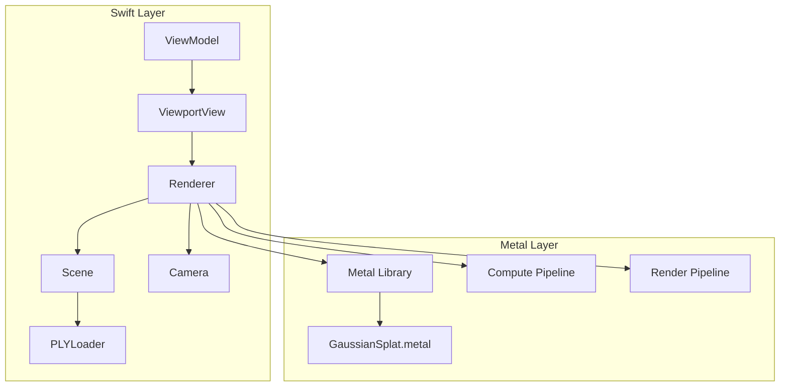
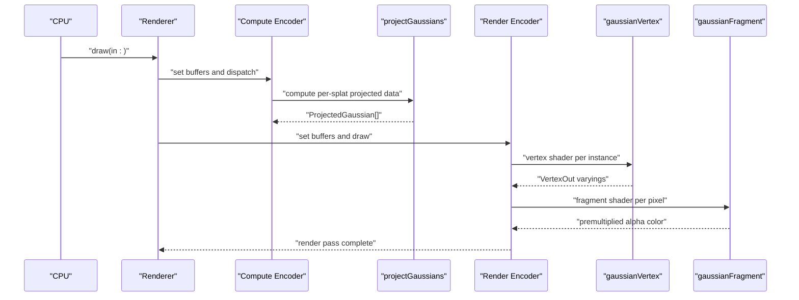
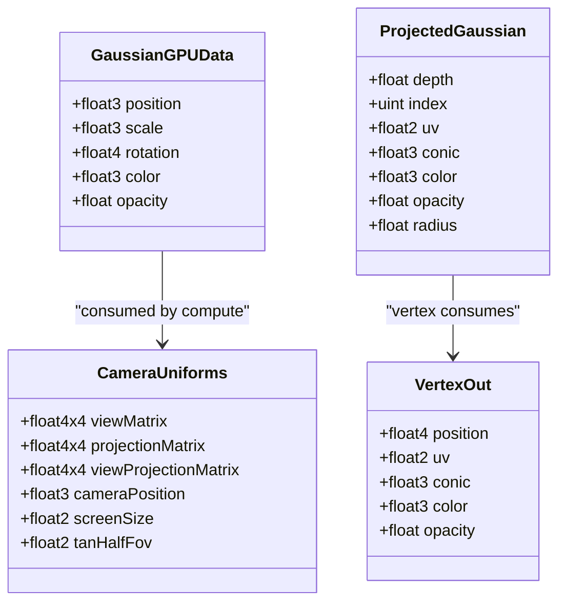
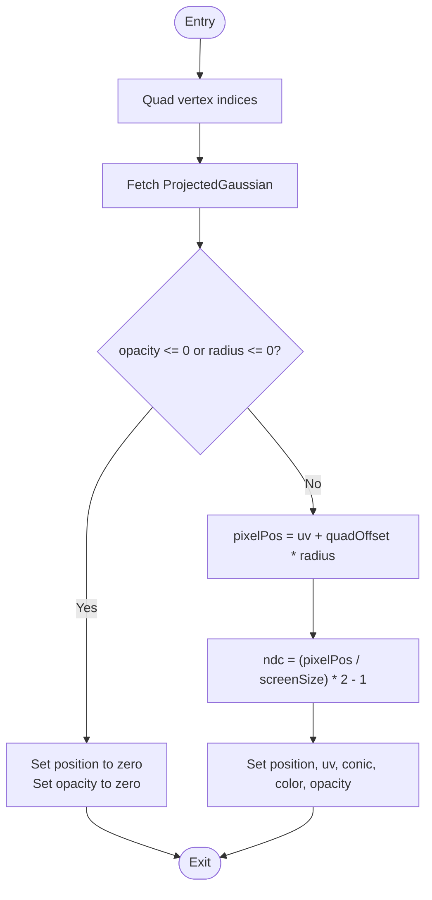
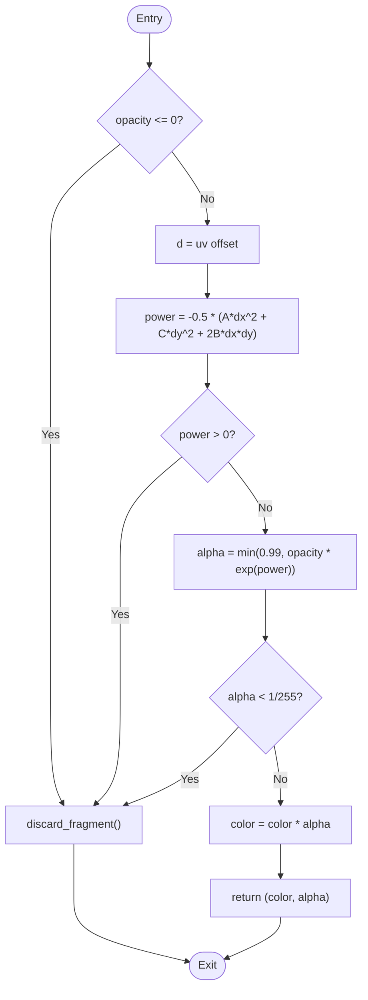
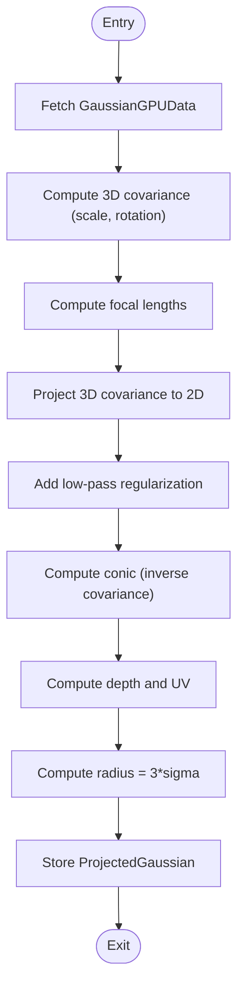
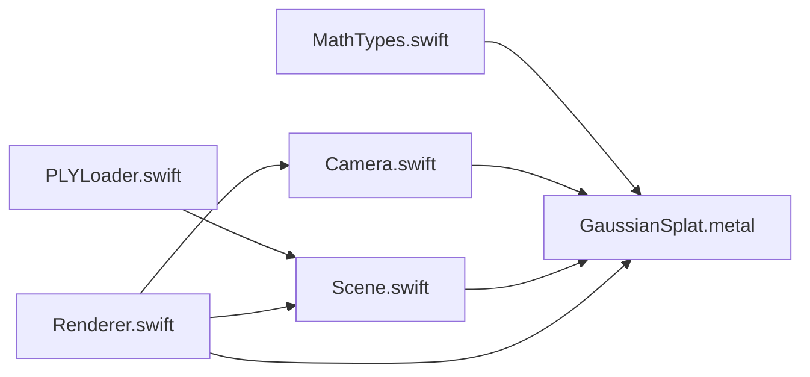

# Vertex and Fragment Shaders

<cite>
**Referenced Files in This Document**
- [GaussianSplat.metal](file://Shaders/GaussianSplat.metal)
- [MathTypes.swift](file://Math/MathTypes.swift)
- [Renderer.swift](file://Rendering/Renderer.swift)
- [Scene.swift](file://Scene/Scene.swift)
- [Camera.swift](file://Rendering/Camera.swift)
- [PLYLoader.swift](file://Scene/PLYLoader.swift)
- [ViewportView.swift](file://UI/ViewportView.swift)
- [ContentView.swift](file://UI/ContentView.swift)
</cite>

## Table of Contents
1. [Introduction](#introduction)
2. [Project Structure](#project-structure)
3. [Core Components](#core-components)
4. [Architecture Overview](#architecture-overview)
5. [Detailed Component Analysis](#detailed-component-analysis)
6. [Dependency Analysis](#dependency-analysis)
7. [Performance Considerations](#performance-considerations)
8. [Troubleshooting Guide](#troubleshooting-guide)
9. [Conclusion](#conclusion)

## Introduction
This document explains the vertex and fragment shader implementations for Gaussian splatting, focusing on:
- The gaussianVertex shader that generates screen-space quad vertices from projected Gaussian data, including radius computation and depth-based positioning.
- The gaussianFragment shader that evaluates 2D Gaussian functions for pixel sampling, performs alpha compositing, and handles transparency.
- The mathematical foundation of Gaussian splatting, including conic parameter computation and exponential falloff calculations.
- Shader input/output structures, varying data transmission, and GPU instruction optimization.
- Precision considerations, numerical stability, and performance implications.

## Project Structure
The Gaussian splatting pipeline is implemented in a Metal-based viewer:
- GPU shaders live in a single Metal file that defines structures, compute kernels, vertex, and fragment stages.
- Swift types mirror GPU structures and provide math utilities for covariance and rotations.
- The renderer orchestrates compute and render passes, sets up buffers, and manages camera uniforms.
- Scene management loads PLY data into GPU buffers and exposes splat counts and geometry.
- UI integrates MetalKit and SwiftUI to drive user interaction and rendering.

**Diagram sources**
- [Renderer.swift:1-288](file://Rendering/Renderer.swift#L1-L288)
- [Scene.swift:1-140](file://Scene/Scene.swift#L1-L140)
- [Camera.swift:1-184](file://Rendering/Camera.swift#L1-L184)
- [PLYLoader.swift:1-403](file://Scene/PLYLoader.swift#L1-L403)
- [GaussianSplat.metal:1-309](file://Shaders/GaussianSplat.metal#L1-L309)

**Section sources**
- [Renderer.swift:1-288](file://Rendering/Renderer.swift#L1-L288)
- [Scene.swift:1-140](file://Scene/Scene.swift#L1-L140)
- [Camera.swift:1-184](file://Rendering/Camera.swift#L1-L184)
- [PLYLoader.swift:1-403](file://Scene/PLYLoader.swift#L1-L403)
- [GaussianSplat.metal:1-309](file://Shaders/GaussianSplat.metal#L1-L309)

## Core Components
- GPU data structures:
  - GaussianGPUData: per-splat data passed to the GPU (position, scale, rotation, color, opacity).
  - CameraUniforms: view/projection matrices, camera position, screen size, and half-field-of-view tangents.
  - ProjectedGaussian: per-instance data computed in the compute stage (depth, index, UV, conic parameters, color, opacity, radius).
  - VertexOut: varyings passed from vertex to fragment (position, UV offsets, conic, color, opacity).
- Compute kernel:
  - projectGaussians: computes 3D covariance from scale and rotation, projects to 2D, derives conic parameters, computes radius, and stores per-instance data.
- Vertex shader:
  - gaussianVertex: builds screen-space quad vertices from per-instance data, discards invisible instances, and passes varyings to the fragment stage.
- Fragment shader:
  - gaussianFragment: evaluates 2D Gaussian, computes alpha via exponential falloff, applies premultiplied alpha, and discards transparent fragments.

**Section sources**
- [GaussianSplat.metal:6-42](file://Shaders/GaussianSplat.metal#L6-L42)
- [GaussianSplat.metal:138-201](file://Shaders/GaussianSplat.metal#L138-L201)
- [GaussianSplat.metal:205-241](file://Shaders/GaussianSplat.metal#L205-L241)
- [GaussianSplat.metal:245-270](file://Shaders/GaussianSplat.metal#L245-L270)

## Architecture Overview
The pipeline consists of two main stages:
1) Compute pass: project Gaussians to screen space, compute conic parameters, and derive radii.
2) Render pass: draw instanced quads, evaluate Gaussian density per pixel, and composite with alpha blending.

**Diagram sources**
- [Renderer.swift:166-250](file://Rendering/Renderer.swift#L166-L250)
- [GaussianSplat.metal:138-201](file://Shaders/GaussianSplat.metal#L138-L201)
- [GaussianSplat.metal:205-241](file://Shaders/GaussianSplat.metal#L205-L241)
- [GaussianSplat.metal:245-270](file://Shaders/GaussianSplat.metal#L245-L270)

## Detailed Component Analysis

### Mathematical Basis: Gaussian Splatting
- 3D covariance from scale and rotation:
  - Build scale matrix S from splat scale.
  - Convert rotation quaternion to matrix R.
  - Compute 3D covariance Σ = R · S · Sᵀ · Rᵀ ≈ R · S² · Rᵀ.
  - Store upper-triangular elements for efficient 2D projection.
- 2D covariance projection:
  - Transform position to view space and check visibility.
  - Compute Jacobian of perspective projection and combine with view rotation to form the linear operator T.
  - Project 3D covariance to 2D: cov₂D = Tᵀ · Σ · T.
  - Add low-pass regularization to diagonal terms to stabilize inversion.
- Conic parameter computation:
  - Conic parameters are the inverse of the 2D covariance matrix: conic = [A, B, C] representing the inverse covariance.
  - Determinant-based inversion ensures numerical stability; zero determinant yields zero opacity.
- Radius computation:
  - Eigenvalues λ₁, λ₂ of the 2D covariance are derived from trace and determinant.
  - Radius set to 3σ (ellipsoidal extent) rounded up for conservative rasterization.

**Section sources**
- [GaussianSplat.metal:64-74](file://Shaders/GaussianSplat.metal#L64-L74)
- [GaussianSplat.metal:76-134](file://Shaders/GaussianSplat.metal#L76-L134)
- [GaussianSplat.metal:165-198](file://Shaders/GaussianSplat.metal#L165-L198)
- [MathTypes.swift:170-188](file://Math/MathTypes.swift#L170-L188)

### Shader Structures and Data Flow
- Structures:
  - GaussianGPUData mirrors CPU-side GaussianSplat for GPU transfer.
  - CameraUniforms encapsulates matrices and screen metrics for GPU.
  - ProjectedGaussian carries per-instance projection results.
  - VertexOut carries varyings to the fragment stage.
- Data flow:
  - CPU loads PLY data, constructs GPU buffers, and updates CameraUniforms.
  - Compute pass writes ProjectedGaussian[].
  - Render pass reads ProjectedGaussian[] and draws instanced quads.
  - Vertex shader computes per-quad positions and pass varyings.
  - Fragment shader evaluates Gaussian density and composites.

**Diagram sources**
- [GaussianSplat.metal:6-42](file://Shaders/GaussianSplat.metal#L6-L42)
- [MathTypes.swift:34-73](file://Math/MathTypes.swift#L34-L73)

**Section sources**
- [GaussianSplat.metal:6-42](file://Shaders/GaussianSplat.metal#L6-L42)
- [MathTypes.swift:34-73](file://Math/MathTypes.swift#L34-L73)

### Vertex Shader: gaussianVertex
- Purpose:
  - Generate four vertices for a screen-space quad per Gaussian instance.
  - Use per-instance data (UV, radius, conic, color, opacity) to position and shade.
- Key steps:
  - Quad vertices are (-1,-1), (1,-1), (-1,1), (1,1).
  - Pixel position = projected UV + quad offset × radius.
  - Convert pixel position to NDC and set per-fragment depth from the projected depth.
  - Pass varyings: UV offsets, conic, color, opacity.
  - Discard if opacity or radius is zero.

**Diagram sources**
- [GaussianSplat.metal:205-241](file://Shaders/GaussianSplat.metal#L205-L241)

**Section sources**
- [GaussianSplat.metal:205-241](file://Shaders/GaussianSplat.metal#L205-L241)

### Fragment Shader: gaussianFragment
- Purpose:
  - Evaluate 2D Gaussian density at fragment position.
  - Compute alpha using exponential falloff and premultiplied alpha.
  - Discard fragments below a small threshold for performance.
- Key steps:
  - d = UV offset from vertex stage.
  - power = -0.5 * (A·dx² + C·dy² + 2B·dx·dy).
  - If power > 0, discard (outside support).
  - alpha = min(0.99, opacity × exp(power)).
  - If alpha too small, discard.
  - Output color = color × alpha; alpha remains.

**Diagram sources**
- [GaussianSplat.metal:245-270](file://Shaders/GaussianSplat.metal#L245-L270)

**Section sources**
- [GaussianSplat.metal:245-270](file://Shaders/GaussianSplat.metal#L245-L270)

### Compute Kernel: projectGaussians
- Purpose:
  - Transform per-splat data to screen space and prepare per-instance data for rendering.
- Key steps:
  - Compute 3D covariance from scale and rotation.
  - Derive focal lengths from projection matrix and screen size.
  - Project 3D covariance to 2D using Jacobian and view rotation; add low-pass regularization.
  - Compute conic parameters as inverse covariance; zero determinant implies zero opacity.
  - Compute view and clip-space positions for depth and UV.
  - Compute radius as 3σ using eigenvalues derived from trace/determinant.
  - Store ProjectedGaussian with depth, index, UV, conic, color, opacity, radius.

**Diagram sources**
- [GaussianSplat.metal:138-201](file://Shaders/GaussianSplat.metal#L138-L201)

**Section sources**
- [GaussianSplat.metal:138-201](file://Shaders/GaussianSplat.metal#L138-L201)

### Precision, Numerical Stability, and Performance
- Precision and stability:
  - Low-pass regularization added to diagonal of 2D covariance prevents singular inverses.
  - Determinant check avoids division by zero; zero determinant sets opacity to zero.
  - Power evaluation uses symmetric conic form to reduce arithmetic errors.
  - Alpha clamped to 0.99 to prevent overflow in premultiplied alpha.
- Performance:
  - Early discard in vertex and fragment stages reduces fragment work.
  - Radius computed per instance to bound quad size and reduce overdraw.
  - Exponential evaluation performed per-pixel; keep power negative to avoid unnecessary branches.
  - Compute pass uses 256-thread groups for throughput; ensure splat count aligns to group size.

**Section sources**
- [GaussianSplat.metal:129-133](file://Shaders/GaussianSplat.metal#L129-L133)
- [GaussianSplat.metal:167-170](file://Shaders/GaussianSplat.metal#L167-L170)
- [GaussianSplat.metal:254-262](file://Shaders/GaussianSplat.metal#L254-L262)
- [GaussianSplat.metal:264-266](file://Shaders/GaussianSplat.metal#L264-L266)
- [Renderer.swift:202-208](file://Rendering/Renderer.swift#L202-L208)

## Dependency Analysis
- Swift-to-Metal data structures:
  - GaussianGPUData mirrors GaussianSplat for GPU transfer.
  - CameraUniforms mirrors camera matrices and screen metrics.
  - ProjectedGaussian mirrors compute-stage outputs.
- Renderer orchestration:
  - Creates compute and render pipelines, sets buffers, and dispatches compute and draw commands.
  - Triple-buffered CameraUniforms to decouple CPU and GPU timing.
- Scene and PLY loading:
  - Scene creates GPU buffers for splats and projected data.
  - PLYLoader parses vertex properties and constructs GaussianSplat arrays.

**Diagram sources**
- [MathTypes.swift:34-73](file://Math/MathTypes.swift#L34-L73)
- [Camera.swift:134-147](file://Rendering/Camera.swift#L134-L147)
- [Scene.swift:58-95](file://Scene/Scene.swift#L58-L95)
- [Renderer.swift:81-127](file://Rendering/Renderer.swift#L81-L127)
- [GaussianSplat.metal:1-309](file://Shaders/GaussianSplat.metal#L1-L309)

**Section sources**
- [MathTypes.swift:34-73](file://Math/MathTypes.swift#L34-L73)
- [Camera.swift:134-147](file://Rendering/Camera.swift#L134-L147)
- [Scene.swift:58-95](file://Scene/Scene.swift#L58-L95)
- [Renderer.swift:81-127](file://Rendering/Renderer.swift#L81-L127)
- [GaussianSplat.metal:1-309](file://Shaders/GaussianSplat.metal#L1-L309)

## Performance Considerations
- Compute throughput:
  - Use 256-thread workgroups for projectGaussians to maximize occupancy.
  - Ensure splat count is aligned to group size to avoid partial work.
- Rasterization efficiency:
  - Radius-based quad culling reduces overdraw; keep radius conservative.
  - Early discard in vertex and fragment stages minimizes fragment shader cost.
- Memory bandwidth:
  - ProjectedGaussian is compact; keep per-splat data minimal.
  - Triple-buffered uniform updates reduce stalls.
- Blending:
  - Pre-multiplied alpha with additive blending reduces overdraw artifacts and improves performance.

[No sources needed since this section provides general guidance]

## Troubleshooting Guide
- No splats rendered:
  - Verify compute pass runs and splat count is non-zero.
  - Check opacity and radius checks in vertex stage; zero values cause discard.
- Incorrect appearance or artifacts:
  - Confirm conic parameters are computed from valid covariance; zero determinant disables rendering.
  - Ensure camera uniforms are updated per frame and matrices are correct.
- Performance drops:
  - Reduce splat count or increase radius culling.
  - Verify compute dispatch sizes and alignment.
- Transparency issues:
  - Ensure alpha compositing uses premultiplied alpha and blending factors are set correctly.

**Section sources**
- [Renderer.swift:166-250](file://Rendering/Renderer.swift#L166-L250)
- [GaussianSplat.metal:222-226](file://Shaders/GaussianSplat.metal#L222-L226)
- [GaussianSplat.metal:167-170](file://Shaders/GaussianSplat.metal#L167-L170)
- [Renderer.swift:111-119](file://Rendering/Renderer.swift#L111-L119)

## Conclusion
The Gaussian splatting implementation combines a compute pass for projection and conic parameterization with a vertex/fragment pipeline for efficient rasterization and compositing. The shader code is structured around precise mathematical foundations: covariance computation, 2D projection, conic inversion, and exponential falloff. Careful numerical stability and early discard strategies ensure correctness and performance. The Swift layer provides robust data structures, camera management, and Metal orchestration to deliver a responsive viewer.