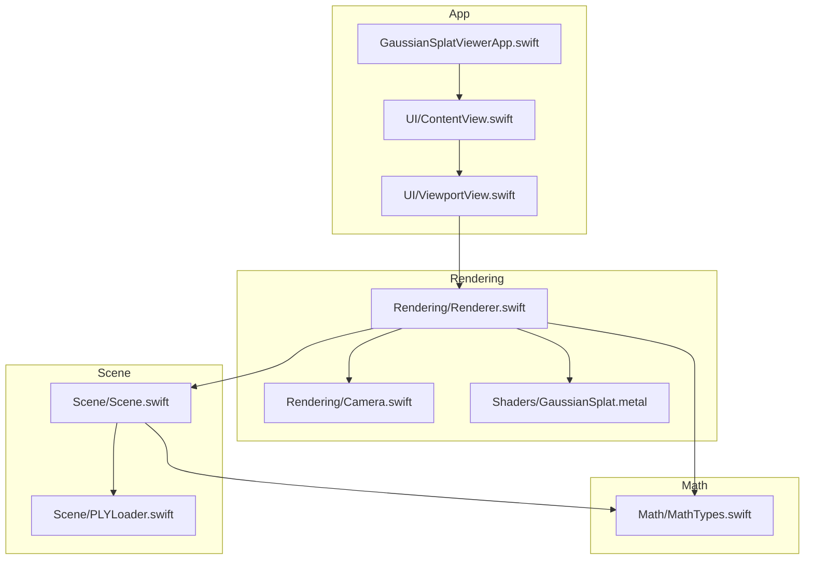
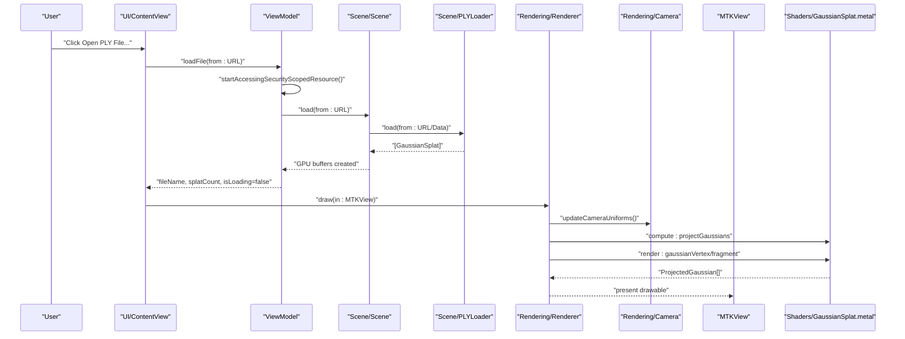
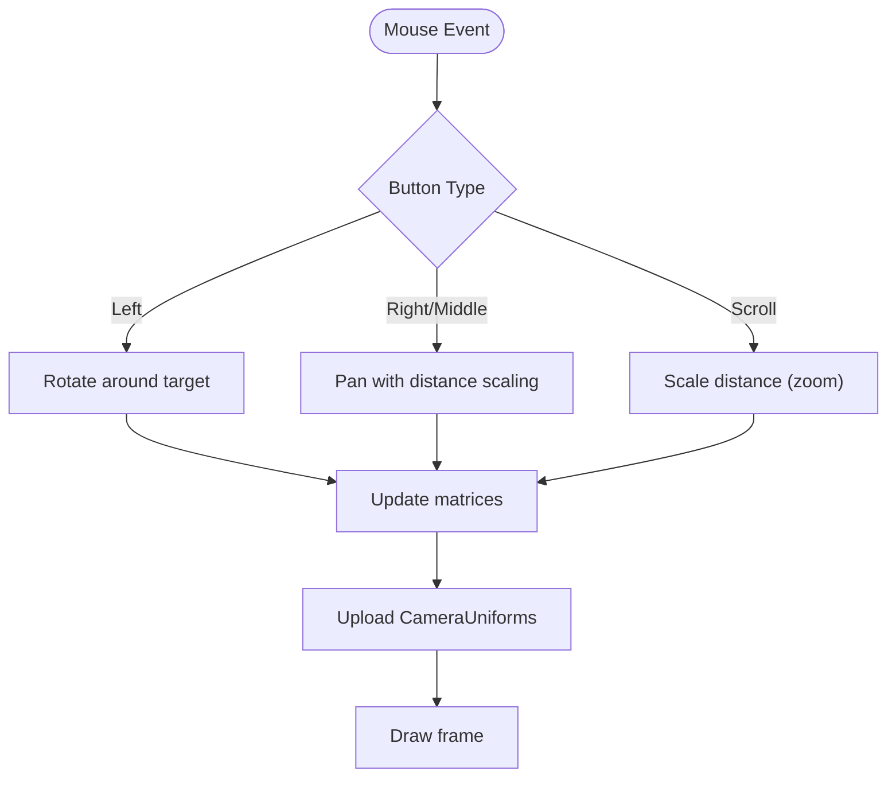
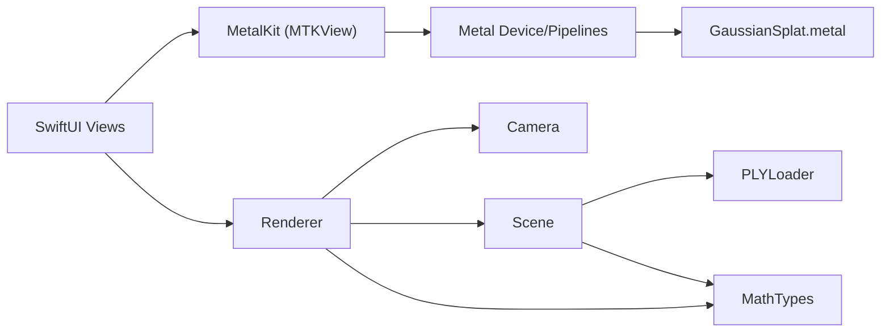

# Getting Started

<cite>
**Referenced Files in This Document**
- [GaussianSplatViewerApp.swift](file://GaussianSplatViewerApp.swift)
- [UI/ContentView.swift](file://UI/ContentView.swift)
- [UI/ViewportView.swift](file://UI/ViewportView.swift)
- [Rendering/Renderer.swift](file://Rendering/Renderer.swift)
- [Rendering/Camera.swift](file://Rendering/Camera.swift)
- [Scene/Scene.swift](file://Scene/Scene.swift)
- [Scene/PLYLoader.swift](file://Scene/PLYLoader.swift)
- [Math/MathTypes.swift](file://Math/MathTypes.swift)
- [Shaders/GaussianSplat.metal](file://Shaders/GaussianSplat.metal)
</cite>

## Table of Contents
1. [Introduction](#introduction)
2. [Project Structure](#project-structure)
3. [Core Components](#core-components)
4. [Architecture Overview](#architecture-overview)
5. [Detailed Component Analysis](#detailed-component-analysis)
6. [Dependency Analysis](#dependency-analysis)
7. [Performance Considerations](#performance-considerations)
8. [Troubleshooting Guide](#troubleshooting-guide)
9. [Conclusion](#conclusion)
10. [Appendices](#appendices)

## Introduction
This guide helps you install, build, and run the Gaussian Splat Viewer on macOS. You will learn how to prepare your development environment, clone and open the project in Xcode, build and run the app, load and view PLY files, and navigate the 3D scene using mouse and trackpad controls. It also covers supported PLY formats, platform requirements, and common troubleshooting steps.

## Project Structure
The project is a SwiftUI + Metal app organized into focused modules:
- Application entry point and SwiftUI views
- Rendering pipeline with Metal
- Scene management and PLY loading
- Mathematical types and GPU structures
- Metal shaders for Gaussian splatting

**Diagram sources**
- [GaussianSplatViewerApp.swift:1-13](file://GaussianSplatViewerApp.swift#L1-L13)
- [UI/ContentView.swift:1-130](file://UI/ContentView.swift#L1-L130)
- [UI/ViewportView.swift:1-185](file://UI/ViewportView.swift#L1-L185)
- [Rendering/Renderer.swift:1-292](file://Rendering/Renderer.swift#L1-L292)
- [Rendering/Camera.swift:1-184](file://Rendering/Camera.swift#L1-L184)
- [Scene/Scene.swift:1-131](file://Scene/Scene.swift#L1-L131)
- [Scene/PLYLoader.swift:1-403](file://Scene/PLYLoader.swift#L1-L403)
- [Math/MathTypes.swift:1-189](file://Math/MathTypes.swift#L1-L189)
- [Shaders/GaussianSplat.metal:1-309](file://Shaders/GaussianSplat.metal#L1-L309)

**Section sources**
- [GaussianSplatViewerApp.swift:1-13](file://GaussianSplatViewerApp.swift#L1-L13)
- [UI/ContentView.swift:1-130](file://UI/ContentView.swift#L1-L130)
- [UI/ViewportView.swift:1-185](file://UI/ViewportView.swift#L1-L185)
- [Rendering/Renderer.swift:1-292](file://Rendering/Renderer.swift#L1-L292)
- [Scene/Scene.swift:1-131](file://Scene/Scene.swift#L1-L131)
- [Scene/PLYLoader.swift:1-403](file://Scene/PLYLoader.swift#L1-L403)
- [Math/MathTypes.swift:1-189](file://Math/MathTypes.swift#L1-L189)
- [Shaders/GaussianSplat.metal:1-309](file://Shaders/GaussianSplat.metal#L1-L309)

## Core Components
- Application entry point: Initializes the SwiftUI app and window group.
- Content view: Provides toolbar actions, file picker, viewport, and instructions.
- Viewport view: Wraps a MetalKit view, wires input events, and connects to the renderer.
- Renderer: Manages Metal device, pipelines, buffers, camera uniforms, and draw loop.
- Camera: Implements orbit, pan, zoom, and mouse interaction mapping.
- Scene: Loads Gaussian splats from PLY, creates GPU buffers, computes bounds.
- PLY Loader: Parses ASCII and binary PLY files, extracts vertex properties.
- Math types: Defines GPU-compatible structures and math helpers.
- Shaders: Compute shader projects Gaussians; vertex/fragment shaders rasterize.

**Section sources**
- [GaussianSplatViewerApp.swift:1-13](file://GaussianSplatViewerApp.swift#L1-L13)
- [UI/ContentView.swift:1-130](file://UI/ContentView.swift#L1-L130)
- [UI/ViewportView.swift:1-185](file://UI/ViewportView.swift#L1-L185)
- [Rendering/Renderer.swift:1-292](file://Rendering/Renderer.swift#L1-L292)
- [Rendering/Camera.swift:1-184](file://Rendering/Camera.swift#L1-L184)
- [Scene/Scene.swift:1-131](file://Scene/Scene.swift#L1-L131)
- [Scene/PLYLoader.swift:1-403](file://Scene/PLYLoader.swift#L1-L403)
- [Math/MathTypes.swift:1-189](file://Math/MathTypes.swift#L1-L189)
- [Shaders/GaussianSplat.metal:1-309](file://Shaders/GaussianSplat.metal#L1-L309)

## Architecture Overview
High-level flow from user interaction to rendered frame:
- User opens a .ply via the file picker in the content view.
- The view model loads the file on a background queue, delegates to the scene loader, and updates published state.
- The renderer draws frames each update cycle: compute pass projects Gaussians, optional depth sort, and render pass draws instanced quads.

**Diagram sources**
- [UI/ContentView.swift:110-124](file://UI/ContentView.swift#L110-L124)
- [UI/ViewportView.swift:151-183](file://UI/ViewportView.swift#L151-L183)
- [Scene/Scene.swift:26-50](file://Scene/Scene.swift#L26-L50)
- [Scene/PLYLoader.swift:42-68](file://Scene/PLYLoader.swift#L42-L68)
- [Rendering/Renderer.swift:166-254](file://Rendering/Renderer.swift#L166-L254)
- [Rendering/Camera.swift:134-176](file://Rendering/Camera.swift#L134-L176)
- [Shaders/GaussianSplat.metal:138-201](file://Shaders/GaussianSplat.metal#L138-L201)

## Detailed Component Analysis

### Prerequisites and Setup
- macOS: The app targets macOS and uses SwiftUI and Metal.
- Xcode: Install a recent Xcode that supports SwiftUI and Metal.
- Metal: The app requires Metal and MetalKit frameworks.
- iOS: This project targets macOS; iOS is not applicable here.

What you need installed:
- macOS with Metal-capable GPU
- Xcode with command-line tools
- Git (to clone the repository)

**Section sources**
- [Rendering/Renderer.swift:2-4](file://Rendering/Renderer.swift#L2-L4)
- [Shaders/GaussianSplat.metal:1-3](file://Shaders/GaussianSplat.metal#L1-L3)

### Step-by-Step Installation
1. Clone the repository using Git.
2. Open the project in Xcode.
3. Select the target device (macOS).
4. Build and run the project.

Notes:
- The project uses SwiftUI and Metal, so ensure your Xcode supports these technologies.
- If you encounter build errors related to missing frameworks, verify your Xcode and macOS SDK versions.

**Section sources**
- [GaussianSplatViewerApp.swift:1-13](file://GaussianSplatViewerApp.swift#L1-L13)
- [Rendering/Renderer.swift:38-77](file://Rendering/Renderer.swift#L38-L77)

### First Run Experience
- Launch the app.
- Use the toolbar to open a .ply file.
- The viewport displays the scene once loading completes.
- If no file is loaded, instructions appear with basic controls.

Common UI elements:
- Open PLY File button
- File name and splat count display
- Loading indicator and error overlay
- Initial instructions overlay

**Section sources**
- [UI/ContentView.swift:12-33](file://UI/ContentView.swift#L12-L33)
- [UI/ContentView.swift:68-106](file://UI/ContentView.swift#L68-L106)
- [UI/ViewportView.swift:151-183](file://UI/ViewportView.swift#L151-L183)

### Loading PLY Files
Supported formats:
- ASCII PLY with a vertex element containing required properties
- Binary little-endian PLY with a vertex element
- Binary big-endian PLY with a vertex element

Required properties for successful parsing:
- Position: x, y, z
- Optional properties used if present:
  - Scale: scale_0, scale_1, scale_2
  - Rotation: rot_1, rot_2, rot_3, rot_0 (quaternion)
  - Color: either SH DC components f_dc_0..2 or direct RGB red, green, blue
  - Opacity: opacity

Behavior:
- The loader parses the header, identifies the vertex element, and reads data according to the declared format.
- If a property is missing, defaults are applied (for example, exponential of logarithm for scale and identity quaternion for rotation).
- Errors are surfaced to the UI via the view model.

**Section sources**
- [Scene/PLYLoader.swift:17-37](file://Scene/PLYLoader.swift#L17-L37)
- [Scene/PLYLoader.swift:42-68](file://Scene/PLYLoader.swift#L42-L68)
- [Scene/PLYLoader.swift:321-384](file://Scene/PLYLoader.swift#L321-L384)

### Navigating the 3D Scene
Controls:
- Left drag: Orbit around the scene center
- Right drag: Pan the camera
- Scroll: Zoom in/out

How it works:
- The viewport view captures mouse events and forwards them to the renderer.
- The renderer delegates input to the camera controller, which updates position/orientation and recomputes matrices.
- The renderer sends updated camera uniforms to the GPU each frame.

**Diagram sources**
- [UI/ViewportView.swift:48-88](file://UI/ViewportView.swift#L48-L88)
- [Rendering/Camera.swift:87-103](file://Rendering/Camera.swift#L87-L103)
- [Rendering/Camera.swift:150-176](file://Rendering/Camera.swift#L150-L176)
- [Rendering/Renderer.swift:256-263](file://Rendering/Renderer.swift#L256-L263)

**Section sources**
- [UI/ViewportView.swift:48-88](file://UI/ViewportView.swift#L48-L88)
- [Rendering/Camera.swift:87-103](file://Rendering/Camera.swift#L87-L103)
- [Rendering/Camera.swift:150-176](file://Rendering/Camera.swift#L150-L176)
- [Rendering/Renderer.swift:256-263](file://Rendering/Renderer.swift#L256-L263)

### Basic Usage Patterns
- Loading a file: Use the Open PLY File toolbar action to select a .ply file.
- Viewing statistics: The UI shows the file name and number of splats after loading.
- Navigation: Use left drag to orbit, right drag to pan, and scroll to zoom.
- Performance: The renderer uses triple-buffered camera uniforms and a fixed-rate draw loop.

**Section sources**
- [UI/ContentView.swift:12-33](file://UI/ContentView.swift#L12-L33)
- [UI/ViewportView.swift:151-183](file://UI/ViewportView.swift#L151-L183)
- [Rendering/Renderer.swift:166-254](file://Rendering/Renderer.swift#L166-L254)

### Supported PLY Formats
- ASCII PLY: Human-readable with a vertex list
- Binary little-endian PLY: Compact binary format
- Binary big-endian PLY: Big-endian variant

The loader determines format from the header and parses accordingly.

**Section sources**
- [Scene/PLYLoader.swift:72-158](file://Scene/PLYLoader.swift#L72-L158)
- [Scene/PLYLoader.swift:208-317](file://Scene/PLYLoader.swift#L208-L317)

### Minimum System Requirements
- macOS with a Metal-capable GPU
- Xcode with support for SwiftUI and Metal
- Sufficient RAM to hold the scene’s GPU buffers (size depends on splat count)

**Section sources**
- [Rendering/Renderer.swift:38-77](file://Rendering/Renderer.swift#L38-L77)
- [Scene/Scene.swift:53-86](file://Scene/Scene.swift#L53-L86)

## Dependency Analysis
Key runtime dependencies:
- SwiftUI for UI composition
- Metal and MetalKit for GPU rendering
- simd for vector/matrix math
- Foundation for file I/O and data handling

**Diagram sources**
- [UI/ContentView.swift:1-130](file://UI/ContentView.swift#L1-L130)
- [UI/ViewportView.swift:1-185](file://UI/ViewportView.swift#L1-L185)
- [Rendering/Renderer.swift:1-292](file://Rendering/Renderer.swift#L1-L292)
- [Rendering/Camera.swift:1-184](file://Rendering/Camera.swift#L1-L184)
- [Scene/Scene.swift:1-131](file://Scene/Scene.swift#L1-L131)
- [Scene/PLYLoader.swift:1-403](file://Scene/PLYLoader.swift#L1-L403)
- [Math/MathTypes.swift:1-189](file://Math/MathTypes.swift#L1-L189)
- [Shaders/GaussianSplat.metal:1-309](file://Shaders/GaussianSplat.metal#L1-L309)

**Section sources**
- [Rendering/Renderer.swift:2-4](file://Rendering/Renderer.swift#L2-L4)
- [Shaders/GaussianSplat.metal:1-3](file://Shaders/GaussianSplat.metal#L1-L3)
- [Math/MathTypes.swift:1-3](file://Math/MathTypes.swift#L1-L3)

## Performance Considerations
- The renderer uses triple-buffered camera uniforms to synchronize CPU and GPU updates efficiently.
- A compute pass projects Gaussians each frame; depth sorting is currently a placeholder and not active.
- Rendering uses alpha blending and instanced quads for each Gaussian.

Recommendations:
- Prefer binary little-endian PLY for faster loading when large datasets are involved.
- Keep the number of splats reasonable for smooth interactivity on integrated GPUs.

**Section sources**
- [Rendering/Renderer.swift:19-34](file://Rendering/Renderer.swift#L19-L34)
- [Rendering/Renderer.swift:213-217](file://Rendering/Renderer.swift#L213-L217)
- [Rendering/Renderer.swift:111-119](file://Rendering/Renderer.swift#L111-L119)

## Troubleshooting Guide
Common issues and resolutions:
- Metal library load failure: Ensure the Metal shader library is embedded and named correctly; verify the compute and vertex/fragment function names match those referenced by the renderer.
- No visible splats after loading: The loader may succeed but produce zero splats; verify the PLY contains a vertex element with required properties.
- Build errors related to missing frameworks: Confirm Xcode and macOS SDK versions support SwiftUI and Metal.
- File access errors: When selecting files from locations outside the app’s sandbox, ensure security-scoped resource access is handled (the view model uses a method to start/stop accessing security-scoped resources).

**Section sources**
- [Rendering/Renderer.swift:47-53](file://Rendering/Renderer.swift#L47-L53)
- [Rendering/Renderer.swift:82-92](file://Rendering/Renderer.swift#L82-L92)
- [Rendering/Renderer.swift:99-103](file://Rendering/Renderer.swift#L99-L103)
- [UI/ViewportView.swift:157-162](file://UI/ViewportView.swift#L157-L162)
- [UI/ViewportView.swift:178-181](file://UI/ViewportView.swift#L178-L181)
- [Scene/PLYLoader.swift:53-68](file://Scene/PLYLoader.swift#L53-L68)

## Conclusion
You are ready to build and run the Gaussian Splat Viewer on macOS. Load a compatible PLY file, then orbit, pan, and zoom to explore the 3D scene. If you encounter issues, verify Metal availability, framework versions, and PLY format compatibility.

## Appendices

### Platform Notes
- Target: macOS
- Not applicable: iOS

**Section sources**
- [Rendering/Renderer.swift:38-77](file://Rendering/Renderer.swift#L38-L77)