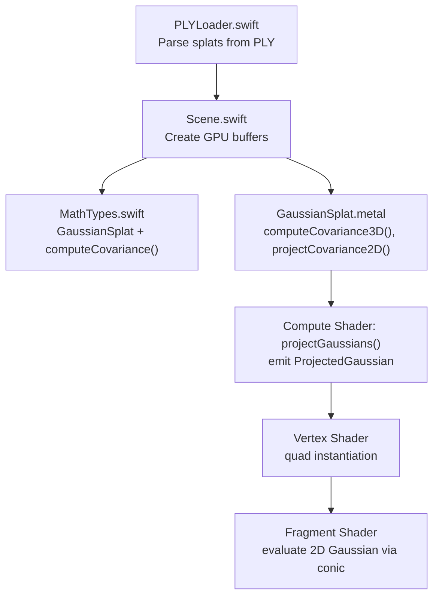
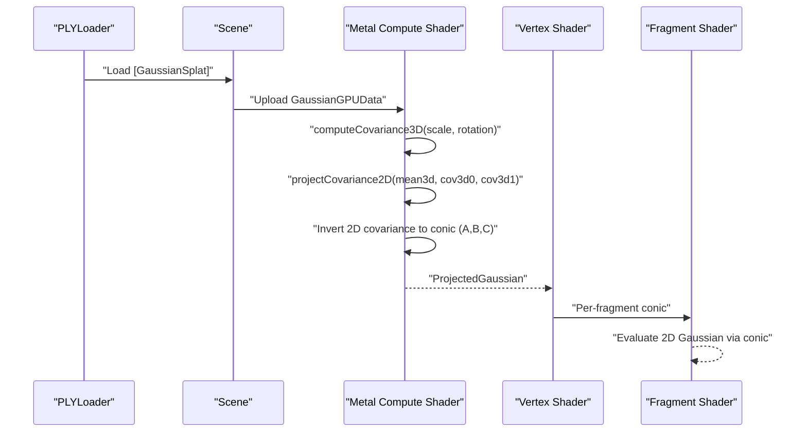
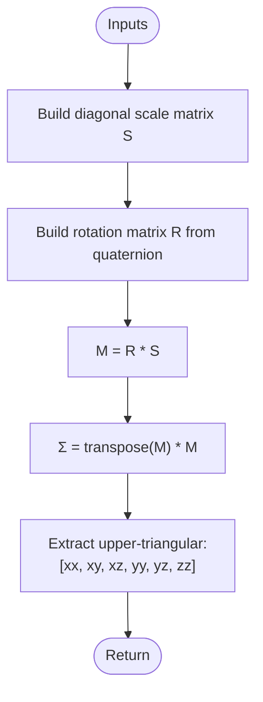
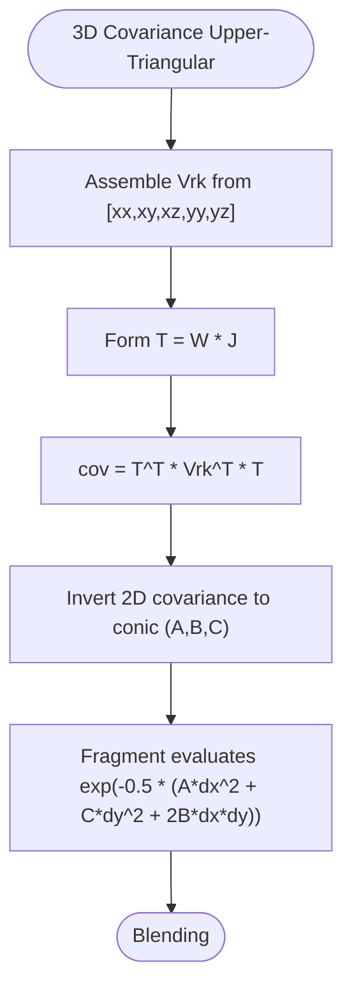
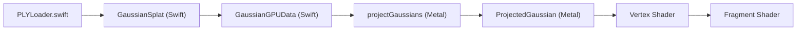

# Covariance Calculations

<cite>
**Referenced Files in This Document**
- [MathTypes.swift](file://Math/MathTypes.swift)
- [GaussianSplat.metal](file://Shaders/GaussianSplat.metal)
- [Scene.swift](file://Scene/Scene.swift)
- [PLYLoader.swift](file://Scene/PLYLoader.swift)
</cite>

## Table of Contents
1. [Introduction](#introduction)
2. [Project Structure](#project-structure)
3. [Core Components](#core-components)
4. [Architecture Overview](#architecture-overview)
5. [Detailed Component Analysis](#detailed-component-analysis)
6. [Dependency Analysis](#dependency-analysis)
7. [Performance Considerations](#performance-considerations)
8. [Troubleshooting Guide](#troubleshooting-guide)
9. [Conclusion](#conclusion)

## Introduction
This document explains how covariance matrices are computed and used in Gaussian splat rendering. It covers the mathematical derivation of 3D covariance from scale and rotation parameters, the implementation of the computeCovariance method, the GPU-friendly storage format for upper-triangular elements, and the geometric interpretation of covariance in describing splat orientation and shape. It also outlines how 2D covariance is derived for projection and blending, including the conic representation used in fragment shaders.

## Project Structure
The covariance pipeline spans Swift math utilities and Metal shaders:
- CPU-side covariance computation and GPU data layout are defined in Swift math types.
- GPU-side covariance computation, projection, and rendering are implemented in Metal shaders.
- Scene orchestration manages GPU buffers and integrates PLY-loaded splats.

**Diagram sources**
- [PLYLoader.swift:321-385](file://Scene/PLYLoader.swift#L321-L385)
- [Scene.swift:58-78](file://Scene/Scene.swift#L58-L78)
- [MathTypes.swift:170-188](file://Math/MathTypes.swift#L170-L188)
- [GaussianSplat.metal:65-142](file://Shaders/GaussianSplat.metal#L65-L142)
- [GaussianSplat.metal:146-209](file://Shaders/GaussianSplat.metal#L146-L209)

**Section sources**
- [MathTypes.swift:10-74](file://Math/MathTypes.swift#L10-L74)
- [GaussianSplat.metal:6-42](file://Shaders/GaussianSplat.metal#L6-L42)
- [Scene.swift:58-78](file://Scene/Scene.swift#L58-L78)

## Core Components
- GaussianSplat: Holds position, scale, rotation (quaternion), color, and opacity. Includes computeCovariance() returning upper-triangular elements of the 3D covariance matrix.
- GaussianGPUData: CPU-to-GPU transfer structure mirroring GaussianSplat with padding for alignment.
- ProjectedGaussian: Per-splat data after projection, including 2D covariance’s upper triangle stored as a float3 conic for efficient GPU access.
- Metal shader functions:
  - computeCovariance3D: Builds 3D covariance from scale and rotation.
  - projectCovariance2D: Projects 3D covariance into 2D screen space using the camera Jacobian and view rotation.
  - projectGaussians: Orchestrates GPU covariance computation, 2D projection, conic inversion, and emits per-splat data.

**Section sources**
- [MathTypes.swift:12-30](file://Math/MathTypes.swift#L12-L30)
- [MathTypes.swift:35-51](file://Math/MathTypes.swift#L35-L51)
- [MathTypes.swift:65-73](file://Math/MathTypes.swift#L65-L73)
- [MathTypes.swift:170-188](file://Math/MathTypes.swift#L170-L188)
- [GaussianSplat.metal:6-42](file://Shaders/GaussianSplat.metal#L6-L42)
- [GaussianSplat.metal:65-142](file://Shaders/GaussianSplat.metal#L65-L142)
- [GaussianSplat.metal:146-209](file://Shaders/GaussianSplat.metal#L146-L209)

## Architecture Overview
The covariance pipeline proceeds as follows:
- PLYLoader loads splats with position, scale, rotation, color, and opacity.
- Scene creates GPU buffers for splat data and projected outputs.
- On GPU:
  - computeCovariance3D derives the 3D covariance from scale and rotation.
  - projectCovariance2D projects the 3D covariance into 2D using the camera Jacobian and view rotation.
  - The 2D covariance is inverted to form the conic matrix (A, B, C).
  - The compute shader emits ProjectedGaussian entries consumed by vertex and fragment shaders.

**Diagram sources**
- [PLYLoader.swift:321-385](file://Scene/PLYLoader.swift#L321-L385)
- [Scene.swift:58-78](file://Scene/Scene.swift#L58-L78)
- [GaussianSplat.metal:65-142](file://Shaders/GaussianSplat.metal#L65-L142)
- [GaussianSplat.metal:146-209](file://Shaders/GaussianSplat.metal#L146-L209)
- [GaussianSplat.metal:253-278](file://Shaders/GaussianSplat.metal#L253-L278)

## Detailed Component Analysis

### Mathematical Background: Covariance Matrices and Gaussian Splatting
- A covariance matrix describes the spread and orientation of a distribution. For 3D Gaussians, it is symmetric and positive semi-definite.
- In Gaussian splatting, the 3D covariance encodes how the underlying 3D distribution is stretched and rotated by the scale vector and rotation quaternion.
- The 2D covariance is derived by projecting the 3D covariance into screen space using the camera Jacobian and view rotation, enabling efficient 2D blending and compositing.

[No sources needed since this section provides general mathematical background]

### Derivation: 3D Covariance from Scale and Rotation
- Let S be a diagonal 3x3 scale matrix built from the splat’s scale vector.
- Let R be the 3x3 rotation matrix derived from the quaternion.
- The 3D covariance is computed as Σ = R · S · S^T · R^T. Since S is diagonal, S · S^T = S^2, so Σ = (R · S) · (R · S)^T.
- The upper-triangular elements are extracted row-by-row: [Σ_xx, Σ_xy, Σ_xz, Σ_yy, Σ_yz, Σ_zz].

**Diagram sources**
- [MathTypes.swift:170-188](file://Math/MathTypes.swift#L170-L188)
- [GaussianSplat.metal:65-78](file://Shaders/GaussianSplat.metal#L65-L78)

**Section sources**
- [MathTypes.swift:170-188](file://Math/MathTypes.swift#L170-L188)
- [GaussianSplat.metal:65-78](file://Shaders/GaussianSplat.metal#L65-L78)

### Implementation: computeCovariance in Swift
- The Swift extension computes the 3D covariance by constructing S and R, multiplying to get M, and forming Σ = M^T · M.
- Returns a tuple of six upper-triangular elements for downstream GPU processing.

**Section sources**
- [MathTypes.swift:170-188](file://Math/MathTypes.swift#L170-L188)

### Implementation: computeCovariance3D in Metal
- Mirrors the Swift logic: builds R from the quaternion, constructs S from scale, forms M = S · R, and computes Σ = M^T · M.
- Outputs two float3 vectors containing the upper-triangular elements for efficient GPU memory layout.

**Section sources**
- [GaussianSplat.metal:65-78](file://Shaders/GaussianSplat.metal#L65-L78)

### 2D Covariance Projection and Conic Representation
- The 3D covariance is projected into 2D using the camera Jacobian and view rotation to form T = W · J.
- A 3x3 matrix Vrk is assembled from the upper-triangular 3D covariance elements.
- The 2D covariance is cov = T^T · Vrk^T · T.
- The conic matrix (inverse covariance) is formed as conic = (A, B, C) where A = cov_xx, B = cov_xy, C = cov_yy after inversion.
- The fragment shader evaluates the 2D Gaussian using the conic terms.

**Diagram sources**
- [GaussianSplat.metal:81-142](file://Shaders/GaussianSplat.metal#L81-L142)
- [GaussianSplat.metal:253-278](file://Shaders/GaussianSplat.metal#L253-L278)

**Section sources**
- [GaussianSplat.metal:81-142](file://Shaders/GaussianSplat.metal#L81-L142)
- [GaussianSplat.metal:253-278](file://Shaders/GaussianSplat.metal#L253-L278)

### GPU Storage Format and Efficiency
- Upper-triangular elements are stored as two float3 vectors (cov3d0 = [xx, xy, xz], cov3d1 = [yy, yz, zz]) to reduce memory bandwidth and simplify reconstruction on GPU.
- Projected per-splat data uses a float3 conic for the 2D covariance inverse, minimizing register pressure and enabling fast per-pixel evaluation.

**Section sources**
- [MathTypes.swift:65-73](file://Math/MathTypes.swift#L65-L73)
- [GaussianSplat.metal:6-42](file://Shaders/GaussianSplat.metal#L6-L42)

### Geometric Interpretation
- The 3D covariance matrix determines the ellipsoidal shape and orientation of the Gaussian distribution in world space.
- After projection, the 2D covariance controls the elliptical shape and orientation of the splat on screen, influencing sampling radii and blending behavior.

**Section sources**
- [GaussianSplat.metal:81-142](file://Shaders/GaussianSplat.metal#L81-L142)

### Relationship Between Scale Matrices, Rotation Matrices, and Final Covariance
- Scale affects the magnitude of spread along principal axes.
- Rotation aligns the distribution with the splat’s orientation.
- The final covariance combines both effects: Σ = (R · S)^T · (R · S).

**Section sources**
- [MathTypes.swift:170-188](file://Math/MathTypes.swift#L170-L188)
- [GaussianSplat.metal:65-78](file://Shaders/GaussianSplat.metal#L65-L78)

## Dependency Analysis
- PLYLoader populates GaussianSplat instances with scale and rotation.
- Scene maps GaussianSplat to GaussianGPUData and uploads to GPU.
- Metal compute shader consumes GaussianGPUData, computes covariance, projects to 2D, and emits ProjectedGaussian.
- Vertex and fragment shaders consume ProjectedGaussian for rasterization and per-pixel blending.

**Diagram sources**
- [PLYLoader.swift:321-385](file://Scene/PLYLoader.swift#L321-L385)
- [MathTypes.swift:12-30](file://Math/MathTypes.swift#L12-L30)
- [MathTypes.swift:35-51](file://Math/MathTypes.swift#L35-L51)
- [GaussianSplat.metal:146-209](file://Shaders/GaussianSplat.metal#L146-L209)

**Section sources**
- [PLYLoader.swift:321-385](file://Scene/PLYLoader.swift#L321-L385)
- [Scene.swift:58-78](file://Scene/Scene.swift#L58-L78)
- [GaussianSplat.metal:146-209](file://Shaders/GaussianSplat.metal#L146-L209)

## Performance Considerations
- Using upper-triangular storage reduces memory bandwidth and simplifies reconstruction.
- Computing Σ = M^T · M avoids explicit eigen-decomposition; the conic inversion is performed per-pixel for efficiency.
- Early discard of off-screen or negligible splats reduces fragment work.
- Low-pass filtering on diagonal terms stabilizes inversion and prevents numerical artifacts.

[No sources needed since this section provides general guidance]

## Troubleshooting Guide
- Invalid or zero determinant of 2D covariance leads to zero opacity; ensure non-zero scales and proper camera placement.
- Rotation normalization: ensure quaternions are normalized before converting to rotation matrices.
- Numerical stability: small regularization (low-pass filter) improves inversion stability.
- Visibility checks: splats behind the camera are discarded to avoid projection singularities.

**Section sources**
- [GaussianSplat.metal:173-179](file://Shaders/GaussianSplat.metal#L173-L179)
- [GaussianSplat.metal:96-98](file://Shaders/GaussianSplat.metal#L96-L98)
- [GaussianSplat.metal:138-139](file://Shaders/GaussianSplat.metal#L138-L139)

## Conclusion
The covariance pipeline in Gaussian splat rendering combines compact CPU-side computation with efficient GPU-centric projection and blending. By representing 3D covariance via upper-triangular elements and deriving a stable 2D conic representation, the system achieves high-quality, performant splat rendering suitable for interactive viewing.