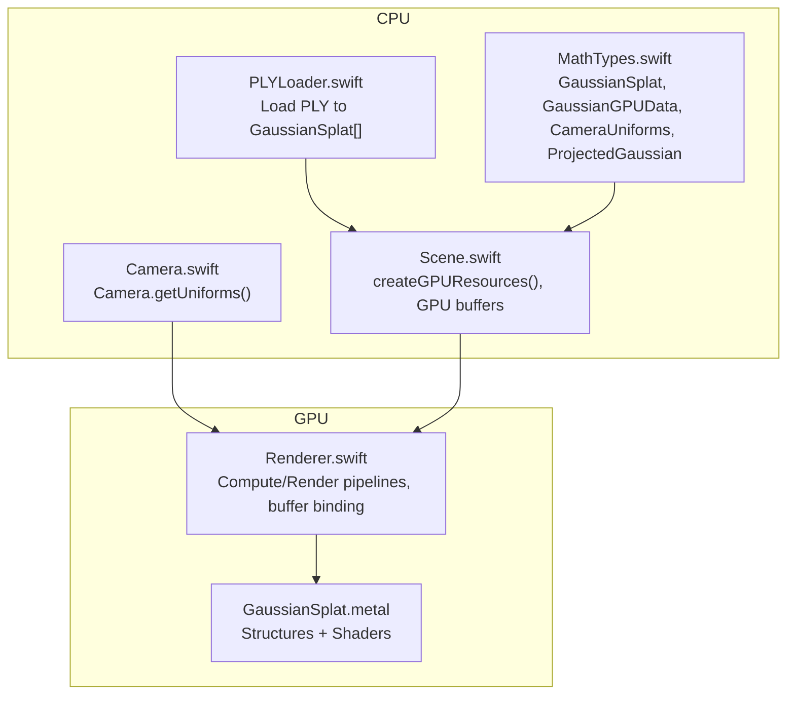
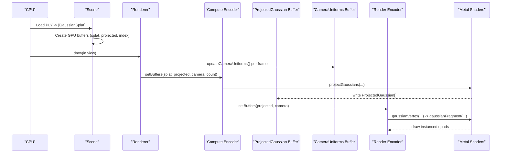
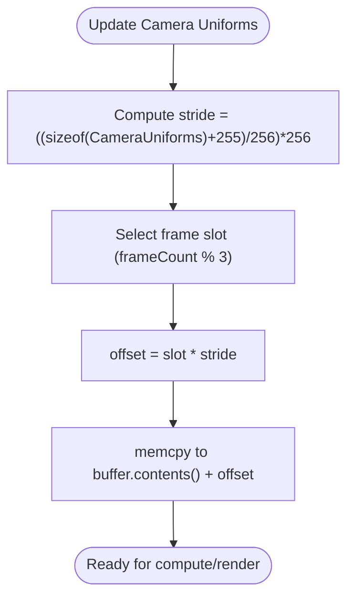
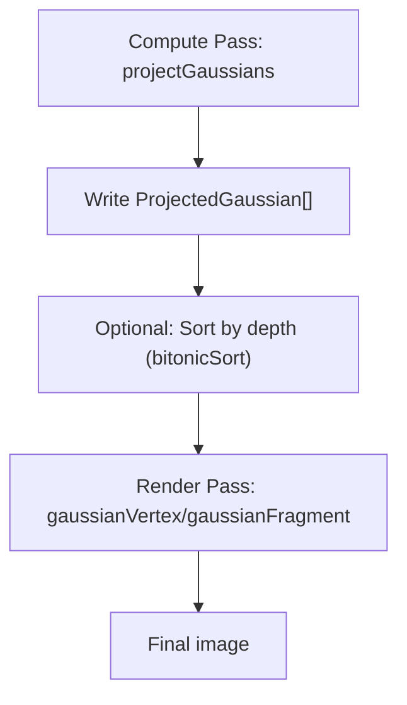
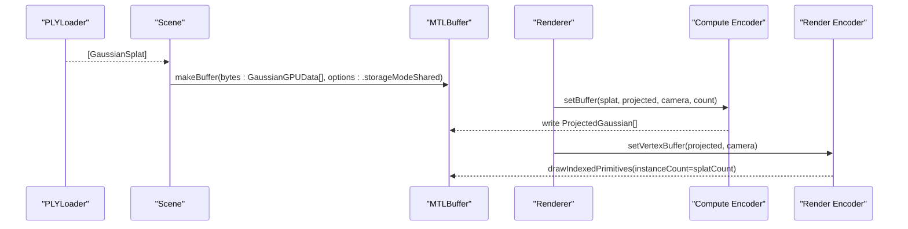
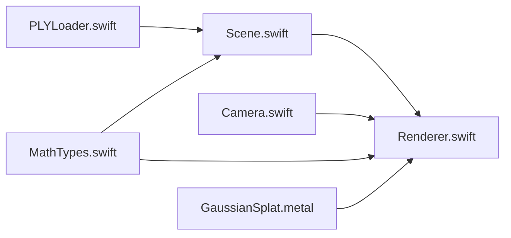

# GPU Data Structures

<cite>
**Referenced Files in This Document**
- [GaussianSplat.metal](file://Shaders/GaussianSplat.metal)
- [MathTypes.swift](file://Math/MathTypes.swift)
- [Renderer.swift](file://Rendering/Renderer.swift)
- [Scene.swift](file://Scene/Scene.swift)
- [Camera.swift](file://Rendering/Camera.swift)
- [PLYLoader.swift](file://Scene/PLYLoader.swift)
</cite>

## Table of Contents
1. [Introduction](#introduction)
2. [Project Structure](#project-structure)
3. [Core Components](#core-components)
4. [Architecture Overview](#architecture-overview)
5. [Detailed Component Analysis](#detailed-component-analysis)
6. [Dependency Analysis](#dependency-analysis)
7. [Performance Considerations](#performance-considerations)
8. [Troubleshooting Guide](#troubleshooting-guide)
9. [Conclusion](#conclusion)

## Introduction
This document explains the GPU-compatible data structures used in Gaussian splat rendering, focusing on:
- Memory layout and alignment requirements for Metal buffers
- Metal shader compatibility for GPU data structures
- The ProjectedGaussian structure for depth sorting and GPU buffer organization
- The CameraUniforms structure for uniform buffer management and matrix storage
- Practical initialization, conversion from CPU to GPU formats, and buffer binding patterns
- GPU memory hierarchy optimization and data transfer efficiency

## Project Structure
The Gaussian splat rendering pipeline is organized around three primary layers:
- CPU-side data structures and conversions
- GPU compute and render passes
- Metal shader definitions and bindings



**Diagram sources**
- [MathTypes.swift:1-189](file://Math/MathTypes.swift#L1-L189)
- [Camera.swift:133-147](file://Rendering/Camera.swift#L133-L147)
- [Scene.swift:57-95](file://Scene/Scene.swift#L57-L95)
- [Renderer.swift:166-250](file://Rendering/Renderer.swift#L166-L250)
- [GaussianSplat.metal:6-42](file://Shaders/GaussianSplat.metal#L6-L42)

**Section sources**
- [MathTypes.swift:1-189](file://Math/MathTypes.swift#L1-L189)
- [Camera.swift:133-147](file://Rendering/Camera.swift#L133-L147)
- [Scene.swift:57-95](file://Scene/Scene.swift#L57-L95)
- [Renderer.swift:166-250](file://Rendering/Renderer.swift#L166-L250)
- [GaussianSplat.metal:6-42](file://Shaders/GaussianSplat.metal#L6-L42)

## Core Components
This section documents the GPU-compatible structures and their roles.

- GaussianGPUData
  - Purpose: Per-splat data passed to the GPU compute shader.
  - Fields: position, scale, rotation (quaternion), color, opacity.
  - Alignment: Explicit padding fields are included to ensure 16-byte vector alignment for Metal’s vector types.
  - Metal compatibility: Matches the Metal structure definition and is used as the input buffer for the compute kernel.

- CameraUniforms
  - Purpose: Uniform buffer containing camera and projection matrices plus auxiliary values.
  - Fields: viewMatrix, projectionMatrix, viewProjectionMatrix, cameraPosition, screenSize, tanHalfFov.
  - Alignment: Padding ensures proper alignment for uniform buffers.
  - Binding: Triple-buffered per-frame updates to avoid CPU/GPU synchronization stalls.

- ProjectedGaussian
  - Purpose: Output of the compute pass; contains per-splat projected data for rendering and potential sorting.
  - Fields: depth, index, uv, conic (inverse covariance), color, opacity, radius.
  - Buffer organization: One per-splat entry in a GPU buffer for subsequent render and sort stages.

- GaussianSplat (CPU)
  - Purpose: CPU-side representation of a Gaussian splat with position, scale, rotation, color, opacity.
  - Conversion: Transformed into GaussianGPUData for GPU consumption.

**Section sources**
- [GaussianSplat.metal:6-14](file://Shaders/GaussianSplat.metal#L6-L14)
- [GaussianSplat.metal:16-24](file://Shaders/GaussianSplat.metal#L16-L24)
- [GaussianSplat.metal:26-34](file://Shaders/GaussianSplat.metal#L26-L34)
- [MathTypes.swift:12-30](file://Math/MathTypes.swift#L12-L30)
- [MathTypes.swift:35-51](file://Math/MathTypes.swift#L35-L51)
- [MathTypes.swift:54-62](file://Math/MathTypes.swift#L54-L62)
- [MathTypes.swift:65-73](file://Math/MathTypes.swift#L65-L73)

## Architecture Overview
The rendering pipeline consists of:
- Compute pass: Project Gaussians to screen space and produce ProjectedGaussian entries.
- Optional sorting pass: Depth-sort ProjectedGaussian entries (placeholder in current code).
- Render pass: Draw instanced quads using ProjectedGaussian data and CameraUniforms.



**Diagram sources**
- [Scene.swift:57-95](file://Scene/Scene.swift#L57-L95)
- [Renderer.swift:166-250](file://Rendering/Renderer.swift#L166-L250)
- [GaussianSplat.metal:138-201](file://Shaders/GaussianSplat.metal#L138-L201)
- [GaussianSplat.metal:205-270](file://Shaders/GaussianSplat.metal#L205-L270)

## Detailed Component Analysis

### GaussianGPUData: Memory Layout and Metal Compatibility
- Structure fields and padding:
  - position: float3 (12 bytes)
  - padding1: float (4 bytes) — aligns to 16 bytes
  - scale: float3 (12 bytes)
  - padding2: float (4 bytes) — aligns to 16 bytes
  - rotation: float4 (16 bytes)
  - color: float3 (12 bytes)
  - opacity: float (4 bytes)
- Total per-splat footprint: 64 bytes aligned to 16-byte boundaries.
- Metal compatibility:
  - The Metal shader defines an identical structure with the same field order and types.
  - The compute kernel reads GaussianGPUData from buffer(0) and writes ProjectedGaussian to buffer(1).
- Conversion from CPU:
  - CPU-side GaussianSplat is mapped to GaussianGPUData via a constructor that copies fields and sets explicit padding to zero.

```mermaid
classDiagram
class GaussianSplat {
+float3 position
+float3 scale
+float4 rotation
+float3 color
+Float opacity
}
class GaussianGPUData {
+float3 position
+Float padding1
+float3 scale
+Float padding2
+float4 rotation
+float3 color
+Float opacity
}
class Metal_GaussianGPUData {
+float3 position
+float padding1
+float3 scale
+float padding2
+float4 rotation
+float3 color
+float opacity
}
GaussianSplat --> GaussianGPUData : "init(from : )"
GaussianGPUData <.. Metal_GaussianGPUData : "matches layout"
```

**Diagram sources**
- [MathTypes.swift:12-30](file://Math/MathTypes.swift#L12-L30)
- [MathTypes.swift:35-51](file://Math/MathTypes.swift#L35-L51)
- [GaussianSplat.metal:6-14](file://Shaders/GaussianSplat.metal#L6-L14)

**Section sources**
- [MathTypes.swift:35-51](file://Math/MathTypes.swift#L35-L51)
- [GaussianSplat.metal:6-14](file://Shaders/GaussianSplat.metal#L6-L14)
- [Scene.swift:65-73](file://Scene/Scene.swift#L65-L73)

### CameraUniforms: Uniform Buffer Management and Matrix Storage
- Structure fields:
  - viewMatrix, projectionMatrix, viewProjectionMatrix: float4x4
  - cameraPosition: float3
  - padding: float (aligns to 16 bytes)
  - screenSize: float2
  - tanHalfFov: float2
- Alignment:
  - Uses a 256-byte stride for triple buffering to satisfy Metal’s uniform buffer alignment requirements.
- Binding:
  - Renderer updates a per-frame slot using a modulo-based offset to avoid contention.
  - Both compute and render passes bind the uniform buffer at index(2) and index(1) respectively.



**Diagram sources**
- [Renderer.swift:19-195](file://Rendering/Renderer.swift#L19-L195)
- [Renderer.swift:252-259](file://Rendering/Renderer.swift#L252-L259)
- [Camera.swift:133-147](file://Rendering/Camera.swift#L133-L147)

**Section sources**
- [Renderer.swift:19-195](file://Rendering/Renderer.swift#L19-L195)
- [Renderer.swift:252-259](file://Rendering/Renderer.swift#L252-L259)
- [Camera.swift:133-147](file://Rendering/Camera.swift#L133-L147)

### ProjectedGaussian: Depth Sorting and GPU Buffer Organization
- Structure fields:
  - depth: float (sorting key)
  - index: uint (original splat index)
  - uv: float2 (screen-space centroid)
  - conic: float3 (inverse covariance)
  - color: float3
  - opacity: float
  - radius: float (3-sigma radius)
- Buffer organization:
  - One ProjectedGaussian per input splat.
  - Used as vertex buffer input for the vertex shader and as the primary data for sorting.
- Sorting:
  - A bitonic sort kernel is defined in the shader; the current code path includes a placeholder for invoking it.



**Diagram sources**
- [GaussianSplat.metal:138-201](file://Shaders/GaussianSplat.metal#L138-L201)
- [GaussianSplat.metal:274-308](file://Shaders/GaussianSplat.metal#L274-L308)
- [GaussianSplat.metal:205-270](file://Shaders/GaussianSplat.metal#L205-L270)

**Section sources**
- [GaussianSplat.metal:26-34](file://Shaders/GaussianSplat.metal#L26-L34)
- [GaussianSplat.metal:138-201](file://Shaders/GaussianSplat.metal#L138-L201)
- [GaussianSplat.metal:274-308](file://Shaders/GaussianSplat.metal#L274-L308)

### CPU-to-GPU Conversion and Buffer Binding Patterns
- Conversion:
  - PLYLoader produces GaussianSplat[] from disk.
  - Scene creates GaussianGPUData[] and uploads to a shared buffer.
  - Camera.getUniforms() constructs CameraUniforms for the current frame.
- Buffer binding:
  - Compute encoder binds:
    - buffer(0): splatBuffer (GaussianGPUData[])
    - buffer(1): projectedBuffer (ProjectedGaussian[])
    - buffer(2): cameraUniformsBuffer (CameraUniforms)
    - buffer(3): splatCount (UInt32)
  - Render encoder binds:
    - vertex buffer(0): projectedBuffer
    - vertex buffer(1): cameraUniformsBuffer
    - index buffer: quad indices for instanced drawing



**Diagram sources**
- [PLYLoader.swift:42-68](file://Scene/PLYLoader.swift#L42-L68)
- [Scene.swift:65-73](file://Scene/Scene.swift#L65-L73)
- [Renderer.swift:190-209](file://Rendering/Renderer.swift#L190-L209)
- [Renderer.swift:225-238](file://Rendering/Renderer.swift#L225-L238)

**Section sources**
- [PLYLoader.swift:42-68](file://Scene/PLYLoader.swift#L42-L68)
- [Scene.swift:65-73](file://Scene/Scene.swift#L65-L73)
- [Renderer.swift:190-209](file://Rendering/Renderer.swift#L190-L209)
- [Renderer.swift:225-238](file://Rendering/Renderer.swift#L225-L238)

## Dependency Analysis
- CPU structures depend on Metal types via SIMD aliases.
- Scene depends on PLYLoader for initial data and on Metal device for GPU buffers.
- Renderer depends on Camera for uniforms and on Scene for GPU buffers.
- Shaders depend on structures defined in the shader file and on Metal runtime for buffer indexing.



**Diagram sources**
- [PLYLoader.swift:42-68](file://Scene/PLYLoader.swift#L42-L68)
- [Scene.swift:57-95](file://Scene/Scene.swift#L57-L95)
- [Renderer.swift:166-250](file://Rendering/Renderer.swift#L166-L250)
- [Camera.swift:133-147](file://Rendering/Camera.swift#L133-L147)
- [MathTypes.swift:1-189](file://Math/MathTypes.swift#L1-L189)
- [GaussianSplat.metal:6-42](file://Shaders/GaussianSplat.metal#L6-L42)

**Section sources**
- [PLYLoader.swift:42-68](file://Scene/PLYLoader.swift#L42-L68)
- [Scene.swift:57-95](file://Scene/Scene.swift#L57-L95)
- [Renderer.swift:166-250](file://Rendering/Renderer.swift#L166-L250)
- [Camera.swift:133-147](file://Rendering/Camera.swift#L133-L147)
- [MathTypes.swift:1-189](file://Math/MathTypes.swift#L1-L189)
- [GaussianSplat.metal:6-42](file://Shaders/GaussianSplat.metal#L6-L42)

## Performance Considerations
- Memory alignment and stride
  - GaussianGPUData is 64 bytes per element; Metal prefers 16-byte alignment for vector types and 256-byte uniform strides for uniform buffers.
  - Scene uses stride calculation to ensure proper alignment for GPU access.
- Buffer storage modes
  - Splat buffer uses shared storage for efficient CPU/GPU sharing.
  - Projected buffer uses private storage to minimize cross-queue synchronization overhead.
- Triple-buffered uniforms
  - Uniforms are triple-buffered to avoid CPU/GPU synchronization stalls; offsets are computed per frame.
- Compute dispatch sizing
  - Compute kernels dispatch in groups sized to 256 threads; adjust based on device capabilities and workload.
- Sorting overhead
  - Depth sorting is currently a placeholder; implement bitonic sort or other GPU sorting primitives to reduce overdraw and improve blending quality.

[No sources needed since this section provides general guidance]

## Troubleshooting Guide
- Uniform buffer misalignment
  - Symptom: Incorrect matrices or artifacts.
  - Fix: Ensure uniform stride is a multiple of 256 bytes and use modulo-based offsets per frame.
  - Reference: [Renderer.swift:19](file://Rendering/Renderer.swift#L19), [Renderer.swift:252-259](file://Rendering/Renderer.swift#L252-L259)
- Incorrect padding causing layout mismatches
  - Symptom: Wrong field values in shaders.
  - Fix: Verify padding fields match Metal structure definitions.
  - Reference: [GaussianSplat.metal:6-14](file://Shaders/GaussianSplat.metal#L6-L14)
- Missing or empty GPU buffers
  - Symptom: No rendering output.
  - Fix: Confirm Scene created buffers and splatCount is non-zero.
  - Reference: [Scene.swift:57-95](file://Scene/Scene.swift#L57-L95)
- Sorting not applied
  - Symptom: Depth artifacts or incorrect blending order.
  - Fix: Implement bitonic sort invocation in the render loop.
  - Reference: [GaussianSplat.metal:274-308](file://Shaders/GaussianSplat.metal#L274-L308), [Renderer.swift:213-217](file://Rendering/Renderer.swift#L213-L217)

**Section sources**
- [Renderer.swift:19](file://Rendering/Renderer.swift#L19)
- [Renderer.swift:252-259](file://Rendering/Renderer.swift#L252-L259)
- [GaussianSplat.metal:6-14](file://Shaders/GaussianSplat.metal#L6-L14)
- [Scene.swift:57-95](file://Scene/Scene.swift#L57-L95)
- [GaussianSplat.metal:274-308](file://Shaders/GaussianSplat.metal#L274-L308)
- [Renderer.swift:213-217](file://Rendering/Renderer.swift#L213-L217)

## Conclusion
The Gaussian splat rendering pipeline relies on carefully aligned CPU and GPU data structures:
- GaussianGPUData ensures 16-byte vector alignment and matches the Metal structure for efficient compute shader consumption.
- CameraUniforms uses 256-byte stride triple buffering for robust uniform updates.
- ProjectedGaussian organizes per-splat projected data for rendering and future sorting.
- Proper buffer creation, conversion from CPU to GPU formats, and binding patterns enable efficient GPU memory hierarchy utilization and data transfer.

[No sources needed since this section summarizes without analyzing specific files]