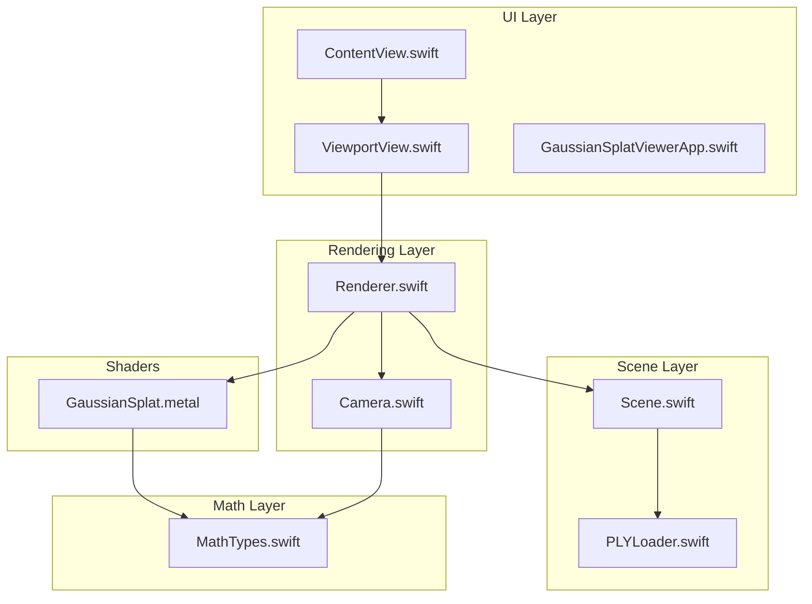
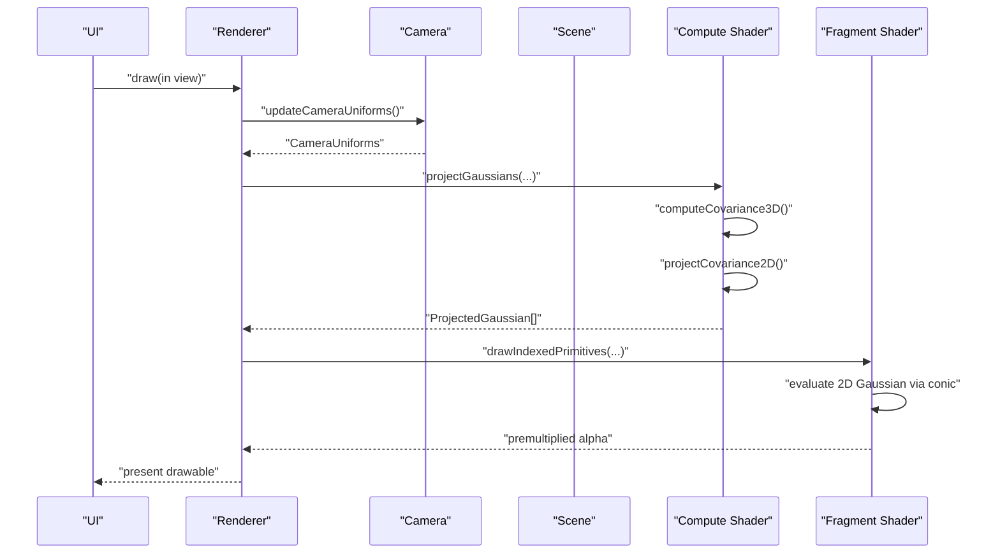
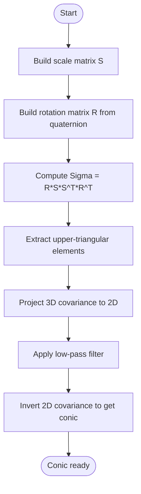
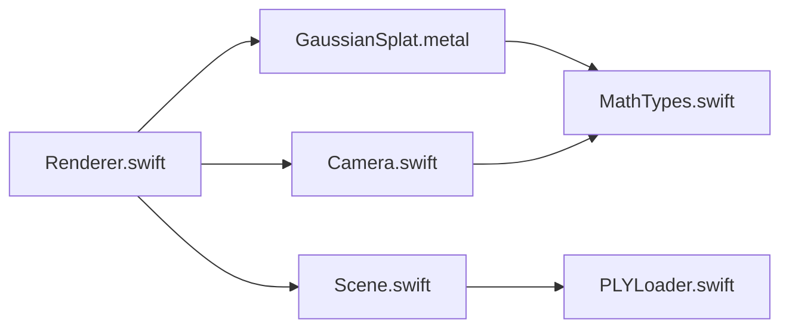

# Gaussian Splat Theory

<cite>
**Referenced Files in This Document**
- [MathTypes.swift](file://Math/MathTypes.swift)
- [GaussianSplat.metal](file://Shaders/GaussianSplat.metal)
- [Renderer.swift](file://Rendering/Renderer.swift)
- [Camera.swift](file://Rendering/Camera.swift)
- [Scene.swift](file://Scene/Scene.swift)
- [PLYLoader.swift](file://Scene/PLYLoader.swift)
- [ViewportView.swift](file://UI/ViewportView.swift)
- [ContentView.swift](file://UI/ContentView.swift)
- [GaussianSplatViewerApp.swift](file://GaussianSplatViewerApp.swift)
</cite>

## Table of Contents
1. [Introduction](#introduction)
2. [Project Structure](#project-structure)
3. [Core Components](#core-components)
4. [Architecture Overview](#architecture-overview)
5. [Detailed Component Analysis](#detailed-component-analysis)
6. [Dependency Analysis](#dependency-analysis)
7. [Performance Considerations](#performance-considerations)
8. [Troubleshooting Guide](#troubleshooting-guide)
9. [Conclusion](#conclusion)
10. [Appendices](#appendices)

## Introduction
This document explains the mathematical foundations and theory behind Gaussian splatting as a 3D rendering technique. It focuses on how probability density functions define spatial distributions around 3D points, how splats are projected onto screenspace, and how their blending and transparency are computed. The goal is to make the mathematics accessible to readers with limited technical background while grounding explanations in the actual implementation present in the codebase.

## Project Structure
The project is organized into modular Swift and Metal components:
- Math: Core mathematical types and conversions (quaternions, matrices, covariance computation)
- Rendering: Camera, renderer, and Metal pipeline creation
- Scene: PLY file loading and GPU buffer management
- Shaders: Compute and fragment shaders implementing projection, conic evaluation, and blending
- UI: SwiftUI views and Metal viewport integration

**Diagram sources**
- [ContentView.swift:1-130](file://UI/ContentView.swift#L1-L130)
- [ViewportView.swift:1-185](file://UI/ViewportView.swift#L1-L185)
- [GaussianSplatViewerApp.swift:1-13](file://GaussianSplatViewerApp.swift#L1-L13)
- [Scene.swift:1-140](file://Scene/Scene.swift#L1-L140)
- [PLYLoader.swift:1-403](file://Scene/PLYLoader.swift#L1-L403)
- [Camera.swift:1-184](file://Rendering/Camera.swift#L1-L184)
- [Renderer.swift:1-288](file://Rendering/Renderer.swift#L1-L288)
- [MathTypes.swift:1-189](file://Math/MathTypes.swift#L1-L189)
- [GaussianSplat.metal:1-309](file://Shaders/GaussianSplat.metal#L1-L309)

**Section sources**
- [ContentView.swift:1-130](file://UI/ContentView.swift#L1-L130)
- [ViewportView.swift:1-185](file://UI/ViewportView.swift#L1-L185)
- [GaussianSplatViewerApp.swift:1-13](file://GaussianSplatViewerApp.swift#L1-L13)
- [Scene.swift:1-140](file://Scene/Scene.swift#L1-L140)
- [PLYLoader.swift:1-403](file://Scene/PLYLoader.swift#L1-L403)
- [Camera.swift:1-184](file://Rendering/Camera.swift#L1-L184)
- [Renderer.swift:1-288](file://Rendering/Renderer.swift#L1-L288)
- [MathTypes.swift:1-189](file://Math/MathTypes.swift#L1-L189)
- [GaussianSplat.metal:1-309](file://Shaders/GaussianSplat.metal#L1-L309)

## Core Components
- Gaussian splat data structure: position, scale, rotation (quaternion), color, opacity
- GPU-compatible structure for passing per-splat data to Metal
- Camera and projection matrices for view and clip transformations
- 3D covariance computation from scale and rotation
- 2D covariance projection and conic (inverse covariance) calculation
- 2D Gaussian density evaluation for splat sampling
- Blending and transparency using exponential falloff and premultiplied alpha

Key implementation references:
- Gaussian splat definition and GPU data conversion: [MathTypes.swift:12-51](file://Math/MathTypes.swift#L12-L51)
- Covariance computation from scale and rotation: [MathTypes.swift:170-187](file://Math/MathTypes.swift#L170-L187)
- Projection and conic calculation in Metal compute shader: [GaussianSplat.metal:138-201](file://Shaders/GaussianSplat.metal#L138-L201)
- 2D Gaussian evaluation and alpha compositing: [GaussianSplat.metal:245-270](file://Shaders/GaussianSplat.metal#L245-L270)
- Camera matrices and uniforms: [Camera.swift:63-84](file://Rendering/Camera.swift#L63-L84), [Camera.swift:134-147](file://Rendering/Camera.swift#L134-L147)

**Section sources**
- [MathTypes.swift:12-51](file://Math/MathTypes.swift#L12-L51)
- [MathTypes.swift:170-187](file://Math/MathTypes.swift#L170-L187)
- [GaussianSplat.metal:138-201](file://Shaders/GaussianSplat.metal#L138-L201)
- [GaussianSplat.metal:245-270](file://Shaders/GaussianSplat.metal#L245-L270)
- [Camera.swift:63-84](file://Rendering/Camera.swift#L63-L84)
- [Camera.swift:134-147](file://Rendering/Camera.swift#L134-L147)

## Architecture Overview
The rendering pipeline follows a compute-first approach:
1. Compute pass: Each Gaussian is transformed into view space, its 3D covariance is computed, projected to 2D, inverted to form the conic, and auxiliary data (depth, radius, UV) are stored.
2. Optional depth sorting: Indices are sorted by depth to improve blending quality.
3. Render pass: Instanced quads are drawn per splat; the fragment shader evaluates a 2D Gaussian density using the conic and computes premultiplied alpha for blending.

**Diagram sources**
- [Renderer.swift:166-250](file://Rendering/Renderer.swift#L166-L250)
- [Camera.swift:252-259](file://Rendering/Camera.swift#L252-L259)
- [GaussianSplat.metal:138-201](file://Shaders/GaussianSplat.metal#L138-L201)
- [GaussianSplat.metal:245-270](file://Shaders/GaussianSplat.metal#L245-L270)

## Detailed Component Analysis

### Mathematical Foundations of Gaussian Splatting
- Probability density interpretation: Each Gaussian defines a continuous 3D distribution centered at the splat’s position. The 2D projection of this distribution forms an elliptical intensity envelope on screen, approximating soft, translucent surfaces typical of point cloud data.
- 2D Gaussian density: The fragment shader evaluates a quadratic form using the conic (inverse covariance) to determine per-pixel intensity. The exponent controls the falloff, and opacity modulates the maximum intensity.

References:
- 2D Gaussian evaluation and alpha: [GaussianSplat.metal:245-270](file://Shaders/GaussianSplat.metal#L245-L270)

**Section sources**
- [GaussianSplat.metal:245-270](file://Shaders/GaussianSplat.metal#L245-L270)

### Gaussian Data Structures and Parameters
- Position: 3D vector representing the splat’s centroid.
- Scale: 3D vector controlling extent along principal axes; squared magnitudes appear in the covariance.
- Rotation: Quaternion representing orientation; converted to a 3x3 rotation matrix for covariance computation.
- Color and Opacity: Per-splat RGB color and visibility factor.

References:
- Definition and initialization: [MathTypes.swift:12-30](file://Math/MathTypes.swift#L12-L30)
- GPU-compatible layout: [MathTypes.swift:35-51](file://Math/MathTypes.swift#L35-L51)

**Section sources**
- [MathTypes.swift:12-30](file://Math/MathTypes.swift#L12-L30)
- [MathTypes.swift:35-51](file://Math/MathTypes.swift#L35-L51)

### Covariance and Geometric Interpretation
- From scale and rotation: The 3D covariance is computed as R S S^T R^T, where S is diagonal scale and R is the rotation matrix derived from the quaternion. This yields an ellipsoidal spread aligned with the splat’s orientation.
- 2D projection: The 3D covariance is transformed into 2D using the Jacobian of perspective projection and the view-space rotation, yielding a 2D covariance matrix.
- Conic (inverse covariance): The inverse of the 2D covariance is computed and used for efficient 2D Gaussian evaluation.

References:
- 3D covariance computation: [MathTypes.swift:170-187](file://Math/MathTypes.swift#L170-L187)
- 3D->2D projection and conic: [GaussianSplat.metal:76-134](file://Shaders/GaussianSplat.metal#L76-L134)
- Compute shader projection and conic inversion: [GaussianSplat.metal:157-201](file://Shaders/GaussianSplat.metal#L157-L201)

**Diagram sources**
- [MathTypes.swift:170-187](file://Math/MathTypes.swift#L170-L187)
- [GaussianSplat.metal:64-134](file://Shaders/GaussianSplat.metal#L64-L134)

**Section sources**
- [MathTypes.swift:170-187](file://Math/MathTypes.swift#L170-L187)
- [GaussianSplat.metal:64-134](file://Shaders/GaussianSplat.metal#L64-L134)
- [GaussianSplat.metal:157-201](file://Shaders/GaussianSplat.metal#L157-L201)

### Projection and Screen-Space Geometry
- View and projection transforms: Camera matrices convert world coordinates to clip space; NDC-to-screen mapping positions splats on pixels.
- Radius estimation: The 3D covariance eigenvalues inform the splat’s screen-space extent; a conservative radius is computed using 3-sigma bounds.
- Visibility checks: Splats behind the camera are discarded.

References:
- Projection and radius computation: [GaussianSplat.metal:157-199](file://Shaders/GaussianSplat.metal#L157-L199)
- Camera matrices and uniforms: [Camera.swift:63-84](file://Rendering/Camera.swift#L63-L84), [Camera.swift:134-147](file://Rendering/Camera.swift#L134-L147)

**Section sources**
- [GaussianSplat.metal:157-199](file://Shaders/GaussianSplat.metal#L157-L199)
- [Camera.swift:63-84](file://Rendering/Camera.swift#L63-L84)
- [Camera.swift:134-147](file://Rendering/Camera.swift#L134-L147)

### Blending and Transparency
- Exponential falloff: The 2D Gaussian exponent determines alpha contribution; opacity scales the maximum intensity.
- Premultiplied alpha: Colors are multiplied by alpha before output, enabling correct blending with destination alpha.
- Discard threshold: Fragments with negligible alpha are discarded to optimize performance.

References:
- Blending equation and discard logic: [GaussianSplat.metal:245-270](file://Shaders/GaussianSplat.metal#L245-L270)

**Section sources**
- [GaussianSplat.metal:245-270](file://Shaders/GaussianSplat.metal#L245-L270)

### Relationship to Traditional Polygon-Based Rendering
- Point cloud representation: Instead of triangles, Gaussian splats represent surfaces as smooth, continuous distributions around sparse 3D points.
- Advantages:
  - Natural handling of heterogeneous point densities and orientations
  - Smooth appearance without explicit tessellation
  - Efficient per-splat geometry with compact GPU buffers
- Differences:
  - No triangle connectivity; splats are independently rasterized
  - Depth sorting is often beneficial for correct blending
  - Rendering cost scales with number of splats rather than triangles

[No sources needed since this section provides conceptual comparison]

### Data Flow and Pipeline
- Scene loading: PLYLoader parses Gaussian parameters and constructs splat arrays; Scene creates GPU buffers.
- Compute pass: Each splat is processed to produce projected data (depth, conic, radius).
- Render pass: Instanced quads are drawn; fragment shader evaluates Gaussian density and blends.

References:
- Scene GPU buffer creation: [Scene.swift:57-95](file://Scene/Scene.swift#L57-L95)
- Renderer draw loop: [Renderer.swift:166-250](file://Rendering/Renderer.swift#L166-L250)
- PLY parsing and splat construction: [PLYLoader.swift:41-68](file://Scene/PLYLoader.swift#L41-L68), [PLYLoader.swift:321-385](file://Scene/PLYLoader.swift#L321-L385)

**Section sources**
- [Scene.swift:57-95](file://Scene/Scene.swift#L57-L95)
- [Renderer.swift:166-250](file://Rendering/Renderer.swift#L166-L250)
- [PLYLoader.swift:41-68](file://Scene/PLYLoader.swift#L41-L68)
- [PLYLoader.swift:321-385](file://Scene/PLYLoader.swift#L321-L385)

## Dependency Analysis
- Renderer depends on Camera for uniforms and on Scene for GPU buffers and splat count.
- Shaders depend on MathTypes for GPU-compatible structures and on Camera for matrices.
- Scene depends on PLYLoader for data ingestion.

**Diagram sources**
- [Renderer.swift:1-288](file://Rendering/Renderer.swift#L1-L288)
- [Camera.swift:1-184](file://Rendering/Camera.swift#L1-L184)
- [Scene.swift:1-140](file://Scene/Scene.swift#L1-L140)
- [PLYLoader.swift:1-403](file://Scene/PLYLoader.swift#L1-L403)
- [GaussianSplat.metal:1-309](file://Shaders/GaussianSplat.metal#L1-L309)
- [MathTypes.swift:1-189](file://Math/MathTypes.swift#L1-L189)

**Section sources**
- [Renderer.swift:1-288](file://Rendering/Renderer.swift#L1-L288)
- [Camera.swift:1-184](file://Rendering/Camera.swift#L1-L184)
- [Scene.swift:1-140](file://Scene/Scene.swift#L1-L140)
- [PLYLoader.swift:1-403](file://Scene/PLYLoader.swift#L1-L403)
- [GaussianSplat.metal:1-309](file://Shaders/GaussianSplat.metal#L1-L309)
- [MathTypes.swift:1-189](file://Math/MathTypes.swift#L1-L189)

## Performance Considerations
- Compute vs. memory trade-offs: The compute shader performs per-splat work; keep splat counts reasonable for interactive framerates.
- Sorting: Depth sorting improves blending quality but adds overhead; the code includes a placeholder for future implementation.
- Alpha discard: Early discard of low-opacity fragments reduces fill cost.
- Buffer alignment: Uniform buffers use padded strides to satisfy Metal alignment requirements.

[No sources needed since this section provides general guidance]

## Troubleshooting Guide
- No splats rendered:
  - Verify PLY file contains required properties (position) and that parsing succeeds.
  - Confirm Scene GPU buffers are created and splatCount is nonzero.
- Splats appear too small or large:
  - Check scale values and camera FOV; verify focal length extraction and radius computation.
- Incorrect blending or artifacts:
  - Ensure conic inversion is performed and determinant is non-zero.
  - Validate premultiplied alpha and discard thresholds.

References:
- PLY parsing and errors: [PLYLoader.swift:4-10](file://Scene/PLYLoader.swift#L4-L10), [PLYLoader.swift:41-68](file://Scene/PLYLoader.swift#L41-L68)
- GPU buffer creation and state: [Scene.swift:57-95](file://Scene/Scene.swift#L57-L95)
- Conic inversion and determinant checks: [GaussianSplat.metal:165-173](file://Shaders/GaussianSplat.metal#L165-L173)

**Section sources**
- [PLYLoader.swift:4-10](file://Scene/PLYLoader.swift#L4-L10)
- [PLYLoader.swift:41-68](file://Scene/PLYLoader.swift#L41-L68)
- [Scene.swift:57-95](file://Scene/Scene.swift#L57-L95)
- [GaussianSplat.metal:165-173](file://Shaders/GaussianSplat.metal#L165-L173)

## Conclusion
Gaussian splatting represents a powerful paradigm for rendering point clouds as smooth, translucent surfaces. By modeling each point as a 3D Gaussian and projecting its covariance into screen space, the technique achieves visually pleasing results with efficient per-splat geometry. The codebase demonstrates a clean separation of concerns: robust math utilities, a compute-first Metal pipeline, and straightforward UI integration. Proper handling of covariance projection, conic inversion, and premultiplied alpha ensures correct blending and performance.

[No sources needed since this section summarizes without analyzing specific files]

## Appendices

### Appendix A: Mathematical Derivations

- 2D Gaussian density:
  - The fragment shader evaluates a quadratic form using the conic coefficients (inverse covariance) to compute the exponent. The resulting alpha is capped and multiplied by opacity, then premultiplied into the color channel.

  Reference:
  - [GaussianSplat.metal:245-270](file://Shaders/GaussianSplat.metal#L245-L270)

- Covariance propagation under projection:
  - The 2D covariance is derived from the 3D covariance via the Jacobian of perspective projection and the view-space rotation. A small low-pass term stabilizes inversion.

  References:
  - [GaussianSplat.metal:76-134](file://Shaders/GaussianSplat.metal#L76-L134)
  - [MathTypes.swift:170-187](file://Math/MathTypes.swift#L170-L187)

- Screen-space radius:
  - The radius is estimated from the eigenvalues of the 2D covariance, using 3-sigma bounds to bound the support.

  Reference:
  - [GaussianSplat.metal:184-188](file://Shaders/GaussianSplat.metal#L184-L188)

**Section sources**
- [GaussianSplat.metal:245-270](file://Shaders/GaussianSplat.metal#L245-L270)
- [GaussianSplat.metal:76-134](file://Shaders/GaussianSplat.metal#L76-L134)
- [MathTypes.swift:170-187](file://Math/MathTypes.swift#L170-L187)
- [GaussianSplat.metal:184-188](file://Shaders/GaussianSplat.metal#L184-L188)