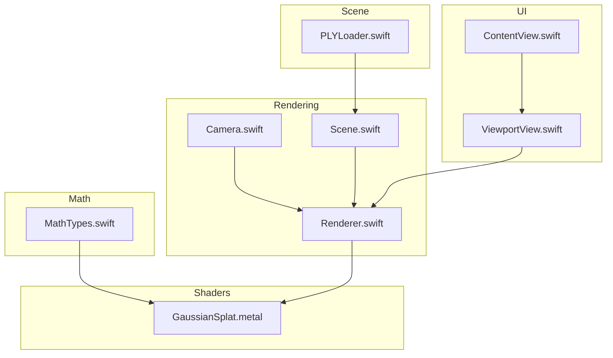
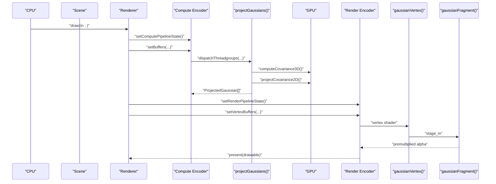
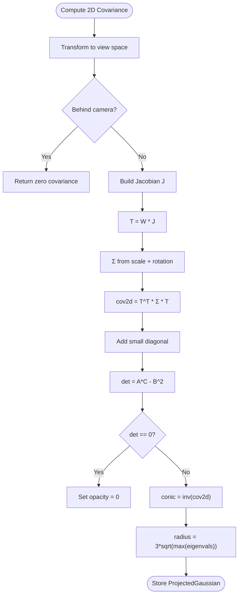
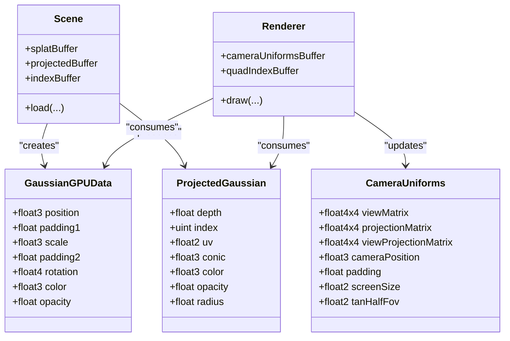
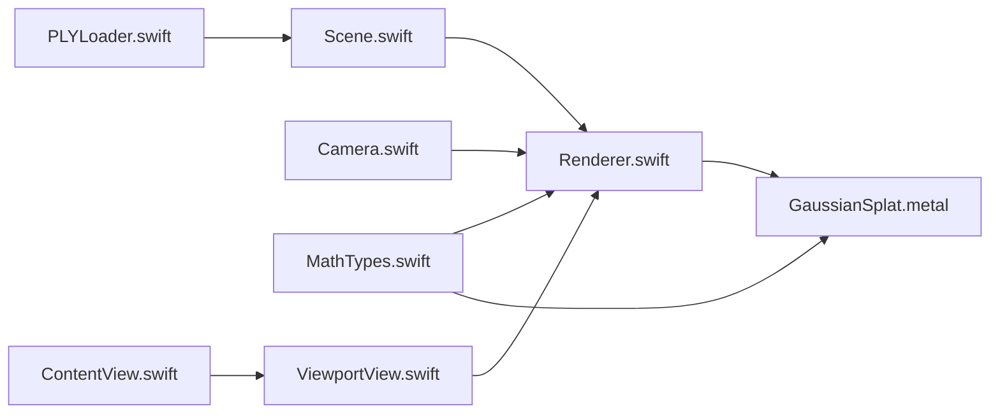

# Mathematical Foundation

<cite>
**Referenced Files in This Document**
- [MathTypes.swift](file://Math/MathTypes.swift)
- [GaussianSplat.metal](file://Shaders/GaussianSplat.metal)
- [Camera.swift](file://Rendering/Camera.swift)
- [Renderer.swift](file://Rendering/Renderer.swift)
- [Scene.swift](file://Scene/Scene.swift)
- [PLYLoader.swift](file://Scene/PLYLoader.swift)
- [ViewportView.swift](file://UI/ViewportView.swift)
- [ContentView.swift](file://UI/ContentView.swift)
</cite>

## Table of Contents
1. [Introduction](#introduction)
2. [Project Structure](#project-structure)
3. [Core Components](#core-components)
4. [Architecture Overview](#architecture-overview)
5. [Detailed Component Analysis](#detailed-component-analysis)
6. [Dependency Analysis](#dependency-analysis)
7. [Performance Considerations](#performance-considerations)
8. [Troubleshooting Guide](#troubleshooting-guide)
9. [Conclusion](#conclusion)
10. [Appendices](#appendices)

## Introduction
This document establishes the mathematical foundation for Gaussian splatting rendering in this project. It covers the data structures used to represent 3D Gaussians, the GPU-compatible memory layouts, and the mathematical machinery for computing 2D projections, covariance propagation under perspective projection, and rasterization via instanced quads. It also documents the vector and matrix operations, quaternion mathematics for 3D rotations, and perspective projection concepts. Finally, it explains the GPU data structures optimized for Metal shaders, including uniform buffers and structured buffers, and provides guidance on numerical precision and performance.

## Project Structure
The project is organized around a clear separation of concerns:
- Math and geometry: Swift math types and extensions define the core data structures and operations.
- Rendering: Metal-based compute and render passes implement projection, sorting, and rasterization.
- Scene loading: PLY loader parses Gaussian splat data from disk.
- UI: SwiftUI and MTKView integrate user input and rendering.

**Diagram sources**
- [MathTypes.swift:1-189](file://Math/MathTypes.swift#L1-L189)
- [GaussianSplat.metal:1-309](file://Shaders/GaussianSplat.metal#L1-L309)
- [Camera.swift:1-184](file://Rendering/Camera.swift#L1-L184)
- [Renderer.swift:1-292](file://Rendering/Renderer.swift#L1-L292)
- [Scene.swift:1-140](file://Scene/Scene.swift#L1-L140)
- [PLYLoader.swift:1-403](file://Scene/PLYLoader.swift#L1-L403)
- [ViewportView.swift:1-185](file://UI/ViewportView.swift#L1-L185)
- [ContentView.swift:1-130](file://UI/ContentView.swift#L1-L130)

**Section sources**
- [MathTypes.swift:1-189](file://Math/MathTypes.swift#L1-L189)
- [GaussianSplat.metal:1-309](file://Shaders/GaussianSplat.metal#L1-L309)
- [Camera.swift:1-184](file://Rendering/Camera.swift#L1-L184)
- [Renderer.swift:1-292](file://Rendering/Renderer.swift#L1-L292)
- [Scene.swift:1-140](file://Scene/Scene.swift#L1-L140)
- [PLYLoader.swift:1-403](file://Scene/PLYLoader.swift#L1-L403)
- [ViewportView.swift:1-185](file://UI/ViewportView.swift#L1-L185)
- [ContentView.swift:1-130](file://UI/ContentView.swift#L1-L130)

## Core Components
This section documents the mathematical data structures and GPU-compatible formats used throughout the pipeline.

- Gaussian splat representation
  - Position: 3D vector in world space.
  - Scale: 3D vector representing scaling along principal axes.
  - Rotation: Quaternion (x, y, z, w) representing orientation.
  - Color: 3D vector (RGB).
  - Opacity: scalar in [0, 1].

- GPU-compatible structure for per-splat data
  - Fields mirror the Gaussian splat with explicit padding to align to 16-byte boundaries for Metal.
  - Padding ensures vector registers and matrices are aligned for efficient SIMD loads.

- Camera uniform buffer
  - Contains view, projection, and combined view-projection matrices.
  - Camera position and screen size are included.
  - Half-tangent of field-of-view is provided for fast projection computations.

- Projected Gaussian structure
  - Depth for sorting.
  - Index for reordering.
  - UV center and radius for quad instantiation.
  - Conic matrix (upper-triangular elements A, B, C) representing the inverse 2D covariance.
  - Color and opacity for fragment shading.

- Covariance computation
  - From scale and rotation, compute 3D covariance as Σ = R S S^T R^T, returning upper-triangular elements.
  - 2D covariance under perspective projection is computed using the Jacobian of the projection map and view-space rotation.

- Quaternion math
  - Axis-angle to quaternion conversion.
  - Normalization.
  - Conversion to 3x3 rotation matrix.

- Matrix operations
  - Perspective projection matrix construction.
  - Look-at view matrix.
  - Translation and scale matrices.
  - Direction extraction from view matrices.

**Section sources**
- [MathTypes.swift:11-30](file://Math/MathTypes.swift#L11-L30)
- [MathTypes.swift:34-51](file://Math/MathTypes.swift#L34-L51)
- [MathTypes.swift:54-62](file://Math/MathTypes.swift#L54-L62)
- [MathTypes.swift:65-73](file://Math/MathTypes.swift#L65-L73)
- [MathTypes.swift:76-101](file://Math/MathTypes.swift#L76-L101)
- [MathTypes.swift:104-167](file://Math/MathTypes.swift#L104-L167)
- [MathTypes.swift:170-188](file://Math/MathTypes.swift#L170-L188)

## Architecture Overview
The rendering pipeline consists of:
1) Compute pass: Each Gaussian is transformed into screen space, its 2D covariance is computed, and a conic matrix is derived.
2) Optional sorting: Projected Gaussians are sorted by depth to enable correct compositing.
3) Render pass: Instanced quads are drawn using per-instance projected data and camera uniforms.

**Diagram sources**
- [Renderer.swift:166-254](file://Rendering/Renderer.swift#L166-L254)
- [GaussianSplat.metal:138-201](file://Shaders/GaussianSplat.metal#L138-L201)
- [GaussianSplat.metal:205-241](file://Shaders/GaussianSplat.metal#L205-L241)
- [GaussianSplat.metal:245-270](file://Shaders/GaussianSplat.metal#L245-L270)

## Detailed Component Analysis

### Gaussian Splats and Covariance Mathematics
- Representation
  - A Gaussian splat is defined by position, scale, rotation, color, and opacity.
  - Scale is applied as a diagonal matrix S; rotation is converted to a 3x3 matrix R from a unit quaternion.
  - 3D covariance is computed as Σ = R S S^T R^T, returning upper-triangular elements (xx, xy, xz, yy, yz, zz).

- 2D Covariance under Perspective Projection
  - The mean in view space determines the Jacobian of the perspective projection map.
  - The 2D covariance is computed as T^T Σ T, where T = W J, W is the view rotation (top-left 3x3 of the view matrix), and J is the Jacobian.
  - A small low-pass filter is applied to diagonal terms to stabilize sampling.

- Conic Matrix
  - The conic matrix is the inverse of the 2D covariance matrix, parameterized by (A, B, C) where A = cov[0,0], B = cov[0,1], C = cov[1,1].
  - Determinant det = A*C - B^2 is used to invert the covariance efficiently.

- Radius Estimation
  - The radius is set to 3σ by computing eigenvalues of the 2D covariance and taking the larger square root, then multiplying by 3 and ceiling to integer pixels.

**Diagram sources**
- [GaussianSplat.metal:76-134](file://Shaders/GaussianSplat.metal#L76-L134)
- [MathTypes.swift:170-188](file://Math/MathTypes.swift#L170-L188)

**Section sources**
- [MathTypes.swift:170-188](file://Math/MathTypes.swift#L170-L188)
- [GaussianSplat.metal:64-74](file://Shaders/GaussianSplat.metal#L64-L74)
- [GaussianSplat.metal:76-134](file://Shaders/GaussianSplat.metal#L76-L134)

### GPU Data Structures and Memory Layouts
- GaussianGPUData
  - Fields: position, padding1, scale, padding2, rotation, color, opacity.
  - Purpose: compact per-splat data passed to the compute shader.
  - Alignment: padding ensures 16-byte alignment for efficient vector loads.

- CameraUniforms
  - Fields: viewMatrix, projectionMatrix, viewProjectionMatrix, cameraPosition, padding, screenSize, tanHalfFov.
  - Purpose: camera state and screen metrics passed to compute and vertex shaders.
  - Triple buffering: the buffer is sized with 256-byte strides to support three frames of camera uniforms.

- ProjectedGaussian
  - Fields: depth, index, uv, conic, color, opacity, radius.
  - Purpose: per-instance data for instanced quad drawing.

- Buffer creation and binding
  - Scene creates GPU buffers for splats, projected data, and indices.
  - Renderer sets buffers for compute and render encoders and dispatches compute kernels.

**Diagram sources**
- [MathTypes.swift:34-51](file://Math/MathTypes.swift#L34-L51)
- [MathTypes.swift:54-62](file://Math/MathTypes.swift#L54-L62)
- [MathTypes.swift:65-73](file://Math/MathTypes.swift#L65-L73)
- [Scene.swift:58-95](file://Scene/Scene.swift#L58-L95)
- [Renderer.swift:129-143](file://Rendering/Renderer.swift#L129-L143)

**Section sources**
- [MathTypes.swift:34-51](file://Math/MathTypes.swift#L34-L51)
- [MathTypes.swift:54-62](file://Math/MathTypes.swift#L54-L62)
- [MathTypes.swift:65-73](file://Math/MathTypes.swift#L65-L73)
- [Scene.swift:58-95](file://Scene/Scene.swift#L58-L95)
- [Renderer.swift:129-143](file://Rendering/Renderer.swift#L129-L143)

### Vector and Matrix Operations
- Perspective projection matrix
  - Constructed from FOV, aspect ratio, near/far planes.
  - Used to transform positions to clip space.

- Look-at view matrix
  - Built from eye, center, and up vectors.
  - Provides forward, right, and up directions extracted from the matrix.

- Translation and scale matrices
  - Identity-preserving transformations for positioning and scaling.

- Direction extraction
  - Forward, right, up vectors extracted from view matrix columns.

**Section sources**
- [MathTypes.swift:107-146](file://Math/MathTypes.swift#L107-L146)
- [MathTypes.swift:153-166](file://Math/MathTypes.swift#L153-L166)

### Quaternion Mathematics for 3D Rotations
- Axis-angle to quaternion
  - Converts axis and angle to a unit quaternion.

- Normalization
  - Ensures the quaternion remains unitary for valid rotation matrices.

- Rotation matrix from quaternion
  - Standard formula converting q = (x, y, z, w) to a 3x3 orthogonal matrix with determinant 1.

**Section sources**
- [MathTypes.swift:76-101](file://Math/MathTypes.swift#L76-L101)

### Perspective Projection Concepts
- Focal lengths
  - Derived from the projection matrix and screen size for fast 2D projection.

- Near-plane clipping
  - Gaussians behind the camera are discarded to avoid projection artifacts.

- Jacobian of perspective projection
  - Captures how infinitesimal displacements in view space map to screen space.

- Low-pass filtering
  - Adds small constants to diagonal terms to prevent numerical instability.

**Section sources**
- [GaussianSplat.metal:154-163](file://Shaders/GaussianSplat.metal#L154-L163)
- [GaussianSplat.metal:92-94](file://Shaders/GaussianSplat.metal#L92-L94)
- [GaussianSplat.metal:106-110](file://Shaders/GaussianSplat.metal#L106-L110)
- [GaussianSplat.metal:129-133](file://Shaders/GaussianSplat.metal#L129-L133)

### GPU Pipeline: Compute, Sort, and Render
- Compute shader: projectGaussians
  - For each Gaussian: compute 3D covariance, project to 2D, invert covariance to conic, compute radius, and write ProjectedGaussian.

- Sorting
  - A simple bitonic sort kernel is present; the renderer currently skips sorting in draw.

- Vertex shader: gaussianVertex
  - Builds quad vertices from projected data, converts to NDC, and passes conic, color, and opacity.

- Fragment shader: gaussianFragment
  - Evaluates 2D Gaussian using the conic matrix, computes alpha with exponential falloff, and returns premultiplied alpha.

- Instanced rendering
  - Draws triangles per Gaussian using a quad index buffer and per-instance ProjectedGaussian data.

**Section sources**
- [GaussianSplat.metal:138-201](file://Shaders/GaussianSplat.metal#L138-L201)
- [GaussianSplat.metal:205-241](file://Shaders/GaussianSplat.metal#L205-L241)
- [GaussianSplat.metal:245-270](file://Shaders/GaussianSplat.metal#L245-L270)
- [Renderer.swift:213-217](file://Rendering/Renderer.swift#L213-L217)
- [Renderer.swift:232-242](file://Rendering/Renderer.swift#L232-L242)

### Camera Model and Uniforms
- Camera class
  - Maintains position, target, up, FOV, aspect ratio, near/far.
  - Updates view and projection matrices and computes view-projection.
  - Exposes getUniforms(screenSize:) to produce CameraUniforms for GPU.

- Uniform buffer management
  - Renderer triple-buffers CameraUniforms using 256-byte strides for CPU/GPU synchronization.

**Section sources**
- [Camera.swift:36-84](file://Rendering/Camera.swift#L36-L84)
- [Camera.swift:134-147](file://Rendering/Camera.swift#L134-L147)
- [Renderer.swift:193-198](file://Rendering/Renderer.swift#L193-L198)
- [Renderer.swift:256-263](file://Rendering/Renderer.swift#L256-L263)

### Scene Loading and PLY Format
- Scene
  - Loads Gaussian splats from PLY data, creates GPU buffers, and manages lifecycle.

- PLYLoader
  - Parses ASCII and binary PLY files, extracts position, scale, rotation, color, opacity, and optional properties.
  - Applies exponential mapping to scale and sigmoid activation to color/opacity when provided.

**Section sources**
- [Scene.swift:30-55](file://Scene/Scene.swift#L30-L55)
- [Scene.swift:58-95](file://Scene/Scene.swift#L58-L95)
- [PLYLoader.swift:41-68](file://Scene/PLYLoader.swift#L41-L68)
- [PLYLoader.swift:321-385](file://Scene/PLYLoader.swift#L321-L385)

## Dependency Analysis
The following diagram shows how core modules depend on each other and how data flows through the pipeline.

**Diagram sources**
- [PLYLoader.swift:41-68](file://Scene/PLYLoader.swift#L41-L68)
- [Scene.swift:30-55](file://Scene/Scene.swift#L30-L55)
- [Renderer.swift:166-254](file://Rendering/Renderer.swift#L166-L254)
- [Camera.swift:134-147](file://Rendering/Camera.swift#L134-L147)
- [MathTypes.swift:11-30](file://Math/MathTypes.swift#L11-L30)
- [GaussianSplat.metal:138-201](file://Shaders/GaussianSplat.metal#L138-L201)
- [ViewportView.swift:18-21](file://UI/ViewportView.swift#L18-L21)
- [ContentView.swift:8-33](file://UI/ContentView.swift#L8-L33)

**Section sources**
- [Renderer.swift:166-254](file://Rendering/Renderer.swift#L166-L254)
- [GaussianSplat.metal:138-201](file://Shaders/GaussianSplat.metal#L138-L201)
- [Scene.swift:30-55](file://Scene/Scene.swift#L30-L55)
- [PLYLoader.swift:41-68](file://Scene/PLYLoader.swift#L41-L68)
- [Camera.swift:134-147](file://Rendering/Camera.swift#L134-L147)
- [ViewportView.swift:18-21](file://UI/ViewportView.swift#L18-L21)
- [ContentView.swift:8-33](file://UI/ContentView.swift#L8-L33)

## Performance Considerations
- Memory layout and alignment
  - GaussianGPUData includes padding to ensure 16-byte alignment, reducing misalignment penalties on Metal.
  - CameraUniforms are triple-buffered with 256-byte strides to avoid CPU/GPU synchronization stalls.

- Compute throughput
  - The compute shader processes one Gaussian per thread; thread group size is 256. Adjust group sizes based on device capabilities and scene size.

- Sorting overhead
  - Bitonic sort kernel is present but disabled in the renderer’s draw loop. Enabling sorting improves compositing quality but adds compute cost.

- Fragment cost
  - The fragment shader evaluates a 2D Gaussian and discards fragments with low alpha. Consider culling or early-z to reduce fragment work.

- Numerical stability
  - Small constants are added to diagonal terms of the 2D covariance before inversion to avoid singularities.
  - Near-plane checks prevent division by small z-values in the Jacobian.

- Precision
  - All math uses Float throughout. For very large scenes or extreme zoom, consider double precision where supported by the platform.

[No sources needed since this section provides general guidance]

## Troubleshooting Guide
- No splats rendered
  - Verify PLYLoader successfully parsed required properties (position) and optional ones (scale, rotation, color, opacity).
  - Ensure Scene created GPU buffers and isLoaded is true.

- Gaussians appear at wrong locations or orientations
  - Confirm CameraUniforms are updated each frame and bound to the compute and render encoders.
  - Check that view/projection matrices are current and that the camera is focused on the scene.

- Blurry or noisy rendering
  - Inspect 2D covariance computation and conic inversion. Ensure low-pass filtering is applied.
  - Verify radius calculation and that quad instances are drawn with correct UV offsets.

- Performance drops
  - Reduce scene size or increase thread group size.
  - Disable sorting if not needed.
  - Ensure buffers are triple-buffered and stride-aligned.

**Section sources**
- [PLYLoader.swift:321-385](file://Scene/PLYLoader.swift#L321-L385)
- [Scene.swift:19-24](file://Scene/Scene.swift#L19-L24)
- [Renderer.swift:193-198](file://Rendering/Renderer.swift#L193-L198)
- [Renderer.swift:213-217](file://Rendering/Renderer.swift#L213-L217)
- [GaussianSplat.metal:129-133](file://Shaders/GaussianSplat.metal#L129-L133)

## Conclusion
This project implements a complete Gaussian splatting pipeline grounded in solid linear algebra and GPU-friendly data layouts. The mathematical machinery for 3D-to-2D covariance propagation under perspective projection, quaternion-based rotations, and instanced quad rasterization is cleanly separated from Metal resource management. The documented memory layouts and buffer bindings enable efficient GPU computation, while the camera model and PLY loader provide a practical path from data to screen.

[No sources needed since this section summarizes without analyzing specific files]

## Appendices

### Mathematical Formulas and Definitions
- 3D covariance from scale and rotation
  - Σ = R S S^T R^T, where S = diag(scale) and R is the rotation matrix from quaternion.
  - Upper-triangular elements stored as (xx, xy, xz, yy, yz, zz).

- 2D covariance under perspective projection
  - cov2d = T^T Σ T, where T = W J, W is the top-left 3x3 of the view matrix, and J is the Jacobian of perspective projection.

- Conic matrix
  - conic = (A, B, C) where A = cov2d[0,0], B = cov2d[0,1], C = cov2d[1,1].
  - Inverse covariance: inv(cov2d) parameterized by (A', B', C') computed from det = A*C - B^2.

- 2D Gaussian evaluation
  - power = -0.5 * (A' dx^2 + C' dy^2 + 2*B' dx*dy).
  - alpha = opacity * exp(power), clamped and discarded below a threshold.

**Section sources**
- [MathTypes.swift:170-188](file://Math/MathTypes.swift#L170-L188)
- [GaussianSplat.metal:76-134](file://Shaders/GaussianSplat.metal#L76-L134)
- [GaussianSplat.metal:245-270](file://Shaders/GaussianSplat.metal#L245-L270)