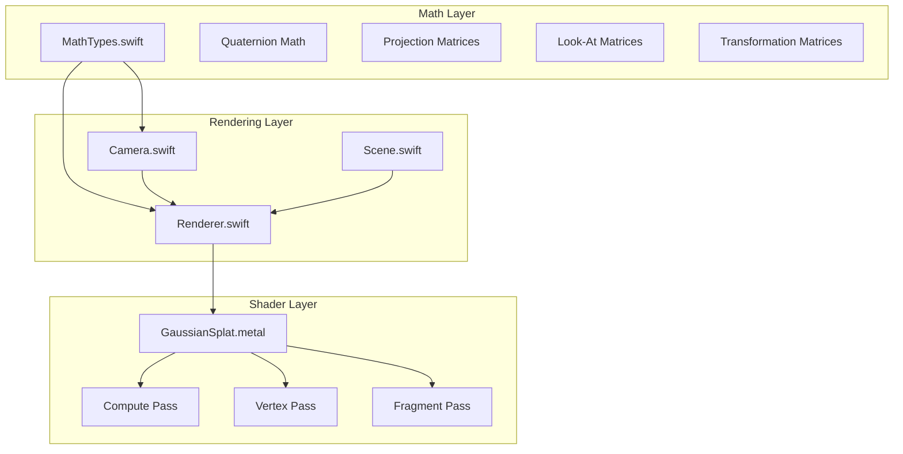
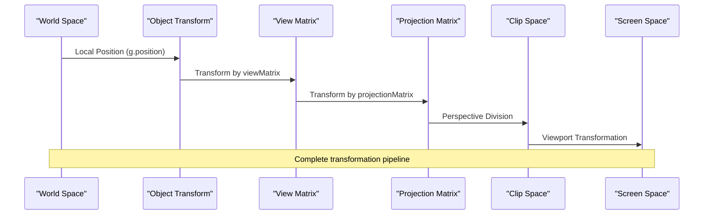
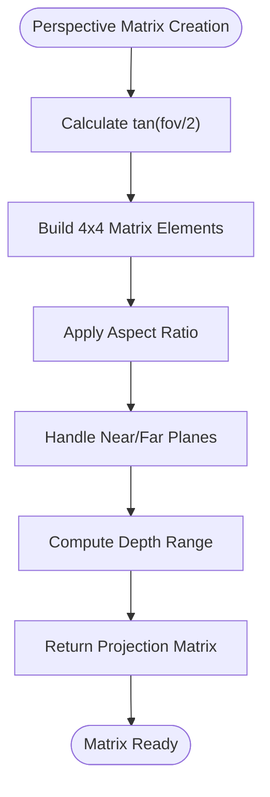
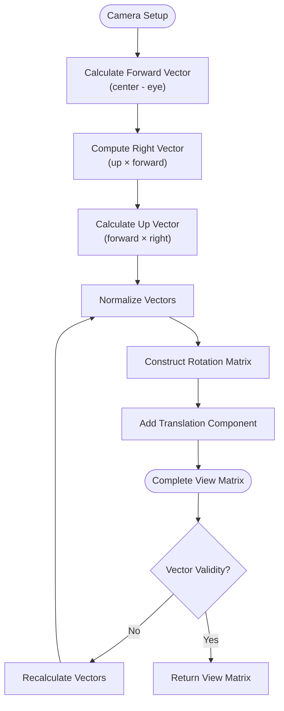
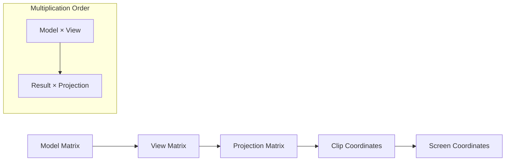
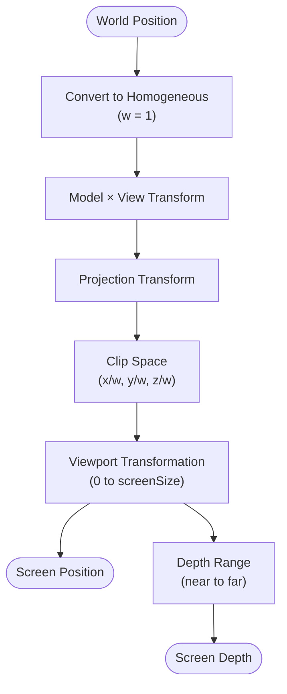
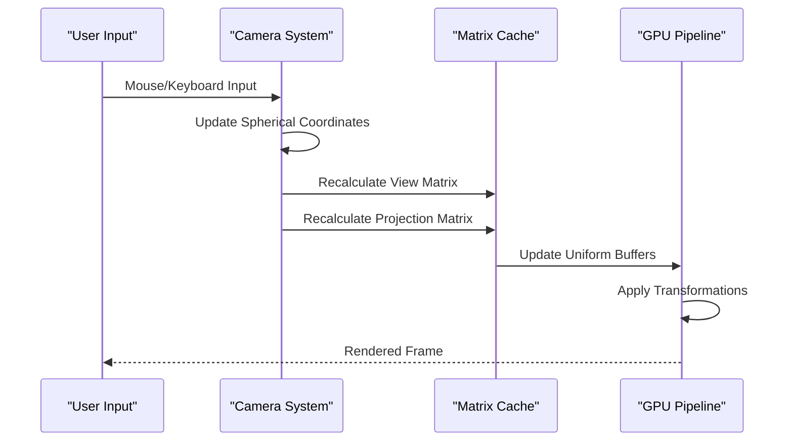
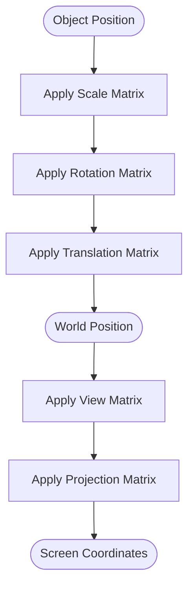
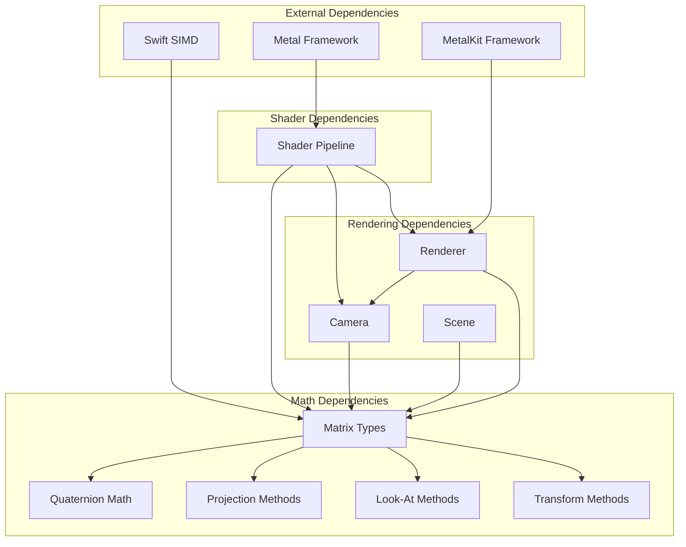

# Matrix Operations

<cite>
**Referenced Files in This Document**
- [MathTypes.swift](file://Math/MathTypes.swift)
- [Camera.swift](file://Rendering/Camera.swift)
- [Renderer.swift](file://Rendering/Renderer.swift)
- [GaussianSplat.metal](file://Shaders/GaussianSplat.metal)
- [Scene.swift](file://Scene/Scene.swift)
</cite>

## Table of Contents
1. [Introduction](#introduction)
2. [Project Structure](#project-structure)
3. [Core Components](#core-components)
4. [Architecture Overview](#architecture-overview)
5. [Detailed Component Analysis](#detailed-component-analysis)
6. [Dependency Analysis](#dependency-analysis)
7. [Performance Considerations](#performance-considerations)
8. [Troubleshooting Guide](#troubleshooting-guide)
9. [Conclusion](#conclusion)

## Introduction
This document provides comprehensive documentation for matrix operations and transformations used in 3D graphics within the Gaussian Splatting viewer. The project implements essential matrix mathematics for camera positioning, perspective projection, and transformation pipelines. It covers the creation of perspective projection matrices using the perspective method, look-at matrix construction for camera positioning, and transformation matrices including translation, scaling, and rotation implementations. The documentation explains matrix multiplication order, homogeneous coordinates, and viewport transformations, along with practical examples of matrix composition for camera and object transformations in the complete transformation pipeline from world space to screen space.

## Project Structure
The matrix operations are distributed across several key components:

**Diagram sources**
- [MathTypes.swift:103-167](file://Math/MathTypes.swift#L103-L167)
- [Camera.swift:5-84](file://Rendering/Camera.swift#L5-L84)
- [Renderer.swift:7-77](file://Rendering/Renderer.swift#L7-L77)
- [GaussianSplat.metal:146-278](file://Shaders/GaussianSplat.metal#L146-L278)

**Section sources**
- [MathTypes.swift:1-189](file://Math/MathTypes.swift#L1-L189)
- [Camera.swift:1-184](file://Rendering/Camera.swift#L1-L184)
- [Renderer.swift:1-289](file://Rendering/Renderer.swift#L1-L289)

## Core Components

### Matrix Mathematics Foundation
The project implements fundamental matrix operations using Swift's SIMD library. The core mathematical foundation includes:

- **Type Aliases**: Simplified type definitions for vector and matrix operations
- **Quaternion Operations**: Axis-angle conversion and rotation matrix generation
- **Matrix Extensions**: Comprehensive matrix manipulation functions

**Section sources**
- [MathTypes.swift:5-101](file://Math/MathTypes.swift#L5-L101)
- [MathTypes.swift:103-167](file://Math/MathTypes.swift#L103-L167)

### Camera System Implementation
The Camera class manages the complete camera transformation pipeline:

- **Orbit Control**: Spherical coordinate-based navigation
- **Matrix Management**: Separate view, projection, and combined matrices
- **Dynamic Updates**: Real-time matrix recalculation during interaction

**Section sources**
- [Camera.swift:5-84](file://Rendering/Camera.swift#L5-L84)
- [Camera.swift:133-147](file://Rendering/Camera.swift#L133-L147)

### GPU Pipeline Integration
The Renderer coordinates the complete graphics pipeline:

- **Triple Buffering**: Camera uniforms with frame synchronization
- **Compute Pass**: Gaussian projection and covariance computation
- **Render Pass**: Instanced quad rendering with alpha blending

**Section sources**
- [Renderer.swift:7-77](file://Rendering/Renderer.swift#L7-L77)
- [Renderer.swift:167-251](file://Rendering/Renderer.swift#L167-L251)

## Architecture Overview

The transformation pipeline follows a well-defined sequence from world space to screen space:

**Diagram sources**
- [GaussianSplat.metal:183-190](file://Shaders/GaussianSplat.metal#L183-L190)
- [Camera.swift:70-83](file://Rendering/Camera.swift#L70-L83)

The pipeline consists of four main stages:
1. **Object Space**: Individual Gaussian positions
2. **World Space**: Scene-level transformations
3. **View Space**: Camera-relative coordinates
4. **Clip Space**: Homogeneous coordinates for projection
5. **Screen Space**: Final pixel coordinates

## Detailed Component Analysis

### Perspective Projection Matrix Implementation

The perspective projection matrix creates realistic 3D-to-2D projection with proper depth handling:

**Diagram sources**
- [MathTypes.swift:107-117](file://Math/MathTypes.swift#L107-L117)

Key implementation details:
- **Field-of-View Calculation**: Uses tangent of half-angle for accurate projection
- **Aspect Ratio Handling**: Maintains correct proportions across different screen sizes
- **Depth Range Management**: Proper near/far plane calculations for depth precision
- **Matrix Structure**: Implements standard OpenGL-compatible projection matrix

**Section sources**
- [MathTypes.swift:107-117](file://Math/MathTypes.swift#L107-L117)
- [Camera.swift:74-80](file://Rendering/Camera.swift#L74-L80)

### Look-At Matrix Construction

The look-at matrix establishes camera orientation and position:

**Diagram sources**
- [MathTypes.swift:119-131](file://Math/MathTypes.swift#L119-L131)

Implementation characteristics:
- **Coordinate System**: Right-handed coordinate system with proper vector orthogonality
- **Matrix Layout**: Column-major storage compatible with Metal/MetalKit
- **Translation Component**: Proper camera position encoding in the fourth column
- **Vector Validation**: Robust normalization to prevent degenerate matrices

**Section sources**
- [MathTypes.swift:119-131](file://Math/MathTypes.swift#L119-L131)
- [Camera.swift:70-71](file://Rendering/Camera.swift#L70-L71)

### Transformation Matrices

The project implements standard transformation matrices for 3D operations:

#### Translation Matrix
Creates displacement transformations:
- **Structure**: Identity matrix with translation vector in fourth column
- **Application**: Moves objects without changing orientation
- **Usage**: Camera positioning and object placement

#### Scale Matrix  
Handles uniform and non-uniform scaling:
- **Implementation**: Diagonal matrix with scale factors
- **Properties**: Preserves orientation while changing size
- **Applications**: Object sizing and distortion effects

#### Rotation Matrix
Converts quaternions to rotation matrices:
- **Quaternion Input**: Supports axis-angle representation
- **Matrix Output**: 3x3 rotation component for transformation
- **Normalization**: Automatic quaternion normalization

**Section sources**
- [MathTypes.swift:133-146](file://Math/MathTypes.swift#L133-L146)
- [MathTypes.swift:76-101](file://Math/MathTypes.swift#L76-L101)

### Matrix Multiplication Order

The transformation pipeline follows right-to-left multiplication order:

**Diagram sources**
- [GaussianSplat.metal:187-189](file://Shaders/GaussianSplat.metal#L187-L189)
- [Camera.swift:83](file://Rendering/Camera.swift#L83)

Key ordering principles:
- **Model-View-Projection**: Standard OpenGL pipeline order
- **Matrix Multiplication**: Right-to-left application sequence
- **Homogeneous Coordinates**: Proper 4D vector handling
- **Viewport Transformation**: Final screen space conversion

**Section sources**
- [GaussianSplat.metal:187-190](file://Shaders/GaussianSplat.metal#L187-L190)
- [Camera.swift:83](file://Rendering/Camera.swift#L83)

### Homogeneous Coordinates and Viewport Transformations

The shader implementation handles homogeneous coordinate processing:

**Diagram sources**
- [GaussianSplat.metal:183-190](file://Shaders/GaussianSplat.metal#L183-L190)

Processing pipeline:
- **Homogeneous Conversion**: Adds w-component for perspective division
- **Perspective Division**: Computes normalized device coordinates
- **Viewport Mapping**: Transforms NDC to screen pixel coordinates
- **Depth Range**: Maintains proper depth precision for rendering

**Section sources**
- [GaussianSplat.metal:183-190](file://Shaders/GaussianSplat.metal#L183-L190)

### Practical Matrix Composition Examples

#### Camera Transformation Composition
The camera system demonstrates proper matrix composition:

**Diagram sources**
- [Camera.swift:62-84](file://Rendering/Camera.swift#L62-L84)
- [Renderer.swift:253-260](file://Rendering/Renderer.swift#L253-L260)

#### Object Transformation Example
Individual Gaussian transformations showcase object-level matrix operations:

**Diagram sources**
- [MathTypes.swift:170-187](file://Math/MathTypes.swift#L170-L187)
- [GaussianSplat.metal:166-171](file://Shaders/GaussianSplat.metal#L166-L171)

## Dependency Analysis

The matrix operation system exhibits well-structured dependencies:

**Diagram sources**
- [MathTypes.swift:103-167](file://Math/MathTypes.swift#L103-L167)
- [Camera.swift:5-84](file://Rendering/Camera.swift#L5-L84)
- [Renderer.swift:7-77](file://Rendering/Renderer.swift#L7-L77)

Key dependency characteristics:
- **Math Layer Independence**: Pure mathematical operations with minimal external dependencies
- **Rendering Integration**: Camera and renderer depend on mathematical foundations
- **Shader Coordination**: GPU shaders utilize CPU-side matrix computations
- **Framework Integration**: Metal and MetalKit provide hardware acceleration

**Section sources**
- [MathTypes.swift:103-167](file://Math/MathTypes.swift#L103-L167)
- [Camera.swift:5-84](file://Rendering/Camera.swift#L5-L84)
- [Renderer.swift:7-77](file://Rendering/Renderer.swift#L7-L77)

## Performance Considerations

### Matrix Operation Efficiency
The implementation prioritizes computational efficiency:

- **SIMD Utilization**: Leverages vectorized operations for parallel processing
- **Memory Alignment**: Proper alignment for optimal GPU memory access
- **Triple Buffering**: Reduces synchronization overhead in uniform updates
- **Batch Processing**: Efficient handling of multiple Gaussian transformations

### Computational Pipeline Optimization
- **Separate Compute Pass**: Offloads projection calculations to compute shaders
- **Instanced Rendering**: Minimizes draw call overhead for large Gaussian sets
- **Selective Sorting**: Frame-rate based depth sorting to balance quality and performance
- **Early Culling**: Discards invisible Gaussians before expensive computations

## Troubleshooting Guide

### Common Matrix Issues

#### Perspective Projection Problems
- **Symptom**: Objects appear distorted or clipped
- **Cause**: Incorrect field-of-view calculation or near/far plane values
- **Solution**: Verify FOV in radians and ensure near/far planes are positive and ordered

#### Look-At Matrix Degeneracies
- **Symptom**: Camera flips or rotates unexpectedly
- **Cause**: Invalid up-vector or collinear eye/center vectors
- **Solution**: Ensure up-vector is not parallel to forward vector and maintain reasonable coordinate ranges

#### Transformation Order Issues
- **Symptom**: Objects transform incorrectly relative to expectations
- **Cause**: Wrong matrix multiplication order or improper vector handling
- **Solution**: Follow right-to-left multiplication order and ensure homogeneous coordinate usage

#### Performance Bottlenecks
- **Symptom**: Low frame rates with large Gaussian counts
- **Cause**: Excessive compute operations or memory bandwidth limitations
- **Solution**: Implement selective sorting, optimize shader computations, and consider LOD strategies

**Section sources**
- [MathTypes.swift:107-117](file://Math/MathTypes.swift#L107-L117)
- [MathTypes.swift:119-131](file://Math/MathTypes.swift#L119-L131)
- [GaussianSplat.metal:183-190](file://Shaders/GaussianSplat.metal#L183-L190)

## Conclusion

The Gaussian Splatting viewer demonstrates robust implementation of 3D matrix operations and transformations. The system successfully integrates mathematical foundations with practical rendering pipeline requirements, providing:

- **Comprehensive Matrix Support**: Complete set of transformation matrices with proper mathematical foundations
- **Realistic Projection**: Accurate perspective projection with depth handling and viewport transformation
- **Flexible Camera Control**: Sophisticated orbit camera system with dynamic matrix updates
- **Efficient GPU Pipeline**: Optimized compute and render passes for real-time performance
- **Robust Error Handling**: Proper validation and fallback mechanisms for numerical stability

The implementation serves as an excellent example of how mathematical principles translate into practical graphics programming, offering both educational value and production-ready functionality for 3D Gaussian rendering applications.