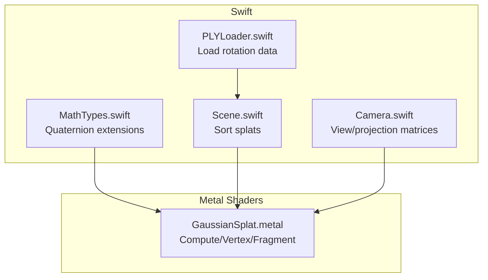
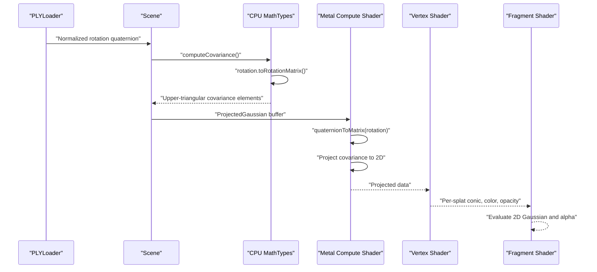
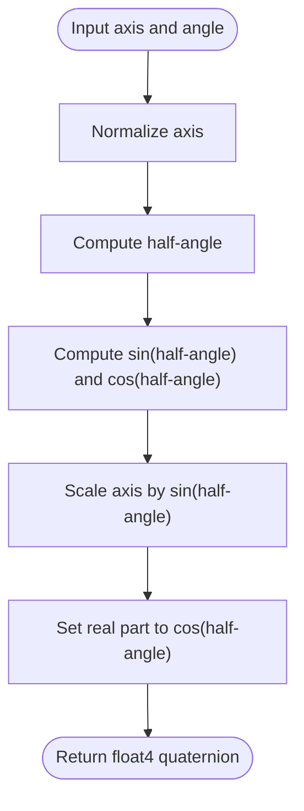
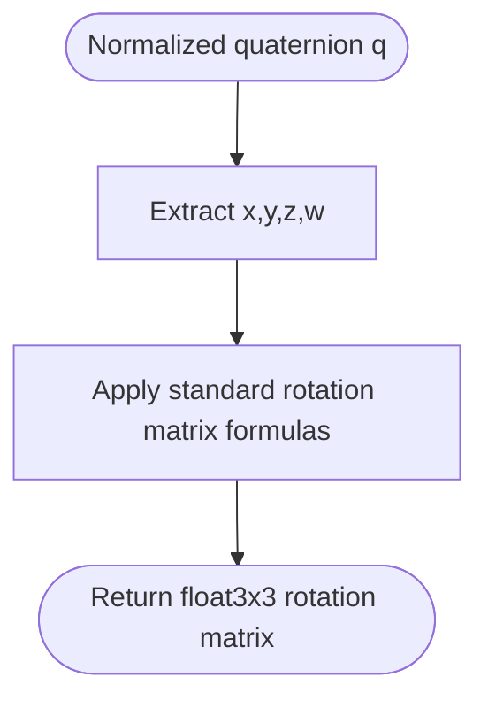
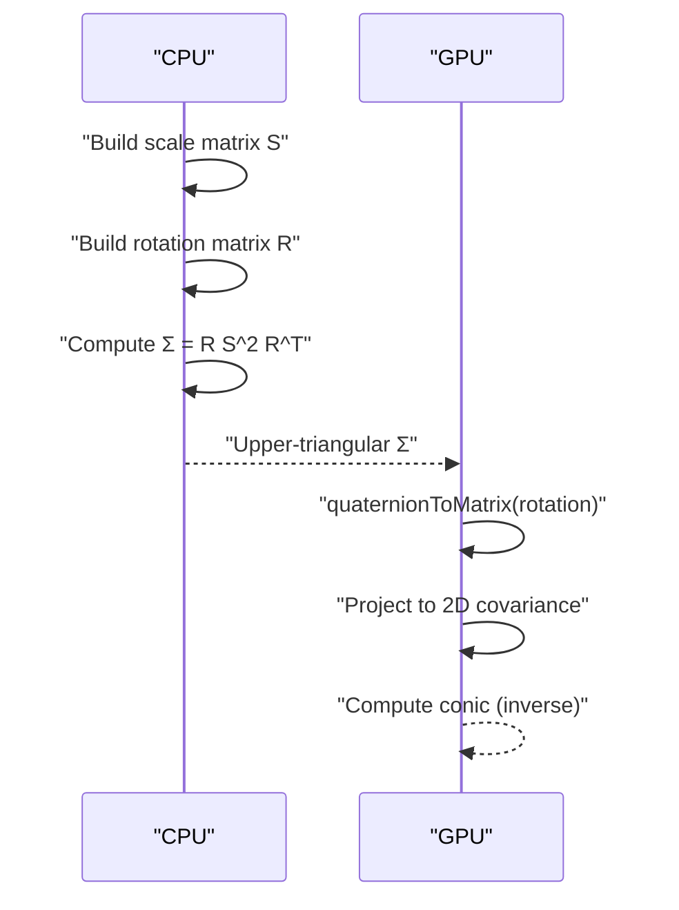
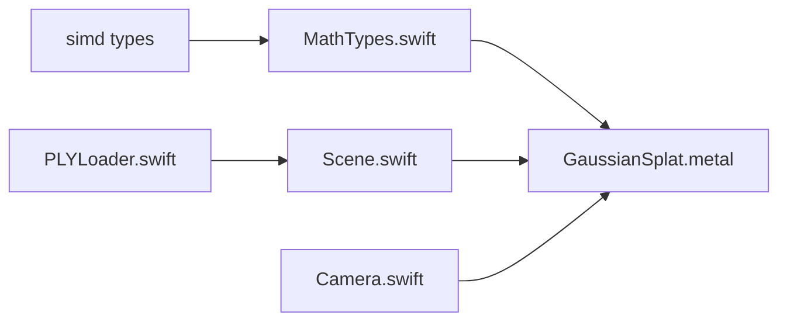

# Quaternion Mathematics

<cite>
**Referenced Files in This Document**
- [MathTypes.swift](file://Math/MathTypes.swift)
- [GaussianSplat.metal](file://Shaders/GaussianSplat.metal)
- [PLYLoader.swift](file://Scene/PLYLoader.swift)
- [Camera.swift](file://Rendering/Camera.swift)
- [Scene.swift](file://Scene/Scene.swift)
</cite>

## Table of Contents
1. [Introduction](#introduction)
2. [Project Structure](#project-structure)
3. [Core Components](#core-components)
4. [Architecture Overview](#architecture-overview)
5. [Detailed Component Analysis](#detailed-component-analysis)
6. [Dependency Analysis](#dependency-analysis)
7. [Performance Considerations](#performance-considerations)
8. [Troubleshooting Guide](#troubleshooting-guide)
9. [Conclusion](#conclusion)

## Introduction
This document explains quaternion mathematics for 3D rotations in the Gaussian splat rendering pipeline. It covers quaternion theory, representation, normalization, axis-angle construction, conversion to rotation matrices, and how these operations are used to compute 2D covariance for splats. Practical examples show how quaternions drive camera orientation and splat orientations during projection and rendering.

## Project Structure
The quaternion-related logic spans Swift math utilities, GPU shaders, and data loading:
- Swift math utilities define quaternion types, normalization, axis-angle construction, and conversion to rotation matrices.
- GPU shaders mirror quaternion normalization and matrix conversion for compute and vertex/fragment stages.
- PLY loader reads rotation data from files and normalizes quaternions for use in the scene.
- Camera and scene code integrate quaternions indirectly via rotation matrices and splat covariance computations.

**Diagram sources**
- [MathTypes.swift:75-101](file://Math/MathTypes.swift#L75-L101)
- [GaussianSplat.metal:44-60](file://Shaders/GaussianSplat.metal#L44-L60)
- [PLYLoader.swift:344-350](file://Scene/PLYLoader.swift#L344-L350)
- [Scene.swift:106-121](file://Scene/Scene.swift#L106-L121)
- [Camera.swift:62-84](file://Rendering/Camera.swift#L62-L84)

**Section sources**
- [MathTypes.swift:75-101](file://Math/MathTypes.swift#L75-L101)
- [GaussianSplat.metal:44-60](file://Shaders/GaussianSplat.metal#L44-L60)
- [PLYLoader.swift:344-350](file://Scene/PLYLoader.swift#L344-L350)
- [Scene.swift:106-121](file://Scene/Scene.swift#L106-L121)
- [Camera.swift:62-84](file://Rendering/Camera.swift#L62-L84)

## Core Components
- Quaternion representation: Stored as float4 (x, y, z, w) in both CPU and GPU data structures.
- Normalization: Ensures unit-length quaternions for valid rotations.
- Axis-angle construction: Builds a unit quaternion from an axis vector and angle.
- Rotation matrix conversion: Converts a normalized quaternion to a 3x3 rotation matrix.
- Covariance computation: Uses rotation and scale to compute 3D covariance, later projected to 2D.

Key implementation locations:
- Axis-angle and normalization: [MathTypes.swift:77-88](file://Math/MathTypes.swift#L77-L88)
- Rotation matrix conversion: [MathTypes.swift:90-100](file://Math/MathTypes.swift#L90-L100)
- GPU quaternion helpers: [GaussianSplat.metal:46-60](file://Shaders/GaussianSplat.metal#L46-L60)
- Loading normalized rotation: [PLYLoader.swift:344-350](file://Scene/PLYLoader.swift#L344-L350)

**Section sources**
- [MathTypes.swift:75-101](file://Math/MathTypes.swift#L75-L101)
- [GaussianSplat.metal:44-60](file://Shaders/GaussianSplat.metal#L44-L60)
- [PLYLoader.swift:344-350](file://Scene/PLYLoader.swift#L344-L350)

## Architecture Overview
Quaternions flow from data loading into GPU computation and rendering:
- PLYLoader reads rotation components and normalizes them into unit quaternions.
- CPU computes 3D covariance using rotation.toRotationMatrix and scale.
- GPU compute shader converts quaternions to rotation matrices and projects covariance to 2D.
- Vertex and fragment shaders render splats using 2D covariance and pre-multiplied alpha.

**Diagram sources**
- [PLYLoader.swift:344-350](file://Scene/PLYLoader.swift#L344-L350)
- [MathTypes.swift:170-188](file://Math/MathTypes.swift#L170-L188)
- [GaussianSplat.metal:65-78](file://Shaders/GaussianSplat.metal#L65-L78)
- [GaussianSplat.metal:146-209](file://Shaders/GaussianSplat.metal#L146-L209)

## Detailed Component Analysis

### Quaternion Theory and Representation
- A quaternion q = x i + y j + z k + w is represented as float4(x, y, z, w).
- Unit quaternions represent 3D rotations without singularities.
- The real part w encodes cosine of half-angle; imaginary parts (x, y, z) encode axis scaled by sine of half-angle.

Practical implications:
- Always normalize quaternions before converting to matrices.
- Axis-angle construction uses half-angle identities to build unit quaternions.

**Section sources**
- [MathTypes.swift:14-30](file://Math/MathTypes.swift#L14-L30)
- [MathTypes.swift:77-82](file://Math/MathTypes.swift#L77-L82)

### Normalization and Conjugation
- Normalization ensures ||q|| ≠ 0; if zero, defaults to identity quaternion (w = 1).
- Conjugation (used implicitly in matrix derivation) flips imaginary signs; it is essential for inverse rotations and matrix symmetry.

Numerical stability:
- Avoid division by zero by checking length before normalization.
- Default to identity when length is negligible.

**Section sources**
- [MathTypes.swift:84-88](file://Math/MathTypes.swift#L84-L88)
- [GaussianSplat.metal:46-49](file://Shaders/GaussianSplat.metal#L46-L49)

### Axis-Angle Construction
- fromAxisAngle constructs a unit quaternion from a normalized axis and angle.
- Uses half-angle identities: sin(θ/2) and cos(θ/2) scaling the axis.

Applications:
- Camera orientation updates (elevation/azimuth) indirectly influence rotation matrices used for view/projection.
- Splats can be initialized with axis-angle rotations for pose adjustments.

**Diagram sources**
- [MathTypes.swift:77-82](file://Math/MathTypes.swift#L77-L82)

**Section sources**
- [MathTypes.swift:77-82](file://Math/MathTypes.swift#L77-L82)

### Quaternion-to-Matrix Conversion
- The normalized quaternion is converted to a 3x3 rotation matrix using standard formulas.
- The matrix preserves orthogonality and determinant 1, suitable for transforming 3D covariance.

Implementation details:
- CPU: rotation.toRotationMatrix in [MathTypes.swift:90-100](file://Math/MathTypes.swift#L90-L100)
- GPU: quaternionToMatrix in [GaussianSplat.metal:51-60](file://Shaders/GaussianSplat.metal#L51-L60)

**Diagram sources**
- [MathTypes.swift:90-100](file://Math/MathTypes.swift#L90-L100)
- [GaussianSplat.metal:51-60](file://Shaders/GaussianSplat.metal#L51-L60)

**Section sources**
- [MathTypes.swift:90-100](file://Math/MathTypes.swift#L90-L100)
- [GaussianSplat.metal:51-60](file://Shaders/GaussianSplat.metal#L51-L60)

### Covariance Computation and Projection
- 3D covariance computed from scale and rotation: Σ = R S S^T R^T = R S^2 R^T.
- Upper-triangular elements are passed to GPU for 2D projection.
- GPU projects 3D covariance to 2D using view/projection matrices and computes the conic (inverse covariance).

**Diagram sources**
- [MathTypes.swift:170-188](file://Math/MathTypes.swift#L170-L188)
- [GaussianSplat.metal:65-78](file://Shaders/GaussianSplat.metal#L65-L78)
- [GaussianSplat.metal:166-171](file://Shaders/GaussianSplat.metal#L166-L171)

**Section sources**
- [MathTypes.swift:170-188](file://Math/MathTypes.swift#L170-L188)
- [GaussianSplat.metal:65-78](file://Shaders/GaussianSplat.metal#L65-L78)
- [GaussianSplat.metal:166-171](file://Shaders/GaussianSplat.metal#L166-L171)

### Camera and Splats Integration
- Camera builds view and projection matrices; splat positions and rotations are transformed in the GPU pipeline.
- Scene sorting uses camera position and forward vector to order splats for correct blending.

**Section sources**
- [Camera.swift:62-84](file://Rendering/Camera.swift#L62-L84)
- [Scene.swift:106-121](file://Scene/Scene.swift#L106-L121)

## Dependency Analysis
- CPU math depends on simd types and defines float4 extensions for quaternion operations.
- GPU shaders depend on Metal math types and mirror CPU quaternion logic.
- PLYLoader depends on float4 normalization to ensure valid rotations.
- Scene sorting depends on camera vectors for depth comparisons.

**Diagram sources**
- [MathTypes.swift:1-10](file://Math/MathTypes.swift#L1-L10)
- [GaussianSplat.metal:1-3](file://Shaders/GaussianSplat.metal#L1-L3)
- [PLYLoader.swift:344-350](file://Scene/PLYLoader.swift#L344-L350)
- [Scene.swift:106-121](file://Scene/Scene.swift#L106-L121)
- [Camera.swift:62-84](file://Rendering/Camera.swift#L62-L84)

**Section sources**
- [MathTypes.swift:1-10](file://Math/MathTypes.swift#L1-L10)
- [GaussianSplat.metal:1-3](file://Shaders/GaussianSplat.metal#L1-L3)
- [PLYLoader.swift:344-350](file://Scene/PLYLoader.swift#L344-L350)
- [Scene.swift:106-121](file://Scene/Scene.swift#L106-L121)
- [Camera.swift:62-84](file://Rendering/Camera.swift#L62-L84)

## Performance Considerations
- Prefer normalized quaternions to avoid numerical drift; normalization is O(1) and cheap.
- Use axis-angle construction for incremental rotations; it avoids accumulating errors compared to repeated matrix multiplications.
- In GPU compute, reuse normalized quaternions and avoid redundant normalization.
- Covariance computation is linear in matrix sizes; keep scale diagonal to minimize operations.

## Troubleshooting Guide
Common issues and remedies:
- Zero-length quaternion: Normalization guards against division by zero; ensure input quaternions are valid.
- Non-unit quaternion leading to shearing: Always call normalized before toRotationMatrix or GPU quaternionToMatrix.
- Incorrect splat orientation: Verify axis-angle inputs and ensure angles are in radians.
- Visibility artifacts: If 2D covariance determinant is zero, conic inversion fails; ensure scales and rotations produce invertible covariance.

**Section sources**
- [MathTypes.swift:84-88](file://Math/MathTypes.swift#L84-L88)
- [GaussianSplat.metal:46-49](file://Shaders/GaussianSplat.metal#L46-L49)
- [GaussianSplat.metal:174-181](file://Shaders/GaussianSplat.metal#L174-L181)

## Conclusion
Quaternions provide a robust, singularity-free representation for 3D rotations in Gaussian splat rendering. The codebase implements axis-angle construction, normalization, and conversion to rotation matrices on both CPU and GPU. These operations enable accurate covariance computation and 2D projection, forming the backbone of splat rendering quality and performance.