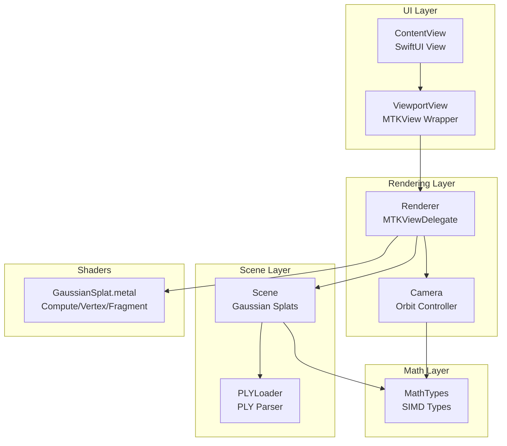
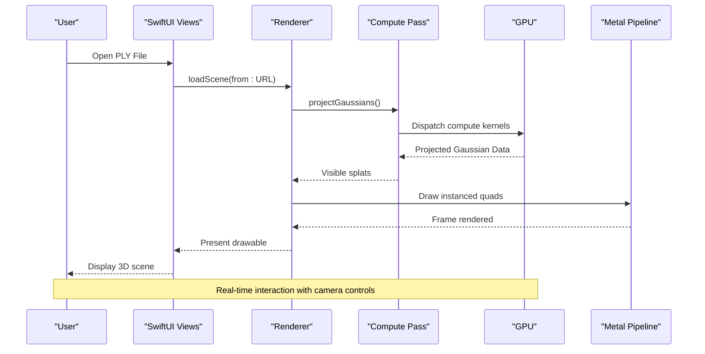
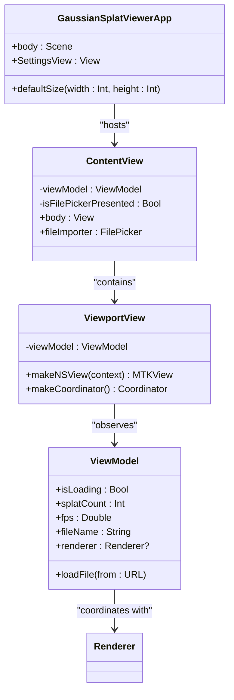
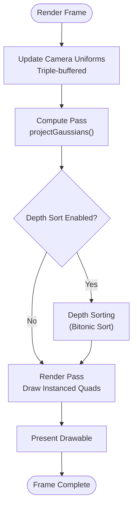
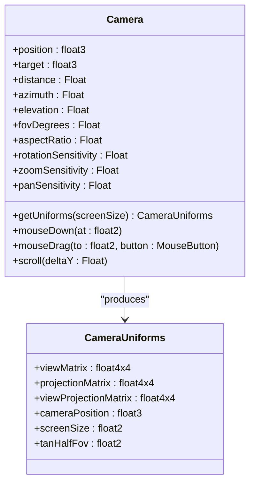
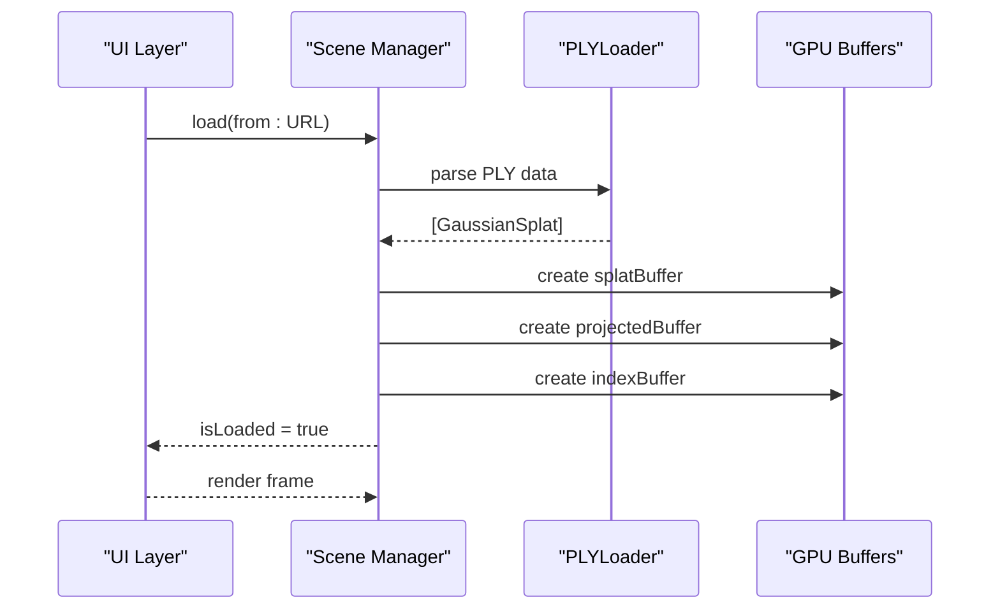
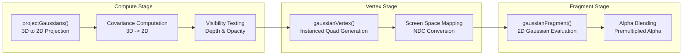
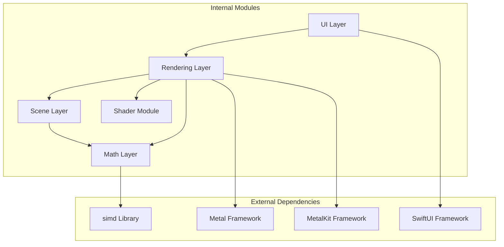

# Project Overview

<cite>
**Referenced Files in This Document**
- [GaussianSplatViewerApp.swift](file://Sources/GaussianSplatViewerApp.swift)
- [ContentView.swift](file://Sources/UI/ContentView.swift)
- [ViewportView.swift](file://Sources/UI/ViewportView.swift)
- [Renderer.swift](file://Sources/Rendering/Renderer.swift)
- [Camera.swift](file://Sources/Rendering/Camera.swift)
- [Scene.swift](file://Sources/Scene/Scene.swift)
- [PLYLoader.swift](file://Sources/Scene/PLYLoader.swift)
- [MathTypes.swift](file://Sources/Math/MathTypes.swift)
- [GaussianSplat.metal](file://Sources/Shaders/GaussianSplat.metal)
- [Package.swift](file://Package.swift)
</cite>

## Table of Contents
1. [Introduction](#introduction)
2. [Project Structure](#project-structure)
3. [Core Components](#core-components)
4. [Architecture Overview](#architecture-overview)
5. [Detailed Component Analysis](#detailed-component-analysis)
6. [Dependency Analysis](#dependency-analysis)
7. [Performance Considerations](#performance-considerations)
8. [Troubleshooting Guide](#troubleshooting-guide)
9. [Conclusion](#conclusion)

## Introduction
The Gaussian Splatting Viewer for macOS is a real-time 3D visualization application designed to render and explore 3D point cloud data represented as Gaussian splats. It targets researchers and developers working with 3D point clouds, particularly those leveraging Gaussian splatting techniques for scientific visualization and rendering. The application provides interactive camera controls, native macOS integration, and GPU-accelerated rendering powered by Metal.

Key capabilities:
- Interactive camera controls: orbit, pan, and zoom with intuitive mouse gestures
- PLY file support: loading and rendering 3D point cloud data in Stanford PLY format
- GPU-accelerated rendering: compute shaders for projecting Gaussian splats and Metal vertex/fragment shaders for rasterization
- Triple-buffered uniforms: efficient synchronization between CPU and GPU for camera parameters
- macOS 12+ platform support with Metal 3 backend

## Project Structure
The project follows a modular Swift/Metal architecture organized by concerns:
- UI layer: SwiftUI views and MetalKit integration
- Rendering layer: Metal pipeline creation, compute and render passes
- Scene layer: PLY parsing, Gaussian splat data management, GPU buffer allocation
- Math layer: SIMD-based math types and GPU-compatible structures
- Shaders: Metal compute and fragment shaders for Gaussian splat rendering

**Diagram sources**
- [ContentView.swift:1-119](file://Sources/UI/ContentView.swift#L1-L119)
- [ViewportView.swift:1-118](file://Sources/UI/ViewportView.swift#L1-L118)
- [Renderer.swift:1-288](file://Sources/Rendering/Renderer.swift#L1-L288)
- [Camera.swift:1-184](file://Sources/Rendering/Camera.swift#L1-L184)
- [Scene.swift:1-130](file://Sources/Scene/Scene.swift#L1-L130)
- [PLYLoader.swift:1-386](file://Sources/Scene/PLYLoader.swift#L1-L386)
- [MathTypes.swift:1-189](file://Sources/Math/MathTypes.swift#L1-L189)
- [GaussianSplat.metal:1-309](file://Sources/Shaders/GaussianSplat.metal#L1-L309)

**Section sources**
- [Package.swift:1-17](file://Package.swift#L1-L17)
- [GaussianSplatViewerApp.swift:1-65](file://Sources/GaussianSplatViewerApp.swift#L1-L65)

## Core Components
The application consists of several interconnected components that work together to render Gaussian splats in real-time:

### Gaussian Splats
Gaussian splats represent individual 3D points with associated spatial extent, orientation, color, and opacity. The system uses GPU-friendly data structures optimized for compute shader processing and Metal rendering.

### Compute Pipeline
The compute shader projects Gaussian splats from 3D world space to 2D screen space while computing covariance projections and visibility. This offloads heavy per-splat computations from the CPU to the GPU.

### Render Pipeline
The Metal render pipeline draws instanced quads for each Gaussian splat, using vertex and fragment shaders to evaluate 2D Gaussian functions and composite colors with alpha blending.

### Camera System
An orbit camera controller manages position, target, and field-of-view with sensitivity controls for smooth navigation. It generates view and projection matrices used throughout the rendering pipeline.

**Section sources**
- [MathTypes.swift:10-74](file://Sources/Math/MathTypes.swift#L10-L74)
- [GaussianSplat.metal:138-198](file://Sources/Shaders/GaussianSplat.metal#L138-L198)
- [Renderer.swift:83-129](file://Sources/Rendering/Renderer.swift#L83-L129)
- [Camera.swift:4-84](file://Sources/Rendering/Camera.swift#L4-L84)

## Architecture Overview
The system employs a classic graphics pipeline with compute preprocessing:

**Diagram sources**
- [Renderer.swift:149-250](file://Sources/Rendering/Renderer.swift#L149-L250)
- [GaussianSplat.metal:138-270](file://Sources/Shaders/GaussianSplat.metal#L138-L270)

The architecture separates concerns between data loading and preparation (compute pass) and final rendering (render pass), enabling efficient GPU utilization and smooth frame rates.

## Detailed Component Analysis

### UI and Application Entry Point
The application uses SwiftUI for the user interface and integrates with MetalKit for GPU rendering. The main app structure provides window management and macOS-specific settings.

**Diagram sources**
- [GaussianSplatViewerApp.swift:3-18](file://Sources/GaussianSplatViewerApp.swift#L3-L18)
- [ContentView.swift:3-119](file://Sources/UI/ContentView.swift#L3-L119)
- [ViewportView.swift:5-118](file://Sources/UI/ViewportView.swift#L5-L118)

**Section sources**
- [GaussianSplatViewerApp.swift:20-65](file://Sources/GaussianSplatViewerApp.swift#L20-L65)
- [ContentView.swift:1-119](file://Sources/UI/ContentView.swift#L1-L119)
- [ViewportView.swift:1-118](file://Sources/UI/ViewportView.swift#L1-L118)

### Rendering Pipeline
The renderer manages Metal device initialization, pipeline creation, and the dual-pass rendering process. It implements triple-buffered uniform synchronization for efficient GPU-CPU communication.

**Diagram sources**
- [Renderer.swift:171-250](file://Sources/Rendering/Renderer.swift#L171-L250)
- [GaussianSplat.metal:274-309](file://Sources/Shaders/GaussianSplat.metal#L274-L309)

**Section sources**
- [Renderer.swift:37-79](file://Sources/Rendering/Renderer.swift#L37-L79)
- [Renderer.swift:131-145](file://Sources/Rendering/Renderer.swift#L131-L145)
- [Renderer.swift:252-266](file://Sources/Rendering/Renderer.swift#L252-L266)

### Camera Control System
The camera implements an orbit controller with configurable sensitivity parameters for rotation, zoom, and panning. It maintains view and projection matrices and handles user input events.

**Diagram sources**
- [Camera.swift:5-177](file://Sources/Rendering/Camera.swift#L5-L177)
- [MathTypes.swift:54-62](file://Sources/Math/MathTypes.swift#L54-L62)

**Section sources**
- [Camera.swift:36-131](file://Sources/Rendering/Camera.swift#L36-L131)
- [Camera.swift:134-177](file://Sources/Rendering/Camera.swift#L134-L177)

### Scene Management and Data Loading
The scene manager handles PLY file parsing, Gaussian splat data conversion, and GPU buffer allocation. It supports multiple PLY formats and extracts essential properties for rendering.

**Diagram sources**
- [Scene.swift:24-85](file://Sources/Scene/Scene.swift#L24-L85)
- [PLYLoader.swift:41-68](file://Sources/Scene/PLYLoader.swift#L41-L68)

**Section sources**
- [Scene.swift:1-130](file://Sources/Scene/Scene.swift#L1-L130)
- [PLYLoader.swift:1-386](file://Sources/Scene/PLYLoader.swift#L1-L386)

### Shader Implementation
The Metal shader program implements the mathematical foundation of Gaussian splatting with compute, vertex, and fragment stages.

**Diagram sources**
- [GaussianSplat.metal:138-270](file://Sources/Shaders/GaussianSplat.metal#L138-L270)

**Section sources**
- [GaussianSplat.metal:138-198](file://Sources/Shaders/GaussianSplat.metal#L138-L198)
- [GaussianSplat.metal:200-270](file://Sources/Shaders/GaussianSplat.metal#L200-L270)

## Dependency Analysis
The project exhibits clean separation of concerns with minimal coupling between layers:

**Diagram sources**
- [Renderer.swift:1-5](file://Sources/Rendering/Renderer.swift#L1-L5)
- [MathTypes.swift:1-3](file://Sources/Math/MathTypes.swift#L1-L3)

**Section sources**
- [Renderer.swift:1-5](file://Sources/Rendering/Renderer.swift#L1-L5)
- [MathTypes.swift:1-3](file://Sources/Math/MathTypes.swift#L1-L3)

## Performance Considerations
The application implements several optimization strategies for real-time performance:

- Triple-buffered uniforms: Reduces synchronization overhead by cycling through three uniform buffers
- Compute shader preprocessing: Offloads per-splat calculations from CPU to GPU
- Instanced rendering: Efficiently draws multiple Gaussian splats with single draw calls
- Alpha blending: Optimized for additive blending of overlapping splats
- Depth sorting: Configurable sorting interval to balance quality vs. performance

## Troubleshooting Guide
Common issues and solutions:

### Rendering Issues
- Verify Metal device availability and library loading
- Check compute and render pipeline creation errors
- Ensure proper buffer allocation and binding

### PLY Loading Problems
- Confirm PLY file format compliance
- Validate required vertex properties (position, scale, rotation, color)
- Check endianess and binary format support

### Camera Control Problems
- Adjust sensitivity parameters for comfortable navigation
- Verify mouse event handling and button mapping
- Check aspect ratio updates on resize

**Section sources**
- [Renderer.swift:37-79](file://Sources/Rendering/Renderer.swift#L37-L79)
- [PLYLoader.swift:4-10](file://Sources/Scene/PLYLoader.swift#L4-L10)
- [Camera.swift:31-35](file://Sources/Rendering/Camera.swift#L31-L35)

## Conclusion
The Gaussian Splatting Viewer demonstrates a well-architected real-time 3D visualization system that effectively combines Swift UI, Metal GPU acceleration, and mathematical foundations of Gaussian splatting. Its modular design enables easy extension and maintenance while delivering responsive performance for scientific and research applications.

The application serves as both an educational tool for understanding Gaussian splatting concepts and a practical visualization platform for researchers working with 3D point cloud data. Its macOS-native implementation with Metal 3 ensures optimal performance on modern Apple hardware.